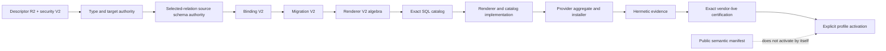

> Historical provenance: “source record NNN” names a privately archived original, not a Git ref, executable task grant or current validation result. Outcomes attached to these references retain their original historical scope. Current execution requires a separate genuine public authority chain.

<!-- Private migration draft: public bindings and approval transfer are PENDING. -->

# PostgreSQL → MSSQL R1 V3 provider implementation map

> Historical development evidence below describes source-side work. It does not certify this migration candidate. Public commit binding and the current binding inventory remain pending; no passing artifact is implied by a historical test count.

This page is the maintainer entry point for the internal, activation-blocked R1
V3 SQL Server provider. Data-product users should start with the
[public R1 overview](postgres-mssql-r1/overview.md); none of the internal
contracts below is a self-service activation surface.

## Scalar codec dependency direction

The scalar codec owns tagged values, strict framing and scalar validation. It
does not import request or receipt models. Those models reconstruct themselves
in their existing `from_canonical_bytes` methods, preserving concrete result
class identity even when called through a subclass. Field order, mode selection,
exception order and Batch/XMin canonical bytes remain unchanged. The former
standalone aggregate decode functions were unpublished implementation details;
model classmethods remain the supported decoding entry points.

## Source schema authority and runtime ownership

The prepared source boundary owns the read-only assertion that extraction ended
with successful cleanup. The selected-relation schema authority owns decoding
its selected document, catalog-column derivation and unique canonical type
decision selection. Runtime continues to own catalog I/O, snapshot lifetime,
cancellation and construction of compatibility DTOs. Issuer error translation
retains its existing direct reason mapping; canonical constructor translation
remains separate.

`dpone.adapters.postgres_mssql_source_schema_rendering` owns the fixed scalar
renderers. Existing runtime renderer imports remain available and continue to
participate in projection lookup, preserving injected test and observer behavior.
No completion assertion commits or retries cleanup, and wire bytes and schema
authority constructor fields remain unchanged.

## Type decisions and COPY transport ownership

`dpone.contracts.postgres_mssql_type_derivation` owns the immutable type-decision
value and `derive_type_decision`. Type authority retains policy coverage, order,
catalog resolution and source-column issuance. The derivation matrix, canonical
bytes and first reported errors are unchanged.

`dpone.runtime.connectors.postgres_copy_stream` owns both
`PostgresCopyStreamExporter` and `PostgresCopyFileExporter`. The stream exporter
retains its lazy chunk lifetime; the file exporter retains complete short-write
handling, metrics and primary-error cleanup behavior. The connector imports the
selected strategy lazily. Internal consumers of the unpublished file-only module
use the existing stream module; released stream exports remain available.

## Transaction execution ownership

`mssql_r1_v3_transaction_execution` owns rendered-statement admission and the
shared transaction-handle binder used by both query and mutation adapters. Each
transaction UUID admits one exact handle and physical session; concurrent binding
uses the existing lock. Quality reads stop after two rows so cardinality can be
checked without consuming an unbounded result. Distinct transaction UUIDs retain
independent bindings. All existing errors, signatures and operation ordering
remain unchanged. This internal consolidation replaces the unpublished quality
and xmin adapter modules and does not activate a concrete provider.

## Receipt model and request projection ownership

`mssql_r1_v3_receipt` owns the immutable header, Batch/XMin bodies, complete
receipt, intrinsic validation, decoding, deterministic receipt identity and
`MssqlR1ReceiptObservationV3`. The projection owner also provides
`receipt_body_for_observation`. The adapter preserves the order: observe through
its injected port, project the body, then build the receipt.
`mssql_r1_v3_receipt_projection` owns construction from an admitted attempt and
agreement checks against its retained request. Model consumers do not need the
request-construction layer. The former standalone receipt-body module is folded
into the model owner; this is an unpublished internal layout change.

All constructor fields, canonical frames, exception conditions and golden
Batch/XMin digests remain unchanged. The codec reconstructs the same root-exported
classes. This separation does not activate a concrete provider or alter commit,
recovery or replay ordering.

## Physical inventory validation ownership

The table, procedure, binding-template, resource and migration-probe modules
validate their own collections. Each validator rejects inexact tuple/member
types, invalid identity/order or noncanonical sets; it does not sort, coerce or
repair an input. Migration probes additionally require unique case-insensitive
semantic identities.

The aggregate retains checks spanning multiple collections. Its order is table,
procedure and binding inventories, their schema identities, resources, probes,
managed schema names, then the portable projection. This preserves the first
reported error when several inputs are invalid. Constructor fields, canonical
encoding and decoding, inventory constant exports and activation behavior are
unchanged. These internal validators do not provide a SQL installer or activate
a concrete provider.

## Historical source implementation status

| Layer | Specification | Implementation | Certification | Activation | Note/blocker |
|---|---|---|---|---|---|
| Physical descriptor R2 | APPROVED | implemented at `PENDING_PUBLIC_COMMIT_BINDING` | local_pass | blocked | Hermetic contract evidence only |
| Provider security V2 | APPROVED | implemented at `PENDING_PUBLIC_COMMIT_BINDING` | local_pass | blocked | Runtime EXECUTE closure: 65 focused PASS at evidence head `source record 004`; raw architecture, module-size and full non-live suites remain `FAIL`, with no candidate-only failure/error; vendor-live remains `UNVERIFIED`; bounded exception accepted by [ADR 0067](adr/source-history/0067-r1-provider-security-runtime-execute-clustering-exception.md) |
| Type and registered-target authority | APPROVED | implemented at `source record 002` | local_pass | blocked | SQL-free contracts only; vendor-live catalog/persistence evidence remains `UNVERIFIED`; bounded architecture exception accepted by [ADR 0066](adr/source-history/0066-r1-type-target-authority-clustering-exception.md) |
| Selected-relation source schema authority | APPROVED | implemented at `source record 009` | local_pass | blocked | Final Evidence V3 head `source record 010`; historical artifact (source record 010, source record 009; original location archived privately); mocked adapter evidence only, vendor-live remains `UNVERIFIED`; bounded exception accepted by [ADR 0069](adr/source-history/0069-postgres-source-schema-layer-flow-exception.md) |
| Binding V2 | APPROVED | implemented at `PENDING_PUBLIC_COMMIT_BINDING` | local_pass | blocked | Pure internal compiler; candidate evidence head `source record 026`; `artifact` (pending public commit binding; artifact not produced for this candidate) is unavailable for this candidate; the historical artifact recorded 269/269 nodes and 246/246 semantic cases PASS; raw architecture/layer/module-size and full non-live gates remain `FAIL`, vendor-live remains `UNVERIFIED`; bounded exception accepted by [ADR 0070](adr/source-history/0070-r1-provider-binding-v2-clustering-exception.md) |
| Provider attestation V2 | APPROVED | maintainer-approved locally 2026-09-12; public commit unbound | unverified | blocked | Eight foundation modules plus 42 hermetic case-registry nodes; schema `.create` and catalog `.create` golden paths exist; specification remains `APPROVED` (not `IMPLEMENTED`) until exact-commit evidence is linked; create-only retained evidence is unpublished until a privacy-cleared commit lineage exists; vendor-live remains `UNVERIFIED`; [ADR 0071](adr/source-history/0071-r1-provider-attestation-foundation.md) is historical Accepted only |
| Migration V1 research | RESEARCHED | absent | unverified | blocked | Active V2 specification absent/required |
| Renderer V1 research | RESEARCHED | absent | unverified | blocked | Active V2 specification absent/required |
| SQL-template catalog | RESEARCHED | absent | unverified | blocked | Concrete bytes unavailable |
| Provider aggregate contract | RESEARCHED | absent | unverified | blocked | Separate provider-aggregate specification absent; umbrella is an index-only historical reference |
| Installer/composition | DRAFT | absent | unverified | blocked | Separate specification not yet written |

Hermetic `PASS` never changes vendor-live certification or activation status.

## Acyclic delivery path



Every node before exact vendor-live certification has
`activation_status=blocked`.

## Normative documents

- [Industrial V7 plan](feature-design-postgres-mssql-industrial-v7.md)
- [R1 physical descriptor](feature-design-postgres-mssql-r1-v3-physical-descriptor-contract-v1.md)
- [Provider security V2 amendment](feature-design-postgres-mssql-r1-v3-provider-security-authority-amendment-v2.md)
- [Type and registered-target authority](feature-design-postgres-mssql-r1-v3-type-target-authority-v1.md)
- [Selected-relation source schema authority GREEN-v5](feature-design-postgres-mssql-r1-source-schema-authority-green-v5.md)
- [Historical source-schema V1 chronology](feature-design-postgres-mssql-r1-source-schema-authority-v1.md)
- [Provider Binding V2 candidate](feature-design-postgres-mssql-r1-v3-provider-binding-contract-v2.md)
- [Binding V2 maintainer guide](postgres-mssql-r1/binding-v2-maintainer.md)
- [Provider binding V1 historical research](feature-design-postgres-mssql-r1-v3-provider-binding-contract-v1.md)
- [Provider migration V1 research](feature-design-postgres-mssql-r1-v3-provider-migration-contract-v1.md)
- [Provider renderer V1 research](feature-design-postgres-mssql-r1-v3-provider-renderer-contract-v1.md)
- [SQL-template catalog research](feature-design-postgres-mssql-r1-v3-provider-sql-template-catalog-v1.md)
- [Provider umbrella research](feature-design-postgres-mssql-r1-v3-provider-contract-v1.md)
- [ADR 0065: single-binding install authority](adr/source-history/0065-r1-provider-single-binding-install-authority.md)
- [ADR 0067: Security V2 runtime EXECUTE correction](adr/source-history/0067-r1-provider-security-runtime-execute-clustering-exception.md)
- [ADR 0068: source-owned selected-relation schema authority](adr/source-history/0068-postgres-selected-relation-schema-authority.md)
- [ADR 0069: bounded source-schema runtime-to-contract layer flow (Accepted)](adr/source-history/0069-postgres-source-schema-layer-flow-exception.md)
- [ADR 0070: Binding V2 bounded clustering exception (Accepted)](adr/source-history/0070-r1-provider-binding-v2-clustering-exception.md)
- [Historical task requirements — Security V2 runtime EXECUTE task contract (not executable)](agent-task-history/postgres-mssql-r1-v3-provider-security-runtime-execute-v2.md)

The umbrella is an index and aggregate-boundary reference only. An approved
child owns its scope; historical sketches are never implementation authority.

## Specification approval review

For each child:

1. check out the exact candidate commit and record `git rev-parse HEAD`;
2. verify every upstream SHA named by the specification;
3. compare the complete specification with the feature-design standard and
   every accepted upstream ADR;
4. run documentation validation:

   ```bash
   .venv/bin/dpone docs check-docs
   .venv/bin/dpone docs check-generated-references
   .venv/bin/pytest tests/test_docs_language_contracts.py -q
   .venv/bin/mkdocs build --strict
   ```

5. retain raw failures and classify `PASS`, `FAIL`, `SKIP`, `N/A` or
   `UNVERIFIED` without promotion-by-omission;
6. obtain fresh architecture, code-fit/governance, test/certification and
   documentation/UX reviews against the exact commit;
7. only then let the maintainer change `RESEARCHED` to `APPROVED`;

Expected success is docs check exit `0`, focused pytest exit `0` and strict
MkDocs exit `0`. The review report itself is the approval artifact; it does not
constitute implementation or vendor-live evidence.

## Post-approval implementation review

1. create a path-scoped task contract pinned to the approved specification;
2. write the red-first focused test named by that task contract;
3. implement only the owned paths;
4. run the focused commands, then the change-aware plan:

   ```bash
   .venv/bin/python tools/agent_policy/select_checks.py --base-ref origin/master
   .venv/bin/ruff check <owned-paths>
   .venv/bin/ruff format --check <owned-paths>
   .venv/bin/mypy --config-file mypy.ini <owned-production-paths>
   .venv/bin/dpone docs check-import-rules
   .venv/bin/dpone docs check-layer-metrics --baseline docs/layer_metrics_baseline.json
   .venv/bin/dpone docs check-architecture-fitness --format json
   ```

5. execute the exact commit-aware module-size command emitted by the
   change-aware plan and the task's regression suite;
6. obtain fresh architecture and test/certification review of the exact code
   commit.

Raw nonzero results remain `FAIL` unless an exact accepted ADR explicitly
records a bounded exception; an exception never converts the raw check to
`PASS`. For the current type/target candidate the raw architecture command is
visibly `FAIL` at `avg_clustering=0.19130855252670886` against `0.182`; accepted
ADR 0066 records the bounded implementation and keeps activation blocked.
The Security V2 correction similarly remains governed by ADR 0067: its scoped
tests pass, while the raw repository architecture/module-size/full-suite
results stay visible and activation remains blocked.

If specification review finds an unresolved authority, dependency cycle or
public-contract expansion, leave the child `RESEARCHED` and resume from a new
amendment commit. If post-approval implementation review finds only a code
defect while the approved normative contract remains complete, stop the task,
leave the specification `APPROVED`, keep implementation/activation blocked and
repair under the same contract with new exact evidence. If review requires a
normative behavior, evidence, dependency or architecture amendment, supersede
the executable task, return the specification to `RESEARCHED`, obtain fresh
review and maintainer reapproval, then issue a newly pinned task contract and
RED capture. A failed evidence write never changes a committed target outcome,
and a hermetic test cannot be labeled vendor-live evidence.

## Evidence location and contract

Pure-contract tasks write no generated release evidence by default. When an
approved producer is added, its artifacts live under a repo-relative,
task-specific directory:

```text
test_artifacts/postgres-mssql-r1-v3/<task-id>/<exact-commit>/
```

JSON is authoritative and Markdown is a deterministic projection. The producer
must use create-only or atomic-replace semantics defined by its scoped spec,
write no partial success artifact and include the exact implementation and
dependency digests. Schema sketches containing placeholders or union-like text
are not valid evidence instances.

## Public compatibility impact

There is no manifest, CLI or public Python API change in these pure-contract
children. The user-visible route remains unavailable until provider aggregate,
installer, vendor-live certification and explicit capability activation are all
complete.


## Batch receipt count admission

The immutable receipt body validates both prior and final target counts as
nonnegative SQL bigint integers; booleans, fractional values and overflow are
rejected. Its final count must equal the candidate target count in the sealed
Batch quality evidence, which already agrees with the staged payload count.
For example, quality evidence for two rows cannot authorize a receipt reporting
999 final rows. The prior count remains independent because full replacement
may change table cardinality. Valid canonical receipt bytes are unchanged.

This validation runs during direct body construction and canonical decoding,
before a receipt can be admitted by a builder or exposed through a result.
Regression vectors cover invalid scalar counts, contradictory evidence,
maximum valid prior counts and canonical round-trips. Separate local PostgreSQL
tests exercise server cancellation of an active COPY, transaction/lock cleanup
and a successful second export on the same physical connection.


## Local transaction atomicity regression scope

Local SQL Server tests exercise the actual effect unit of work with a dedicated
DBAPI transaction port. A separate observer verifies exact business and receipt
bytes after quality failure, evidence insertion failure, an actual SQL constraint
error with server-side automatic abort, and a successful commit. The tests also
check physical session identity, explicit transaction count, one mutation attempt,
commit/rollback calls and successful connection closure.

Stage, generation, fence and candidate authorities in this harness are controlled
test fixtures. These checks establish SQL transaction atomicity under the unit of
work; they do not certify provider activation, generated SQL, complete schema
attestation, or recovery from an unknown commit outcome. Schema2 semantic collision
regressions separately cover columns, constraints, indexes, parameters, object
coordinates and codec identities. Permission rules with the same coordinate and
different effects remain a separate contract question.


## Recovery after an advanced committed observation

An older attempt may recover a committed receipt observed at the same or a higher
operation epoch. Recovery first decodes and validates the complete canonical proof,
including receipt, operation, resources, writer head and checkpoint. The sealed
request, effect and expected override must match the original attempt exactly.
The observed epoch cannot decrease, and its projection revision must advance by
at least the epoch increase. This revision bound follows from the rule that each
epoch transition advances the operation projection; it does not change receipt
projection construction or the canonical wire format.

A successful committed observation returns the decoded receipt without repeating
DML. Known-not-committed and unknown observations retain exact original request
coordinates. Tests cover Batch and XMin advancement, malformed and foreign proofs,
partial resources, stale coordinates, and lost-response recovery through one fresh
session after invalidating the old session. Concrete provider generation of an
advanced fresh proof remains unverified by this classifier-level regression.


## Inspectable historical schema fixtures

Historical schema1 wire fixtures are stored as canonical UTF-8 JSON tagged values.
A test-only assembler reconstructs nested frames from visible domains, text, UUIDs,
integers and collections. Digest values expose their readable preimages or explicit
repeated-byte synthetic declarations. No opaque binary frame is embedded in text.
Tests retain the original wire SHA-256 pins and schema2 rejection of legacy domains.
The assembler does not provide a production schema1 decoder or a compatibility API.
Fixture content remains subject to normal content review and privacy scanning.


Effect adapters and XMin mutation orchestration import their existing transaction
capabilities from `dpone.ports.mssql_r1_v3_effect_runtime`. This keeps their
dependency on the effect capability owner. The public V3 port facade continues to
export the same objects; protocol signatures and serialization remain unchanged.
