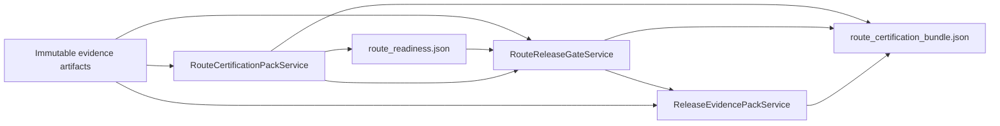

# Developer route certify

`route-certify` is the release certification bundle above existing route
evidence services. It is intentionally small and dependency-injected so the
control plane can grow without a god module.

## Module boundaries

| Module | Responsibility |
| --- | --- |
| `dpone.ops.route_certify` | `RouteCertificationService` orchestration and artifact index wiring. |
| `dpone.ops.routes.certify_models` | `RouteCertificationBundleReport`, stage models, JSON, and Markdown contract. |
| `dpone.ops.routes.certify_policy` | `RouteCertificationPolicy` and pure `certified` / `warning` / `blocked` scoring. |
| `dpone.ops.routes.certification` | Existing readiness-compatible route certification pack. |
| `dpone.ops.route_release_gate` | Existing route promotion gate over immutable evidence. |
| `dpone.ops.release_evidence_pack` | Existing release evidence bundle. |
| CLI parser and handler | Argument parsing and service invocation only. |

## Design rules

- `RouteCertificationService` uses dependency injection for the catalog,
  certification pack, promotion gate, release evidence pack, and policy.
- No route-specific branches belong in the service. New source -> sink routes
  extend `RouteProfile` metadata and evidence artifacts.
- The service does not run Docker, does not run pytest, does not open database
  connections, and does not import connector clients.
- In short: it does not run Docker and does not open database connections.
- The CLI must stay thin. Add options only when they map directly to service
  arguments.
- Generated contracts are append-only. Schema changes require tests and docs.

## Data flow

`RouteCertificationPackService` normalizes both user-supplied artifacts and
generated evidence such as `matrix_case`, `docs_runbook`, and
`manifest_example`. `RouteCertificationService` must pass any generated
evidence that the caller did not provide into the downstream promotion gate so
the gate evaluates one consistent artifact map instead of reporting false
missing-evidence blockers.

## Profiles

`oss_ci` is credential-free and can run in ordinary CI. It requires route refresh
execution, route_refresh_snapshot_capture, exact route refresh verification,
ledger, state promotion, benchmark/SLO, pre-release checklist, evidence chain,
and route profile evidence.

`vendor_live` adds `route_live_evidence_bundle`. Missing vendor-live evidence is
a blocker, not a warning.

## Testing

Required coverage:

- service tests for complete bundles, missing evidence, vendor-live blocking,
  and first-route matrix coverage;
- CLI tests for JSON output and nonzero exit on blockers;
- docs tests for user docs, developer docs, architecture, CI/CD, ops CLI, CLI
  reference, and source-sink guides;
- architecture fitness, import rules, module size, and MkDocs strict checks.

## Extension rules

Add a future route by updating matrix/profile metadata and evidence docs. Do not
add `if source == ...` or `if sink == ...` logic to
`RouteCertificationService`. Route-specific release requirements belong in
profile evidence or a small injected policy extension.
