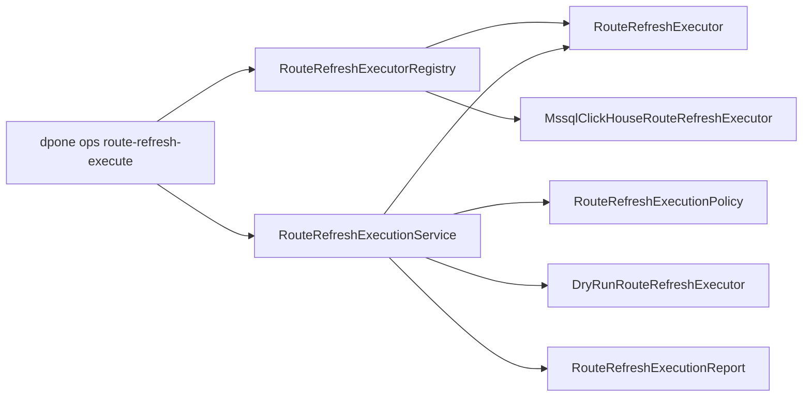
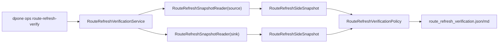
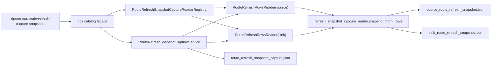

# Developer route refresh execute

Route refresh execution turns a reviewed `route_refresh_plan.json` into a
machine-readable execution receipt for one `source -> sink -> strategy` route.
It is a control-plane service, not a runtime connector. Runtime adapters can
implement the `RouteRefreshExecutor` protocol, while the generic service owns
plan loading, policy, chunk sequencing, and evidence writing.

## Module architecture



| Module | Responsibility |
| --- | --- |
| `dpone.ops.route_refresh_execute` | Facade service. Loads the plan, validates route/profile/approval state, sequences chunks, delegates execution, and writes evidence. |
| `dpone.ops.routes.refresh_execution_models` | Immutable public contracts for chunk requests, chunk results, artifacts, and `route_refresh_execution.json`. |
| `dpone.ops.routes.refresh_execution_executor` | `RouteRefreshExecutor` protocol and safe `DryRunRouteRefreshExecutor`. |
| `dpone.ops.routes.refresh_executors.registry` | Generic backend selector. It maps CLI/API backend ids to builders and has no chunk execution logic. |
| `dpone.ops.routes.refresh_executors.native_pipeline` | Generic native refresh pipeline result/protocol helpers shared by concrete prepare/export/load backends. |
| `dpone.ops.routes.refresh_executors.mssql_clickhouse` | First concrete backend. It composes MSSQL `bcp queryout`, ClickHouse bulk load, config validation, per-chunk artifacts, and route guardrails. |
| `dpone.ops.routes.refresh_executors.postgres_mssql` | Postgres -> MSSQL backend. It composes Postgres `COPY` export, MSSQL bounded cleanup, MSSQL `bcp in`, config validation, per-chunk artifacts, and route guardrails. |
| `dpone.ops.route_refresh_verify` | Facade service for post-load verification. It consumes `route_refresh_execution.json`, calls injected snapshot readers, evaluates policy, and writes `route_refresh_verification.json`. |
| `dpone.ops.routes.refresh_verification_models` | Stable verification contracts, source/sink snapshots, chunk verification records, typed hash helper, and report rendering. |
| `dpone.ops.routes.refresh_verification_verifier` | `RouteRefreshSnapshotReader` port plus JSON snapshot reader for CLI/self-service use. |
| `dpone.ops.routes.refresh_verification_policy` | Pure row-count, boundary, duplicate-key, null-key, and typed hash blocker policy. |
| `dpone.ops.route_refresh_snapshot_capture` | Facade capture service. Loads execution evidence, calls injected row readers, computes source/sink snapshots, and writes capture artifacts. |
| `dpone.ops.routes.refresh_snapshot_capture_models` | Stable capture request, chunk, artifact, snapshot document, and `route_refresh_snapshot_capture.json` contracts. |
| `dpone.ops.routes.refresh_snapshot_capture_reader` | `RouteRefreshRowsReader` port, JSON row fixture reader, backward-compatible chunk boundary recovery, and generic row-to-snapshot normalization. No route-specific SQL lives here. |
| `dpone.ops.routes.refresh_snapshot_capture_registry` | Backend reader registry that maps executor config JSON to source/sink row-reader pairs without adding backend imports to the capture service. |
| `dpone.ops.routes.refresh_snapshot_capture_adapters` | Thin SQL row readers for Postgres, MSSQL, and ClickHouse. They render bounded read-only queries and reuse executor config shapes. |
| `dpone.ops.routes.refresh_execution_policy` | Pure status, blocker, warning, and next-action policy. |
| `dpone.commands.ops_parsers_routes` | Argument parsing only. |
| `dpone.services.ops.command_handlers_routes` | CLI adapter only. Calls the service through the ops catalog. |

## Design rules

1. Keep `RouteRefreshExecutionService` route-scoped and executor-agnostic.
   Never add direct MSSQL, Postgres, ClickHouse, or CDC client imports there.
2. Keep `RouteRefreshExecutor` thin: one chunk request in, one chunk result
   out. Route-specific batching, SQL, or file loading belongs behind concrete
   executor implementations.
3. Keep `RouteRefreshExecutorRegistry` generic. Adding a new backend should add
   one builder entry and one focused backend module, not service or policy
   branching.
4. Keep dry-run behavior deterministic and credential-free for OSS CI.
5. Keep `--execute` fail-closed when no concrete executor is configured.
6. Do not promote source state from this service. Use route execution ledger and
   route state promotion after successful execution.
7. Preserve the stable `route_refresh_execution.json` contract for release
   gates and docs.

## Public contract

`RouteRefreshExecutionReport.to_dict()` writes schema
`dpone.route_refresh_execution.v1` with these top-level fields:

| Field | Meaning |
| --- | --- |
| `route` | Canonical source, sink, strategy, pair id, case id, and colon id. |
| `profile` | Route profile from the matrix catalog, or `null` when unsupported. |
| `dataset` and `runner_id` | Operator target and executor identity. |
| `route_refresh_plan_json` and `plan_sha256` | Immutable input plan reference. |
| `mode` and `executed` | Whether this was `dry_run` or explicit execution. |
| `status` and `passed` | Policy result. |
| `ready_for_state_promotion` | True only after all explicit chunks succeeded. |
| `chunks` | Per-chunk execution results and idempotency keys. |
| `artifacts` and `artifact_index` | Attached plan and auxiliary artifacts with checksums. |
| `blockers`, `warnings`, `next_actions` | Operator diagnostics. |

## Executor extension point

Concrete executors implement:

```python
from dpone.ops.routes.refresh_execution_executor import RouteRefreshExecutor
from dpone.ops.routes.refresh_execution_models import (
    RouteRefreshChunkExecutionRequest,
    RouteRefreshChunkExecutionResult,
)


class MyRouteRefreshExecutor(RouteRefreshExecutor):
    def execute_chunk(
        self,
        request: RouteRefreshChunkExecutionRequest,
    ) -> RouteRefreshChunkExecutionResult:
        return RouteRefreshChunkExecutionResult(
            ordinal=request.ordinal,
            idempotency_key=request.idempotency_key,
            status="succeeded",
            passed=True,
            rows_read=100,
            rows_written=100,
            artifact_path="test_artifacts/route_refresh_execution/chunk_1.json",
            summary="chunk applied",
        )
```

The request includes route identity, dataset, chunk boundaries, idempotency key,
runner id, execute flag, output directory, and source plan path.

## Built-in MSSQL -> ClickHouse backend

`MssqlClickHouseRouteRefreshExecutor` is the first concrete adapter. It supports
only `mssql -> clickhouse -> incremental_merge` and returns
`mssql_clickhouse_refresh_executor.route_unsupported` before side effects for
any other route.

The backend depends on two thin protocols:

| Protocol | Responsibility |
| --- | --- |
| `MssqlChunkExporter` | Export one bounded query into a local file. The built-in implementation wraps `BcpRunner.queryout()`. |
| `ClickHouseChunkLoader` | Prepare one bounded target window and load one local transfer file into a ClickHouse table. The built-in implementation wraps `ClickHouseClientRunner.execute_query()` and `ClickHouseClientRunner.insert_file()`. |

Tests should inject fake exporters/loaders and assert query rendering, route
guards, row counts, and chunk artifact content. Live Docker or vendor tests
should use `RouteRefreshExecutorRegistry.default().build("mssql_clickhouse",
config_json=...)` so the same executor config path is covered as CLI users.

The per-chunk artifact schema is
`dpone.mssql_clickhouse.route_refresh_chunk.v1`. It records redacted commands,
the target-window prepare command, transfer file checksum, row counts, query
checksum, chunk identity, and blockers. Never write passwords, DSNs, or raw
secret-bearing commands into this artifact.

## MSSQL -> ClickHouse refresh executor live certification

`tests/integration/mssql/test_mssql_clickhouse_refresh_executor_live_integration.py`
is the opt-in Docker-live gate for the built-in backend. It is disabled unless
both `DPONE_RUN_INTEGRATION=1` and `DPONE_RUN_REFRESH_EXECUTOR_LIVE=1` are set.

The test intentionally stays route-generic at the service boundary:

1. `RouteRefreshPlanService` writes a matrix-backed
   `mssql -> clickhouse -> incremental_merge` plan.
2. `RouteRefreshExecutorRegistry.default().build("mssql_clickhouse",
   config_json=...)` constructs the concrete backend from JSON, matching CLI
   behavior.
3. `RouteRefreshExecutionService` executes the plan once, then performs an
   idempotency replay with the same plan and config.
4. `RouteRefreshSnapshotCaptureService` captures source and sink snapshots from
   the replayed chunks and writes `route_refresh_snapshot_capture.json`,
   `source_route_refresh_snapshot.json`, and
   `sink_route_refresh_snapshot.json`.
5. `RouteRefreshVerificationService` compares those snapshots with a
   deterministic typed hash so physical-contract fidelity is checked after
   native transfer.
6. Replay artifacts must contain the route case id, per-chunk prepare evidence,
   nonzero transfer hashes, and `route_refresh_execution.json`.

The current live fixture uses 10,000 rows and 200 columns, then repeats
execution, capture, and exact verification after additive schema evolution.

The CI workflow stores this evidence under
`test_artifacts/live_certification/refresh-executor/mssql-clickhouse/`. Keep
the gate opt-in: ordinary OSS CI must stay credential-free and must not start
Docker services for unit tests.

## Generic native refresh pipeline

`native_pipeline.py` defines the generic native refresh pipeline and reusable
route-refresh adapter taxonomy for native bulk executors:

| Contract | Responsibility |
| --- | --- |
| `NativeChunkExporter` | Export one bounded source query into a local transfer file. |
| `NativeChunkLoader.prepare_chunk()` | Make the target chunk window replay-safe before load. |
| `NativeChunkLoader.load_chunk()` | Load one local transfer file into the target table. |
| `NativeChunkPrepareResult`, `NativeChunkExportResult`, `NativeChunkLoadResult` | Normalized evidence records used by artifacts and tests. |

Concrete backends still own route SQL, vendor connection config, and artifact
schema. The generic service and CLI do not branch by source/sink pair.

## Route refresh verification architecture

`RouteRefreshVerificationService` is the post-load control-plane companion to
`RouteRefreshExecutionService`. It is intentionally separate from execution:
executors mutate targets, while verification only reads source/sink snapshots
and decides whether source state can be promoted.



The core service has no route-specific imports. Source/sink behavior belongs in
small reader adapters or in JSON snapshot artifacts. This keeps future routes
cheap to add: implement a reader that returns `RouteRefreshSideSnapshot` for a
chunk and reuse the same policy/report contracts.

The typed hash contract is declared by column order, key columns, and type
hints. Current canonical families are integer, decimal/numeric, float, boolean,
string, and null. The hash sorts rows by key columns before hashing so source
and sink scans can return different physical order without causing false
mismatches.

Verification blockers intentionally fail state promotion:

| Blocker | Meaning |
| --- | --- |
| `route_refresh_verification.execution_not_succeeded` | The input execution receipt was not a successful real execution. |
| `route_refresh_verification.row_count_mismatch:<n>` | Chunk `<n>` has different source/sink counts. |
| `route_refresh_verification.min_boundary_mismatch:<n>` | Chunk `<n>` has different lower boundaries. |
| `route_refresh_verification.max_boundary_mismatch:<n>` | Chunk `<n>` has different upper boundaries. |
| `route_refresh_verification.typed_hash_mismatch:<n>` | Chunk `<n>` has different type-aware content hashes. |
| `route_refresh_verification.duplicate_keys:<n>` | Sink snapshot found duplicate route keys. |
| `route_refresh_verification.null_keys:<n>` | Sink snapshot found null route keys. |

## Route refresh snapshot capture architecture

`RouteRefreshSnapshotCaptureService` is the generic evidence producer between
execution and verification. It consumes a successful
`route_refresh_execution.json`, builds per-chunk read requests, asks two
`RouteRefreshRowsReader` implementations for source and sink rows, normalizes
those rows into `dpone.route_refresh_snapshot.v1` documents, and writes
`route_refresh_snapshot_capture.json`.



The service depends only on the `RouteRefreshRowsReader` port. It must not
import MSSQL, Postgres, ClickHouse, `BcpRunner`, executor backends, or runtime
connectors directly. Route-specific behavior belongs in:

- executor config metadata such as `source_dataset`, `target_dataset`,
  `boundary_column`, `columns`, and optional `query_template`;
- focused SQL row-reader adapters under `refresh_snapshot_capture_adapters`;
- optional future policy extensions that still receive normalized capture
  models.

`refresh_snapshot_capture_reader` owns normalization for JSON fixtures and live
row readers. It uses the same typed hash helper as
`RouteRefreshVerificationService`, including physical-contract canonicalization
for integer, decimal/numeric, float, boolean, string, date, time,
datetime/datetime2/datetimeoffset, UUID/uniqueidentifier, and binary/varbinary
families. `refresh_snapshot_capture_registry` is the composition boundary for
CLI/API use: it translates `mssql_clickhouse` and `postgres_mssql` executor
config JSON into reader pairs, but future routes should add small reader
builders rather than service branches.

## Postgres -> MSSQL refresh executor live certification

`tests/integration/mssql/test_postgres_mssql_refresh_executor_live_integration.py`
is the opt-in Docker-live gate for the `postgres_mssql` backend. It is disabled
unless both `DPONE_RUN_INTEGRATION=1` and
`DPONE_RUN_REFRESH_EXECUTOR_LIVE=1` are set.

The test writes a matrix-backed `postgres -> mssql -> incremental_merge` plan,
builds the backend through
`RouteRefreshExecutorRegistry.default().build("postgres_mssql",
config_json=...)`, executes the plan once, then performs an idempotency replay.
It uses a wide 10,000 row and 200 column fixture that covers physical-contract
type conversions, verifies that replay leaves one copy of every row, and
requires per-chunk prepare/export/load artifacts plus
`route_refresh_execution.json`. The replay then runs
`RouteRefreshSnapshotCaptureService` and `RouteRefreshVerificationService` to
write `route_refresh_snapshot_capture.json`,
`source_route_refresh_snapshot.json`, `sink_route_refresh_snapshot.json`, and
`route_refresh_verification.json`. The same test repeats execution, capture,
and exact verification after additive schema evolution.

Live CI stores this evidence under
`test_artifacts/live_certification/refresh-executor/postgres-mssql/`. Keep it
opt-in and credential-free outside the live workflow.

## Testing strategy

Required coverage:

| Layer | Tests |
| --- | --- |
| Service | Dry-run receipt, injected executor success, approval-required plan, blocked plan, route mismatch, chunk failure, and skipped later chunks. |
| CLI | JSON output, dry-run default, `--execute` without backend fail-closed, missing `mssql_clickhouse` config, blocked plan exit code. |
| Verification | Typed hash canonicalization, snapshot policy blockers, service orchestration, CLI JSON/Markdown output, failed execution fail-closed behavior, and release evidence wiring. |
| Snapshot capture | `RouteRefreshSnapshotCaptureService`, `RouteRefreshRowsReader`, JSON row fixture normalization, SQL reader registry, CLI output, fail-closed execution handling, and docs/workflow artifacts. |
| Backend registry | `none` default, unknown backend failure executor, and `mssql_clickhouse` config parsing. |
| MSSQL ClickHouse backend | Query rendering, route guard before side effects, export/load protocol calls, per-chunk artifact schema, and failure blockers. |
| Policy | Statuses `dry_run`, `succeeded`, `partial_failure`, `blocked`, and `approval_required`. |
| Docs | User docs, developer docs, examples, Runbook, CI/CD docs, architecture docs, release-gate docs, and mkdocs nav. |
| Release gate | Required `route_refresh_execution` and `route_refresh_verification` evidence can be attached and route-matched. |

Focused commands:

```bash
uv run pytest tests/test_route_refresh_execute.py tests/test_cli_route_refresh_execute_command.py -q
uv run pytest tests/test_route_refresh_verify.py tests/test_cli_route_refresh_verify_command.py -q
uv run pytest tests/test_route_refresh_snapshot_capture.py tests/test_cli_route_refresh_snapshot_capture_command.py tests/test_route_refresh_snapshot_capture_registry.py -q
uv run pytest tests/test_route_refresh_executor_registry.py -q
uv run pytest tests/test_route_refresh_execute_docs_contract.py -q
uv run pytest tests/test_route_refresh_verify_docs_contract.py -q
uv run pytest tests/test_route_release_gate.py::test_route_release_gate_accepts_route_refresh_execution_required_evidence -q
uv run ruff check src/dpone/ops/route_refresh_execute.py src/dpone/ops/routes/refresh_execution_*.py src/dpone/ops/routes/refresh_executors
uv run mypy --config-file mypy.ini
uv run mkdocs build --strict
```

## Runbook

1. Write or update failing tests before changing execution behavior.
2. Add generic behavior to models, policy, executor protocol, or service.
3. Add route-specific behavior only in a concrete `RouteRefreshExecutor` and
   keep exporter/loader dependencies behind protocols.
4. Update user docs, developer docs, architecture docs, CI/CD docs, CLI
   reference, and quality metrics.
5. Run focused tests, full non-live pytest, integration matrix, lint, format,
   type checks, docs checks, strict MkDocs, and package build before opening a
   pull request.
