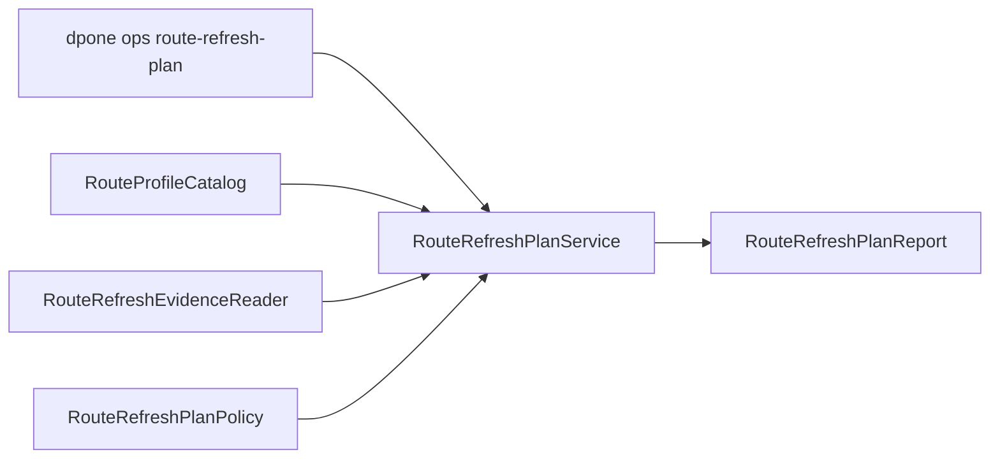

# Developer route refresh plan

Route refresh planning is a reusable control-plane taxonomy for bounded
backfill, replay, resync, and repair workflows across every future
`source -> sink -> strategy` route. It is intentionally separate from runtime
connectors: sources extract, sinks load, and route refresh planning decides
whether a replay plan is safe enough to hand to an executor.

## Module architecture



| Module | Responsibility |
| --- | --- |
| `dpone.ops.route_refresh_plan` | Facade service. Composes catalog lookup, window chunking, evidence loading, approval/state-rewind assessment, policy evaluation, and report writing. |
| `dpone.ops.routes.refresh_plan_models` | Immutable public contracts for windows, chunks, approval, evidence, state rewind, and `route_refresh_plan.json`. |
| `dpone.ops.routes.refresh_plan_evidence` | Thin evidence parser and normalizer. No route-specific policy decisions. |
| `dpone.ops.routes.refresh_plan_policy` | Pure policy for `ready`, `approval_required`, and `blocked` decisions. |
| `dpone.commands.ops_parsers_routes` | Argument parsing only. |
| `dpone.services.ops.command_handlers_routes` | CLI adapter only. Calls the service through `OpsServiceCatalog`. |

## Design rules

1. Keep `RouteRefreshPlanService` orchestration-only. It must not open database
   connections, run Docker services, execute chunks, or mutate source/sink
   state.
2. Keep route identity generic through `RouteKey` and `RouteProfileCatalog`.
   Do not hard-code `postgres -> mssql` or `mssql -> clickhouse` behavior in
   the service.
3. Add route-specific requirements through matrix/profile metadata or small
   policy extensions, not through CLI branches.
4. Keep evidence readers normalization-only. Pass/fail semantics should stay
   compatible with route release gate, route data quality, and certification
   artifacts.
5. Keep CLI handlers thin and DI-friendly. Tests should be able to inject an
   ops catalog or instantiate the service directly.
6. Preserve `route_refresh_plan.json` as a stable public contract. Add fields
   compatibly and update docs/tests before changing behavior.

## Public contract

`RouteRefreshPlanReport.to_dict()` writes schema
`dpone.route_refresh_plan.v1` with these top-level fields:

| Field | Meaning |
| --- | --- |
| `route` | Canonical `source`, `sink`, `strategy`, `pair_id`, `case_id`, and `colon_id`. |
| `profile` | Static matrix-backed route metadata, or `null` for unsupported routes. |
| `dataset` and `reason` | Operator intent and target dataset. |
| `window` | Requested boundary model and chunk size. |
| `chunks` | Idempotent execution units with boundaries and idempotency keys. |
| `state_rewind` | Whether the request rewinds source state and therefore needs approval. |
| `approval` | Required/approved flags plus reasons. |
| `evidence` and `evidence_index` | Normalized evidence artifacts with route match and checksums. |
| `status`, `passed`, `blockers`, `warnings`, `next_actions` | Stable policy result for CLI, CI, release gates, and docs. |

## Extending the taxonomy

Add new window kinds only when the behavior is generic enough for multiple
routes. Prefer these extension points:

| Need | Extension point |
| --- | --- |
| Add a new required artifact for a route | Add matrix/profile metadata and pass it through `--require` or route release policy. |
| Add a new evidence parser field | Extend `RouteRefreshEvidenceReader` without adding policy decisions there. |
| Add a new blocker or approval reason | Extend `RouteRefreshPlanPolicy` or the small approval/state helper in the service. |
| Add a new executor | Consume `route_refresh_plan.json`; do not make the planner execute it. |
| Add persistent execution state | Use route execution ledger and route state promotion modules. |

## Testing strategy

Required test coverage:

| Layer | Tests |
| --- | --- |
| Models | JSON/Markdown rendering and stable schema field names. |
| Service | Integer chunking, partition windows, state rewind, approval, unsupported routes, malformed evidence, missing evidence, route mismatch, and first supported routes. |
| CLI | JSON output, file paths, exit code `0` for ready plans, exit code `1` for blocked or approval-required plans. |
| Docs | User docs, developer docs, examples, Runbook sections, mkdocs nav, CI/CD mentions, and route release gate examples. |
| Release gate | Required `route_refresh_plan` evidence can be attached and route-matched. |

Run the focused local checks while developing:

```bash
uv run pytest tests/test_route_refresh_plan.py tests/test_cli_route_refresh_plan_command.py -q
uv run pytest tests/test_route_refresh_plan_docs_contract.py -q
uv run pytest tests/test_route_release_gate.py::test_route_release_gate_accepts_route_refresh_plan_required_evidence -q
uv run ruff check src/dpone/ops/route_refresh_plan.py src/dpone/ops/routes/refresh_plan_*.py
uv run mypy --config-file mypy.ini
mkdocs build --strict
```

## CI/CD contract

Default OSS CI stays credential-free. Route refresh planning is deterministic
and can run in normal unit tests. Docker-live or vendor-live execution belongs
to opt-in route RC executor, CDC runtime, or integration matrix gates that
consume `route_refresh_plan.json`.

## Runbook

1. Add or update service tests before production code.
2. Implement behavior in models, evidence, policy, or service modules according
   to the module boundaries above.
3. Update `dpone ops route-refresh-plan` docs, CLI reference, CI/CD docs,
   operational control-plane docs, and route release gate docs.
4. Regenerate generated docs and developer metrics with the project commands.
5. Run focused tests, lint, format check, type check, strict docs build, and
   non-live pytest before opening a pull request.
6. Keep planner changes separate from execution changes unless the PR clearly
   documents both control-plane and runtime boundaries.
