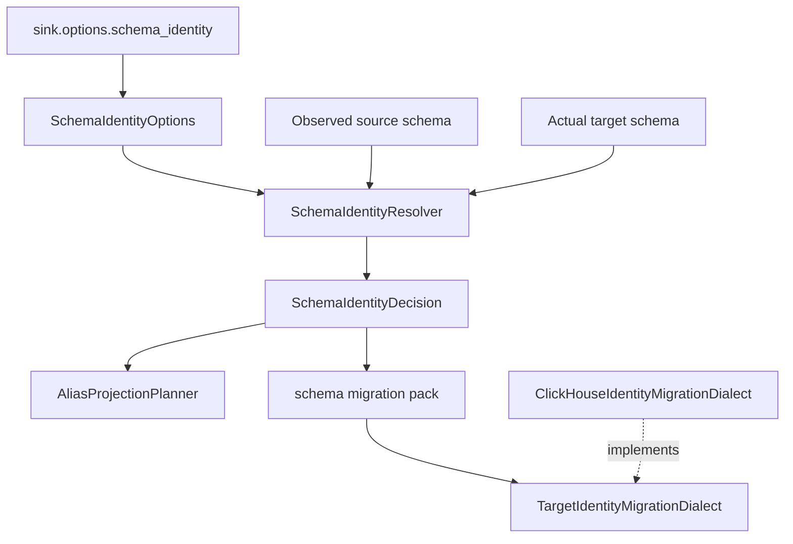

# Developer Schema Identity

Schema identity is a source-agnostic bounded context that resolves semantic
renames before schema evolution, type compatibility, migration planning, and
runtime loading.

## Architecture

## Taxonomy

| Component | Responsibility |
| --- | --- |
| `SchemaIdentityOptions` | Immutable config model for ids, aliases, rename mode, and expiration policy. |
| `SchemaObjectIdentity` | Canonical column name and stable semantic id. |
| `SchemaAlias` | Legacy name, compatibility mode, and optional `remove_after` date. |
| `SchemaIdentityResolver` | Pure service that maps observed source/target names to canonical identities. |
| `SchemaIdentityDecision` | Explainable action such as `rename_alias`, `target_alias_only`, or `suggested_rename`. |
| `AliasProjectionPlanner` | Row/schema projection from alias names to canonical names and optional `dual_write`. |
| `TargetIdentityMigrationDialect` | Target-specific SQL port for expand/backfill/validate/contract or unsafe direct rename. |
| `ClickHouseIdentityMigrationDialect` | ClickHouse V1 adapter for identity migration SQL. |

## Boundaries

- Readiness code must stay target-agnostic.
- Runtime projection may depend on runtime artifact contracts, but not on target
  connectors.
- Target SQL belongs in target dialect adapters.
- CLI handlers only parse arguments and render payloads.
- `__dpone__nc__` remains owned by schema evolution/type compatibility.

## Extension Rules

To add a target:

1. Keep `SchemaIdentityResolver` unchanged.
2. Implement a target dialect behind the same `TargetIdentityMigrationDialect`
   shape used by migration composition.
3. Render only SQL already requested by identity decisions.
4. Mark direct rename unsafe unless the target can prove downstream compatibility.
5. Add contract, CLI, docs, and live tests before enabling execution.

## Failure Modes

| Blocker | Meaning |
| --- | --- |
| `schema_identity.alias_value_conflict` | Source row carried alias and canonical values with different contents. |
| `schema_identity.alias_expired` | Alias was used after `remove_after`. |
| `schema_identity.configuration_error` | Duplicate ids, alias collisions, or invalid option values. |

## Testing

The minimum target for changes in this area:

- unit tests for config validation and resolver decisions;
- runtime tests proving projection occurs before schema evolution;
- migration tests proving identity decisions enter `MigrationPack`;
- docs/schema tests for JSON schema and self-service docs;
- architecture and module-size gates.
