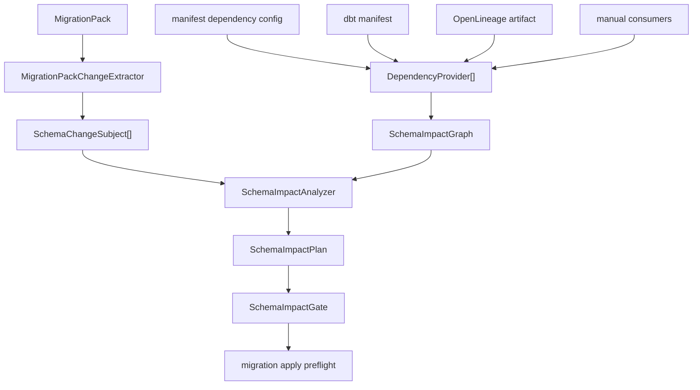

# Developer schema impact contract

`schema_impact` is a source-agnostic bounded context in the readiness layer. It
must not import runtime connectors or target-specific DDL renderers. The only
input from schema/DDL execution is the immutable `MigrationPack`.

## Architecture



## Taxonomy

| Component | Responsibility |
| --- | --- |
| `SchemaImpactOptions` | Immutable config model for mode, source providers, approvals, unknown dependency policy. |
| `SchemaChangeSubject` | Normalized changed object extracted from a migration pack. |
| `DatasetRef` | Target-agnostic dataset identity: namespace, schema, table. |
| `DependencyNode` | Dataset, job, dashboard, dbt model, route, or future catalog object. |
| `DependencyEdge` | Directed dependency edge with optional column scope. |
| `DependencyProvider` | Port for reading dependency graph evidence. |
| `MigrationPackChangeExtractor` | Maps pack changes to severity and risk tags. |
| `SchemaImpactAnalyzer` | Matches subjects to consumers and builds impact payloads. |
| `SchemaImpactGate` | Evaluates required approvals before migration apply. |
| `SchemaImpactFacade` | Thin application facade used by CLI and migration services. |

## Provider rules

Providers should be deterministic and side-effect free. They return a
`SchemaImpactGraph` with warnings/blockers instead of raising for recoverable
evidence issues.

V1 providers:

- manual consumers from `sink.options.schema_impact.sources.manual`;
- dbt `manifest.json`;
- OpenLineage JSON artifacts.

Future providers should implement the same `DependencyProvider` protocol for
warehouse catalogs, BI catalogs, DataHub, OpenMetadata, or custom service
registries. Provider implementations must not decide whether a migration is
safe. They only provide graph evidence.

## Gate integration

`dpone schema migration plan` embeds `impact_summary` only when
`schema_impact.enabled: true`. The embedded summary does not affect
`MigrationPack.pack_id`; it is evidence attached to the pack.

`dpone schema migration apply` checks embedded impact before legacy generic
approval checks. This keeps blocker messages actionable:

```text
schema_impact.approval_required:data_destructive
schema_impact.approval_required:shadow_cutover
```

Approval artifacts must match both `pack_id` and `impact_plan_id`.

## Extension rules

- Keep all generic impact modules below 400 SLOC.
- Do not import ClickHouse, Postgres, MSSQL, BigQuery, Kafka, or connector
  clients from impact models, providers, analyzer, or gate modules.
- Add target/catalog integrations as `DependencyProvider` adapters.
- Keep CLI handlers thin: parse args, call facade, render payload.
- Do not parse arbitrary SQL lineage in V1. Prefer structured provider
  artifacts.

## Testing rules

Every new provider needs:

- one graph parsing test;
- one malformed/missing evidence test;
- one analyzer test proving subject-to-consumer matching;
- one docs/schema contract test if it adds public config.

Every new risk tag needs:

- extractor classification test;
- gate approval-required test;
- docs update in `docs/schema-impact.md`.
