# Developer schema migration control

The migration control plane is a thin layer above existing schema and physical
contract services. It packages decisions into immutable evidence and a durable
ledger boundary without putting DDL policy into CLI handlers.

## Architecture

```mermaid
flowchart TD
    CLI["dpone schema migration <command>"]
    Facade["MigrationControlFacade"]
    Pack["MigrationPack"]
    Ledger["MigrationLedgerStore"]
    ArtifactLedger["ArtifactMigrationLedgerStore"]
    Readiness["ReadinessService"]
    PhysicalPlan["physical-plan"]
    PhysicalDiff["physical-diff"]
    ShadowPlanner["ShadowMigrationPlanner"]
    ShadowDialect["TargetShadowMigrationDialect"]
    ChShadow["ClickHouseShadowMigrationDialect"]
    Executor["MigrationOperationExecutor"]
    ChExecutor["runtime ClickHouseMigrationOperationExecutor"]
    TargetLedger["target-backed ledger adapter"]
    EnvContract["MigrationEnvironmentContract"]
    EnvLedger["EnvironmentLedgerStore"]
    Promotion["MigrationPromotionFacade"]
    PromotionGate["MigrationPromotionGate"]
    BundleFacade["MigrationBundleFacade"]
    Bundle["MigrationEvidenceBundle"]
    Verifier["MigrationBundleVerifier"]
    Review["MigrationReviewRenderer"]
    RegistryFacade["MigrationEvidenceRegistryFacade"]
    RegistryStore["MigrationEvidenceRegistryStore"]
    BackupFacade["MigrationBackupFacade"]
    BackupPlanner["MigrationBackupPlanner"]
    BackupDialect["TargetBackupDialect"]
    ChBackup["ClickHouseBackupDialect"]
    JsonRegistry["LocalJsonEvidenceRegistryStore"]
    SqliteRegistry["SqliteEvidenceRegistryStore"]

    CLI --> Facade
    CLI --> BundleFacade
    Facade --> Readiness
    Readiness --> PhysicalPlan
    Readiness --> PhysicalDiff
    Facade --> ShadowPlanner
    ShadowPlanner --> ShadowDialect
    ChShadow -. implements .-> ShadowDialect
    Facade --> Pack
    Facade --> Ledger
    Facade --> PromotionGate
    Promotion --> EnvContract
    Promotion --> EnvLedger
    Promotion --> PromotionGate
    BundleFacade --> Bundle
    BundleFacade --> Verifier
    BundleFacade --> Review
    CLI --> RegistryFacade
    CLI --> BackupFacade
    BackupFacade --> BackupPlanner
    BackupPlanner --> BackupDialect
    ChBackup -. implements .-> BackupDialect
    RegistryFacade --> RegistryStore
    JsonRegistry -. implements .-> RegistryStore
    SqliteRegistry -. implements .-> RegistryStore
    Facade --> Executor
    ArtifactLedger -. implements .-> Ledger
    TargetLedger -. future implements .-> Ledger
    ChExecutor -. implements .-> Executor
```

## Taxonomy

| Component | Responsibility |
| --- | --- |
| `MigrationControlFacade` | Application facade for `plan`, `baseline`, `apply`, `history`, and `rollback`. |
| `MigrationPack` | Immutable evidence contract with fingerprints, blockers, DDL, and rollback metadata. |
| `MigrationTarget` | Target identity: sink type and fully qualified table. |
| `MigrationLedgerRecord` | One factual ledger event: baseline, applied, failed, rolled back. |
| `MigrationLedgerStore` | Thin port for ledger persistence. |
| `ArtifactMigrationLedgerStore` | V1 JSON artifact ledger implementation. |
| `stable_fingerprint` | Canonical JSON hashing helper for deterministic pack ids and drift checks. |
| `MigrationEnvironmentContract` | Provider-neutral environment chain, policy, ledger, actual-state, and target-connection references. |
| `MigrationEnvironmentRef` | One environment boundary: name, ledger path, optional actual state, optional target connection reference. |
| `EnvironmentLedgerStore` | Environment-aware ledger port over existing migration ledger records. |
| `ArtifactEnvironmentLedgerStore` | V1 artifact-backed environment ledger view. |
| `MigrationEnvironmentVerifier` | Pure service for `verify-env` and `certify`; compares pack id, actual fingerprint, phase completeness, and ledger state. |
| `MigrationPromotionPlanner` | Pure service that turns a source certification plus approval into a target promotion receipt. |
| `MigrationPromotionGate` | Pre-apply gate for environment-bound `apply`. |
| `MigrationPromotionFacade` | File-IO facade for promotion CLI commands; generic, no target or SCM imports. |
| `MigrationRehearsalPlan` | Immutable plan binding pack, bundle, environment, connection identity, operations, and checks. |
| `MigrationRehearsalPlanner` | Pure service that builds rehearsal plans and sandbox guardrail blockers. |
| `MigrationRehearsalRunner` | Executes rehearsal operations through an injected target execution port. |
| `MigrationRehearsalCertifier` | Pure service that converts run evidence into `certified`, `warning`, or `blocked`. |
| `MigrationRehearsalFacade` | File-IO facade for `rehearse plan`, `run`, `certify`, and `report`. |
| `MigrationRehearsalPolicyProfile` | Built-in certification profiles: `advisory`, `stage`, `prod_strict`, and `regulated`. |
| `MigrationFixturePlanner` | Pure service that derives pack-bound fixture requirements from a manifest and policy override. |
| `SyntheticMigrationFixtureProvider` | Deterministic provider for wide schemas, nullable/default edge cases, keys, and nested parent/child rows. |
| `ArtifactSampleFixtureProvider` | Local JSONL/CSV sample provider for credential-free rehearsal fixture builds. |
| `DataMaskingPolicy` | Deterministic local masking rules for hash/null/token actions before target seeding. |
| `TargetFixtureSeeder` | DI port for loading fixture rows into a sandbox target. |
| `MigrationDataProfileAnalyzer` | Pure row profiler for row count, typed hash, distributions, min/max, duplicate/null keys, and hierarchy checks. |
| `MigrationRehearsalDataFacade` | File-IO facade for `rehearse fixture plan`, `build`, and `profile`; target adapters stay behind ports. |
| `PostApplyVerificationPlan` | Immutable plan binding pack, bundle, ledger, target connection, checks, canary queries, and rollback metadata. |
| `PostApplyVerificationPlanner` | Pure service that validates pack/bundle/ledger ids, rejects unsafe canaries, and emits `dpone.schema_migration_post_apply_plan.v1`. |
| `PostApplyVerificationRunner` | Runs read-only post-apply checks through injected target ports and emits `dpone.schema_migration_post_apply_run.v1`. |
| `PostApplyCertifier` | Converts run evidence into `verified`, `warning`, or `blocked` post-apply certificates. |
| `PostApplyVerificationFacade` | File-IO facade for `post-apply plan`, `run`, `certify`, and `report`; no business logic in CLI. |
| `PostApplyTargetInspector` | Read-only target inspection port for actual physical state after apply. |
| `TargetCanaryExecutor` | Read-only target query port for canary queries. |
| `ClickHousePostApplyVerifier` | ClickHouse V1 adapter that implements both read-only ports with system table introspection and SELECT canaries. |
| `RollbackWindowEvaluator` | Logical responsibility inside post-apply checks that reports rollback window `open`, `closed`, `unsupported`, or `not_applicable`. |
| `MigrationWatchPlan` | Immutable plan binding pack, post-apply certificate, watch window, target connection, checks, telemetry budgets, and remediation policy. |
| `MigrationWatchPlanner` | Pure service that validates pack/certificate ids, target support, SELECT-only canaries, and emits `dpone.schema_migration_watch_plan.v1`. |
| `MigrationWatchRunner` | Executes bounded read-only watch samples through injected target ports and emits `dpone.schema_migration_watch_run.v1`. |
| `MigrationWatchSample` | One timestamped sample concept containing physical recheck, data profile checks, canaries, query health, rollback window, blockers, warnings, and metrics. |
| `TargetWatchProbe` | Target-neutral read-only port for repeated watch checks and target telemetry. |
| `ClickHouseWatchProbe` | ClickHouse V1 adapter that reuses post-apply checks and reads `system.query_log` for query health. |
| `MigrationWatchRemediationAdvisor` | Pure recommend-only decision service returning `continue`, `extend_watch`, `rollback_recommended`, or `rollback_required`. |
| `MigrationWatchCertifier` | Converts watch run evidence into `stable`, `warning`, or `blocked` certificates. |
| `MigrationWatchFacade` | File-IO facade for `watch plan`, `run`, `status`, `certify`, and `report`; no business logic in CLI. |
| `MigrationRemediationPlan` | Pack/watch/ledger/target-bound executable rollback or remediation plan with preconditions and operations. |
| `MigrationRemediationPlanner` | Pure service that validates watch evidence, ledger state, target support, and emits `dpone.schema_migration_remediation_plan.v1`. |
| `RollbackCapabilityClassifier` | Logical classifier for `online_safe`, `shadow_exchange`, `drop_shadow`, `manual_only`, `unsupported`, and `blocked_after_contract`. |
| `TargetRemediationDialect` | Target-neutral protocol for rollback/remediation DDL and DML rendering. |
| `ClickHouseRemediationDialect` | V1 target adapter for `EXCHANGE TABLES`, shadow cleanup, and table-setting rollback primitives. |
| `MigrationRemediationRunner` | Executes approved operations through an injected operation executor and emits `dpone.schema_migration_remediation_run.v1`. |
| `MigrationRemediationCertifier` | Converts remediation run evidence into `certified`, `warning`, or `blocked` certificates. |
| `MigrationRemediationFacade` | File-IO facade for `remediation plan`, `apply`, `certify`, and `report`; no business logic in CLI. |
| `MigrationBackupOptions` | Immutable backup config for strategy, profile, retention, restore rehearsal, and target knobs. |
| `MigrationBackupRequirementClassifier` | Logical classifier for `data_destructive`, `shadow_contract`, `physical_layout_change`, and `direct_rename`. |
| `MigrationBackupPlanner` | Pure pack/config/target planner emitting `dpone.schema_migration_backup_plan.v1`; no DB IO. |
| `TargetBackupDialect` | Target-neutral rendering port for backup and restore operations. |
| `ClickHouseBackupDialect` | ClickHouse V1 adapter for `BACKUP TABLE ... TO ...` and `RESTORE TABLE ... FROM ... AS ...`. |
| `MigrationBackupRunner` | Executes approved backup operations through an injected executor and emits `dpone.schema_migration_backup_run.v1`. |
| `MigrationRestorePlanner` | Builds sandbox/stage restore rehearsal plans and blocks standalone production restore. |
| `MigrationRestoreRunner` | Executes restore rehearsal operations through an injected executor and emits `dpone.schema_migration_restore_run.v1`. |
| `MigrationBackupCertifier` | Converts backup and restore evidence into `certified`, `warning`, or `blocked` certificates. |
| `MigrationBackupFacade` | File-IO facade for `backup plan`, `create`, `restore plan`, `restore run`, `certify`, and `report`. |
| `SchemaContractVersionBuilder` | Builds immutable logical data API versions from manifest columns, identities, aliases, and deprecation metadata. |
| `SchemaContractComparator` | Diffs base/head versions by stable identity first and physical name second. |
| `SchemaCompatibilityClassifier` | Assigns required semver bump, compatibility risk tags, blockers, and warnings. |
| `SchemaConsumerCompatibilityGate` | Checks consumer version constraints and removed column/alias reads before migration apply. |
| `SchemaContractRegistryStore` | Provider-neutral append/query/latest port with local JSON and SQLite adapters. |
| `SchemaContractFacade` | Thin file-IO facade for `dpone schema contract ...`; no target DB, SCM, or ClickHouse imports. |
| `MigrationEvidenceBundle` | Immutable aggregate over migration pack, impact, environment, certification, promotion, and approval artifacts. |
| `MigrationEvidenceArtifact` | One artifact reference: kind, path, sha256, required flag, schema version, and `pack_id` evidence. |
| `MigrationBundleBuilder` | Pure service that validates cross-artifact relationships and emits `dpone.schema_migration_bundle.v1`. |
| `MigrationBundleVerifier` | Offline integrity service that recomputes artifact digests, validates attestation, and reruns relationship checks. |
| `MigrationBundlePolicyOptions` | Immutable normalized profile/policy model for PR, stage, prod, and regulated gate decisions. |
| `MigrationBundlePolicyProfileRegistry` | Built-in profile catalog: `advisory`, `pr_review`, `stage_certified`, `prod_strict`, and `regulated`. |
| `MigrationBundlePolicyEvaluator` | Pure evaluator: bundle plus verification plus policy becomes a gate receipt. |
| `MigrationBundleGateDecision` | Machine-readable receipt with `allowed`, `warning`, or `blocked` status and deterministic `gate_id`. |
| `MigrationBundleGateFacade` | File-IO facade for `bundle gate`; offline and generic, with no target, SCM, or DB imports. |
| `MigrationBundleDiffOptions` | Immutable options for base/head bundle comparison and attestation requirements. |
| `MigrationBundleDiffInputs` | Normalized base/head bundles, artifact payloads, verification receipts, and optional gate receipts. |
| `MigrationBundleDiffChange` | One reviewer-facing delta with kind, path, classification, severity, risk tags, and action. |
| `MigrationBundleDiffClassifier` | Pure classifier from raw field deltas to review severity and risk semantics. |
| `MigrationBundleDiffBuilder` | Pure service that emits `dpone.schema_migration_bundle_diff.v1`. |
| `MigrationBundleDiffFacade` | File-IO facade for `bundle diff`; offline and generic, with no target, SCM, or DB imports. |
| `MigrationReviewRenderer` | Provider-neutral Markdown/text/json renderer for PR/MR review; no SCM API calls. |
| `MigrationBundleFacade` | File-IO facade for `bundle build`, `bundle verify`, and `review render`; generic, no target or SCM imports. |
| `MigrationTrustSubject` | Stable trust subject over `bundle_id`, `pack_id`, target, artifact digests, and `bundle_digest`. |
| `MigrationProvenanceStatement` | SLSA/in-toto-style statement binding bundle subject to repository, ref, commit, workflow, and CI run. |
| `MigrationProvenanceBuilder` | Pure provenance builder; no filesystem, SCM API, DB client, or target imports. |
| `ArtifactSignatureProvider` | Thin signing/verification port for one provenance payload. |
| `LocalHmacSignatureProvider` | V1 built-in `HMAC-SHA256` provider for local/dev CI evidence. |
| `ExternalAttestationEvidence` | Normalized external GitHub Artifact Attestations, Sigstore, or Cosign verification receipt. |
| `MigrationTrustPolicy` | Immutable policy for allowed producers, repositories, refs, signatures, and external attestations. |
| `MigrationTrustVerifier` | Pure verifier that emits `dpone.schema_migration_trust_verification.v1`. |
| `MigrationTrustFacade` | File-IO facade for `bundle attest` and `bundle trust verify`; no target, SCM, or DB imports. |
| `ScmCiTemplateCatalog` | Static documentation/examples catalog for GitHub Actions, GitLab CI, and Bitbucket Pipelines templates. |
| `MigrationEvidenceRegistryRecord` | Immutable evidence event for one pack, bundle, environment, stage, and target. |
| `MigrationEvidenceArtifactRef` | Artifact reference stored in the registry: kind, path/digest/schema/id evidence. |
| `MigrationEvidenceRecorder` | Pure service that validates bundle/gate/trust/diff relationships and builds registry records. |
| `MigrationEvidenceRegistryStore` | Persistence port for append/query/latest operations. |
| `LocalJsonEvidenceRegistryStore` | Deterministic file-backed registry for CI artifacts and local review. |
| `SqliteEvidenceRegistryStore` | Shared-runner durable registry with indexes by target, environment, stage, time, and pack. |
| `MigrationEvidenceQuery` | Target/environment/stage/date/status filter contract. |
| `MigrationEvidenceQueryService` | Read facade over a registry store. |
| `MigrationEvidenceAuditReporter` | Builds JSON/Markdown audit reports from registry records. |
| `MigrationEvidenceRegistryFacade` | File-IO CLI facade; no target, SCM API, or runtime DB imports. |
| `ShadowMigrationPlanner` | Generic pure service that converts eligible physical drift into a phase graph. |
| `ShadowMigrationPlan` | Immutable shadow migration evidence: actual table, shadow table, phases, blockers, rollback. |
| `MigrationPhase` | Ordered phase with preconditions, SQL operations, validations, and rollback hints. |
| `ColumnProjectionPlanner` | Generic projection planner for identity, cast, nullable-new-column, and default-safe decisions. |
| `TargetShadowMigrationDialect` | Target-specific SQL rendering port for create, backfill, validation, cutover, contract, rollback. |
| `ClickHouseShadowMigrationDialect` | ClickHouse adapter using desired DDL, `INSERT SELECT`, and atomic `EXCHANGE TABLES`. |
| `MigrationOperationExecutor` | Generic service-level target execution port for SQL already present in a reviewed `MigrationPack`. |
| `ClickHouseMigrationOperationExecutor` | Runtime ClickHouse adapter backed by `ClickHouseConnector`; loaded through the execution factory, not imported by services. |

CLI modules must stay thin. They may parse args and render output, but they must
not classify schema risk, compute fingerprints, or mutate ledger records.

## Command behavior boundaries

`plan` composes existing readiness services:

1. `ReadinessService.physical_plan` creates desired target state.
2. `ReadinessService.physical_diff` runs only when actual state is supplied.
3. `MigrationControlFacade` maps migration strategy to reconciliation planning:
   `block` preserves blocking mode, while `online_safe` and `shadow` request
   auto-safe physical reconciliation so target dialects can emit safe ALTER DDL.
4. `MigrationPack.build` computes fingerprints and pack id.
5. The command exits `0` because an unsafe plan is still valid evidence.

`baseline` writes a ledger record and never changes user tables.

`apply` is fail-closed:

- environment-bound apply resolves ledger and target connection from
  `MigrationEnvironmentContract`;
- promotion gate runs before fingerprint checks and before target execution;
- missing/stale promotion receipts block with `migration_promotion.*` blockers;
- stale actual fingerprint blocks with `migration.actual_fingerprint_mismatch`;
- existing pack blockers remain blockers;
- phased packs require `--phase` and enforce ledger-backed phase order;
- target side effects require explicit `--execute` and a target connection
  artifact; otherwise CLI blocks with `migration.target_connection_required`;
- service-level execution requires a `MigrationOperationExecutor`; otherwise it
  blocks with `migration.target_executor_required`;
- SQL operations are executed before ledger append, and failures block without
  adding a new ledger record;
- validation operations are checked by result pairs. Pair mismatches block with
  `migration.validation_mismatch`; a non-empty final validation blocks with
  `migration.validation_not_empty`;
- replaying an already applied phase returns `phase_already_applied` without
  appending a duplicate ledger record;
- ledger is written only after checks pass.

`MigrationOperationExecutor` is deliberately narrow. It does not decide whether
DDL is safe, does not render SQL, and does not inspect manifests. It receives
operation dictionaries from `MigrationPack` phases or flat `ddl` statements and
returns operation evidence. The facade persists that evidence under the ledger
record `operations` field. This keeps operation_status, target I/O, and ledger
semantics reusable for future targets.

`rollback` is explicit. If `rollback.supported` is false, the command blocks
with `migration.rollback_not_supported`.

## Extension rules

Future target-backed execution should add adapters behind existing ports, not
new CLI logic:

- add a target-backed `MigrationLedgerStore`;
- add a runtime `MigrationOperationExecutor` adapter for target SQL execution;
- add a `TargetShadowMigrationDialect` for target-specific shadow cutover SQL;
- keep fingerprint and approval checks in `MigrationControlFacade`;
- keep target-specific SQL rendering outside command modules.

Target-backed adapters should preserve the same payload schemas:

- `dpone.schema_migration_pack.v1`;
- `dpone.schema_migration_ledger_record.v1`;
- `dpone.schema_migration_history.v1`.
- `dpone.schema_migration_environments.v1`;
- `dpone.schema_migration_environment_report.v1`;
- `dpone.schema_migration_environment_certification.v1`;
- `dpone.schema_migration_promotion.v1`;
- `dpone.schema_migration_promotion_approval.v1`;
- `dpone.schema_migration_rehearsal_plan.v1`;
- `dpone.schema_migration_rehearsal_run.v1`;
- `dpone.schema_migration_rehearsal_certificate.v1`;
- `dpone.schema_migration_fixture_plan.v1`;
- `dpone.schema_migration_fixture_build.v1`;
- `dpone.schema_migration_data_profile.v1`;
- `dpone.schema_migration_post_apply_plan.v1`;
- `dpone.schema_migration_post_apply_run.v1`;
- `dpone.schema_migration_post_apply_certificate.v1`;
- `dpone.schema_migration_watch_plan.v1`;
- `dpone.schema_migration_watch_run.v1`;
- `dpone.schema_migration_watch_certificate.v1`;
- `dpone.schema_migration_remediation_plan.v1`;
- `dpone.schema_migration_remediation_run.v1`;
- `dpone.schema_migration_remediation_certificate.v1`;
- `dpone.schema_migration_backup_plan.v1`;
- `dpone.schema_migration_backup_run.v1`;
- `dpone.schema_migration_restore_plan.v1`;
- `dpone.schema_migration_restore_run.v1`;
- `dpone.schema_migration_backup_certificate.v1`;
- `dpone.schema_migration_bundle.v1`;
- `dpone.schema_migration_bundle_verification.v1`;
- `dpone.schema_migration_bundle_policy.v1`;
- `dpone.schema_migration_bundle_gate.v1`;
- `dpone.schema_migration_bundle_diff.v1`;
- `dpone.schema_contract_consumer_inventory.v1`;
- `dpone.schema_contract_consumer_matrix.v1`;
- `dpone.schema_contract_consumer_gate.v1`;
- `dpone.schema_migration_evidence_registry_record.v1`;
- `dpone.schema_migration_evidence_registry.v1`;
- `dpone.schema_migration_evidence_registry_query.v1`;
- `dpone.schema_migration_evidence_audit_report.v1`;
- `dpone.schema_migration_review.v1`.

## Bundle and review extension rules

The evidence bundle layer sits above `MigrationPack`, schema contract gates, consumer gates, schema impact,
environment certification, promotion receipts, and approvals. It is intentionally
offline: bundle commands do not open database connections, mutate ledgers, or
call GitHub/GitLab/Bitbucket APIs. SCM owns branch protection and review UX;
dpone owns pack consistency, artifact integrity, `bundle_id`, `bundle_digest`,
schema/physical/impact evidence, and apply gates.

Algorithm boundaries:

1. `MigrationBundleFacade` loads files and converts them into
   `MigrationEvidenceArtifact` values.
2. `MigrationBundleBuilder` computes SHA-256 digests, extracts `pack_id`,
   certification and promotion ids, contract/consumer gate ids, impact approvals, and target summary.
3. Builder blocks mismatched `pack_id`, mismatched `certification_id`, blocked contract or consumer gates, child
   artifact blockers, or missing approved risks.
4. `MigrationBundleVerifier` recomputes artifact digests from disk and verifies
   the optional attestation without requiring DB or SCM credentials.
5. `MigrationBundlePolicyEvaluator` runs release policy separately from
   integrity verification. It checks required artifact kinds, impact-required
   approvals, approval actor/expiry rules, target environment promotion, and
   warning policy.
6. `MigrationBundleGateFacade` returns
   `dpone.schema_migration_bundle_gate.v1`. It is the CI required-check
   boundary; it never mutates targets or ledgers.
7. `MigrationTrustVerifier` validates trusted provenance between integrity and
   release policy. It checks bundle subject equality, SLSA/in-toto fields,
   allowed repository/ref/commit/run metadata, `HMAC-SHA256` signatures, and
   external GitHub Artifact Attestations, Sigstore, or Cosign receipts when
   policy requires them.
8. `MigrationBundleDiffBuilder` compares approved/base and candidate/head
   evidence after both bundles are verified. It classifies migration pack,
   impact, approval, promotion, gate, and metadata deltas for reviewer focus.
9. `MigrationEvidenceRecorder` validates that bundle, gate, trust, and diff
   receipts belong to the same `pack_id`/`bundle_id`, then emits a durable
   evidence registry record. Registry writes are idempotent by `record_id` and
   fail closed on conflicting environment/stage/pack/bundle records.
10. `MigrationEvidenceRegistryStore` implementations persist and query records.
   V1 includes `local_json` and `sqlite`; future enterprise catalog exporters
   must call the same facade rather than re-parsing CI folders.
11. `MigrationReviewRenderer` renders deterministic Markdown suitable for PR/MR
   comments, GitHub job summaries, GitLab artifacts, or Bitbucket artifacts.

Profile semantics:

| Profile | Runtime contract |
| --- | --- |
| `advisory` | Integrity evidence only; optional evidence gaps remain warnings. |
| `pr_review` | Requires attestation, impact plan, and approvals for impact-required risks. |
| `stage_certified` | Requires attestation, impact plan, environment contract, and certification. |
| `prod_strict` | Requires attestation, impact, approval, environment contract, certification, promotion, and zero warnings. |
| `regulated` | Extends `prod_strict` with explicit approver and non-expired approval checks. |

`bundle verify` must remain an integrity verifier. Do not add release semantics
there. `bundle trust verify` owns trusted provenance and signature policy.
`bundle gate` is the release policy surface. `bundle diff` is the review-delta
surface. `schema migration registry` is the durable evidence catalog surface.
`migration apply --bundle-gate` only validates the receipt status and `pack_id`
before normal apply blockers; it does not rerun policy, trust, diff, or registry
evaluation at deploy time.

## Consumer discovery extension rules

Consumer discovery sits above the schema contract registry and below migration
impact. It answers data API compatibility questions; impact continues to answer
blast-radius questions for migration operations.

| Component | Boundary |
| --- | --- |
| `SchemaConsumerProvider` | Reads one local evidence source and emits normalized consumer refs. No target DB or SCM imports. |
| `ManualConsumerProvider` | Reads `schema_contract.consumers.manual`; this is the ownership source of truth. |
| `ManifestConsumerProvider` | Reads local dpone manifest artifacts; it must stay file-only. |
| `DbtManifestConsumerProvider` | Reads local `manifest.json`; V1 does not parse arbitrary SQL. |
| `OpenLineageConsumerProvider` | Reads local OpenLineage JSON events and schema facets. |
| `SchemaConsumerLineageProvider` | Reads one local column-lineage source and emits normalized evidence with confidence. |
| `SqlColumnLineageExtractor` | Uses `sqlglot` for SELECT/CTE/JOIN/projection reads from local SQL artifacts. |
| `DbtCompiledSqlConsumerProvider` | Combines dbt manifest dependency metadata with compiled SQL parsing. |
| `DataHubConsumerProvider` | Reads local DataHub MCP/export payloads; no DataHub API calls. |
| `GenericCatalogConsumerProvider` | Reads portable catalog exports for BI/jobs/catalog tools. |
| `ConsumerEvidenceConfidenceClassifier` | Normalizes evidence confidence as `explicit`, `parsed`, `inferred` or `table_only`. |
| `SchemaConsumerLineageInventoryBuilder` | Deduplicates lineage evidence and emits `dpone.schema_contract_consumer_lineage.v1`. |
| `SchemaConsumerInventoryBuilder` | Deduplicates consumers and applies required-source policy. |
| `SchemaConsumerMatrixBuilder` | Reuses `SchemaContractComparator`, matches changed columns/aliases to consumers and lineage confidence, and emits reviewer actions. |
| `SchemaConsumerMatrixGate` | Produces pack-bound `consumer_gate` evidence for bundle/registry gates. |

Generic consumer modules must not import ClickHouse, Postgres, dbt packages,
OpenLineage SDKs, GitHub/GitLab/Bitbucket clients, or Airflow. Future catalog
providers should implement the same provider protocol and return normalized
local evidence before the matrix builder runs.

Lineage providers must be artifact-only in V1. A provider may parse local SQL,
JSON or CSV exports, but it must not call DataHub/OpenMetadata/Atlan/Collibra,
SCM APIs or target databases. For breaking contract changes, `table_only` and
`inferred` evidence are treated as low confidence; the matrix gate blocks them by
default in `mode: gate` through `low_confidence_major_change: block`.

## Rehearsal extension rules

Rehearsal sits between bundle/trust evidence and production apply. It proves the
reviewed pack can execute in a controlled sandbox target, but it does not mutate
production, migration ledgers, or evidence registries by itself.

Algorithm boundaries:

1. `MigrationRehearsalPlanner` reads normalized pack/bundle/connection payloads
   and emits `dpone.schema_migration_rehearsal_plan.v1`.
2. Planner blocks mismatched bundle `pack_id`, pack blockers, unsupported
   targets, target connection type mismatches, and prod-like environments unless
   the connection explicitly allows prod rehearsal. The prod guardrail blocker
   code is `schema_migration_rehearsal.prod_environment_blocked`.
3. Flat DDL packs become ordered SQL operations; phased packs preserve phase
   operation and validation order. If rollback metadata says
   `supported_until_phase: contract`, the rehearsal plan defers `contract` and
   emits `schema_migration_rehearsal.contract_deferred_for_rollback_check` so
   rollback is checked before the contract window closes.
4. `MigrationRehearsalRunner` runs only through an injected
   `MigrationOperationExecutor`-compatible port. It records operation status,
   row/result fingerprints, validation mismatches, rollback operation evidence,
   duration, rows validated, and operation count.
5. `MigrationRehearsalCertifier` evaluates run evidence with profile semantics:
   `advisory` may produce warning dry-run certificates, while `stage`,
   `prod_strict`, and `regulated` require execution evidence. Optional
   fixture/profile artifacts are additive: absent artifacts preserve legacy
   behavior; supplied artifacts are pack-bound and can block the certificate.
6. Bundle integration is optional and backward compatible. `bundle build` may
   include artifact kind `rehearsal_certificate`; `bundle gate` requires it only
   when policy `required_artifacts` lists it.
7. Registry integration is evidence-only. Store the certified lifecycle with
   `registry record --stage certified`; do not overload migration ledger with
   rehearsal facts.

Fixture/profile extension rules:

1. `MigrationFixturePlanner` is pure and provider-neutral. It reads only a
   migration pack, manifest metadata, and an optional policy override, then
   emits `dpone.schema_migration_fixture_plan.v1`.
2. Fixture providers produce rows without target knowledge. V1 providers are
   `SyntheticMigrationFixtureProvider`, `ArtifactSampleFixtureProvider`, and
   artifact-based `masked_sample` through `DataMaskingPolicy`.
3. `TargetFixtureSeeder` is the only target mutation port. ClickHouse is wired
   in `MigrationRehearsalDataFacade`; generic readiness modules must not import
   ClickHouse connectors, DB clients, or route-level quality policy.
4. `MigrationDataProfileAnalyzer` profiles JSON-like rows and emits
   `dpone.schema_migration_data_profile.v1`. Checks include row count, typed
   hash, null distribution, distinct count, min/max, duplicate key, null key,
   and nested parent/child integrity.
5. `MigrationRehearsalCertifier` compares supplied before/after profiles and
   blocks on row-count drift, typed-hash drift, profile blockers, and
   mismatched pack ids. Bundle policy can require `fixture_build` and
   `quality_profile` artifacts for `prod_strict` or `regulated` deploys.

Keep rehearsal modules generic. ClickHouse is the first live target only because
the existing `ClickHouseMigrationOperationExecutor` already satisfies the
execution port. New targets should implement the executor and add certification
tests before removing `schema_migration_rehearsal.unsupported_target:<sink>`.

Post-apply extension rules:

1. Keep generic post-apply modules under readiness. They may use
   `MigrationPack`, ledger records, `PhysicalDesignDriftDetector`, and typed
   profile helpers, but must not import ClickHouse connectors or DB clients.
2. Target adapters implement `PostApplyTargetInspector` and
   `TargetCanaryExecutor`. They must be read-only; DDL/DML belongs only to
   `migration apply --execute`.
3. Canary queries are SELECT-only in V1. Reject mutating keywords before
   opening a target connection.
4. `PostApplyVerificationRunner` emits checks and metrics. `PostApplyCertifier`
   owns profile semantics for `advisory`, `stage`, `prod_strict`, and
   `regulated`.
5. Bundle policy and evidence registry treat `post_apply_certificate` as
   release closeout evidence. It complements `rehearsal_certificate`; it does
   not replace it.

Release watch extension rules:

1. Keep generic watch modules provider-neutral. They may use `MigrationPack`,
   post-apply certificates, `PhysicalDesignDriftDetector`, data-profile helpers,
   and stable fingerprints, but must not import ClickHouse connectors, DB
   clients, SCM SDKs, Airflow, or concrete sink classes.
2. `TargetWatchProbe` is the only read-only target port for live watch samples.
   Target adapters may delegate to their post-apply adapters, but watch samples
   must remain read-only.
3. `MigrationWatchRunner` owns sample orchestration only. It must not execute
   rollback or DDL/DML. `MigrationWatchRemediationAdvisor` emits commands and
   decisions; V1 remediation stays recommend-only.
4. `ClickHouseWatchProbe` reads `system.query_log` for query health. If target
   telemetry is unavailable, adapters return warnings or blockers according to
   the profile; they do not silently pass telemetry checks.
5. Bundle policy and evidence registry treat `watch_certificate` as release
   stability evidence after `post_apply_certificate`. Registry stage `watched`
   means the watch certificate exists; `closed` means the release was accepted
   after watch with no open remediation.
6. New target watch implementations must first add unit tests for target support
   blockers and opt-in live certification before removing
   `schema_migration_watch.unsupported_target:<sink>`.

Controlled remediation extension rules:

1. Keep generic remediation modules provider-neutral. They may use
   `MigrationPack`, watch certificates, ledger records, stable fingerprints, and
   injected operation executors, but must not import ClickHouse connectors, DB
   clients, SCM SDKs, Airflow, or concrete sink classes.
2. `MigrationRemediationPlanner` owns decision evidence only. It classifies
   rollback capability and preconditions, but it never opens a target
   connection.
3. `MigrationRemediationRunner` executes only operations already present in the
   plan and only when the facade supplies an executor and `--execute` is true.
   Dry-run receipts must remain non-mutating.
4. Target-specific rollback SQL belongs behind `TargetRemediationDialect`.
   ClickHouse V1 covers `EXCHANGE TABLES`, shadow cleanup, and table-setting
   `RESET/MODIFY SETTING`; other targets keep
   `schema_migration_remediation.unsupported_target:<sink>` until certified.
5. Bundle policy and evidence registry treat `remediation_certificate` as
   post-watch rollback evidence. Registry stage `remediation_planned` means a
   plan exists, `remediated` means target mutation ran, and
   `rollback_certified` means post-rollback evidence was certified.
6. Do not hide rollback behind watch. Watch recommends; remediation plans,
   gates, executes, certifies, and records.

Backup and restore extension rules:

1. Keep generic backup modules provider-neutral. They may use `MigrationPack`,
   `TargetBackupDialect`, stable fingerprints, and artifact schemas, but must
   not import ClickHouse connectors, DB clients, SCM SDKs, Airflow, or concrete
   sink classes.
2. `ClickHouseBackupDialect` owns SQL rendering for native `BACKUP` and
   `RESTORE`. Target execution remains behind `MigrationOperationExecutor`.
3. `MigrationBackupRequirementClassifier` must stay risk-taxonomy based:
   `data_destructive`, `shadow_contract`, `physical_layout_change`, and
   `direct_rename` are portable concepts, not ClickHouse concepts.
4. `backup create` and `backup restore run` are dry-run by default. Target
   mutation requires `--execute`; standalone production restore is blocked.
5. Bundle policy and evidence registry treat `backup_certificate` as
   pre-apply/restore readiness evidence. Registry stages `backup_planned`,
   `backup_created`, `restore_rehearsed`, and `backup_certified` describe the
   lifecycle; they do not replace migration ledger mutation records.
6. Controlled remediation may use `restore_from_backup` only when the
   certificate belongs to the same `pack_id`, is `certified`, and contains
   explicit restore operations. Otherwise `blocked_after_contract` remains
   fail-closed.

Recovery catalog extension rules:

Core taxonomy:

| Component | Responsibility |
| --- | --- |
| `RecoveryPoint` | Immutable restore point for target, environment, destination, chain, rehearsal, RPO/RTO evidence. |
| `RecoveryPointRecorder` | Converts `backup_certificate` into a cataloged restore point without DB IO. |
| `RecoveryCatalogStore` | Append/query/latest persistence port. |
| `LocalJsonRecoveryCatalogStore` | Deterministic file-backed recovery catalog for local and CI artifacts. |
| `SqliteRecoveryCatalogStore` | Indexed durable catalog for shared runners and longer release history. |
| `RecoveryPointSelector` | Chooses the latest usable restore point by target/environment/profile. |
| `RecoveryChainVerifier` | Verifies full/incremental chain completeness, base availability, retention status, and restore rehearsal evidence. |
| `RecoveryRetentionPlanner` | Produces safe cleanup recommendations without deleting backups. |
| `TargetRecoveryDialect` | Target-specific restore operation rendering port. |
| `ClickHouseRecoveryDialect` | ClickHouse V1 dialect for cataloged native restore operations. |

1. Keep recovery catalog modules provider-neutral. `RecoveryPoint`,
   `RecoveryChainVerifier`, `RecoveryRetentionPlanner`, and catalog stores may
   know artifact schemas and stable IDs, but must not import ClickHouse
   connectors, DB clients, SCM SDKs, Airflow, or concrete sink classes.
2. `RecoveryCatalogStore` is the persistence port. The local JSON backend is
   the OSS/CI default; SQLite is the durable shared-runner backend. Future
   catalog backends must preserve append idempotency and destination-conflict
   blocking.
3. Full and incremental are portable recovery taxonomy values. Target dialects
   render native backup/restore syntax, but chain semantics remain generic:
   every incremental point must have a usable base, ordered chain depth, and
   required restore rehearsal evidence when policy demands it.
4. ClickHouse-specific behavior lives behind `ClickHouseRecoveryDialect` and
   `ClickHouseBackupDialect`. Generic modules may consume rendered operations
   but must not construct ClickHouse clients or query `system.*` tables.
5. Standalone production restore is blocked in the recovery CLI. Production
   restore must flow through controlled remediation so approval, lock,
   fingerprint, ledger, and certificate rules remain centralized.
6. Registry stages `recovery_point_recorded`, `recovery_chain_verified`, and
   `recovery_restore_rehearsed` describe release evidence. They do not replace
   ledger records, which remain the source of truth for target mutation.
7. V1 PITR means a named cataloged recovery point. Do not advertise arbitrary
   timestamp PITR for a target until its dialect can prove transactional or
   time-log restore semantics and live tests certify the behavior.

Registry extension rules:

1. Keep registry modules provider-neutral. They may know artifact schemas and
   ids, but not ClickHouse, GitHub/GitLab/Bitbucket APIs, Airflow, or target DB
   clients.
2. Keep execution ledger and evidence registry separate. Ledger records target
   mutation facts; registry records review/release evidence.
3. Add new persistence engines behind `MigrationEvidenceRegistryStore`.
4. Add enterprise catalog/OpenMetadata/DataHub publishers as exporters over
   registry query results, not as alternative record builders.
5. Preserve idempotency: duplicate `record_id` is a no-op; conflicting logical
   key `(environment, stage, pack_id, bundle_id)` blocks with
   `evidence_registry.record_conflict`.

Future direct SCM adapters must remain thin wrappers around the same contracts:
read `bundle.json`, verify it, evaluate a gate receipt, compute or read a diff
receipt, render review text, and then use provider APIs only to publish the
already-rendered artifacts.

## Promotion extension rules

Promotion is intentionally provider-neutral in V1. GitHub, GitLab, Bitbucket,
Azure DevOps, Argo CD, and other systems remain external orchestrators that
store artifacts, enforce approvals, and invoke the dpone CLI. Direct SCM API
adapters may be added later, but they must call the same services:

1. Build or read a `MigrationPack`; never recompute pack content during
   promotion.
2. Use `MigrationEnvironmentVerifier.verify` for environment readiness evidence.
3. Use `MigrationEnvironmentVerifier.certify` to create immutable source
   receipts after apply.
4. Use `MigrationPromotionPlanner.promote` to create target receipts.
5. Use `MigrationPromotionGate.evaluate` before any target mutation.
6. Keep SCM-specific APIs outside `dpone.readiness.*` modules.

The environment contract rejects inline secret keys in `target_connection`.
SCM adapters should store only paths or external secret references in artifacts.
Secrets belong in CI secret stores, Kubernetes Secrets, Vault, Airflow
Connections, or equivalent runtime systems.

## Shadow migration extension rules

The taxonomy is target-agnostic. New targets implement only the dialect port and
capability checks:

1. `TargetShadowMigrationDialect.render_create_shadow` renders a target table
   from a `PhysicalTableState`.
2. `render_backfill` must use explicit column lists and expressions.
3. `render_validation_checks` must produce deterministic evidence queries.
4. `render_cutover` must be atomic or the dialect must block/require manual
   cutover.
5. `render_rollback` must be valid only until `contract`.

Generic modules must not import ClickHouse, Postgres, MSSQL, BigQuery, Kafka,
or connector clients. Dialects may import target DDL renderers, but not CLI
handlers.

## Industrial baseline

The design intentionally combines strong patterns from production systems:

| System | Useful pattern | dpone implementation rule |
| --- | --- | --- |
| dlt | Destination-managed schema evolution. | Keep inference convenient but add explicit physical migration evidence. |
| Airbyte | Non-breaking schema propagation and review for breaking changes. | Preserve managed lifecycle while adding phased physical cutover. |
| Fivetran | Platform-side schema handling and audit events. | Store user-readable phase ledger records and release artifacts. |
| Informatica | Admin command separation and SQL escape hatches. | Keep command/service boundaries and avoid raw SQL as primary UX. |
| Pentaho | Separate execution concepts for jobs, transformations, and SQL scripts. | Use nested command groups and typed phase contracts instead of script sprawl. |
| Liquibase | Changelog, locks, preconditions. | Reuse ledger/precondition ideas for data-platform manifests. |
| Flyway | Migration history table and checksums. | Reuse checksum discipline for `MigrationPack.pack_id`. |
| GitHub/GitLab/Bitbucket | Branch protections, PR/MR approvals, environment gates, and CI artifacts. | Let SCM own review/deploy workflow; dpone owns deterministic pack, certification, promotion, and apply-gate contracts. |

## Quality guardrails

- New migration modules stay below 400 SLOC.
- Generic migration modules stay source/target agnostic; target SQL lives in
  dialect adapters.
- New target adapters implement ports instead of importing CLI modules.
- Promotion modules stay SCM-provider neutral; adapters for GitHub/GitLab/
  Bitbucket live outside readiness and call the same facade/services.
- Tests must cover parser UX, pack determinism, stale fingerprint blocking,
  ledger history, phase ordering, rollback blocking, environment promotion, and
  docs navigation.
- Keep docs and examples canonical: use `dpone schema migration <command>`, not
  `migration-plan` aliases.
