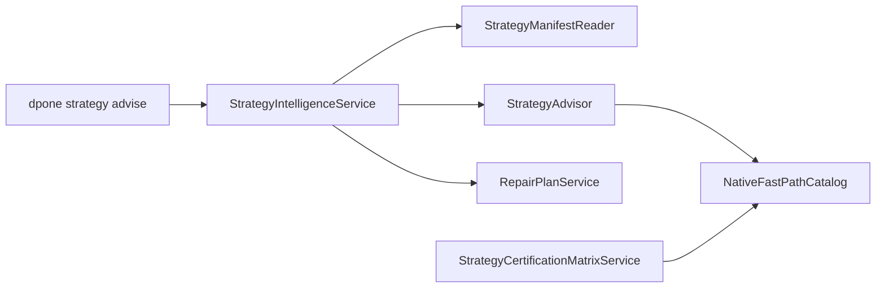
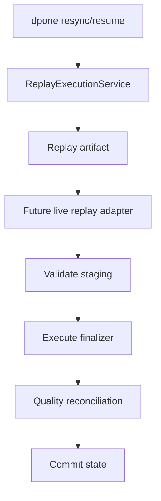
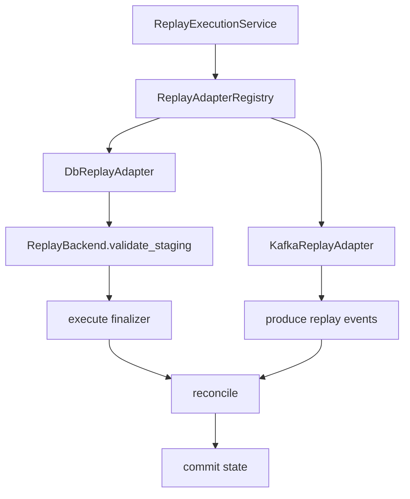

# Developer strategy intelligence guide

`dpone.strategy_intelligence` is a control-plane package for strategy selection, repair planning, certification metadata, and native fast-path recommendations. It must stay credential-free and side-effect free.

## Package map

| Module | Responsibility |
| --- | --- |
| `dpone.strategy_intelligence.models` | DTOs for decisions, signals, fast paths, repair plans, and certification entries. |
| `dpone.strategy_intelligence.native_paths` | Static target-native bulk path catalog. |
| `dpone.strategy_intelligence.advisor` | `StrategyAdvisor` and `StrategyContext` selection rules. |
| `dpone.strategy_intelligence.repair` | `RepairPlanService` for replay/resume commands. |
| `dpone.strategy_intelligence.certification` | Source -> sink -> strategy support matrix. |
| `dpone.strategy_intelligence.compiler` | `StrategyAutoCompiler` for compiling `strategy.mode: auto` before `LoadConfigBuilder` returns. |
| `dpone.strategy_intelligence.preflight` | Local native-tool availability checks. |
| `dpone.strategy_intelligence.manifest_reader` | Raw manifest hint reader for advisory CLI. |
| `dpone.strategy_intelligence.service` | Thin facade for CLI/docs UX. |

## Design constraints

- No live connector calls.
- No credentials.
- No target writes.
- No imports from runtime source/sink implementations.
- Commands stay thin; business rules belong in `dpone.strategy_intelligence` services.
- Runtime may consume decisions in a later optimizer pass, but v1 is plan/advice only.

## StrategyAdvisor

`StrategyAdvisor` converts a `StrategyContext` into a `StrategyDecision`:

```python
from dpone.strategy_intelligence.advisor import StrategyAdvisor, StrategyContext

context = StrategyContext(
    source_type="postgres",
    sink_type="mssql",
    requested_mode="auto",
    unique_key=("order_id",),
    estimated_rows=50_000_000,
    changed_percent=0.20,
    delete_percent=0.05,
    partition_column="business_date",
)

decision = StrategyAdvisor().advise(context)
assert decision.strategy_mode == "partition_replace"
```

## Extension rules

When adding a new target-native strategy:

1. Add or update the fast path in `NativeFastPathCatalog`.
2. Add an advisor rule only if the signal is deterministic and safe.
3. Add a safety gate when state, deletes, locks, or quality semantics can be affected.
4. Add certification matrix status and required evidence.
5. Add CLI and docs contract tests.

## Architecture



## Test requirements

Every change must cover:

- direct advisor rules;
- CLI JSON output;
- native path command text;
- repair command ordering;
- certification status for supported and unsupported combinations;
- documentation presence and cross-links.

## Runtime optimizer roadmap

The current pass compiles `strategy.mode: auto` before hydration and stores the decision under `LoadConfig.options.strategy_intelligence`. Remaining runtime optimizer work:

1. Runtime validates explicit strategy against advisor warnings before sink load.
2. Native path preflight also verifies ODBC, permissions, target staging schema, and table locks.
3. Adaptive batching changes batch size during a run based on observed throughput and backpressure.
4. Benchmark artifacts feed adaptive batch defaults back into future plans.
5. Repair/resync commands execute replay after dry-run approval.

## Live execution services

| Service | Purpose |
| --- | --- |
| `AdaptiveBatchController` | Adjusts batch size from observed rows/sec and target backpressure. |
| `LivePreflightService` | Aggregates injected target probes for ODBC, permissions, staging schema, and lock risk. |
| `ReplayExecutionService` | Writes dry-run or approved replay artifacts for `dpone resync` and `dpone resume`. |

### Probe design

`LivePreflightProbe` is an abstract interface. Concrete live probes must be injected from runtime adapters or tests. This prevents CLI modules from importing MSSQL/Postgres/ClickHouse clients directly.

```python
from dpone.strategy_intelligence.live_preflight import LivePreflightProbe, ProbeCheck

class MssqlProbe(LivePreflightProbe):
    def check_odbc(self) -> ProbeCheck:
        return ProbeCheck("odbc", True, "ODBC Driver 18 available")
```

### Replay design

`ReplayExecutionService` is artifact-first. The command does not mutate databases by itself. Future live replay adapters should consume the replay artifact, validate staging artifacts again, execute idempotent finalization, run reconciliation, and commit state only after success.



## Replay adapters

`dpone.strategy_intelligence.replay_adapters` contains the execution seam for approved replay.

| Class | Responsibility |
| --- | --- |
| `ReplayBackend` | Port for staging validation, finalizer execution, event production, reconciliation, and state commit. |
| `DbReplayAdapter` | Staging-first sequence for MSSQL, Postgres, ClickHouse, and BigQuery sinks. |
| `KafkaReplayAdapter` | Event-log replay sequence for Kafka sinks. |
| `ReplayAdapterRegistry` | Resolves DB vs Kafka adapter by sink type. |
| `ArtifactOnlyReplayBackend` | Safe default backend that records sequence without external mutation. |

State commit safety is the main invariant: `commit_state` must run only after staging validation, finalizer/event replay, and reconciliation pass.



Live backend implementations must be small and sink-specific. Do not add ODBC, Kafka, ClickHouse, or BigQuery client calls to CLI modules or to `ReplayExecutionService`.

## Live replay backend implementations

`dpone.strategy_intelligence.live_backends` contains concrete backend implementations built around injected clients.

| Class/protocol | Purpose |
| --- | --- |
| `ReplaySqlClient` | Minimal SQL client protocol: `exists`, `execute`, `scalar`. |
| `ReplayKafkaClient` | Minimal Kafka client protocol: `produce`, `flush`, `scalar`. |
| `MssqlReplayBackend` | MSSQL partition switch and delete+insert replay SQL. |
| `PostgresReplayBackend` | Postgres partition attach/detach contract and delete+insert replay SQL. |
| `ClickHouseReplayBackend` | ClickHouse `REPLACE PARTITION` and delete+insert fallback SQL. |
| `BigQueryReplayBackend` | BigQuery partition-scoped delete+insert replay SQL. |
| `KafkaLiveReplayBackend` | Kafka replay event production with state commit after reconciliation. |

These classes intentionally depend on injected clients, not on `pyodbc`, `psycopg`, `clickhouse-driver`, BigQuery SDK, or `confluent-kafka` directly. Runtime/deployment adapters are responsible for wrapping vendor clients into the small protocols.

Example injected clients:

```python
from dpone.strategy_intelligence.live_backends import MssqlReplayBackend

backend = MssqlReplayBackend(
    client=my_sql_client,
    target_schema="landing",
    target_table="orders",
    staging_schema="staging",
)
```

Implementation rules:

1. Keep vendor-specific connection creation outside `dpone.strategy_intelligence`.
2. Never commit state before reconciliation passes.
3. Keep finalizer SQL generation sink-specific and covered by tests.
4. Keep Kafka replay append/event-log only.
5. Use artifact-only backend in local dry-run tests unless live credentials are explicitly configured.

## Runtime replay client adapters

Runtime replay clients adapt existing runtime connectors to replay backend ports:

| Adapter | Input | Output port |
|---|---|---|
| `RuntimeSqlReplayClient` | MSSQL/Postgres/ClickHouse/BigQuery connector-like object | `exists`, `scalar`, `execute` |
| `RuntimeKafkaReplayClient` | `KafkaConnector` connector-like object | `produce`, `flush`, `scalar` |
| `RuntimeReplayBackendFactory` | `ReplayBackendConnection` | concrete `ReplayBackend` |

### No SDK imports in replay backends

Replay backends must not import database or Kafka SDKs. Keep these imports inside runtime connectors:

| SDK | Allowed location |
|---|---|
| `pyodbc` | `dpone.runtime.connectors.mssql` |
| `psycopg` | `dpone.runtime.connectors.postgres` |
| `clickhouse_driver` | `dpone.runtime.connectors.clickhouse` |
| `confluent_kafka` | `dpone.runtime.connectors.kafka` |

This keeps `dpone.strategy_intelligence` import-safe and makes replay execution easy to unit test with injected clients.

## Replay evidence writer

`ReplayEvidenceWriter` owns production evidence serialization for replay execution. Keep it separate from backend SQL/Kafka logic:

| Concern | Owner |
|---|---|
| Backend step result | `ReplayBackendResult` |
| Operation sequencing | `ReplayAdapter` |
| Raw replay artifact | `ReplayExecutionService` |
| JSON/Markdown evidence | `ReplayEvidenceWriter` |

Evidence schema is versioned as `dpone.replay.evidence.v1`. Add new fields in a backward-compatible way and keep existing field names stable for certification tooling.

Backends should add structured diagnostics under `ReplayBackendResult.details`:

```python
ReplayBackendResult(
    True,
    "reconciliation passed",
    details={"status_check": {"name": "reconciliation", "status": "passed"}},
)
```

Use `row_count_check` only for actual row-count evidence. Do not invent row counts from boolean status probes.
