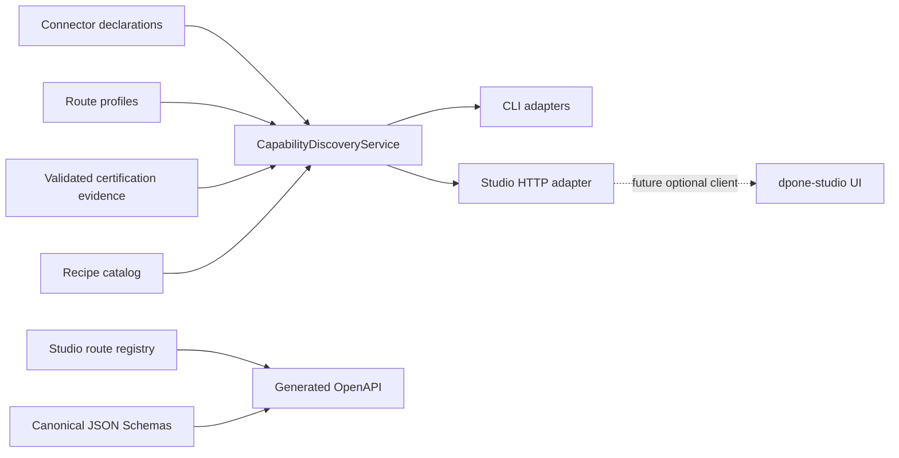

# Studio API developer contract

Implement typed Studio clients against the generated OpenAPI contract while
keeping all capability and manifest policy inside dpone.

Audience: dpone maintainers and frontend/client developers.

## Dependency boundary



CLI, HTTP, and UI never call each other. Application composition modules under
`dpone.readiness`, called by thin command roots, inject the same services. The
HTTP adapter owns transport limits, authentication, CORS, status mapping, and
the process-local audit ring. It does not own route, quality, manifest, or
Airflow policy.

Primary contracts:

- `dpone.capability-discovery.v1`;
- `dpone.pipeline-summary.v1`;
- `dpone.error.v1`;
- [Studio OpenAPI 3.1](api/studio-openapi.json);
- [ADR 0030](adr/0030-self-service-capability-studio-boundary.md).

## Generate and verify OpenAPI

The route registry is the authority for both dispatch and OpenAPI:

```bash
uv run python tools/generate_studio_openapi.py
uv run pytest tests/test_studio_http_security_v1.py -q
```

Do not hand-edit `docs/api/studio-openapi.json`. CI compares it byte-semantically
with `studio_openapi_document()`.

## Read-model rules

`CapabilityDiscoveryService` receives immutable, already-loaded authorities.
It performs no network or vendor SDK imports. A snapshot digest is canonical
JSON over ordered connectors, routes, recipes, and issues.

The Studio composition root injects a `CapabilitySnapshotProvider`. Every use
case calls it once, revalidating local evidence freshness against the trusted
clock while keeping one immutable snapshot for the whole request. Do not cache
that snapshot for the process lifetime.

`PipelineSummary.valid` requires both canonical authoring validity and a
supported route for every declared process. `PipelineSummary.operational_status`
is the independent operational projection: `ready`, `blocked`, or
`not_applicable`. An unknown or `not_supported` route is `blocked`, emits
`DPONE_ROUTE_NOT_SUPPORTED`, and offers `dpone check` rather than Airflow
preview. A client must use both fields and must not turn valid authoring into
an Airflow/runtime success claim.

Route certification remains six-dimensional:

```text
source × sink × strategy × transport × schema evolution × runtime mode
```

The projector promotes only internally consistent `PASS` proofs from the exact
expected commit. A digest from one proof cannot satisfy a different proof.
Matrix input failures, missing digests, failed proof blockers, or foreign
commits remain unverified/experimental.

The route validator is an application service injected into draft, plan, and
static-check operations. Each plan/check compiles bounded authoring YAML once,
including classic table overrides, validates the resolved process mappings,
and passes the same `ProcessSpec` to the planner. Canonical and deprecated HTTP
aliases cannot bypass it. Recipe list responses also expose `passed` and
`issues`; usable built-in fallback rows do not erase an invalid external
catalog. A malformed recipe authority remains inspectable but blocks draft,
plan, static check, and scaffold before any write.

Certification-artifact references are resolved from those same canonical
`ProcessSpec` objects, after defaults and table overrides have been applied.
Every referenced file must resolve to a regular file inside the configured
project root without a symlink escape and must satisfy the size bound before it
is copied into the temporary planning snapshot. Draft, plan, static check, and
legacy aliases do not walk raw YAML for a second interpretation of evidence.

Pipeline listing reads only direct
`pipelines/<id>/pipeline.yaml` entries, with a 1000-entry catalog bound and a
200-item response bound. It does not recursively scan the project.

## Error and status behavior

Application failures use transport-neutral `StudioError`. The stdlib adapter
maps stable error codes to HTTP status codes at the boundary. Unexpected exceptions are
logged without their text and become `DPONE_STUDIO_INTERNAL_ERROR`. Never place
credentials, raw exception text, filesystem internals, or Vault paths in client
responses.

| Condition | HTTP |
| --- | ---: |
| unknown route | 404 |
| known route, wrong method | 405 |
| timeout | 408 |
| body over 1 MiB | 413 |
| wrong media type | 415 |
| schema/domain validation | 422 |
| concurrency bound | 429 |

The 10-second value is a response deadline, not forced Python-thread
cancellation. A timed-out operation retains its concurrency slot until the
application call actually returns. Every Studio operation must therefore use
bounded local I/O and must not wait indefinitely on network or vendor systems.
The adapter does not claim a general-purpose remote execution sandbox.

Legacy aliases are read/query compatibility only. They emit `Deprecation`,
`Sunset`, and `Link` headers. New schemas and behavior are added only under
`/api/v1`. Several legacy operations have no v1 replacement and are
retirement-only compatibility surfaces; see the operation table in the
[Studio operations runbook](studio-operations.md#compatibility).

The direct Python `StudioApiService` class is a deprecated zero-argument
compatibility facade. Canonical code constructs strict-DI
`StudioApplicationService` through `build_studio_api_service()`. The legacy
`capabilities()` method retains the historical connection-capability payload;
canonical clients use `/api/v1/capabilities` or
`StudioApplicationService.capability_snapshot()`.
Historical imports of `StudioApiError`, `StudioHttpConfig`, and
`StudioAuditLog` from `dpone.readiness.studio_api` remain compatibility
re-exports; new code imports those HTTP types from
`dpone.readiness.studio_http_models`.

## UI constraints

The future Nuxt client must be generated from OpenAPI and may own presentation
and browser state only. It must not:

- derive route support or certification;
- parse manifests to make policy decisions;
- store a second pipeline database;
- execute shell strings;
- access Vault or Airflow metadata;
- turn `SKIP`/`UNVERIFIED` into success.

Studio authoring requires a later CAS plan/apply contract and usability gate.
The read-only v1 API is not permission to add ad hoc mutation endpoints.

The optional `dpone-studio-assets` distribution is considered installed only
when its version matches `0.1.x`, its package contains
`dpone-studio-assets.json` with schema `dpone.studio-assets.v1` and API
`v1`, and the confined entrypoint file exists. The probe never imports UI code.
Missing packages report `not_installed`; malformed or incompatible packages
report `incompatible`.

## Validation

Run focused tests:

```bash
uv run pytest \
  tests/test_capability_discovery_v1.py \
  tests/test_studio_pipeline_summary_v1.py \
  tests/test_studio_api_v1_contracts.py \
  tests/test_studio_http_security_v1.py -q
```

Then run the repository change selector and mandatory non-live gates. Remote
hosting, SSO/RBAC, and a public UI remain `UNVERIFIED` until separately
specified, implemented, and certified.
