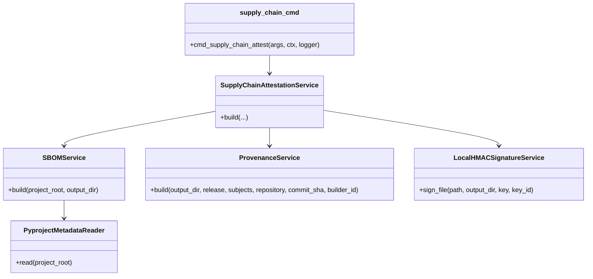

# Developer supply-chain guide

This guide documents the SBOM/provenance/signing architecture for contributors.

## Design rule

Supply-chain evidence is release/control-plane logic. Do not put supply-chain business logic into command modules, runtime sinks, or connector code.

## Module taxonomy

| Module | Responsibility |
| --- | --- |
| `dpone.supply_chain.pyproject_reader` | Read project metadata and dependency declarations. |
| `dpone.supply_chain.sbom` | Build SPDX-like and CycloneDX-like SBOM JSON documents. |
| `dpone.supply_chain.provenance` | Build in-toto/SLSA-inspired provenance JSON. |
| `dpone.supply_chain.signing` | Build local HMAC signature envelopes. |
| `dpone.supply_chain.attestation` | Orchestrate all artifacts into one bundle. |
| `dpone.commands.supply_chain_cmd` | Thin CLI adapter only. |

## Class map



## Extension rules

- Add new SBOM formats as separate renderer/service classes.
- Add cloud/KMS/Sigstore signing as optional adapters, not as required core dependencies.
- Keep artifact JSON deterministic enough for CI diffing.
- Never write signing keys into output artifacts.
- Keep command modules argument-only; test business logic through services.

## Test requirements

Every supply-chain change must include:

- service tests for generated SBOM/provenance/signature files;
- CLI tests for `dpone supply-chain attest`;
- docs contract tests for user docs, developer docs, architecture, and CI/CD;
- package build and lockfile-backed `uv run twine check dist/*` when release metadata changes.

## CI/CD contract

Generated artifacts belong under:

```text
test_artifacts/supply-chain/
```

Upload them with `if: always()` on release and manual certification workflows.
Do not require external signing services for the default PR gate.

Release distributions also receive GitHub Artifact Attestations in
`.github/workflows/release.yml` before PyPI publishing. The release job must keep
`id-token: write` and `attestations: write`, and the attestation step must cover
both `dist/*.whl` and `dist/*.tar.gz` subjects.

After generating GitHub attestations, the release job verifies each wheel and
sdist with `gh attestation verify` scoped to the current repository, Git ref, and
commit SHA. Upload the JSON receipts from
`test_artifacts/supply-chain/github-attestations/` with `if: always()` so failed
release attempts still leave diagnosable evidence.

Keep third-party workflow actions pinned to full commit SHAs and keep
`astral-sh/setup-uv` on an explicit `version`. Refresh action pins and the
`uv` runtime version intentionally in a reviewed PR instead of floating on tags,
branches, or the latest available toolchain.

Keep [SLSA release self-assessment](supply-chain-slsa.md) current when changing
release provenance, attestation verification, artifact upload paths, Scorecard
evidence, or the release publication order. The self-assessment is a scoped
release claim, not a blanket guarantee for local builds or historical artifacts.
