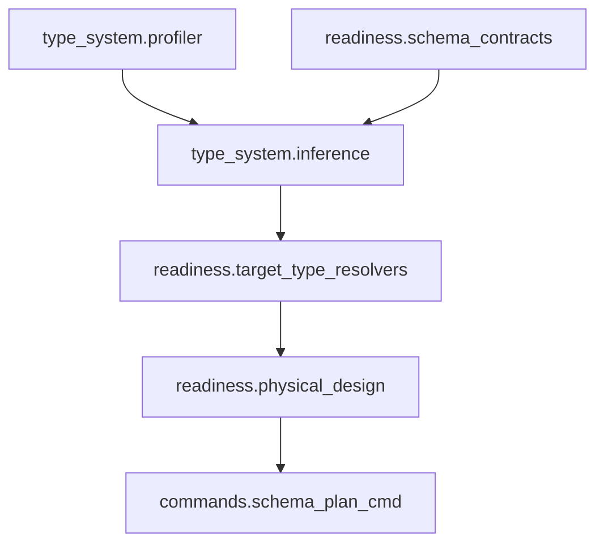
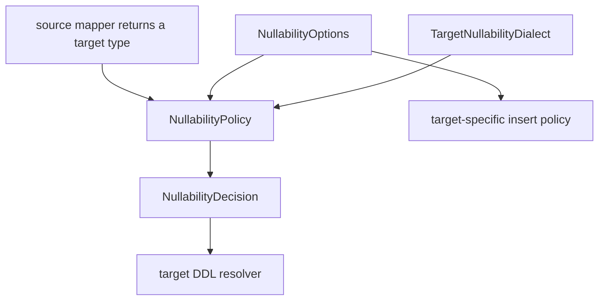
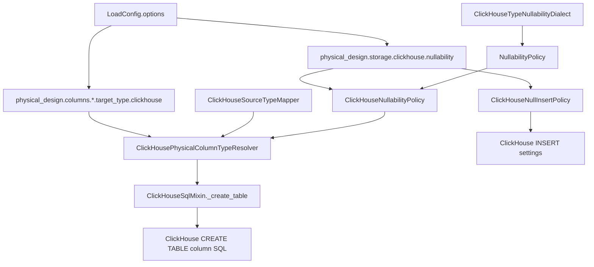
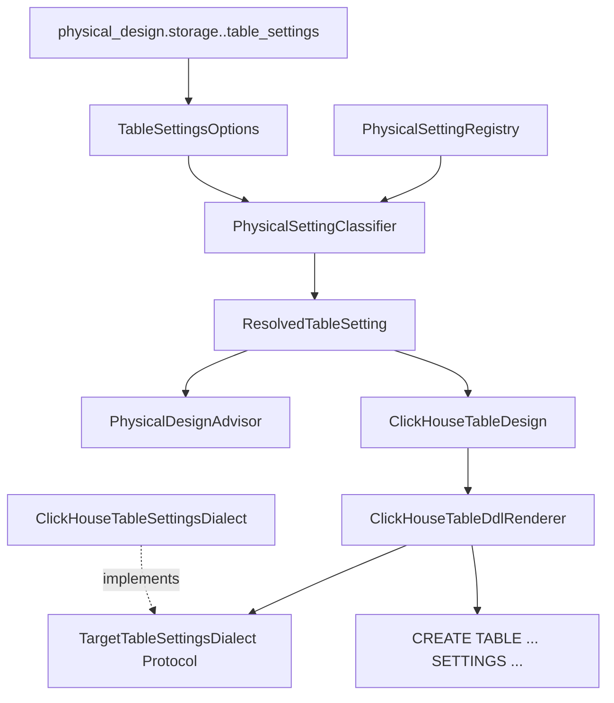
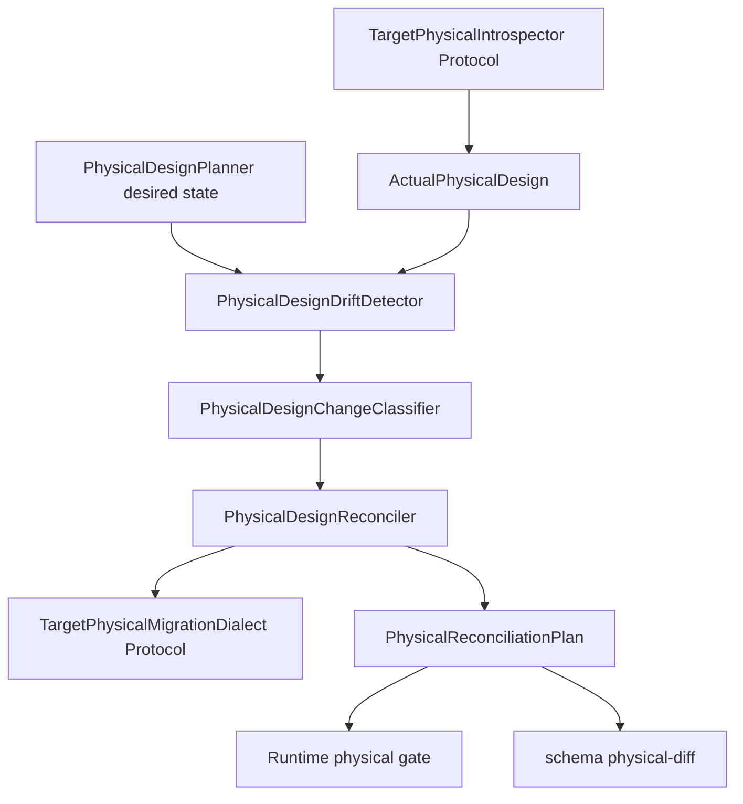

# Developer type-system guide

This guide explains how to extend dpone type inference and physical DDL planning
without creating god modules.

## Layers



## Rules

- Keep source profiling independent from database clients.
- Keep logical contracts portable.
- Put target-specific decisions in target type resolvers.
- Put DDL statement rendering in physical design planners.
- Route unsafe existing-table DDL through online schema governance.
- Add tests before adding new target behavior.

## Adding a target type resolver

1. Add logical-to-target mapping in `dpone.readiness.target_type_resolvers`.
2. Add DDL rendering in `dpone.readiness.physical_design`.
3. Add manifest schema fields only if users need new public config.
4. Add unit tests for type rendering and DDL rendering.
5. Add docs in [Physical design](physical-design.md) and target connector docs.

## Source-agnostic nullability contract

Nullability inference is a reusable physical-design taxonomy, not an MSSQL-only
or ClickHouse-only rule. The source mapper returns a target type, then the
generic policy decides whether inferred target nullability should be preserved
or removed.



Taxonomy:

| Component | Responsibility | Extension rule |
| --- | --- | --- |
| `NullabilityOptions` | Generic `mode`, `null_handling`, and per-column overrides. | Reuse for every target that supports this behavior; keep config parsing immutable. |
| `NullabilityPolicy` | Apply `preserve_source` or `non_nullable_by_default` to an already mapped target type. | Do not import source connectors or runtime sinks. |
| `NullabilityDecision` | Stable result: final target type, nullable flag, handling mode, and provenance. | Feed DDL planners and runtime resolvers without re-reading manifests. |
| `TargetNullabilityDialect` | Target-specific syntax for detecting and stripping nullable type wrappers. | Implement only type syntax, such as ClickHouse `Nullable(T)` or another target's native marker. |

Source adapters remain thin. A future Postgres/API/MySQL mapper only needs to
return a mapped target type, either through the generic `target_type` attribute
or a compatibility attribute understood by the target resolver. It should not
parse `physical_design.storage.<target>.nullability`.

Target adapters split DDL and DML responsibilities. `ClickHouseNullabilityPolicy`
is a ClickHouse adapter over the generic `NullabilityPolicy` plus
`TargetNullabilityDialect`. `ClickHouseNullInsertPolicy remains ClickHouse-specific`
because `input_format_null_as_default` and `insert_null_as_default` are
ClickHouse insert settings, not portable SQL semantics.

## Runtime ClickHouse physical type resolver

Readiness planning and runtime table creation use the same precedence rule:
explicit physical target type wins over inferred source metadata. The runtime
ClickHouse sink keeps this rule in a focused resolver instead of embedding
manifest parsing inside the sink.



Taxonomy:

| Component | Responsibility | Extension rule |
| --- | --- | --- |
| `ClickHousePhysicalColumnTypeResolver` | Choose a concrete ClickHouse column type for runtime DDL. | Keep it pure: no connector access, no DDL execution. |
| `ClickHouseNullabilityPolicy` | Adapt generic `NullabilityPolicy` to ClickHouse `Nullable(...)` syntax after explicit overrides are checked. | DDL-only: never inspect or mutate row values. |
| `ClickHouseNullInsertPolicy` | Translate `null_handling` into ClickHouse-native insert settings and per-column fail-fast validation. | DML-only: use ClickHouse defaults, never implement Python default-value mapping. |
| `ClickHouseNullabilityOptions` | Immutable normalized view of `physical_design.storage.clickhouse.nullability`. | Parse config once per decision boundary; reject invalid enum values early. |
| `ClickHouseSourceTypeMapper` | Protocol for source metadata mappers that expose `resolve_column`. | Return a mapped target type through `target_type` or the legacy `clickhouse_type` attribute. |
| `ClickHouseSink(..., physical_type_resolver=...)` | DI boundary for tests and future route-specific policies. | Inject a resolver instead of subclassing the sink for type precedence. |
| `MssqlClickHouseTypeMapper` | Default MSSQL metadata to ClickHouse type mapping. | Add vendor type mappings here, not in sink code. |

Nullability precedence:

1. `physical_design.columns.<column>.target_type.clickhouse` wins literally.
2. `physical_design.storage.clickhouse.nullability.columns.<column>` overrides global mode.
3. `physical_design.storage.clickhouse.nullability.mode` applies to inferred types.
4. Missing nullability config preserves source nullability.

Runtime insert semantics:

| Path | Defaulting setting |
| --- | --- |
| `INSERT ... FORMAT TabSeparated/CSV/...` | `input_format_null_as_default=1` |
| `clickhouse-driver` row `VALUES` insert | query setting `input_format_null_as_default=True` |
| `INSERT ... SELECT` staging finalization | `SETTINGS insert_null_as_default=1` |

Per-column `null_handling: fail_fast` is enforced before insert when query-wide
defaulting is enabled for other columns.

ClickHouse nullable key best practice:

- Prefer not-null target columns for expressions used in `ORDER BY` or
  `PRIMARY KEY`; this keeps the physical design aligned with ClickHouse's
  MergeTree guidance.
- Treat `allow_nullable_key` as a controlled table-settings escape hatch, not
  as a nullability policy. ClickHouse documents Nullable key expressions as
  supported only with `allow_nullable_key`, but strongly discouraged, with
  `NULLS_LAST` ordering for `NULL` values:
  [MergeTree primary keys and indexes](https://clickhouse.com/docs/engines/table-engines/mergetree-family/mergetree#primary-keys-and-indexes-in-queries).
- Keep the layers separate: `ClickHouseNullabilityPolicy` changes inferred DDL
  types, `ClickHouseNullInsertPolicy` maps real insert-time NULL handling to
  ClickHouse insert settings, and target table settings such as
  `allow_nullable_key` belong to `CREATE TABLE ... SETTINGS`.

## Physical Design Target Settings Contract

Target table settings are modeled as a reusable physical-design contract, not
as a ClickHouse-only SQL suffix. The contract is intentionally target-agnostic:
future sinks reuse the same normalized `TableSettingsOptions`, registry,
classifier, advisor, and dialect protocol, then provide their own renderer.



Taxonomy:

| Component | Responsibility | Extension rule |
| --- | --- | --- |
| `TableSettingsOptions` | Immutable normalized scalar settings from `physical_design.storage.<target>.table_settings`. | Keep source- and target-agnostic; validate shape, key safety, scalar values, and deterministic order only. |
| `PhysicalSettingRegistry` | Target-aware catalog of known table settings, wrong-context settings, risks, docs, and recommended alternatives. | Add target rules here; do not put product guidance into SQL renderers. |
| `PhysicalSettingClassifier` | Converts normalized settings into `ResolvedTableSetting` decisions: supported, escape hatch, wrong-context, or unknown. | Remain pure and deterministic; fail before DDL for known wrong-context settings. |
| `ResolvedTableSetting` | Explainable decision emitted into physical-plan output. | Include key, value, source path, class, support level, risk, docs URL, and recommendation. |
| `PhysicalDesignAdvisor` | Converts decisions into user-facing warnings and best-practice hints. | Keep advisory text near the physical contract, not in connector execution code. |
| `TargetTableSettingsDialect` | Protocol for target-specific table-settings rendering. | New targets implement the protocol; planners and renderers depend on the protocol, not concrete classes. |
| `ClickHouseTableSettingsDialect` | ClickHouse implementation: classifies settings and renders deterministic `SETTINGS key = value` clauses with safe literals. | Keep ClickHouse-specific SQL quoting here; do not add runtime connector calls. |
| `ClickHouseTableDdlRenderer` | Renders final ClickHouse DDL from `ClickHouseTableDesign`. | Receives resolved design through DI and appends table settings after storage clauses. |

Algorithm:

1. Normalize `table_settings`: missing value becomes empty; non-object values
   fail; keys must match `[A-Za-z_][A-Za-z0-9_]*`; values must be scalar
   strings, numbers, integers, or booleans; keys are sorted for stable plans.
2. Classify every setting with the target registry.
3. Reject known wrong-context settings before DDL. For ClickHouse,
   `async_insert`, `wait_for_async_insert`, and `max_insert_block_size` belong
   to `clickhouse_bulk.insert_settings`; `input_format_null_as_default` and
   `insert_null_as_default` belong to nullability insert policy, not target
   table creation.
4. Allow unknown but syntactically safe target settings with an explain warning,
   because target settings evolve faster than dpone releases.
5. Render target DDL only through the dialect protocol. For ClickHouse, booleans
   render as `1` or `0`, strings are single-quoted with escaping, and settings
   are sorted for byte-stable runtime/readiness parity.

ClickHouse `allow_nullable_key` is registered as an escape hatch. ClickHouse
documents that Nullable key expressions require
[`allow_nullable_key`](https://clickhouse.com/docs/operations/settings/merge-tree-settings#allow_nullable_key),
while the MergeTree guide says nullable primary-key expressions are strongly
discouraged and notes `NULLS_LAST` ordering for NULL values:
[MergeTree primary keys and indexes](https://clickhouse.com/docs/engines/table-engines/mergetree-family/mergetree#primary-keys-and-indexes-in-queries).
Therefore the recommended dpone production path remains
`physical_design.storage.clickhouse.nullability.mode: non_nullable_by_default`
for key columns; `table_settings.allow_nullable_key: 1` exists for deliberate
compatibility migrations.

Industrial baseline:

| System | Pattern | dpone contract |
| --- | --- | --- |
| dlt | Schema hints and target adapters. | Keep structured hints, add classification, explain output, and wrong-context guardrails. |
| Airbyte | Managed destination lifecycle with destination-owned final tables. | Keep managed lifecycle, expose reviewable physical DDL decisions. |
| Fivetran | Destination schema is mostly system-managed. | Keep schema as a contract while making physical settings self-service. |
| Informatica | SQL escape hatches such as pre/post SQL. | Avoid raw SQL as the primary UX; use typed settings with docs and recommendations. |
| Pentaho | Separate table output from SQL script steps. | Keep DDL/load separation and make DDL declarative, testable, and explainable. |

## Physical Design Drift & Reconciliation Contract

Physical reconciliation is a separate layer from schema evolution. Schema
evolution owns source/target column drift; physical reconciliation owns
existing-table layout drift such as engine, partition key, sorting key, primary
key, and target table settings.



Taxonomy:

| Component | Responsibility | Extension rule |
| --- | --- | --- |
| `PhysicalTableState` | Immutable desired or actual physical state: columns, engine, partition/order keys, primary key, and table settings. | Keep portable and serializable; no connector or SQL rendering code. |
| `TargetPhysicalIntrospector` | Reads actual target physical metadata. | Implement per target; do not classify risk or execute DDL. |
| `PhysicalDesignDriftDetector` | Pure desired-vs-actual diff. | Compare only physical state; do not call connectors. |
| `PhysicalDesignChangeClassifier` | Maps drift to `online_safe`, `shadow_required`, `schema_evolution_owned`, `blocking`, or `warning`. | Keep product safety policy here, not in sinks. |
| `PhysicalDesignReconciler` | Builds blockers, warnings, recommendations, and DDL actions from decisions. | Takes target dialect through DI. |
| `TargetPhysicalMigrationDialect` | Renders target-specific safe DDL. | New targets implement only the safe action surface they can certify. |
| `ClickHousePhysicalIntrospector` | Reads `system.tables` and `system.columns`, and parses explicit table settings from `create_table_query`. | Connector-facing only; parsing stays outside `ClickHouseSink`. |
| `ClickHousePhysicalMigrationDialect` | Renders `ALTER TABLE ... MODIFY SETTING` for ClickHouse table settings. | Do not render engine/order/partition migrations in v1. |

Runtime modes:

| Mode | Behavior |
| --- | --- |
| `block` | Default. Existing-table drift blocks before load and emits evidence. |
| `auto_safe` | Executes only target-certified online-safe DDL; for ClickHouse v1 this means online-mutable table settings only. |
| `plan_only` | Emits DDL/evidence and blocks before load; no DDL execution. |

ClickHouse proof points:

- [`ALTER TABLE ... MODIFY|RESET SETTING`](https://clickhouse.com/docs/sql-reference/statements/alter/setting)
  is the online-safe surface used for table settings.
- [MergeTree settings](https://clickhouse.com/docs/operations/settings/merge-tree-settings)
  are table-engine settings and may appear in `CREATE TABLE ... SETTINGS`.
- [Column ALTER docs](https://clickhouse.com/docs/sql-reference/statements/alter/column)
  show why key/layout-affecting physical drift must be treated as a governed
  migration rather than a silent runtime change.

Example custom resolver:

```python
from dpone.runtime.sinks.clickhouse_physical_types import ClickHousePhysicalColumnTypeResolver


class AuditedClickHouseTypeResolver(ClickHousePhysicalColumnTypeResolver):
    def physical_override(self, *, load_config, column):
        if column.startswith("__audit_"):
            return "String"
        return super().physical_override(load_config=load_config, column=column)
```

Register the resolver at composition time:

```python
sink = ClickHouseSink(connector, physical_type_resolver=AuditedClickHouseTypeResolver())
```

## Test checklist

- canonical logical type parsing;
- source metadata normalization;
- sampled inference confidence;
- explicit contract precedence;
- target-specific override precedence;
- unsafe narrowing blocked by governance;
- docs YAML examples parse;
- CLI text/json/md output.
