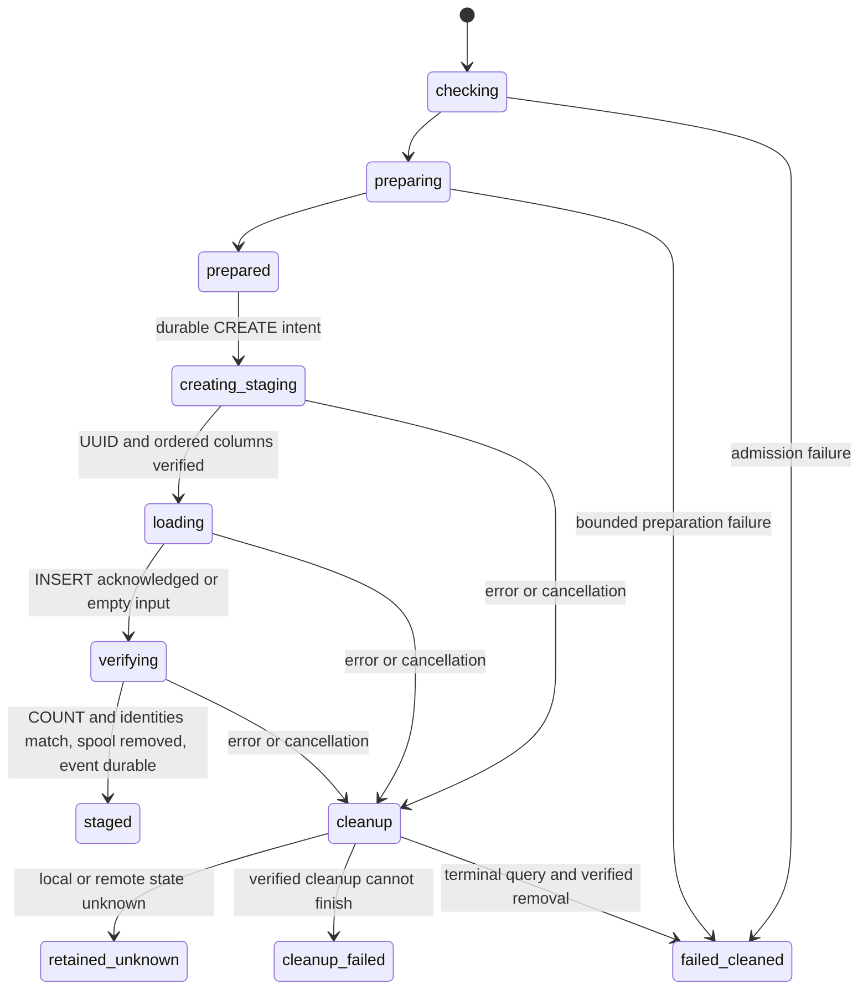

# Validated ClickHouse file staging: developer contract

This page explains ownership, dependency boundaries and proof for connector authors,
maintainers and operators. Start with the [Python staging guide](validated-clickhouse-file-staging.md)
for prerequisites, options and recovery. [ADR 0064](adr/0064-validated-file-clickhouse-staging.md)
records the design boundary.

## Execution and authority

```mermaid
flowchart LR
    S[Original export and genuine receipt] --> W[Wrapper attempt and busy guard]
    W --> P[Canonical logical reader and exact RowBinary preparation]
    P --> J[Private spool and immutable journal]
    J --> R[Controlled client or HTTP adapter]
    R --> T[Owned local staging table]
    T --> V[COUNT and metadata verification]
    V --> C[Original and derived identity rechecks]
    C --> H[Durable staged event and existing staging handle]
```



`ClickHouseSink.stage_validated_file` delegates to its constructed service. It does not
call `stage_payload`, schema evolution, source selection or checkpoint services.
`ClickHouseValidatedFileService` owns the attempt sequence, query ownership and
failure cleanup. The optional `validated_file_runner_factory(config, policy)` is
constructor DI; production composition selects one controlled adapter. The runtime
query port, finite admission policy, errors, canonical JSON and journal resource port
live in `runtime/clickhouse_file_stage_contract.py`. SQL identifiers and literals use
explicit escaping.

The shared reader in `connectors/bulk_text_codec.py` preserves the producer's TAB/LF, UTF-8, control
marker and hex-whitespace rules. Source validation retains its previous error
ordering and unlimited legacy reader mode. Only the new preparer supplies record
and phase budgets. It freezes ordered physical columns and the finite type policy,
converts every cell and validates all rows before CREATE. A held source descriptor
and repeated receipt verification establish source identity; a separately sealed
and rehashed spool establishes derived identity.

## Component ownership and dependency injection

| Component | Responsibility and dependencies |
| --- | --- |
| `ClickHouseSink` | Supplies existing connector/callback bindings to the construction boundary and retains the returned collaborators under its existing attributes |
| `clickhouse_staging_composition.py` | Constructs the validated-file service, decoder and finalizer in order; owns controlled adapter selection and storage-bound journal wiring |
| `ClickHouseValidatedFileService` and preparer | Depend on the runtime query/journal ports and finite policy; own sequencing and preparation, respectively |
| `clickhouse_client_request.py` and `clickhouse_http_request.py` | Own credentials, options and pure request construction shared by legacy and controlled transports |
| `bulk_text_codec.py` | Owns the producer codec and its logical reader, including wire grammar and read errors |
| `clickhouse_file_response.py` | Owns bounded HTTP response framing and raw reads using injected metadata/body limits and remaining-deadline callback; imports only the standard library |
| `ClickHouseFileAttemptJournal` | Implements private spool storage, immutable event publication and failure inventory |

`build_clickhouse_staging_components` returns an immutable three-field bundle
(`validated_file`, `decoder`, `finalizer`). Assembly invokes no supplied callback
and does not route execution through the bundle. The default file runner factory
reads the sink's current connector through an explicit provider when invoked;
decoder and finalizer retain the connector supplied at initialization. Table,
create, map-type, count and mutation methods keep their original binding, including
the decoder's map-type signature inspection. Drop/plan/create lambdas keep their
existing delayed lookup. The sink retains `build_file_runner` as an exact alias
with its historical signature and metadata.

Existing partition clones still forward only connector, state storage, logger and
legacy runner classes. They do not acquire new resolver or validated-file factory
inheritance. Public clone tests cover both transports, parent/child connection use,
staging cleanup after transport failure and source-file retention.

The internal service constructor requires a bound
`journal_factory(policy, attempt_id)` and no longer accepts `storage=`. Production
composition uses `partial(ClickHouseFileAttemptJournal, storage=StoragePreflightService())`.
A custom factory must return `ClickHouseFileJournalResource`, whose capabilities are
limited to the attempt directory/ID, context management, identity/reserve checks,
partial-file creation and sealing, spool release, event recording and failure
attachment. It cannot select a planner or change preparation policy. The public
sink constructor and `stage_validated_file` signature remain unchanged.

The historical bulk transport modules retain exact credential/option aliases and
their own execution methods. Public builder overrides still dispatch through the
same methods; request extraction does not reroute `execute_query` through another
public override. The reader facade in `support/bulk_text_file_reader.py` and policy
facade in `sinks/clickhouse_validated_file_models.py` retain exact aliases. Historical
class/function metadata, signatures, dataclass behavior and pickle globals remain
compatible. Internal consumers import the implementation owner directly.

The original `ContractValidatedFileArtifact` import from `contract_artifacts` remains
the same class, re-exported from `validated_file_artifact`. Its new
`file_validation_attempt(attempt_id, *, verification_budget=None)` context binds a
freshly verified receipt. Busy entry cannot reset an active attempt. A genuine
receipt reissued before entry can be admitted; replacement during the attempt is
rejected, including replacement during verification. `complete` accepts one exact
non-boolean count matching the original receipt, while active, after all checks.
Exceptional exit resets the latest summary. This grants no terminal source authority.

`FileVerificationBudget` carries an injected monotonic clock, one absolute deadline
and per-scan byte cap through the existing path/descriptor/authority verifiers.
Scans check initial size and actual bytes before/after fixed reads, including EOF;
`pread` preserves shared descriptor position. Pinned authority locks have bounded
acquisition and release only after acquisition. Calls without a budget keep legacy
signatures. An authority without an explicit budget parameter is rejected before
invocation; no unbounded fallback is tried. Errors from a supported verifier retain
their identity. File acquisition helpers remain separate from receipt policy.

## Query and failure sequence



Each mutation has exactly one `dpone-b02-<attempt_id>-<create|insert|drop>` query ID
and a durable intent before submission. There is no internal retry. Read-only
probes, descriptions and the single COUNT have separate identified requests. The
endpoint binds nonzero server/database UUIDs; stage identity additionally binds
its nonzero table UUID, ownership comment, local MergeTree engine, non-temporary
status and exact ordered physical columns. Metadata is checked after transport too.
Control output pins `output_format_json_quote_64bit_integers=0`, so COUNT and column
positions are canonical JSON integers. Booleans, strings, missing/multiple rows or
inexact counts fail; estimates never supply count authority.

Client uses bounded nonblocking raw stdin/stdout/stderr and reaps on BaseException;
HTTP bounds chunk framing, socket operations, full response and connection closure.
A successful mutation needs complete bounded acknowledgment, exact emitted byte
count/hash and later count/identity checks. Client exit zero and HTTP status 200
alone are insufficient. HTTP rejects endpoint address drift and does not follow
redirects. The caller must exclude load balancing and future endpoint failover.

The HTTP adapter injects its owned response factory through CPython 3.11/3.12's
`HTTPConnection.response_class` hook, preserving the supplied connection factory.
The standard-library response module receives the two independent byte limits and
the adapter's remaining-deadline callback at construction.
A buffered reader owns the original socket file and checks the same absolute
deadline before and after each raw receive. Closing a `Connection: close` transport
therefore does not detach response reads from their deadline. One 64 KiB metadata
budget covers status/header lines, chunk sizes, data terminators and trailers;
the response body has its own 64 KiB cap. Fixed-length responses must satisfy their
entire declared length. Chunked responses require unsigned hexadecimal sizes,
exact CRLF data terminators, a zero chunk and the complete trailer terminator.
Response and connection cleanup both run before completion is recorded. A cleanup
failure preserves the original error and retains unresolved local ownership.
The client checks its absolute deadline before and after the final process wait;
an already-exited process cannot authorize a late successful acknowledgment.

On error, stop/join local I/O separately from confirming server termination.
Exact-query `KILL ... SYNC` with matching `finished` output or an already observed
terminal acknowledgment can establish remote completion. Empty/missing output is
unknown. A failed CREATE or DROP is subject to the same rule. Unknown execution
retains staging/spool/journal and returns no handle. A live local sender retains
its reader until it can be joined. Known termination permits ownership-checked
cleanup, under the no-concurrent-DDL namespace assumption.

One preparation deadline covers entry verification, preparation/seal and pre-CREATE
identity checks. Immediately after INSERT acknowledgment or the empty-input boundary,
one verification deadline covers COUNT, metadata, local identity scans, completion
and return. Control calls use the lesser remaining phase and selected transport
bounds. These are cooperative filesystem limits, not hard OS syscall preemption.
The later existing finalizer retains its own authority and timeout policy.

## Evidence and operations

The journal stores canonical UTF-8 JSON under
`<work_directory>/<attempt_id>/events/<six-digit-sequence>/attempt.json`. Each event
is published through descriptor-relative immutable-tree creation with no replacement
and fsync. Sequence and previous-event SHA256 advance only after durable confirmation.
A visible file whose writer failed is not a successful event or checkpoint.

`source_identity` contains the original receipt. `derived_identity` binds preparation
version, ordered target schema, source receipt hash, binary policy, selected mode,
RowBinary bytes/hash and prepared count. The canonical SHA256 is `semantic_id`;
random attempt IDs, file paths, credentials and timestamps are excluded. Distinct
attempts for identical source/representation inputs have the same semantic identity
and independent resources. This is not global deduplication.

Events record phase/outcome, query identity, endpoint, planned/observed ownership,
counts, local/remote observations, error code and cleanup inventory. Counts unknown
at that point remain null. Empty input records `query_kind=insert`, null query ID
and `not_submitted_empty` states while the separate COUNT observes zero. Journals
exclude source values, source path and credentials. The spool contains data and
must be protected by the caller's retention/access policy.

Final evidence follows spool cleanup and source completion verification. The exact
record and journal path are attached to `handle.metadata['validated_file_consumption']`.
On failure, the last confirmed record is attached to the primary exception's
`details`. Failed failure-record publication adds a note and preserves the last
confirmed inventory. See the [operator recovery procedure](validated-clickhouse-file-staging.md#diagnose-and-recover).

## Validation and customer journey

The local test producer uses genuine source receipts, public sink entrypoints,
real child-process/loopback HTTP adapters and an independent RowBinary parser.
It checks standalone NULL-like strings, controls, literal markers, quotes,
Unicode, duplicate rows, all 256 byte values and LEB128 boundaries. A separate
comparison checks the real producer codec against independently authored source
bytes. Corrupted/reordered/trailing data cannot pass the oracle. Fault tests cover
source authority, phase deadlines, journal ordering, count rejection, exact-query
cancellation and retained unknown CREATE/INSERT/DROP state.
Compatibility characterization also checks historical pickle payloads, signatures,
resolved type hints, dataclass defaults and public subclass dispatch through real
child processes and loopback HTTP. These checks distinguish preserved transport
behavior from the controlled staging adapter's stricter admission policy.

For installed-runtime verification, set `DPONE_TEST_B02_EVIDENCE_ROOT` to an external
output root and `DPONE_TEST_B02_CANDIDATE` to the exact candidate SHA. The actual
reconciliation tests emit `<root>/<client|http>/value-reconciliation.json` only after
comparisons succeed. They include expected/observed values or byte hashes and
`non_live=true`. Their explicit scope is text/binary value reconciliation; scalar,
empty-input and negative-case proof stays in the complete pytest/JUnit results.
Case keys include row ordinals so identical duplicate values remain distinct.
Without a supplied candidate, identity is `UNVERIFIED/WIP`.
Use a fresh root such as `/var/tmp/b02-evidence/<candidate-sha>/<run-id>` for each
run. These UTF-8 test reports overwrite the same per-mode filename on rerun; an
interrupted write may be partial. Consume them only with a successful complete
test run and preserved raw hashes. They are separate from the immutable runtime
journal and do not provide its durability guarantees.
Run every collected B02 test, retaining raw logs, node inventory and both producer
outputs; do not infer coverage from a filtered passing subset.

```bash
uv run pytest tests/test_b02_*.py tests/test_file_verification_budget.py \
  tests/test_file_contract_validation.py tests/test_mssql_artifact_integrity.py -q
uv run python tools/agent_policy/select_checks.py --base-ref origin/master
```

The repository's Python, architecture, documentation, full non-live and installed
checks plus an independent review of the exact commit remain completion gates.
Live value readback requires a separately approved environment and credentials;
local protocol peers are not ClickHouse certification. Performance is unmeasured.

| Journey | Entry or observable result |
| --- | --- |
| Discover | Staging guide distinguishes this explicit API from the ordinary route |
| Prepare/configure | Genuine receipt, finite representation table, named work directory and same-node settings |
| Execute/observe | One method; exact count and durable staged metadata |
| Diagnose/recover | Safe error location, original exception, inventory and manual unknown-state procedure |
| Operate | Capacity reserve, bounded I/O, caller-managed journals and private namespace |
| Upgrade | Additive API; reconcile retained attempts before caller/package rollback |

No CLI command, manifest schema, Airflow/dbt integration, source-finalization or
release-publication authority is added. See [architecture](architecture.md),
[compatibility](compatibility.md) and [fast-path contracts](runtime-fast-path-contracts.md).
