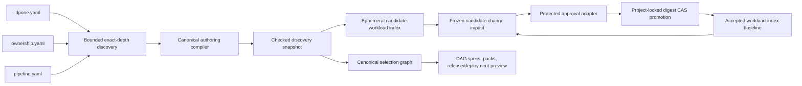

# Domain-first discovery and CI

This page explains the bounded discovery model and shows how a platform
engineer can consume its public Python and CLI projections in CI. Start with
the [domain-first tutorial](getting-started/domain-first-airflow.md) when you
are creating your first pipeline.

## One discovery path



Discovery reads only:

```text
<layout.root>/<domain>/ownership.yaml
<layout.root>/<domain>/pipelines/<pipeline-id>/pipeline.yaml
```

It does not recursively search the repository. Symlinks, path traversal,
unexpected nesting, duplicate project-wide pipeline ids, malformed ownership,
mixed flat/domain-first authority, and incomplete pipeline directories fail
closed. Folder authoring dependencies are compiled and included in semantic
identity.

Every consumer receives the same immutable `ProjectDiscoverySnapshot`.
Selection, check, preview, and workload-index generation do not rediscover a
pipeline through separate algorithms.

## Public Python API

The stable application API is lazily exported from `dpone`, so ordinary
`import dpone` remains free of Airflow, Vault, and network side effects:

```python
from dpone import (
    ProjectDiscoveryService,
    ProjectSelectionLoader,
    WorkloadIndexChangeImpact,
    build_airflow_self_service_service,
    compare_workload_indexes,
    workload_index_from_snapshot,
)

authoring = build_airflow_self_service_service(root=".")
snapshot = ProjectDiscoveryService(".").discover()
index = workload_index_from_snapshot(snapshot)
selection = ProjectSelectionLoader(root=".").load(".")
impact: WorkloadIndexChangeImpact = compare_workload_indexes(index, index)
```

`ProjectDiscoverySnapshot`, `LoadedProjectSelectionGraph`, and
`WorkloadIndexChangeImpact` are immutable result contracts. Roots and
collaborators are injected at composition boundaries. Advanced embedders may
construct `AirflowSelfServiceService` with their own `AuthoringLockFactory`;
the builder wires the standard POSIX adapter. Application services import
neither CLI command adapters nor Airflow. The public workload-index field
vocabulary is owned by `dpone.contracts.workload_index`. The immutable discovery
snapshot, canonical identity material, and fingerprint algorithms are owned by
`dpone.manifest`; closed serialization validation and comparison are owned by
`dpone.services.workload_index_contract`, while CI projection orchestration is
owned by `dpone.services.workload_discovery_projection`.

## Workload index contract

`dpone.workload-index.v1` is deterministic build-plane evidence, never an
editable source of truth. Workloads are ordered by canonical `pipeline_id`.
The closed identity includes:

- layout root and project-wide id scope;
- ownership fingerprint;
- primary source and canonical semantic fingerprints;
- folder dependencies and their digests;
- logical connection references;
- durable Airflow participation;
- one composite workload fingerprint.

Validation recomputes every workload fingerprint and the project fingerprint.
It also rejects unsafe public paths and non-canonical workload, connection-ref,
or dependency ordering before an index can drive change impact. SQL
dependencies are read through their lexical project-relative path without
following symlinks.

## Accepted baseline lifecycle

The accepted baseline is a protected CI artifact, not a generated file kept in
the pull-request branch. The platform owns two pinned executables:

```text
DPONE_WORKLOAD_BASELINE_FETCH <project-confined-destination>
DPONE_WORKLOAD_BASELINE_PUBLISH <baseline> <promotion-receipt> <approval-evidence>
```

`FETCH` verifies provenance and materializes the exact protected current
baseline. It returns `0` when a baseline was fetched, `10` only when the
project has never accepted a baseline, and any other code for an integrity or
availability failure. `PUBLISH` verifies that the receipt's
`promoted_sha256` equals the supplied baseline bytes, uploads both immutable
objects by digest, and conditionally advances the protected current pointer.
It records approver identity, approval-evidence digest, source revision, and
the previous pointer in the audit log.

The artifact store retains every baseline referenced by an open change,
release, or audit-retention policy. Rollback does not overwrite the pointer or
copy old bytes over the checkout. It selects a retained baseline as a new
candidate, produces a fresh impact against current, obtains approval, and
promotes it through the same CAS path.

## Atomic CI handoff

The three workload commands each emit one UTF-8 JSON document to stdout:

```bash
set -eu

ci_dir=".dpone-ci/workload-index"
mkdir -p "$ci_dir"
candidate="$(mktemp "$ci_dir/candidate.XXXXXX.json")"
baseline="$ci_dir/accepted.json"
impact="$ci_dir/impact.json"
receipt="$ci_dir/promotion-receipt.json"

if test -z "${DPONE_WORKLOAD_BASELINE_FETCH:-}" ||
  test -z "${DPONE_WORKLOAD_BASELINE_PUBLISH:-}" ||
  test -z "${DPONE_WORKLOAD_IMPACT_APPROVER:-}"; then
  echo "Protected workload baseline fetch, publish, and approval executables are required." >&2
  rm -f "$candidate"
  exit 1
fi

set +e
"$DPONE_WORKLOAD_BASELINE_FETCH" "$baseline"
fetch_status=$?
set -e
if test "$fetch_status" -ne 0 && test "$fetch_status" -ne 10; then
  echo "Accepted workload-index baseline could not be fetched safely." >&2
  rm -f "$candidate"
  exit 1
fi
if test "$fetch_status" -eq 10; then
  rm -f "$baseline"
fi

if ! dpone workload index > "$candidate"; then
  cat "$candidate"
  rm -f "$candidate"
  exit 1
fi

if test -f "$baseline"; then
  if ! dpone workload impact \
    --baseline "$baseline" \
    --current "$candidate" \
    > "$impact"; then
    cat "$impact"
    echo "Preserve $candidate and $impact for diagnosis." >&2
    exit 1
  fi
  approval_mode="change"
  approval_evidence="$impact"
else
  approval_mode="bootstrap"
  approval_evidence="$candidate"
fi

if ! "$DPONE_WORKLOAD_IMPACT_APPROVER" \
  "$approval_mode" \
  "$approval_evidence" \
  "$candidate" \
  "$baseline" \
  > "$receipt"; then
  cat "$receipt"
  echo "Preserve $candidate, $receipt, and $approval_evidence for diagnosis or recovery." >&2
  exit 1
fi

if ! "$DPONE_WORKLOAD_BASELINE_PUBLISH" \
  "$baseline" \
  "$receipt" \
  "$approval_evidence"; then
  echo "Promotion committed locally, but durable publication failed." >&2
  echo "Preserve $baseline, $candidate, $receipt, and $approval_evidence for recovery." >&2
  exit 1
fi

rm -f "$candidate"
```

`--baseline` is mandatory and all files remain inside the project root.
`impact` validates both complete closed indexes before comparing fingerprints.
Malformed, reordered, stale, or escaped inputs return non-zero; omission of the
baseline is a CLI usage error and never means "compare with an empty project."
Candidate mode reports `current_source: candidate`,
`validation_status: passed`, and `discovery_status: not_run` because it does
not rediscover the checkout.

The protected CI configuration supplies `DPONE_WORKLOAD_IMPACT_APPROVER`; an
absent or rejecting approver fails closed for bootstrap and later changes.
`impact --current "$candidate"` records the raw baseline/candidate digests and
their semantic fingerprints. The hook passes these identities to
`dpone workload promote`, which captures candidate bytes under the project lock
and updates the baseline through compare-and-swap. Candidate replacement or a
concurrent baseline promotion therefore fails closed. Omitting `--current`
keeps interactive rediscovery compatibility, but CI must not use it for
baseline promotion.

### Approval executable contract

The approval executable is platform-owned policy and promotion adapter, not a
script trusted from the candidate pull request. Pin it from the protected base
branch, a content digest, or a protected CI image. It receives exactly four
arguments:

```text
<mode: bootstrap|change> <evidence-path> <candidate-index-path> <baseline-path>
```

For `bootstrap`, evidence is the closed candidate index. For `change`, evidence
is `dpone.workload-change-impact.v1`. The hook validates policy and invokes
exactly one of these operations:

```bash
approval_mode="$1"
approval_evidence="$2"
candidate="$3"
baseline="$4"

sha256_file() {
  python -c \
    'import hashlib, pathlib, sys; print("sha256:" + hashlib.sha256(pathlib.Path(sys.argv[1]).read_bytes()).hexdigest())' \
    "$1"
}
json_field() {
  python -c \
    'import json, pathlib, sys; value=json.loads(pathlib.Path(sys.argv[1]).read_text())[sys.argv[2]]; print(value)' \
    "$1" "$2"
}

candidate_content_sha256=""
candidate_fingerprint=""
baseline_content_sha256=""
baseline_fingerprint=""
current_content_sha256=""
current_fingerprint=""

if test "$approval_mode" = "bootstrap"; then
  candidate_content_sha256="$(sha256_file "$candidate")"
  candidate_fingerprint="$(json_field "$candidate" project_fingerprint)"
  dpone workload promote \
    --candidate "$candidate" \
    --baseline "$baseline" \
    --approved-candidate-sha256 "$candidate_content_sha256" \
    --approved-current-fingerprint "$candidate_fingerprint" \
    --expect-baseline-absent
else
  baseline_content_sha256="$(json_field "$approval_evidence" baseline_content_sha256)"
  baseline_fingerprint="$(json_field "$approval_evidence" baseline_fingerprint)"
  current_content_sha256="$(json_field "$approval_evidence" current_content_sha256)"
  current_fingerprint="$(json_field "$approval_evidence" current_fingerprint)"
  dpone workload promote \
    --candidate "$candidate" \
    --baseline "$baseline" \
    --approved-candidate-sha256 "$current_content_sha256" \
    --approved-current-fingerprint "$current_fingerprint" \
    --expected-baseline-sha256 "$baseline_content_sha256" \
    --expected-baseline-fingerprint "$baseline_fingerprint"
fi
```

Change-mode values come from the closed impact report. Bootstrap computes both
candidate identities from the same stable candidate bytes before policy
approval. Exit `0` means promotion completed and returns
`dpone.workload-index-promotion.v1`; every other exit rejects or reports a CAS
failure. The hook must never use `mv`, redirect over the baseline, or modify
either evidence input.

The receipt is CAS mutation evidence, not an approval attestation. Protected CI
records approver identity, the policy decision, and the digest of approved
impact evidence separately. The protected publisher persists the receipt and
baseline before advancing its current pointer. If CI loses stdout after a
successful local commit, or publication fails, it must not repeat stale
guards. Follow
[`DPONE_WORKLOAD_INDEX_PROMOTION_RECOVERY_REQUIRED`](errors/DPONE_WORKLOAD_INDEX_PROMOTION_RECOVERY_REQUIRED.md).
When the current baseline already matches the candidate, a fresh change-mode
impact and the current baseline identities produce a deterministic no-op CAS.
Any different current identity requires a new review.

| Mode/change | Minimum protected approval |
| --- | --- |
| First baseline (`bootstrap`) | Platform owner and repository CODEOWNER |
| Additions only | Domain CODEOWNER |
| Modified workloads | Domain owner plus platform policy checks |
| Any removal | Platform owner plus retention/decommission review |

Never use `true`, an executable from the untrusted checkout, or an unset hook
as the default. Only `dpone workload promote` activates a candidate after
approval and preserves the last accepted baseline on every precommit failure.

## GitOps reconcile warnings

`dpone gitops airflow reconcile` and dag-spec planning emit non-blocking
warnings separately from fail-closed blockers. One domain-first audit warning is
`workload_catalog_membership_missing`: a discovered Airflow-eligible pipeline
on disk is not part of the resolved workload-set catalog membership. The
warning names the catalog file and includes a ready-to-paste `workloads:` entry;
reconcile continues, but the pipeline is not packed until membership is added.
See [Domain-first operations and recovery](domain-first-operations.md).

## Related contracts

- [Configuration reference](reference/configuration.md)
- [Workload selectors](airflow-self-service-selectors.md)
- [ADR 0031](adr/0031-domain-first-self-service-selection.md)
