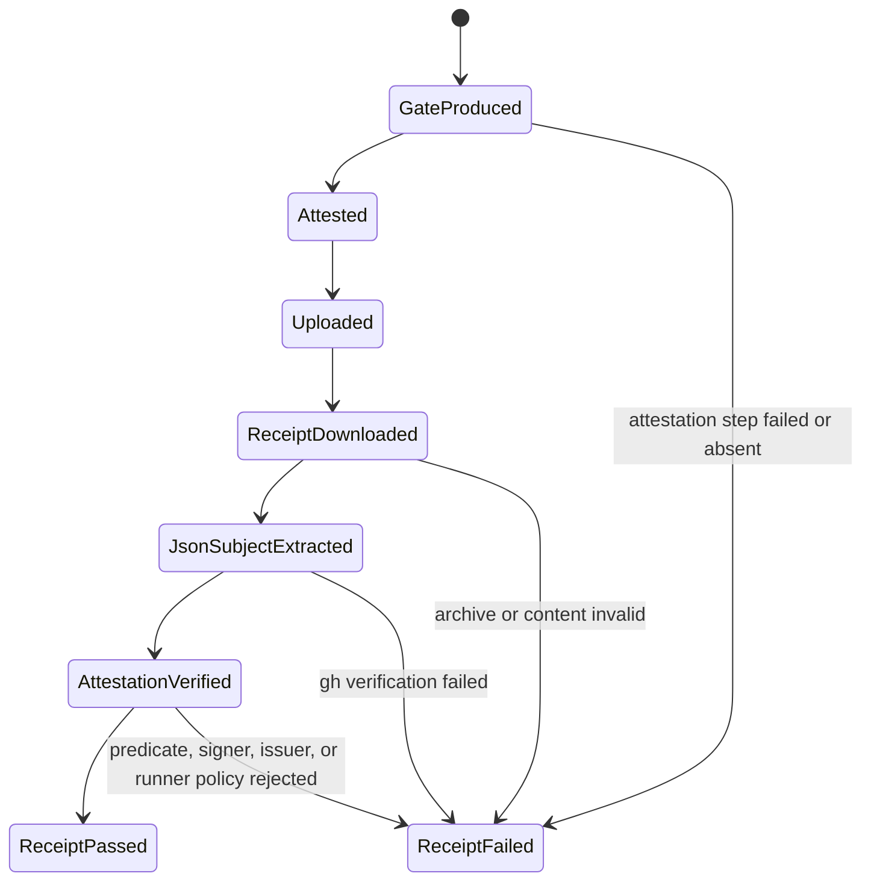
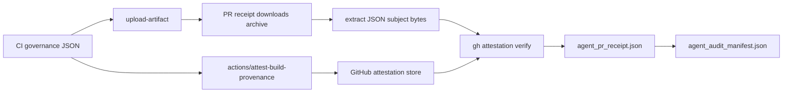

# Feature design: agent governance artifact attestations

- Status: IMPLEMENTED
- Owner: PaulKov
- Issue: #275
- Target release: next patch
Last verified: 2026-07-13

Approval note: the maintainer approved implementation in the Codex thread on
2026-07-13.

## Executive summary

Agent-control pull requests already require a live `agent-governance-gate`
artifact whose metadata, downloaded archive bytes, and
`agent_governance_gate.json` content match the reviewed PR head. The remaining
gap is provenance: a receipt can prove what it downloaded, but not yet prove
that GitHub Actions signed that exact governance JSON from the expected dpone CI
workflow.

This feature signs the `agent_governance_gate.json` subject in CI with GitHub
Artifact Attestations and makes `Agent PR receipt` fail closed when the matching
governance artifact lacks a verified SLSA provenance attestation from
`PaulKov/dpone/.github/workflows/ci.yml`. The measurable outcome is that a
reviewer can trace one PR head SHA to required checks, artifact metadata, local
archive bytes, validated governance JSON, and cryptographically verified signer
workflow evidence in one receipt.

## Personas and customer journey

| Persona | Goal | Current pain | Success signal |
|---|---|---|---|
| Solo maintainer | Merge agent-control PRs without pretending self-approval is an independent review. | The governance receipt proves artifact content, but not signer workflow provenance. | `Agent PR receipt` records attestation `PASS` for the governance JSON. |
| Auditor | Reconstruct who produced the evidence for a merge decision. | Artifact id and SHA-256 are useful, but do not identify the workflow identity that signed the subject. | `agent_audit_manifest.json` includes compact attestation status, subject digest, predicate type, and signer workflow. |
| Future agent | Detect evidence laundering rather than copying a green status. | A forged or manually re-uploaded JSON can look semantically valid if only content is checked. | Missing, failing, wrong-predicate, or wrong-signer attestation fails the receipt. |

Journey:

1. An agent-control PR changes policy, workflow, or agent governance docs.
2. CI runs on the PR head and generates
   `test_artifacts/agent-policy/agent_governance_gate.json`.
3. CI signs that JSON subject with GitHub Artifact Attestations, then uploads
   the `agent-governance-gate` artifact for 90 days.
4. The maintainer finalizes the PR body after required checks are green.
5. `Agent PR receipt` fetches live required checks, artifact metadata, the
   artifact archive, and the governance JSON bytes.
6. The receipt runs `gh attestation verify` against the extracted JSON subject
   and requires the expected repository, signer workflow, OIDC issuer, SLSA
   provenance predicate, and GitHub-hosted runner posture.
7. The receipt writes raw evidence, compact evidence chain, and audit manifest
   fields for audit triage.

## Scope

### In scope

- Sign CI-generated `agent_governance_gate.json` with GitHub Artifact
  Attestations.
- Add the minimum documented workflow permissions needed to produce
  attestations.
- Add PR receipt CLI enforcement with `--require-github-attestation`.
- Verify the extracted governance JSON subject with the GitHub CLI, not the zip
  wrapper.
- Record compact attestation evidence in:
  - raw `github_evidence.artifacts[]`;
  - `evidence_chain.governance_artifact`;
  - `agent_audit_manifest.json`.
- Update JSON schemas, tests, docs, workflow security policy, and setup
  inventory.

### Non-goals

- No runtime ETL, connector, Airflow, dbt, package, or manifest behavior change.
- No attempt to attest every test artifact or coverage file.
- No offline attestation bundle storage in this iteration.
- No reusable trusted-builder workflow yet. That can become a later hardening
  step after this end-to-end verifier is stable.
- No claim that artifact attestations prove the governance result is correct.
  They prove provenance and integrity; the existing semantic validators still
  decide whether the content is acceptable.

### Assumptions and constraints

- The repository is public on GitHub, so artifact attestations are available on
  current GitHub plans.
- GitHub's documentation says generating an attestation requires workflow
  permissions `id-token: write`, `contents: read`, and `attestations: write`.
- `gh attestation verify` can fetch online attestations for a file when given
  `--repo`.
- GitHub CLI JSON output contains `verificationResult.statement`,
  `verificationResult.signature.certificate`, and `verifiedTimestamps`; policy
  must prefer certificate and timestamp fields because GitHub documents
  predicate metadata as potentially workflow-controllable.
- Pull request CI may use a synthetic merge commit as the workflow source
  digest, while the artifact metadata binds the artifact to the PR head SHA.
  This feature therefore enforces signer workflow identity and continues to use
  artifact metadata for PR-head binding instead of hard-coding a
  `--source-digest` expectation.

## Public contract

### CLI

`tools/agent_policy/pr_receipt.py` adds:

```bash
--require-github-attestation
```

The flag is meaningful only when live GitHub evidence is requested. With the
flag enabled for an agent-control PR, the matching governance artifact must have
attestation status `PASS`; otherwise the receipt exits non-zero and records
`ERROR:` lines in text mode. JSON output remains schema version 2 and adds
attestation fields under artifact evidence.

### Python API

`GitHubArtifactEvidence` gains an additive `attestation` field containing a
repository-local dataclass or `None`. Existing callers that do not request
attestation verification continue to receive `None`.

### Manifest/schema

`evals/agent/pr-receipt.schema.json` and
`evals/agent/audit-manifest.schema.json` add compact attestation objects. The
status vocabulary is `PASS`, `FAIL`, and `UNVERIFIED`. `UNVERIFIED` is allowed
for local/manual runs that do not require attestation, but
`--require-github-attestation` turns missing or non-PASS attestation into a
receipt failure.

### Artifacts and evidence

Raw artifact evidence adds:

```json
{
  "attestation": {
    "status": "PASS",
    "predicate_type": "https://slsa.dev/provenance/v1",
    "subject_sha256": "<64 hex>",
    "source_repository": "PaulKov/dpone",
    "source_ref": "refs/pull/123/merge",
    "source_digest": "<workflow source commit>",
    "signer_workflow": "PaulKov/dpone/.github/workflows/ci.yml",
    "issuer": "https://token.actions.githubusercontent.com",
    "verified_timestamps_count": 1,
    "runner_environment": "github-hosted",
    "errors": []
  }
}
```

The compact evidence chain and audit manifest keep only the fields needed for
triage and later diagnosis.

### Compatibility and migration

The change is additive for local callers and fail-closed only in the GitHub PR
receipt workflow, where the new flag is enabled. Historical receipt artifacts
are immutable and are not migrated. Rollback is a normal revert of the workflow
attestation step, CLI flag, schemas, and docs.

## Detailed algorithm

1. CI runs `Agent governance gate` on Python 3.12 and writes
   `agent_governance_gate.json`.
2. CI invokes `actions/attest-build-provenance` with `subject-path` pointing to
   that JSON file.
3. CI uploads the governance artifact as before.
4. `Agent PR receipt` loads PR body, changed paths, repository, head SHA, and
   branch-protection policy.
5. The GitHub evidence fetcher downloads the matching artifact archive.
6. The archive helper extracts exactly one `agent_governance_gate.json` byte
   stream from the downloaded zip. Missing, duplicate, invalid zip, or unreadable
   JSON remains semantic receipt failure.
7. When attestation is requested, the fetcher writes the extracted JSON bytes to
   a temporary file and runs:

   ```bash
   gh attestation verify <json-file> \
     --repo PaulKov/dpone \
     --signer-workflow PaulKov/dpone/.github/workflows/ci.yml \
     --cert-oidc-issuer https://token.actions.githubusercontent.com \
     --deny-self-hosted-runners \
     --predicate-type https://slsa.dev/provenance/v1 \
     --format json
   ```

8. Non-zero exit from `gh` becomes attestation `FAIL` with sanitized stdout and
   stderr snippets.
9. Zero exit with an empty or malformed JSON array becomes attestation `FAIL`.
10. Zero exit with verified entries becomes attestation `PASS`; the verifier
    normalizes predicate type, subject SHA-256, source repository, source ref,
    source digest, signer workflow expectation, issuer, timestamp count, and
    runner environment where present.
11. Receipt validation requires attestation `PASS` for the matched governance
    artifact when `--require-github-attestation` is set.
12. Result payload, evidence chain, and audit manifest copy compact attestation
    fields for audit.

### Pseudocode

```text
if require_attestation:
    json_bytes = extract_unique_governance_json(artifact_archive)
    if json_bytes is missing:
        artifact.attestation = FAIL("governance JSON subject is unavailable")
    else:
        result = gh_attestation_verify(json_bytes, repo, signer_workflow)
        artifact.attestation = normalize(result)

validate_artifact_identity()
validate_artifact_archive_digest_and_size()
validate_governance_json_content()

if require_attestation and artifact.attestation.status != PASS:
    fail("governance artifact attestation is not verified")
```

### State machine



### Edge cases

- Local CLI run without `--require-github-evidence`: no GitHub evidence is
  fetched and attestation remains `null`.
- Live evidence requested but attestation not required: verifier is not invoked;
  artifact attestation remains `null`.
- Attestation required but `gh` is unavailable: receipt records `FAIL` and exits
  non-zero.
- Attestation required but archive content is missing or duplicate: receipt
  fails through content validation and records attestation `FAIL` for the
  unavailable JSON subject.
- GitHub CLI returns malformed JSON: attestation `FAIL`.
- GitHub CLI returns a verified predicate with no extractable optional fields:
  attestation can still be `PASS` because `gh` enforced repo, signer workflow,
  issuer, runner policy, and predicate type; missing optional fields are
  recorded as `null`.
- CI attestation step is skipped because governance gate failed: the PR cannot
  reach a passing required check, and final receipt also fails if run.
- Forked PR limitations: if GitHub does not allow attestation write permissions
  for an untrusted fork context, the governance check fails closed rather than
  reporting a false pass.

## Architecture

### Components and responsibilities

| Component | Existing/new | Responsibility | Dependencies |
|---|---|---|---|
| `.github/workflows/ci.yml` | Existing | Produce and sign governance gate JSON. | GitHub Actions, `actions/attest-build-provenance`. |
| `.github/workflows/agent-pr-receipt.yml` | Existing | Require live GitHub evidence and attestation verification for final PR receipt. | GitHub CLI, `GITHUB_TOKEN`. |
| `governance_artifact_content.py` | Existing | Parse governance JSON and expose raw JSON bytes from an artifact archive. | Python stdlib zip/json. |
| `governance_artifact_attestation.py` | New | Run and normalize GitHub CLI attestation verification. | Python stdlib subprocess/tempfile/json. |
| `pr_receipt_github.py` | Existing | Compose GitHub checks, artifacts, archive content, and optional attestation evidence. | GitHub REST helpers and attestation verifier. |
| `pr_evidence_chain.py` | Existing | Copy compact artifact and attestation evidence into receipt chain. | Plain dataclass-like inputs. |
| `audit_manifest.py` | Existing | Copy compact evidence-chain attestation fields into audit manifest. | Receipt JSON. |

### Ports, adapters, and composition root

`governance_artifact_attestation.py` is the adapter around the external `gh`
binary. `pr_receipt_github.py` is the composition root because it already owns
live GitHub evidence acquisition. The verifier accepts an injectable command
path and token environment name so tests do not call GitHub.

### Data and control flow



### Alternatives and tradeoffs

| Alternative | Advantages | Disadvantages | Decision |
|---|---|---|---|
| Verify only GitHub artifact digest and JSON content | Already implemented and fast. | Does not prove signer workflow provenance. | Rejected as incomplete for supply-chain evidence. |
| Query REST attestation records directly | No `gh` subprocess. | GitHub REST docs and CLI docs both emphasize cryptographic verification and signer identity validation; easy to create a false sense of security. | Rejected for enforcement. |
| Use `gh attestation verify` online | Uses GitHub-supported cryptographic verification and policy flags. | Requires `gh` and network in receipt workflow. | Adopted. |
| Store offline bundles in artifacts | Improves long-term audit after GitHub attestation lookup changes. | More workflow and schema complexity; not needed for first fail-closed gate. | Deferred. |
| Move governance gate into reusable trusted builder | Stronger isolation and closer to GitHub's SLSA Build Level 3 guidance. | Larger workflow architecture change. | Deferred follow-up. |

### ADR requirement

No ADR is required because this hardens an existing agent-governance receipt
contract without changing dpone runtime architecture. The feature spec and docs
are sufficient normative record.

### Quality-budget impact

Expected new module size is below 220 lines. Existing modules receive small
composition changes only. The change remains under the global `max_sloc: 400`
budget and the agent-policy package guard.

## Market comparison

The relevant capability is "repository-local agent governance evidence
provenance", not data movement itself. Most data integration systems are marked
`N/A` because they do not own a repository PR governance layer.

| System/version | Relevant capability | Observed design | Strength | Limitation | Adopt/reject | Source/date |
|---|---|---|---|---|---|---|
| dlt docs, 2026-07-13 | GitHub Actions deployment for pipelines | Official docs show deploying a pipeline with GitHub Actions. | Good self-service pipeline deployment path. | No documented agent-governance artifact attestation receipt. | Adopt CI-as-product mindset; reject treating pipeline deployment docs as governance provenance. | https://dlthub.com/docs/walkthroughs/deploy-a-pipeline/deploy-with-github-actions, checked 2026-07-13 |
| Informatica IDMC/CDI, 2026-07-13 | Managed data integration governance | Official product pages describe cloud data integration and enterprise governance/security positioning. | Strong enterprise platform controls. | Not a repository-local PR evidence attestation mechanism. | N/A for this layer. | https://www.informatica.com/products/cloud-data-integration.html, checked 2026-07-13 |
| Airbyte docs, 2026-07-13 | Data replication and agent data/context layer | Official docs describe data replication and security operations. | Rich connector and replication governance surface. | No dpone-style GitHub PR governance artifact attestation. | N/A for this layer. | https://docs.airbyte.com/ and https://docs.airbyte.com/platform/operating-airbyte/security, checked 2026-07-13 |
| Fivetran docs, 2026-07-13 | Managed sync operation | Official docs describe sync cadence and platform setup. | Clear operational sync model. | Does not expose repository PR artifact provenance for maintainers. | N/A for this layer. | https://fivetran.com/docs/core-concepts/syncoverview, checked 2026-07-13 |
| Pentaho Data Integration 11.0, 2026-07-13 | ETL design and execution | Official docs describe ETL capabilities for capturing, cleansing, and storing data. | Mature ETL tooling. | Not a GitHub-native governance receipt system. | N/A for this layer. | https://docs.pentaho.com/pdia-data-integration, checked 2026-07-13 |
| Microsoft SSIS, SQL Server 2022+/Azure IR docs, 2026-07-13 | Enterprise data integration packages | Microsoft Learn describes SSIS as a platform for enterprise data integration and transformations. | Mature package and operational model. | Different deployment/control plane; no agent-control PR receipt. | N/A for this layer. | https://learn.microsoft.com/en-us/sql/integration-services/sql-server-integration-services?view=sql-server-ver17, checked 2026-07-13 |
| gusty docs, 2026-07-13 | File-oriented Airflow DAG authoring | Official docs describe file-oriented DAG construction using existing Airflow operators. | Simple orchestration authoring pattern. | Does not define signed PR governance evidence. | N/A for this layer. | https://pipeline-tools.github.io/gusty-docs/, checked 2026-07-13 |
| Astronomer Cosmos docs, 2026-07-13 | dbt in Airflow orchestration | Official docs describe converting dbt projects into Airflow DAGs. | Strong orchestration UX. | Does not address repository-local AI-agent governance evidence. | N/A for this layer. | https://astronomer.github.io/astronomer-cosmos/, checked 2026-07-13 |
| Apache Beam docs, 2026-07-13 | Portable batch/stream processing | Official docs describe Beam programming model and execution. | Robust execution model. | Not a PR governance artifact provenance layer. | N/A for this layer. | https://beam.apache.org/documentation/, checked 2026-07-13 |

External supply-chain standards are directly relevant:

| Source | Fact | Adopted pattern |
|---|---|---|
| GitHub Artifact Attestations docs, checked 2026-07-13 | Attestations create signed provenance and integrity claims and must be verified to realize security benefit. | Sign governance JSON and verify it in receipt workflow. |
| GitHub "Use artifact attestations" docs, checked 2026-07-13 | Workflow generation requires `id-token: write`, `contents: read`, and `attestations: write`; verification uses GitHub CLI. | Add documented least-privilege workflow permissions and `gh attestation verify`. |
| GitHub CLI manual, checked 2026-07-13 | `gh attestation verify` verifies integrity/provenance, supports `--repo`, `--signer-workflow`, `--cert-oidc-issuer`, `--deny-self-hosted-runners`, and JSON policy output. | Enforce signer workflow, issuer, runner posture, and SLSA predicate. |
| SLSA v1.0 verifying artifacts, checked 2026-07-13 | Provenance helps only when inspected and compared to expectations. | Treat attestation as one input to receipt policy, not as an automatic pass. |

## Measurable differentiation

```yaml
axis: signed repository-local agent governance evidence
scenario: agent-control PR changes workflows or policy and references a governance receipt
baseline: current dpone receipt with artifact metadata, archive digest, and JSON content validation
metric: binary receipt result and presence of compact attestation evidence fields
target: missing or failing attestation fails Agent PR receipt; passing attestation records predicate type, subject digest, signer workflow, issuer, and timestamp count
procedure: run focused tests plus CI Agent PR receipt on an agent-control PR
artifact: test_artifacts/agent-policy/agent_pr_receipt.json and agent_audit_manifest.json
limitations: does not prove governance JSON semantics are correct, does not store offline bundles, and does not yet isolate signing in a reusable trusted builder
```

## Security, privacy, and operations

- `ci.yml` receives only the documented attestation-generation write scopes.
- `agent-pr-receipt.yml` remains read-only and verifies online attestations with
  `GITHUB_TOKEN`.
- No secrets are printed or persisted.
- `gh` stdout/stderr is truncated and stored only as diagnostic errors on
  failure.
- The receipt fails closed on missing verifier, missing attestation, wrong
  signer, wrong predicate, wrong OIDC issuer, or self-hosted-runner provenance.
- GitHub docs warn that predicate metadata can be workflow-controllable, so
  policy enforcement relies on `gh` flags and certificate/timestamp-derived
  fields first.

## Test and certification plan

| Layer | Scenario | Environment | Expected artifact |
|---|---|---|---|
| Unit | Normalize successful `gh attestation verify --format json` output. | Local pytest. | Parsed `PASS` attestation evidence. |
| Unit | Missing, malformed, or failing verifier output. | Local pytest with fake subprocess. | `FAIL` evidence with errors. |
| Contract | PR receipt fails when attestation is required but absent. | Local pytest. | Receipt `FAIL`. |
| Contract | Evidence chain and audit manifest include compact attestation fields. | Local pytest with schema validation. | Valid receipt and manifest JSON. |
| Workflow | CI signs `agent_governance_gate.json` and documents write permissions. | Static workflow tests and workflow security guard. | Passing tests and guard output. |
| Integration | Real GitHub PR produces a verified attestation. | GitHub Actions PR workflow. | `agent_pr_receipt.json` with attestation `PASS`. |
| Live certification | N/A. | No external data system involved. | N/A. |

## Documentation plan

- Update `docs/agent-governance.md` receipt and retention sections.
- Update `docs/supply-chain-slsa.md` to mention governance artifact
  attestations separately from release artifacts.
- Update workflow/security docs only if required by existing generated checks.
- Keep PR body guidance concise: maintainers still reference
  `agent_governance_gate.json`; the receipt fetches and verifies attestation
  automatically.

## Rollout and rollback

Rollout order:

1. Add tests and schemas.
2. Add verifier and receipt wiring.
3. Add CI attestation generation and workflow security policy exception.
4. Update docs and generated metrics.
5. Open an agent-control PR and let GitHub Actions prove the live path.

Rollback trigger: if GitHub Actions cannot create attestations for the PR
context despite correct permissions, revert the workflow flag and CLI
requirement while keeping the verifier module disabled for local use.

## Agent execution plan

| Agent/role | Owned paths | Read-only paths | Forbidden paths | Dependency |
|---|---|---|---|---|
| Integrator | `.github/workflows/ci.yml`, `.github/workflows/agent-pr-receipt.yml`, `.agents/policy/workflow-security.yml`, `tools/agent_policy/**`, `tests/agent_policy/**`, `tests/test_github_workflow_governance.py`, `evals/agent/*.schema.json`, `docs/agent-governance.md`, `docs/supply-chain-slsa.md`, this spec | `AGENTS.md`, `docs/feature-design-standard.md`, `docs/agent-development.md`, official GitHub/SLSA docs | Main worktree and unrelated worktrees | Maintainer approval in thread |

Integrator and shared-file owner: Codex in
`.worktrees/agent-governance-attestations`.

## Approval checklist

- [x] User problem and CJM are clear.
- [x] Algorithm and failure semantics are implementable without guessing.
- [x] Public contracts and compatibility are explicit.
- [x] Architecture and alternatives are justified.
- [x] Relevant market research uses current official sources.
- [x] Claimed differentiation is measurable.
- [x] Tests, evidence, docs, rollout, and rollback are complete.
- [x] Path ownership and integration plan are conflict-safe.
- [x] Maintainer changed status to `APPROVED`.
