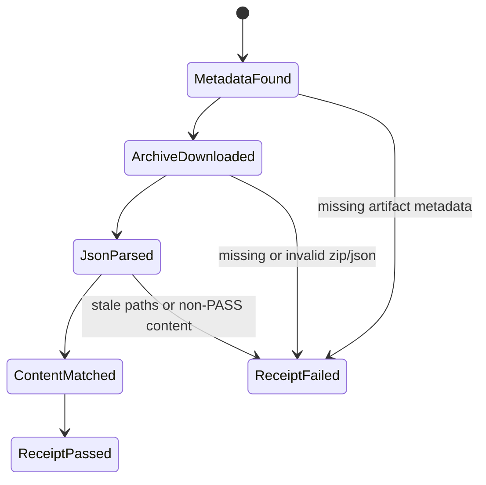
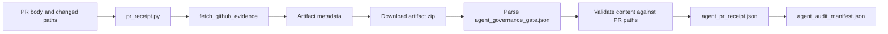

# Feature design: agent governance artifact content verification

- Status: APPROVED
- Owner: PaulKov
- Issue: #275
- Target release: next patch
Last verified: 2026-07-13

## Executive summary

Agent-control pull requests already require live GitHub evidence that required
checks are green and that an `agent-governance-gate` artifact exists for the
reviewed head SHA. PR #316 exposed the remaining gap: artifact metadata can be
valid while the JSON inside the artifact does not actually cover the pull
request changed paths. This capability makes the PR receipt open the artifact
archive, parse `agent_governance_gate.json`, and fail closed when the content is
stale, incomplete, or not about the reviewed PR diff.

## Personas and customer journey

| Persona | Goal | Current pain | Success signal |
|---|---|---|---|
| Maintainer | Merge agent-control PRs without trusting a green artifact shell. | Must manually download the governance artifact to verify changed paths. | `Agent PR receipt` fails if artifact content is stale or incomplete. |
| Auditor | Reconstruct why a governance PR was accepted. | Metadata proves artifact identity, but not artifact meaning. | Receipt JSON contains artifact content status, paths, and key check statuses. |
| Future agent | Avoid verification laundering. | A PASS row can point to an artifact whose contents are `N/A`. | Receipt validates `changed_control_surface_red_team: PASS` for agent-control diffs. |

The maintainer opens an agent-control PR, waits for required CI and the
governance artifact, finalizes owner attestation, and edits the PR body. The
`Agent PR receipt` workflow fetches live GitHub evidence, downloads the
governance artifact zip through the GitHub Actions artifacts API, extracts
`agent_governance_gate.json`, checks that the content matches the PR changed
paths, then writes both metadata and content evidence into the receipt.

## Scope

### In scope

- Download the `agent-governance-gate` artifact archive for the reviewed PR head
  SHA during `Agent PR receipt`.
- Extract and parse exactly one `agent_governance_gate.json` from the artifact
  zip.
- Validate governance content for agent-control PRs:
  - `schema_version == 1`;
  - `status == "PASS"`;
  - artifact `changed_paths` exactly match the PR changed paths;
  - `control_surface_changed == true`;
  - check `changed_control_surface_red_team` has status `PASS`.
- Add compact artifact-content evidence to `agent_pr_receipt.json`,
  `evidence_chain`, and `agent_audit_manifest.json`.
- Update schemas, tests, docs, inventory, and generated metrics.

### Non-goals

- No ETL runtime, connector, Airflow, dbt, or package behavior change.
- No cryptographic re-hash comparison beyond GitHub's artifact metadata digest
  in this content-validation PR; the follow-up
  `docs/feature-design-agent-governance-artifact-provenance.md` adds local
  downloaded archive SHA-256 and size comparison.
- No validation of arbitrary third-party artifacts.
- No change to branch-protection rules or token scopes beyond existing Actions
  read access.

### Assumptions and constraints

- GitHub artifact metadata exposes `archive_download_url`, `digest`, and
  `workflow_run.head_sha` for uploaded artifacts.
- The GitHub REST artifact download endpoint returns a zip archive redirect URL.
- The receipt workflow already has `actions: read`, which is sufficient for
  artifact metadata and archive download in this repository context.
- GitHub PR checks run on a merge commit, so the inner governance
  `head_commit` can differ from the PR branch head. The authoritative PR head
  binding remains `workflow_run.head_sha` metadata.

## Public contract

### CLI

`tools/agent_policy/pr_receipt.py` keeps the same CLI arguments and exit codes.
With `--require-github-evidence`, live validation now also downloads and checks
governance artifact content. Failures are reported in stderr/stdout text and in
`agent_pr_receipt.json` errors.

### Python API

`GitHubArtifactEvidence` gains additive content evidence fields. Public helper
behavior remains repository-local and module-level. `validate_pr_receipt()`
accepts the same arguments but requires valid artifact content when live
evidence is provided for agent-control paths.

### Manifest/schema

`evals/agent/pr-receipt.schema.json` and
`evals/agent/audit-manifest.schema.json` gain content-summary fields under raw
artifact evidence and compact evidence-chain governance artifact evidence.

### Artifacts and evidence

Each governance artifact evidence item includes a compact content object:

```json
{
  "schema_version": 1,
  "status": "PASS",
  "control_surface_changed": true,
  "changed_paths": ["tools/agent_policy/pr_receipt.py"],
  "head_commit": "merge-or-head-sha",
  "checks": [
    {"name": "changed_control_surface_red_team", "status": "PASS"}
  ],
  "errors": []
}
```

The evidence chain copies the content status, control-surface flag, changed
paths, and key governance check statuses for quick audit triage.

### Compatibility and migration

This is an additive schema extension for newly generated receipts. Existing
historical artifacts are immutable and not migrated. Rollback is a normal revert
to metadata-only validation.

## Detailed algorithm

1. Fetch required checks and check-run/status metadata as before.
2. Fetch repository artifacts named `agent-governance-gate`.
3. Keep artifacts whose `workflow_run.head_sha` equals the reviewed PR head SHA.
4. For each matching artifact, request its `archive_download_url` with the
   existing GitHub token.
5. Read the zip archive in memory and find entries whose basename is
   `agent_governance_gate.json`.
6. If the archive has zero or multiple matching JSON files, record content
   errors.
7. Parse the JSON object into a compact content evidence object.
8. During receipt validation, require:
   - no content errors;
   - schema version 1;
   - status `PASS`;
   - exact changed-path set equality with the PR changed paths;
   - `control_surface_changed: true`;
   - `changed_control_surface_red_team: PASS`.
9. Build raw receipt JSON and compact evidence chain with the content summary.
10. Copy compact content summary into the audit manifest.

### Pseudocode

```text
artifact = matching_artifact(evidence.artifacts, head_sha)
content = artifact.content

if content is None or content.errors:
    fail
if content.schema_version != 1:
    fail
if content.status != "PASS":
    fail
if set(content.changed_paths) != set(pr_changed_paths):
    fail
if pr_control_surface_changed:
    require content.control_surface_changed is true
    require content.check("changed_control_surface_red_team") == "PASS"
```

### State machine



### Edge cases

- Missing archive URL: receipt fails with a content error.
- Artifact download HTTP failure: receipt fails with the GitHub API error.
- Invalid zip: receipt fails with an archive parse error.
- Missing JSON: receipt fails with a missing `agent_governance_gate.json` error.
- Multiple JSON files: receipt fails to avoid ambiguous evidence.
- JSON is not an object: receipt fails.
- Artifact content has extra or missing paths: receipt fails and names both
  differences.

## Architecture

### Components and responsibilities

| Component | Existing/new | Responsibility | Dependencies |
|---|---|---|---|
| `pr_receipt_github_api.py` | Existing | HTTP JSON and bytes helpers for GitHub REST. | Python stdlib urllib. |
| `governance_artifact_content.py` | New | Parse and validate governance artifact zip/JSON content. | Python stdlib zipfile/json. |
| `pr_receipt_github.py` | Existing | Fetch live GitHub evidence and attach content evidence. | GitHub API helper, content parser. |
| `pr_receipt.py` | Existing | Enforce receipt policy for agent-control paths. | GitHub evidence validators. |
| `pr_evidence_chain.py` | Existing | Build compact audit chain. | Raw evidence dataclasses. |
| `audit_manifest.py` | Existing | Copy compact receipt evidence into audit manifest. | Receipt payload. |

### Ports, adapters, and composition root

The only external adapter remains GitHub REST through
`pr_receipt_github_api.py`. The content module is pure and testable from bytes
and dictionaries. `pr_receipt.py` is the policy composition root for receipt
validation.

### Data and control flow



### Alternatives and tradeoffs

| Alternative | Advantages | Disadvantages | Decision |
|---|---|---|---|
| Metadata-only validation | Fast and already implemented. | Allows a green artifact with stale or empty content. | Rejected. |
| Download and parse JSON content | Catches stale paths and `N/A` laundering. | Adds one artifact download to receipt workflow. | Adopted. |
| Recompute zip digest locally | Stronger byte-level verification. | GitHub metadata digest semantics can differ by artifact packaging version; adds complexity beyond current bug. | Deferred. |

### ADR requirement

No ADR is required. This hardens the existing agent-governance receipt contract
without changing dpone runtime architecture.

### Quality-budget impact

One focused module under `tools/agent_policy/` should stay below 250 SLOC. Edits
to existing modules must remain small and keep `tools/agent_policy` strict
module-size gates green.

## Market comparison

Use current official primary sources. Mark irrelevant systems `N/A` with reason.

| System/version | Relevant capability | Observed design | Strength | Limitation | Adopt/reject | Source/date |
|---|---|---|---|---|---|---|
| GitHub Actions REST API 2026-03-10 | Artifact metadata and archive download | Artifact list/get responses include `archive_download_url`, `digest`, and `workflow_run.head_sha`; download endpoint returns a zip archive redirect. | Official source of artifact identity and content. | Does not validate domain-specific JSON semantics. | Adopt metadata binding and zip download; add dpone semantic validation. | https://docs.github.com/en/rest/actions/artifacts checked 2026-07-13 |
| dlt | N/A | Data loading framework, not PR governance evidence. | N/A | No comparable GitHub PR receipt layer. | N/A. | N/A checked 2026-07-13 |
| Informatica | N/A | Managed data integration/governance platform, not repository PR artifact receipt. | N/A | No relevant open PR artifact contract. | N/A. | N/A checked 2026-07-13 |
| Airbyte | N/A | Connector platform, not PR governance evidence chain. | N/A | No comparable GitHub artifact receipt layer. | N/A. | N/A checked 2026-07-13 |
| Fivetran | N/A | Managed ELT service, not repository CI receipt tooling. | N/A | No comparable PR artifact validation layer. | N/A. | N/A checked 2026-07-13 |
| Pentaho | N/A | ETL/orchestration suite, not agent-control PR receipt. | N/A | No comparable GitHub artifact content check. | N/A. | N/A checked 2026-07-13 |
| Microsoft SSIS | N/A | ETL package runtime, not repository governance receipt. | N/A | No comparable PR artifact content check. | N/A. | N/A checked 2026-07-13 |
| gusty | N/A | Airflow DAG construction, not PR governance artifact validation. | N/A | No comparable receipt layer. | N/A. | N/A checked 2026-07-13 |
| Astronomer Cosmos | N/A | dbt/Airflow integration, not agent-control PR receipt. | N/A | No comparable PR evidence content contract. | N/A. | N/A checked 2026-07-13 |
| Apache Beam | N/A | Data processing model, not repository governance receipt. | N/A | No comparable GitHub artifact content check. | N/A. | N/A checked 2026-07-13 |

## Measurable differentiation

```yaml
axis: agent-control PR verification laundering resistance
scenario: an agent-control PR has a GitHub artifact named agent-governance-gate
  bound to the reviewed head, but its JSON has empty changed_paths or
  changed_control_surface_red_team as N/A.
baseline: current dpone metadata-only receipt after PR #316
metric: receipt status
target: FAIL for stale or incomplete content, PASS for matching PASS content
procedure: focused pytest tests for content mismatch and valid content, plus
  live Agent PR receipt on the implementation PR
artifact: agent_pr_receipt.json
limitations: does not prove cryptographic artifact signing or re-hash uploaded
  bytes against GitHub's digest
```

## Security, privacy, and operations

The workflow uses the existing GitHub token with `actions: read`, `checks: read`,
`contents: read`, `pull-requests: read`, and `statuses: read`. No secrets are
printed. Artifact content is small JSON and already part of CI evidence. Network
failure is a receipt failure only when live GitHub evidence is required.

## Test and certification plan

| Layer | Scenario | Environment | Expected artifact |
|---|---|---|---|
| Unit | Valid governance artifact zip parses to content evidence. | Local pytest. | `tests/agent_policy/test_governance_artifact_content.py` |
| Unit | Missing/multiple/invalid JSON fails closed. | Local pytest. | pytest output |
| Contract | `validate_pr_receipt()` fails when content paths differ from PR paths. | Local pytest. | `agent_pr_receipt.json` payload |
| Contract | Evidence chain and audit manifest expose content summary. | Local pytest/schema validation. | JSON schema validation |
| CI | Agent PR receipt passes on implementation PR with matching content. | GitHub Actions. | `agent-pr-receipt` artifact |
| Live certification | Not required; this is repository CI metadata. | N/A. | N/A |

## Documentation plan

Update `docs/agent-governance.md` and `docs/github-branch-protection.md` to say
the receipt validates artifact content, not only metadata. Update feature
evidence-chain docs to mark the previously deferred zip-content check as
implemented by this follow-up.

## Rollout and rollback

Roll out through the normal PR receipt workflow. Rollback is a normal revert of
the content module, schema additions, and receipt validation call.

## Agent execution plan

| Agent/role | Owned paths | Read-only paths | Forbidden paths | Dependency |
|---|---|---|---|---|
| Integrator | `tools/agent_policy/**`, `tests/agent_policy/**`, `evals/agent/**`, selected docs, `docs/quality-metrics.md` | `.github/workflows/**`, branch-protection policy | runtime ETL packages, connector code | None |

PaulKov/Codex is the integrator and shared-file owner for this work.

## Approval checklist

- [x] User problem and CJM are clear.
- [x] Algorithm and failure semantics are implementable without guessing.
- [x] Public contracts and compatibility are explicit.
- [x] Architecture and alternatives are justified.
- [x] Relevant market research uses current official sources.
- [x] Claimed differentiation is measurable.
- [x] Tests, evidence, docs, rollout, and rollback are complete.
- [x] Path ownership and integration plan are conflict-safe.
- [x] Maintainer changed status to `APPROVED`.
