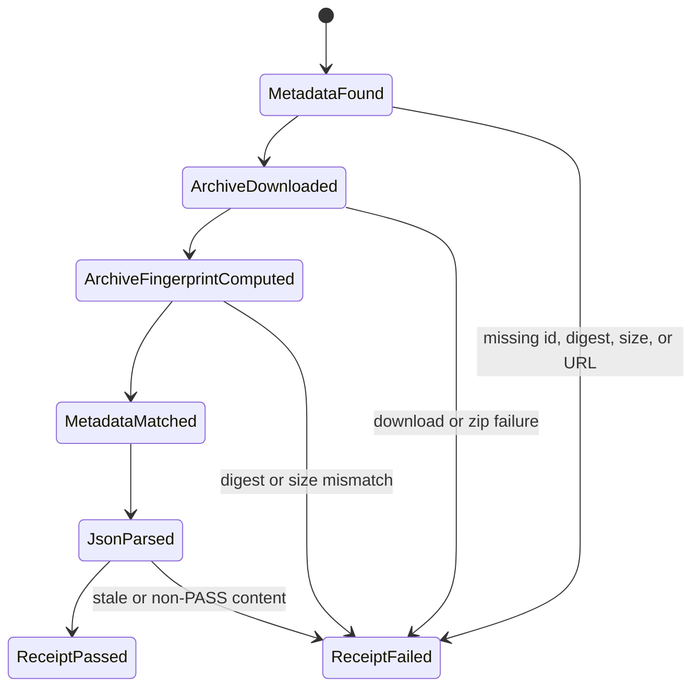
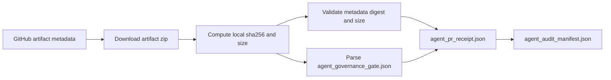

# Feature design: agent governance artifact provenance

- Status: IMPLEMENTED
- Owner: PaulKov
- Issue: #275
- Target release: next patch
Last verified: 2026-07-13

## Executive summary

Agent-control pull requests now fail closed unless `Agent PR receipt` can
download the matching `agent-governance-gate` artifact and validate the
`agent_governance_gate.json` content inside it. The remaining supply-chain gap
is that the receipt does not independently record the exact archive bytes it
downloaded. This feature adds local downloaded-archive fingerprint evidence and
fails closed when the GitHub artifact metadata digest or size disagrees with
the downloaded archive.

This belongs in dpone because agent governance evidence is a public audit
contract for maintainers, reviewers, and future agents. The measurable outcome
is that a receipt can bind one PR head SHA to required checks, GitHub artifact
metadata, downloaded archive bytes, and validated governance JSON without
requiring a human to manually download artifacts.

## Personas and customer journey

| Persona | Goal | Current pain | Success signal |
|---|---|---|---|
| Maintainer | Merge agent-control PRs without trusting an opaque Actions artifact. | The receipt stores GitHub digest metadata but not the hash of bytes actually downloaded by the receipt workflow. | `agent_pr_receipt.json` records both GitHub metadata digest and local downloaded archive SHA-256/size. |
| Auditor | Reconstruct exactly which artifact bytes supported a merge. | An artifact id and semantic JSON summary do not prove which archive bytes were inspected. | The audit manifest and evidence chain include the downloaded archive fingerprint. |
| Future agent | Detect artifact integrity drift instead of laundering a green status. | A workflow could observe metadata for one archive but parse bytes that no longer match that metadata. | Digest or size mismatch is a receipt failure. |

Journey:

1. An agent-control PR changes policy, workflow, or agent documentation.
2. CI uploads `agent-governance-gate` with 90-day retention.
3. The maintainer finalizes owner attestation and references the governance
   receipt in the PR body.
4. `Agent PR receipt` fetches required checks and artifact metadata for the
   reviewed PR head SHA.
5. The receipt downloads the artifact zip, computes `sha256:<hex>` and byte
   length from the downloaded archive, parses `agent_governance_gate.json`, and
   validates both byte-level and semantic evidence.
6. The maintainer and future auditors inspect one receipt artifact instead of
   manually correlating the GitHub UI, workflow logs, and downloaded zip.

## Scope

### In scope

- Compute a local SHA-256 digest for the downloaded governance artifact archive
  bytes before parsing JSON.
- Record the downloaded archive byte length.
- Require the GitHub artifact metadata digest to match the locally computed
  downloaded archive digest.
- Require the GitHub artifact metadata size to match the locally observed
  downloaded archive size.
- Add the new evidence fields to:
  - raw `github_evidence.artifacts[]`;
  - compact `evidence_chain.governance_artifact`;
  - `agent_audit_manifest.json`.
- Update JSON schemas, tests, agent-governance docs, and the implementation
  plan.

### Non-goals

- No ETL runtime, connector, Airflow, dbt, or package behavior change.
- No new GitHub workflow permissions in this PR.
- No GitHub Artifact Attestations enforcement in this PR.
- No attempt to validate arbitrary third-party artifacts.
- No change to branch-protection rules, CODEOWNERS, or merge policy.

### Assumptions and constraints

- GitHub Actions artifact metadata exposes `archive_download_url`,
  `digest`, `size_in_bytes`, and `workflow_run.head_sha`.
- GitHub documents `upload-artifact` digest validation as a SHA-256 digest for
  uploaded artifacts and says `download-artifact` calculates the digest for the
  downloaded artifact and validates it against the upload digest.
- The receipt downloads the artifact archive through the GitHub REST artifact
  download endpoint, which returns a short-lived zip redirect URL.
- The current workflow already has `actions: read`; adding attestation
  verification later may require a separate design because it can introduce
  `id-token`, `attestations`, or GitHub CLI verification policy.

## Public contract

### CLI

`tools/agent_policy/pr_receipt.py` keeps the same CLI arguments and exit codes.
When `--require-github-evidence` is set for an agent-control PR, a missing local
archive fingerprint, digest mismatch, size mismatch, or missing metadata size is
a receipt failure. Text mode prints the existing `ERROR:` lines. JSON mode
writes the expanded schema.

### Python API

`GitHubArtifactEvidence` gains additive fields:

```python
archive_sha256: str | None
archive_size_bytes: int | None
```

Repository-local helper APIs continue to use dataclasses and plain dictionaries.
No runtime dpone package API changes.

### Manifest/schema

`evals/agent/pr-receipt.schema.json` and
`evals/agent/audit-manifest.schema.json` add `archive_sha256` and
`archive_size_bytes` under raw artifact evidence and compact evidence-chain
governance artifact evidence.

### Artifacts and evidence

Raw artifact evidence includes both source metadata and local observation:

```json
{
  "digest": "sha256:<github-artifact-digest>",
  "size_in_bytes": 1719,
  "archive_sha256": "sha256:<downloaded-archive-digest>",
  "archive_size_bytes": 1719
}
```

The evidence chain copies the same fields so reviewers can inspect the compact
manifest first.

### Compatibility and migration

This is an additive schema extension for newly generated receipt artifacts.
Historical artifacts are immutable and are not migrated. Rollback is a normal
revert of the fingerprint calculation, schema additions, and docs updates.

## Detailed algorithm

1. Fetch required checks and existing artifact metadata as before.
2. Filter `agent-governance-gate` artifacts to the reviewed PR head SHA.
3. Download the artifact archive bytes through `archive_download_url`.
4. Compute `archive_sha256 = "sha256:" + sha256(downloaded_bytes).hexdigest()`.
5. Compute `archive_size_bytes = len(downloaded_bytes)`.
6. Parse `agent_governance_gate.json` from the same bytes.
7. During receipt validation, require:
   - artifact id is present;
   - workflow run id is present;
   - GitHub metadata digest is a `sha256:<64 hex>` value;
   - local archive SHA-256 is a `sha256:<64 hex>` value;
   - metadata digest equals local archive SHA-256, case-insensitive;
   - metadata size is a positive integer;
   - local archive size is a positive integer;
   - metadata size equals local archive size;
   - semantic content validation from the artifact-content feature still passes.
8. Write raw and compact receipt evidence with both metadata and local archive
   fields.
9. Copy the compact evidence into `agent_audit_manifest.json`.

### Pseudocode

```text
archive = download(artifact.archive_download_url)
artifact.archive_sha256 = sha256_uri(archive)
artifact.archive_size_bytes = len(archive)
artifact.content = parse_governance_json(archive)

if not sha256_uri(artifact.digest):
    fail("missing metadata digest")
if not sha256_uri(artifact.archive_sha256):
    fail("missing downloaded archive SHA-256")
if lower(artifact.digest) != lower(artifact.archive_sha256):
    fail("metadata digest does not match downloaded archive SHA-256")
if artifact.size_in_bytes <= 0:
    fail("missing metadata size")
if artifact.archive_size_bytes <= 0:
    fail("missing downloaded archive size")
if artifact.size_in_bytes != artifact.archive_size_bytes:
    fail("metadata size does not match downloaded archive size")
validate_governance_content(artifact.content)
```

### State machine



### Edge cases

- Missing `archive_download_url`: content evidence records the existing download
  URL error and local archive digest/size remain null; receipt fails.
- Download HTTP failure: local archive digest/size remain null and receipt
  fails with the GitHub API error.
- Metadata digest is malformed: receipt fails before trusting the artifact.
- Local archive digest is missing or malformed: receipt fails.
- Metadata digest differs only by hex case: receipt passes after
  case-insensitive comparison.
- Metadata size is missing, zero, negative, or non-integer: receipt fails.
- Local archive size is missing or non-positive: receipt fails.
- Metadata size differs from local archive size: receipt fails.
- JSON content is invalid even when digest matches: receipt still fails through
  the semantic content validator.

## Architecture

### Components and responsibilities

| Component | Existing/new | Responsibility | Dependencies |
|---|---|---|---|
| `governance_artifact_archive.py` | New | Convert downloaded archive bytes into byte-level evidence plus existing content evidence. | Python stdlib `hashlib`; sibling content parser. |
| `governance_artifact_content.py` | Existing | Parse and validate `agent_governance_gate.json`. | Python stdlib zip/json. |
| `pr_receipt_github.py` | Existing | Fetch live GitHub evidence and attach archive/content evidence to artifact metadata. | GitHub API helper, archive helper. |
| `pr_receipt_github_metadata.py` | Existing | Validate artifact identity, metadata digest, local archive digest, and size agreement. | Regex helpers only. |
| `pr_evidence_chain.py` | Existing | Copy compact archive/content fields into receipt evidence chain. | Raw evidence dataclasses. |
| `audit_manifest.py` | Existing | Copy compact receipt evidence into audit manifest. | Receipt payload. |

### Ports, adapters, and composition root

GitHub REST remains the only external adapter. The new archive helper is pure
except for receiving bytes from the existing GitHub adapter. `pr_receipt.py`
remains the policy composition root and does not learn about hashing details.

### Data and control flow



### Alternatives and tradeoffs

| Alternative | Advantages | Disadvantages | Decision |
|---|---|---|---|
| Keep metadata digest only | No code change. | Does not prove which downloaded bytes were parsed by the receipt workflow. | Rejected. |
| Record local digest but do not compare | Useful for forensics. | Still allows a false green receipt on metadata/download mismatch. | Rejected for enforced PR receipts. |
| Compare local digest and size to GitHub metadata | Small change, uses official artifact metadata, closes byte mismatch. | Trusts GitHub artifact digest semantics and does not prove signer identity. | Adopted. |
| Enforce GitHub Artifact Attestations now | Stronger provenance and signer binding. | Requires a separate permissions and verification-policy design; REST listing alone is not sufficient because signatures, timestamps, and signer identity must be verified. | Deferred. |

### ADR requirement

No ADR is required. This hardens an existing repository-governance receipt
contract and does not change dpone runtime architecture.

### Quality-budget impact

`pr_receipt_github.py` is already close to the 400 SLOC hard budget, so the
fingerprint calculation belongs in a new focused helper. Expected new module is
under 80 SLOC. Existing modified modules must remain under
`docs/benchmarks/quality_budgets.yml` limits.

## Market comparison

Use current official primary sources. Mark irrelevant systems `N/A` with reason.

| System/version | Relevant capability | Observed design | Strength | Limitation | Adopt/reject | Source/date |
|---|---|---|---|---|---|---|
| GitHub Actions REST API 2026-03-10 docs | Artifact metadata and archive download | Artifact responses include `archive_download_url`, `digest`, `size_in_bytes`, and `workflow_run.head_sha`; download returns a short-lived zip redirect. | Official metadata source for the receipt workflow. | Metadata alone does not validate domain-specific JSON. | Adopt metadata fields and REST download. | https://docs.github.com/en/rest/actions/artifacts checked 2026-07-13 |
| GitHub Actions artifact tutorial 2026 docs | Artifact digest validation | `upload-artifact` returns a SHA-256 digest; `download-artifact` calculates the downloaded artifact digest and validates it against upload. | Confirms digest comparison is the expected artifact-integrity pattern. | The tutorial describes GitHub actions, not this repository-local Python client. | Adopt local digest comparison in the Python receipt client. | https://docs.github.com/en/actions/tutorials/store-and-share-data checked 2026-07-13 |
| GitHub Artifact Attestations 2026 docs | Signed provenance | Attestations provide signed claims about workflow, repository, commit SHA, event, and OIDC context; GitHub notes verification policy still matters. | Stronger provenance and signer binding. | Requires extra workflow permissions and explicit verification policy. | Defer to a separate attestation PR. | https://docs.github.com/en/actions/concepts/security/artifact-attestations checked 2026-07-13 |
| GitHub REST attestations 2026 docs | Attestation lookup by subject digest | REST can list attestations, but meaningful security requires cryptographic signature/timestamp verification and signer identity validation. | Useful discovery API. | Listing alone is not a hard security gate. | Reject REST-list-only attestation as a PASS condition. | https://docs.github.com/en/rest/users/attestations checked 2026-07-13 |
| SLSA v1.0 verification guidance | Provenance verification | SLSA verification checks builder identity, provenance signature, and expected build parameters. | Good north-star for future attestation policy. | Full SLSA policy is larger than this PR. | Adopt the principle that provenance must be inspected, not merely present. | https://slsa.dev/spec/v1.0/verifying-artifacts checked 2026-07-13 |
| dlt | N/A | Data loading framework, not PR governance evidence. | N/A | No comparable GitHub artifact receipt layer. | N/A. | N/A checked 2026-07-13 |
| Informatica | N/A | Managed data integration/governance platform, not repository PR artifact receipt. | N/A | No relevant open PR artifact contract. | N/A. | N/A checked 2026-07-13 |
| Airbyte | N/A | Connector platform, not PR governance evidence chain. | N/A | No comparable GitHub artifact receipt layer. | N/A. | N/A checked 2026-07-13 |
| Fivetran | N/A | Managed ELT service, not repository CI receipt tooling. | N/A | No comparable PR artifact validation layer. | N/A. | N/A checked 2026-07-13 |
| Pentaho | N/A | ETL/orchestration suite, not agent-control PR receipt. | N/A | No comparable GitHub artifact digest gate. | N/A. | N/A checked 2026-07-13 |
| Microsoft SSIS | N/A | ETL package runtime, not repository governance receipt. | N/A | No comparable PR artifact digest gate. | N/A. | N/A checked 2026-07-13 |
| gusty | N/A | Airflow DAG construction, not PR governance artifact validation. | N/A | No comparable receipt layer. | N/A. | N/A checked 2026-07-13 |
| Astronomer Cosmos | N/A | dbt/Airflow integration, not agent-control PR receipt. | N/A | No comparable PR evidence content contract. | N/A. | N/A checked 2026-07-13 |
| Apache Beam | N/A | Data processing model, not repository governance receipt. | N/A | No comparable GitHub artifact digest gate. | N/A. | N/A checked 2026-07-13 |

## Measurable differentiation

```yaml
axis: downloaded governance artifact byte integrity
scenario: an agent-control PR has an agent-governance-gate artifact whose
  GitHub metadata digest or size does not match the archive bytes downloaded by
  Agent PR receipt
baseline: dpone after artifact content validation but before local archive
  fingerprint comparison
metric: receipt status and machine-readable error
target: FAIL with a digest or size mismatch error; PASS only when metadata,
  downloaded archive bytes, and governance JSON all match
procedure: focused pytest cases for digest mismatch, size mismatch, and valid
  archive fingerprint evidence; live Agent PR receipt on the implementation PR
artifact: agent_pr_receipt.json and agent_audit_manifest.json
limitations: does not verify signer identity or SLSA builder expectations; that
  remains a future Artifact Attestations design
```

## Security, privacy, and operations

No credentials are printed or persisted. The existing GitHub token remains
scoped to read Actions, checks, contents, pull requests, and statuses. Digest
and size mismatches are fail-closed for enforced agent-control PR receipt
validation. Artifact Attestation enforcement remains deferred because a proper
implementation must verify signatures, timestamps, signer identity, and expected
workflow identity instead of treating attestation presence as a pass.

## Test and certification plan

| Layer | Scenario | Environment | Expected artifact |
|---|---|---|---|
| Unit | Downloaded archive bytes produce `archive_sha256`, `archive_size_bytes`, and content evidence. | Local pytest. | `tests/agent_policy/test_governance_artifact_archive.py` |
| Contract | Receipt fails when GitHub metadata digest differs from local archive SHA-256. | Local pytest. | `tests/agent_policy/test_pr_receipt_evidence_chain.py` |
| Contract | Receipt fails when GitHub metadata size differs from local archive size. | Local pytest. | `tests/agent_policy/test_pr_receipt_evidence_chain.py` |
| Contract | Evidence chain and audit manifest expose archive fingerprint fields. | Local pytest/schema validation. | JSON schema validation |
| CI | Agent PR receipt passes on implementation PR with matching archive digest and content. | GitHub Actions. | `agent-pr-receipt` artifact |
| Live certification | Not required; this is repository CI metadata. | N/A. | N/A |

## Documentation plan

Update `docs/agent-governance.md` and `docs/github-branch-protection.md` to say
the receipt validates both downloaded archive bytes and governance JSON content.
Update the artifact-content feature spec limitation to point to this follow-up.
Update generated quality metrics if module counts or SLOC change.

## Rollout and rollback

Roll out through the normal PR receipt workflow. If GitHub REST artifact digest
semantics change and cause false failures, rollback is a normal revert of the
archive helper, validation comparison, schema additions, and docs updates.

## Agent execution plan

| Agent/role | Owned paths | Read-only paths | Forbidden paths | Dependency |
|---|---|---|---|---|
| Integrator | `tools/agent_policy/governance_artifact_archive.py`, `tools/agent_policy/pr_receipt_github.py`, `tools/agent_policy/pr_receipt_github_metadata.py`, `tools/agent_policy/pr_evidence_chain.py`, `tools/agent_policy/audit_manifest.py`, `tests/agent_policy/**`, `evals/agent/**`, selected docs, `docs/quality-metrics.md` | `.github/workflows/**`, `.agents/policy/**` | runtime ETL packages, connector code | None |

PaulKov/Codex is the integrator and shared-file owner for this work.

## Approval checklist

- [x] User problem and CJM are clear.
- [x] Algorithm and failure semantics are implementable without guessing.
- [x] Public contracts and compatibility are explicit.
- [x] Architecture and alternatives are justified.
- [x] Relevant market research uses current official sources.
- [x] Claimed differentiation is measurable.
- [x] Tests, evidence, docs, rollout, and rollback are complete.
- [x] Path ownership and integration plan are conflict-safe.
- [x] Maintainer changed status to `APPROVED`.
