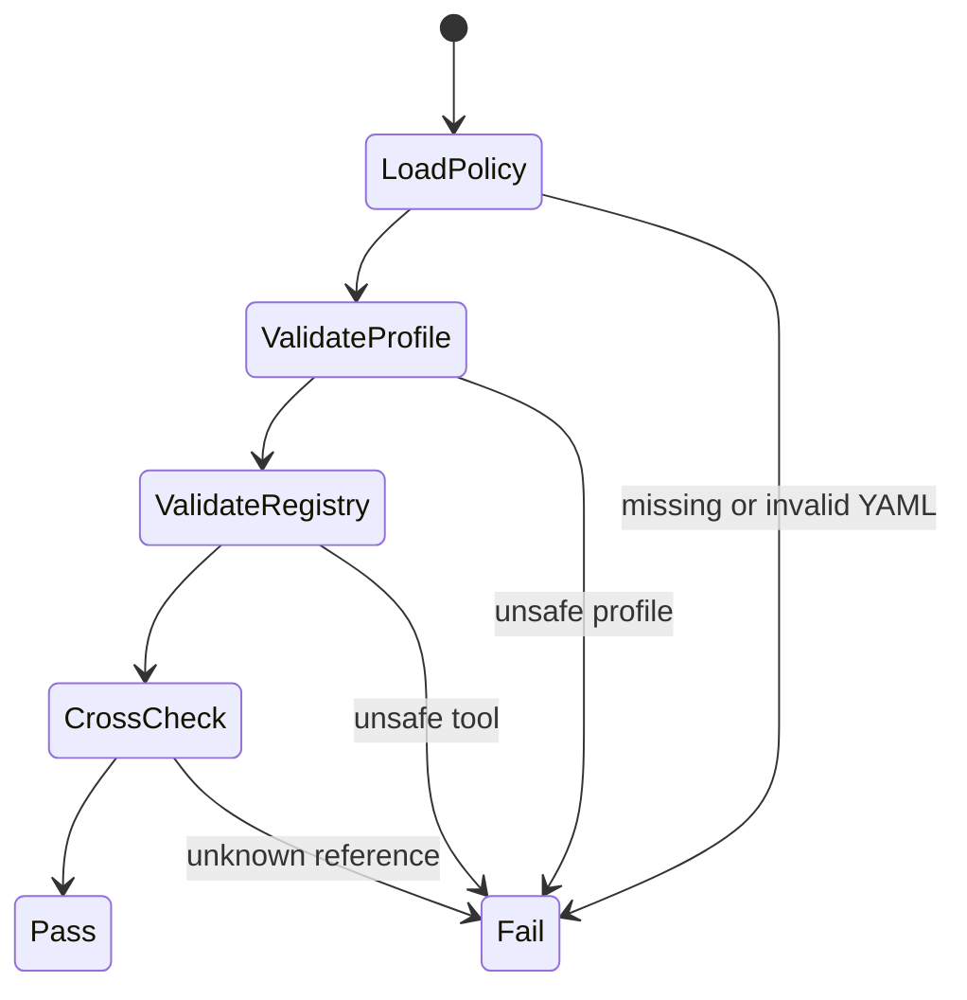
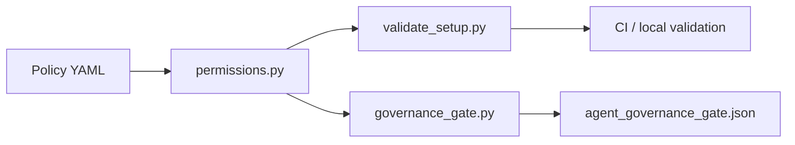

# Feature design: Agent permission profile and tool registry

- Status: APPROVED
- Owner: dpone maintainers
- Issue: N/A
- Target release: TBD
Last verified: 2026-07-11

Approval note: the maintainer approved implementation in the Codex thread on
2026-07-11 after choosing the "Agent permission and Tool/MCP registry" option.

## Executive summary

dpone already has agent governance docs, a red-team catalog, and an executable
governance receipt. The missing control is a machine-readable policy that says
which agent roles may use which tool classes, which actions require escalation,
and what evidence reviewers should expect. This feature adds that policy as two
validated YAML contracts: an agent permission profile and a tool/MCP registry.

## Personas and customer journey

| Persona | Goal | Current pain | Success signal |
|---|---|---|---|
| Maintainer | Review AI-agent changes quickly. | Permission rules are prose spread across docs. | Gate shows PASS/FAIL for permission and tool policy. |
| Integrator | Use write tools safely in an isolated branch. | It is unclear which actions require explicit approval. | Protected actions and evidence are listed in one profile. |
| Security reviewer | Audit MCP/connectors and GitHub operations. | External tools have no repository-local owner or scope record. | Registry entry lists provenance, scopes, risk tier, and approval conditions. |

Journey:

1. A contributor changes agent instructions, a skill, a workflow, or an MCP/tool
   entry.
2. `select_checks.py` routes the diff to `agent_policy`.
3. `validate_setup.py` validates inventory, YAML shape, schemas, red-team
   catalog, permission profile, and tool registry.
4. `governance_gate.py` emits `agent_governance_gate.json`.
5. Reviewers inspect the changed policy files and the receipt before merging.

## Scope

### In scope

- Add `.agents/policy/agent-permission-profile.yml`.
- Add `.agents/policy/tool-registry.yml`.
- Add JSON schemas for both contracts.
- Add an executable validator under `tools/agent_policy/permissions.py`.
- Add governance-gate checks and setup validation.
- Document the self-service workflow for adding tools and MCP/connectors.

### Non-goals

- Runtime sandbox enforcement inside Codex or GitHub.
- Full OpenTelemetry trace emission for every agent action.
- AI BOM generation.
- Live connector certification.

### Assumptions and constraints

- Repository policy validation is a merge-time control, not a kernel sandbox.
- Secret access and live production checks stay prohibited unless explicitly
  approved in a separate environment.
- MCP/connectors are treated as critical risk when write-capable or externally
  scoped.

## Public contract

### CLI

No new user-facing CLI command is added. Existing commands gain stricter checks:

```bash
uv run python tools/agent_policy/validate_setup.py .
uv run python tools/agent_policy/governance_gate.py \
  --base-ref origin/master \
  --output test_artifacts/agent-policy/agent_governance_gate.json
uv run dpone docs check-module-size \
  --package tools/agent_policy \
  --no-baseline \
  --warn-lines 350 \
  --max-lines 400 \
  --warn-sloc 300 \
  --max-sloc 350
uv run dpone docs check-module-size \
  --package tests/agent_policy \
  --no-baseline \
  --warn-lines 350 \
  --max-lines 400 \
  --warn-sloc 300 \
  --max-sloc 350
```

Exit code remains `0` for PASS and non-zero for FAIL.

### Python API

`tools/agent_policy/permissions.py` exposes repository-local validation helpers:

- `load_permission_profile(path)`;
- `load_tool_registry(path)`;
- `validate_permission_profile(root, ...)`;
- `validate_tool_registry(root, ...)`;
- `validate_all(root, ...)`.

These helpers are internal policy tooling, not a stable package import under
`src/dpone`.

### Manifest/schema

No dpone ETL manifest changes.

### Artifacts and evidence

The governance receipt includes two new check names:

- `agent_permission_profile`;
- `agent_tool_registry`.

The receipt continues to use `PASS`, `FAIL`, and `N/A`.

### Compatibility and migration

Existing users and ETL routes are unaffected. Agent-control-plane PRs must add
and preserve the new policy files. Rollback is deleting the new checks and files
in one PR, but that would intentionally reopen the excessive-agency and MCP
supply-chain risks.

## Detailed algorithm

1. Load the permission profile YAML.
2. Validate `schema_version`, owner, review date, and required profile ids.
3. Validate each profile has role owner, sandbox modes, allowed tools,
   forbidden tools, protected actions, evidence, and escalation.
4. Load the tool registry YAML.
5. Validate required tool ids, owner, provenance, category, risk tier, allowed
   profiles, allowed actions, forbidden actions, approval conditions, scopes,
   and evidence.
6. Cross-check that profile `allowed_tools` reference registered tools and tool
   `allowed_profiles` reference known profiles.
7. Fail closed on missing files, invalid YAML, unknown references, allowed versus
   forbidden overlap, write-capable tools in read-only profiles, or high-risk
   tools without approval conditions.
8. Include the result in `validate_setup.py` and `governance_gate.py`.

### Pseudocode

```text
profile = load_yaml(permission_profile)
registry = load_yaml(tool_registry)

assert profile.schema_version == 1
assert registry.schema_version == 1
assert required_profile_ids subset profile.ids
assert required_tool_ids subset registry.ids

for profile_entry in profile.profiles:
    require owner, sandbox_modes, allowed_tools, forbidden_tools
    require protected_actions include push, PR, admin merge, secrets, live prod
    assert allowed_tools intersect forbidden_tools is empty
    assert allowed_tools subset registry.ids
    if read_only:
        assert sandbox_modes == ["read-only"]
        assert no write-capable tool is allowed

for tool in registry.tools:
    require owner, provenance, risk_tier, allowed_profiles, approval, evidence
    assert allowed_profiles subset profile.ids
    assert allowed_actions intersect forbidden_actions is empty
    if risk_tier in high or critical:
        assert approval_required_for is not empty
    if category in github, network, mcp:
        assert allowed_scopes is not empty
```

### State machine



### Edge cases

| Case | Behavior |
|---|---|
| Missing profile or registry | FAIL with missing-file details. |
| Unknown profile referenced by a tool | FAIL. |
| Unknown tool referenced by a profile | FAIL. |
| Read-only profile grants write-capable tool | FAIL. |
| Tool has high or critical risk and no approval condition | FAIL. |
| Live integration unavailable | No live check is executed; status remains SKIP or UNVERIFIED in completion evidence. |

## Architecture

### Components and responsibilities

| Component | Existing/new | Responsibility | Dependencies |
|---|---|---|---|
| `.agents/policy/agent-permission-profile.yml` | New | Role-level permission contract. | YAML only. |
| `.agents/policy/tool-registry.yml` | New | Tool/MCP allowlist and risk metadata. | YAML only. |
| `tools/agent_policy/permissions.py` | New | Parse and validate both policy files. | `PyYAML`, stdlib. |
| `tools/agent_policy/validate_setup.py` | Existing | Include policy files in setup validation. | Imports sibling validator. |
| `tools/agent_policy/governance_gate.py` | Existing | Emit policy check results into receipt. | Imports sibling validator. |

### Data and control flow



### Alternatives and tradeoffs

| Alternative | Advantages | Disadvantages | Decision |
|---|---|---|---|
| Prose-only docs | Simple to write. | Not enforceable; easy to drift. | Rejected. |
| JSON only | Strict shape. | Poor reviewer ergonomics for policy authors. | Rejected. YAML plus JSON schema is clearer. |
| Full runtime sandbox | Stronger enforcement. | Outside repository control and too broad for this PR. | Deferred. |
| Manual validator | Clear errors and no new dependency. | Duplicates some schema rules. | Adopted for merge-time gate. |

### ADR requirement

No ADR is required. This extends existing agent-governance policy tooling and
does not introduce a new runtime architecture or public dpone ETL API.

### Quality-budget impact

The new validator is a focused policy module under `tools/agent_policy/` and is
kept below module-size limits. It does not add imports to production `src/dpone`
packages.

## Market comparison

The relevant comparison layer is agent security governance rather than ETL route
execution. ETL products below are marked N/A where they do not expose an
equivalent repository-local AI-agent permission contract.

| System/version | Relevant capability | Observed design | Strength | Limitation | Adopt/reject | Source/date |
|---|---|---|---|---|---|---|
| dlt | N/A | Data loading library, not an AI-agent control plane. | Strong developer ergonomics for pipelines. | No comparable agent tool registry in this scope. | N/A | Official docs, 2026-07-11 |
| Informatica | N/A | Enterprise data management platform. | Mature governance concepts. | Hosted controls are not repository-local agent policy files. | N/A | Official docs, 2026-07-11 |
| Airbyte | N/A | Connector and sync platform. | Connector catalog and permissions in deployment context. | Not a Codex/MCP-style repository agent policy. | N/A | Official docs, 2026-07-11 |
| Fivetran | N/A | Managed ELT with SaaS governance. | Operational ownership is clear. | No local agent permission profile contract. | N/A | Official docs, 2026-07-11 |
| Pentaho | N/A | Data integration tooling. | Established transformation workflows. | Not an AI-agent governance layer. | N/A | Official docs, 2026-07-11 |
| Microsoft SSIS | N/A | ETL package execution and deployment. | Mature operational controls. | No equivalent repository AI-agent tool allowlist. | N/A | Official docs, 2026-07-11 |
| gusty | N/A | DAG generation workflow. | Declarative orchestration. | No equivalent agent permission registry. | N/A | Official docs, 2026-07-11 |
| Astronomer Cosmos | N/A | dbt-to-Airflow orchestration. | Clear integration boundary. | Not an AI-agent control plane. | N/A | Official docs, 2026-07-11 |
| Apache Beam | N/A | Portable data processing model. | Strong runner abstraction. | No repository AI-agent permission contract. | N/A | Official docs, 2026-07-11 |

Security baselines adopted for this feature:

- OWASP Top 10 for Agentic Applications 2026: tool misuse, excessive agency,
  identity/privilege abuse, and agentic supply-chain risk.
- MCP Security Best Practices: explicit auth, scopes, validation, and isolation
  for MCP servers and connectors.
- CISA AI SBOM Minimum Elements: treat AI system components as supply-chain
  inventory beyond normal package SBOMs.

## Measurable differentiation

```yaml
axis: enforceable repository-local agent permission governance
scenario: an agent-control PR adds a new MCP connector or grants write capability to a reviewer role
baseline: previous dpone governance gate before this feature
metric: binary FAIL when the policy is missing, inconsistent, or over-broad
target: 100% of malformed profile and registry fixtures fail focused policy tests
procedure: run tests/agent_policy and tests/test_module_size_gate.py
artifact: test output and test_artifacts/agent-policy/agent_governance_gate.json
limitations: does not prove runtime sandbox enforcement outside the repository gate
```

## Security, privacy, and operations

- Secret access is forbidden in every profile.
- Live production access is protected and requires explicit approval outside this
  gate.
- MCP/connectors are critical risk by default when externally scoped.
- High and critical risk tools require approval conditions.
- Evidence must name commands, sources, scopes, PRs, or artifact paths.

## Test and certification plan

| Layer | Scenario | Environment | Expected artifact |
|---|---|---|---|
| Unit | Valid profile and registry pass. | Local pytest. | `tests/agent_policy/test_agent_policy.py` output. |
| Unit | Allowed/forbidden overlap fails. | Local pytest. | Failing fixture assertion. |
| Contract | Governance gate includes permission and registry checks. | Local pytest. | `tests/agent_policy/test_governance_gate.py` output. |
| Architecture | Agent-policy tooling and tests stay inside module-size budget. | Local pytest and CI. | `tests/test_module_size_gate.py` output. |
| Docs | Self-service page builds in MkDocs. | Local docs checks. | MkDocs strict build output. |
| Live certification | N/A. | N/A. | Live checks are not required. |

## Documentation plan

- Add `docs/agent-permissions.md`.
- Link the page from `docs/agent-governance.md`,
  `docs/agent-security-mapping.md`, and MkDocs navigation.
- Update `docs/agent-risk-register.md` with explicit permission and MCP/tool
  supply-chain risks.
- Update `CHANGELOG.md`.

## Rollout and rollback

Rollout is immediate for agent-control-plane PRs because the files are required
by `validate_setup.py` and `governance_gate.py`.

Rollback is a single PR that removes the checks and policy files. That rollback
must document the reopened risks: excessive agency, unregistered MCP/connectors,
and privileged remote actions without machine-readable approval boundaries.

## Agent execution plan

| Agent/role | Owned paths | Read-only paths | Forbidden paths | Dependency |
|---|---|---|---|---|
| Integrator | `.agents/policy/**`, `tools/agent_policy/**`, `tests/test_agent_*`, `evals/agent/**`, `docs/agent-*.md`, `docs/feature-design-agent-permission-tool-registry.md`, `mkdocs.yml`, `CHANGELOG.md` | Existing agent docs and workflows | #291 Airflow branch files outside this worktree | User approval in thread |

The main Codex session is the integrator and shared-file owner.

## Approval checklist

- [x] User problem and CJM are clear.
- [x] Algorithm and failure semantics are implementable without guessing.
- [x] Public contracts and compatibility are explicit.
- [x] Architecture and alternatives are justified.
- [x] Relevant market research uses current official sources or is marked N/A.
- [x] Claimed differentiation is measurable.
- [x] Tests, evidence, docs, rollout, and rollback are complete.
- [x] Path ownership and integration plan are conflict-safe.
- [x] Maintainer changed status to `APPROVED`.
