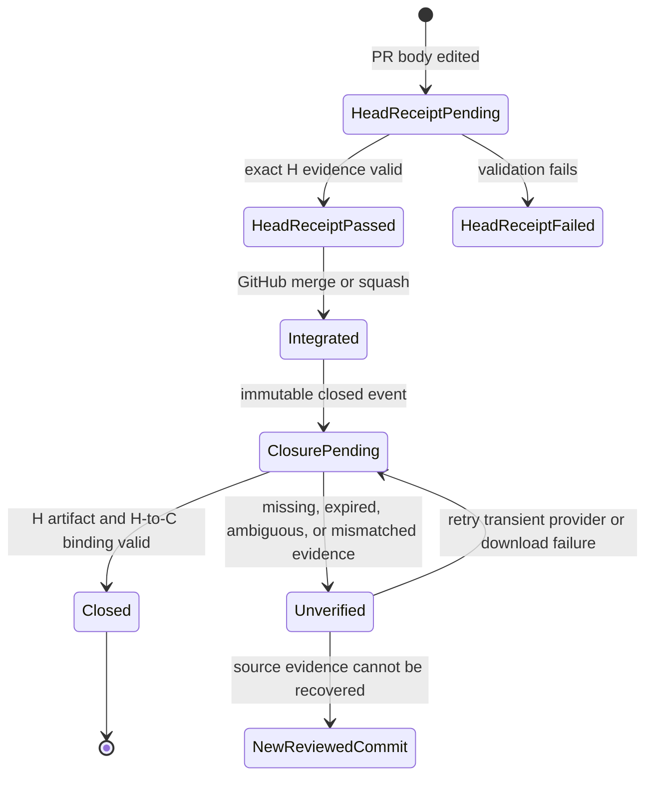

# Feature design: immutable Agent PR merge-closure receipt

- Status: IMPLEMENTED
- Owner: PaulKov
- Issue: release follow-up for PR #454
- Target release: 0.73.27
- Last verified: 2026-07-29

## Executive summary

The protected branch requires `Agent PR receipt`, but the existing check and
artifact are bound to the reviewed pull-request head commit `H`. After GitHub
integrates the pull request, the release commit `C` does not have that check, so
the exact-commit release gate cannot close.

The capability automatically derives a separate merge-closure receipt
from the immutable successful pre-merge receipt. It never treats the current,
mutable pull-request body as reviewed evidence. The derived receipt keeps
`reviewed_head_sha` and `integration_commit_sha` distinct, verifies the exact
Git relationship and changed paths, binds one pre-merge check run and artifact
by IDs and digests, and attaches the existing required check name to `C`.
GitHub keeps the native `pull_request: closed` workflow run and job check bound
to `H`; after receipt validation, a job-scoped `checks: write` projection
creates the required GitHub Actions check-run explicitly on `C`.

The measurable outcome is binary: post-merge body edits, rename-out path
changes, stale artifacts, mismatched commits, incomplete provenance, or a
different projected artifact must produce `FAIL`/`UNVERIFIED`, never `PASS`.

## Implementation evidence

The immutable derivation landed through
[PR #463](https://github.com/PaulKov/dpone/pull/463), and
[PR #465](https://github.com/PaulKov/dpone/pull/465) completes the exact-commit
check projection after a live canary exposed GitHub's closed-event attachment
semantics:

- reviewed head `H`:
  `4c9df5e2a67afeab0dd9720210157eed069abca7`;
- integration commit `C`:
  `fda76717b39cf406350d006d481e63807f754fff`;
- reviewed-head receipt:
  [workflow run 30471320249](https://github.com/PaulKov/dpone/actions/runs/30471320249),
  attempt 2, artifact `8731831344`, status `PASS`;
- automatic merge closure:
  [workflow run 30471614417](https://github.com/PaulKov/dpone/actions/runs/30471614417),
  artifact `8731873195`, status `PASS`;
- provider observation: the closed-event run/check remained attached to `H`
  even though the retained receipt correctly named `C`; PR #465 therefore
  publishes and validates a separate same-name check-run on `C`;
- integration method: `merge`; the integration and reviewed-head trees both
  equal `d3b52d14eb77eaceed35ee3cced019930395c97f`;
- closure binding:
  `sha256:4f3d9f9fb4d7d1e820e313e7bbcd5b1ecf15751bd8e816cd10e43e32e271c65a`;
- preserved source archive digest and provider digest:
  `sha256:b2c05ef9e18ce2cca9dfcbfc2c8bab994f30abb5a14bdd249cc1ce94dd9ed80e`.

The exact-head non-live suite passed with 9011 tests and 558 explicit skips.

The first live exact-commit projection from PR #465 produced merge commit
`90be8bcdfc0528f3934b1a1e967df5aa694d1010`, closure run `30477963665`,
durable receipt artifact `8734391211`, and check-run `90664407881`. GitHub
Actions preserved the requested `external_id` but normalized `details_url`
from the submitted Actions run URL to
`https://github.com/PaulKov/dpone/runs/90664407881`. The initial
implementation correctly kept the check failed when its literal response
contract did not match. The corrective contract accepts only the two exact
identity-derived URL forms and still derives producer run/attempt solely from
`external_id`; a new reviewed merge commit and live closure remain mandatory
before release.
Ruff, formatting, mypy, import/layer/module budgets, strict documentation,
CodeQL, dependency review, secret scanning, runtime-image smoke, PostgreSQL
XMin, and the supported Airflow/Python matrix also passed. Live connector
profiles were outside this governance-only change and remain `N/A`.

## Personas and customer journey

| Persona | Goal | Current pain | Success signal |
|---|---|---|---|
| Solo maintainer | Merge a reviewed agent-control change and release the integrated commit. | The reviewed-head receipt passes, but the exact integration commit has no receipt check. | A merge-closure run starts automatically and passes on the exact integration commit. |
| Release auditor | Reconstruct why `C` was accepted without trusting mutable metadata. | The current PR body can change after merge and does not prove what was reviewed. | One receipt records `H`, `C`, source check/run/artifact IDs, provider and local digests, inner-file digests, and Git relationship evidence. |
| Security reviewer | Detect false evidence and provenance laundering. | Existing validation does not compare governance `head_commit`, can project a different artifact than it validated, and accepts incomplete normalized attestation evidence. | Adversarial cases fail with stable diagnostics and a failure artifact. |
| Operator | Diagnose a blocked release safely. | A missing exact-commit check tempts retrospective manual reconstruction. | The runbook distinguishes safe replay of immutable evidence from forbidden reconstruction and tells the operator when a new reviewed commit is required. |

Journey:

1. The maintainer edits the PR body only before merge and waits for the normal
   reviewed-head `Agent PR receipt` to pass.
2. GitHub integrates the PR through an allowed merge method.
3. The `pull_request: closed` event automatically starts merge closure only when
   `merged == true`.
4. The workflow verifies the immutable event, Git object relationship, exact
   first-parent delta, pre-merge check run, and pre-merge artifact.
5. `agent_pr_merge_receipt.json` explains `PASS` or every blocker and is retained
   for 90 days in the existing `agent-pr-receipt` artifact before success can
   be projected.
6. The merged-only job projects `PASS` or `FAIL` through the Checks API onto
   exact commit `C`, validates the returned check/run/App identities, and keeps
   only that job's token at `checks: write`. Its diagnostic is retained in the
   separate `agent-pr-merge-check` artifact.
7. Release preflight accepts the exact commit only after it re-fetches the
   latest check on `C`, binds its check/App/run/attempt identity, downloads the
   durable receipt artifact, and revalidates its bytes and digests.
8. A retry reuses the original closed-event payload and immutable source
   artifact. It never queries the current PR body.
9. Missing, expired, ambiguous, or unverifiable source evidence remains a
   release blocker. The recovery is a new reviewed corrective PR and a newer
   release commit, not manufactured historical `PASS`.

## Scope

### In scope

- Automatic merge-closure execution for protected-branch `pull_request`
  `closed` events.
- Same-name GitHub Actions check projection onto the immutable integration SHA
  from the closed event, with a failure projection for invalid receipts.
- Two-parent merge and one-parent squash integration allowed by current policy.
- Immutable source `agent-pr-receipt` check/artifact selection and verification.
- A new closed merge-receipt JSON schema with distinct reviewed-head and
  integration-commit identities.
- Rename/delete-safe changed-path enumeration for CI, reviewed-head receipt, and
  merge closure.
- Exact governance artifact `head_commit` validation.
- One authoritative governance artifact selection shared by validation and
  evidence-chain projection.
- Fail-closed normalized GitHub attestation field validation.
- Documentation, failure/replay runbook, compatibility guidance, and release
  evidence reconciliation.

### Non-goals

- Re-reading or validating the current PR body after merge.
- A manual semantic `PASS` backfill from live PR metadata.
- Changing the existing closed `agent_pr_receipt.json` v2 or
  `agent_audit_manifest.json` v1 schemas.
- Re-certifying historical commits that lack immutable source evidence.
- Activating the external privileged release controller, append-only store, or
  Trusted Publisher design from ADR 0028.
- Changing connector, runtime, Airflow, dbt, state, checkpoint, or data-mutation
  behavior.

### Assumptions and constraints

- The protected branch keeps strict required checks and allows only merge and
  squash integration.
- The successful pre-merge receipt artifact is retained for 90 days but can be
  deleted or expire. The merge-receipt producer writes `FAIL`; the release
  review classifies the unavailable proof as `UNVERIFIED`.
- GitHub workflow artifacts are immutable after upload for this workflow
  generation, but provider metadata and downloaded bytes are both verified.
- `pull_request` closed-event payload is the only PR metadata authority for
  automatic closure. Current REST PR fields are diagnostic only.
- The exact integration commit is checked out from the closed event; a mutable
  branch name is never caller-selected authority.

## Public contract

### CLI

No end-user dpone CLI command changes.

`tools/agent_policy/pr_merge_receipt.py` is a repository governance CLI. It:

- accepts the immutable event path, repository root, fixed policy path,
  GitHub repository, workflow run metadata, token environment-variable name,
  and output directory;
- does not accept PR body text, reviewed-head SHA, integration SHA, changed
  paths, source run ID, or source artifact ID as caller-selected authority;
- exits `0` only for a closure `PASS` (including a correctly scoped source
  `N/A`) and exits `1` for receipt `FAIL`; release review classifies unavailable
  proof as `UNVERIFIED`;
- writes a failure receipt atomically before returning a non-zero status;
- writes diagnostics to stderr and never prints a credential.

`tools/agent_policy/pr_merge_check.py` is the narrow write-side composition
root. It:

- accepts only the immutable closed-event file plus the produced receipt and
  workflow producer IDs;
- takes `integration_commit_sha` exclusively from the event and never accepts a
  caller-selected target SHA;
- projects receipt `PASS` to check conclusion `success`, while missing,
  invalid, failed, mismatched, or non-zero producer results can project only
  `failure`;
- recomputes the canonical receipt `binding_id` and requires the receipt
  producer run/attempt to equal the current workflow identity;
- creates the check in fail-closed `failure` state and updates that exact
  validated check-run ID to `success` only after provider identity validation;
- validates the returned check-run ID, exact SHA, conclusion, name, positive
  GitHub App ID, exact producer `external_id`, and either the submitted Actions
  run URL or GitHub Actions' exact provider-normalized check-run URL; and
- reads the token only from the named environment variable and emits a
  credential-free report.

### Python API

The implementation stays under `tools/agent_policy`; it is not a supported
`dpone.*` Python import. Pure functions for event validation, Git relationship
verification, artifact selection, archive validation, and receipt rendering are
dependency-injected for tests.

### Manifest/schema

Add `evals/agent/pr-merge-receipt.schema.json` with a closed schema:

```json
{
  "schema_version": 1,
  "status": "PASS",
  "binding_id": "sha256:0000000000000000000000000000000000000000000000000000000000000000",
  "repository": "PaulKov/dpone",
  "protected_base_ref": "master",
  "pr_number": 455,
  "merged_at": "2026-07-29T00:00:00Z",
  "integration_method": "merge",
  "reviewed_head_sha": "aaaaaaaaaaaaaaaaaaaaaaaaaaaaaaaaaaaaaaaa",
  "reviewed_head_tree": "bbbbbbbbbbbbbbbbbbbbbbbbbbbbbbbbbbbbbbbb",
  "base_parent_sha": "cccccccccccccccccccccccccccccccccccccccc",
  "integration_commit_sha": "dddddddddddddddddddddddddddddddddddddddd",
  "integration_tree": "bbbbbbbbbbbbbbbbbbbbbbbbbbbbbbbbbbbbbbbb",
  "changed_paths": [],
  "pr_body_sha256": "sha256:1111111111111111111111111111111111111111111111111111111111111111",
  "source_receipt": {
    "check_run_id": 1,
    "workflow_run_id": 2,
    "workflow_run_attempt": 1,
    "artifact_id": 3,
    "artifact_digest": "sha256:2222222222222222222222222222222222222222222222222222222222222222",
    "artifact_size_bytes": 1,
    "archive_sha256": "sha256:3333333333333333333333333333333333333333333333333333333333333333",
    "archive_size_bytes": 1,
    "created_at": "2026-07-29T00:00:00Z",
    "completed_at": "2026-07-29T00:00:00Z",
    "receipt_sha256": "sha256:4444444444444444444444444444444444444444444444444444444444444444",
    "audit_manifest_sha256": "sha256:5555555555555555555555555555555555555555555555555555555555555555",
    "body_sha256": "sha256:1111111111111111111111111111111111111111111111111111111111111111",
    "status": "PASS"
  },
  "producer": {
    "workflow": "Agent PR receipt",
    "run_id": "1",
    "run_attempt": "1"
  },
  "errors": [],
  "warnings": []
}
```

All SHA fields are full lowercase 40-hex Git object IDs. All digest fields use
`sha256:` plus 64 lowercase hexadecimal characters. `additionalProperties` is
false. `PASS` requires every identity and provenance field. Failure receipts
retain nullable observations and non-empty errors without claiming closure.

### Artifacts and evidence

- Existing reviewed-head artifact: `agent-pr-receipt`; unchanged contents and
  schemas.
- New merge-closure file: `agent_pr_merge_receipt.json`.
- Check projection report: `agent_pr_merge_check.json`, retained in the
  separate `agent-pr-merge-check` artifact and recording only safe check-run/App
  IDs, exact integration SHA, conclusion, and blocker codes.
- Preserved source bytes: `source-agent-pr-receipt.zip`, byte-identical to the
  downloaded pre-merge artifact archive.
- The durable receipt artifact remains `agent-pr-receipt`; the projection
  diagnostic uses `agent-pr-merge-check`. Both have explicit 90-day retention.
- `binding_id` hashes canonical immutable semantic fields and excludes retry
  run IDs and generation time, so a safe replay has the same binding identity.
- The exact-commit release report, release identity report, and verified merge
  receipt must all name the same `integration_commit_sha`; the required-check
  observation must also match the verified check ID and App ID.

### Compatibility and migration

- Existing `agent_pr_receipt.json` v2 and `agent_audit_manifest.json` v1 remain
  readable, immutable, and authoritative only for reviewed head `H`.
- No field in those schemas changes meaning.
- Historical integration commits without `agent_pr_merge_receipt.json` stay
  `UNVERIFIED`; no migration manufactures `PASS`.
- The workflow removes the ineffective `workflow_dispatch` semantic backfill.
  Operators use automatic closure or rerun the original closed-event workflow
  attempt.
- A source receipt with status `N/A` may produce closure `PASS` only when the
  exact changed-path set independently proves that no agent control-surface path
  changed. The derived receipt preserves `source_receipt.status: N/A`.
- Rollback restores the previous workflow, but any commit without exact closure
  remains unreleasable under the exact-commit policy.

## Detailed algorithm

### Reviewed-head path

1. Accept only a `pull_request` `edited` event targeting the protected branch.
2. Snapshot the event body and reviewed head `H`.
3. Enumerate `base...H` changed paths with rename detection disabled, sorted and
   unique, so a rename is represented as deletion of the old path plus addition
   of the new path.
4. Fetch required checks and the governance artifact for `H`.
5. Validate one authoritative governance artifact candidate. The newest
   applicable candidate is selected once; validation and evidence projection
   use the same object.
6. Require governance content `head_commit == H`.
7. Require complete attestation provenance: subject digest, repository,
   exact `refs/pull/<current PR number>/merge` ref, canonical source Git digest,
   signer workflow, issuer, positive timestamp count, and GitHub-hosted runner.
   GitHub attests the synthetic pull-request merge commit `M`, not `H`;
   `workflow_run.head_sha` and the signed governance content independently bind
   the evidence to `H`.
8. Produce the existing v2 receipt and v1 audit manifest and upload them.

### Merge-closure path

1. Accept only a `pull_request` `closed` event with `merged == true`.
2. Load the frozen branch policy from the checked-out integration commit and
   require the event base repository and ref to equal the canonical protected
   target.
3. Require `event.pull_request.merge_commit_sha == GITHUB_SHA == HEAD`.
4. Read `H`, PR number, body snapshot, base identity, and `merged_at` only from
   the closed-event payload. Compute the body SHA-256; never call the PR API for
   body text.
5. Inspect Git object `C`:
   - for two parents, classify `merge`, require parent 2 equals `H`;
   - for one parent, classify `squash`;
   - reject zero or more than two parents;
   - require parent 1 is an ancestor of `H`;
   - require `tree(C) == tree(H)`.
6. Enumerate exact `C^1..C` paths with rename detection disabled. Sort and
   deduplicate.
7. List `Agent PR receipt` check runs on `H`. Keep only successful runs from the
   expected workflow whose completion time is present and no later than
   `merged_at`.
8. Select the latest authoritative pre-merge run by completion time and stable
   provider IDs. Query artifacts by that exact workflow run ID and require
   exactly one non-expired `agent-pr-receipt`.
9. Require artifact creation no later than `merged_at`; provider digest and size
   must equal the locally downloaded archive SHA-256 and byte length.
10. Extract exactly one each of `agent_pr_receipt.json`,
    `agent_audit_manifest.json`, `pr-body.md`, `pr-head-sha.txt`,
    `pr-changed-paths.txt`, and `pr-receipt-exit-code.txt`. Reject duplicates,
    unsafe paths, symlinks, missing files, invalid UTF-8/JSON, or unrelated
    authority files.
11. Validate the existing source schemas and cross-bind:
    - source status is `PASS` or correctly scoped `N/A`;
    - source/audit/evidence-chain head is `H`;
    - source PR number/base repository/ref match the closed event;
    - archived body digest equals the closed-event body digest;
    - archived paths and receipt paths equal the exact `C^1..C` paths;
    - the source receipt's selected governance artifact is the same artifact
      ID/digest recorded in its evidence chain and audit manifest.
12. Build the canonical binding, calculate `binding_id`, write the receipt
    atomically, preserve the source archive, and return the status.
13. Derive the exact check target again from the immutable event, validate the
    written receipt against its closed schema, producer exit code, and `C`,
    create `Agent PR receipt` on `C` initially as failure, validate the GitHub
    response, then update that exact check-run ID to success. A failed or invalid
    receipt remains failure and is never updated to success.

### Pseudocode

```text
if event != pull_request:
    fail("merge closure requires immutable pull_request event")

if action == edited:
    validate_reviewed_head_receipt(event)
elif action == closed and event.pull_request.merged is true:
    C = require_exact_integration_commit(event, checkout, frozen_policy)
    H = require_reviewed_head(event)
    method = verify_git_relation(C, H)
    paths = exact_first_parent_paths(C, no_renames=true)
    source_run = select_latest_successful_premerge_receipt_run(H, merged_at)
    source_artifact = fetch_exact_run_artifact(source_run, "agent-pr-receipt")
    archive = verify_provider_and_local_digest(source_artifact)
    source = validate_source_files_and_schemas(archive)
    cross_bind(event, C, H, paths, source_run, source_artifact, source)
    write_atomic(merge_receipt(binding_id=hash(canonical_binding)))
    project_check(name="Agent PR receipt", head_sha=C, conclusion="success")
else:
    skip_without_PASS
```

### State machine



### Edge cases

- Empty or missing body: source receipt can pass only when its normal grammar
  permits it; control-surface changes still require complete attestations.
- Post-merge body edit: ignored as authority; the closed-event body digest and
  pre-merge archive must match.
- Rename out of `.agents/**`, `.github/workflows/**`, or
  `tools/agent_policy/**`: old and new paths are both enumerated.
- Deleted control file: deletion path remains visible.
- Duplicate artifacts: exact source workflow run is selected first; that run
  must contain exactly one named artifact.
- Multiple successful pre-merge runs: select the latest completed run at or
  before merge; a later post-merge run is ineligible.
- Missing timestamps, IDs, digests, sizes, workflow identity, or full SHAs:
  fail closed.
- Artifact deleted/expired: receipt `FAIL` and release classification
  `UNVERIFIED`, not a fallback to mutable metadata.
- Network timeout or partial download: bounded retries; no partial `PASS`.
- Process crash: write temporary files under the output directory and rename
  only after validation; a later rerun recomputes the same binding.
- Squash: one parent and exact tree equality with `H` are mandatory.
- Merge conflict/manual merge tree differing from `H`: fail closed.
- Fork head: derivation is allowed only when the immutable closed event proves
  integration into the canonical base repository/ref and all source identities
  match. If GitHub downgrades the fork-triggered token below `checks: write`,
  projection fails and the commit remains `UNVERIFIED`; a maintainer-owned
  corrective PR or a future external controller is required.
- Closed without merge: job is skipped and cannot create closure `PASS`.
- Artifact status `N/A`: independently reconfirm no agent-control path changed;
  otherwise fail.
- Checks API unavailable or response identity mismatch: closure job fails and
  no exact-commit `PASS` is claimed; rerun only the original event attempt.

## Architecture

### Components and responsibilities

| Component | Existing/new | Responsibility | Dependencies |
|---|---|---|---|
| `.github/workflows/agent-pr-receipt.yml` | Modified | Isolate reviewed-head reads from merged-closure derivation and exact-commit check projection. | Pinned Actions; read-only reviewed-head job; merged-only job-scoped `checks: write`. |
| `pr_merge_check.py` | New | Validate the closed receipt, project the same required check name onto event-authoritative `C`, and validate the provider response. | Closed event, receipt schema, narrow GitHub REST write adapter. |
| `pr_merge_receipt.py` | New | Composition root and atomic failure/PASS receipt production. | Event, Git adapter, GitHub adapter, validators. |
| `release_merge_receipt_gate.py` | New | Re-fetch the latest exact-`C` check and verify its App/run/attempt plus durable receipt artifact before release. | Read-only GitHub REST adapter, closed receipt validator. |
| `release_merge_receipt_reconcile.py` | New | Reconcile the verified check ID/App/C with the live ruleset gate report. | Credential-free JSON reports. |
| `pr_merge_identity.py` | New | Immutable event validation and merge/squash Git relationship. | stdlib, `git` subprocess through injected runner. |
| `pr_receipt_source.py` | New | Select exact pre-merge check/run/artifact and verify archive. | Existing GitHub API helpers. |
| `governance_artifact_content.py` | Modified | Enforce `head_commit` identity. | No new dependency. |
| `governance_gate.py` | Modified | Accept CI's trusted reviewed-head `--head-commit`; reject invalid explicit identities. | Git checkout fallback for local/push use. |
| `pr_receipt_github_validation.py` | Modified | Select one authoritative artifact and return it to projection. | Metadata/content/attestation validators. |
| `governance_artifact_attestation.py` | Modified | Require complete normalized provenance and the exact current PR merge ref. | Existing `gh attestation verify`. |
| `pr_evidence_chain.py` | Modified | Project the exact validated artifact only. | Selection result, not a second scan. |
| `pr-merge-receipt.schema.json` | New | Closed public evidence contract. | JSON Schema 2020-12. |

### Ports, adapters, and composition root

Git and GitHub reads are injected into pure policy functions. The workflow CLI
is the only composition root. No vendor SDK or network I/O occurs at import
time. Existing `pr_receipt_github_api.py` remains the GitHub REST adapter.

### Data and control flow

```mermaid
flowchart LR
    A["Closed PR event"] --> B["Validate canonical base and C"]
    B --> C["Verify Git H → C relationship"]
    C --> D["Select pre-merge check run on H"]
    D --> E["Download exact run artifact"]
    E --> F["Verify archive and source receipt"]
    F --> G["Compare body/path/governance identities"]
    G --> H["agent_pr_merge_receipt.json names C"]
    H --> I["Checks API projects Agent PR receipt onto C"]
```



### Alternatives and tradeoffs

| Alternative | Advantages | Disadvantages | Decision |
|---|---|---|---|
| Re-read current associated PR body and rerun the head validator on `C`. | Small implementation. | Mutable after merge; conflates `H` and `C`; replay is nondeterministic. | Rejected. |
| Manual `workflow_dispatch --ref master`. | Operator-triggered. | Mutable branch race, asynchronous, and no immutable event body. | Rejected. |
| Manual replay by annotated tag and exact source artifact ID. | Can recover a missed automatic event. | More operator and workflow surface. | Deferred; may be added only as immutable replay, never reconstruction. |
| `pull_request_target: closed`. | Clearly runs in base context. | Repository security policy forbids `pull_request_target`; unnecessary for read-only post-merge code. | Rejected. |
| `pull_request: closed` plus immutable source artifact. | Automatic, exact integrated ref, read-only, preserves `H` evidence. | Depends on retained provider artifact. | Selected. |
| Change existing receipt schema so `head_sha` means `C`. | Fewer files. | Breaks a closed public schema and destroys reviewed-head semantics. | Rejected. |

### ADR requirement

Required. ADR 0037 records the authority boundary between immutable reviewed-head
evidence and the integration commit. It is a tactical v1 closure consistent
with ADR 0028 and does not claim to activate the external v2 controller.

### Quality-budget impact

New production modules must stay below the global `max_sloc: 400` limit and the
stricter agent-policy warning budget. Responsibilities are split by event/Git
identity and source artifact verification, not arbitrary line count. No new
canonical runtime import edge is introduced. Existing graph clustering may not
increase beyond `docs/benchmarks/quality_budgets.yml`.

## Market comparison

The listed data-integration systems do not implement GitHub repository
merge-receipt governance; they are not relevant comparators for this layer.

| System/version | Relevant capability | Observed design | Strength | Limitation | Adopt/reject | Source/date |
|---|---|---|---|---|---|---|
| dlt | N/A | Data loading framework, not repository merge governance. | N/A | No comparable receipt layer. | N/A | N/A; category mismatch |
| Informatica | N/A | Data integration platform, not repository merge governance. | N/A | No comparable receipt layer. | N/A | N/A; category mismatch |
| Airbyte | N/A | Connector/data movement platform, not repository merge governance. | N/A | No comparable receipt layer. | N/A | N/A; category mismatch |
| Fivetran | N/A | Managed data movement, not repository merge governance. | N/A | No comparable receipt layer. | N/A | N/A; category mismatch |
| Pentaho | N/A | Data integration suite, not repository merge governance. | N/A | No comparable receipt layer. | N/A | N/A; category mismatch |
| Microsoft SSIS | N/A | ETL runtime, not repository merge governance. | N/A | No comparable receipt layer. | N/A | N/A; category mismatch |
| gusty | N/A | DAG authoring, not repository merge governance. | N/A | No comparable receipt layer. | N/A | N/A; category mismatch |
| Astronomer Cosmos | N/A | dbt/Airflow orchestration, not repository merge governance. | N/A | No comparable receipt layer. | N/A | N/A; category mismatch |
| Apache Beam | N/A | Data processing model, not repository merge governance. | N/A | No comparable receipt layer. | N/A | N/A; category mismatch |

Relevant upstream facts, checked 2026-07-29:

- GitHub documents `pull_request: closed` for merged PR workflows and exposes
  different head and merged-ref identities:
  <https://docs.github.com/en/actions/reference/workflows-and-actions/events-that-trigger-workflows#pull_request>.
- GitHub's Pull Request API permits updating `body`, so the current body is not
  immutable reviewed evidence:
  <https://docs.github.com/en/rest/pulls/pulls#update-a-pull-request>.
- GitHub workflow artifacts expose a SHA-256 digest and configurable retention:
  <https://docs.github.com/actions/configuring-and-managing-workflows/persisting-workflow-data-using-artifacts>.
- GitHub requires consumers to verify artifact attestations and signer policy:
  <https://docs.github.com/en/actions/how-tos/secure-your-work/use-artifact-attestations/use-artifact-attestations>.

## Measurable differentiation

```yaml
axis: deterministic merge-closure identity under retrospective metadata edits
scenario: merge an agent-control PR, edit its body after merge, and rerun closure
baseline: mutable REST-body reconstruction candidate
metric: false PASS count across the adversarial matrix
target: 0 false PASS; same immutable inputs produce the same binding_id
procedure: run unit/contract tests plus a real canary merge and post-merge body edit
artifact: test_artifacts/agent-policy/agent_pr_merge_receipt.json
limitations: proves repository receipt binding only; does not activate ADR 0028 release-controller v2
```

No public claim that dpone is categorically better is authorized by this
measurement.

## Security, privacy, and operations

- The reviewed-head job stays read-only. Only the merged-closed job receives
  `checks: write`; all other permissions stay read-only, and the workflow
  security policy documents this single write scope.
- The GitHub token is read only from the named environment variable and is
  never included in command arguments, logs, errors, receipts, or archives.
- Current PR body/API metadata after merge is diagnostic only.
- Archive extraction rejects traversal, duplicates, symlinks, and unexpected
  authority files.
- Network reads have bounded timeouts/retries and fail closed.
- Artifact/run IDs, provider/local digests, inner-file digests, timestamps, and
  producer workflow identity are recorded for audit.
- Alert condition: exact commit lacks a successful closure after the automatic
  workflow completes.
- Recovery: rerun the same closed-event workflow while the exact source
  artifact exists. Otherwise merge a corrective reviewed PR and release the new
  commit.

## Test and certification plan

| Layer | Scenario | Environment | Expected artifact |
|---|---|---|---|
| Unit | Event validation, full SHA/digest boundaries, merge/squash Git identity, tree/parent mismatch. | Temporary Git repository. | Pytest result. |
| Unit | Rename/delete out of control surface remains visible. | Temporary Git repository with real renames. | Pytest result. |
| Unit | Pre/post-merge timestamps, missing/ambiguous artifacts, current-body mutation, deterministic retry. | Injected GitHub adapter. | Pytest result. |
| Unit | Governance `head_commit`, complete attestation provenance, exact selected artifact projection. | Existing evidence fixtures. | Pytest result. |
| Contract | Closed merge schema, CLI exit/output/file set, failure artifact, secret redaction. | Local pytest/jsonschema. | `agent_pr_merge_receipt.json`. |
| Contract | Workflow event, exact checkout, job-scoped check write, pinned actions, no dispatch reconstruction. | YAML/workflow-security tests. | Pytest result. |
| Contract | `PASS`/`FAIL` projection, event-authoritative target, provider response identity, and credential-free output. | Mocked Checks API. | Pytest result. |
| Contract | Exact check/App/run/attempt, latest-attempt selection, provider/local artifact digest and size, safe ZIP contents, receipt binding, producer exit code, and preserved source bytes. | Mocked read-only GitHub API. | `exact_commit_merge_receipt.json`. |
| Mocked integration | Paginated checks → exact run artifact → digest/archive/source validation → binding. | Mock GitHub REST adapter. | Merge receipt and preserved source archive. |
| Live certification | Real canary merge/squash, exact check on `C`, post-merge body edit, safe rerun. | Approved GitHub repository. | Actions run URL and downloaded receipt. |
| Performance | N/A; bounded small JSON/artifact workflow. | N/A | N/A |
| Compatibility | Existing v2/v1 source schemas remain unchanged and historical receipt is consumable. | Fixture artifacts. | Pytest result. |

GO requires all focused and broad non-live gates plus a real, non-skipped GitHub
run on the exact release commit. A skipped live run is `UNVERIFIED`.

## Documentation plan

- Keep a concise authority summary in `docs/agent-governance.md`.
- Add an `H → C` reference and sequence diagram to
  `docs/github-branch-protection.md`.
- Add a focused merge-receipt failure/replay runbook.
- Link it from `docs/release.md`, `docs/agent-release-protocol.md`,
  `docs/release-evidence.md`, and `docs/agent-security-mapping.md`.
- Update `CHANGELOG.md`, workflow reference tests, schema references, navigation,
  and generated quality metrics through their producers.
- Document discovery, prerequisites, execution, observation, diagnosis, safe
  replay, artifact expiry, and the new-reviewed-commit recovery path.

## Rollout and rollback

1. Land schema and red tests.
2. Implement fail-closed source selection, Git identity, and governance evidence
   fixes.
3. Enable the closed-event path in the existing workflow.
4. Enable the merged-only exact-commit check projection with documented
   `checks: write`.
5. Merge normally only after the reviewed-head receipt passes.
6. Observe the automatic exact-commit closure and download/validate its artifact.
7. Rerun the exact release checks on that commit.

Rollback reverts the workflow and helpers. It cannot turn a missing closure into
`PASS`; publication remains blocked until a newer reviewed fix lands.

## Agent execution plan

| Agent/role | Owned paths | Read-only paths | Forbidden paths | Dependency |
|---|---|---|---|---|
| Explorer | None | Workflows, policy tools, schemas, tests, docs | All writes | Completed before design |
| Architect | None | Proposed design/diff | All writes | Review spec and final diff |
| Test certifier | None | Evidence validators and tests | All writes | Define red matrix and certify exact run |
| Docs/UX reviewer | None | Governance/release docs | All writes | Review CJM/runbook |
| Integrator (`/root`) | Approved spec paths, workflow, policy tools/tests, schemas, docs | Entire repository | Unrelated runtime/connector code | Only writer; owns shared semantic files |

No parallel writer starts before approval. If implementation is delegated later,
separate worktrees and `agent-task-contract.yml` define disjoint owned paths.

## Approval checklist

- [x] User problem and CJM are clear.
- [x] Algorithm and failure semantics are implementable without guessing.
- [x] Public contracts and compatibility are explicit.
- [x] Architecture and alternatives are justified.
- [x] Relevant market research uses current official sources.
- [x] Claimed differentiation is measurable.
- [x] Tests, evidence, docs, rollout, and rollback are complete.
- [x] Path ownership and integration plan are conflict-safe.
- [x] Maintainer changed status to `APPROVED` on 2026-07-29.
- [x] Implementation, documentation, and exact integration-commit validation
      are linked; status changed to `IMPLEMENTED` on 2026-07-29.
