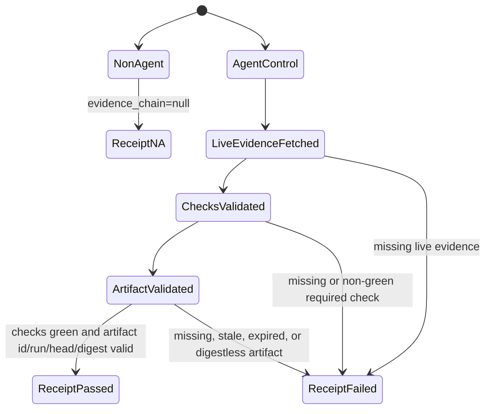
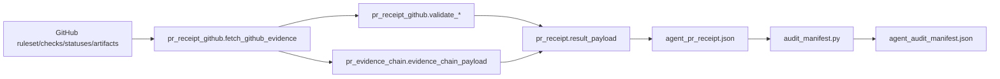

# Feature design: agent PR receipt evidence chain

- Status: APPROVED
- Owner: PaulKov
- Issue: #275
- Target release: next patch
Last verified: 2026-07-13

Follow-up hardening:
`docs/feature-design-agent-governance-artifact-content-verification.md` extends
this metadata chain by downloading the governance artifact and validating the
`agent_governance_gate.json` content against the PR changed paths. This document
keeps the original metadata-chain rationale and points to the follow-up for
content semantics.

## Executive summary

Agent-control pull requests now produce structured receipt traceability, but the
live GitHub evidence is still mostly a set of raw checks and artifacts. An
auditor can see that a governance artifact existed for the reviewed head SHA,
but cannot query a compact chain from PR, to commit, to required checks, to the
governance artifact, to the artifact digest.

This change makes the PR receipt evidence tamper-evident at the metadata layer:
the receipt records check identifiers, workflow run identifiers, artifact
identifiers, and artifact SHA-256 digests observed through GitHub's Actions API.
The receipt fails closed when the required governance artifact has no usable
artifact id, workflow run id, matching head SHA, or SHA-256 digest.

## Personas and customer journey

| Persona | Goal | Current pain | Success signal |
|---|---|---|---|
| Maintainer | Merge an agent-control PR without self-approval ambiguity. | Must manually correlate PR checks, workflow runs, and artifact pages. | Receipt JSON shows a compact evidence chain for the reviewed head commit. |
| Release auditor | Reconstruct why a governance PR was accepted. | Artifact identity and digest are not summarized in one manifest. | `agent_audit_manifest.json` links required checks and the governance artifact digest. |
| Future automation | Build a governance dashboard. | Needs multiple GitHub API calls and Markdown parsing to prove evidence freshness. | Dashboard reads one stable chain payload from the receipt. |
| Security reviewer | Detect stale or swapped governance artifacts. | Artifact name and head SHA are checked, but digest/id are not required. | Receipt fails when the governance artifact is missing id/run/digest metadata. |

The maintainer opens an agent-control PR, waits for required CI checks and the
`agent-governance-gate` artifact, then checks owner attestation. The rerun
`Agent PR receipt` check fetches live GitHub evidence for the reviewed head SHA,
builds the compact chain, validates required checks and governance artifact
identity, and writes both the raw evidence and compact chain into the receipt.
The audit manifest copies the compact chain for first-pass review.

## Scope

### In scope

- Enrich raw GitHub check evidence with GitHub check/status ids, details URLs,
  and parsed workflow run ids when GitHub exposes them.
- Enrich raw GitHub artifact evidence with artifact id, size, timestamps, and
  `sha256:<hex>` digest from the Actions artifacts API.
- Add an `evidence_chain` object to `agent_pr_receipt.json`.
- Add compact evidence-chain fields to `agent_audit_manifest.json`.
- Fail closed for agent-control PRs when the required `agent-governance-gate`
  artifact is missing, expired, bound to another head SHA, missing artifact id,
  missing workflow run id, or missing a valid SHA-256 digest.
- Update JSON schemas, focused tests, agent governance docs, and generated
  quality metrics.

### Non-goals

- No new ETL runtime, connector, Airflow, dbt, or release behavior.
- No cryptographic signing or GitHub Artifact Attestations for the PR receipt
  artifact itself.
- No local byte-level rehash of downloaded artifact zip contents in this PR.
  Content download and JSON validation are handled by the approved follow-up
  feature design linked above.
- No branch-protection mode change.
- No new GitHub token scope beyond the existing Actions/checks/status read path.

### Assumptions and constraints

- GitHub Actions artifact metadata includes `digest` for artifacts uploaded by
  current `actions/upload-artifact` versions.
- `Agent PR receipt` cannot validate its own final uploaded artifact before that
  upload occurs, so the chain covers required checks and the governance gate
  artifact available before receipt enforcement.
- Commit statuses may not expose workflow run ids; those fields remain nullable
  for status evidence. Required GitHub Actions check-runs should expose enough
  URL metadata to parse a workflow run id.
- Historical receipt artifacts are immutable history and are not migrated.

## Public contract

### CLI

`tools/agent_policy/pr_receipt.py` keeps the same command-line arguments and
exit codes. The JSON output gains `evidence_chain`. `--require-github-evidence`
continues to fail when live GitHub evidence cannot be fetched.

### Python API

Repository-local tooling remains module-level functions. `result_payload()` now
includes `evidence_chain`. The GitHub evidence dataclasses gain additive fields:
`id`, `details_url`, `workflow_run_id`, `artifact_id`, `digest`,
`size_in_bytes`, `created_at`, and `expires_at` where applicable.

### Manifest/schema

`evals/agent/pr-receipt.schema.json` allows the enriched raw evidence fields and
requires top-level `evidence_chain`. Non-agent PRs and runs without live GitHub
evidence use `evidence_chain: null`.

`evals/agent/audit-manifest.schema.json` gains:

```json
{
  "evidence_chain_head_sha": "abc123",
  "evidence_chain_required_checks": [
    {
      "name": "Quality checks (3.12)",
      "source": "check_run",
      "id": 123,
      "workflow_run_id": 456,
      "url": "https://github.example/check"
    }
  ],
  "evidence_chain_governance_artifact": {
    "name": "agent-governance-gate",
    "artifact_id": 789,
    "workflow_run_id": 456,
    "workflow_run_head_sha": "abc123",
    "digest": "sha256:aaaaaaaaaaaaaaaaaaaaaaaaaaaaaaaaaaaaaaaaaaaaaaaaaaaaaaaaaaaaaaaa",
    "expired": false,
    "url": "https://github.example/artifact.zip"
  }
}
```

### Artifacts and evidence

`agent_pr_receipt.json` gains:

```json
{
  "evidence_chain": {
    "head_sha": "abc123",
    "required_checks": [
      {
        "name": "Quality checks (3.12)",
        "source": "check_run",
        "id": 123,
        "workflow_run_id": 456,
        "status": "completed",
        "conclusion": "success",
        "state": null,
        "url": "https://github.example/check",
        "completed_at": "2026-07-13T00:00:00Z"
      }
    ],
    "governance_artifact": {
      "name": "agent-governance-gate",
      "artifact_id": 789,
      "workflow_run_id": 456,
      "workflow_run_head_sha": "abc123",
      "digest": "sha256:aaaaaaaaaaaaaaaaaaaaaaaaaaaaaaaaaaaaaaaaaaaaaaaaaaaaaaaaaaaaaaaa",
      "expired": false,
      "url": "https://github.example/artifact.zip"
    }
  }
}
```

The evidence chain is informational for failed receipts but still emitted when
live evidence exists, so operators can diagnose missing checks or stale
artifacts.

### Compatibility and migration

This is an additive receipt-schema extension for newly generated artifacts. The
existing status vocabulary, PR-body attestation language, required check names,
and non-agent `N/A` behavior remain unchanged. Rollback is a normal revert; the
previous head-SHA artifact check remains sufficient until this hardening is
reapplied.

## Detailed algorithm

1. Fetch required check names from the configured GitHub ruleset.
2. Fetch check-runs and commit statuses for the PR head SHA.
3. Fetch artifacts named `agent-governance-gate` from GitHub Actions artifact
   metadata and keep only artifacts whose `workflow_run.head_sha` equals the PR
   head SHA.
4. Normalize check evidence:
   - keep name, source, state/status/conclusion, urls, completion timestamp;
   - keep GitHub id when present;
   - parse workflow run id from Actions URLs when present.
5. Normalize artifact evidence:
   - keep artifact id, artifact name, workflow run id, workflow head SHA,
     expiry state, URL, digest, size, created timestamp, and expiry timestamp;
   - accept only `sha256:<64 lowercase/uppercase hex>` digests for the required
     governance artifact.
6. Validate required checks as before, excluding the self check.
7. Validate governance artifact identity:
   - artifact name matches `agent-governance-gate`;
   - artifact head SHA equals PR head SHA;
   - artifact is not expired;
   - artifact id is positive;
   - workflow run id is positive;
   - digest is a valid SHA-256 digest.
8. Build `evidence_chain` from the observed required checks and the first valid
   governance artifact for the head SHA.
9. Write raw `github_evidence`, structured `traceability`, and compact
   `evidence_chain` into `agent_pr_receipt.json`.
10. Copy compact chain fields into `agent_audit_manifest.json`.

### Pseudocode

```text
evidence = fetch_github_evidence(repo, head_sha, token, ruleset_id)
errors += validate_required_check_evidence(evidence, self_check)
errors += validate_governance_artifact_evidence(evidence, artifact_name)

chain = evidence_chain_payload(evidence, self_check, artifact_name)

return receipt(
    status="FAIL" if errors else "PASS",
    github_evidence=evidence,
    traceability=traceability,
    evidence_chain=chain,
)
```

### State machine



### Edge cases

- Non-agent PR: `status: "N/A"`, `traceability: null`, `evidence_chain: null`.
- No GitHub token: `FAIL` when `--require-github-evidence` is used; chain is
  null and error explains missing token.
- Required check is a commit status: status id is recorded when present;
  workflow run id may be null.
- Multiple check-runs with the same name: first observed item is used, matching
  existing required-check behavior.
- Multiple governance artifacts for the same head: first non-expired valid
  artifact with a SHA-256 digest satisfies the guard; all filtered artifacts
  remain in raw evidence for diagnosis.
- Correct artifact name but old head SHA: ignored by fetch filtering and fails
  validation as missing for the reviewed head.
- Correct artifact name and head SHA but missing digest: validation fails.
- Artifact expired after a previous receipt pass: a rerun fails closed.

## Architecture

### Components and responsibilities

| Component | Existing/new | Responsibility | Dependencies |
|---|---|---|---|
| `tools/agent_policy/pr_receipt_github.py` | Existing | Fetch and validate raw GitHub check/status/artifact metadata. | Python stdlib HTTP only. |
| `tools/agent_policy/pr_evidence_chain.py` | New | Build compact evidence-chain JSON from normalized GitHub evidence. | Python stdlib, duck-typed evidence objects. |
| `tools/agent_policy/pr_receipt.py` | Existing | Compose receipt status, traceability, raw evidence, and compact chain. | Sibling policy modules. |
| `tools/agent_policy/audit_manifest.py` | Existing | Project compact chain fields into audit manifest. | Receipt JSON only. |
| `evals/agent/*.schema.json` | Existing | Define receipt and audit manifest artifact shapes. | JSON Schema 2020-12. |

### Ports, adapters, and composition root

No new public adapter is introduced. `pr_receipt.py` remains the composition
root for the receipt check. GitHub API access stays isolated in
`pr_receipt_github.py`; compact serialization stays isolated in
`pr_evidence_chain.py`.

### Data and control flow



### Alternatives and tradeoffs

| Alternative | Advantages | Disadvantages | Decision |
|---|---|---|---|
| Keep raw evidence only | No schema change. | Auditors still have to infer the chain and artifact digest manually. | Rejected. |
| Download artifact zip and validate domain JSON | Proves the artifact content covers the PR diff, not only that an artifact shell exists. | Adds one artifact download to the receipt workflow. | Adopted by follow-up feature design. |
| Rehash downloaded artifact bytes locally | Stronger byte-level verification. | GitHub artifact digest semantics can differ by packaging version; does not by itself validate dpone governance semantics. | Deferred. |
| Require GitHub Artifact Attestations for PR governance artifacts | Strongest provenance story. | GitHub guidance focuses attestations on release/build artifacts, not frequent test artifacts; requires workflow and permission expansion. | Deferred for release-grade artifacts. |
| Add compact metadata chain from GitHub API | Small, queryable, fail-closed against stale/digestless artifacts. | Metadata integrity depends on GitHub API trust. | Adopted. |

### ADR requirement

No ADR is required. This is a hardening of the existing agent governance receipt
artifact, not a new cross-layer runtime architecture.

### Quality-budget impact

`pr_receipt_github.py` is already near the strict agent-policy warning limit, so
compact chain serialization goes into a new focused module. All touched
`tools/agent_policy` and `tests/agent_policy` files must pass the stricter
focused module-size guard: max 400 LOC and max 350 SLOC.

## Market comparison

The required market comparison list is composed of ETL/ELT, orchestration, or
data integration systems. They do not provide a repository-local GitHub PR
receipt artifact, so they are marked `N/A` for this capability. The relevant
platform sources are GitHub's official Actions artifact and artifact
attestation documentation, verified on 2026-07-13:

- GitHub REST API for Actions artifacts:
  <https://docs.github.com/en/rest/actions/artifacts>
- GitHub workflow artifact digest behavior:
  <https://docs.github.com/en/actions/tutorials/store-and-share-data#validating-artifacts>
- GitHub Artifact Attestations concept:
  <https://docs.github.com/en/actions/concepts/security/artifact-attestations>

| System/version | Relevant capability | Observed design | Strength | Limitation | Adopt/reject | Source/date |
|---|---|---|---|---|---|---|
| dlt | N/A | Data loading framework, not GitHub PR governance receipt. | N/A | No comparable PR artifact layer. | N/A | N/A, 2026-07-13 |
| Informatica | N/A | Enterprise data integration/governance platform, not repo-local agent receipt. | N/A | No comparable PR artifact layer. | N/A | N/A, 2026-07-13 |
| Airbyte | N/A | Connector ELT platform, not PR receipt validation. | N/A | No comparable PR artifact layer. | N/A | N/A, 2026-07-13 |
| Fivetran | N/A | Managed ELT platform, not repo-local CI receipt. | N/A | No comparable PR artifact layer. | N/A | N/A, 2026-07-13 |
| Pentaho | N/A | Data integration tooling, not agent PR audit receipt. | N/A | No comparable PR artifact layer. | N/A | N/A, 2026-07-13 |
| Microsoft SSIS | N/A | ETL runtime/design tooling, not GitHub PR governance receipt. | N/A | No comparable PR artifact layer. | N/A | N/A, 2026-07-13 |
| gusty | N/A | DAG construction utility, not PR receipt artifact. | N/A | No comparable PR artifact layer. | N/A | N/A, 2026-07-13 |
| Astronomer Cosmos | N/A | Airflow/dbt orchestration integration, not agent PR receipt. | N/A | No comparable PR artifact layer. | N/A | N/A, 2026-07-13 |
| Apache Beam | N/A | Distributed data processing model, not PR governance receipt. | N/A | No comparable PR artifact layer. | N/A | N/A, 2026-07-13 |

## Measurable differentiation

```yaml
axis: tamper-evident metadata chain for agent-control PR evidence
scenario: auditor inspects a merged agent-control PR without re-querying GitHub
baseline: dpone receipt after #306
metric: chain fields available as JSON and fail-closed validation for stale or digestless governance artifacts
target: receipt contains reviewed head SHA, required check ids where available, workflow run ids where available, governance artifact id, workflow run id, matching head SHA, and sha256 digest
procedure: run focused receipt/audit tests and validate outputs against evals/agent schemas
artifact: agent_pr_receipt.json and agent_audit_manifest.json
limitations: does not cryptographically sign PR receipt artifacts and does not rehash downloaded artifact bytes; content validation is covered by docs/feature-design-agent-governance-artifact-content-verification.md
```

## Security, privacy, and operations

No secrets are printed or stored. The receipt stores GitHub metadata already
available to repository readers with Actions/checks access. The new digest check
reduces false-success risk from stale or swapped governance artifacts. Missing
digest is `FAIL`, not `UNVERIFIED`, because the required governance artifact is
created by the repository's pinned upload-artifact workflow.

## Test and certification plan

| Layer | Scenario | Environment | Expected artifact |
|---|---|---|---|
| Unit | Raw GitHub artifact evidence records id, digest, size, timestamps. | Local pytest with monkeypatched API. | `GitHubEvidence.artifacts`. |
| Unit | Governance artifact missing digest fails receipt. | Local pytest. | `result.errors`. |
| Unit | Correct name but wrong head does not satisfy artifact validation. | Local pytest. | `result.errors`. |
| Contract | Receipt payload includes `evidence_chain` and validates schema. | Local pytest/jsonschema. | `agent_pr_receipt.json` payload. |
| Contract | Audit manifest copies compact chain and validates schema. | Local pytest/jsonschema. | `agent_audit_manifest.json`. |
| Agent policy | Agent tooling and module-size guards remain green. | Local/CI. | `agent_governance_gate.json`. |
| Docs | Governance docs and strict MkDocs pass. | Local/CI. | Built docs. |
| Live certification | N/A. | N/A: no connector or live data path changed. | N/A. |

## Documentation plan

Update `docs/agent-governance.md`, `docs/agent-security-mapping.md`, and
`docs/github-branch-protection.md` to explain the compact evidence chain,
artifact digest requirement, and stale-artifact failure behavior. Update
generated quality metrics through the producer.

## Rollout and rollback

Roll out through a normal PR. The PR itself changes agent-control files, so the
required `Agent PR receipt` check validates the new schema and digest
requirements before merge. Rollback is reverting this PR; receipt enforcement
falls back to the previous head-SHA artifact check and structured traceability.

## Agent execution plan

| Agent/role | Owned paths | Read-only paths | Forbidden paths | Dependency |
|---|---|---|---|---|
| Integrator | `tools/agent_policy/pr_receipt_github.py`, `tools/agent_policy/pr_evidence_chain.py`, `tools/agent_policy/pr_receipt.py`, `tools/agent_policy/audit_manifest.py`, `tests/agent_policy/**`, `evals/agent/pr-receipt.schema.json`, `evals/agent/audit-manifest.schema.json`, `docs/feature-design-agent-pr-receipt-evidence-chain.md`, `docs/superpowers/plans/2026-07-13-agent-pr-receipt-evidence-chain.md`, selected governance docs | `AGENTS.md`, `docs/feature-design-standard.md`, prior agent receipt specs and docs | Runtime connector code, package lockfiles unless validation requires producer update | Maintainer approval in chat on 2026-07-13 |

## Approval checklist

- [x] User problem and CJM are clear.
- [x] Algorithm and failure semantics are implementable without guessing.
- [x] Public contracts and compatibility are explicit.
- [x] Architecture and alternatives are justified.
- [x] Relevant market research uses current official GitHub sources and N/A reasons for irrelevant ETL systems.
- [x] Claimed differentiation is measurable.
- [x] Tests, evidence, docs, rollout, and rollback are complete.
- [x] Path ownership and integration plan are conflict-safe.
- [x] Maintainer changed status to `APPROVED`.
