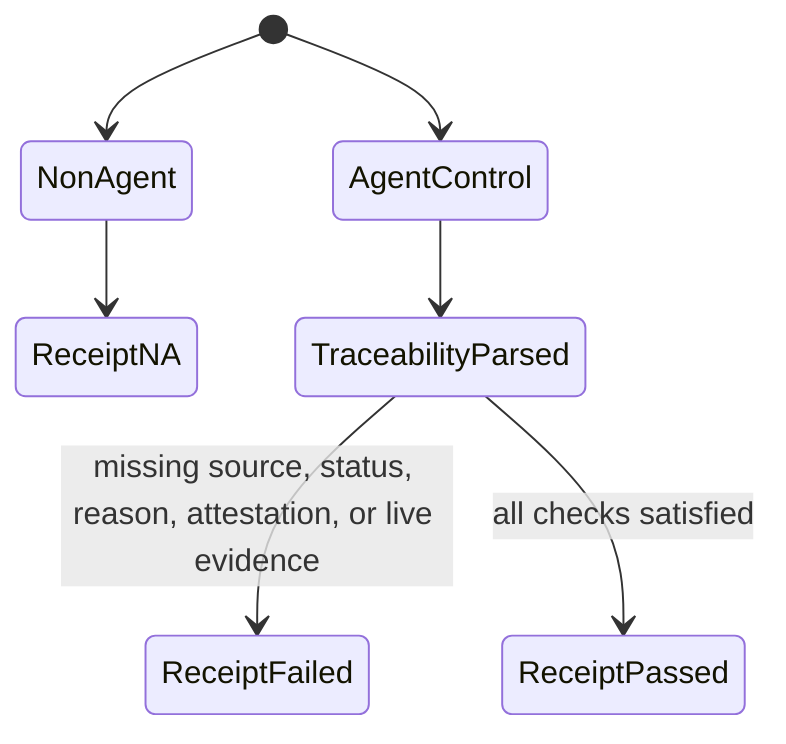
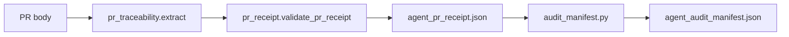

# Feature design: agent PR receipt traceability payload

- Status: IMPLEMENTED
- Owner: PaulKov
- Issue: #275
- Target release: next patch
Last verified: 2026-07-12

## Executive summary

Agent-control pull requests now fail closed when the PR body lacks an approved
source or validation evidence, but the passing `agent_pr_receipt.json` still
requires a human to reread the PR body to understand why the receipt passed.
This change adds a structured `traceability` object to the receipt artifact so
auditors, future dashboards, and incident reviews can read the approved source,
validation statuses, non-pass reasons, and owner-attestation state directly from
the machine-readable evidence.

## Personas and customer journey

| Persona | Goal | Current pain | Success signal |
|---|---|---|---|
| Maintainer | Confirm an agent-control PR is ready to merge. | Must inspect PR prose after the receipt is green. | Receipt JSON shows source, validation rows, and checked attestations. |
| Release auditor | Reconstruct why a governance PR was allowed. | Receipt status alone does not summarize PR-body evidence. | Audit artifact contains enough structured context for triage. |
| Future automation | Build a governance dashboard. | Must scrape Markdown tables from PR bodies. | Dashboard can read stable JSON fields. |

The maintainer opens an agent-control PR, fills the approved source and
validation evidence table, waits for CI, checks owner attestation, and lets
`Agent PR receipt` rerun. The resulting artifact shows both the validation
decision and the PR-body evidence that supported it. If the receipt fails, the
existing errors remain the primary operator recovery path.

## Scope

### In scope

- Add `traceability` to `agent_pr_receipt.json`.
- Include approved source text, validation evidence rows, statuses that require
  reasons, owner-attestation booleans, and governance receipt reference status.
- Update `evals/agent/pr-receipt.schema.json`.
- Include compact traceability fields in `agent_audit_manifest.json`.
- Update agent governance docs and tests.

### Non-goals

- No change to runtime ETL behavior, connector behavior, or branch protection
  policy.
- No new GitHub API calls.
- No digest/signature layer for evidence artifacts; that remains a later
  integrity hardening step.
- No change to the PR template status vocabulary.

### Assumptions and constraints

- The PR body remains the source of truth for maintainer-entered traceability.
- Non-agent PRs keep returning `status: "N/A"` and now include
  `traceability: null`.
- The schema version remains `2` because this is an additive field in an
  internal required-check artifact; consumers should already validate by schema.

## Public contract

### Artifacts and evidence

`agent_pr_receipt.json` gains:

```json
{
  "traceability": {
    "approved_source": "#275",
    "approved_source_kind": "issue",
    "validation_rows": [
      {
        "check": "Focused tests",
        "status": "PASS",
        "command": "uv run pytest tests/agent_policy/test_pr_receipt.py -q",
        "notes": "33 passed"
      }
    ],
    "validation_statuses": ["PASS"],
    "non_pass_reasons": [],
    "owner_attestation": {
      "owner_review": true,
      "required_checks": true,
      "admin_bypass": true,
      "governance_receipt": true
    },
    "governance_receipt_referenced": true
  }
}
```

Allowed `approved_source_kind` values are `issue`, `url`, `docs`, `adr`, `na`, and
`unknown`. Validation statuses remain `PASS`, `FAIL`, `SKIP`, `N/A`, and
`UNVERIFIED`. `non_pass_reasons` contains one entry per validation row whose
status is `SKIP`, `N/A`, or `UNVERIFIED`.

`agent_audit_manifest.json` gains a compact summary:

```json
{
  "traceability_source": "#275",
  "traceability_source_kind": "issue",
  "traceability_statuses": ["PASS"],
  "traceability_non_pass_reasons": []
}
```

### Compatibility and migration

Older receipts without `traceability` are historical artifacts and remain
readable by humans. New receipts validate against the updated schema. Rollback is
a normal PR revert; existing fail-closed checks remain intact.

## Detailed algorithm

1. Parse the PR body once through `pr_traceability`.
2. Extract `Approved specification or issue`.
3. Classify the source as `issue`, `url`, `docs`, `adr`, `na`, or `unknown`.
4. Parse the `Validation evidence` Markdown table into rows with four stable
   fields: `check`, `status`, `command`, and `notes`.
5. Build `non_pass_reasons` for rows with `SKIP`, `N/A`, or `UNVERIFIED`.
6. Evaluate owner-attestation checkboxes and governance receipt reference using
   the same patterns as the existing receipt validator.
7. Validate the traceability object using existing fail-closed rules.
8. Write the traceability object into `agent_pr_receipt.json`; use `null` for
   non-agent PRs.
9. Copy compact source/status/reason fields into `agent_audit_manifest.json`.

### Pseudocode

```text
if control_surface_changed(changed_paths) is false:
    return receipt(status="N/A", traceability=null)

traceability = pr_traceability.extract(body)
errors += pr_traceability.validate(traceability)
errors += owner_attestation_errors(body)
errors += live_github_errors(github_evidence)

return receipt(
    status="FAIL" if errors else "PASS",
    traceability=traceability,
)
```

### State machine



### Edge cases

- Empty PR body: `FAIL` for agent-control PRs, `traceability` object records
  missing source and empty validation rows.
- Non-agent PR: `N/A`, `traceability: null`.
- Multiple validation rows with the same status: keep all rows and deduplicate
  `validation_statuses` in first-seen order.
- `SKIP`, `N/A`, or `UNVERIFIED` without notes: `FAIL` and empty/short reason
  remains visible in the row.
- Unknown but non-empty source text: validation fails unless it matches an
  accepted source form; `approved_source_kind` is still `unknown` for diagnosis.

## Architecture

### Components and responsibilities

| Component | Existing/new | Responsibility | Dependencies |
|---|---|---|---|
| `tools/agent_policy/pr_traceability.py` | Existing | Parse, classify, validate, and serialize PR-body traceability. | Python stdlib only. |
| `tools/agent_policy/pr_receipt.py` | Existing | Compose receipt status, errors, GitHub evidence, and traceability payload. | `pr_traceability`, `pr_receipt_github`, `control_surface`. |
| `tools/agent_policy/audit_manifest.py` | Existing | Copy compact traceability fields into the audit manifest. | Receipt JSON only. |
| `evals/agent/pr-receipt.schema.json` | Existing | Define receipt artifact shape. | JSON Schema 2020-12. |

### Data and control flow



### Alternatives and tradeoffs

| Alternative | Advantages | Disadvantages | Decision |
|---|---|---|---|
| Keep Markdown-only evidence | No schema change. | Future audit tooling must scrape PR body. | Rejected. |
| Add free-form `traceability_summary` string | Simple. | Not reliably queryable. | Rejected. |
| Add structured object and compact manifest summary | Queryable, testable, auditable. | Requires schema/docs/tests update. | Adopted. |

### ADR requirement

No ADR is required. This is an additive governance artifact schema change inside
the existing agent governance design.

### Quality-budget impact

Expected impact is under 200 SLOC in `tools/agent_policy/pr_traceability.py` and
focused tests in a split test module. The existing agent-policy module-size guard
must stay below 400 LOC and 350 SLOC per file.

## Market comparison

The selected market systems are ETL/ELT, orchestration, or data integration
products. They are not the relevant layer for a repository-local GitHub PR
receipt artifact, so they are marked `N/A` rather than compared on a false axis.

| System/version | Relevant capability | Observed design | Strength | Limitation | Adopt/reject | Source/date |
|---|---|---|---|---|---|---|
| dlt | N/A | Data loading framework, not GitHub PR governance receipt. | N/A | No comparable PR artifact layer. | N/A | N/A, 2026-07-12 |
| Informatica | N/A | Enterprise data integration/governance platform, not repo-local agent receipt. | N/A | No comparable PR artifact layer. | N/A | N/A, 2026-07-12 |
| Airbyte | N/A | Connector ELT platform, not PR receipt validation. | N/A | No comparable PR artifact layer. | N/A | N/A, 2026-07-12 |
| Fivetran | N/A | Managed ELT platform, not repo-local CI receipt. | N/A | No comparable PR artifact layer. | N/A | N/A, 2026-07-12 |
| Pentaho | N/A | Data integration tooling, not agent PR audit receipt. | N/A | No comparable PR artifact layer. | N/A | N/A, 2026-07-12 |
| Microsoft SSIS | N/A | ETL runtime/design tooling, not GitHub PR governance receipt. | N/A | No comparable PR artifact layer. | N/A | N/A, 2026-07-12 |
| gusty | N/A | DAG construction utility, not PR receipt artifact. | N/A | No comparable PR artifact layer. | N/A | N/A, 2026-07-12 |
| Astronomer Cosmos | N/A | Airflow/dbt orchestration integration, not agent PR receipt. | N/A | No comparable PR artifact layer. | N/A | N/A, 2026-07-12 |
| Apache Beam | N/A | Distributed data processing model, not PR governance receipt. | N/A | No comparable PR artifact layer. | N/A | N/A, 2026-07-12 |

## Measurable differentiation

```yaml
axis: auditability of agent-control PR evidence
scenario: an auditor inspects a merged agent-control PR artifact without reading PR Markdown
baseline: current dpone receipt after #304
metric: required fields available as JSON without Markdown parsing
target: approved source, source kind, validation statuses, non-pass reasons, and owner attestation are present
procedure: run receipt unit tests and validate output against evals/agent/pr-receipt.schema.json
artifact: agent_pr_receipt.json
limitations: does not prove artifact integrity or long-term retention beyond existing workflow controls
```

## Security, privacy, and operations

No secrets are added or read. The traceability object may contain PR-body text
already visible in GitHub. The artifact remains retained through the existing
90-day workflow policy.

## Test and certification plan

| Layer | Scenario | Environment | Expected artifact |
|---|---|---|---|
| Unit | Control-surface PR writes structured traceability. | Local pytest. | `result_payload()["traceability"]`. |
| Unit | Non-agent PR writes `traceability: null`. | Local pytest. | `agent_pr_receipt.json`. |
| Contract | Receipt JSON validates against schema. | Local pytest/jsonschema. | `evals/agent/pr-receipt.schema.json`. |
| Agent policy | Inventory and governance gates remain green. | Local/CI. | `agent_governance_gate.json`. |
| Docs | Governance docs and MkDocs strict build pass. | Local/CI. | Built docs. |
| Live certification | N/A. | N/A: no connector or live data path changed. | N/A. |

## Documentation plan

Update `docs/agent-governance.md`, `docs/agent-security-mapping.md`, and
`docs/github-branch-protection.md` to explain the new structured receipt fields.
Update generated quality metrics through `dpone docs update-dev-metrics`.

## Rollout and rollback

Roll out through normal PR merge. The required `Agent PR receipt` check validates
the new schema on this PR. Rollback is reverting the PR; old receipt behavior
still fails closed on missing PR-body traceability because #304 remains intact.

## Agent execution plan

| Agent/role | Owned paths | Read-only paths | Forbidden paths | Dependency |
|---|---|---|---|---|
| Integrator | `tools/agent_policy/pr_traceability.py`, `tools/agent_policy/pr_receipt.py`, `tools/agent_policy/audit_manifest.py`, `tests/agent_policy/**`, `evals/agent/pr-receipt.schema.json`, `evals/agent/audit-manifest.schema.json`, selected docs | `AGENTS.md`, `docs/feature-design-standard.md`, agent governance docs | Runtime connector code, package lockfiles unless validation requires producer update | None |

## Approval checklist

- [x] User problem and CJM are clear.
- [x] Algorithm and failure semantics are implementable without guessing.
- [x] Public contracts and compatibility are explicit.
- [x] Architecture and alternatives are justified.
- [x] Relevant market research uses N/A reasons for irrelevant systems.
- [x] Claimed differentiation is measurable.
- [x] Tests, evidence, docs, rollout, and rollback are complete.
- [x] Path ownership and integration plan are conflict-safe.
- [x] Maintainer changed status to `APPROVED`.
