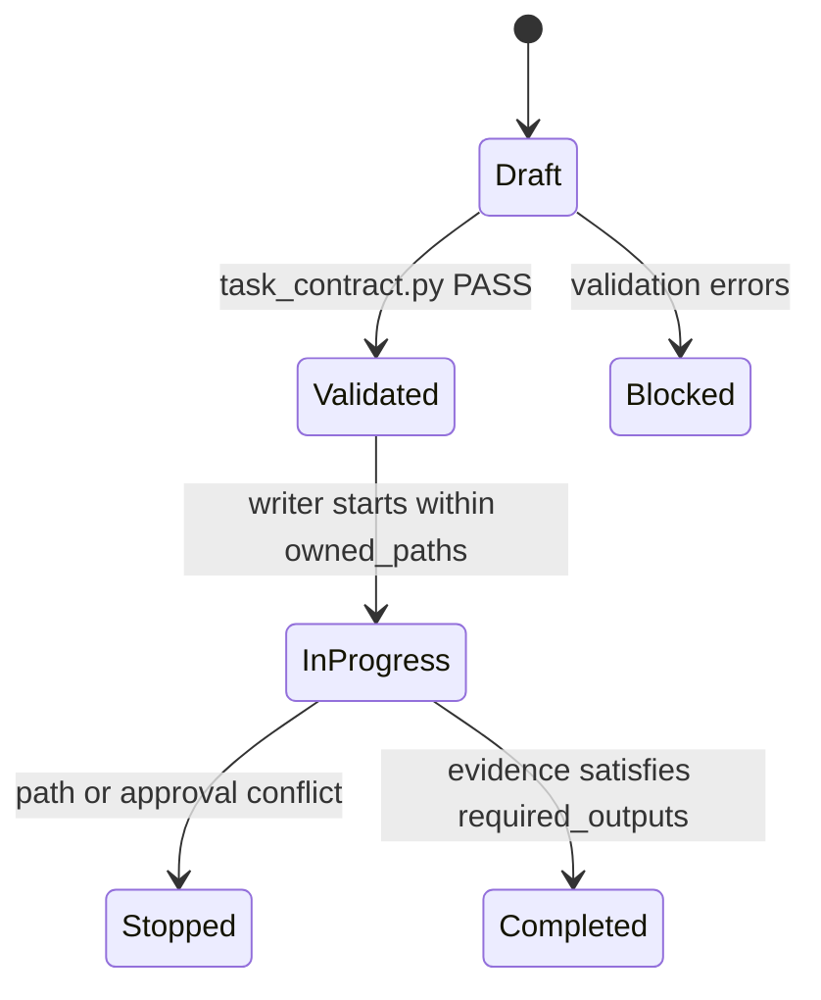
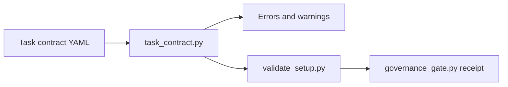

# Feature design: Agent task contract gate

- Status: APPROVED
- Owner: dpone maintainers
- Issue: Codex thread request, 2026-07-12
- Target release: next patch
Last verified: 2026-07-12

## Executive summary

dpone already has agent instructions, permission profiles, tool registry,
connector onboarding, red-team scenarios, and module-size guards. The remaining
gap is per-task scope control: an agent can understand the policy but still work
from an incomplete task boundary. This feature makes the task contract template
and any concrete contract machine-checkable before implementation starts.

The measurable outcome is binary: malformed task contracts fail local validation
and agent governance receipts show whether the task-contract template remains
valid.

## Personas and customer journey

| Persona | Goal | Current pain | Success signal |
|---|---|---|---|
| Maintainer | Know what an agent was allowed to change. | Path ownership and evidence can be prose-only. | Contract validation fails on empty, overlapping, or missing guard fields. |
| Integrator | Coordinate parallel writers safely. | Shared files and forbidden paths can be ambiguous. | Each writer has explicit owned/read-only/forbidden paths and stop conditions. |
| Reviewer | Audit AI-agent PR evidence quickly. | Completion reports may omit checks or approval boundaries. | Required checks, outputs, and statuses are contract fields. |

Journey: the integrator copies `docs/agent-templates/agent-task-contract.yml`,
fills it for a writer, validates it with `tools/agent_policy/task_contract.py`,
and includes the contract path or summary in the PR evidence. If a writer needs
an unowned path, the contract fails or the writer stops and asks the integrator
to update ownership.

## Scope

### In scope

- Add a JSON schema for agent task contracts.
- Add an executable task-contract validator under `tools/agent_policy/`.
- Validate the repository task-contract template in `validate_setup.py` and
  `governance_gate.py`.
- Document the self-service command and update governance docs.
- Add tests for valid contracts, path conflicts, required shared-file forbids,
  completion statuses, and governance receipt wiring.

### Non-goals

- Runtime sandbox enforcement inside Codex or GitHub.
- Requiring every PR to commit a permanent task-contract artifact.
- Replacing CODEOWNERS, branch protection, or permission profiles.
- Live connector certification.

### Assumptions and constraints

- The repository template may contain empty placeholders, but concrete contracts
  must not.
- Concrete contracts are validated by command or CI artifact before a writer
  edits code.
- Shared-file ownership remains integrator-owned unless explicitly declared.

## Public contract

### CLI

```bash
uv run python tools/agent_policy/task_contract.py \
  docs/agent-templates/agent-task-contract.yml \
  --template
```

Concrete contracts omit `--template`; validation exits `0` on PASS and `1` on
FAIL. Text output prints each error and warning; JSON output is available with
`--format json`.

### Python API

`tools/agent_policy/task_contract.py` exposes internal repository helpers:

- `validate_file(path, template=False)`;
- `validate_payload(payload, label, template=False)`;
- `TaskContractValidationResult`.

These are not public `dpone.*` package APIs.

### Manifest/schema

The schema is `evals/agent/agent-task-contract.schema.json`, version 1, closed
at the object and nested-object levels. It describes task identity, acceptance
criteria, public-contract impact, path ownership, required checks, required
outputs, completion statuses, and stop conditions.

### Artifacts and evidence

The governance receipt gains `agent_task_contract_template`. A concrete task
contract can be attached as PR evidence or referenced from the completion report.

### Compatibility and migration

Existing users and ETL routes are unaffected. Existing agent workflows keep
working, but future agent-control PRs can require validated task contracts
without adding a new runtime dependency.

## Detailed algorithm

1. Load YAML from the requested contract path.
2. Verify the top-level payload is a mapping with `schema_version: 1`.
3. Validate required string fields. Empty strings are allowed only for the
   repository template mode.
4. Validate `public_contract_impact.level` and `completion_statuses.allowed`
   against the fixed vocabulary.
5. Validate list fields are lists of non-empty strings in concrete mode.
6. Normalize path lists and detect overlap between `owned_paths`,
   `read_only_paths`, and `forbidden_paths`.
7. Require standard shared files in `forbidden_paths` unless the contract owner
   is the integrator.
8. Require concrete contracts to define focused and broad checks.
9. Require standard stop conditions for path ownership, missing specs, contract
   impact drift, live environment approval, and shared-file ownership conflicts.
10. Return a deterministic result with `errors` and `warnings`.

### Pseudocode

```text
payload = load_yaml(path)
errors = validate_shape(payload)
if not template:
    errors += validate_required_values(payload)
errors += validate_status_vocabulary(payload)
errors += validate_path_conflicts(payload)
errors += validate_shared_forbidden_paths(payload)
errors += validate_stop_conditions(payload)
return PASS when errors is empty
```

### State machine



### Edge cases

Empty template placeholders are allowed only with `--template`. Empty concrete
fields fail. Duplicate paths fail after normalization. Owned paths that equal or
nest under forbidden paths fail. Live checks can be listed but remain
`UNVERIFIED` unless an approved environment exists.

## Architecture

### Components and responsibilities

| Component | Existing/new | Responsibility | Dependencies |
|---|---|---|---|
| `tools/agent_policy/task_contract.py` | New | Validate template and concrete task contracts. | stdlib, PyYAML |
| `evals/agent/agent-task-contract.schema.json` | New | Machine-readable shape for contract files. | JSON Schema draft 2020-12 |
| `validate_setup.py` | Existing | Include schema/script inventory and template validation. | task contract validator |
| `governance_checks.py` | Existing | Emit task-contract template check. | task contract validator |
| `tests/agent_policy/test_task_contract.py` | New | Contract validator and governance wiring tests. | pytest |

### Ports, adapters, and composition root

The validator stays in repository tooling, not the `src/dpone` package. It is
loaded through the same sibling-file mechanism as the other agent-policy tools.

### Data and control flow



### Alternatives and tradeoffs

| Alternative | Advantages | Disadvantages | Decision |
|---|---|---|---|
| Prose-only checklist | Simple, no tooling. | Easy to skip or reinterpret. | Rejected. |
| Require committed contract per PR | Strong audit trail. | Creates noisy one-off artifacts. | Rejected for now. |
| Schema plus executable validator | Enforceable and low-noise. | Requires agents to run one more command. | Adopted. |

### ADR requirement

No ADR is required. This extends existing agent-governance tooling without a
new runtime architecture decision.

### Quality-budget impact

New tooling remains under the agent-policy 400 LOC / 350 SLOC hard gate added
in #295. Tests live under `tests/agent_policy`, which is also guarded.

## Market comparison

The project feature is repository-local AI-agent governance, not ETL execution.
ETL comparators are marked N/A because they do not define dpone's local
agent-task contract layer.

| System/version | Relevant capability | Observed design | Strength | Limitation | Adopt/reject | Source/date |
|---|---|---|---|---|---|---|
| dlt | N/A | ETL framework, not repository agent task contracts. | N/A | N/A | N/A | N/A |
| Informatica | N/A | Managed data platform, not local agent task contracts. | N/A | N/A | N/A | N/A |
| Airbyte | N/A | Connector platform, not local agent task contracts. | N/A | N/A | N/A | N/A |
| Fivetran | N/A | Managed ELT service, not local agent task contracts. | N/A | N/A | N/A | N/A |
| Pentaho | N/A | ETL tooling, not local agent task contracts. | N/A | N/A | N/A | N/A |
| Microsoft SSIS | N/A | ETL orchestration, not local agent task contracts. | N/A | N/A | N/A | N/A |
| gusty | N/A | DAG generation, not local agent task contracts. | N/A | N/A | N/A | N/A |
| Astronomer Cosmos | N/A | dbt/Airflow integration, not local agent task contracts. | N/A | N/A | N/A | N/A |
| Apache Beam | N/A | Data processing model, not local agent task contracts. | N/A | N/A | N/A | N/A |

Relevant control standards: NIST AI RMF 1.0 frames AI risk work as govern, map,
measure, and manage; OWASP LLM Top 10 2025 includes prompt injection, sensitive
information disclosure, supply-chain, and excessive-agency risks; SLSA v1.2
centers provenance and verifiable build evidence; OpenSSF Scorecard automates
repository security checks. This feature adopts the evidence and scoped-control
pattern, not a runtime sandbox claim.

## Measurable differentiation

```yaml
axis: enforceable per-agent task scope before implementation
scenario: a writer task tries to own docs and a forbidden workflow path at once
baseline: prose-only task contract template before this feature
metric: binary validation failure before code edits
target: 100% of malformed path ownership fixtures fail focused tests
procedure: uv run pytest tests/agent_policy/test_task_contract.py -q
artifact: pytest output and agent_governance_gate.json
limitations: does not enforce OS-level filesystem sandboxing outside repository tooling
```

## Security, privacy, and operations

Contracts must forbid secret access unless separately approved. Live checks are
declared but not treated as PASS without an approved environment. Completion
statuses keep `SKIP`, `N/A`, and `UNVERIFIED` distinct from `PASS`.

## Test and certification plan

| Layer | Scenario | Environment | Expected artifact |
|---|---|---|---|
| Unit | Valid concrete task contract passes. | Local pytest. | `tests/agent_policy/test_task_contract.py` |
| Unit | Empty concrete fields fail. | Local pytest. | Failing fixture assertion. |
| Unit | Owned/forbidden overlap fails. | Local pytest. | Failing fixture assertion. |
| Contract | Governance receipt includes task-contract template check. | Local pytest. | `tests/agent_policy/test_governance_gate.py` |
| Docs | Governance and task-contract docs build strictly. | Local docs checks. | MkDocs output. |
| Live certification | N/A. | N/A. | Live checks are not required. |

## Documentation plan

- Add `docs/agent-task-contracts.md`.
- Link it from `docs/agent-development.md` and `docs/agent-governance.md`.
- Keep the existing YAML template but document concrete validation.

## Rollout and rollback

Roll out as a CI-compatible repository tooling change. Rollback is reverting the
validator, schema, docs, and governance check in one PR. No runtime data or user
state migration is required.

## Agent execution plan

| Agent/role | Owned paths | Read-only paths | Forbidden paths | Dependency |
|---|---|---|---|---|
| Main integrator | `tools/agent_policy/**`, `tests/agent_policy/**`, `evals/agent/**`, `docs/agent-*.md`, `docs/feature-design-agent-task-contract-gate.md` | `src/dpone/**`, `.github/workflows/**` | `uv.lock`, runtime connector code | Fresh worktree from `origin/master` |

## Approval checklist

- [x] User problem and CJM are clear.
- [x] Algorithm and failure semantics are implementable without guessing.
- [x] Public contracts and compatibility are explicit.
- [x] Architecture and alternatives are justified.
- [x] Relevant market research uses current official sources or is marked N/A.
- [x] Claimed differentiation is measurable.
- [x] Tests, evidence, docs, rollout, and rollback are complete.
- [x] Path ownership and integration plan are conflict-safe.
- [x] Maintainer changed status to `APPROVED`.
