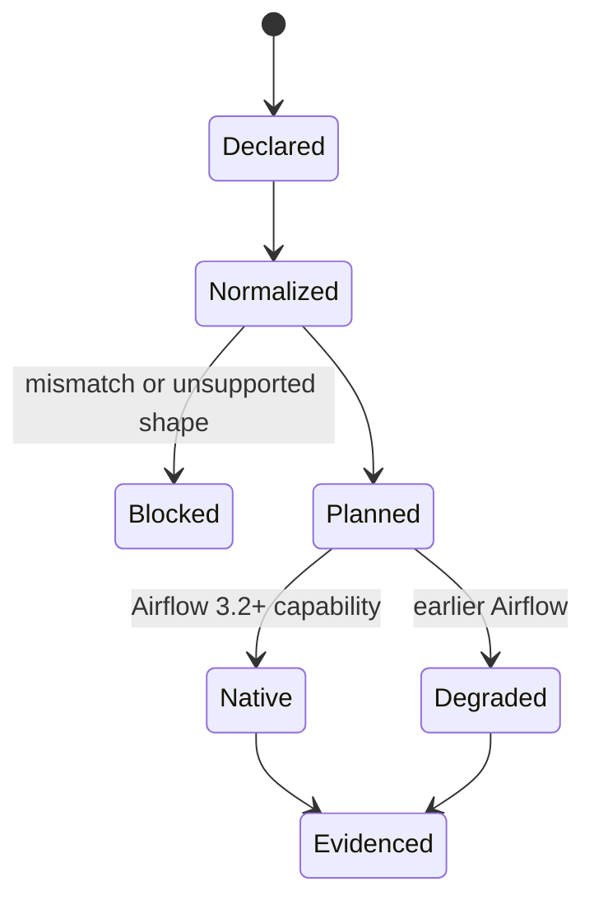

# Feature design: Airflow asset partitions v1

- Status: IMPLEMENTED
- Owner: dpone maintainers
- Approval: maintainer request to implement the frozen Industrial Self-Service
  Airflow plan as one goal
- Target release: 0.73.0
- Last verified: 2026-07-16

## Executive summary

dpone already infers canonical asset edges, blocks ambiguous writers and cycles,
and emits Airflow 3 Assets or Airflow 2 Datasets. It does not yet preserve the
partition represented by an asset event. A daily producer therefore wakes a
consumer at whole-asset granularity even when both workloads operate on the
same business-date partition.

This slice adds one orchestrator-neutral temporal partition descriptor to
workload inlets/outlets. The build plane validates and propagates it into the
asset graph, DAG spec, compact pack and evidence contract. Airflow 3.2+ uses
native partition timetables. Airflow 3.0/3.1 and 2.x explicitly degrade to the
existing unpartitioned Asset/Dataset behavior without changing dpone evidence.

Success means a user declares one partition once, never writes Airflow Python,
and can see the effective native/degraded behavior in preview and explain.

## Personas and customer journey

| Persona | Goal | Current pain | Success signal |
| --- | --- | --- | --- |
| New data engineer | Connect daily producer and consumer | Must understand Airflow timetable APIs | Adds one declarative partition block |
| Data architect | Keep partition semantics portable | Airflow capability can become the data model | dpone contract remains authoritative |
| Airflow operator | Know why a DAG is partitioned or degraded | Current graph shows only an asset URI | DAG spec records capability decision |
| Platform engineer | Upgrade Airflow safely | Version behavior is implicit | Exact compatibility tests prove native/degraded modes |

Journey:

1. The user adds a temporal partition to a workload outlet or uses a recipe that
   already supplies it.
2. `dpone check` validates one bounded dimension and compatible producer/consumer
   declarations without importing Airflow.
3. `dpone airflow preview` shows the URI, partition dimension, key format and
   target Airflow behavior.
4. Build inference adds the same descriptor to the consumer schedule and emits
   a deterministic DAG spec.
5. Airflow 3.2+ materializes `CronPartitionTimetable` for the producer and
   `PartitionedAssetTimetable` with identity mapping for the consumer.
6. Earlier Airflow versions retain the normal cron plus Asset/Dataset schedule;
   explain/evidence reports `degraded_unpartitioned`.
7. The runtime receives the resolved partition key in the existing scheduler-
   neutral run-context boundary and records it in evidence.

## Scope

### In scope

- One temporal dimension per asset for v1.
- `hour`, `day`, and `month` grains with deterministic default key formats.
- Build-time inheritance from producer outlet to an inferred consumer inlet.
- Exact producer/consumer contract matching and mixed-producer blockers.
- Airflow 3.2+ native cron producer and identity-mapped asset consumer.
- Explicit Airflow 3.0/3.1 Asset and Airflow 2 Dataset downgrade.
- Partition key propagation through `RunInterval`, XCom/runtime evidence and
  parse-safe operator environment templates.
- Generated schemas, docs, compatibility tests and explainable diagnostics.

### Non-goals

- Multiple dimensions or composite keys.
- Runtime-discovered/categorical partitions and `PartitionedAtRuntime`.
- Hour-to-day rollup, fan-out, `MinimumCount`, custom mappers or plugin Python.
- Replacing the dpone backfill campaign ledger with Airflow partitions.
- Reading Airflow metadata, Variables, Connections or asset events during parse.

### Assumptions and constraints

- A partitioned producer DAG has a cron schedule. Manual/runtime partition
  emission is rejected in v1 rather than guessed.
- All partitioned outlets produced by one DAG use one canonical temporal
  descriptor because one Airflow DAG run has one partition key.
- Partition metadata is non-secret but remains bounded and schema validated.
- Existing strings in `inlets`/`outlets` remain fully compatible and
  unpartitioned.

## Public contract

### Manifest and workload catalog

The user declares the partition alongside the logical asset:

```yaml
airflow:
  execution:
    outlets:
      - uri: dpone://clickhouse/analytics/orders
        partition:
          dimensions:
            business_date:
              type: temporal
              granularity: day
              timezone: UTC
```

Canonical defaults:

| Field | Default |
| --- | --- |
| `type` | `temporal` |
| `granularity` | required: `hour`, `day`, or `month` |
| `timezone` | `UTC` |
| `key_format` | hour `%Y-%m-%dT%H`, day `%Y-%m-%d`, month `%Y-%m` |
| `source` | `dag_schedule` |

`dimensions` has exactly one entry in v1. The mapping shape is intentional so
multiple dimensions can be added later without replacing the public syntax.

### DAG spec and pack

Each scheduled asset may carry the canonical descriptor. The DAG spec also
contains the resolved scheduling plan:

```yaml
partition_plan:
  mode: cron_producer       # cron_producer | asset_consumer | none
  dimension: business_date
  granularity: day
  timezone: UTC
  key_format: "%Y-%m-%d"
  mapper: identity
  provenance: inferred:asset_graph.v1
  compatibility:
    airflow_3_2_plus: native
    airflow_3_0_3_1: degraded_unpartitioned
    airflow_2: degraded_unpartitioned
```

The descriptor participates in semantic, DAG-spec, pack and release identity.
It is never advisory metadata.

### CLI

No new beginner command is added. Existing commands expose the decision:

```text
dpone check <pipeline>
dpone airflow preview <dag_id>
dpone airflow explain <dag_id>
```

Stable errors:

- `asset_partition_invalid`
- `asset_partition_dimension_count_invalid`
- `asset_partition_contract_mismatch`
- `asset_partition_producer_schedule_required`
- `asset_partition_producer_mixed_contracts`
- `DPONE_AIRFLOW_PARTITION_CAPABILITY_INVALID`

### Python API

No new top-level provider API. The public facade continues to return an Airflow
`DAG`; the implementation selects timetables lazily behind `DponeDag.from_spec`
and `load_dpone_dags`.

### Evidence

The existing interval object adds optional fields:

```yaml
partition_key: "2026-07-16"
partition_dimension: business_date
partition_mode: native
```

Missing fields mean unpartitioned or an older producer. Empty values normalize
to null. Evidence never infers a partition from `logical_date` after execution.

### Compatibility and migration

- Existing manifests, packs and DAG specs remain valid and unpartitioned.
- New partitioned artifacts are additive within schema version 1 because older
  providers ignore unknown fields and retain current schedules.
- A new provider on Airflow before 3.2 degrades deterministically and records
  the downgrade; it does not pretend to provide partition isolation.
- Rollback removes the partition block and rebuilds a new immutable release.
  Published artifacts are never edited in place.

## Detailed algorithm

### Build-plane normalization

1. Read only bounded `airflow.execution.inlets/outlets` from canonical workload
   configuration.
2. Convert strings to unpartitioned asset descriptors.
3. Validate mapping items, canonicalize URI, require exactly one dimension and
   normalize defaults.
4. Index producers by URI. Existing multi-writer rules run before partition
   inference.
5. For every producer-consumer edge:
   - inherit the producer partition when the consumer omitted it;
   - keep unpartitioned when both omitted it;
   - block when only the consumer declares a partition or descriptors differ.
6. Merge declared, inferred and curated edges, then run existing cycle checks.
7. For each producer DAG with partitioned outlets, require a cron schedule and
   one unique descriptor across all partitioned outlets.
8. For each asset-scheduled consumer, require one matching descriptor across
   all partitioned schedule assets in v1.
9. Emit `partition_plan`, enriched schedule assets and provenance into the DAG
   spec. Compact packs retain outlet descriptors unchanged.
10. Fingerprint the full normalized payload.

### Provider capability negotiation

```text
if no partition_plan:
    use existing schedule behavior
elif airflow.sdk.CronPartitionTimetable and PartitionedAssetTimetable exist:
    if mode == cron_producer:
        schedule = CronPartitionTimetable(cron, timezone, key_format)
    if mode == asset_consumer:
        schedule = PartitionedAssetTimetable(assets, IdentityMapper)
    partition_mode = native
else:
    producer schedule = existing cron
    consumer schedule = existing Asset/Dataset list
    partition_mode = degraded_unpartitioned
attach bounded dpone partition metadata to DAG
```

Negotiation catches import absence only. Constructor or contract errors fail
that DAG under the existing invalid-DAG policy; they do not silently downgrade.

### Runtime propagation and ordering

1. KPO templates `dag_run.partition_key` into `DPONE_PARTITION_KEY`; earlier
   Airflow versions render an empty value.
2. It templates the static dimension and selected native/degraded mode from the
   pack/DAG plan, never from user row data.
3. Runtime reads these with the existing interval context before connector I/O.
4. One workload resolves the context once and all steps share it.
5. Runtime evidence and XCom summary are written after outcome evaluation and
   include the exact optional fields.
6. Retry of the same task keeps the same Airflow partition key. Credential
   rotation remains independent at workload start.

### State machine



### Failure and recovery

- Invalid/mismatched partition declarations fail build; no release is current.
- Provider import absence before Airflow 3.2 selects the documented downgrade.
- Provider constructor incompatibility is isolated as a malformed DAG and
  reported through `LoadReport`.
- A missing runtime partition key in a native partitioned run fails the runtime
  evidence contract before a successful outcome is claimed.
- Cancellation, retry and replay do not mutate asset descriptors or published
  artifacts.
- No state/checkpoint advances merely because an Airflow asset event exists;
  normal dpone acceptance ordering remains authoritative.

## Architecture

| Component | Existing/new | Responsibility | Dependency direction |
| --- | --- | --- | --- |
| Asset partition model | new build-plane domain model | Validate and canonicalize descriptor | pure, no Airflow |
| Asset graph | existing, extended | Propagate descriptor and provenance | manifest -> gitops |
| DAG spec builder | existing, extended | Resolve producer/consumer plan | gitops only |
| Compact pack | existing | Preserve declared outlet descriptor | no new policy |
| Provider partition adapter | new | Lazy Airflow timetable negotiation | provider -> Airflow |
| RunInterval | existing, extended | Scheduler-neutral partition context | contracts only |

No common “chunk/partition” abstraction is introduced: storage partitions,
backfill chunks and Airflow asset partitions have different identity and
failure semantics.

### Alternatives

| Alternative | Advantage | Disadvantage | Decision |
| --- | --- | --- | --- |
| Put partitions only in DAG catalog | Simple provider | Duplicates workload asset semantics | Reject |
| Infer from table partition DDL | Less authoring | Connector-specific and unsafe | Reject |
| Run arbitrary Python mapper plugins | Maximum flexibility | Scheduler code execution and supply-chain risk | Reject for v1 |
| One declarative temporal dimension | Small, portable, deterministic | No rollups/composite keys yet | Adopt |

### ADR requirement

No new ADR. The frozen architecture already requires orchestrator-neutral asset
partitions and explicit degradation. This specification defines the first
implementation slice without changing authority or dependency direction.

### Quality budget

New pure and provider adapter modules target less than 250 SLOC each. Existing
asset graph, schedule and interval modules may only receive cohesive delegation
hooks; no module may exceed the repository hard budgets.

## Market comparison

| System/version | Relevant capability | Observation and decision | Source/date |
| --- | --- | --- | --- |
| Apache Airflow 3.2/3.3 | Native asset partition timetables and mappers | Adopt public SDK classes and bounded identity mapping; keep dpone as semantic authority | https://airflow.apache.org/docs/apache-airflow/stable/authoring-and-scheduling/assets.html, checked 2026-07-16 |
| Astronomer Cosmos current | Emits dbt Assets/Datasets with execution-mode-specific URI behavior | Adopt static artifact delivery; reject runtime-derived URI identity for dpone packs. Docs do not define a partition contract | https://astronomer.github.io/astronomer-cosmos/configuration/scheduling.html, checked 2026-07-16 |
| Apache Beam current | Windowing partitions records inside a processing pipeline | N/A for orchestration asset identity; do not conflate windows with DAG partitions | https://beam.apache.org/documentation/programming-guide/, checked 2026-07-16 |
| dlt current | Airflow helper decomposes pipeline execution into tasks/groups | N/A: reviewed helper does not expose Airflow asset partition scheduling | https://dlthub.com/docs/api_reference/dlt/helpers/airflow_helper, checked 2026-07-16 |
| Informatica, Airbyte, Fivetran, Pentaho, SSIS, gusty | Managed ingestion/ETL or DAG authoring outside this exact adapter contract | N/A: no relevant Airflow 3.2 partition timetable adapter is being compared | checked 2026-07-16 |

## Measurable differentiation

```yaml
axis: first-time partition-aware Airflow authoring
scenario: daily producer and consumer share one business_date asset partition
baseline: direct Airflow 3.2 Python authoring
metric: user-authored Airflow Python and duplicate partition declarations
target: 0 lines of Airflow Python; 1 partition declaration; deterministic preview
procedure: run scaffold/check/preview and load the resulting DAG on each tested Airflow version
artifact: test_artifacts/airflow-asset-partitions-v1/validation-report.md
limitations: does not establish rollup, categorical, or live route certification
```

## Security, privacy and operations

- Asset URIs and dimensions are validated, bounded and never templated as code.
- No parse-time network, metadata DB, Variable, Connection, secret or cache
  refresh access is added.
- Partition keys are bounded metadata and must not contain credential material;
  evidence redaction applies before persistence.
- Airflow asset creation permissions can trigger downstream DAGs; the operator
  runbook must retain Airflow's least-privilege warning.

## Test and certification plan

| Layer | Scenario | Expected evidence |
| --- | --- | --- |
| Unit | defaults, invalid dimensions, mismatch, mixed producer contracts | focused tests |
| Build contract | producer/consumer inheritance, fingerprint drift, cycles | DAG-spec fixtures |
| Provider | native 3.2 classes, degraded 3.0/3.1/2.x, constructor failure | exact matrix tests |
| Runtime | env parse, missing native key, XCom/evidence fields | interval/evidence tests |
| Security | URI/template injection, oversized key, parse side effects | negative tests |
| Performance | 100 DAG/500 workload parse budgets unchanged | benchmark artifact |
| Live | producer event triggers only matching consumer partition | UNVERIFIED until approved Airflow environment |

## Documentation plan

- Extend First DAG and Airflow self-service guides with one optional partition
  example, not a second golden path.
- Add generated DAG-spec/schema reference and compatibility table.
- Add operator diagnostics for native/degraded mode and missing partition keys.
- Document rollup/runtime partitions as unsupported v1 features with stable
  blockers instead of implicit behavior.

## Rollout and rollback

The contract is opt-in. Existing artifacts stay unchanged. CI adds exact Airflow
matrix tests before docs claim native support. Roll back by removing the
partition descriptor and rebuilding/promoting a new release digest. A native
mode missing its partition key or a parse side effect is a release blocker.

## Agent execution plan

One integrator owns shared models, schemas, provider scheduling, changelog and
generated docs. Independent read-only review covers architecture, Airflow
compatibility, tests and CJM. `.cursor/**` remains forbidden.

## Approval checklist

- [x] User problem and CJM are clear.
- [x] Algorithm and failure semantics are implementable without guessing.
- [x] Public contracts and compatibility are explicit.
- [x] Architecture and alternatives are justified.
- [x] Relevant market research uses current official sources.
- [x] Claimed differentiation is measurable.
- [x] Tests, evidence, docs, rollout and rollback are complete.
- [x] Path ownership and integration plan are conflict-safe.
- [x] Maintainer authorized implementation through the frozen roadmap request.

## Implementation evidence

- Validation report:
  `test_artifacts/airflow-asset-partitions-v1/validation-report.md`
- Focused build/provider/runtime contracts: `PASS`.
- Exact isolated Airflow 3.2.0 native and Airflow 2.11.0 downgrade contracts:
  `PASS`.
- Full non-live regression, packaging, static quality, docs, schema and parse
  SLO gates: `PASS`.
- Approved live producer-to-consumer partition event certification:
  `UNVERIFIED` because no approved live environment was provided.
- Fresh-context agent review: `UNVERIFIED` because the agent-thread limit was
  exhausted; the change remains on a draft PR until CI/review completes.
