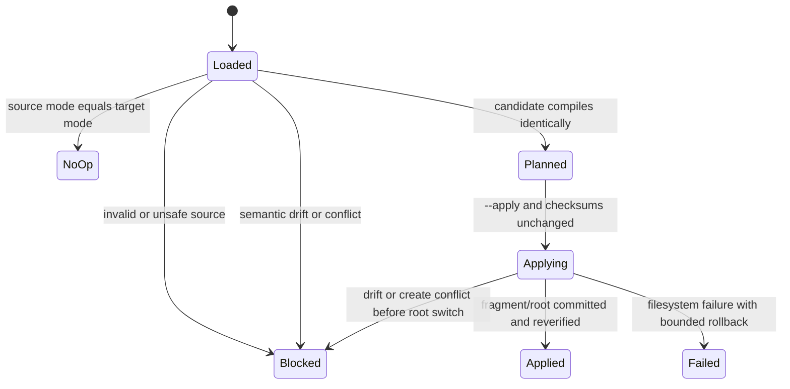
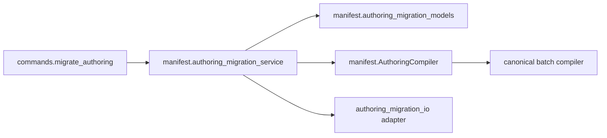

# Feature design: Airflow authoring-mode migration v1

- Status: IMPLEMENTED
- Owner: dpone maintainers
- Approval: maintainer request to complete the frozen Industrial Self-Service
  Airflow roadmap as one goal
- Target release: 1.0.0 standardization program
- Last verified: 2026-07-17

Implementation evidence: [validation report](../test_artifacts/airflow-authoring-mode-migration-v1/validation-report.md).

## Executive summary

dpone supports exactly one editable `classic`, `flow`, or `folder` source per
pipeline, but the documented explicit `dpone migrate authoring` path does not
exist. Users can compile all three modes, yet changing mode still means manually
rewriting YAML and hoping that the canonical semantics did not change.

This slice adds a plan-first, source-to-source migration command. It detects the
current mode, compiles through the existing `AuthoringCompiler`, renders one
target authoring source, compiles that candidate again, and refuses to produce
an applicable plan unless the semantic fingerprints are identical. Apply is
local, credential-free, source-hash guarded, bounded, and atomic at the primary
source boundary. Folder migration may create one deterministic sibling fragment;
that file is created before the root switch and removed if the switch fails.

The command does not generate or edit canonical manifests, DAG specs, packs,
deployments, credentials, registries, domain catalogs, tests, or Airflow Python.
It is an explicit upgrade tool, not a second compiler or reverse generator from
runtime artifacts.

## Personas and customer journey

| Persona | Goal | Current pain | Success signal |
| --- | --- | --- | --- |
| Data engineer | Move a large inline flow to folder authoring | Manual split risks changing runtime semantics | A reviewed plan proves equal semantic fingerprints |
| Existing dpone user | Move classic authoring to the shorter flow form | No supported source-to-source command | One command renders a deterministic diff and another applies it |
| Platform engineer | Standardize repositories before 1.0 | Authoring mode drift is reviewed by hand | JSON plans are stable, bounded and CI-readable |
| Release manager | Prove the migration did not change execution | Source diffs alone are insufficient | Apply receipt records before/after source and semantic identities |

Journey:

1. Run `dpone migrate authoring pipelines/orders_daily --to flow --plan`.
2. Review current/target mode, source checksum, semantic fingerprint, warnings
   and unified diffs.
3. If the plan is applicable, run the same command with `--apply`.
4. The service recompiles the source, rebuilds the candidate, checks semantic
   equality and verifies that source bytes did not change.
5. The primary source is atomically replaced. A folder target additionally
   creates `processes.yaml` beside `pipeline.yaml` before switching authority.
6. Repeating the command for the selected target mode is a deterministic no-op.
7. Existing folder fragments that become unreferenced are retained and listed
   for manual cleanup; user-owned files are never deleted implicitly.
8. Run ordinary `dpone check` and `dpone airflow preview` as the post-migration
   user verification path.

## Scope

### In scope

- New additive `dpone migrate authoring` command.
- Explicit `classic`, `flow`, and `folder` source-to-source targets.
- Auto-detected current mode and optional `--from` assertion.
- Plan and apply output in text and JSON.
- One public `dpone.authoring-migration.v1` plan/receipt schema.
- Exact primary-source SHA-256 and deterministic plan fingerprint.
- Semantic fingerprint equality through the existing compiler.
- Folder target with one sibling `processes.yaml` fragment.
- Safe retention reporting for no-longer-referenced old folder fragments.
- Stable errors, docs, examples, tests and migration guidance.

### Non-goals

- Reverse generation from release-set, pack, DAG spec or canonical artifact.
- Automatic migration of recipe-authored flow sources. Materializing a recipe
  would silently discard its update/provenance contract.
- Deleting old folder fragments, SQL files, tests, domain catalogs or docs.
- Reformat-preserving YAML editing. The reviewed diff is the contract.
- Migrating legacy connection fields; `dpone fix --plan/--apply` already owns
  that concern.
- Migrating pre-batch single manifests; `dpone manifest migrate` remains their
  dedicated path.
- Publishing, building or running a pipeline as part of migration.

### Assumptions and constraints

- The source already compiles under the canonical authoring compiler.
- The primary source and every declared fragment remain inside project root.
- Source files are bounded by the existing authoring YAML limits.
- The target root path remains the same `pipeline.yaml`; authority never exists
  at two root paths.
- `processes.yaml` is the only generated fragment name in v1.
- A conflicting `processes.yaml` blocks the plan unless its bytes are exactly
  the desired bytes.
- Maintainer authorization for the frozen roadmap constitutes approval of this
  bounded implementation slice.

## Public contract

### CLI

```bash
# Read-only default
dpone migrate authoring pipelines/orders_daily --to flow --plan

# Apply only the recomputed, semantically equal plan
dpone migrate authoring pipelines/orders_daily --to folder --apply

# Assert the detected source mode in automation
dpone migrate authoring pipelines/orders_daily \
  --from classic \
  --to flow \
  --plan \
  --format json
```

Contract:

- `target` accepts the same pipeline id/directory/YAML forms as `dpone check`;
- exactly one of `--plan` and `--apply` is required;
- `--to` is required and is `classic|flow|folder`;
- optional `--from` is an assertion, not a parser selector;
- `--format` is `text|json`, default `text`;
- stdout contains only the report; diagnostics go through stable structured
  errors and never include source row values or credentials;
- exit `0`: applicable plan, successful apply, or deterministic no-op;
- exit `1`: source/target validation or semantic equivalence failed;
- exit `2`: invalid CLI/configuration;
- exit `4`: unsafe path, conflict, source drift, or apply safety violation;
- exit `5`: unexpected internal failure.

The command performs no network, database, Vault, Kubernetes, Airflow metadata,
Variable, Connection, cache, release, deployment, or runtime calls.

### Python API

The implementation API is internal in v1 and dependency-injected:

```python
class AuthoringMigrationService:
    def plan(self, request: AuthoringMigrationRequest) -> AuthoringMigrationResult: ...
    def apply(self, request: AuthoringMigrationRequest) -> AuthoringMigrationResult: ...
```

`AuthoringMigrationService` depends on an authoring compiler port and one
filesystem transaction adapter. CLI code only constructs the request, invokes
the service, and renders the result.

### Plan and receipt

```yaml
schema: dpone.authoring-migration.v1
mode: plan
status: ready                 # ready | no_op | blocked | applied
plan_id: sha256:...
source:
  path: pipelines/orders_daily/pipeline.yaml
  mode: classic
  sha256: sha256:...
  semantic_fingerprint: sha256:...
target:
  mode: flow
  semantic_fingerprint: sha256:...
changes:
  - action: modify
    path: pipelines/orders_daily/pipeline.yaml
    before_sha256: sha256:...
    after_sha256: sha256:...
    unified_diff: "..."
retained_files: []
warnings: []
errors: []
```

`plan_id` hashes canonical semantic plan content and excludes execution time,
absolute paths and `mode/status`. Apply returns the same identity plus
`mode: apply`, `status: applied`, and actual post-write checksums.

### Compatibility and migration

- This command is additive and does not alter compilation defaults.
- Existing classic/flow/folder sources remain valid without migration.
- Same-mode requests return `no_op` and write nothing.
- Generated releases/deployments remain immutable; users rebuild after source
  migration through the normal CI path.
- Old folder fragments remain on disk and are explicitly reported. This avoids
  deleting user-owned SQL or documentation accidentally.
- Recipe-authored sources fail with
  `DPONE_AUTHORING_MIGRATION_RECIPE_UNSUPPORTED` and keep their current source.
- Rollback is the normal source-control revert. The command emits no durable
  runtime state.

## Detailed algorithm

### Planning

1. Resolve `target` beneath configured project root and reject path/symlink
   escape.
2. Read bounded YAML bytes once, retain exact SHA-256 and parse as a mapping.
3. Compile with the existing `default_authoring_compiler`; this detects current
   mode and validates all declared dependencies.
4. Validate optional `--from` against the detected mode.
5. Reject recipe sources before rendering.
6. If current mode equals target mode, emit deterministic `no_op`.
7. Render the candidate target from the editable source plus the compiler's
   normalized processes:
   - `classic`: copy canonical batch shape and replace `authoring` with target
     authority;
   - `flow`: keep source-owned top-level metadata/policy fields and add the
     normalized inline process list;
   - `folder`: render the same flow root with `fragments: [processes.yaml]` and
     one `dpone.flow-fragment.v1` sibling containing normalized processes.
8. Validate every candidate path and preflight existing-file conflicts.
9. Compile the candidate through an injected in-memory fragment loader and the
   same batch compiler. SQL dependencies are excluded from this in-memory
   equivalence pass because their exact content was already pinned by the source
   compilation and their root-relative references are preserved.
10. Compare semantic fingerprints. Any mismatch blocks the plan with both safe
    fingerprints and no write.
11. Render canonical YAML bytes, compute before/after SHA-256, unified diffs,
    retained old fragment paths and warnings.
12. Derive `plan_id` from the canonical normalized changes and identities.

### Apply

1. Recompute the complete plan; apply never trusts a caller-supplied diff.
2. Require `ready` or return the same no-op/blocker.
3. Re-read the primary source and every existing file named in the plan.
4. Compare checksums with the plan. Drift returns
   `DPONE_AUTHORING_MIGRATION_SOURCE_CHANGED` before mutation.
5. For a folder target, create `processes.yaml` with create-or-compare semantics:
   - absent: create through a same-directory temporary file, fsync and atomic
     link/rename;
   - identical: no-op;
   - different: conflict, no mutation.
6. Write the root candidate to a same-directory temporary file, flush/fsync,
   recheck source checksum, and atomically replace `pipeline.yaml`.
7. If root replacement fails after a new fragment was created, remove only that
   exact created fragment; never remove a pre-existing identical file.
8. Fsync the parent directory where supported.
9. Re-read and compile the applied source from disk. If post-write semantic
   identity differs, return a safety failure with rollback guidance; never build
   or publish artifacts.
10. Emit the applied receipt only after checksums and semantic equality pass.

### Pseudocode

```text
source = confined_bounded_read(target)
before = compiler.compile(source.payload)
assert optional_from == before.mode
reject recipe source

candidate = renderer.render(before, target_mode)
preflight_paths(candidate.files)
after = compiler.compile(candidate.root, folder_loader=in_memory(candidate))

if before.semantic_fingerprint != after.semantic_fingerprint:
    return blocked(SEMANTIC_DRIFT)

plan = canonical_plan(source, candidate, before, after)
if mode == plan:
    return plan

assert_files_unchanged(plan)
created = create_or_compare(candidate.fragment)
try:
    atomic_replace_if_unchanged(candidate.root)
except:
    rollback_exact_created_fragment(created)
    raise
verify_applied_source_from_disk(plan)
return applied_receipt(plan)
```

### State machine



### Edge cases

- Empty/malformed source: structured validation error; no plan file mutation.
- Duplicate YAML keys/aliases/parser budget: existing bounded compiler policy.
- Missing folder fragment or SQL file: existing compiler error; no migration.
- Same mode: no-op even if YAML formatting differs; no rewrite.
- Existing desired `processes.yaml`: reused without ownership claim.
- Existing different `processes.yaml`: conflict; root remains unchanged.
- Source changes between plan calculation and replace: fail closed.
- Process order: preserved in candidate bytes; semantic identity uses canonical
  compiler behavior.
- Folder to non-folder: old fragments retained and named in receipt.
- Recipe source: blocked; no implicit recipe materialization.
- Unsupported/unknown future authoring mode: blocked, not guessed.
- Process crash before root replace: old root remains authoritative; at worst a
  newly created unreferenced fragment remains and is safe to retry.
- Process crash after atomic root replace: target source is authoritative and
  valid; rerun is a no-op.

## Architecture

### Components and responsibilities

| Component | Existing/new | Responsibility | Dependencies |
| --- | --- | --- | --- |
| `AuthoringCompiler` | Existing | Sole semantic normalization and validation authority | manifest domain |
| `AuthoringMigrationRequest/Result` | New | Immutable command/service values | contracts only |
| `AuthoringModeRenderer` | New | Pure source-to-source candidate rendering | compiler result |
| `InMemoryFolderLoader` | New, private adapter | Candidate equivalence without touching project files | folder loader port |
| `AuthoringMigrationPlanner` | New | Identity, conflict and semantic-equality policy | compiler + renderer |
| `AuthoringMigrationApplier` | New | Confined checksum-guarded filesystem transaction | filesystem only |
| `migrate authoring` command | New | Parse request and render report | service facade |

### Dependency direction



The migration service reuses the existing compiler and folder-loader protocol.
No compiler code imports CLI/readiness code, and no compatibility shim gains
policy.

### Alternatives and tradeoffs

| Alternative | Advantages | Disadvantages | Decision |
| --- | --- | --- | --- |
| Manual documentation only | No code | Cannot prove semantic equivalence; poor self-service | Rejected |
| Generate from release/pack IR | Easy normalized input | Violates authoring authority and loses source intent | Rejected |
| Separate converter per pair | Straightforward locally | Six paths drift and duplicate policy | Rejected |
| One normalized-process renderer plus canonical compiler check | Small, deterministic and DRY | Rewrites YAML formatting | Adopted |
| Delete old folder fragments automatically | Tidy result | Can delete user-owned SQL/docs and breaks rollback | Rejected |
| Write nested `steps/` fragment | Familiar layout | Rewrites relative SQL paths | Rejected for migration v1 |

### ADR requirement

No new ADR. ADR 0006 and ADR 0015 already fix single-source authority and one
compiler for classic/flow/folder. This feature implements their explicit
migration boundary without changing architecture.

### Quality-budget impact

- New modules split contract, pure rendering/planning, filesystem apply and CLI.
- Each module must remain below the repository SLOC hard limit.
- No vendor SDK, Airflow, Vault or Kubernetes import is introduced.
- Existing compiler dependency direction is unchanged.

## Market comparison

Checked 2026-07-17 using official primary documentation.

| System/version | Relevant capability | Observed design | Adopt/reject |
| --- | --- | --- | --- |
| Semantic Versioning 2.0.0 | Public deprecation/migration | Deprecation is documented in a minor release before major removal | Adopt explicit compatibility window and migration docs |
| Astronomer Cosmos current docs | Compatibility/deprecation | Deprecated settings continue to work, emit warnings and have a named replacement/removal major | Adopt explicit replacement and fail no earlier than policy |
| dlt 1.29 | Schema/source upgrade tooling | CLI includes schema conversion/upgrades and source initialization | Adopt one discoverable command; reject downloading/executing code during migration |
| Airbyte current catalog | Connector support taxonomy | Connector support levels are separate from individual connection runtime status | Relevant to route-matrix slice, not source-mode conversion |
| Informatica, Fivetran, Pentaho, SSIS, gusty, Apache Beam | N/A | No directly comparable dpone YAML authoring-mode migration contract was identified | Do not invent parity claims |

Sources: [SemVer 2.0.0](https://semver.org/spec/v2.0.0.html),
[Cosmos compatibility policy](https://astronomer.github.io/astronomer-cosmos/policy/index.html),
[Cosmos watcher migration](https://astronomer.github.io/astronomer-cosmos/guides/run_dbt/airflow-worker/watcher-execution-mode.html),
[dlt CLI](https://dlthub.com/docs/reference/command-line-interface).

## Measurable differentiation

```yaml
axis: semantic safety of authoring-mode migration
scenario: migrate one multi-process pipeline classic -> flow -> folder
baseline: manual YAML rewrite
metric: semantic fingerprint mismatches accepted; user-owned files overwritten
target: 0 mismatches accepted; 0 conflicting files overwritten; repeat apply is no-op
procedure: unit/property tests plus executable CLI fixture for all six directed mode pairs
artifact: test_artifacts/airflow-authoring-mode-migration-v1/validation-report.md
limitations: does not prove live connector execution or human usability
```

## Security, privacy and operations

- Confine every path to project root and reject symlink escape.
- Never inspect or emit secret values; the renderer carries configured
  `connection_ref` and existing non-secret authoring mappings only.
- Bounded YAML and file limits remain those of the canonical compiler.
- Do not accept a serialized plan as write authority; recompute before apply.
- Never delete user-owned files automatically.
- Unified diffs are source configuration and may expose non-secret endpoint
  names already present in Git; redaction of secret-shaped keys remains required.
- No telemetry/network side effects.

## Test and certification plan

| Layer | Scenario | Environment | Expected artifact |
| --- | --- | --- | --- |
| Unit | render classic/flow/folder, fingerprints, IDs | local | pytest |
| Contract | plan/receipt schema and stable errors | local | schema tests |
| Integration | all six directed mode pairs plus no-op | temp filesystem | CLI tests |
| Security | traversal, symlink, conflict, source drift, secret redaction | local | pytest |
| Failure | fragment/root write failure and retry | local fakes | pytest |
| Compatibility | old sources compile unchanged; existing commands unchanged | local | regression tests |
| Live certification | connector execution after migration | N/A | semantic source migration only |

Required negative cases include recipe source, missing fragments, conflicting
fragment, modified source during apply, duplicate YAML key, unsupported mode,
semantic drift injection and root replace failure after fragment creation.

## Documentation plan

- Add `docs/airflow-authoring-migration.md` tutorial/reference/runbook.
- Update authoring, compatibility, CLI reference and frozen backlog.
- Add error catalog entries for migration blockers.
- Generate and publish the new GitOps schema reference.
- Add executable examples for plan, apply and post-migration check/preview.

## Rollout and rollback

- Additive command; no feature flag required.
- Plan is the default conceptual path and apply requires an explicit flag.
- Rollback is source-control revert; runtime/release state is untouched.
- A post-release semantic mismatch, overwrite or path escape is a release
  blocker and requires disabling apply while keeping read-only plan available.

## Agent execution plan

The integrator owns all writes. Fresh reviewer capacity is currently
unavailable and must remain `UNVERIFIED` unless a reviewer actually completes.

## Approval checklist

- [x] User problem and CJM are clear.
- [x] Algorithm and failure semantics are implementable without guessing.
- [x] Public contracts and compatibility are explicit.
- [x] Architecture and alternatives are justified.
- [x] Relevant market research uses current official sources.
- [x] Claimed differentiation is measurable.
- [x] Tests, evidence, docs, rollout, and rollback are complete.
- [x] Path ownership and integration plan are conflict-safe.
- [x] Maintainer authorized autonomous completion of the frozen roadmap.
