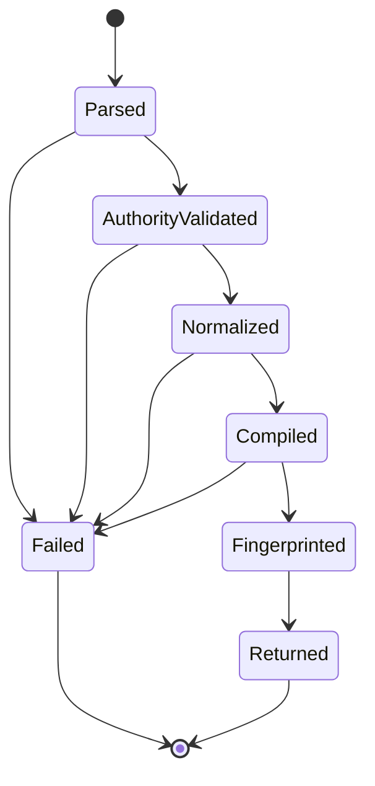
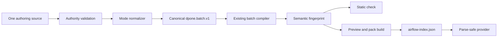

# Feature design: Airflow self-service Authoring v1

- Status: IMPLEMENTED
- Owner: dpone maintainers
- Issue: Industrial Self-Service Airflow roadmap, Phase 2
- Target release: TBD
- Last verified: 2026-07-16

Implementation evidence: commit `30e95886` and the non-live validation recorded
in pull request `#337`. Folder composition remains a separate implemented slice.

## Executive summary

The Phase 1 beginner facade creates a useful Airflow preview, but its scaffolded
`kind: dpone.batch.v1` file uses a `processes` array that the canonical batch
loader does not accept. A newly scaffolded pipeline therefore passes the
lightweight `dpone check` while `dpone manifest list` and the ordinary manifest
loader fail because the canonical `schemas` object is missing. This violates the
single-source and canonical-IR contracts.

Authoring v1 fixes that defect and introduces the approved Phase 2 authoring
boundary. A pipeline has exactly one primary source in one of three modes:

- `classic`: the existing `dpone.batch.v1` grammar;
- `flow`: the short `dpone.flow.v1` grammar;
- `folder`: a `dpone.flow.v1` root that references bounded declarative fragments.

All three modes compile on the build plane into the existing canonical batch
manifest and then use the existing manifest, GitOps, runtime, and Airflow
machinery. No second execution engine, scheduler-side compiler, or editable
generated manifest is introduced.

The first implementation slice delivers the common compiler, valid classic and
flow sources, backward compatibility for the Phase 1 `batch + processes` shape,
semantic fingerprints, and one mode-aware path through `check`, `preview`, and
the canonical manifest loader. Folder composition, external recipes, selectors,
hermetic test execution, DLQ, and step visibility extend the same compiler in
subsequent Phase 2 slices.

## Personas and customer journey

| Persona | Goal | Current pain | Success signal |
|---|---|---|---|
| First-time data engineer | Create one load and see its DAG | Must understand the difference between the facade payload and a real batch manifest | Five-command path produces a source accepted by the canonical loader |
| Experienced dpone user | Keep existing batch manifests | A new DSL could force migration | Existing valid `dpone.batch.v1` files retain byte-level authoring ownership and behavior |
| Platform engineer | Offer guarded reusable recipes | Hard-coded templates cannot be governed independently | Recipes compile to the same canonical semantic model and record version/digest |
| Airflow operator | Parse static artifacts only | Authoring expansion during DAG parsing would add I/O and latency | Provider continues to read only `airflow-index.json`, DAG specs, and packs |
| Maintainer | Add syntax without duplicating policy | Multiple loaders can drift semantically | One compiler owns normalization and semantic identity |

Journey:

1. The user runs `dpone init pipeline` and receives one editable source.
2. `dpone check` resolves the declared mode, validates authority, and compiles in
   memory without network, secrets, or generated-file writes.
3. The output names the source mode, canonical kind, semantic fingerprint, and
   any compatibility warning.
4. `dpone airflow preview` uses exactly that compilation result to build the pack
   and DAG spec.
5. A common configuration error returns `dpone.error.v1` with a safe/manual fix.
6. Re-running preview is content-addressed and deterministic.
7. A future explicit `dpone migrate authoring` command changes modes plan-first;
   reverse generation is never implicit.

## Scope

### In scope

- One mode-aware compiler from classic/flow/folder authoring to canonical batch.
- A valid `dpone.flow.v1` JSON Schema and a short one-workload/multi-process grammar.
- Existing `dpone.batch.v1` as the classic source and canonical execution IR.
- Detection of mismatched/duplicate primary sources.
- Stable source and semantic fingerprints.
- Backward-compatible reading of the shipped Phase 1 `batch + processes` shape
  with one deprecation warning per compilation result.
- Backward-compatible reading of the earlier safe-sample
  `schema: dpone.pipeline.v1` plus `processes` shape.
- Compiler reuse by the manifest router and Airflow self-service facade.
- Deterministic, credential-free compilation and structured failures.
- Phase 2 extension points for folder fragments, selectors, recipes/components,
  hermetic tests, DLQ, and step visibility without changing runtime authority.

### Non-goals

- A second runtime/control plane.
- Python recipe execution in Airflow or during DAG parsing.
- Reverse generation from canonical IR into an authoring source.
- Credential resolution, connector I/O, or live source/sink probes during compile.
- Treating every logical step as an Airflow task.
- Completing external recipe catalogs, DLQ replay, or asset partitions in the
  first compiler slice.

### Assumptions and constraints

- `dpone.batch.v1` remains the canonical manifest IR.
- `connection_ref` is a late-binding logical reference; the Phase 1 safe-sample
  runtime remains the first executable binding path.
- Airflow consumes generated release/deployment artifacts, never authoring YAML.
- Every handwritten production module stays within repository quality budgets.
- The user instruction to implement the frozen roadmap is maintainer approval
  for this compatibility-preserving Phase 2 specification.

## Public contract

### CLI

The five-command path remains unchanged. Authoring selection is an additive
option:

```bash
dpone init pipeline orders_daily \
  --recipe mssql-to-clickhouse-incremental \
  --authoring flow \
  --airflow
```

- `--authoring flow` is the new short form.
- `--authoring classic` emits a valid existing batch manifest.
- Omitted `--authoring` emits `flow`. This preserves the released short
  `processes` structure while correcting its invalid `dpone.batch.v1` kind.
  Existing sources remain readable through the compatibility adapter.
- `folder` is rejected by the first slice with an actionable not-yet-supported
  error until the bounded fragment resolver lands.
- `dpone check --format json` adds `authoring_mode`, `source_kind`,
  `canonical_kind`, `source_fingerprint`, `semantic_fingerprint`, and
  `deprecated_aliases`.
- Existing exit codes remain unchanged: validation errors use `1`, bad CLI use
  uses `2`, live dependency errors use `3`, safety violations use `4`, and
  unexpected failures use `5`.
- Compiler commands do not write canonical manifests. Preview writes only the
  existing generated cache artifacts.

### Python API

The build-plane API is framework-neutral:

```python
from dpone.manifest.authoring import (
    AuthoringCompilation,
    AuthoringCompiler,
    AuthoringCompilationError,
)

result = AuthoringCompiler().compile(payload, source_path=path)
```

`AuthoringCompilation` contains immutable source/canonical mappings, compiled
process mappings, fingerprints, and deprecation codes. It does not contain
runtime connectors, Airflow objects, or secret material.

### Manifest/schema

Short flow example:

```yaml
kind: dpone.flow.v1
authoring:
  mode: flow
  source: pipelines/orders_daily/pipeline.yaml
metadata:
  id: orders_daily
  domain: sales
  tags: [dpone, airflow]
processes:
  - name: orders_daily
    source:
      type: mssql
      connection_ref: mssql_dev
      table: {schema: dbo, name: orders}
    sink:
      type: clickhouse
      connection_ref: clickhouse_dev
      table: {schema: analytics, name: orders}
      strategy: {mode: incremental_merge, unique_key: id}
```

Canonical classic equivalent:

```yaml
kind: dpone.batch.v1
authoring:
  mode: classic
  source: pipelines/orders_daily/pipeline.yaml
metadata:
  id: orders_daily
  domain: sales
  tags: [dpone, airflow]
defaults: {}
schemas:
  dbo:
    tables:
      - table: orders
        id: orders_daily
        overrides:
          name: orders_daily
          source:
            type: mssql
            connection_ref: mssql_dev
            table: {schema: dbo, name: orders}
          sink:
            type: clickhouse
            connection_ref: clickhouse_dev
            table: {schema: analytics, name: orders}
            strategy: {mode: incremental_merge, unique_key: id}
```

The semantic fingerprint is computed from sorted compiled process mappings and
semantic metadata. It excludes `authoring`, source paths, recipe provenance,
timestamps, formatting, comments, and mapping key order. Equivalent classic and
flow sources therefore have the same semantic fingerprint but different source
fingerprints.

### Artifacts and evidence

- No new runtime artifact is introduced by the first slice.
- Release provenance records authoring mode, source fingerprint, semantic
  fingerprint, and compiler version.
- Semantic pipeline identity depends on canonical semantics, not YAML
  formatting. Preview pack/release identity also includes exact source bytes as
  a runtime dependency until canonical manifests are materialized into the
  release, so formatting-only changes may still produce a new preview release.
- Deprecation metadata uses stable code
  `DPONE_LEGACY_SELF_SERVICE_BATCH_PROCESSES` or
  `DPONE_LEGACY_SELF_SERVICE_PIPELINE_V1`, according to the input alias.
- A compilation failure produces `dpone.error.v1`; it never leaves a partial
  release/deployment or advances `current`.

### Compatibility and migration

| Input | Behavior |
|---|---|
| Existing valid classic batch | Compiles unchanged |
| New `dpone.flow.v1` | Compiles to canonical batch |
| Phase 1 `dpone.batch.v1` with `processes` | Accepted through a compatibility adapter and warned |
| Earlier `schema: dpone.pipeline.v1` with `processes` | Accepted through a compatibility adapter and warned |
| Both `processes` and `schemas` | Rejected as ambiguous |
| `authoring.mode` disagrees with kind | Rejected before artifact writes |
| More than one primary source | Rejected before compilation |

The legacy adapter is read-only policy: new scaffolds never emit the old shape.
The canonical batch JSON Schema intentionally rejects compatibility aliases;
schema validation remains the write contract, while the reader adapter provides
the bounded migration window.
Its removal requires at least two minor releases and twelve months, a migration
command, telemetry/evidence, and a changelog notice.

## Detailed algorithm

1. Resolve the requested file under the project root and reject path/symlink
   escape.
2. Parse YAML as one mapping with bounded file size and safe YAML loading.
3. Read `kind`, `authoring.mode`, and `authoring.source`; enforce the authority
   matrix and exact source path.
4. Detect the legacy `batch + processes` and `pipeline.v1 + processes`
   aliases before ordinary batch validation.
5. Normalize flow/legacy processes into a generated in-memory batch mapping.
6. Apply existing conventions and registries only through the canonical batch
   compiler.
7. Compile every process and validate unique names/selectors and connector-neutral
   structural fields.
8. Canonicalize compiled process mappings and compute the semantic fingerprint.
9. Return an immutable compilation result. Consumers reuse this object for
   static check, preview, pack build, and diagnostics.
10. If any step fails, return one structured error and write no generated state.

### Pseudocode

```text
compile(payload, source_path):
    authority = validate_authority(payload, source_path)
    source_fingerprint = hash(raw semantic YAML mapping)

    if kind == batch and has schemas and not processes:
        canonical = payload
    else if kind == flow and mode == flow:
        canonical = flow_to_batch(payload)
    else if kind == batch and has processes and not schemas:
        canonical = flow_to_batch(payload with legacy marker)
        warnings += DPONE_LEGACY_SELF_SERVICE_BATCH_PROCESSES
    else if schema == pipeline.v1 and has processes:
        canonical = flow_to_batch(payload with legacy marker)
        warnings += DPONE_LEGACY_SELF_SERVICE_PIPELINE_V1
    else:
        fail closed

    compiled = existing_batch_compiler(canonical)
    semantic_payload = {
        metadata: semantic_metadata(canonical.metadata),
        processes: sort(compiled.raw_config by stable process identity),
    }
    return immutable result with fingerprints and warnings
```

### State machine



Compilation is pure with respect to repository state. Retries are deterministic;
there is no checkpoint, rollback journal, or concurrent mutation. Preview keeps
its existing content-addressed create-or-compare transaction and promotes only
after all artifacts validate.

### Edge cases

- Empty YAML, non-mapping YAML, empty processes/schemas: fail closed.
- Missing/null source or sink: fail before pack build.
- Duplicate process names or selectors: fail before artifact writes.
- Same semantics with reordered mappings: same semantic fingerprint.
- Source formatting/comment change: parsed source and semantic fingerprints do
  not change, while the exact source-file checksum used for runtime dependency
  pinning does change.
- Unsupported kind/mode or folder before its slice: actionable structured error.
- Template cycle or unresolved required value: existing compiler error is
  wrapped without leaking environment or credentials.
- Process crash: no authoring output is written; preview temp/generated behavior
  remains content-addressed and restart-safe.
- Schema drift and live connector capability are runtime concerns and do not
  weaken compile-time validation.

## Architecture

### Components and responsibilities

| Component | Existing/new | Responsibility | Dependencies |
|---|---|---|---|
| `AuthoringCompiler` | New | Validate authority, normalize modes, compute semantic result | contracts, batch compiler |
| `AuthoringCompilation` | New | Immutable compiler result | standard library |
| `ManifestLoaderRouter` | Existing, extended | Route classic/flow to the same compiler/loader | manifest layer only |
| Airflow self-service facade | Existing, adapted | Render structured errors and build previews from compilation | authoring compiler, readiness services |
| Folder resolver | Later Phase 2 | Bounded fragment discovery under one root | filesystem port, authoring compiler |
| Recipe resolver | Later Phase 2 | Resolve pinned declarative recipe/profile/component data | trusted build-plane registry port |

### Ports, adapters, and composition root

The compiler accepts mappings and paths; filesystem reading remains in loader or
readiness adapters. It does not own a vendor SDK or runtime connector. CLI
composition constructs the compiler and injects it into the self-service
service. Airflow provider code does not import the compiler.

Dependency direction:

```text
commands -> readiness/application -> manifest authoring compiler
                                  -> contracts
manifest authoring compiler -> existing batch compiler -> dag config parser
Airflow provider -> generated index/spec/pack only
```

`LoadedManifest.kind` is the canonical process kind. `source_kind` preserves
the authoring/compatibility origin for CLI display and diagnostics, and
`deprecated_aliases` carries stable migration markers. Downstream runtime code
therefore never branches on a legacy authoring kind.

### Data and control flow



### Alternatives and tradeoffs

| Alternative | Advantages | Disadvantages | Decision |
|---|---|---|---|
| Keep separate readiness parser | Small local change | Repeats semantics and preserves false-success bug | Rejected |
| Make flow a second runtime IR | Direct execution | Duplicates validation, runtime, migrations, and evidence | Rejected |
| Generate editable batch YAML beside flow | Easy inspection | Two sources of truth and drift | Rejected |
| Normalize all modes in memory to batch | Reuses mature control/runtime plane and preserves authority | Requires explicit source maps and migration metadata | Adopted |

### ADR requirement

Required. ADR 0015 freezes the one-compiler boundary, semantic identity, and
legacy adapter lifetime.

### Quality-budget impact

New production modules are split by invariant: models/fingerprints and
normalization/loading. No module may exceed the checked-in SLOC budget. The
manifest layer may import contracts but not readiness, commands, Airflow, or
runtime. Existing large self-service modules receive delegation calls only; no
new authoring policy is added to them.

## Market comparison

Checked 2026-07-16 against current official primary documentation.

| System/version | Relevant capability | Observed design | Strength | Limitation | Adopt/reject | Source/date |
|---|---|---|---|---|---|---|
| dlt 1.29 docs | Declarative REST source plus separate credentials/config | Declarative resource config is converted into dlt source/resources; credentials are separate | Fast first pipeline and secure config separation | Python remains the primary composition surface; not an Airflow static-artifact contract | Adopt short declarative input and secret separation; reject runtime code generation | [dlt REST API source](https://dlthub.com/docs/dlt-ecosystem/verified-sources/rest_api/basic), 2026-07-16 |
| Airbyte current/PyAirbyte | Declarative YAML connector manifest | A YAML source manifest can be loaded as a dictionary, local path, or URL and is validated before execution | Strong low-code connector authoring and reusable component model | Connector manifest is a connector runtime contract, not a workload/DAG/release split | Adopt schema-driven declarative components; reject conflating connector and orchestration identity | [PyAirbyte sources API](https://airbytehq.github.io/PyAirbyte/airbyte/sources.html), 2026-07-16 |
| Astronomer Cosmos 1.13+ docs | Project-to-DAG translation and selectors | Parses dbt project/manifest into DAG/TaskGroup and supports select/exclude/YAML selectors | Familiar graph selection and multiple Airflow integration levels | Some parse modes can run dbt parsing/caching logic during DAG construction | Adopt selector UX and DAG/TaskGroup escape hatches; retain dpone prebuilt bounded index | [Cosmos selecting/excluding](https://astronomer.github.io/astronomer-cosmos/guides/translate_dbt_to_airflow/selecting-excluding.html), [How Cosmos works](https://astronomer.github.io/astronomer-cosmos/getting_started/how-cosmos-works.html), 2026-07-16 |
| Informatica | N/A | Managed visual integration platform is not the narrow authoring-to-static-Airflow compiler layer | N/A | Comparison would mix managed platform governance with a library contract | N/A |
| Fivetran | N/A | Managed connectors do not expose the relevant portable authoring compiler | N/A | Irrelevant layer | N/A |
| Pentaho | N/A | Visual job/transformation authoring is not the target static Airflow provider contract | N/A | Irrelevant layer | N/A |
| Microsoft SSIS | N/A | Package designer/runtime does not implement this authoring/canonical-Airflow split | N/A | Irrelevant layer | N/A |
| gusty | N/A for adopted design | YAML DAG generation is relevant historically, but dpone already freezes a generated-artifact/provider boundary | Simple DAG authoring | Direct DAG authoring would couple ETL source and scheduler model | Reject as authority model |
| Apache Beam | N/A | Programming model/runtime portability, not low-code Airflow authoring | N/A | Irrelevant layer | N/A |

## Measurable differentiation

```yaml
axis: semantic equivalence across authoring modes
scenario: one MSSQL-to-ClickHouse workload represented as classic and flow YAML
baseline: current Phase 1 self-service scaffold fails the canonical batch loader
metric: canonical loader success and semantic fingerprint equality
target: 100% loader success; identical semantic fingerprints; zero network/secret calls
procedure: compile both fixtures twice, compare fingerprints, then run check and preview
artifact: test_artifacts/airflow-authoring-v1/validation-report.md
limitations: does not prove live connector execution or production usability
```

## Security, privacy, and operations

- Safe YAML parsing only; aliases/nesting/file sizes receive bounded tests.
- Folder and recipe paths must remain under their configured roots with symlink
  escape protection.
- No secret value, Vault path, connection registry body, Airflow Connection, or
  environment value enters the semantic fingerprint or compilation error.
- Recipe plugins are not part of the first slice. Later Python plugins require a
  trusted allowlist, digest pin, sandbox, no production secrets, and no network
  by default.
- Compiler latency and failure code counters are local/OTel-ready events; no
  exporter is required for correctness.

## Test and certification plan

| Layer | Scenario | Environment | Expected artifact |
|---|---|---|---|
| Unit | flow/classic/legacy normalization, authority errors, deterministic fingerprint | local | pytest report |
| Contract | flow schema and structured error payload | local CI | schema validation report |
| Integration | init -> check -> preview -> canonical loader for classic and flow | local hermetic | validation report |
| Performance | 100 pipelines compile within existing parse/build budgets | CI runner | benchmark JSON |
| Security | traversal, symlink escape, YAML abuse, secret-shaped values in errors | local CI | security test report |
| Compatibility | released Phase 1 fixture still compiles with warning | local CI | compatibility fixture result |
| Live certification | N/A for pure authoring compiler | N/A | Explicit N/A rationale |

Required negatives include ambiguous `processes + schemas`, kind/mode mismatch,
duplicate process identity, empty input, malformed YAML, source-path mismatch,
folder escape, and compiler exception redaction.

## Documentation plan

- Update First DAG tutorial with classic/flow choice only when the flow slice is
  implemented.
- Add Authoring modes conceptual guide and generated flow schema reference.
- Add migration guide for `batch + processes` and future explicit mode migration.
- Keep platform/Vault/runbook material out of the beginner tutorial.
- Add one living readiness/evidence register separating architecture approval,
  implementation, verification, and shipped version.

## Rollout and rollback

1. Land compiler and compatibility fixtures with `flow` as the truthful kind
   for the already released short `processes` structure.
2. Record deprecation warning counts without source contents.
3. Run at least five first-time-user studies before changing the short grammar
   or adding another beginner-visible step.
4. Rollback disables flow scaffolding while retaining read compatibility; classic
   batch and generated artifacts remain valid.
5. Removal of the legacy alias is a separate deprecation decision.

## Agent execution plan

| Agent/role | Owned paths | Read-only paths | Forbidden paths | Dependency |
|---|---|---|---|---|
| Explorer | existing manifest/readiness/tests | all | all writes | none |
| Architect | spec/ADR review | docs and contracts | all writes | explorer |
| Integrator | manifest compiler, facade integration, shared schemas/docs | entire repo | user `.cursor/` | approved spec |
| Test certifier | tests and evidence review | implementation | production code writes | implementation |
| Docs/UX reviewer | tutorial/reference/CJM review | docs and CLI output | production code writes | implementation |

The current Codex task is the integrator and shared-file owner.

## Approval checklist

- [x] User problem and CJM are clear.
- [x] Algorithm and failure semantics are implementable without guessing.
- [x] Public contracts and compatibility are explicit.
- [x] Architecture and alternatives are justified.
- [x] Relevant market research uses current official sources.
- [x] Claimed differentiation is measurable.
- [x] Tests, evidence, docs, rollout, and rollback are complete.
- [x] Path ownership and integration plan are conflict-safe.
- [x] Maintainer authorized implementation through the frozen-roadmap goal.
