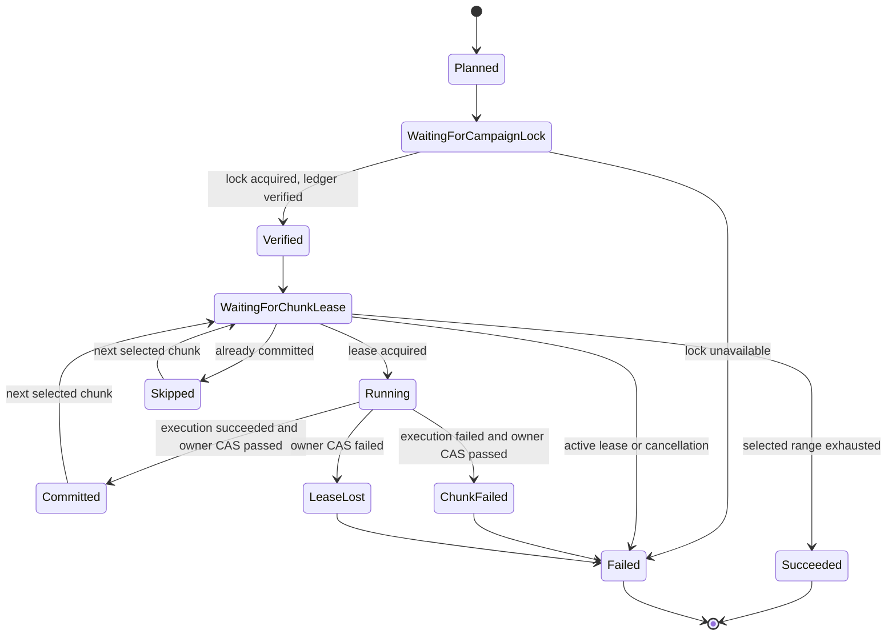
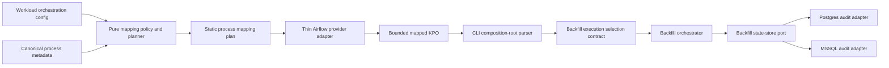

# Feature design: bounded Airflow backfill mapping v1

- Status: IMPLEMENTED
- Owner: dpone maintainers
- Approval: maintainer request to implement the frozen Industrial Self-Service
  Airflow roadmap as one goal
- Target release: 0.73.0
- Last verified: 2026-07-17
- Validation evidence:
  `test_artifacts/airflow-bounded-dynamic-mapping-v1/validation-report.md`

## Executive summary

dpone already executes large historical loads through a deterministic chunk
planner, durable campaign ledger, leases, retries, resume and evidence. Airflow
currently sees the whole campaign as one task. That is the safest default, but
operators sometimes need a bounded number of chunk-level task instances in the
Grid view so they can inspect and retry a failed part without hiding dpone's
state model behind an unbounded scheduler expansion.

This slice adds three explicit workload mapping modes:

- `internal`: one Airflow task; dpone owns chunk concurrency exactly as today;
- `visible`: one mapped Airflow task per deterministic chunk;
- `summary`: one mapped Airflow task per deterministic contiguous chunk batch.

`visible` and `summary` are opt-in. They consume a static, fingerprinted mapping
plan compiled into the workload pack. They never discover work from a source,
state store, XCom, Variable or Connection during DAG parsing. Airflow limits the
number of concurrent task instances; the dpone ledger remains the authority for
commit, retry, resume, cancellation and duplicate prevention.

Success means users can choose bounded Airflow visibility without creating two
independent backfill state machines or exposing an unbounded number of task
instances.

## Personas and customer journey

| Persona | Goal | Current pain | Success signal |
| --- | --- | --- | --- |
| Data engineer | See which historical slice failed | One campaign task hides chunk-level Airflow logs | Each bounded item has its own task attempt and stable range |
| Airflow operator | Protect scheduler and worker capacity | Naive mapping can exceed metadata and executor budgets | Hard task-count, concurrency and pool limits are visible before publish |
| Data architect | Preserve replay correctness | Airflow task state could become a second ledger | dpone's campaign ledger and chunk leases remain authoritative |
| Platform engineer | Offer a safe self-service toggle | Every team would otherwise hand-write `.expand()` code | One declarative policy produces the same provider behavior |

Journey:

1. The beginner path remains unchanged and produces `mode: internal`.
2. An advanced user or platform profile declares `airflow.mapping.mode` in the
   workload catalog or manifest-local `gitops` projection.
3. `dpone check`, pack build and `airflow preview` compile the same deterministic
   chunk and mapping plan.
4. Invalid limits, unsupported state capabilities or task explosion block
   publication before Airflow sees the deployment.
5. The parse-safe provider reads only the verified pack and creates one static
   mapped operator for `visible` or `summary`.
6. Every mapped task receives one bounded execution item and re-derives the
   chunk plan inside the runtime pod before source I/O.
7. The runtime initializes or verifies the shared ledger under a short campaign
   lock, then executes only its selected range using per-chunk leases.
8. A failed item can be retried safely. Already committed chunks are skipped by
   the dpone ledger, not inferred from Airflow task state.
9. Evidence correlates the item with the immutable mapping plan and campaign.
10. Returning to `internal` is a configuration-only rollback; the same ledger
    can resume because chunk identities do not change.

## Scope

### In scope

- Declarative `internal`, `visible` and `summary` policies.
- A pure build-time mapping planner over the existing backfill chunk planner.
- Static `dpone.airflow-mapping-plan.v1` in each applicable process plan.
- Bounded `dpone.airflow-mapping-item.v1` passed to one mapped KPO instance.
- Hard limits for task count, task concurrency and Airflow pool assignment.
- Provider `.partial(...).expand(env_vars=...)` materialization.
- Runtime plan-fingerprint verification before connector or source I/O.
- Short campaign initialization lock plus distributed per-chunk lease updates.
- Compare-and-set completion so an expired attempt cannot overwrite a new owner.
- SQL audit-state reads that merge the latest record for every chunk.
- Postgres and MSSQL distributed state capability for mapped execution.
- Bounded mapping context in runtime result, XCom and evidence.
- Exact Airflow 2.10, 2.11, 3.2 and 3.3 compatibility tests.

### Non-goals

- Making dynamic mapping the default.
- Replacing the dpone campaign ledger with Airflow task-instance state.
- Runtime discovery of chunks from source rows, object listings or XCom.
- Reading Airflow configuration during DAG parse to discover `max_map_length`.
- Mapping arbitrary non-backfill workloads in v1.
- More than one active process per mapped task.
- Nested mapping, mapped task groups or mapping pre/post hooks.
- Dynamic changes to a campaign window after release publication.
- Distributed mapping on local-file or ClickHouse audit state in v1.
- Increasing `backfill.parallel_workers` inside each mapped item.
- A new beginner CLI command.

### Assumptions and constraints

- The current Airflow default `core.max_map_length` is 1024. dpone's hard v1
  ceiling is 200 so the feature remains below that default without parse-time
  configuration access.
- Airflow's `max_active_tis_per_dag` applies across active DAG runs. dpone exposes
  this conservative, version-compatible limit as `max_active`.
- A static list passed to `.expand()` still creates mapped task instances at
  scheduling time; it does not require an upstream discovery task.
- A zero-length backfill plan is invalid under the existing planner. dpone never
  relies on Airflow's automatic zero-length-map skip semantics.
- `visible` and `summary` require `backfill.parallel_workers: 1`; otherwise total
  concurrency would multiply unexpectedly.
- Mapped execution requires a state store reporting both distributed campaign
  locking and distributed chunk-lease compare-and-set capability.
- Postgres advisory locks and MSSQL application locks are the first supported
  implementations. ClickHouse audit tables remain a durable mirror but do not
  provide a certified lock/CAS contract.
- Hooks remain ordinary static tasks. The mapped runtime uses inline outcome
  validation because a single downstream gate cannot safely evaluate each map
  index across all supported Airflow versions.

## Public contract

### Authoring

The policy belongs to orchestration configuration, not to the ETL strategy:

```yaml
workloads:
  orders_history:
    manifest: ../../pipelines/orders_history.yaml
    airflow:
      mapping:
        mode: visible
        max_items: 120
        max_active: 12
        pool: dpone_backfill
```

The equivalent manifest-local escape hatch is:

```yaml
gitops:
  airflow:
    mapping:
      mode: summary
      max_items: 40
      max_active: 8
      pool: dpone_backfill
```

Normalized defaults:

```yaml
airflow:
  mapping:
    mode: internal
    max_items: 200
    max_active: 16
    pool: dpone_backfill
```

Validation rules:

| Field | Contract |
| --- | --- |
| `mode` | `internal`, `visible` or `summary`; default `internal` |
| `max_items` | integer `1..200`; maximum mapped task instances |
| `max_active` | integer `1..64` and `<= max_items` |
| `pool` | required non-empty Airflow identifier for `visible`/`summary` |

For `internal`, mapping limits are normalized for explanation but do not alter
the current backfill runtime. For `visible` and `summary`, the selected process
must use `sink.strategy.mode: backfill`, have a `backfill.chunk` declaration,
set `backfill.parallel_workers: 1`, and use a certified distributed state
backend. Build and static check fail closed otherwise.

### Mapping plan artifact

Each process plan contains either an `internal` declaration or a complete static
mapping plan:

```yaml
schema: dpone.airflow-mapping-plan.v1
mode: summary
plan_fingerprint: sha256:...
backfill_plan_hash: sha256:...
chunks_total: 365
items_total: 40
limits:
  max_items: 40
  max_active: 8
  pool: dpone_backfill
items:
  - item_index: 0
    first_chunk_index: 1
    last_chunk_index: 10
    chunks_count: 10
  - item_index: 1
    first_chunk_index: 11
    last_chunk_index: 20
    chunks_count: 10
```

Properties:

- chunk indexes are one-based and contiguous;
- item indexes are zero-based and contiguous;
- every chunk appears exactly once;
- items are ordered and non-overlapping;
- the plan contains no predicate SQL, connection data or row values;
- `plan_fingerprint` uses canonical JSON and excludes itself;
- `backfill_plan_hash` is the existing deterministic chunk-plan hash;
- the entire plan is bounded by the pack and mapping-specific size limits.

`visible` emits one item per chunk and blocks when `chunks_total > max_items`.
`summary` emits `min(chunks_total, max_items)` contiguous, balanced items. Given
`q, r = divmod(chunks_total, items_total)`, the first `r` items contain `q + 1`
chunks and the remaining items contain `q` chunks.

### Runtime mapping item

The provider serializes one item into `DPONE_AIRFLOW_MAPPING_ITEM`:

```yaml
schema: dpone.airflow-mapping-item.v1
mode: summary
mapping_plan_fingerprint: sha256:...
backfill_plan_hash: sha256:...
item_index: 1
first_chunk_index: 11
last_chunk_index: 20
chunks_count: 10
```

The canonical JSON value is limited to 8 KiB. It is an execution scope, not an
artifact identity or authorization token. It remains separate from
`dpone.airflow-run-identity.v1`, whose release/deployment/pack identity is shared
by every mapped item.

### Provider behavior

Existing public imports and signatures remain unchanged:

```python
from airflow.providers.dpone import DponeDag, DponeTaskGroup, load_dpone_dags
```

For `internal`, the provider constructs the current concrete KPO and optional
outcome gate unchanged. For `visible` or `summary`, it constructs:

```python
MappedRuntimeOperator.partial(
    # existing verified static KPO arguments
    pool=plan.limits.pool,
    max_active_tis_per_dag=plan.limits.max_active,
    inline_outcome_required_status="passed",
).expand(
    env_vars=[base_env_plus(item) for item in plan.items],
)
```

`pool`, task ID, pod spec, image, run identity, credentials projection and other
contract-owned fields are static. Only the complete `env_vars` mapping varies.
The provider rejects an unsupported Airflow mapping API instead of silently
falling back to one task.

The provider performs no network, metadata DB, Variable, Connection, Vault,
Kubernetes or state-store I/O during parse. It does not read Airflow's runtime
configuration. Pack validation proves the item count is at most 200.

### Runtime result and XCom

The backfill result adds a bounded mapping section:

```yaml
backfill:
  mapping:
    mode: summary
    plan_fingerprint: sha256:...
    backfill_plan_hash: sha256:...
    item_index: 1
    first_chunk_index: 11
    last_chunk_index: 20
    chunks_count: 10
    item_status: success
```

XCom includes this section but continues to omit the per-chunk ledger. The full
runtime evidence may include the existing bounded campaign chunk records.
Mapping success never overrides execution or data outcome status.

### Error codes

| Code | Meaning |
| --- | --- |
| `DPONE_AIRFLOW_MAPPING_POLICY_INVALID` | mode or limit is malformed |
| `DPONE_AIRFLOW_MAPPING_REQUIRES_CHUNKED_BACKFILL` | selected process is not a chunked backfill |
| `DPONE_AIRFLOW_MAPPING_TASK_LIMIT_EXCEEDED` | visible item count exceeds `max_items` |
| `DPONE_AIRFLOW_MAPPING_POOL_REQUIRED` | visible/summary has no pool |
| `DPONE_AIRFLOW_MAPPING_PARALLELISM_MULTIPLIER` | internal `parallel_workers` is not one |
| `DPONE_AIRFLOW_MAPPING_STATE_UNSUPPORTED` | state backend lacks distributed lock/CAS |
| `DPONE_AIRFLOW_MAPPING_PLAN_MISMATCH` | runtime re-plan differs from the pack |
| `DPONE_AIRFLOW_MAPPING_ITEM_INVALID` | item JSON or range is invalid |
| `DPONE_AIRFLOW_MAPPING_CAMPAIGN_BUSY` | short campaign initialization lock is unavailable |
| `DPONE_BACKFILL_CHUNK_LEASE_LOST` | an expired attempt no longer owns completion |
| `DPONE_AIRFLOW_MAPPING_UNSUPPORTED` | installed Airflow/provider cannot materialize the mapped operator |

These become structured build/check/runtime errors through the existing
`dpone.error.v1` surfaces. No error includes predicates, row values, credentials
or connection registry bodies.

### Compatibility and rollback

- Absence of `airflow.mapping` means `internal`; old packs and manifests behave
  exactly as before.
- Existing chunk, run-key and idempotency-key algorithms are unchanged.
- Changing only mapping mode does not create a new backfill campaign, although
  it changes the workload pack and release identity.
- A rollback to `internal` can resume the same campaign ledger.
- Older providers that do not understand a non-internal mapping plan must fail
  pack compatibility checks; they must not run the whole campaign accidentally.
- A mapped pack therefore stores its operator projection as
  `mapped_kpo_kwargs`. The current provider validates the mapping plan before
  normalizing that field to its internal `kpo_kwargs` representation. An older
  provider fails its existing required-`kpo_kwargs` check before task creation.
- The feature is supported on the exact Airflow matrix only after provider wheel
  smoke and materialization tests pass for every declared pair.

## Detailed algorithm

### Build-time planning

```text
for each compiled process in a workload:
    policy = normalize(workload.airflow.mapping or internal defaults)

    if policy.mode == internal:
        attach internal declaration
        continue

    load_config = process.config.load_config
    require load_strategy == backfill
    backfill = load_config.options.backfill
    require backfill.chunk exists
    require parallel_workers(backfill) == 1
    require state.backend == audit_schema
    require state.require_distributed_lock == true

    dataset = target_schema + "." + target_table
    spec = chunk_spec_from_options(backfill)
    inner_mode = inner_mode_from_options(backfill)
    run_key = explicit backfill_id or backfill_run_key(dataset, spec, inner_mode)
    chunks = plan_chunks(spec, run_key)
    reject multi-chunk full_refresh
    chunk_plan_hash = plan_hash(chunks)

    if mode == visible:
        require len(chunks) <= max_items
        ranges = [(i, i) for every chunk index i]
    else:
        item_count = min(len(chunks), max_items)
        ranges = balanced contiguous ranges(item_count)

    verify ranges cover 1..len(chunks) exactly once
    build canonical mapping payload
    fingerprint payload without plan_fingerprint
    attach plan to process plan and pack fingerprint input
```

Planning uses metadata-only manifest loading and existing pure backfill
functions. It performs no connector, state, secret or network I/O.

### Provider materialization

```text
materialize selected process plan
validate mapping plan schema, fingerprint, ordering and bounds

if mode == internal:
    build current runtime operator
else:
    base_kwargs = existing KPO kwargs + run identity + partition context
    base_env = normalized base_kwargs.env_vars
    mapped_envs = []
    for item in mapping_plan.items:
        item_json = canonical bounded serialization(item + plan identities)
        mapped_envs.append(base_env with DPONE_AIRFLOW_MAPPING_ITEM=item_json)

    remove env_vars from static kwargs
    set static pool and max_active_tis_per_dag
    force inline outcome evaluation
    runtime = operator_class.partial(dag=dag, **static_kwargs).expand(env_vars=mapped_envs)
```

Pre-hooks stay upstream of the mapped operator. A separate outcome gate is not
created. Every mapped KPO validates its own XCom status, including deferrable
completion behavior.

### Runtime input and plan verification

1. `dpone run` reads `DPONE_AIRFLOW_MAPPING_ITEM` at the CLI composition root.
2. Missing input means ordinary internal execution.
3. Present input is parsed before manifest hydration or connector construction;
   malformed, oversized or secret-like fields fail closed.
4. The parsed `BackfillExecutionSelection` is injected through `RunContext` into
   the process runner and backfill orchestrator.
5. The orchestrator validates that the process is still a chunked backfill,
   re-computes `run_key`, chunks and `backfill_plan_hash`, and compares the hash.
6. It validates item bounds and derives the exact contiguous chunk tuple. SQL
   predicates come only from the re-derived canonical chunks, never from env.
7. Any mismatch fails before source extraction or target mutation.

### Shared ledger initialization

```text
require store capabilities:
    distributed_lock == true
    distributed_chunk_lease == true
    compare_and_set_completion == true

owner = unique runtime attempt token
try acquire campaign lock(run_key, owner):
    if unavailable: fail DPONE_AIRFLOW_MAPPING_CAMPAIGN_BUSY
    load SQL campaign snapshot and merge latest SQL record for every chunk
    if absent: create deterministic ledger
    else: verify plan_hash, config_hash and chunk count
    recover stale running records
finally:
    release campaign lock immediately
```

The campaign lock protects initialization and ledger-shape verification only.
It is never held while data moves.

### Selected chunk execution

```text
ledger = shared store load with latest per-chunk merge
selected = item range minus chunks already committed under retry policy

for chunk in selected, sequentially:
    owner = unique attempt token
    acquire distributed per-chunk lock
    reload latest chunk record
    if committed: release lock and skip
    if active unexpired lease: release lock and fail item
    write running lease(owner, expiry, attempt + 1)
    release per-chunk lock

    execute one normal dpone ETL run for canonical chunk predicate

    acquire distributed per-chunk lock
    reload latest chunk record
    compare lease_owner == owner
    if mismatch: do not write completion; fail DPONE_BACKFILL_CHUNK_LEASE_LOST
    write success/failure and clear lease
    release per-chunk lock
```

`summary` executes its chunks sequentially in v1. This keeps effective
concurrency at or below `max_active`. A later contract may add an explicit
per-item worker budget, but `parallel_workers` is not multiplied implicitly.

### SQL source-of-truth merge

The audit store writes an immutable/latest-wins campaign snapshot and a row for
each chunk transition. A load operation:

1. reads the latest campaign snapshot by `run_key`;
2. reads chunk records ordered by storage timestamp descending;
3. keeps the first record for every chunk index;
4. validates idempotency key and boundaries against the campaign shape;
5. replaces campaign chunk entries with those latest records;
6. returns the merged ledger and optionally refreshes only the local cache.

The local cache never overrides newer SQL state in mapped mode. Concurrent
updates to different chunks cannot erase each other because every load merges
the chunk table after the campaign snapshot.

### Result, retry, cancellation and finalization

- Item success means every chunk in that item's range is committed or was
  already committed. Other campaign ranges may still be pending.
- Campaign completion means every ledger chunk is committed.
- A failed mapped task retry receives the same static range and uses the ledger
  to skip committed chunks.
- Airflow clearing one mapped task does not reset ledger state.
- Cancellation is read before every lease acquisition. An item stops without
  beginning a new chunk after cancellation.
- A process crash leaves a running lease. Existing stale recovery makes it
  retryable after expiry.
- A stale process that finishes after losing ownership cannot overwrite the new
  attempt because completion is compare-and-set.
- Verification export occurs only when the merged campaign is complete. Multiple
  contenders produce equivalent content; atomic artifact writing remains the
  final local guard.
- An empty selected range caused only by resume is a successful no-op item with
  explicit `chunks_skipped_resume` evidence.

## State machine



## Architecture and dependency direction



Responsibilities:

| Component | Responsibility |
| --- | --- |
| `dpone.backfill.mapping` | Pure policy, mapping plan/items, canonical validation and fingerprint |
| compact process planner | Adapt process metadata and workload policy into the pure planner |
| provider mapping adapter | Convert a verified plan into one Airflow mapped operator |
| CLI context parser | Read and validate the provider-owned env value before runtime hydration |
| backfill orchestrator | Re-plan, select, execute and aggregate only the injected range |
| state-store port | Load/initialize, lease and owner-CAS semantics |
| SQL audit adapters | Dialect SQL and external lock implementation |

The core mapping module imports no Airflow, CLI, connector SDK or filesystem
adapter. The provider does not own chunk planning or ledger policy. The runtime
does not import the provider package.

### ADR requirement

ADR 0019 records that Airflow mapping is a bounded projection over the dpone
ledger, not a second execution authority, and that mapped data execution uses
per-chunk lease/CAS after a short campaign initialization lock.

### Alternatives rejected

- One Airflow task per chunk by default: metadata and UI growth, duplicated
  state and an unsafe change to existing behavior.
- Mapping over an upstream task's XCom output: moves planning to runtime,
  increases failure states and makes the release topology less reproducible.
- Holding the campaign lock for every mapped task: serializes all tasks and
  causes lock contention without providing visibility value.
- Trusting Airflow retries instead of the ledger: loses connector-neutral resume
  and cannot prove committed data after task clearing.
- Passing chunk predicates through env: creates an injection surface and a
  second planner.
- Allowing local-file state across pods: process locks and local caches do not
  provide distributed correctness.
- Supporting ClickHouse audit state immediately: latest-wins tables alone do not
  provide the required lock/CAS primitive.
- Mapping hooks and runtime together as a task group: adds nested mapping and
  cross-version complexity without v1 user value.

## Security, privacy and abuse cases

- Mapping item schemas reject unknown fields and strings beyond bounded lengths.
- The provider owns `DPONE_AIRFLOW_MAPPING_ITEM`; operator overrides cannot
  replace it.
- Runtime never executes predicates supplied by the item.
- Pack/item fingerprints detect tampering and semantic drift.
- Item and XCom payloads contain only indexes, counts and fingerprints.
- Pool and task limits prevent user-controlled task explosion.
- `max_items` cannot exceed 200 even if Airflow is configured above 1024.
- Mapped mode fails closed on unshared state or uncertified locking.
- SQL identifiers remain adapter-owned and values remain parameterized/escaped
  under the existing connector contract.
- Lease errors redact row and credential data.
- No state or credential access occurs during parse.

Required negative tests include malformed item JSON, unknown item fields,
oversized env, plan mismatch, task-count overflow, empty pool, `max_active`
overflow, local/ClickHouse state, parallelism multiplication, duplicate range,
range gap, stale owner completion, corrupt SQL chunk record, one failed map item,
and attempts to override the provider-owned env value.

## Market research

Checked 2026-07-17 against official primary documentation.

| System | Capability and observed design | Adopt | Reject / limitation for this slice |
| --- | --- | --- | --- |
| Apache Airflow 3.2 documentation | Dynamic task mapping creates task instances at runtime; `max_map_length` defaults to 1024 and `max_active_tis_per_dag` limits concurrent copies across DAG runs. [Source](https://airflow.apache.org/docs/apache-airflow/stable/authoring-and-scheduling/dynamic-task-mapping.html) | Native `.partial().expand()` and explicit concurrency control | Unbounded runtime lists and Airflow task state as a data-commit ledger |
| Astronomer Cosmos current docs | Per-node tasks improve visibility and control, while newer watcher execution centralizes work to reduce per-task overhead. [Source](https://astronomer.github.io/astronomer-cosmos/guides/run_dbt/index.html) | Explicit visibility/overhead trade-off through modes | Assuming maximum task granularity is always the best execution model |
| Astronomer dynamic task guide | Documents `max_map_length`, concurrency limits, empty-map skipping and mapped XCom indexing. [Source](https://www.astronomer.io/docs/learn/dynamic-tasks) | Operator-facing guidance and bounded diagnostics | Relying on an empty map to represent a successful dpone campaign |
| Apache Beam | N/A: runner-managed element/bundle parallelism is not an Airflow task-visibility or external campaign-ledger contract | N/A | No forced comparison |
| dlt | N/A: pipeline parallelism does not define a bounded Airflow mapped-KPO plus dpone-ledger integration | N/A | No forced comparison |
| Airbyte, Fivetran | N/A: managed sync job/task visibility is not a public Airflow mapping contract over a user-owned ledger | N/A | No forced comparison |
| Informatica, Pentaho, SSIS | N/A for the provider API; their partition/session controls inform route execution but not Airflow `.expand()` compatibility | N/A | No forced comparison |
| gusty | N/A: declarative DAG construction does not supply dpone's chunk ledger, lease or CAS semantics | N/A | No forced comparison |

Measured hypothesis:

```yaml
axis: bounded operator visibility without duplicate campaign state
scenario: 365-day backfill with one daily chunk and one failed middle chunk
baseline: current dpone internal mode and naive one-Airflow-task-per-chunk mapping
metric:
  - maximum mapped task instances
  - duplicate committed chunks after retry
  - parse-time external calls
  - recovery command/code changes
target:
  summary_tasks: <= 40
  visible_tasks: blocked when configured max_items < 365
  duplicate_commits: 0
  parse_external_calls: 0
  recovery_manifest_changes: 0
procedure: deterministic planner, concurrency/CAS tests, exact Airflow matrix and approved live route replay
artifact: test_artifacts/airflow-bounded-dynamic-mapping-v1/validation-report.md
limitations: local tests do not certify Kubernetes, database lock lifetime or scheduler metadata behavior
```

## Test plan

### Unit and contract

- Policy defaults, every boundary and stable error code.
- Visible and summary range construction for 1, exact max, max+1 and 1000 chunks.
- Canonical fingerprint equality and one-field drift.
- Coverage invariant: no gaps, overlap or duplicate chunk index.
- Provider-owned item serialization and size limits.
- Runtime re-plan and selection derivation.
- Item-level aggregation independent from campaign completion.
- Owner compare-and-set success, stale owner rejection and cancellation.

### State and concurrency

- SQL load merges latest records for multiple chunk indexes.
- Local cache cannot hide a newer SQL record.
- Postgres/MSSQL per-chunk lock keys are independent.
- Two workers cannot acquire the same active chunk.
- Two workers can execute different chunks concurrently.
- Concurrent updates to different chunks remain visible in the merged ledger.
- ClickHouse/local state fails before data execution.
- Retry skips committed chunks and cannot overwrite a newer lease owner.

### Provider compatibility

- Internal mode preserves the existing concrete operator and gate behavior.
- Visible/summary create a `MappedOperator` with exact item count.
- Static pool and `max_active_tis_per_dag` are present.
- Mapped env retains run identity, partition context and mapping item.
- Every mapped KPO evaluates its own outcome in sync and deferrable execution.
- Pre-hooks run once and remain upstream.
- Airflow 2.10.5, 2.11.0, 3.2.0 and 3.3.0 wheel smoke.

### Performance and parse safety

- Existing 100 DAG / 500 workload cold and warm budgets remain unchanged.
- A 200-item mapping plan validates in `p95 <= 10 ms` per pack on the reference
  benchmark runner.
- Mapping adds no network, DB, secret, Variable, Connection or cache refresh at
  parse.
- A 1000-chunk summary plan remains under the pack size limit and emits at most
  200 mapped task instances.

### Live certification

- Approved Postgres or MSSQL audit-state environment with at least two KPO pods.
- One task killed after lease acquisition, then retried after expiry.
- One middle item fails while other items commit; retry moves no committed data.
- Row-count/checksum parity with internal mode.
- Airflow Grid and metadata count match the plan.

Until that environment is explicitly available, live certification is
`UNVERIFIED`, never `PASS`.

## Documentation and rollout

- Add an advanced "Backfill visibility in Airflow" how-to and operator runbook.
- Keep dynamic mapping out of the five-command beginner path.
- Update backfill architecture, provider reference, compatibility matrix,
  generated schema reference and error catalog.
- Add preview/explain output showing mode, items, maximum concurrency, pool,
  state requirement and plan fingerprint.
- Release as opt-in with `internal` default.
- Roll back by setting `mode: internal`; do not rewrite releases or ledgers.
- Do not claim production certification until an approved live evidence bundle
  exists for each state backend and exact provider pair.

## Acceptance criteria

- No authoring change preserves byte-compatible internal execution behavior.
- `visible` creates exactly one mapped task instance per chunk and blocks above
  `max_items`.
- `summary` creates no more than `max_items` balanced contiguous items and covers
  every chunk exactly once.
- `max_active_tis_per_dag` and pool are static, verified provider arguments.
- Runtime rejects a mismatched plan before source or sink I/O.
- The dpone ledger remains the only commit/resume authority.
- Mapped tasks never hold a campaign lock while moving data.
- Completion is owner-CAS protected; a stale attempt cannot overwrite a retry.
- Local-file and ClickHouse audit state are rejected for mapped execution in v1.
- XCom stays bounded and contains no per-chunk list, predicates or secrets.
- Parse side effects remain zero and existing parse SLOs pass.
- Exact Airflow 2.10/2.11/3.2/3.3 compatibility tests pass.
- Docs, schemas, changelog, migration guidance and validation evidence are
  updated in the same slice.

## Delivery status

Implementation, tests, generated schemas, documentation and local validation
are complete. The exact Airflow 2.10/2.11/3.2/3.3 compatibility matrix passed
for both Python 3.11 and 3.12 in GitHub Actions run `29557229870`. Approved
multi-pod PostgreSQL/MSSQL live certification remains `UNVERIFIED` and is not a
production-certification claim.
