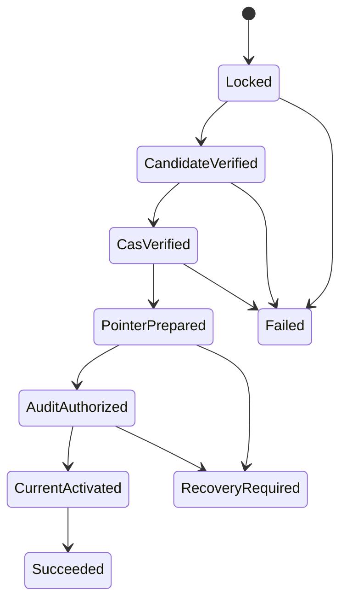

# Feature design: Airflow cache promotion integrity

- Status: RELEASED (`v0.72.2`, 2026-07-15)
- Owner: dpone maintainers
- Issue: PR #315 implementation slice
- Target release: 0.72.2
- Evidence: `test_artifacts/airflow-cache-promotion-integrity/validation-report.md`
Last verified: 2026-07-14

## Executive summary

Airflow must never parse or execute a deployment that was only partially
promoted, changed after fingerprinting, or selected by a stale recovery plan.
This feature makes local cache promotion fail closed while keeping the platform
journey one command for normal operation and plan/apply for recovery.

Approval is the maintainer request to implement the frozen
[Airflow self-service architecture](airflow-self-service-architecture.md). This
spec narrows that approved contract to the promotion-integrity implementation.

## Personas and customer journey

| Persona | Goal | Current pain | Success signal |
|---|---|---|---|
| Platform engineer | Promote one built deployment | Races and partial writes can split local state | One CAS winner and structured recovery |
| Airflow operator | Diagnose damaged cache | Candidate validity was ambiguous | Plan lists only fully verified candidates |
| Security engineer | Prevent control-file redirection | Fixed temp/audit paths could follow symlinks | No-follow control I/O and confined artifacts |

Normal journey: materialize pinned release and deployment, run `cache-sync`
with an allowed actor and CAS guard, then let the parse-safe provider read
`current/airflow-index.json`. Recovery journey: generate a read-only plan,
review pointer and active identities, then apply with actor, allowlist, and the
active-state guard from that plan.

## Scope

### In scope

- Release and deployment fingerprint verification.
- Exact deployment/index mirror verification.
- Inter-process promotion lock and CAS under lock.
- Unique durable pointer writes, no-follow audit append, atomic final activation.
- Sealed activation snapshots so later candidate mutation cannot change what
  `current` exposes after validation.
- Fully validated recovery candidates, stale-plan protection, audit-only repair.
- One transaction lock shared by promotion, recovery apply, and retention apply.
- Verified-current compatibility for local safe-sample execution; immutable
  releases are create-or-compare and source changes produce a new release.
- Structured failure mutation details and topology-safe text output.
- Canonical lowercase cache identities and complete pointer authorization
  validation for promotion, recovery, retention, and safe-sample consumers.
- Fail-closed complete-tree traversal and plan-first retention deletion with
  truthful partial-mutation evidence.

### Non-goals

- Remote release publishing or download.
- Multi-host distributed locking.
- Airflow parse-time synchronization.
- Secret resolution, Vault access, or runtime artifact fetch.
- Version bump, tagging, and publication of target release `0.72.2`; those run
  only after merge through the separate release protocol.

### Assumptions and constraints

- The cache root is one local POSIX filesystem visible to the materializer and
  DAG processor.
- `current` is a relative symlink. Directory-copy fallback is not supported.
- Production publisher/materializer integration remains `UNVERIFIED` until a
  deployment supplies live evidence.

## Public contract

### CLI

- First promotion: `cache-sync --expect-current-absent --confirm-promote`.
- Update: `cache-sync --expected-current-deployment-id <id>`.
- Platform cache mutation commands require at least one `--allowed-promoter`.
  CI/workload identity and cache write permissions authenticate the process;
  actor/allowlist arguments are policy inputs.
- Recovery apply additionally requires `--promoted-by` and exactly one active
  state guard: deployment ID or `--expect-current-absent`.
- Exit `0`: success; `1`: recovery operation failure; `2`: CLI usage; `4`:
  promotion safety/validation or missing confirmation.
- JSON write failures include `failed_step`, `state_may_have_changed`, and
  `recovery_required`; text never prints physical cache paths.
- Retention deletion failures additionally report `deleted_deployment_ids` and
  `failed_deployment_id`, so partial filesystem mutation is never returned as
  an opaque exception or false success.

### Python API

```python
DeploymentCacheMaterializer.promote(..., expect_current_absent=False)
DeploymentCacheMaterializer.validate(deployment_dir, *, environment)
DeploymentCacheMaterializer.recover(
    deployment_dir,
    *,
    environment,
    promoted_by,
    expected_current_deployment_id,
)
DeploymentCacheMaterializer.repair_audit(
    *,
    environment,
    recovery_actor,
    expected_current_deployment_id,
)
```

All methods perform local filesystem I/O only. `DeploymentCacheError` exposes
stable `code`, optional exact `path`, and structured `details`.

### Manifest/schema and artifacts

- Release artifacts contain exactly one canonical `path` or legacy
  `artifact_ref`; both normalize to the same semantic release identity.
- Raw locators reject empty/dot segments, duplicate separators, whitespace,
  controls, backslashes, colons, absolute paths, and normalization aliases.
- Recovery plan adds `current_path_deployment_id` while preserving
  `current_deployment_id` as pointer state.
- Malformed pointer or directory identities are never echoed into typed digest
  fields: recovery uses `null` plus an issue, and retention uses `null` on the
  quarantine item. Diagnostic plans therefore remain schema-valid while
  preserving the exact failing path and error code.
- Release, deployment, pointer, and retention protection identities use the
  canonical lowercase `sha256:<64 hex>` representation. The serialized
  `release-set.json.release_id` must itself be canonical; uppercase text is
  rejected before activation even when it denotes the same digest. Artifact
  checksums may still compare hexadecimal text case-insensitively.
- A current pointer is usable only when `promoted_by` is non-empty and
  `promoted_at` is an offset-aware date-time.
- `current-pointer.json`, `current-pointer-audit.jsonl`, `.promotion.lock`, and
  the relative `current` symlink are local control artifacts.

### Compatibility and migration

Existing deployments whose content does not reproduce `deployment_id` must be
rematerialized. Uppercase cache identities must also be rematerialized with
their canonical lowercase identity. Existing release-only `artifact_ref` remains readable and has
the same fingerprint as canonical `path`. Rolling back removes concurrency and
integrity guarantees and is not a safe production rollback.

## Detailed algorithm

1. Authorize `promoted_by` against the exact allowlist required by platform
   mutation commands. Local library composition may inject a separately trusted
   local policy, but CLI values never replace CI/workload authentication and
   cache write permissions.
2. Resolve the candidate inside canonical cache layout.
3. Acquire `.promotion.lock` with no-follow and an exclusive process lock.
   Recovery apply and retention apply use this same lock from fresh plan through
   mutation; same-thread nested materializer calls reuse the held transaction.
4. Read deployment and index as UTF-8 JSON objects; validate schemas and
   environment.
5. Recompute `deployment_id`; compare release and every mirrored runtime field.
6. Read pinned release-set; recompute `release_id`; compare exact artifact sets.
7. Resolve each `cache://releases/<digest>/...` path lexically inside cache and
   release roots, then open every path component from an anchored cache-root
   descriptor with no-follow semantics; verify type, size budget, declared
   bytes, and SHA-256.
8. Copy the verified deployment projection into
   `activations/<environment>/<deployment_id>`, seal the snapshot and pinned
   release tree read-only, then compare the complete regular-file tree before
   and after copy. Existing activations are exact create-or-compare and are
   never repaired in place. Unreadable subtrees fail the whole operation;
   non-regular entries such as FIFOs are opened nonblocking and rejected.
9. Read active `current` and pointer under lock; require environment,
   deployment, release, promoter, and timestamp consistency, then apply update
   or expected-absent CAS.
10. Prepare a unique relative symlink for the sealed activation snapshot.
11. Durably replace pointer JSON through a unique exclusive temp file.
12. Append promotion authorization with no-follow and fsync.
13. Atomically replace `current` last, fsync the cache directory, return success.

Recovery re-plans, compares the reviewed active-state guard, rejects healthy
state and unverified candidates, then either appends the unchanged pointer for
audit-only repair or executes the same locked activation protocol. Audit-only
repair requires the pointer release to match the validated current projection.
An existing `current` without a canonical physical deployment identity is
blocked from automatic apply because `null` cannot safely represent its CAS
state.

Retention apply computes a fresh plan under the same transaction lock and
fully validates the active `current` projection, including deployment
fingerprint, index, release-set, and artifact bytes, before it can classify any
other deployment for deletion. It then validates every delete candidate before
deleting the first one. A domain validation failure is normalized to
`DPONE_DEPLOYMENT_CACHE_GC_VALIDATION_FAILED` while preserving its stable
`cause_code`; the report records an empty completed-ID list and
`state_may_have_changed: false`. Filesystem deletion remains a sequence of
idempotent operations rather than a fictional multi-directory transaction. On
failure, structured details distinguish no mutation from partial deletion and
list every deployment already completed.

Promotion follows the same stage-based rule: once snapshot mutation starts,
the materializer attaches `state_may_have_changed: true` to any domain error.
Facades and desired-state adapters consume this evidence rather than classifying
an open-ended set of error codes themselves.

### State machine



### Edge cases

- Concurrent first/update promotion: one winner; loser gets CAS mismatch.
- Invalid UTF-8/non-object JSON: stable structured invalid-projection error.
- Symlinked lock/pointer/audit or release artifact: fail closed.
- Intermediate artifact-directory swap: descriptor-anchored open fails closed.
- Unreadable activation subtree: promotion fails instead of silently omitting
  files from the sealed snapshot.
- FIFO or other non-regular candidate entry: nonblocking open and structured
  activation failure; the transaction lock is not held indefinitely.
- Uppercase identity or malformed protection evidence: rejected before control
  mutation or retention deletion.
- Corrupt active projection: retention requires recovery and deletes no valid
  recovery candidate.
- Current pointer without publisher/timestamp authorization: rejected by every
  consumer and offered only through reviewed recovery.
- Retention filesystem failure after one deletion: structured partial-mutation
  result names completed and failed deployment IDs.
- Existing activation with different bytes for the same path identity: conflict.
- Existing but noncanonical `current`: recovery plan is blocked, not absent.
- Audit failure: active current remains previous; recovery selects a validated
  state and cannot use a stale plan.
- Vault, Airflow, Kubernetes, network, database, and secret calls: forbidden.

## Architecture

| Component | Responsibility | Dependency direction |
|---|---|---|
| Deployment projection contract | Pure fingerprint/mirror validation | `runtime -> contracts` |
| Integrity verifier | Confined release/artifact verification | `runtime -> contracts` |
| Activation snapshotter | Copy, seal, and revalidate immutable local activation bytes | Local filesystem only |
| Materializer | Lock, CAS, ordered commit | Local filesystem only |
| Recovery planner/applier | Diagnose and authorized repair | Reuses materializer validator |
| Retention planner/applier | Validate complete delete set and report ordered mutation | Reuses projection/current validators |
| Readiness/CLI | Structured result and UX rendering | Thin facade over runtime |

Rejected alternatives are recorded in
[ADR 0009](adr/0009-artifact-delivery-and-cache-materializer.md): unlocked CAS,
fixed temporary names, activation before audit, copy fallback, and arbitrary
recovery promotion.

Quality impact is bounded by `docs/benchmarks/quality_budgets.yml`; modules are
split by contract validation, artifact verification, commit protocol, audit,
and recovery rather than by mechanical line count.

## Market comparison

The broad product comparison remains in the approved architecture. This slice
is an internal local promotion protocol, so none of the required comparison
tools exposes an equivalent public contract to adopt.

| System | Result | Reason |
|---|---|---|
| dlt, Airbyte, Fivetran, Informatica | N/A | Connector/runtime products, not dpone local Airflow cache promotion |
| Pentaho, SSIS, Apache Beam | N/A | Execution engines, no equivalent Airflow projection cache contract |
| gusty, Astronomer Cosmos | N/A | DAG authoring/integration, not local release/deployment activation |

Airflow DAG Bundle versioning remains a separate delivery identity, as defined
by the official [DAG Bundles documentation](https://airflow.apache.org/docs/apache-airflow/stable/administration-and-deployment/dag-bundles.html),
verified 2026-07-13. This feature does not conflate it with dpone release or
deployment identity.

## Measurable differentiation

```yaml
axis: local promotion reproducibility and recovery safety
scenario: two concurrent promoters share one expected active deployment
baseline: unlocked check-then-act may return false success
metric: successful promoters and final pointer/current/audit agreement
target: exactly one success; all final identities equal; loser is CAS mismatch
procedure: synchronized process/thread contract test
artifact: tests/test_airflow_cache_promotion_integrity.py
limitations: local POSIX filesystem only; distributed lock is out of scope
```

## Security, tests, documentation, rollout

Unit/contract tests cover concurrency, first-promotion absent CAS, control-file
symlinks, traversal, invalid UTF-8, checksum/size mismatch, deployment/release
fingerprint drift, stale and concurrent recovery, promotion-versus-retention,
actor allowlist, audit provenance/durability, unreadable trees, nonblocking FIFO
rejection, canonical identity casing, pointer authorization, mixed malformed
retention evidence, partial deletion reporting, safe-sample source drift/corrupt
immutable releases, and schema parity. Full non-live, import, layer,
module-size, docs, packaging, and Airflow
compatibility gates are required. Live remote publisher checks remain
`UNVERIFIED`, never `PASS`.

Documentation changes include this spec, ADR 0009, architecture, cache runbook,
CLI reference, compatibility guide, error catalog, and changelog. Rollout first
rematerializes immutable release/deployment projections, then uses
expected-absent or exact-ID CAS. Rollback is permitted only in a quarantined
environment because it restores the known false-success race.

## Approval checklist

- [x] User problem and CJM are clear.
- [x] Algorithm and failure semantics are implementable without guessing.
- [x] Public contracts and compatibility are explicit.
- [x] Architecture and alternatives are justified.
- [x] Relevant market systems are explicitly scoped.
- [x] Differentiation is measurable.
- [x] Tests, evidence, docs, rollout, and rollback are complete.
- [x] Integrator owns shared semantic files; writer paths are conflict-safe.
- [x] Maintainer approved the frozen architecture and requested implementation.
