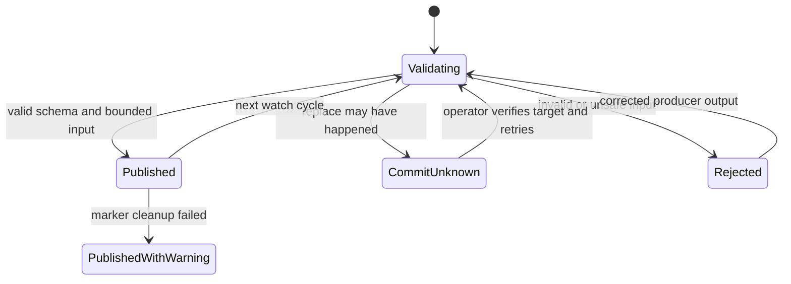

# Feature design: Airflow cache status publication

- Status: APPROVED
- Owner: dpone maintainers
- Issue: PR #491 audit remediation
- Target release: 0.73.32
Last verified: 2026-08-03

## Executive summary

The Airflow cache watch loop currently moves command output directly over the
last published status file. A truncated, oversized, malformed, or wrong-schema
temporary file can therefore replace the last-known-good operational evidence.
This feature adds one bounded, schema-aware and atomic publication command. A
valid status becomes current; an invalid status preserves the previous valid
file and creates a separate bounded failure marker.

Success is measurable: after every injected malformed/partial-write failure,
the digest of the last-known-good status is unchanged and the failure marker
contains a stable reason code without source payload or secrets.

## Personas and customer journey

| Persona | Goal | Current pain | Success signal |
|---|---|---|---|
| Airflow operator | Diagnose cache reconciliation and retention | Last status can be replaced by corrupt output | Last valid status remains readable; failure is explicit |
| Platform engineer | Run a fail-open watch sidecar | Shell performs unvalidated file replacement | One tested CLI owns validation and atomic publication |
| Incident responder | Distinguish stale evidence from publication failure | Missing or malformed JSON is ambiguous | Stable failure marker and exit code identify the cause |

The operator configures the watch loop once. Each reconcile/retention command
writes a private temporary file; the publisher validates it and either commits
it atomically or preserves the existing status and publishes a diagnostic
marker. The sidecar remains fail-open, while Airflow and alerting consume the
bounded status directory.

## Scope

### In scope

- A `dpone airflow cache-status-publish` command.
- Bounded, no-follow reads and path confinement under one status root.
- Validation against an existing registered dpone evidence schema.
- Atomic replace of a valid last-known-good target.
- Separate schema-versioned failure marker for invalid input.
- Idempotent retries and safe concurrent writers through one lock file.

### Non-goals

- Running the watch sidecar or Kubernetes controller itself.
- Repairing malformed producer output.
- Uploading status to object storage or Airflow metadata DB.
- Replacing command-specific evidence schemas with a generic status schema.

### Assumptions and constraints

- Status files are local regular files owned by the Airflow component UID.
- Maximum input is 8 MiB. Invalid JSON, including parser recursion failures,
  is rejected before target replacement; schema constraints bound the accepted
  command-specific structure.
- The surrounding sidecar intentionally remains fail-open; publication errors
  are visible through exit code, marker and logs.

## Public contract

### CLI

```bash
dpone airflow cache-status-publish \
  --status-root /opt/airflow/.dpone-cache/status \
  --source .retention-plan.abcd \
  --target last-retention-plan.json \
  --failure-marker last-retention-plan-publication-failure.json \
  --expected-schema dpone.deployment-cache-retention-plan.v1 \
  --format json
```

- `source`, `target` and `failure-marker` are single file names relative to
  `status-root`; absolute paths, separators, symlinks and special files fail.
- Exit `0`: valid source published and old failure marker removed.
- Exit `1`: schema/content validation failure; last-known-good preserved.
- Exit `1` also covers a successfully published target whose stale failure
  marker could not be removed; the report is `published_with_warning`.
- Exit `2`: CLI syntax/configuration error.
- Exit `4`: path, ownership, permission, size or integrity safety violation.
- JSON stdout is bounded and never contains the source payload.

### Python API

`AirflowCacheStatusPublisher.publish(request) -> CacheStatusPublicationReport`
is the application API. Filesystem access is injected through the existing
deployment-cache file primitives; CLI code contains no policy.

### Manifest/schema

No manifest change. `expected-schema` must resolve through the existing GitOps
schema registry.

### Artifacts and evidence

- Success report: `dpone.airflow-cache-status-publication.v1`.
- Failure marker: `dpone.airflow-cache-status-publication-failure.v1`.
- The target retains its original command-specific schema.
- Reports contain target/source basenames, expected schema, source SHA-256,
  target SHA-256 when known, attempt time, status and stable codes. They exclude
  file content and secrets. `commit_unknown` is fail-closed and preserves a
  secondary `diagnostic_error_code` if its marker cannot be committed.

### Compatibility and migration

Existing cache and retention evidence schemas do not change. The Kubernetes
example replaces an inline `os.replace` helper with this command. Rollback is
the old wrapper; no stored target migration is required.

## Detailed algorithm

1. Validate all names and open/create a private `0700`, current-UID status root.
2. Acquire a bounded exclusive publisher lock.
3. Open source with no-follow semantics; require regular current-UID file and
   read at most 8 MiB plus one byte.
4. Parse one JSON object and require exact `schema == expected-schema`.
5. Resolve the registered schema and validate the full payload.
6. On success, write canonical JSON to a private temporary file, fsync it,
   atomically replace target and fsync the directory.
7. Remove the stale marker and fsync the directory. Cleanup failure returns
   `published_with_warning`; the target itself remains valid.
8. On validation failure, leave target untouched and atomically publish a
   bounded failure marker with a stable code.
9. If an atomic writer reports that replacement may already have happened,
   return `commit_unknown` and publish that primary code. Marker failure is a
   secondary diagnostic and cannot downgrade the primary result.
10. Return a bounded report. A retry with identical valid content is idempotent.

### Pseudocode

```text
lock(status_root)
source = bounded_no_follow_read(source_name)
if source is unsafe, oversized, malformed or schema-invalid:
    atomic_write(failure_marker, safe_failure_metadata)
    return blocked
atomic_write(target, canonical(source))
remove(failure_marker)
return published(target_digest)
```

### State machine



### Edge cases

- Empty/truncated/deep/oversized JSON is rejected before replacing target.
- Unknown/wrong schema is rejected.
- Symlink, FIFO, directory, path traversal and foreign-owned files are rejected.
- A crash before rename leaves the old target; after rename the new target is
  durable. Temporary files are never treated as status.
- Concurrent writers serialize on the lock; last completed valid publication
  wins, and invalid writers cannot erase valid evidence.

## Architecture

### Components and responsibilities

| Component | Existing/new | Responsibility | Dependencies |
|---|---|---|---|
| `AirflowCacheStatusPublisher` | new | Validation, state transition and report | file adapter, validation port, clock |
| deployment-cache file adapter | existing | no-follow bounded reads, atomic writes | stdlib filesystem |
| GitOps validation adapter | new | Adapts registered contracts to the validation port | `GitOpsSchemaValidator` |
| readiness facade | new | Owns dependency injection | publisher and GitOps adapter |
| CLI adapter | new | Arguments, output and exit-code mapping | readiness facade |

Dependency direction remains CLI -> readiness composition -> service -> port,
with GitOps and filesystem implementations injected at the boundary.
No Airflow, Kubernetes, S3 or vendor SDK is imported by the core publisher.

### Alternatives and tradeoffs

| Alternative | Advantages | Disadvantages | Decision |
|---|---|---|---|
| Blind `os.replace` | Small | Corrupt output destroys LKG | Rejected |
| Parse in shell/Python snippet | No CLI work | Duplicated untested policy | Rejected |
| Generic status wrapper replacing producer schema | Uniform shape | Loses original evidence contract | Rejected |
| Schema-aware atomic publisher | Reusable, bounded, testable | One small public command | Adopted |

No ADR is required: this applies existing bounded evidence and adapter rules.
New Python modules must remain below the repository 400-SLOC hard limit and add
no forbidden import-graph edges.

## Market comparison

| System/version | Relevant capability | Observed design | Adopt/reject | Source/date |
|---|---|---|---|---|
| Apache Airflow 3.3 | Versioned DAG bundles and connection-backed external sources | Preserve version identity; do not put credentials in configuration | Adopt exact evidence identity and secret exclusion | [Airflow DAG bundles](https://airflow.apache.org/docs/apache-airflow/stable/administration-and-deployment/dag-bundles.html), checked 2026-08-03 |
| Kubernetes | Init containers gate startup unless they complete successfully | Keep wrapper fail-open while making failure observable | Adopt explicit exit handling and durable status | [Init containers](https://kubernetes.io/docs/concepts/workloads/pods/init-containers/), checked 2026-08-03 |
| dlt, Informatica, Airbyte, Fivetran, Pentaho, SSIS, gusty, Cosmos, Beam | N/A | No comparable local Airflow cache-status publication contract | No pattern claimed | checked 2026-08-03 |

## Measurable differentiation

```yaml
axis: last-known-good preservation
scenario: producer emits truncated or wrong-schema status during fail-open watch
baseline: inline replace can destroy previous evidence
metric: previous target digest preserved and explicit failure marker emitted
target: 100 percent across fault-injection tests
procedure: inject malformed, oversized, symlink and crash-boundary sources
artifact: pytest report and schema-validated publication reports
limitations: live Kubernetes behavior remains a separate certification gate
```

## Security, privacy, and operations

The command accepts no credentials, never logs source content, confines all
paths, rejects links/special files, and uses private permissions. Alerting reads
only the failure marker/status code. Status retention follows cache retention;
temporary files can be removed after their producer cycle.

## Test and certification plan

| Layer | Scenario | Environment | Expected artifact |
|---|---|---|---|
| Unit | valid, malformed, wrong schema, oversized, links, concurrency | tmp filesystem | publication report/marker |
| Contract | both new schemas and unchanged producer schema | schema catalog | generated JSON schemas |
| Integration | retention plan/apply wrapper publication | local CLI | LKG and marker files |
| Live certification | sidecar restart and malformed producer injection | approved dev Airflow | status and pod evidence |
| Compatibility | existing retention v1/v2 targets | local | unchanged payloads |

## Documentation plan

Update Kubernetes deployment, diagnostics and provider docs with strict versus
intentional fail-open shell examples, status paths, alerts and recovery.

## Rollout and rollback

Ship the CLI first, then switch Helm examples/configuration. Invalid input keeps
the old status, so rollout is non-destructive. Roll back the wrapper command if
needed; existing status files remain valid.

## Agent execution plan

One integrator owns the command, runtime service, schemas, tests and shared docs.
Independent final reviewers receive read-only access after the candidate SHA is
frozen.

## Approval checklist

- [x] User problem and CJM are clear.
- [x] Algorithm and failure semantics are implementable without guessing.
- [x] Public contracts and compatibility are explicit.
- [x] Architecture and alternatives are justified.
- [x] Relevant market research uses current official sources.
- [x] Claimed differentiation is measurable.
- [x] Tests, evidence, docs, rollout, and rollback are complete.
- [x] Path ownership and integration plan are conflict-safe.
- [x] Maintainer changed status to `APPROVED`.
