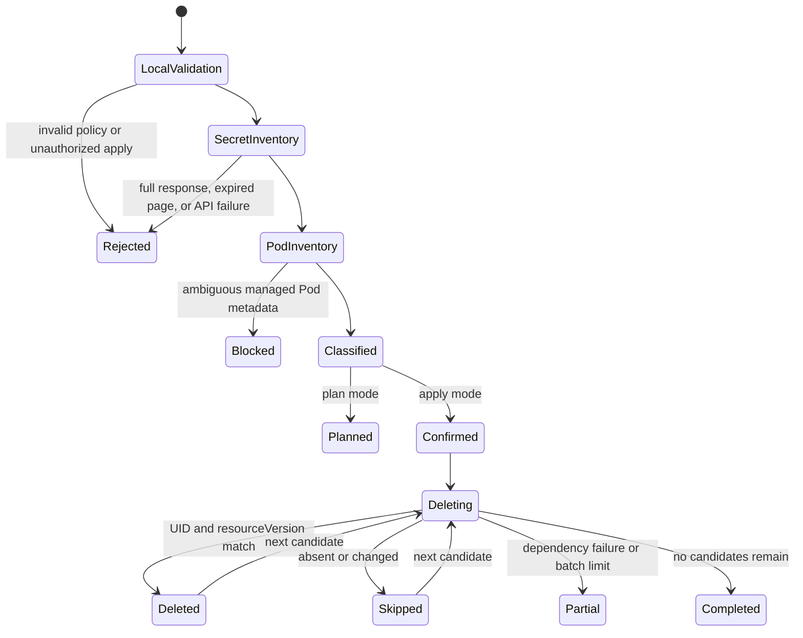
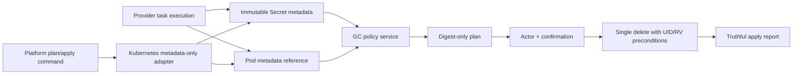

# Feature design: Airflow Connection Secret retention GC

- Status: IMPLEMENTED
- Owner: dpone maintainers
- Issue: Industrial Self-Service Airflow Phase 1C
- Target release: v0.72.9
Last verified: 2026-07-16
Implementation evidence:
`test_artifacts/airflow-self-service-v0729-secret-gc/validation-report.md`

Approved amendment: the platform GC command is distributed through the
optional `dpone[kubernetes]` extra. The base package remains SDK-free, and a
missing SDK receives its own actionable structured error. This closes the
installation contract discovered during executable review without changing the
runtime or authoring architecture.

## Executive summary

The v0.72.8 provider gives every Airflow task attempt a distinct immutable
Kubernetes Secret. Synchronous tasks delete that Secret in `finally`, but
deferrable tasks must currently use `cleanup_policy: retain`, and any failed
delete leaves the object behind. The runbook names platform-managed garbage
collection as the recovery path, but no safe implementation exists. Credentials
can therefore remain in the cluster indefinitely.

This feature adds a plan-first, explicitly confirmed platform GC for only the
attempt-scoped Airflow Connection Secrets created by dpone. The provider stamps
digest-only lifecycle metadata on each Secret and its consuming Pod. The GC
uses Kubernetes metadata-only responses, never full Secret or Pod objects,
protects every Secret referenced by an existing managed Pod, protects young
Secrets during the create-before-Pod window, and deletes by exact UID and
resourceVersion preconditions. It never uses `deletecollection`, never resolves
Airflow Connections, and never runs during DAG parsing.

The ordinary pipeline owner gets no new step. A platform operator can inspect
and clean one namespace with two explicit commands:

```bash
dpone airflow connection-secret-gc-plan \
  --namespace airflow-example

dpone airflow connection-secret-gc-apply \
  --namespace airflow-example \
  --actor ci://dpone/connection-secret-gc \
  --allowed-actor ci://dpone/connection-secret-gc \
  --confirm-delete
```

Measurable outcome: an expired retained or synchronous-cleanup orphan is
deleted without fetching its credential data, while a Secret referenced by an
existing managed Pod is never offered for deletion.

The maintainer asked Codex to continue the frozen self-service plan as one
autonomous goal and carry each slice through implementation. That direction
approves this scoped specification.

## Personas and customer journey

| Persona | Goal | Current pain | Success signal |
|---|---|---|---|
| Data engineer | Use deferrable KPO without learning Secret lifecycle | `retain` delegates an invisible operational obligation | No authoring or command change; credentials disappear after the platform retention window |
| Airflow operator | Recover from cleanup failure safely | The error exposes only a digest and the runbook requires manual deletion | A plan shows protected, eligible, and quarantined digest references without Secret values or physical names |
| Platform engineer | Run bounded automated cleanup | There is no executable or schema-validated GC contract | A CronJob/service identity can run plan/apply with fixed selectors, age floor, delete limit, and audit output |
| Security engineer | Prove GC does not inspect credentials or delete active objects | Normal Secret listing returns data and blind age deletion can break Pods | Metadata-only API responses, Pod-reference protection, UID/resourceVersion preconditions, and negative tests |

Journey:

1. The platform deploys the upgraded provider. No pipeline source or compact
   pack migration is required.
2. At task execution, the provider creates the existing immutable Secret and
   adds digest-only lifecycle labels and annotations.
3. The provider adds the same digest references to Pod metadata while keeping
   the physical Secret reference only in the volume specification.
4. The user task proceeds unchanged. Synchronous cleanup still deletes eagerly.
5. A platform job runs `connection-secret-gc-plan` in one explicit namespace.
6. dpone requests only `PartialObjectMetadataList` for managed Secrets and Pods.
7. The plan protects any Secret referenced by an existing managed Pod and any
   Secret younger than the configured age floor.
8. Expired unreferenced Secrets become deterministic delete candidates;
   malformed lifecycle objects are quarantined.
9. The operator reviews digest-only text or schema-validated JSON.
10. Confirmed apply validates the actor before network access, rebuilds a fresh
    plan, and deletes a bounded batch using UID/resourceVersion preconditions.
11. A concurrent deletion or mutation is reported as an idempotent skip; a
    dependency failure produces truthful partial-mutation evidence and a retry
    action.
12. Upgrade requires adding metadata-only list and conditional delete RBAC in a
    dedicated ephemeral-credential namespace where practical.

## Scope

### In scope

- Digest-only lifecycle metadata on attempt-scoped Secrets and consuming Pods.
- Fixed Kubernetes label selectors owned by dpone.
- Metadata-only, paginated Secret and Pod inventory.
- Plan classification: `protect`, `delete`, or `quarantine`.
- Protection for existing managed Pod references and a default 24-hour age
  floor for the create-before-Pod window and long operational recovery.
- Explicitly confirmed, actor-allowlisted, bounded apply.
- UID and resourceVersion delete preconditions.
- Stable JSON Schema contracts and concise platform text output.
- Optional `dpone[kubernetes]` platform dependency with no base/help/parse-time
  import cost.
- Redacted dependency, authorization, inventory, conflict, and partial failure
  reporting.
- Local fake-transport proof and an explicit live certification procedure.

### Non-goals

- Querying the Airflow metadata database or REST API for active TaskInstances.
- Reading Secret `data` or `stringData`, even as a compatibility fallback.
- Reading full Pod specs, logs, env values, or mounted files.
- Automatic all-namespace cleanup or user-supplied label selectors.
- Kubernetes `deletecollection`, finalizers, a CRD, a long-running controller, or
  owner-reference patching.
- Deferrable KPO callback cleanup. This GC remains the required fallback until a
  separate callback contract is implemented and certified across the matrix.
- Deleting pre-v0.72.9 unlabelled Secrets. They remain a manual migration task.
- Treating CLI `--actor` as authentication. Kubernetes identity and RBAC remain
  the authentication and authorization boundary.
- A beginner command or documentation step.

### Assumptions and constraints

- The official provider creates a Secret before creating a Pod. If Secret
  create returns `409`, the v0.72.8 operator fails before Pod launch.
- A Pod stamped by this provider retains its lifecycle metadata for its entire
  Kubernetes object lifetime.
- Any existing managed Pod protects its Secret, regardless of Pod phase. This
  deliberately favors credential retention over unsafe deletion and allows
  kept Pods to remain debuggable.
- Kubernetes metadata-only responses are required. HTTP `406` is a blocker; the
  client does not fall back to full objects.
- GC is namespace-scoped. A dedicated namespace limits the impact of Kubernetes
  RBAC because the `list secrets` verb itself cannot be constrained to a
  response representation or label selector.
- The default minimum age is `86400` seconds. The CLI rejects values below 300
  seconds.
- The default page size is 500 and the default apply batch is 100 deletes.

## Public contract

### CLI

Plan:

```bash
dpone airflow connection-secret-gc-plan \
  --namespace airflow-example \
  --minimum-age-seconds 86400 \
  --page-size 500 \
  --kube-auth auto \
  --format text
```

Apply:

```bash
dpone airflow connection-secret-gc-apply \
  --namespace airflow-example \
  --minimum-age-seconds 86400 \
  --page-size 500 \
  --max-delete-count 100 \
  --kube-auth in-cluster \
  --actor ci://dpone/connection-secret-gc \
  --allowed-actor ci://dpone/connection-secret-gc \
  --confirm-delete \
  --format json
```

Options:

| Option | Plan | Apply | Contract |
|---|---:|---:|---|
| `--namespace` | required | required | One safe Kubernetes namespace; no all-namespace mode |
| `--minimum-age-seconds` | default `86400` | default `86400` | Integer `300..2592000` |
| `--page-size` | default `500` | default `500` | Integer `1..1000` |
| `--kube-auth` | default `auto` | default `auto` | `auto`, `in-cluster`, or `kubeconfig` |
| `--kube-context` | optional | optional | Selects one kubeconfig context; incompatible with `in-cluster` |
| `--max-delete-count` | N/A | default `100` | Integer `1..1000`; larger plans are processed in deterministic batches |
| `--actor` | N/A | required | Audit assertion checked against exact allowlist before network I/O |
| `--allowed-actor` | N/A | required, repeatable | Exact-match platform policy |
| `--confirm-delete` | N/A | required | No mutation without explicit acknowledgement |
| `--format` | `text` | `text` | `text` or `json` |

`auto` tries in-cluster configuration first and then kubeconfig. Supplying
`--kube-context` selects kubeconfig directly. Authentication/configuration
failures are redacted.

Exit codes follow the frozen self-service contract:

| Code | Meaning |
|---:|---|
| `0` | Plan succeeded, or apply completed all eligible candidates/no-op |
| `1` | Apply was partial or an inventory object was quarantined and cleanup remains |
| `2` | Invalid local CLI/policy input |
| `3` | Kubernetes dependency/API unavailable or inventory snapshot expired |
| `4` | Confirmation/actor/RBAC/metadata-only safety violation |
| `5` | Unexpected internal error |

Plan text never prints physical Secret names, Pod names, UIDs, resourceVersions,
Secret values, Airflow ids, or raw Kubernetes responses. JSON follows the same
redaction policy. Namespace and actor are platform command inputs and may be
present.

### Python API

The provider adds a pure lifecycle value object:

```python
from dpone_airflow_pack.connection_secret_lifecycle import (
    AirflowConnectionSecretLifecycle,
)
```

The platform application service is injectable:

```python
from dpone.services.airflow_connection_secret_gc import (
    AirflowConnectionSecretGcPlanRequest,
    AirflowConnectionSecretGcService,
)

plan = AirflowConnectionSecretGcService(inventory=inventory, deletion=deletion).plan(
    AirflowConnectionSecretGcPlanRequest(
        namespace="airflow-example",
        minimum_age_seconds=86400,
        page_size=500,
    )
)
```

`dpone.ports.airflow_connection_secret_gc` owns metadata-only snapshots and two
capability ports: inventory and conditional deletion. Vendor SDK objects never
cross those ports.

The platform command requires the optional client extra:

```bash
python -m pip install 'dpone[kubernetes]'
```

The extra supports Kubernetes Python client `>=32.0.1,!=36.0.0,<37`, matching
the maintained client families used by the supported Airflow provider matrix.
The base `dpone` and scheduler-side `dpone-airflow-pack` installations remain
free of a mandatory Kubernetes SDK dependency.

### Manifest/schema

No authoring or compact-pack schema migration. Existing fields remain:

```yaml
connection_projection:
  mode: kubernetes_secret_volume
  cleanup_policy: retain
```

The provider adds only Kubernetes object metadata:

```yaml
metadata:
  labels:
    app.kubernetes.io/managed-by: dpone
    dpone.dev/resource-kind: airflow-connection-secret
    dpone.dev/lifecycle-version: v1
    dpone.dev/cleanup-policy: retain
  annotations:
    dpone.dev/secret-ref: sha256:...
    dpone.dev/attempt-ref: sha256:...
```

The Pod receives `resource-kind: airflow-connection-pod`, lifecycle version,
and the same two annotations. It does not receive Connection URIs or Secret
values.

### Artifacts and evidence

Plan contract:

```yaml
schema: dpone.airflow-connection-secret-gc-plan.v1
status: needs_cleanup
namespace: airflow-example
observed_at: 2026-07-16T12:00:00Z
minimum_age_seconds: 86400
page_size: 500
inventory:
  managed_secrets: 3
  managed_pods: 1
  active_references: 1
  quarantined: 0
items:
  - secret_ref: sha256:...
    attempt_ref: sha256:...
    action: delete
    reason: retained_expired
    cleanup_policy: retain
    age_seconds: 172800
delete_candidates:
  - sha256:...
```

Apply contract:

```yaml
schema: dpone.airflow-connection-secret-gc-apply.v1
status: ok
namespace: airflow-example
actor: ci://dpone/connection-secret-gc
observed_at: 2026-07-16T12:00:00Z
minimum_age_seconds: 86400
max_delete_count: 100
items:
  - secret_ref: sha256:...
    action: deleted
    reason: retained_expired
deleted_secret_refs: [sha256:...]
skipped_secret_refs: []
failed_secret_refs: []
```

Both schemas are registered in the GitOps schema catalog and published under
`docs/schemas/gitops/`. The outputs are operational audit evidence, not runtime
evidence and not a credential store.

### Compatibility and migration

- Existing compact packs remain valid.
- Existing custom projectors should preserve the lifecycle metadata supplied in
  the Secret mapping. Dropping it leaves the object invisible to GC and must be
  documented as unsupported.
- Pre-v0.72.9 unlabelled Secrets are never auto-adopted or deleted. Operators use
  the v0.72.8 digest reconstruction runbook for reviewed manual cleanup.
- Existing eager synchronous cleanup is unchanged.
- The Kubernetes service identity adds metadata-only `list` for Secrets and
  Pods plus conditional `delete` for Secrets in the selected namespace. It no
  longer needs `replace` from v0.72.8.
- Rollback stops new lifecycle metadata and automated GC. Already-labelled
  objects remain safe; pause apply jobs before rolling the provider back.

## Detailed algorithm

### Provider publication

1. Validate task-attempt identity and cleanup policy before credential I/O.
2. Derive the existing attempt `secret_ref` and `attempt_ref`.
3. Construct `AirflowConnectionSecretLifecycle` and validate both SHA-256 refs
   and cleanup policy.
4. Build the immutable Secret with fixed managed-resource labels and digest-only
   annotations.
5. Publish create-only as in v0.72.8.
6. Patch each supported dictionary/object Pod representation with the existing
   volume and with merged lifecycle labels/annotations.
7. Existing user labels and annotations are preserved; dpone-owned keys are
   overwritten with the validated lifecycle values.
8. Execute and clean synchronously as before, or retain for deferrable/platform
   cleanup.

### Inventory and plan

1. Validate namespace, age bounds, page-size bounds, auth/context combination,
   and an aware UTC observation clock before Kubernetes client construction.
2. Request Secret pages with the fixed selector and exact Accept header:

   ```text
   application/json;as=PartialObjectMetadataList;g=meta.k8s.io;v=v1
   ```

3. Require response kind `PartialObjectMetadataList`; reject any page carrying
   `data`, `stringData`, `spec`, or `status`. Never negotiate a full-object
   fallback.
4. Follow opaque continuation tokens until empty. Page-limit and token cycles
   are bounded. HTTP `410` fails the plan and asks the operator to rerun.
5. Repeat metadata-only pagination for managed Pods with the fixed Pod selector.
6. Validate every managed Pod has valid matching `secret_ref` and `attempt_ref`
   annotations. Any malformed managed Pod blocks all deletion because its
   protected object is ambiguous.
7. Build the set of active `(secret_ref, attempt_ref)` pairs from every existing
   managed Pod. Pod status is intentionally irrelevant.
8. For every managed Secret, validate object name, UID, resourceVersion,
   creationTimestamp, exact lifecycle labels, digest annotations, and that
   `secret_ref == sha256(physical_name)`.
9. Quarantine malformed Secrets individually. Never expose their physical name.
10. Protect a valid Secret when a matching Pod pair exists.
11. Otherwise protect it when age is below `minimum_age_seconds`.
12. Otherwise classify it for deletion as `retained_expired` when policy is
    `retain`, or `synchronous_cleanup_orphaned` for `after_execute`.
13. Sort items and candidates by `secret_ref` for deterministic output.
14. Emit the plan. Planning performs zero mutations.

### Apply

1. Validate `confirm_delete`, actor, allowlist, delete limit, and all local
   options before Kubernetes client construction.
2. Build a fresh inventory and plan. A serialized old plan is never accepted as
   an execution input.
3. Select the first `max_delete_count` candidates by `secret_ref`. Mark any
   remainder `batch_limit` and return `partial` after the bounded batch.
4. For each selected candidate, issue one single-resource Secret delete with
   both UID and resourceVersion preconditions.
5. HTTP `404` is `already_absent`; HTTP `409` is `changed_since_plan`. Both are
   idempotent skips and are never retried blindly.
6. On another API error, record only operation, numeric status, and safe refs;
   stop additional mutations and mark remaining candidates
   `not_attempted_after_failure`.
7. Emit deleted, skipped, and failed refs. Never claim atomic multi-object
   deletion.
8. A rerun recomputes inventory and safely resumes remaining candidates.

### Pseudocode

```text
validate_local_policy()
secret_pages = metadata_only_list(SECRET_SELECTOR)
pod_pages = metadata_only_list(POD_SELECTOR)

active_pairs = validate_pod_refs(pod_pages)
items = []
for secret in validate_and_sort(secret_pages):
    if invalid(secret):
        items += quarantine(secret.safe_ref)
    elif (secret.secret_ref, secret.attempt_ref) in active_pairs:
        items += protect(secret, active_pod)
    elif age(secret.creation_timestamp) < minimum_age:
        items += protect(secret, minimum_age)
    else:
        items += delete(secret, policy_reason(secret.cleanup_policy))

if mode == plan:
    return plan(items)

require_confirmed_authorized_actor_before_network()
fresh = build_plan()
for candidate in fresh.delete_candidates[:max_delete_count]:
    try:
        delete(name, preconditions=(uid, resource_version))
        report_deleted(candidate.safe_ref)
    except NotFound:
        report_skipped(already_absent)
    except Conflict:
        report_skipped(changed_since_plan)
    except ApiFailure as safe_error:
        report_failed(safe_error.status_only)
        stop_and_report_unattempted()
return truthful_apply_report()
```

### State machine



### Ordering, retries, concurrency, and failure semantics

- Confirmation and actor authorization precede all network I/O in apply.
- Inventory uses bounded, consistent pages per resource collection. Secret and
  Pod collections have independent Kubernetes resourceVersions.
- The provider's create-before-Pod plus fail-on-409 ordering means an official
  dpone Pod cannot newly attach to an old candidate after failing Secret create.
- The age floor protects the ordinary Secret-to-Pod publication interval.
- Existing managed Pods always protect, including terminal or kept Pods.
- Apply re-plans rather than trusting stale serialized evidence.
- UID/resourceVersion preconditions prevent deletion of a replaced or mutated
  object with the same name.
- `404` and `409` are safe non-destructive skips. Other failures stop the batch.
- There is no transaction across Kubernetes objects. Partial mutation is
  explicit and resumable.
- Cancellation between deletes leaves already deleted items deleted and all
  others discoverable on the next plan.
- Two concurrent GC jobs can race only into `404` or `409`; neither can delete a
  replacement because both use preconditions.

### Edge cases

- Empty inventory: `status: ok`, no-op apply.
- Only young or active Secrets: plan succeeds with zero candidates.
- Missing/invalid Secret annotations: quarantine that Secret.
- Missing/invalid managed Pod annotations: block all deletion.
- Pod references an already deleted/unmanaged Secret: ignore for candidate
  classification but count as an orphan reference warning.
- Future creation timestamp within 300 seconds: protect as clock skew. Beyond
  that: quarantine.
- Continuation token repeats or page count exceeds 10,000: fail closed.
- HTTP `406`: fail with metadata-only unsupported; no full-object retry.
- HTTP `410`: fail and rerun the whole plan.
- HTTP `401/403`: return access denied without raw response text.
- Dependency/configuration failure: return unavailable without paths, tokens,
  certificates, or API host.
- Candidate count above batch limit: delete deterministic prefix, return
  `partial`, and give a rerun action.
- Physical Secret name reused after deletion: UID precondition prevents an old
  apply from deleting the new object.
- Pre-v0.72.9 object: not selected and not mutated.

## Architecture

### Components and responsibilities

| Component | Existing/new | Responsibility | Dependencies |
|---|---|---|---|
| `AirflowConnectionSecretLifecycle` | New provider value object | Validate and render digest-only Secret/Pod metadata | Python stdlib |
| Provider operator/runtime helpers | Existing | Stamp lifecycle metadata at execution | lifecycle value + existing attempt identity |
| GC snapshot/ports | New canonical ports | Vendor-neutral metadata snapshots, list, conditional delete | Python stdlib |
| `AirflowConnectionSecretGcService` | New application service | Classification, protection, bounded apply, truthful reports | ports + pure provider metadata contract |
| Kubernetes metadata adapter | New adapter | Auth, metadata-only pagination, redacted API mapping, precondition delete | lazy Kubernetes Python client |
| CLI result facade | New readiness adapter | Map typed failures to `dpone.error.v1` and exit codes | service |
| CLI parsers/renderers | New thin adapters | Parse platform options and render safe text/JSON | facade only |
| Schema contracts | New | Validate plan/apply evidence | GitOps schema primitives |

### Ports, adapters, and composition root

`dpone.ports.airflow_connection_secret_gc` contains immutable snapshots and
separate inventory/deletion protocols. The application service imports ports,
not Kubernetes. `dpone.adapters.kubernetes_airflow_connection_secret_gc`
implements both ports and imports Kubernetes only inside the explicit command
composition path. `dpone --help`, Airflow DAG parsing, and provider import do not
load Kubernetes configuration or perform I/O.

The readiness command facade is the composition root. The CLI parser delegates
validated primitive options to that facade; it constructs one adapter, injects
it into the application service, and returns a structured result for rendering.
Lower-level tests inject in-memory ports directly.

The provider distribution cannot depend on the root `dpone` package, so the
small lifecycle metadata contract lives in `dpone_airflow_pack`. The root
package already depends on that lightweight distribution and reuses the same
constants rather than duplicating selectors or annotation keys.

### Data and control flow



### Alternatives and tradeoffs

| Alternative | Advantages | Disadvantages | Decision |
|---|---|---|---|
| Normal Secret list | Simple generated client call | Response carries credential data; accidental logging/memory exposure | Reject |
| Metadata-only Secret and Pod inventory | No secret values or Pod env/spec payload; standard API | Requires content negotiation and fails on unsupported API | Adopt, no fallback |
| Query Airflow DB/API for active attempts | Rich Airflow state | Couples GC to Airflow internals and credentials; task state may diverge from Pod use | Reject |
| Inspect full Pod volumes | Direct physical reference | Full Pod spec can contain literal env credentials | Reject |
| Digest annotations on managed Pods | Metadata-only active reference | Requires provider stamping and trusts Kubernetes metadata RBAC | Adopt |
| OwnerReference from Secret to Pod | Native garbage collection | Pod UID is unavailable at Secret create; async callback support varies | Defer |
| Deferrable `execute_complete` cleanup only | Fast normal cleanup | Does not cover kills, crashes, cleanup failures, or old retained objects | Separate future optimization |
| CRD/controller | Strong reconciliation and custom status | Large operational/API surface for one lifecycle | Reject for Phase 1C |
| Age-only delete | Very simple | Can delete credentials from long-running Pods | Reject |
| `deletecollection` | Efficient | No per-object UID/RV preconditions or truthful partial report | Reject |

### ADR requirement

No new ADR. ADR 0010 assigns Airflow Connection compatibility resolution to
task execution without secret persistence, and ADR 0013 requires plan-first,
active-run-aware retention. This feature implements those accepted decisions
for temporary provider Secrets without changing ownership or introducing a new
extension architecture.

### Quality-budget impact

The lifecycle value, ports, application policy, Kubernetes adapter, CLI parser,
renderer, and schemas are separate stable responsibilities. Each new production
module targets less than 300 SLOC and the 400-SLOC hard budget. The existing
operator and runtime helper receive only thin lifecycle calls. No vendor import
is added to base import/help/parse paths, and no runtime-to-service edge is
introduced.

## Market comparison

The named ETL systems do not expose the lifecycle of dpone's temporary
Airflow/Kubernetes compatibility Secret. For this correctness capability they
are intentionally `N/A`, not scored.

| System/version | Relevant capability | Observed design | Strength | Limitation | Adopt/reject | Source/date |
|---|---|---|---|---|---|---|
| dlt | N/A | Pipeline library, not this provider-owned Kubernetes resource | N/A | No comparable object contract | N/A | Product boundary, 2026-07-16 |
| Informatica | N/A | Managed integration platform | N/A | Internal credential lifecycle is not this adapter contract | N/A | Product boundary, 2026-07-16 |
| Airbyte | N/A | Connector platform | N/A | No dpone attempt-Secret ownership | N/A | Product boundary, 2026-07-16 |
| Fivetran | N/A | Managed ELT | N/A | Kubernetes implementation is not user-controlled here | N/A | Product boundary, 2026-07-16 |
| Pentaho | N/A | ETL runtime | N/A | No comparable Airflow KPO bridge object | N/A | Product boundary, 2026-07-16 |
| Microsoft SSIS | N/A | ETL runtime | N/A | No Kubernetes provider lifecycle | N/A | Product boundary, 2026-07-16 |
| gusty | N/A | DAG generation | N/A | Does not own dpone task credential objects | N/A | Product boundary, 2026-07-16 |
| Astronomer Cosmos | N/A | Airflow/dbt orchestration | N/A | Does not define this provider's temporary Secret lifecycle | N/A | Product boundary, 2026-07-16 |
| Apache Beam | N/A | Data processing model | N/A | Runner credential cleanup is outside this contract | N/A | Product boundary, 2026-07-16 |

Relevant platform facts were checked against official primary sources on
2026-07-16:

- Kubernetes supports label selectors for bounded resource inventory and uses
  annotations for non-identifying metadata.
  [Labels and selectors](https://kubernetes.io/docs/concepts/overview/working-with-objects/labels/),
  [Annotations](https://kubernetes.io/docs/concepts/overview/working-with-objects/annotations/)
- Kubernetes supports `PartialObjectMetadataList`; a client can require it and
  receives `406` when the API cannot provide the representation.
  [Kubernetes API concepts](https://kubernetes.io/docs/reference/using-api/api-concepts/)
- DeleteOptions preconditions return conflict instead of deleting when UID or
  resourceVersion does not match.
  [DeleteOptions](https://kubernetes.io/docs/reference/kubernetes-api/definitions/delete-options-v1-meta/),
  [Preconditions](https://kubernetes.io/docs/reference/kubernetes-api/definitions/preconditions-v1-meta/)
- Kubernetes list pagination uses opaque continuation tokens and can return
  `410` when a consistent continuation is unavailable.
  [Kubernetes API concepts](https://kubernetes.io/docs/reference/using-api/api-concepts/)
- KPO supports deferrable execution, while callback support differs by provider
  version and execution mode.
  [KubernetesPodOperator](https://airflow.apache.org/docs/apache-airflow-providers-cncf-kubernetes/stable/operators.html)
- The maintained Kubernetes Python client line and current Airflow CNCF
  Kubernetes provider use compatible client families below `37`; dpone keeps
  the SDK optional and accepts `32..36` except the provider-excluded `36.0.0`.
  [Kubernetes Python client](https://github.com/kubernetes-client/python),
  [Airflow Kubernetes provider registry](https://airflow.apache.org/registry/providers/cncf-kubernetes/)

The active-Pod protection and create-before-Pod race argument are dpone design
inferences validated by contract tests; they are not claims from those sources.

## Measurable differentiation

```yaml
axis: credential-safe garbage collection of provider-owned Kubernetes Secrets
scenario: one active retained Secret, one expired retained Secret, one synchronous cleanup orphan, one malformed managed Secret
baseline: v0.72.8 manual digest reconstruction and deletion
metric: full Secret/Pod payload fetches, active Secret deletion attempts, unsafe name-reuse deletes, operator steps
target: 0 full payload fetches; 0 active deletion candidates; 0 deletes after UID/RV change; one plan plus one confirmed apply
procedure: fake metadata API records Accept headers and delete preconditions while concurrency tests mutate/delete candidates between plan and apply
artifact: test_artifacts/airflow-self-service-v0729-secret-gc/validation-report.md
limitations: local contract proof is not live Kubernetes certification; RBAC still grants the service identity the Kubernetes list verb
```

## Security, privacy, and operations

- The adapter requires metadata-only response kind and forbids fallback to full
  Secret or Pod objects.
- Secret and Pod values/specs are absent from ports, models, reports, exceptions,
  and logs.
- Reports expose only SHA-256 references, counts, policy, age, actor, namespace,
  and stable reason/error codes.
- Fixed selectors cannot be overridden from CLI.
- Managed Pod metadata is an active-use lease. Any ambiguity blocks deletion.
- UID/resourceVersion preconditions protect name reuse and concurrent mutation.
- Apply confirmation and actor allowlist are policy assertions. Kubernetes
  workload identity, namespace isolation, image provenance, and RBAC authenticate
  the job.
- Recommended RBAC: metadata list on Secrets and Pods and delete on Secrets in a
  dedicated ephemeral-credential namespace. Kubernetes RBAC cannot restrict
  `list secrets` to metadata-only representation, so the GC image/service
  account remains sensitive and must not provide a general shell or token
  export path.
- Alert on access denied, metadata-only unsupported, invalid managed Pod,
  quarantined Secret, partial apply, and repeated precondition conflicts.
- Metrics: inventory count, protected count by reason, candidate count, deleted,
  skipped, failed, duration, and last successful observation timestamp. Metrics
  use no physical names.
- A CronJob should run plan first and apply only under platform policy. Ordinary
  DAG/task service accounts do not receive list/delete permissions.

Stable error families:

```text
DPONE_AIRFLOW_SECRET_GC_INPUT_INVALID
DPONE_AIRFLOW_SECRET_GC_CONFIRMATION_REQUIRED
DPONE_AIRFLOW_SECRET_GC_ACTOR_MISSING
DPONE_AIRFLOW_SECRET_GC_ACTOR_UNAUTHORIZED
DPONE_AIRFLOW_SECRET_GC_DEPENDENCY_UNAVAILABLE
DPONE_AIRFLOW_SECRET_GC_SDK_UNAVAILABLE
DPONE_AIRFLOW_SECRET_GC_ACCESS_DENIED
DPONE_AIRFLOW_SECRET_GC_METADATA_ONLY_UNSUPPORTED
DPONE_AIRFLOW_SECRET_GC_INVENTORY_EXPIRED
DPONE_AIRFLOW_SECRET_GC_INVENTORY_INVALID
DPONE_AIRFLOW_SECRET_GC_POD_METADATA_INVALID
DPONE_AIRFLOW_SECRET_GC_DELETE_FAILED
DPONE_INTERNAL_AIRFLOW_SECRET_GC_FAILED
```

## Test and certification plan

| Layer | Scenario | Environment | Expected artifact |
|---|---|---|---|
| Unit | lifecycle labels/annotations on Secret and dict/object Pods | Local | provider pytest |
| Unit | classification for active, young, retained, orphaned, malformed, future | Local | service pytest |
| Contract | exact PartialObjectMetadataList Accept, no fallback/full fields | Fake Kubernetes transport | adapter pytest |
| Contract | pagination, token cycle, 406, 410, 401/403, redaction | Fake Kubernetes transport | adapter pytest |
| Concurrency | delete 404/409 and UID/RV replacement between inventory/delete | In-memory/fake API | service pytest |
| Security | no Secret data/Pod spec in ports, errors, text, or JSON | Local | leakage assertions |
| CLI UX | plan/apply output, confirmation, actor, bounds, exit codes | Local | CLI pytest |
| Schema | registered plan/apply payloads validate and docs match | Local | schema contract pytest |
| Parse safety | provider/help import does not import Kubernetes or perform I/O | Isolated Python | lazy-import pytest |
| Packaging | optional extra installs the real Kubernetes SDK and real delete-precondition models work | Local/CI all-extras | packaging pytest |
| Performance | 10,000 metadata items with bounded pages and deterministic order | Local benchmark | validation report |
| Live certification | retained/active/orphan Secrets in real Airflow/Kubernetes | Approved cluster | `UNVERIFIED` unless executed |

Required negative cases:

- response kind is full `SecretList` or `PodList`;
- response contains `data`, `stringData`, `spec`, or `status`;
- unsupported metadata representation (`406`);
- continuation expiry (`410`) or repeated token;
- missing UID/resourceVersion/timestamp/refs;
- mismatched computed `secret_ref`;
- malformed managed Pod metadata;
- future timestamp beyond skew;
- actor mismatch and confirmation omitted before client creation;
- candidate becomes active, changes UID/RV, or disappears;
- delete access denied or server failure after earlier success;
- max batch reached;
- raw exception contains token, URI, Secret data, API host, path, or certificate;
- existing user labels/annotations are preserved;
- pre-v0.72.9 objects remain untouched;
- `dpone --help` and Airflow provider import with Kubernetes module unavailable.

Live certification is `PASS` only when an approved environment proves all of:

1. one deferrable/retained active Pod protects its Secret;
2. one completed retained Secret becomes eligible after the configured floor;
3. one forced synchronous cleanup failure becomes eligible;
4. deletion uses the observed UID/resourceVersion;
5. a replaced candidate returns conflict and survives;
6. audit/log capture contains no credential values or physical object names;
7. RBAC denies non-GC task identities and permits the dedicated GC identity.

## Documentation plan

- Provider API: lifecycle metadata and custom projector preservation contract.
- Self-service architecture: metadata-only GC control flow and protection
  invariants.
- Phase 1C backlog: mark retained/cleanup-failed Secret GC locally complete and
  live certification incomplete.
- Compatibility: labelled new objects, unlabelled migration, RBAC and rollback.
- GitOps/Airflow runbook: plan/apply commands, CronJob/RBAC guidance, recovery.
- First DAG guide: only the existing diagnostic note and a platform-runbook
  link; no new beginner step.
- Generated CLI and GitOps schema references.
- Changelog and validation evidence.

## Rollout and rollback

Rollout order:

1. Deploy provider that stamps lifecycle metadata.
2. Install the platform command as `dpone[kubernetes]` in its restricted GC
   image; do not add the SDK to DAG processor images solely for this workflow.
3. Verify one non-production Secret and Pod contain only digest metadata.
4. Deploy dedicated GC identity/RBAC without apply scheduling.
5. Run plan for at least one retention window and inspect quarantine/active
   behavior.
6. Enable confirmed bounded apply in non-production.
7. Execute live certification, then enable production CronJob.

Rollback order:

1. Suspend apply jobs.
2. Roll back CLI/service if needed.
3. Provider rollback is safe but stops labelling new objects; manual cleanup
   remains required for those tasks.
4. Do not remove labels from existing objects. A later fixed GC can still manage
   them.

Rollback triggers include any active reference classified for deletion, any
full-object response accepted, any credential-like output, delete without both
preconditions, or unexplained quarantine growth.

## Agent execution plan

One Codex integrator owns all writes because provider metadata, ports, schemas,
CLI, and shared documentation form one lifecycle contract. Read-only explorer,
architecture, test/security, and docs/UX reviews are requested. If the configured
review model is unavailable, that limitation is recorded and a fresh-context
review is retried before integration.

## Approval checklist

- [x] User problem and CJM are clear.
- [x] Algorithm and failure semantics are implementable without guessing.
- [x] Public contracts and compatibility are explicit.
- [x] Architecture and alternatives are justified.
- [x] Relevant research uses current official primary sources; ETL comparators are correctly `N/A`.
- [x] Claimed differentiation is measurable.
- [x] Tests, evidence, docs, rollout, and rollback are complete.
- [x] Path ownership and integration plan are conflict-safe.
- [x] Maintainer direction authorizes autonomous completion and status is `APPROVED`.
