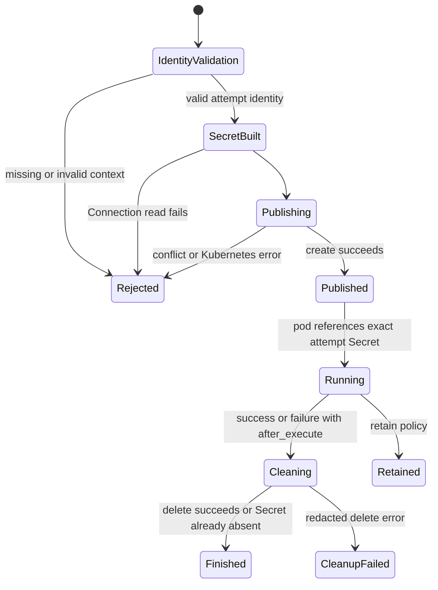
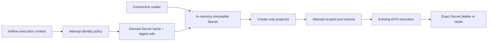

# Feature design: Airflow Connection Secret attempt isolation

- Status: IMPLEMENTED
- Owner: dpone maintainers
- Issue: Industrial Self-Service Airflow Phase 1C
- Target release: v0.72.8
Last verified: 2026-07-16

## Executive summary

The existing Airflow Connection compatibility bridge resolves connection URIs
only during task execution and projects them into a temporary Kubernetes
Secret. That boundary is correct, but the Secret currently uses one static name
from the compact pack. A second task attempt with the same projection replaces
that Secret on HTTP `409`, and either task then deletes the shared object during
cleanup. Concurrent DAG runs, mapped tasks, or retries can therefore observe
credentials from another attempt or lose their mounted Secret.

This bug/security fix makes every Airflow task attempt own one deterministic,
immutable, create-only Secret. The name is derived from Airflow's task-instance
identity (`dag_id`, `task_id`, `run_id`, `try_number`, `map_index`) through a
bounded SHA-256 suffix. The configured `secret_name` remains the human-readable
base prefix and requires no manifest migration. A collision or stale object
fails closed; dpone never replaces another attempt's Secret.

The bridge still performs no Airflow Connection, Kubernetes, Vault, database,
or network access while a DAG is parsed. No beginner command, resolver, schema,
runtime image dependency, or execution engine is added.

Measurable outcome: two concurrent task attempts that share one compact-pack
projection publish, mount, and delete different Secret objects, with zero
credential values retained on the operator or included in diagnostics.

The maintainer authorized autonomous completion of the frozen self-service
plan in this task. That authorization approves this scoped specification.

## Personas and customer journey

| Persona | Goal | Current pain | Success signal |
|---|---|---|---|
| Data engineer | Run overlapping DAG runs safely | A shared implementation detail can mix credentials across runs | No new configuration; every attempt is isolated automatically |
| Airflow operator | Diagnose bridge failures without secret leakage | Raw Kubernetes exceptions and shared names make ownership ambiguous | Stable error code, operation, status, and digest-only Secret reference |
| Security engineer | Prove least lifetime and tenant isolation | A `409` mutates an existing credential object | Create-only immutable Secret; conflict fails before pod launch |
| Platform engineer | Keep current compact packs compatible | Fixing isolation could require regenerating all packs | Existing `secret_name` remains a validated base prefix |

Journey:

1. A compact pack selects the existing `airflow_connection` operator bridge.
2. At task execution, the operator validates lifecycle policy and extracts the
   current Airflow task-attempt identity from execution context.
3. dpone derives a DNS-safe attempt Secret name without embedding raw Airflow
   IDs in the name.
4. Only then does the bridge read the declared Airflow Connections.
5. The Kubernetes adapter creates one immutable Secret. It never replaces an
   existing object.
6. The pod spec references that exact attempt Secret and runs as today.
7. Synchronous `after_execute` cleanup deletes only that attempt's Secret.
8. A retry receives a new identity through `try_number`; a mapped task receives
   a distinct identity through `map_index`.
9. A conflict, invalid/missing context, publish failure, or cleanup failure is
   reported with a stable, redacted exception and no pod launch on publish
   failure.

## Scope

### In scope

- Deterministic task-attempt identity extraction for Airflow 2.10/2.11 and
  3.2/3.3 execution contexts.
- A DNS-label-safe Secret name derived from the configured base plus a bounded
  SHA-256 task-attempt digest.
- Create-only immutable Kubernetes Secret publication.
- Exact attempt-scoped pod reference and synchronous cleanup.
- Stable typed/redacted publish, conflict, dependency, and cleanup errors.
- Removal of URI-bearing Secret payloads from persistent operator attributes.
- Concurrency, retry, mapped-task, boundary, redaction, and compatibility tests.
- Provider API, architecture, backlog, compatibility, runbook, and changelog
  updates.

### Non-goals

- A new credential resolver, generic Secret manager, or plugin framework.
- Deferrable cleanup implementation. `cleanup_policy: retain` and
  platform-managed cleanup remain required for deferrable KPO.
- Kubernetes Secret volume resolver changes in the dpone runtime.
- Airflow parse-time Connection or Kubernetes access.
- Changing compact-pack schemas or asking users to provide task IDs.
- Storing raw Airflow identifiers in Kubernetes labels, annotations, evidence,
  logs, or structured errors.
- Claiming live Kubernetes certification without an approved cluster.

### Assumptions and constraints

- Airflow execution context exposes a TaskInstance through `task_instance` or
  `ti`; its public identity fields are stable across the supported matrix.
- The bridge's configured `secret_name` is a base prefix, not a complete runtime
  object identity.
- A task-attempt digest is an isolation name, not authentication or an
  authorization decision.
- The bridge handles small connection URI payloads and remains subject to the
  Kubernetes Secret size limit.
- Credential values exist only in local variables, the transient Kubernetes
  API request, and the mounted Secret filesystem.

## Public contract

### CLI

No command, option, output shape, or exit code changes. Existing checks and
`dpone airflow explain` continue to show a digest-only bridge shape and never
expose runtime Secret names or Connection URIs.

### Python API

The existing operator import remains unchanged:

```python
from dpone_airflow_pack.operators import AirflowConnectionSecretVolumeKubernetesPodOperator
```

The injected projector port keeps its existing method names for source
compatibility:

```python
class AirflowConnectionSecretProjector(Protocol):
    def upsert(self, *, namespace: str, secret: Mapping[str, Any]) -> None: ...
    def delete(self, *, namespace: str, name: str) -> None: ...
```

For v0.72.8, `upsert` is a compatibility name with a strengthened create-only
contract. Implementations must fail on `409` and must not replace an existing
Secret. Renaming the port is deferred to a normal deprecation cycle.

New typed provider exceptions are public from `dpone_airflow_pack.operators`:

```python
class AirflowConnectionSecretProjectionError(RuntimeError):
    code: str
    operation: str
    status: int | None
    secret_ref: str

class AirflowConnectionSecretConflictError(AirflowConnectionSecretProjectionError): ...
class AirflowConnectionSecretDependencyError(AirflowConnectionSecretProjectionError): ...
```

Messages contain no URI, Secret body, raw Kubernetes response, namespace, raw
task identity, or configured Secret name. `secret_ref` is a SHA-256 reference
derived from the attempt Secret name.

The old `airflow_connection_projected_secret` attribute remains present for
one compatibility cycle but contains only a safe reference dictionary. It no
longer retains `stringData`. New code should use
`airflow_connection_projected_secret_ref`.

### Manifest/schema

No schema version changes. Existing projections remain valid:

```yaml
connection_projection:
  mode: kubernetes_secret_volume
  secret_name: dpone-airflow-connection-bridge
  cleanup_policy: after_execute
```

`secret_name` is now documented as the runtime Secret base prefix. The emitted
name is `<truncated-base>-<16 lowercase hex characters>` and is at most 63
characters. Existing names remain subject to the current DNS-label validator.

### Artifacts and evidence

No new durable artifact or evidence schema is introduced. Operator diagnostics
may retain only:

```yaml
secret_ref: sha256:...
attempt_ref: sha256:...
cleanup_policy: after_execute
```

Credential values, URI hashes, raw task IDs, namespaces, and full Secret names
are forbidden in evidence and structured diagnostics.

### Compatibility and migration

- Existing compact packs and `secret_name` values need no migration.
- Injected projectors that previously replaced on `409` must adopt the
  strengthened create-only semantic contract.
- A stale same-attempt Secret that previously would be replaced now produces
  `DPONE_AIRFLOW_CONNECTION_SECRET_CONFLICT`; the operator must remove the stale
  object after verifying no task owns it, then retry the task.
- Deferrable `retain` behavior remains unchanged.
- Rollback restores unsafe shared replacement behavior and is not recommended.

## Detailed algorithm

1. Validate `cleanup_policy` before reading any Airflow Connection.
2. Read `task_instance` or `ti` from the execution context.
3. Extract and normalize `dag_id`, `task_id`, `run_id`, `try_number`, and
   `map_index`. Missing, empty, non-integer, or boolean numeric fields fail with
   `DPONE_AIRFLOW_TASK_ATTEMPT_IDENTITY_INVALID` before Connection/Kubernetes I/O.
4. Serialize the five fields as deterministic canonical JSON and compute
   SHA-256. Keep the full digest as safe `attempt_ref`; use the first 16 hex
   characters for the Kubernetes name suffix.
5. Validate the configured base Secret name, truncate it so
   `base + '-' + suffix` is at most 63 characters, strip trailing hyphens, and
   validate the final DNS label.
6. Clone the projection in memory and replace only `secret_name` with the
   derived attempt name. Do not mutate the pack-owned projection.
7. Read each declared Airflow Connection once and build one in-memory Secret
   with `immutable: true`.
8. Create the Secret through the injected projector. On `409`, raise the stable
   conflict error; never call replace. On other errors, map only the integer HTTP
   status and operation into a stable redacted projection error.
9. Store only digest references on the operator, then patch the pod spec with
   one stable logical volume slot whose `secretName` points to the current
   attempt Secret. Reusing an operator replaces that slot instead of retaining
   an earlier attempt's volume or mount.
10. Execute the existing KPO path.
11. For synchronous `after_execute`, delete the exact attempt name in `finally`.
    Ignore `404`; redact and raise all other cleanup errors.
12. For `retain`, do not delete. Existing platform GC owns cleanup.
13. A retry or mapped task repeats the algorithm with its own Airflow identity.
    The same exact identity derives the same name; an existing object fails
    closed rather than being assumed idempotent.

### Pseudocode

```text
cleanup = validate_cleanup_policy(projection)
identity = require_task_attempt_identity(context)
attempt = derive_attempt_secret_identity(projection.secret_name, identity)
attempt_projection = copy(projection, secret_name=attempt.secret_name)

secret = build_secret(attempt_projection, airflow_connection_reader)
try:
    projector.create_only(namespace, secret)
except conflict:
    raise DPONE_AIRFLOW_CONNECTION_SECRET_CONFLICT(attempt.secret_ref)
except kubernetes_error as error:
    raise redacted_projection_error(status_only(error), attempt.secret_ref)

operator.airflow_connection_projected_secret_ref = safe_refs(attempt)
try:
    patch_pod_with_secret_ref(operator, attempt_projection)
    return existing_kpo_execute(context)
finally:
    if cleanup == after_execute:
        projector.delete(namespace, attempt.secret_name)
```

### State machine



### Ordering, retries, concurrency, and failure semantics

- Identity validation precedes credential reads and Kubernetes calls.
- Publication precedes pod construction/launch with the runtime reference.
- A task never observes another task's configured Secret name because the pod
  receives only the derived attempt name.
- Parallel attempts with different identity tuples cannot intentionally share a
  name. A truncated SHA-256 collision is handled as a fail-closed `409`.
- A retry changes `try_number` and receives a new Secret. A mapped task changes
  `map_index` and receives a new Secret.
- Same-attempt double execution collides and fails closed. dpone does not guess
  which process owns the object.
- `404` during cleanup is idempotent success. Other cleanup failures are visible
  and leave the immutable Secret for operator/GC recovery.
- No checkpoint, release, deployment, pack, or runtime evidence identity changes.

### Edge cases

- Empty context, missing TaskInstance, empty IDs, boolean/inexact numeric values:
  reject before secret reads.
- Maximum-length base name: deterministically truncated; suffix preserved.
- Invalid base name: existing validation error before Connection read.
- `map_index=-1`: valid unmapped identity.
- `try_number=0`: accepted when supplied by the supported Airflow context; it is
  part of the identity rather than interpreted as lifecycle policy.
- Connection reader failure: no Kubernetes Secret is created.
- Publish `409`: no replace, pod patch, or cleanup of the existing object.
- Pod build or execution failure after publish: exact attempt cleanup runs.
- Delete `404`: treated as already clean.
- Deferrable plus `after_execute`: existing fail-closed validation remains first.

## Architecture

### Components and responsibilities

| Component | Existing/new | Responsibility | Dependencies |
|---|---|---|---|
| `AirflowTaskAttemptIdentity` | New value object | Validate the five Airflow identity fields | Python stdlib only |
| Attempt Secret identity helper | New pure policy | Canonicalize, hash, bound, and validate runtime name | identity value + existing name validator |
| Operator bridge | Existing adapter | Orchestrate execution-time read, publish, patch, execute, cleanup | reader/projector ports + pure identity policy |
| Kubernetes projector | Existing adapter | Create/delete Secret and redact vendor failures | lazy Kubernetes client import |
| Pod patch helpers | Existing | Materialize only Secret references | attempt projection |

### Ports, adapters, and composition root

The operator remains the Airflow composition root. Identity derivation is pure
provider policy and imports no Airflow model class, allowing the same duck-typed
context across Airflow 2 and 3. The `ConnectionUriReader` and
`AirflowConnectionSecretProjector` remain minimal injected ports. Only the
default projector lazily imports the Kubernetes client during task execution.

No dpone domain/runtime module imports Airflow or Kubernetes. No service locator,
global client, second resolver, or speculative plugin abstraction is added.

### Data and control flow



### Alternatives and tradeoffs

| Alternative | Advantages | Disadvantages | Decision |
|---|---|---|---|
| Keep static name and replace | Simple, current behavior | Cross-run credential overwrite/delete | Reject |
| Kubernetes `generateName` | Server-generated uniqueness | Runtime name must be returned and threaded into pod patch; weaker deterministic retry diagnostics | Reject for this slice |
| Random UUID | Very low collision chance | Non-deterministic retry/recovery; harder tests and correlation | Reject |
| Raw Airflow IDs in name | Human-readable | Leaks identifiers, exceeds bounds, unsafe characters | Reject |
| Full SHA-256 suffix | Strongest collision resistance | Leaves almost no useful prefix under 63-char label policy | Reject; keep full digest in safe ref |
| Deterministic 16-hex suffix + create-only | Bounded, testable, isolated, fail-closed collision behavior | Theoretical collision handled operationally as conflict | Adopt |

### ADR requirement

No new ADR. ADR 0005 already assigns credentials to task/runtime execution and
the provider API already defines the operator-side bridge. This change repairs
its resource identity/lifecycle implementation without changing architectural
ownership or adding a long-lived extension point.

### Quality-budget impact

Attempt identity and naming policy live in one new cohesive module below the
400-SLOC hard limit. `operators.py` remains an adapter and delegates pure policy.
`operator_runtime.py` does not absorb another responsibility and is already near
the warning threshold. No canonical package dependency edge is added.

## Market comparison

The named ETL comparators (dlt, Informatica, Airbyte, Fivetran, Pentaho, SSIS,
gusty, Astronomer Cosmos, and Apache Beam) are `N/A`: this is a correctness fix
inside dpone's existing Airflow/Kubernetes compatibility adapter, not a new ETL
capability or competitive product claim.

Relevant platform facts were checked against official primary documentation on
2026-07-16:

- Airflow 3 defines a task-instance key from `dag_id`, `task_id`, `run_id`,
  `try_number`, and `map_index`, and its execution context exposes the current
  TaskInstance. [Airflow public interface](https://airflow.apache.org/docs/apache-airflow/3.0.3/public-airflow-interface.html),
  [Airflow template context](https://airflow.apache.org/docs/apache-airflow/stable/templates-ref.html)
- KPO performs Kubernetes API work at task execution and supports synchronous
  and deferrable modes; callback behavior differs in async mode.
  [KubernetesPodOperator](https://airflow.apache.org/docs/apache-airflow-providers-cncf-kubernetes/stable/operators.html)
- Kubernetes object names are unique per resource type and namespace; Secret
  updates can affect mounted consumers, and immutable Secrets prevent data
  mutation. [Kubernetes object names](https://kubernetes.io/docs/concepts/overview/working-with-objects/names/),
  [Kubernetes Secrets](https://kubernetes.io/docs/concepts/configuration/secret/)

Facts above justify the identity and create-only lifecycle. The conclusion that
the current replace/delete sequence can cross-contaminate attempts is a dpone
code inference verified by concurrency tests, not a claim made by those sources.

## Measurable differentiation

```yaml
axis: concurrent task-attempt credential isolation
scenario: two KPO task attempts share one compact-pack connection projection
baseline: v0.72.7 static Secret name with replace-on-409
metric: cross-attempt Secret name overlap and replace/delete operations
target: zero overlap, zero replace calls, exact one-create/one-delete per synchronous attempt
procedure: deterministic concurrent contract test with distinct run/map/try identities
artifact: test_artifacts/airflow-self-service-v0728-secret-isolation/validation-report.md
limitations: mocked Kubernetes contract proof; live cluster certification remains UNVERIFIED without an approved environment
```

## Security, privacy, and operations

- Secret values and connection URIs never enter operator arguments, pod env,
  XCom, durable evidence, diagnostics, or operator attributes.
- Raw task IDs, run IDs, namespaces, configured Secret names, and Kubernetes
  response bodies are excluded from structured error messages.
- The default Secret is immutable and create-only.
- The operator ServiceAccount still needs only create/delete for attempt Secrets;
  `replace` is no longer required by this adapter.
- Platform policy should restrict those verbs and use resource quotas/GC for
  retained or cleanup-failed Secrets.
- Alert on conflict, publish failure, and cleanup failure codes. A conflict is
  not auto-repaired because ownership is ambiguous.
- Operator recovery: verify the owning task is no longer active, delete the
  digest-correlated stale Secret through the platform runbook, and retry. dpone
  does not emit the physical name in ordinary logs.

## Test and certification plan

| Layer | Scenario | Environment | Expected artifact |
|---|---|---|---|
| Unit | Identity extraction and deterministic bounded names | Local | focused pytest result |
| Unit | retry/map/run differences and maximum base | Local | focused pytest result |
| Contract | create-only `409`, redacted create/delete errors | Fake Kubernetes API | focused pytest result |
| Concurrency | two attempts publish/mount/delete different names | Injected projector | focused pytest result |
| Security | missing context fails before Connection read; no URI retained | Local | focused pytest result |
| Compatibility | old projection requires no schema migration | Existing pack fixtures | provider regression result |
| Parse safety | provider import performs no Airflow Connection/Kubernetes I/O | Local | existing parse tests |
| Live certification | real Airflow KPO + Kubernetes Secret lifecycle | Approved cluster only | `UNVERIFIED` unless executed |

Required negative cases include raw exception payloads containing credential-like
text, `409`, `404`, `500`, empty context, malformed numeric identity, long base,
same-attempt duplicate execution, mapped tasks, retries, pod execution failure,
and deferrable `after_execute` rejection.

## Documentation plan

- Provider API: attempt-scoped naming, strengthened projector contract, typed
  errors, and compatibility attribute.
- Self-service architecture: concurrency and execution-order invariant.
- Backlog: mark the attempt-isolation portion of the bridge complete while live
  certification/deferrable GC remain partial.
- Compatibility: no pack migration; `409` behavior intentionally fails closed.
- Operator runbook: conflict and cleanup recovery without logging Secret values.
- Changelog: security/correctness fix.

## Rollout and rollback

The behavior is enabled unconditionally for the bridge because preserving the
shared mutable Secret would preserve a credential-isolation defect. Rollout
requires provider package deployment and removal of obsolete `replace` RBAC
after compatibility verification. Existing compact packs continue to load.

Post-release verification runs overlapping DAG runs, one mapped task, and one
retry, then proves distinct Secret UIDs and eventual cleanup. Rollback is a code
revert and reopens the defect; if forced, operators must serialize all bridge
tasks by pool until the fixed provider is restored.

## Agent execution plan

One integrator owns all writes because the change crosses one provider lifecycle
and shared documentation contract. Read-only architecture, tests/security, and
docs/UX reviews are requested before integration. No parallel writer edits the
same package files.

## Approval checklist

- [x] User problem and CJM are clear.
- [x] Algorithm and failure semantics are implementable without guessing.
- [x] Public contracts and compatibility are explicit.
- [x] Architecture and alternatives are justified.
- [x] Relevant research uses current official primary sources; ETL comparators are correctly `N/A`.
- [x] Claimed differentiation is measurable.
- [x] Tests, evidence, docs, rollout, and rollback are complete.
- [x] Path ownership and integration plan are conflict-safe.
- [x] Maintainer direction authorized autonomous completion.

## Implementation evidence

The approved contract is implemented and validated on 2026-07-16. The exact
commands, automated results, fresh-context review conclusions, packaging smoke,
and explicitly unverified live-cluster scope are recorded in
[`test_artifacts/airflow-self-service-v0728-secret-isolation/validation-report.md`](../test_artifacts/airflow-self-service-v0728-secret-isolation/validation-report.md).
