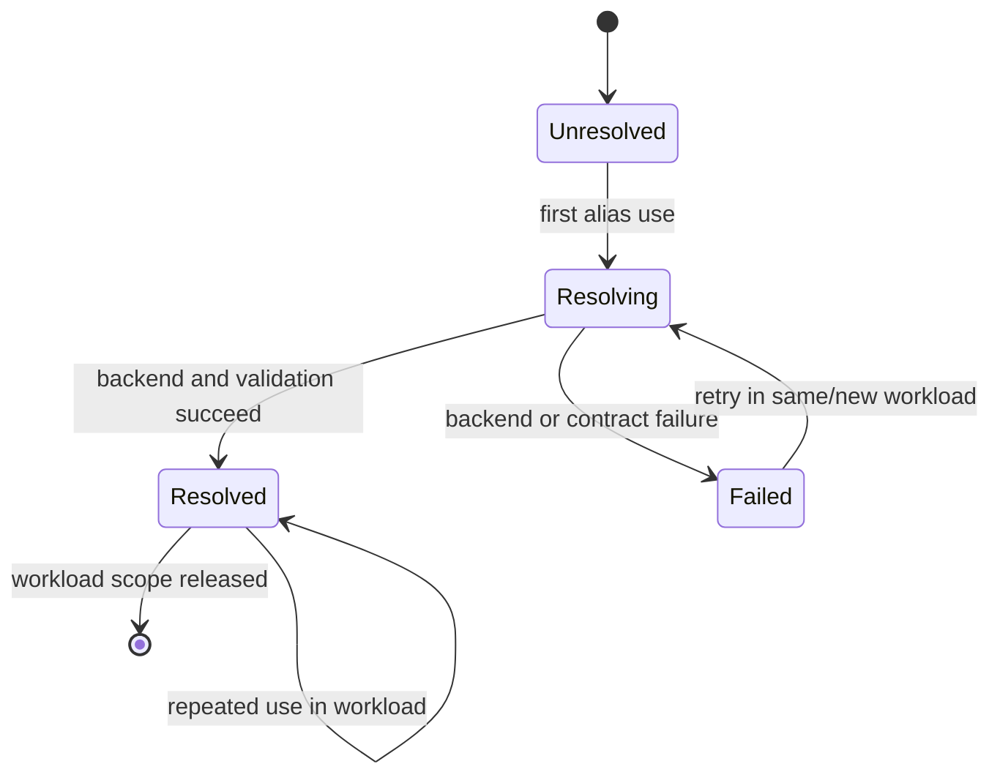
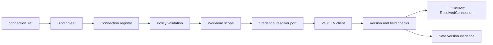

# Feature design: Airflow credential resolver lifecycle certification v1

- Status: IMPLEMENTED
- Owner: dpone maintainers
- Approval: maintainer request to complete the frozen Industrial Self-Service
  Airflow roadmap as one goal
- Target release: 0.73.0
- Last verified: 2026-07-17
- Base commit: `26105f83`
- Validation evidence:
  `test_artifacts/airflow-credential-resolver-lifecycle-v1/validation-report.md`
- Live certification: UNVERIFIED (no approved Vault, Kubernetes, or Airflow
  environment was used)

## Executive summary

dpone already resolves logical `connection_ref` aliases at runtime and caches
each result for one workload. The frozen Airflow architecture promises that a
workload keeps one resolved credential version while a later workload can see a
rotation. Two accepted schema values currently overstate the implementation:
`version_policy: pinned` still reads the latest Vault value, and
`resolution_scope: dag_run_start` is composed through a workload-scoped cache.
Vault KV v2 responses without version metadata are also accepted, which makes
rotation evidence unverifiable.

This slice makes the existing lifecycle fail closed and certifies its local
semantics. `latest + workload_start` is the production Vault golden path.
Unsupported pinned and DAG-run scopes receive stable, secret-free errors before
backend I/O. A successful Vault KV v2 resolution must report the actual positive
secret version, and every declared secret field must exist and be non-empty.
Failures are never cached; already resolved workloads retain their in-memory
credentials, while a new workload retries after recovery.

Success means dpone can prove rotation, outage and recovery behavior without
claiming that a local fake certifies real Vault, Kubernetes or Airflow
infrastructure. Those live profiles remain `UNVERIFIED` until current approved
evidence exists.

## Personas and customer journey

| Persona | Goal | Current pain | Success signal |
| --- | --- | --- | --- |
| Data engineer | Use a logical connection without learning Vault paths | A backend failure can surface late and without an actionable code | `dpone check --connections` rejects unsupported policy before a run |
| Platform engineer | Rotate a production secret without rebuilding releases | Rotation semantics are documented but not fully proved | Active workload keeps N; next workload resolves N+1 |
| Airflow operator | Recover after a Vault outage | It is unclear whether a failed lookup poisoned later attempts | Failure is not cached and a new attempt succeeds after recovery |
| Security engineer | Audit credential evidence | Missing versions and raw backend errors weaken proof or leak context | Evidence contains only alias, resolver, safe version and timestamp |

Journey:

1. The pipeline author keeps using `connection_ref`; no Vault path is added to
   the pipeline or DAG.
2. Static readiness validates the registry policy without network or secrets.
3. At workload start the runtime validates policy again before backend I/O.
4. `WorkloadScopedCredentialResolver` resolves each alias once under a lock.
5. Vault KV returns values plus version metadata; dpone validates both before
   constructing `CredentialsConfig`.
6. Repeated uses inside the workload receive the same in-memory resolution.
7. A new workload creates a fresh scope and can observe a newer Vault version.
8. If resolution fails, no value is cached. The operator follows the runbook,
   restores the dependency and retries the workload.
9. Safe evidence records the actual version used. Secret values, Vault paths and
   backend response bodies are never emitted.

## Scope

### In scope

- Stable `CredentialResolutionError` carrying a safe error code and resolver.
- Runtime rejection of unimplemented `pinned` and `dag_run_start` semantics
  before credential backend I/O.
- Readiness errors for the same unsupported policies.
- Mandatory positive version metadata for Vault KV v2 `latest` resolution.
- Required non-empty values for every declared credential field mapping.
- Safe wrapping of Vault backend failures without response/path leakage.
- Deterministic workload rotation, outage, recovery and concurrency tests.
- Resolver certification matrix and operator recovery runbook.
- Explicit local `PASS` versus live `UNVERIFIED` evidence.

### Non-goals

- Implementing historical Vault data-version reads.
- Implementing a DAG-run-wide credential snapshot.
- Refreshing a credential inside a running workload.
- Adding a generic credential plugin framework or a new CLI command.
- Changing connection-registry schema syntax or embedding secret values.
- Certifying real Vault Kubernetes Auth, Kubernetes volume projection or an
  Airflow external Secrets Backend without an approved live environment.

### Assumptions and constraints

- The installed `vault-kv-client` API selects KV engine version, not a historical
  secret data version; therefore `pinned` cannot be implemented truthfully here.
- `resolution_scope: workload_start` is the only runtime scope composed today.
- A Vault KV v2 response is only auditable when it includes a positive version.
- A declared field mapping is a required credential contract, not an optional
  projection.
- A successful in-memory resolution is intentionally retained until its
  workload object is released; no secret is persisted by the scope.

## Public contract

### CLI and readiness

No new command is added. Existing `dpone check ... --connections` reports:

- `DPONE_CREDENTIAL_PINNED_VERSION_UNSUPPORTED` when `version_policy: pinned`;
- `DPONE_CREDENTIAL_DAG_RUN_SCOPE_UNSUPPORTED` when
  `resolution_scope: dag_run_start`.

Both are actionable user-configuration errors with exit code `1`. Static check
remains network- and secret-free. `--live` may still fail with dependency exit
code `3` under its existing contract.

### Python API and exceptions

```python
from dpone.contracts.credential_resolution import CredentialResolutionError
from dpone.runtime.credentials.binding_resolver import VaultSecretSnapshot

try:
    connection = resolver.resolve("pg_prod")
except CredentialResolutionError as error:
    print(error.code, error.resolver)
```

The injected Vault port may return `VaultSecretSnapshot(data=..., version=...)`.
Legacy mapping adapters remain readable, but only their reserved
`_metadata.version` envelope can supply version evidence.

`CredentialResolutionError` remains a `ValueError` subtype for compatibility.
Its string contains only a fixed safe message. Public fields are `code` and
`resolver`; it never carries a Vault path, response, token or secret value.

Additional runtime codes:

- `DPONE_CREDENTIAL_VERSION_METADATA_MISSING`;
- `DPONE_CREDENTIAL_FIELD_MISSING`;
- `DPONE_CREDENTIAL_BACKEND_UNAVAILABLE`.

Safe-sample source/sink resolution and temporary-target lifecycle preserve these
codes in their existing structured error arrays. Unknown resolver exceptions
remain collapsed to the existing generic safe-sample code so arbitrary backend
text cannot escape.

### Manifest/schema

The v1 connection-registry schema keeps accepting `pinned` and
`dag_run_start` so old files remain parseable and migration diagnostics can be
shown. These values are not executable in this release. The only certified
Vault combination is:

```yaml
version_policy: latest
resolution_scope: workload_start
```

Migration replaces unsupported values with this pair unless the workload truly
requires a historical/DAG-wide snapshot; such a workload remains blocked until
a future explicit contract exists.

### Artifacts and evidence

Successful Vault resolution retains the existing safe metadata contract:

```yaml
connection_ref: pg_prod
resolver: vault_kv
version_policy: latest
resolution_scope: workload_start
resolved_version: 18
resolved_at: 2026-07-17T12:03:11Z
```

Failed resolution emits no success evidence. The certification artifact records
scenario status and error code only. Secret values, hashes, Vault paths, tokens,
responses and sensitive lease identifiers are forbidden.

### Compatibility and migration

- Existing valid `latest + workload_start` behavior is unchanged except that KV
  v2 now requires version metadata and mapped values cannot be missing/empty.
- Unsupported values fail earlier and with stable diagnostics instead of
  silently executing different semantics.
- The schema is unchanged to avoid destroying diagnostic compatibility.
- Rollback is code-only. No generated release/deployment artifact migration is
  required because secret values and resolved versions are runtime evidence.

## Detailed algorithm

1. Normalize and validate the logical connection alias.
2. Resolve its binding and registry entry without reading credentials.
3. Validate `version_policy` and `resolution_scope` syntax.
4. Reject `pinned` or `dag_run_start` with a stable error before backend I/O.
5. Select the existing resolver adapter using injected dependencies.
6. For Vault, validate logical mount/path and invoke the client once.
7. Convert any backend exception to `DPONE_CREDENTIAL_BACKEND_UNAVAILABLE`
   without copying backend text.
8. Normalize one atomic `VaultSecretSnapshot`. For legacy mapping adapters,
   only the reserved `_metadata.version` envelope is recognized; ordinary
   secret fields named `version` or `metadata` are never evidence.
9. For KV v2, require a positive integer snapshot version.
10. Map every declared credential field and reject a missing/empty value before
   constructing `CredentialsConfig`.
11. Build the resolved connection and secret-free metadata.
12. Store it in `WorkloadScopedCredentialResolver` only after all steps succeed.
13. Repeated calls in the same scope return the same object under the existing
   lock. A failed call leaves the cache unchanged.
14. A new workload creates a new scope and performs a new backend read.

### Pseudocode

```text
resolve_in_workload(ref):
    lock
    if ref in cache:
        return cache[ref]

    result = delegate.resolve(ref)       # exception => no cache entry
    cache[ref] = result
    return result

resolve_vault(ref, policy):
    validate policy syntax
    if policy.version == pinned:
        fail PINNED_VERSION_UNSUPPORTED
    if policy.scope == dag_run_start:
        fail DAG_RUN_SCOPE_UNSUPPORTED

    try:
        payload = vault.get_secret(logical_mount, logical_path)
    except Exception:
        fail BACKEND_UNAVAILABLE

    if kv_version == 2 and positive_version(payload) is missing:
        fail VERSION_METADATA_MISSING
    values = map_declared_fields(payload)
    if any declared value is missing or empty:
        fail FIELD_MISSING
    return ResolvedConnection(values, safe_version_metadata)
```

### State machine



### Rotation and recovery scenario

1. Workload A reads Vault version 17 and caches it.
2. Vault rotates to 18. Workload A still returns its exact version-17 object.
3. Workload B starts with a new scope and reads version 18.
4. Vault becomes unavailable. New workload C fails and caches nothing.
5. Already resolved workload B still returns version 18 without a backend call.
6. Vault recovers at version 19. Retrying C or starting D resolves version 19.

### Edge cases

- Concurrent calls for one alias serialize and perform one backend read.
- Different aliases are independently cached in the same workload.
- Empty field values fail closed even if the connector could fail later.
- KV v1 may omit version metadata and reports `resolved_version: null`; it is
  not advertised as rotation-version certified.
- A process crash loses the in-memory cache; retry is a new workload resolution.
- Secret rotation between parallel workload starts may yield different versions,
  which is the documented `workload_start` behavior.
- There is no checkpoint or durable transaction to roll back.

## Architecture

### Components and responsibilities

| Component | Existing/new | Responsibility | Dependencies |
| --- | --- | --- | --- |
| `BindingCredentialResolver` | Existing, changed | Resolve one backend-neutral binding and build safe metadata | Minimal resolver ports |
| `CredentialResolutionError` | New | Stable safe runtime error contract | Python only |
| `WorkloadScopedCredentialResolver` | Existing | One successful resolution per alias per workload | Resolver protocol, lock |
| Credential readiness checks | Existing, changed | Reject unsupported configuration without backend I/O | Pure validation helpers |
| Lifecycle contract tests | New | Prove rotation/outage/recovery/concurrency locally | Injected fake port |
| Resolver runbook | New | Explain operation, diagnosis and certification status | Public contracts |

### Ports, adapters, and composition root

`BindingCredentialResolver` continues to depend on the minimal `VaultKvClient`
and `KubernetesSecretReader` protocols. Vendor imports remain lazy in the
runtime-only default composition. `safe_sample_live_runtime` remains the
composition root and creates a new `WorkloadScopedCredentialResolver` per
workload. No Airflow parse module imports Vault or these runtime adapters.

### Data and control flow



### Alternatives and tradeoffs

| Alternative | Advantages | Disadvantages | Decision |
| --- | --- | --- | --- |
| Treat `pinned` as latest | No immediate migration | False reproducibility and violates Liskov semantics | Rejected |
| Add historical version to current client port now | Implements pinned reads | Installed client API does not expose data version; expands scope | Rejected for this slice |
| Cache globally | Fewer backend calls | Cross-workload rotation and secret lifetime bugs | Rejected |
| Refresh inside workload | Faster rotation | One workload could use two credential versions | Rejected |
| Require version for every resolver | Uniform evidence | Volume/Airflow bridge may not expose a version | Rejected |
| Require version for Vault KV v2 | Auditable primary path | Stricter than previous acceptance | Adopted |

### ADR requirement

No new ADR. ADR 0012 already fixes runtime-side Vault authentication and
workload-start rotation. This change enforces that decision and documents
unsupported policies; it does not introduce a new architectural direction.

### Quality-budget impact

The error value object is isolated in a small module. Resolver policy remains in
the cohesive binding resolver; no generic registry or new dependency edge to a
vendor SDK is added. The existing over-budget test module is not expanded; new
lifecycle tests live in a dedicated file. Module/import budgets must remain
green against `docs/benchmarks/quality_budgets.yml`.

## Market comparison

The capability under test is dpone's internal late-binding credential lifecycle,
not source/sink loading or DAG generation. Managed ELT products do not expose a
substitutable runtime resolver contract, so forced feature scoring would be
misleading.

| System/version | Relevant capability | Observed design | Adopt/reject | Source/date |
| --- | --- | --- | --- | --- |
| HashiCorp Vault KV v2 | Versioned runtime secret reads | Versions increment; current read and recovery are explicit | Adopt actual version evidence and fail closed on ambiguity | [Vault KV v2](https://developer.hashicorp.com/vault/docs/secrets/kv/kv-v2), 2026-07-17 |
| HashiCorp Vault Kubernetes Auth | Workload identity | ServiceAccount JWT authenticates a workload to a Vault role | Adopt runtime-side identity; reject tokens in artifacts | [Vault Kubernetes Auth](https://developer.hashicorp.com/vault/docs/auth/kubernetes), 2026-07-17 |
| Kubernetes Secret volume | Pod-projected credentials | Secret volumes are read-only; `subPath` mounts do not receive updates | Adopt volume projection and document workload-start snapshot | [Kubernetes volumes](https://kubernetes.io/docs/concepts/storage/volumes/), 2026-07-17 |
| Apache Airflow 3.x | Task-time Connections | Connections are consumed at task execution; KPO is the pod boundary | Keep operator bridge out of parse/runtime Vault path | [Airflow Connections](https://airflow.apache.org/docs/apache-airflow/stable/howto/connection.html), 2026-07-17 |
| dlt, Informatica, Airbyte, Fivetran, Pentaho, SSIS | N/A | Their product secret UX does not define dpone's injected resolver lifecycle | N/A; no unqualified comparison | Checked 2026-07-17 |
| gusty, Astronomer Cosmos, Apache Beam | N/A | DAG/project/processing tools do not own this credential version contract | N/A; no unqualified comparison | Checked 2026-07-17 |

## Measurable differentiation

```yaml
axis: deterministic credential version within one workload
scenario: Vault KV v2 rotates N to N+1, becomes unavailable, then recovers
baseline: current dpone accepts unsupported policy and missing version metadata
metric: wrong-version transitions, backend reads per alias/workload, secret leaks, false PASS claims
target: 0 wrong transitions; 1 successful read per alias/workload; 0 leaks; live status UNVERIFIED without evidence
procedure: deterministic lifecycle suite plus optional approved live profile
artifact: test_artifacts/airflow-credential-resolver-lifecycle-v1/validation-report.md
limitations: injected local fakes do not certify Vault auth, network, Kubernetes projection or Airflow Secrets Backend
```

## Security, privacy, and operations

- No backend call occurs during Airflow parse or static readiness.
- Runtime errors never interpolate Vault paths, response text or field values.
- The registry body remains restricted deployment input and is not serialized
  into DAGs.
- Secret values stay in memory and are not hashed into evidence.
- Existing resolved workloads do not contact an unavailable backend again.
- Operator retry happens at the workload boundary after dependency recovery.
- Live claims require current evidence from the exact environment and commit.

## Test and certification plan

| Layer | Scenario | Environment | Expected artifact |
| --- | --- | --- | --- |
| Unit | one resolution, failure not cached, concurrent calls | Local | pytest result |
| Contract | pinned/DAG scope fail before I/O; KV2 version and fields required | Local | pytest result |
| Lifecycle | N to N+1 rotation, outage, retained active scope, recovery N+2 | Local injected port | certification JSON/report |
| Security | backend/path/secret text absent from errors and evidence | Local | pytest result |
| Readiness | stable structured codes, no network | Local | pytest result |
| Compatibility | valid latest/workload behavior and schema remain accepted | Local | pytest result |
| Live Vault/K8s | Kubernetes Auth, rotation and outage | Approved cluster only | `UNVERIFIED` until run |
| Live Airflow bridge | external Secrets Backend rotation | Approved Airflow only | `UNVERIFIED` until run |

## Documentation plan

- Add an operator lifecycle and recovery runbook with a resolver certification
  matrix.
- Link it from credential quickstart, self-service architecture/provider docs,
  compatibility and the Phase 3 backlog.
- Keep the beginner path alias-only; Vault paths appear only in platform-owned
  examples and never in normal diagnostics.
- Update the changelog and attach a validation report.

## Rollout and rollback

Ship as a fail-closed correctness fix. Readiness finds unsupported policies
before runtime. Operators migrate to `latest + workload_start`. Roll back the
code if valid golden-path resolution regresses; no release/deployment rebuild is
required. Do not weaken errors to warnings because that would restore false
semantics.

## Agent execution plan

| Agent/role | Owned paths | Read-only paths | Forbidden paths | Dependency |
| --- | --- | --- | --- | --- |
| Integrator | Spec, runtime resolver/error, readiness, tests, docs, evidence, changelog | ADR 0012, safe-sample composition, schemas | `.cursor`, workflows, dependency locks | Existing Phase 1B runtime |
| Fresh reviewer | Read-only final diff | All changed paths | All writes | Completed validation |

The current Codex task is the integrator and shared-file owner. Parallel agent
capacity was unavailable at design time; independent review must be recorded as
`UNVERIFIED` unless a fresh reviewer becomes available before integration.

## Approval checklist

- [x] User problem and CJM are clear.
- [x] Algorithm and failure semantics are implementable without guessing.
- [x] Public contracts and compatibility are explicit.
- [x] Architecture and alternatives are justified.
- [x] Relevant market research uses current official sources.
- [x] Claimed differentiation is measurable.
- [x] Tests, evidence, docs, rollout, and rollback are complete.
- [x] Path ownership and integration plan are conflict-safe.
- [x] Maintainer authorized completion of the frozen roadmap as one goal.
