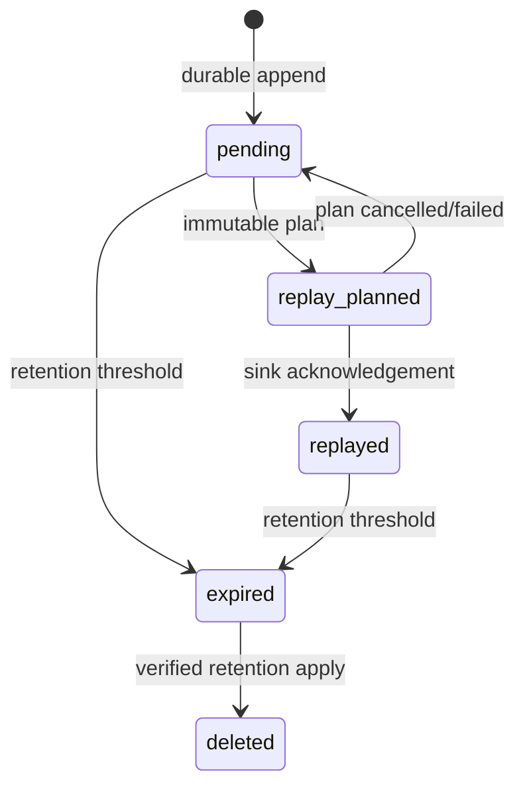
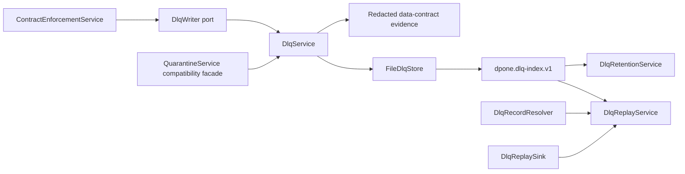

# Feature design: first-class DLQ v1

- Status: APPROVED
- Owner: dpone maintainers
- Issue: Industrial Self-Service Airflow roadmap, Phase 2
- Target release: TBD
- Last verified: 2026-07-16
- Approval basis: standing maintainer instruction to complete the frozen roadmap

## Executive summary

dpone already quarantines contract-invalid rows and CDC poison events, but the
row quarantine API is not a safe industrial DLQ contract. It persists raw rows
in JSONL, uses free-form reasons, has no retention state, and its generic
`quarantine-replay --yes` reports rows as applied without calling any target.
Data-contract evidence also serializes accepted target rows and actual invalid
values. These behaviors are incompatible with the frozen self-service
requirement that DLQ artifacts are bounded, replayable, auditable, and free of
unmasked PII.

This slice introduces one connector-neutral `dpone.dlq.v1` record contract,
stable reason taxonomy, safe file store, plan-first replay, and mark-and-sweep
retention. Existing data-contract enforcement becomes the first adapter. CDC
keeps its specialized event contracts in v1 and may adopt the common envelope
later; this slice does not rewrite the CDC runtime.

The ordinary user only selects `schema_contract.enforcement: quarantine`. Safe
defaults require no DLQ-specific configuration:

```yaml
sink:
  options:
    schema_contract:
      enforcement: quarantine
    dlq:
      retention_days: 30
      pii_policy: reference_only
```

No new beginner command is added. Operators continue through the existing
`dpone ops quarantine-*` facade; it delegates to the canonical DLQ services.

## Personas and journey

| Persona | Goal | Current pain | Success signal |
| --- | --- | --- | --- |
| First-time engineer | Continue loading valid rows safely | Quarantine requires knowing directories and raw JSONL | One manifest setting produces a safe DLQ summary and runbook |
| Data engineer | Understand why rows were excluded | Free-form messages are hard to aggregate | Stable category/code, column, stage, count, and record reference |
| Airflow operator | Distinguish success with quarantine | Runtime success hides data outcome | Evidence says `execution_status: succeeded` and `data_outcome: passed_with_quarantine` |
| Security owner | Prevent PII leakage | Current JSONL/evidence can contain complete rows | Default artifacts contain no row values or `actual_value` |
| Platform engineer | Retain and delete records predictably | No lifecycle or protected-state model | Plan-first mark-and-sweep with active/replay protection |
| Recovery operator | Replay safely | Existing `--yes` does not write a target | Immutable plan plus injected resolver/sink and idempotency key |

Journey:

1. The user chooses `schema_contract.enforcement: quarantine`; `dlq` may be
   omitted.
2. Static validation resolves the safe policy before runtime.
3. Contract enforcement routes only valid rows to staging.
4. For each invalid row, the runtime writes a create-only DLQ record containing
   a logical original-record reference and redacted diagnostics.
5. Target finalization and source-state advancement follow the existing
   quarantine semantics: they may proceed only after valid rows are committed
   and every rejected row has been durably recorded.
6. Evidence reports counts, reason distribution, record IDs, and the DLQ index
   reference without row values.
7. An operator inspects or exports safe metadata with the existing ops facade.
8. Replay first builds an immutable plan. Execution requires an injected record
   resolver and sink; acknowledgements are recorded one record at a time.
9. Retention builds a deletion plan and protects unresolved, active, or
   evidence-pinned records before any deletion.

## Scope

### In scope

- `dpone.dlq.v1` record, index, replay-plan/result, and retention-plan/result
  contracts.
- Stable reason categories and codes for schema-contract quarantine.
- `reference_only`, `masked`, and compatibility-only `preserve` PII modes.
- Create-only local file store with confined paths, size bounds, checksum, and
  deterministic read order.
- Plan-first replay with injected record resolver and sink ports.
- Per-record idempotency keys and append-only replay acknowledgements.
- Plan-first mark-and-sweep retention with protected record states.
- Runtime data-contract adapter and safe evidence projection.
- Existing `dpone ops quarantine-export` and `quarantine-replay` compatibility
  facade; false apply claims are removed.
- Documentation, schemas, negative tests, benchmark, and migration guidance.

### Non-goals

- A second ETL executor or connector-specific replay implementation.
- Persisting production credentials or secret values in DLQ artifacts.
- Encrypting raw rows. No encryption/key-management subsystem is introduced.
- Automatically replaying into a target from a generic CLI command.
- Rewriting CDC poison quarantine or typed CDC parse quarantine in v1.
- Treating DLQ as a substitute for source correction, quality policy, or schema
  evolution.
- Airflow Dynamic Task Mapping for individual DLQ rows.

## Public contract

### Authoring

Canonical optional runtime policy:

```yaml
dlq:
  enabled: true
  directory: .dpone/dlq
  retention_days: 30
  pii_policy: reference_only  # reference_only | masked | preserve
  max_record_bytes: 262144
  max_diagnostic_bytes: 16384
  max_records_per_run: 100000
  max_index_bytes: 67108864
```

Rules:

- omission resolves to the values above when enforcement is `quarantine`;
- `retention_days` is `1..3650`;
- `max_record_bytes` is `4096..1048576`;
- `max_diagnostic_bytes` is `1024..65536` and cannot exceed
  `max_record_bytes`;
- `max_records_per_run` is `1..1000000` and bounds one runtime service/run;
- `max_index_bytes` is `1MiB..512MiB` and bounds atomic index publication;
- `reference_only` stores no payload;
- `masked` preserves object/list shape but replaces every scalar with
  `[REDACTED]`;
- `preserve` is a deprecated compatibility mode, forbidden when environment is
  production unless an explicit platform policy allows it;
- directories are resolved beneath the configured project/runtime root;
- legacy `quarantine.dir` maps to the new directory but keeps the legacy
  storage facade for compatibility.

### Record schema

```yaml
schema: dpone.dlq.v1
record_id: 01J...
run_id: 01J...
load_id: 01J...
record_ref: dpone://runs/01J.../loads/01J.../rows/42
reason:
  category: schema_validation
  code: schema.type_mismatch
  stage: contract_enforcement
  column: amount
  message: Value does not match the declared logical type.
diagnostics:
  expected_type: decimal
  actual_type: string
payload:
  policy: reference_only
  value: null
replay:
  status: pending
  replayable: true
created_at: 2026-07-16T12:00:00Z
expires_at: 2026-08-15T12:00:00Z
sha256: sha256:...
```

`sha256` excludes itself and uses the repository canonical JSON fingerprint
utility. Volatile `created_at` and `expires_at` are intentionally part of record
identity because they describe this quarantine event, while replay plan identity
sorts and hashes record IDs and policy without build timestamps.

Reason categories:

| Category | Initial stable codes |
| --- | --- |
| `schema_validation` | `schema.required_null`, `schema.type_mismatch` |
| `source_decode` | `source.decode_failed` |
| `transform` | `transform.failed` |
| `quality` | `quality.rule_failed` |
| `sink_rejection` | `sink.row_rejected` |
| `cdc_poison` | `cdc.poison` |
| `unknown` | `unknown.unclassified` |

Adapters may use only registered codes. Unknown vendor messages map to
`unknown.unclassified`; raw exception text never becomes a reason code.

### Outcomes and evidence

```yaml
execution_status: succeeded
data_outcome: passed_with_quarantine
dlq:
  schema: dpone.dlq-index.v1
  record_count: 1
  record_ids: [01J...]
  reasons:
    schema.type_mismatch: 1
  index_ref: file://.dpone/dlq/runs/01J.../index.json
```

Evidence never includes `target_rows`, source row values, `actual_value`, raw
exceptions, credentials, tokens, or signed URLs. `ContractEnforcementResult`
remains an in-memory runtime object and may still expose accepted rows to the
staging layer; only its evidence projection is redacted.

### Python API and ports

```python
class DlqWriter(Protocol):
    def write_rejected(
        self,
        *,
        run_id: str,
        load_id: str,
        row: Mapping[str, object],
        row_index: int,
        rejection: DlqRejection,
    ) -> DlqWriteReceipt: ...

class DlqStore(Protocol):
    def append(self, record: DlqRecord) -> DlqRecord: ...
    def records(self, run_id: str) -> tuple[DlqRecord, ...]: ...

class DlqRecordResolver(Protocol):
    @property
    def identity(self) -> str: ...
    def resolve(self, record_ref: str) -> Mapping[str, object]: ...

class DlqReplaySink(Protocol):
    @property
    def identity(self) -> str: ...
    def apply(self, row: Mapping[str, object], *, idempotency_key: str) -> None: ...
```

Canonical services:

```python
from dpone.ops.dlq import DlqService, DlqReplayService, DlqRetentionService

plan = replay.plan(
    run_id=run_id,
    resolver_identity=resolver.identity,
    target_identity=sink.identity,
)
result = replay.execute(plan, resolver=resolver, sink=sink)
```

`QuarantineService` remains import-compatible, reads canonical safe artifacts,
and preserves legacy raw JSONL writes only for explicitly legacy callers. New
runtime composition uses `DlqService` and secure defaults; the two formats are
never silently mixed in one file.

### CLI compatibility

Existing commands stay in the platform namespace:

```bash
dpone ops quarantine-export --dir .dpone/dlq --run-id 01J... --format json
dpone ops quarantine-replay --dir .dpone/dlq --run-id 01J... --format json
```

`quarantine-replay` is plan-only. The old `--yes` input is accepted for one
deprecation window but returns a structured blocker
`DPONE_DLQ_REPLAY_EXECUTOR_REQUIRED`; it never reports `applied: true` without
an injected sink acknowledgement. A future route-specific command may execute
the plan through the same service.

## Algorithms

### Quarantine write

```text
validate policy and reason code
derive record_ref from run/load/row index unless adapter supplies one
project payload using PII policy
redact and bound diagnostics
build record without sha256
canonicalize, hash, attach sha256
write the final immutable record with exclusive create
fsync file
rebuild run index from verified records
fsync directory where supported
return durable record
```

The enforcer does not count a row as quarantined until append succeeds. If DLQ
write fails, enforcement fails closed, valid rows are not finalized, and source
state does not advance.

### Replay

```text
plan:
  load and verify the immutable run index in deterministic record_id order
  reject a candidate set above max_records/max_bytes
  defer exact-record and acknowledgement checks to execution
  hash sorted record IDs + resolver identity + target identity + policy
  return immutable replay plan; created_at is excluded from plan_id

execute:
  verify plan fingerprint and store snapshot
  verify injected resolver/sink identities match the plan
  for each planned record:
    verify checksum/reference and reject non-replayable records
    skip an already-acknowledged record
    derive idempotency_key = sha256(plan_id + record_id + target_identity)
    resolve original row from record_ref
    call injected sink.apply(row, idempotency_key)
    only after acknowledgement append a replay receipt
  emit succeeded/partial/failed result
```

Replay never advances source checkpoints. A retry skips records with a matching
successful receipt and reuses the same idempotency key. A crash before sink
acknowledgement may repeat the call, so production sinks must enforce the key.

### Retention

```text
mark:
  current pending records
  records in active replay plans
  records referenced by retention evidence
  records younger than retention_days
sweep candidates:
  expired + resolved + unprotected records only
write plan with record fingerprints
apply:
  re-read and compare fingerprints
  delete create-only record files
  rebuild indexes
  emit result; never mutate replay receipts
```

Apply is a no-op for changed records and reports
`DPONE_DLQ_RETENTION_SNAPSHOT_CHANGED`.

## State machine and failure semantics



- malformed record: fail closed for replay; isolate and report during inspect;
- duplicate record ID with same digest: idempotent no-op;
- duplicate record ID with different digest: integrity error;
- missing record referenced by a plan: execution fails before any later record;
- partial replay: successful receipts stay valid; remaining records retry;
- cancellation: no new records start; completed acknowledgements remain;
- retention and replay concurrency: retention protects active plan IDs and uses
  snapshot comparison before deletion;
- empty DLQ: valid empty export/plan, no false warning;
- oversized record/diagnostics: fail closed before persistence with stable code;
- unavailable store: pipeline fails rather than silently dropping the bad row.

## Architecture



Responsibilities:

- `dpone.contracts.dlq`: pure models, policy, taxonomy, canonical identities;
- `dpone.ports.dlq`: rejection/writer/store/resolver/sink protocols;
- `dpone.ops.dlq_store`: thin facade over record, index, and acknowledgement repositories;
- `dpone.ops.dlq_store_io` and `dlq_store_paths`: bounded durable JSON and path confinement;
- `dpone.ops.dlq_models`: replay/retention application DTOs;
- `dpone.ops.dlq_safety`: allowlisted diagnostic projection;
- `dpone.ops.dlq`: write, replay, and retention application services;
- `dpone.ops.dlq_replay` and `dlq_retention`: compatibility exports;
- `dpone.ops.quarantine`: compatibility adapter only;
- `dpone.type_system.enforcement`: row classification and writer port use;
- `dpone.runtime.etl.lifecycle`: runtime policy composition;
- `dpone.ops.data_contract_evidence`: safe evidence projection.

No new ADR is required because this implements the already frozen DLQ boundary
without changing Step/Workload/release/deployment architecture.

## Compatibility and migration

- `QuarantineService.put/export/replay` signatures remain import-compatible.
- Existing legacy JSONL can be read and migrated; it is never silently mixed
  into the canonical store.
- Legacy export preserves its response shape only when reading legacy storage.
- The old replay `--yes` false-success behavior is removed as a correctness and
  safety fix; migration text points to plan + injected executor.
- New fields on `ContractEnforcementResult` and evidence are additive.
- `data_contract_evidence.v1` stops serializing accepted rows and actual values;
  this is an intentional security hardening, not a schema-major break because
  row values were never a documented evidence contract.
- `preserve` exists only for the legacy adapter and is documented as
  development/compatibility-only.

## Market research

Checked 2026-07-16 using official primary documentation.

| System | Observed pattern | Adopt | Reject / limitation |
| --- | --- | --- | --- |
| Apache Beam YAML | Supported transforms expose a named error output carrying bad records and error metadata; users must route it to a sink | Explicit success/error branches and stable metadata | An unbounded generic payload with no dpone retention/replay identity | [Beam YAML error handling](https://beam.apache.org/documentation/sdks/yaml-errors/) |
| Apache Beam RequestResponseIO | Success and failure collections are separate; failures can be stored for later analysis | Separate failure port and retry-aware result | Binding the core contract to one Beam transform | [Web APIs I/O](https://beam.apache.org/documentation/io/built-in/webapis/) |
| SSIS | Components can fail, ignore, or redirect a row; error output carries error code and failing column | Familiar per-row redirect plus code/column | Numeric component-local codes and designer-specific wiring as the portable contract | [Error handling](https://learn.microsoft.com/en-us/sql/integration-services/data-flow/error-handling-in-data) |
| Informatica | Row error handling writes rejected/dropped rows to reject files or error tables | Durable reject artifact and operator inspection | Raw reject files without dpone PII/ref policy | [PowerCenter workflow guide](https://docs.informatica.com/content/dam/source/GUID-7/GUID-7D547585-D0CF-4692-9CB1-9AEF344711E5/39/en/PC_1056_WorkflowBasicsGuide_en.pdf) |
| dltHub | Data-quality lifecycle distinguishes post-load checks from planned pre-load quarantine workflows | Make pre-load boundary and limitations explicit | Claiming current OSS pre-load quarantine parity where docs mark it unavailable/WIP | [Data quality](https://dlthub.com/docs/hub/data-quality) |
| Fivetran Activations | Rejected records expose status/reason and retry on later sync; row tracking has bounded retention | Reason observability and bounded retention | Automatic retry without immutable replay plan and target acknowledgement evidence | [Retry handling](https://fivetran.com/docs/activations/syncs/retry-handling) |
| Airbyte | N/A for this v1 comparison: no official generic row-DLQ/replay contract was identified in the reviewed documentation | N/A | Do not infer product behavior from community discussions |
| Pentaho | N/A: no current official contract selected that improves this runtime abstraction | N/A | Avoid comparison by brand only |
| gusty / Astronomer Cosmos | N/A: DAG-generation tools, not row-level ETL error-routing runtimes | N/A | Do not couple DLQ semantics to DAG generation |

Measurable hypothesis:

```yaml
axis: safe recovery from one invalid row
scenario: 10,000-row contract-enforced batch with one invalid PII-bearing row
baseline: current dpone raw JSONL quarantine and false-positive generic replay
metric: unmasked values in artifacts; false applied claims; deterministic replay IDs
target: 0 unmasked values; 0 false applied claims; 100% stable replay IDs over 20 runs
procedure: run bounded fixture, scan artifacts with canary values, repeat plan/retry/retention tests
artifact: test_artifacts/airflow-dlq-v1/benchmark.json
limitations: does not certify a live connector-specific replay sink
```

## Security and operations

- no credentials, secret values, signed URLs, raw exception text, or full rows
  in records, indexes, reports, logs, or evidence under safe modes;
- artifact paths are confined beneath configured root; traversal and symlink
  escape fail closed;
- record, diagnostic, run-record-count, replay-plan, and export byte limits are
  mandatory;
- `preserve` is rejected for production by policy;
- inspect/export show only safe record projections;
- store/replay/retention emit correlation IDs and stable error codes;
- OTel export is Phase 3, but the internal event model is mandatory now.

## Test and certification plan

| Layer | Scenario | Environment | Expected artifact |
| --- | --- | --- | --- |
| Unit | policy, taxonomy, masking, fingerprints, limits | local | pytest |
| Contract | JSON schemas and compatibility facade | local | schema tests |
| Integration | contract enforcement -> store -> evidence -> replay plan | local filesystem | DLQ/index/evidence JSON |
| Failure | write failure, corrupt record, drift, partial replay, retention race | local fakes | structured errors/results |
| Security | PII canary, traversal, symlink, oversize, raw exception | local | zero leaked canaries |
| Performance | 10,000 records, deterministic plan and bounded RSS | local | benchmark JSON |
| Live certification | route-specific resolver/sink | approved environment only | UNVERIFIED otherwise |

Required negative tests include malformed/corrupt record, checksum mismatch,
duplicate ID/different digest, symlink escape, path traversal, record and
diagnostic size limits, unsupported reason, production `preserve`, DLQ write
failure blocking state, missing resolver record, sink failure after partial
acknowledgement, replay retry idempotency, retention snapshot drift, and PII
canary absence from every generated artifact.

## Documentation plan

- Update `docs/data-contract-runtime.md` with beginner configuration, evidence,
  inspect/replay/retention runbook, and architecture diagram.
- Update Airflow self-service and compatibility docs with outcome semantics.
- Add generated/public JSON schema references for records and plans.
- Add migration note for legacy raw JSONL and false `--yes` behavior.
- Keep beginner navigation free from storage/replay internals until a
  quarantine outcome occurs.

## Rollout and rollback

1. Ship contracts/store/services behind runtime `dlq` configuration.
2. Keep legacy `quarantine` adapter and JSONL reader.
3. Switch new runtime composition to safe DLQ defaults.
4. Remove generic false apply behavior immediately; accept `--yes` only to
   return the structured migration blocker for one deprecation release.
5. Rollback means restore legacy runtime composition while keeping canonical
   DLQ artifacts readable; never convert safe artifacts back to raw JSONL.

Rollback triggers: state advances after a failed DLQ write, duplicate target
application during replay, checksum drift accepted, PII canary in any artifact,
or retention deleting a pending/protected record.

## Agent execution plan

| Role | Owned paths | Read-only paths | Forbidden paths | Dependency |
| --- | --- | --- | --- | --- |
| Contract/runtime implementer | `src/dpone/contracts/dlq.py`, `src/dpone/ports/dlq.py`, `src/dpone/ops/dlq*.py`, enforcement/lifecycle/evidence | architecture/testing docs | release/workflows | approved spec |
| CLI/docs implementer | quarantine ops facade, schemas, docs, tests | runtime contracts | runtime implementation | stable service API |
| Integrator | shared registries, changelog, validation artifacts | all diff | `.cursor/` | both slices |

The current Codex task is the only writer and owns integration/shared files.

## Approval checklist

- [x] User problem and CJM are clear.
- [x] Algorithm and failure semantics are implementable without guessing.
- [x] Public contracts and compatibility are explicit.
- [x] Architecture and alternatives are justified.
- [x] Relevant market research uses current official sources.
- [x] Claimed differentiation is measurable.
- [x] Tests, evidence, docs, rollout, and rollback are complete.
- [x] Path ownership and integration plan are conflict-safe.
- [x] Maintainer standing instruction authorizes the frozen roadmap slice.
