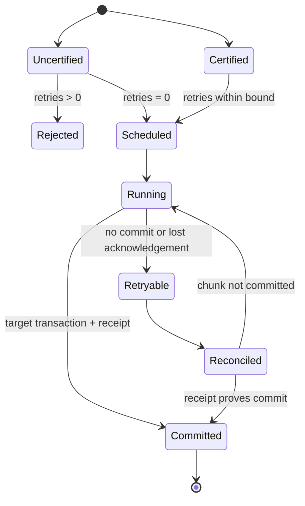

# Feature design: Airflow retries certified by a durable target fence

- Status: IMPLEMENTED
- Owner: dpone maintainers
- Issue: downstream Airflow MR !922
- Target release: 0.74.20
- Additive shadow-publication amendment: 0.74.24
Last verified: 2026-08-22

## Executive summary

Strict indexed Airflow tasks currently reject every non-zero `retries` value.
That fail-closed default prevented an unsafe task replay before dpone had a
durable target-commit fence. The PostgreSQL XMin initial route to Microsoft SQL
Server now has a transactional, target-resident chunk ledger and a
`non_committed` retry policy. The runtime can therefore distinguish an
uncommitted chunk from a committed chunk whose acknowledgement was lost.

This feature lets the dpone compiler certify that exact replay-safe route in the
immutable workload pack. The Airflow provider accepts bounded task retries only
when that compiler-issued authority is present and valid. All old packs and all
uncertified routes keep the existing `retries=0` behavior. The outcome is an
initial load that resumes after worker, pod, network, or scheduler failure
without restarting committed chunks and without trusting DAG-authored claims.

The 0.74.24 amendment extends the same closed authority to the receipt-backed
shadow initial route introduced in 0.74.22. Certification requires the exact
`incremental_append` + retained `shadow_swap` + `only_new_rows: false`
combination. Direct append, disposable backup, and incomplete publication
remain uncertified. The authority schema and provider behavior are unchanged.

The maintainer approved implementation through the explicit request on
2026-08-22 to finish resumable initial loading with systemic, production-grade
semantics and no monkey patch.

## Personas and customer journey

| Persona | Goal | Current pain | Success signal |
|---|---|---|---|
| Data engineer | Bootstrap a large table in parallel | A transient Airflow failure requires a manual task rerun | Airflow retries the task and dpone skips committed chunks |
| Operator | Recover a run without guessing sink state | A lost commit acknowledgement is ambiguous | Target receipt proves whether DML committed |
| Platform maintainer | Keep unsafe routes fail-closed | A global retry switch could replay non-idempotent DML | Only compiler-certified packs accept retries |

The engineer configures chunking, four workers, target-atomic state, and
`retry_policy: non_committed` in the runtime manifest. `dpone pack` validates the
route and emits a closed retry authority. Airflow loads the signed/indexed pack,
validates the authority, and creates a KPO with the DAG's bounded retry count. A
failed attempt starts a fresh runtime process; committed chunks are read from
the SQL Server ledger, an in-doubt attempt is reconciled with the target receipt,
and only non-committed chunks are claimed. Unsupported or forged authorities
fail at DAG preflight before a DAG is installed.

## Scope

### In scope

- Compiler certification for PostgreSQL XMin `initial` to Microsoft SQL Server
  backfill using target-atomic MSSQL state and either fenced merge or exact
  receipt-backed shadow publication.
- A closed, immutable `provider_execution.retry_authority` projection.
- Bounded Airflow KPO retries for certified packs.
- Compatibility for old packs and uncertified routes: `None` and `0` remain the
  only accepted retry values.
- Unit and contract coverage for valid, absent, malformed, forged, mixed-route,
  and over-limit authorities.

### Non-goals

- Row-level checkpointing inside a chunk.
- Automatic retries for externalized hooks or outcome tasks.
- Certifying generic incremental, full refresh, non-MSSQL, `failed_only`, or
  locally persisted state routes.
- Changing chunk identity, the target ledger schema, runtime DML, or XMin
  checkpoint semantics.
- Letting a DAG, operator override, environment variable, or user-authored pack
  field declare retry safety.
- Installing dpone runtime in the Airflow scheduler or worker image.

### Assumptions and constraints

- The provider and compiler are released and deployed as one coordinated dpone
  version.
- Workload-pack digest and deployment-index verification remain mandatory.
- A chunk is the smallest atomic retry unit. Work before its target transaction
  commits may repeat; committed business DML may not.
- Initial loads use deterministic chunk identities and a bounded chunk count.
- The current target ledger and receipt reconciliation are the source of truth;
  Airflow task state is orchestration evidence, not data-commit evidence.

## Public contract

### CLI

No new command or option. `dpone pack` emits retry authority automatically only
for an eligible canonical runtime manifest. Existing validation and non-zero
exit behavior apply when an author requests retries for an uncertified pack.

### Python API

The Airflow pack exposes validated retry authority as part of
`ProviderExecutionProjection`. `validate_strict_retry_policy` accepts the
validated authority explicitly; it does not read globals or environment state.
No connector SDK import is added to provider import paths.

### Manifest/schema

No authoring-manifest field is added. The generated provider projection gains an
optional, closed object:

```json
{
  "retry_authority": {
    "schema": "dpone.airflow-retry-authority.v1",
    "mode": "postgres_xmin_initial_mssql_target_atomic_v1",
    "max_task_retries": 3
  }
}
```

The compiler emits it only when every process selected by the workload has:

- PostgreSQL source with `incremental_strategy: xmin` and
  `xmin_execution.mode: initial`;
- MSSQL sink in `backfill` mode;
- non-empty unique key and one of these compiler-owned publication routes:
  - `inner_mode: incremental_merge`; or
  - `inner_mode: incremental_append`, `only_new_rows: false`, and
    `publication: {mode: shadow_swap, retain_backup: true}`;
- `backfill.retry_policy: non_committed`;
- audit-schema backfill state with distributed locking required;
- MSSQL state with `atomicity: target_atomic` and external provisioning.

Missing, extra, mistyped, boolean, negative, or unsupported authority values are
rejected. The maximum retry count is compiler-owned and fixed at three in v1.

### Artifacts and evidence

The retry authority is part of `provider_execution`, the workload-pack
fingerprint, and the immutable deployment-index artifact digest. Existing
runtime evidence, chunk ledger entries, target receipts, and XCom summaries are
unchanged. Airflow retry count remains visible in task-instance history.

### Compatibility and migration

- Old packs without authority continue to load when retries are absent or zero.
- Old packs with non-zero retries continue to fail closed.
- A new provider rejects malformed or forged authority.
- An old provider rejects a new pack containing the additional closed field,
  producing a safe scheduler/runtime version-skew failure rather than unsafe
  execution.
- Rollback consists of restoring `retries: 0` and the previous coordinated
  provider/compiler release. Runtime ledger state remains usable.

## Detailed algorithm

1. Materialize the canonical runtime manifest during workload-pack compilation.
2. Parse only compiler-owned canonical JSON, never author-supplied Airflow
   overrides, and enumerate every selected process/table execution route.
3. Evaluate the exact v1 predicates, including one of the two closed target
   publication variants. If all routes qualify, emit the fixed retry authority;
   otherwise omit it.
4. Bind the projection into the existing pack fingerprint and deployment-index
   artifact digest.
5. At scheduler preflight, authenticate the index and pack before reading the
   projection.
6. Validate the projection with a closed schema and construct an immutable
   `RetryAuthority` value object.
7. For each materialized KPO, validate its effective retry count against its own
   pack authority. `None` or `0` always succeeds. Positive integers succeed only
   with valid authority and at or below `max_task_retries`.
   Externalized hooks and outcome tasks are forced to zero retries because the
   data-chunk fence does not certify their side effects.
8. A mixed DAG is safe by construction: each task is validated against its own
   pack; one uncertified task makes global preflight fail before any DAG is
   installed.
9. On an Airflow retry, start a new KPO and runtime process. The runtime reads the
   target ledger, reconciles in-doubt receipts, skips committed chunks, and
   claims only non-committed chunks.
10. Publish the XMin handoff checkpoint only after every initial chunk is
    committed. A task retry never advances source state by itself.

### Pseudocode

```text
authority = NONE
routes = canonical_runtime_routes(materialized_manifest)
if routes is not empty and every route satisfies EXACT_V1_PREDICATES:
    authority = RetryAuthority(V1_MODE, max_task_retries=3)
pack.provider_execution = project(kpo, pod, authority)
pack.fingerprint = digest(canonical(pack))

for task_spec in authenticated_dag:
    projection = validate_provider_execution(authenticated_pack)
    effective_retries = merge_airflow_defaults(task_spec).retries
    if effective_retries in [NONE, 0]:
        continue
    require integer, not boolean, 1 <= effective_retries <= authority.maximum
    create KPO(retries=effective_retries)

on retry:
    committed = target_ledger.committed_chunks(run_identity)
    reconcile target receipts for in-doubt attempts
    execute only chunks not proven committed
```

### State machine



### Edge cases

- Empty route set is never certified.
- `true` is rejected even though Python treats it as an integer.
- A retry count above three is rejected before DAG installation.
- A partial or schema-drifted runtime manifest is not certified.
- One unsafe route in a multi-process pack prevents certification of the pack.
- A worker crash before target commit causes the whole chunk to rerun.
- A crash after target commit but before acknowledgement is resolved through the
  target receipt; business DML is not replayed.
- Cancellation leaves committed chunks durable and non-committed chunks
  claimable by the next attempt.
- Duplicate delivery of the same authenticated pack is harmless because the
  authority and task identity are deterministic.

## Architecture

### Components and responsibilities

| Component | Existing/new | Responsibility | Dependencies |
|---|---|---|---|
| Runtime-route certifier | New | Inspect canonical manifest and emit fixed authority | Manifest materialization only |
| Provider execution projector | Existing, extended | Carry authority in immutable scheduler projection | Certifier output |
| Provider projection validator | Existing, extended | Parse closed authority to value object | Dependency-light contract |
| Strict retry guard | Existing, extended | Compare effective retry value to explicit authority | Value object only |
| Init-fetch composer | Existing, extended | Preserve certified retry count on KPO | Validated projection |
| MSSQL ledger/receipt runtime | Existing | Decide committed versus retryable chunk | Target transaction state |

### Ports, adapters, and composition root

The compiler is the only composition root that can create authority. The
provider receives a plain immutable projection and validates it without importing
dpone runtime or connector adapters. The KPO only launches runtime; scheduler and
worker images remain free of the dpone runtime package.

### Data and control flow


### Alternatives and tradeoffs

| Alternative | Advantages | Disadvantages | Decision |
|---|---|---|---|
| Keep `retries=0` | Simplest fail-closed behavior | Manual recovery for transient orchestration failures | Reject after certified fence exists |
| Trust DAG flag such as `idempotent: true` | Easy to configure | Self-attested and not bound to runtime semantics | Reject |
| Retry every route | Convenient | Can duplicate non-idempotent target DML | Reject |
| Row-level checkpoint | Less repeated extraction within one chunk | High state volume and weaker transaction boundary | Reject; retry atomic chunk |
| Compiler-issued closed authority | Safe, deterministic, auditable | Coordinated compiler/provider release required | Adopt |

### ADR requirement

No new ADR is required. This completes the deliberately deferred retry phase in
the approved strict init-fetch architecture and preserves its existing compiler
authority, immutable pack, provider/runtime isolation, and target-ledger
boundaries. The feature specification records the additive public contract.

### Quality-budget impact

One small dependency-light authority contract and one small compiler policy are
preferred over embedding route policy in provider composition. Existing modules
receive narrow wiring changes. Every changed/new module must remain below the
repository `max_sloc: 400` budget and must not add connector imports to provider
or base import paths.

## Market comparison

Facts below come from official primary documentation checked on 2026-08-22.
Adopt/reject entries are dpone design inferences, not vendor claims.

| System/version | Relevant capability | Observed design | Strength | Limitation | Adopt/reject | Source/date |
|---|---|---|---|---|---|---|
| dlt current docs | Load-package recovery | Completed jobs in a pending package are not rerun; pipeline state/cursors advance after the package completes | Durable package boundary and safe retry guidance | Partial destination writes are not automatically rolled back | Adopt durable completed-unit state; require a target fence for ambiguous commit | [Running in production](https://dlthub.com/docs/running-in-production/running), 2026-08-22 |
| Informatica PowerCenter 10.5 | Session recovery | Resume from last checkpoint is supported under documented session constraints | Mature governed checkpoint model | Restrictions include partitioning, grid, relational bulk target, and full pushdown cases | Adopt explicit eligibility; reject a global resume promise | [Session recovery](https://docs.informatica.com/data-integration/powercenter/10-5/advanced-workflow-guide/workflow-recovery/rules-and-guidelines-for-session-recovery/configuring-recovery-to-resume-from-the-last-checkpoint.html), 2026-08-22 |
| Airbyte current cloud/core | Resumable full refresh | Database streams are ordered and split into primary-key pages/chunks; failed attempts resume from checkpoint, while a new full-refresh job starts from the beginning | Data-level cursor and bounded rework | Semantics distinguish retry of an attempt from a new job | Adopt deterministic chunks and durable retry state; document run identity explicitly | [Resumable Full Refresh](https://airbyte.com/blog/resumable-full-refresh-building-resilient-systems-for-syncing-data), 2026-08-22 |
| Fivetran current docs | Connector checkpoints | Historical and incremental syncs restart from the last checkpoint | Simple operator experience across managed connectors | Internal checkpoint and sink transaction details are connector-managed | Adopt checkpoint UX; retain inspectable target receipts | [Core concepts](https://fivetran.com/docs/core-concepts), 2026-08-22 |
| Pentaho PDI current docs | Job checkpoints | Job parameters, result rows/files, and checkpoint hop are persisted; restart begins at the last checkpoint | Clear job-level restart point | Finer recovery requires splitting work into separate job entries | Adopt explicit completed work units; use data chunks rather than orchestration hops | [Use checkpoints to restart jobs](https://docs.pentaho.com/pdia-data-integration/transforming-data-with-pdi/logging-and-performance-monitoring/use-checkpoints-to-restart-jobs), 2026-08-22 |
| Microsoft SSIS current docs | Package checkpoints | The control-flow task is the smallest restartable unit; a data flow cannot resume in the middle | Predictable orchestration boundary | Large data-flow tasks must be split to reduce replay | Adopt chunk-as-task-equivalent boundary; reject whole-table replay | [Restart packages by using checkpoints](https://learn.microsoft.com/en-us/sql/integration-services/packages/restart-packages-by-using-checkpoints), 2026-08-22 |
| Duckle public beta | Batch claims and ledger | Workers claim items with locks and append progress to a batch ledger; released claims can be resumed after worker failure | Explicit claim ownership and append-only progress | Public beta; generic checkpoints require explicit resume composition | Adopt claim/ledger reasoning; do not depend on beta implementation | [Duckle repository](https://github.com/slothflowlabs/duckle), 2026-08-22 |
| gusty | N/A | DAG construction library, not a data-commit/checkpoint engine | N/A | Does not own sink commit semantics | N/A for this capability, 2026-08-22 |
| Astronomer Cosmos | N/A | dbt-to-Airflow orchestration integration, not a target transaction ledger | N/A | Does not certify connector DML replay | N/A for this capability, 2026-08-22 |
| Apache Beam | N/A | Runner-level streaming checkpointing is a different execution/state layer | N/A | It does not define this KPO-to-relational-target contract | N/A for this narrowly scoped provider feature, 2026-08-22 |

## Measurable differentiation

```yaml
axis: safe recovery from an ambiguous target commit during parallel initial load
scenario: 2048 deterministic chunks, four workers, worker killed after SQL Server commit and before acknowledgement
baseline: dpone 0.74.19 strict init-fetch with Airflow retries disabled
metric: committed chunks re-executed; operator actions; final duplicate/missing rows
target: 0 committed chunks re-executed; 0 operator actions; 0 duplicates; 0 missing rows
procedure: inject the failure, allow one Airflow retry, reconcile receipt, compare source/target identities and ledger attempts
artifact: .dpone/runs/<workload_id>/runtime-evidence.json plus target ledger query receipt
limitations: certifies only the declared PostgreSQL XMin initial to MSSQL target-atomic route
```

## Security, privacy, and operations

Authority contains no credentials or connection coordinates. It cannot be
provided through an environment variable or operator override. Existing pack
digest verification protects integrity. Logs report the authority mode and
retry bound, not secrets. Operators diagnose rejection through
`DPONE_AIRFLOW_RETRIES_REQUIRE_TARGET_FENCE`; runtime recovery remains visible in
the target ledger and runtime evidence.

## Test and certification plan

| Layer | Scenario | Environment | Expected artifact |
|---|---|---|---|
| Unit | Exact eligible and near-miss manifests | Python | Authority or `None` |
| Contract | Missing, malformed, forged, over-limit authority | Provider tests | Stable fail-closed error code |
| Contract | Certified DAG default `retries: 2` | Airflow 2.10 and 3.x unit harness | Materialized KPO retains two retries |
| Integration | Third chunk fails; first two committed | Local PostgreSQL/MSSQL profile | Retry selects only remaining chunks |
| Live certification | Commit acknowledgement lost | Approved DEV | Target receipt and zero repeated DML |
| Performance | 2048 chunks, four workers | Approved DEV | Bounded recovery and no full restart |
| Compatibility | Old pack, new provider; new pack, old provider | Package matrix | Safe load at zero or fail closed |

## Documentation plan

Update the provider API, strict cache-sync reference, initial-load recovery
runbook, generated provider-execution schema reference, changelog, and release
upgrade notes. Preserve historical design documents and link this feature as the
implementation of their deferred target-fence retry phase.

## Rollout and rollback

Release compiler, Airflow pack, provider, and runtime as coordinated 0.74.20
artifacts. Pin exact hashes in downstream scheduler and KPO locks. Validate the
generated pack and Airflow 2.10/3.x parse before merging the deployment MR. Run
DEV initial load, inject or observe a bounded retry, and verify ledger receipts
before production promotion. Roll back by setting DAG retries to zero and
restoring the previous coordinated package set; never delete the target ledger.
The additive shadow predicate ships as the coordinated 0.74.24 release and uses
the same validation, rollout, and rollback sequence.

## Agent execution plan

| Agent/role | Owned paths | Read-only paths | Forbidden paths | Dependency |
|---|---|---|---|---|
| Primary integrator | provider contract/guard, compiler policy, tests, docs, release files | runtime ledger and manifest schema | unrelated connectors | Approved specification |

The primary integrator owns all shared semantic and release files. No parallel
writer is used for this change.

## Approval checklist

- [x] User problem and CJM are clear.
- [x] Algorithm and failure semantics are implementable without guessing.
- [x] Public contracts and compatibility are explicit.
- [x] Architecture and alternatives are justified.
- [x] Relevant market research uses current official sources.
- [x] Claimed differentiation is measurable.
- [x] Tests, evidence, docs, rollout, and rollback are complete.
- [x] Path ownership and integration plan are conflict-safe.
- [x] Maintainer changed status to `APPROVED`.
