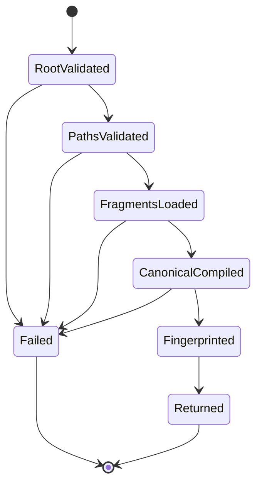
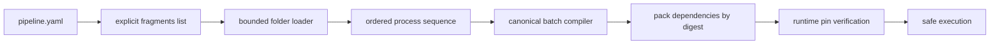

# Feature design: bounded folder authoring v1

- Status: IMPLEMENTED
- Owner: dpone maintainers
- Issue: Industrial Self-Service Airflow roadmap, Phase 2
- Target release: TBD
- Last verified: 2026-07-16

Implementation evidence: `test_artifacts/airflow-folder-authoring-v1/validation-report.md`.

## Executive summary

One short `dpone.flow.v1` file is the best beginner default, but a multi-process
pipeline becomes hard to review when every process lives in one YAML document.
Folder authoring lets an engineer split process declarations into small files
without creating another editable manifest, runtime engine, recursive discovery
mechanism, or Airflow parse-time compiler.

The root `pipeline.yaml` remains the only primary source and explicitly lists
every fragment. A bounded build-plane loader reads those files under the root
directory, validates their exact grammar and safety budgets, and passes their
processes into the existing `AuthoringCompiler`. The output is the same
canonical `dpone.batch.v1` IR used by classic and flow authoring. Every fragment
is included in compact-pack dependencies and pinned by digest for live sample
execution.

## Personas and customer journey

| Persona | Goal | Current pain | Success signal |
|---|---|---|---|
| New data engineer | Split a growing pipeline without learning batch layering | One long process list becomes noisy | One explicit CLI option creates a root plus one understandable step file |
| Data engineer | Review multi-process changes independently | Unrelated process edits conflict in one YAML | Each process group has a stable explicit fragment path |
| Platform engineer | Govern repository I/O and supply-chain inputs | Recursive glob/plugin discovery is hard to bound | Only declared files below the root are read with fixed count/byte budgets |
| Airflow operator | Keep DAG parsing static | Folder scanning could leak into scheduler parse | Provider receives only immutable generated index/spec/pack artifacts |
| Runtime operator | Reproduce the exact workload | Root-only pinning misses fragment mutations | Pack and safe-sample verification pin root and every fragment digest |

Journey:

1. The user runs `dpone init pipeline ... --authoring folder --airflow`.
2. Scaffolding creates one root source and `steps/load.yaml` atomically.
3. The root explicitly lists `steps/load.yaml`; no glob or repository scan runs.
4. `dpone check` reads the bounded set, compiles in memory, and reports source
   files plus source/semantic fingerprints.
5. `dpone airflow preview` emits the same release/deployment contracts and a
   compact pack containing root and fragment dependencies.
6. Safe sample verifies exact root and fragment digests before credentials or
   source/sink I/O.
7. A missing, changed, oversized, duplicate, traversing, or symlinked fragment
   fails closed with a structured error and no generated artifacts.

## Scope

### In scope

- Explicit folder root using `kind: dpone.flow.v1` and
  `authoring.mode: folder`.
- `fragments:` as a required, ordered, non-empty list of relative YAML paths.
- `dpone.flow-fragment.v1` containing only `kind` and non-empty `processes`.
- Bounded count, per-file bytes, total bytes, YAML tokens, object depth, and
  object-node count.
- Traversal, absolute path, backslash, duplicate, symlink, and root-escape
  protection.
- Source dependency/fingerprint metadata and semantic equivalence with flow and
  classic forms.
- Self-service scaffolding, check, preview, ordinary manifest loading, compact
  pack dependencies, inline bootstrap, and safe-sample pin verification.
- Public JSON Schemas, docs, compatibility notes, and negative tests.

### Non-goals

- Recursive globbing, auto-discovery, directory watching, or remote fragments.
- Fragment nesting or fragments that reference other fragments.
- Per-fragment metadata, credentials, defaults, recipes, profiles, or schedules.
- Python/Jinja execution, template includes, arbitrary merge directives, or
  fragment override precedence.
- Airflow DAG parsing of authoring files.
- External recipe/catalog implementation, selectors, hermetic test execution,
  DLQ, or step visibility; these remain later Phase 2 slices.

### Assumptions and constraints

- The root is the only editable source of truth; fragments are subordinate
  source documents owned by that root, not independent pipelines.
- `dpone.batch.v1` remains the canonical execution IR.
- The explicit fragment order controls compilation input order. Semantic
  fingerprinting still sorts compiled process identity, so reordering
  independent fragments does not alter semantic identity.
- Duplicate process names/selectors remain canonical compiler blockers.
- Existing flow/classic/legacy contracts remain compatible.
- This pure build-plane feature has no live certification requirement by itself.

## Public contract

### CLI

```bash
dpone init pipeline orders_daily \
  --recipe mssql-to-clickhouse-incremental \
  --authoring folder \
  --airflow
```

Creates:

```text
pipelines/orders_daily/
  pipeline.yaml
  steps/
    load.yaml
```

The existing plan/apply/idempotency behavior applies to both files. A conflict
in either file blocks the multi-file scaffold; no universal force overwrite is
added. `dpone check`, `dpone airflow preview`, and `dpone run --sample ...`
retain their current commands and exit-code contract.

Folder failures use validation exit code `1`; bad CLI usage remains `2`; safety
violations remain `4`; internal failures remain `5`. Text output names only the
logical relative fragment and remediation. JSON uses `dpone.error.v1`.

### Python API

```python
class FolderFragmentLoader(Protocol):
    def load(
        self,
        *,
        source_path: Path,
        project_source: str,
        fragment_refs: Sequence[str],
        project_root: Path | None,
    ) -> FolderLoadResult: ...

@dataclass(frozen=True, slots=True)
class AuthoringSourceDependency:
    kind: str
    path: str
    sha256: str

@dataclass(frozen=True, slots=True)
class FolderLoadResult:
    processes: tuple[Mapping[str, Any], ...]
    dependencies: tuple[AuthoringSourceDependency, ...]
    source_documents: tuple[FolderFragmentDocument, ...]
```

`AuthoringCompiler` receives the loader through dependency injection. Flow and
classic compilation do not invoke it. Composition roots install the bounded
filesystem adapter; tests may inject in-memory adapters.

### Manifest/schema

Root:

```yaml
kind: dpone.flow.v1
authoring:
  mode: folder
  source: pipelines/orders_daily/pipeline.yaml
metadata:
  id: orders_daily
  domain: sales
  tags: [dpone, airflow]
fragments:
  - steps/load.yaml
```

Fragment:

```yaml
kind: dpone.flow-fragment.v1
processes:
  - name: orders_daily
    source:
      type: mssql
      connection_ref: mssql_dev
      table: {schema: dbo, name: orders}
    sink:
      type: clickhouse
      connection_ref: clickhouse_dev
      table: {schema: analytics, name: orders}
      strategy: {mode: incremental_merge, unique_key: id}
```

Root rules:

- folder mode requires `fragments` and forbids `processes`;
- flow mode requires `processes` and forbids `fragments`;
- 1 to 100 unique fragment paths;
- paths use POSIX `/`, end in `.yaml` or `.yml`, and are relative to the root
  source directory;
- `authoring.source` remains project-relative and exact.

Fragment rules:

- exact kind `dpone.flow-fragment.v1`;
- only `kind` and `processes` at the top level;
- at least one process;
- no authoring, metadata, fragments, defaults, schedule, credentials, or
  generated-artifact fields.

Safety budgets:

| Budget | Limit |
|---|---:|
| Fragment count | 100 |
| One fragment | 1 MiB |
| All fragments | 8 MiB |
| YAML tokens per fragment | 20,000 |
| Object depth | 32 |
| Object nodes | 10,000 |

YAML anchors and aliases are rejected for folder fragments. Root parsing keeps
the existing safe-loader contract and is separately bounded by the invoking
command/read adapter.

### Artifacts and evidence

`AuthoringCompilation.dependencies` lists every editable external source input,
including each fragment and referenced SQL file, as:

```yaml
kind: authoring_fragment
path: pipelines/orders_daily/steps/load.yaml
sha256: sha256:...
```

Release provenance records `source_files`, `source_fingerprint`, and
`semantic_fingerprint`. Compact packs include one `manifest` dependency plus
every `authoring_fragment` and referenced SQL file. Inline bootstrap embeds the
same exact paths. No fragment content is copied into logs/evidence.

Source fingerprint covers canonical parsed root and ordered fragment documents.
Semantic fingerprint remains based on compiled processes and semantic metadata.
Exact pack dependencies retain byte SHA-256 for runtime reproducibility.

### Compatibility and migration

- Existing flow/classic/legacy inputs are unchanged.
- `folder` changes from explicit unsupported error to a supported additive mode.
- No implicit migration from flow to folder occurs.
- Rollback converts the root back to flow by inlining fragment `processes`; the
  semantic fingerprint must remain equal before commit.
- Removing a fragment reference removes its processes; orphan files are ignored
  because discovery is explicit.

## Detailed algorithm

1. Validate root authority, kind/mode, exact source path, and that `fragments`
   is the only process-source field.
2. Validate fragment list type, count, text format, uniqueness, and extensions.
3. Resolve each path relative to the root source directory.
4. Open the trusted project root once, walk every declared path component with
   descriptor-relative `openat` semantics plus `O_NOFOLLOW`, and reject
   absolute paths, traversal, backslashes, symlinks, missing files, non-files,
   and root escape. Validation and read never reopen the lexical fragment path.
5. Read the already-open regular-file descriptor at most 1 MiB plus one byte;
   stop at the first over-limit file. Track cumulative bytes and stop above 8
   MiB.
6. Scan bounded YAML tokens; reject anchors/aliases and token overflow.
7. Safe-load one mapping; validate depth/node budgets, exact fragment kind,
   allowed keys, and non-empty processes.
8. Append processes in explicit root-list order and record project-relative
   path plus exact byte SHA-256.
9. Normalize the merged process sequence through the existing flow-to-batch
   function and existing `BatchManifestCompiler`.
10. Compute source fingerprint from root plus ordered fragment documents and
    semantic fingerprint from sorted compiled process mappings.
11. Preview/pack build independently resolves the explicit fragment and
    fragment-local SQL paths into `workload_dependencies`; mismatch with
    compiler dependencies is a blocker.
12. Live safe-sample input loading records root plus fragment digests, and
    pinned-source verification compares every fragment and SQL byte digest
    through the confined reader before authorization, credential resolution, or
    external I/O.
13. Any failure returns one stable structured error, writes no generated
    release/deployment, and never advances `current` or runtime evidence.

### Pseudocode

```text
compile_folder(root, source_path):
    refs = validate_explicit_fragment_list(root.fragments)
    loaded = folder_loader.load(source_path, root.authoring.source, refs)

    merged = root without fragments
    merged.processes = concat(document.processes in refs order)
    canonical = flow_to_batch(merged)
    compiled = batch_compiler.compile(canonical)

    source_fp = hash({root: root, fragments: loaded.source_documents})
    semantic_fp = hash(sorted(compiled.processes) + semantic_metadata)
    return immutable compilation with dependencies and fingerprints
```

### State machine



There is no mutable checkpoint. A retry rereads the same declared set and either
returns the same identities or a new source/pack digest if bytes changed.
Scaffolding retains the existing multi-file rollback journal.

### Edge cases

- Empty/missing fragment list, empty fragment processes, duplicate refs, and
  duplicate process identities fail closed.
- Fragment reordered: source fingerprint changes; semantic fingerprint remains
  equal when compiled semantics are independent and equal.
- Missing final newline or YAML key order: exact byte dependency digest may
  change; parsed source/semantic identity remains canonical.
- Fragment changes between compile and pack build: dependency-set/digest parity
  check fails before release publication.
- Fragment changes after pack publication: safe-sample/source pin verification
  fails before credentials or data I/O.
- Fragment symlink inside root or outside root: rejected.
- YAML alias/anchor, deep nesting, excessive nodes/tokens, oversized file, or
  aggregate overflow: rejected before canonical compilation.
- One malformed fragment among many: whole pipeline fails; partial process
  compilation is never returned.
- Orphan YAML not referenced by root: ignored and never packed.

## Architecture

### Components and responsibilities

| Component | Existing/new | Responsibility | Dependencies |
|---|---|---|---|
| `AuthoringCompiler` | Existing, extended | Select folder normalization and semantic identity | loader port, batch compiler |
| `FolderFragmentLoader` | New port | Return bounded parsed fragment result | standard types |
| `BoundedYamlFolderFragmentLoader` | New adapter | Confined filesystem/YAML loading and budgets | pathlib, PyYAML |
| `AuthoringSourceDependency` | New model | Safe source path and digest provenance | standard library |
| Self-service templates | Existing, extended | Atomically scaffold root plus first fragment | scaffold service |
| `WorkloadDependencyResolver` | Existing, extended | Pack root/fragments/SQL exact bytes | filesystem |
| Pinned source verifier | Existing, extended | Verify root and fragment dependency set | pack reader |

### Ports, adapters, and composition root

The compiler depends on the `FolderFragmentLoader` protocol, not filesystem or
YAML APIs. Manifest/readiness/safe-sample composition roots construct it with
the bounded adapter. Airflow provider code has no dependency on either.

```text
commands -> readiness service -> AuthoringCompiler -> FolderFragmentLoader port
                                                     ^
manifest composition -> BoundedYamlFolderFragmentLoader adapter

Airflow provider -> deployment index/spec/pack only
runtime pin verifier -> compact pack dependency metadata + local digests
```

### Data and control flow



### Alternatives and tradeoffs

| Alternative | Advantages | Disadvantages | Decision |
|---|---|---|---|
| Recursive `**/*.yaml` discovery | Fewer root edits | Hidden inputs, nondeterminism, parse/scale/security risk | Rejected |
| One process per filename convention | Very simple files | Filename becomes semantic API; poor grouping | Rejected |
| YAML `!include` | Familiar syntax | Custom loader, alias/template attack surface, weak source map | Rejected |
| Explicit fragment list | Deterministic, reviewable, bounded, easy to pin | One root line per file | Adopted |
| Generate canonical YAML beside root | Easy runtime input | Second editable source/drift risk | Rejected |

### ADR requirement

No new ADR. ADR 0015 already freezes one compiler for classic/flow/folder,
explicit source ownership, generated canonical IR, and parse-safe Airflow. This
spec defines the implementation contract within that accepted decision.

### Quality-budget impact

Filesystem loading, authoring models, compiler normalization, pack dependency
resolution, and pin verification remain separate responsibilities. New modules
must remain below the checked-in SLOC limit. Existing near-limit facades receive
delegation only. The change must not regress import/layer/module metrics in
`docs/benchmarks/quality_budgets.yml`.

## Market comparison

Checked 2026-07-16 against current official primary documentation already
recorded in the parent Authoring v1 spec.

| System/version | Relevant capability | Observed design | Strength | Limitation | Adopt/reject | Source/date |
|---|---|---|---|---|---|---|
| dlt 1.29 docs | Declarative source configuration | Configuration is declarative but Python remains a common composition surface | Fast iteration | Not a bounded static Airflow artifact contract | Adopt concise declaration; reject scheduler/runtime code expansion | [dlt REST source](https://dlthub.com/docs/dlt-ecosystem/verified-sources/rest_api/basic), 2026-07-16 |
| Airbyte current/PyAirbyte | Declarative YAML manifests/components | Local manifest path/dictionary can define reusable declarative source behavior | Strong schema/component model | Connector contract, not workload/release/deployment authority | Adopt strict declarative fragments; keep orchestration/runtime identities separate | [PyAirbyte sources](https://airbytehq.github.io/PyAirbyte/airbyte/sources.html), 2026-07-16 |
| Astronomer Cosmos 1.13+ | Project discovery/selection | Project/manifest parsing translates graph into Airflow objects | Familiar project organization | Some modes parse project inputs around DAG construction | Adopt project UX; reject authoring discovery in scheduler parse | [Cosmos how it works](https://astronomer.github.io/astronomer-cosmos/getting_started/how-cosmos-works.html), 2026-07-16 |
| Informatica | N/A | Managed visual repository is a different product layer | N/A | Not the portable build-plane compiler contract | N/A |
| Fivetran | N/A | Managed connector configuration does not expose this authoring boundary | N/A | Irrelevant layer | N/A |
| Pentaho | N/A | Visual transformations/jobs are not static dpone authoring fragments | N/A | Irrelevant layer | N/A |
| Microsoft SSIS | N/A | Package/project model is runtime-specific | N/A | Does not preserve dpone canonical IR/provider split | N/A |
| gusty | N/A for adopted design | YAML DAG generation is scheduler-oriented | Simple grouping | Would couple authoring to Airflow DAG semantics | Reject |
| Apache Beam | N/A | Programming/runtime portability rather than low-code file composition | N/A | Irrelevant layer | N/A |

## Measurable differentiation

```yaml
axis: explicit bounded multi-file authoring with semantic equivalence
scenario: one three-process pipeline represented as flow, folder, and classic
baseline: folder option currently fails as unsupported
metric: canonical semantic fingerprint equality and complete dependency pinning
target: identical semantic fingerprint; 100% declared fragment digests in pack and runtime verification; zero undeclared file reads
procedure: compile all modes, mutate one fragment, run check/preview/pin tests, record opened paths
artifact: test_artifacts/airflow-folder-authoring-v1/validation-report.md
limitations: does not prove live connector execution or human usability
```

## Security, privacy, and operations

- No recursive discovery, network, credential, Vault, Airflow, Kubernetes, or
  connector call occurs during folder compilation.
- Errors include only project-relative paths, stable codes, sizes/counts, and
  limits; no file contents or secret-like values.
- Registry/Vault paths remain outside authoring fragments.
- Descriptor-anchored no-follow path walking prevents validation/open races;
  symlinks, traversal, aliases/anchors, and resource-budget violations fail
  before process compilation.
- Compilation metrics may record mode, file count, total bytes, duration, and
  error code, never fragment content.
- Airflow parse behavior is unchanged because only generated artifacts ship.

## Test and certification plan

| Layer | Scenario | Environment | Expected artifact |
|---|---|---|---|
| Unit | path/size/token/depth/node/kind/process validation | local | pytest report |
| Contract | root and fragment JSON Schemas | local CI | schema report |
| Integration | init -> check -> manifest list -> preview -> sample planning | local hermetic | validation report |
| Pack | dependency/archive set equals declared fragments and SQL refs | local | pack fixture |
| Security | traversal, absolute/backslash, symlink, mutation, alias bomb, oversized input | local | negative-test report |
| Performance | 100 fragments at max supported normal fixture budget | CI runner | benchmark JSON |
| Compatibility | classic/flow/legacy unchanged; semantic equality | local | compatibility report |
| Live certification | N/A: pure authoring/build change | N/A | explicit N/A rationale |

Required negative tests include empty/duplicate/missing fragment, wrong kind,
unknown top-level key, root processes plus fragments, fragment nesting,
duplicate process, path traversal, symlink inside/outside, bytes/count/aggregate
overflow, YAML anchor/alias, token/depth/node overflow, parent-directory swap to
a symlink during fd walk, changed fragment between compile/pack, changed
fragment or SQL file after pack, and partial scaffold conflict.

## Documentation plan

- Extend Airflow authoring guide with folder tutorial and diagram.
- Add fragment JSON Schema to generated manifest references.
- Update First DAG only with an advanced link; folder is not a golden-path step.
- Update compatibility, changelog, CLI reference, backlog, and operator pinning
  explanation.
- Add executable example with root plus two fragments.

## Rollout and rollback

1. Land loader/models/compiler tests before enabling scaffold output.
2. Land pack dependency and safe-sample pin verification before declaring
   preview/sample support.
3. Enable `--authoring folder` using the already published option.
4. Observe structured folder error counts and compile budgets; no content is
   collected.
5. Rollback disables new folder scaffolding/compilation; existing flow/classic
   behavior and generated releases remain valid. Convert folder sources to flow
   only after proving semantic fingerprint equality.

## Agent execution plan

| Agent/role | Owned paths | Read-only paths | Forbidden paths | Dependency |
|---|---|---|---|---|
| Explorer | authoring/pack/pin path map | repo | all writes | none |
| Architect | spec and dependency review | repo | all writes | explorer |
| Integrator | compiler, adapter, shared schemas/docs | repo | `.cursor/**` | approved spec |
| Test certifier | test/evidence review | implementation | production writes | implementation |
| Docs/UX reviewer | folder tutorial/CJM review | docs/CLI | production writes | implementation |

The current Codex task is the integrator and shared-file owner.

## Approval checklist

- [x] User problem and CJM are clear.
- [x] Algorithm and failure semantics are implementable without guessing.
- [x] Public contracts and compatibility are explicit.
- [x] Architecture and alternatives are justified.
- [x] Relevant market research uses current official sources.
- [x] Claimed differentiation is measurable.
- [x] Tests, evidence, docs, rollout, and rollback are complete.
- [x] Path ownership and integration plan are conflict-safe.
- [x] Maintainer authorized implementation through the frozen-roadmap goal.
