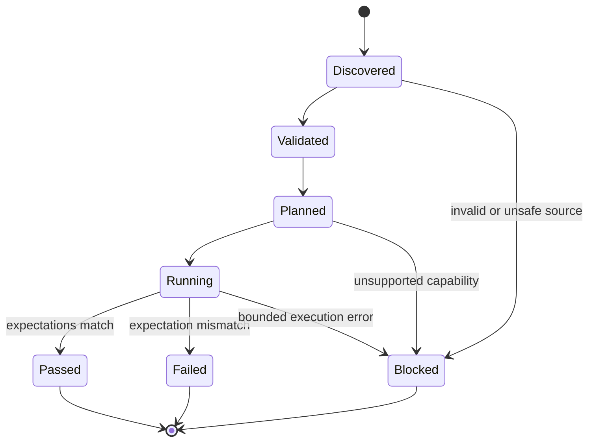
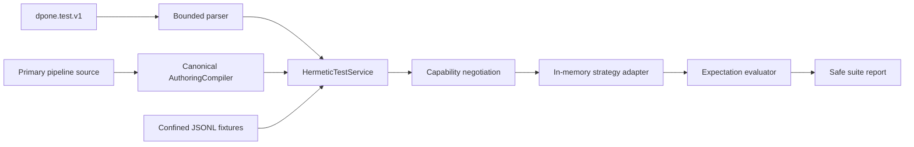

# Feature design: hermetic pipeline tests v1

- Status: IMPLEMENTED
- Owner: dpone maintainers
- Issue: Airflow self-service Phase 2 roadmap
- Target release: v0.70
- Approval basis: maintainer instruction on 2026-07-16 to continue the frozen
  Airflow self-service roadmap through implementation as one goal.
- Last verified: 2026-07-16
- Validation evidence:
  `test_artifacts/airflow-hermetic-tests-v1/validation-report.md`

## Executive summary

`dpone.test.v1` gives a new engineer a credential-free check of one compiled
pipeline process using small JSONL fixtures and a deterministic in-memory
temporary target:

```bash
dpone test pipelines/orders_daily
```

The command uses the same canonical authoring compiler as `dpone check`,
preview, build, and ordinary manifest loading. It never connects to a source,
sink, Airflow, Vault, Kubernetes, or a secret store. It validates the selected
authoring source, loads bounded fixtures, applies the connector-neutral final
row semantics of `full_refresh`, `incremental_append`, or
`incremental_merge`, and produces a safe CI report.

This is a hermetic contract test, not connector or route certification. A pass
does not establish that vendor SQL, a driver, transport, physical DDL,
authentication, or a live database works. Unsupported behavior fails closed
instead of being silently approximated.

Measurable outcome: a scaffolded beginner pipeline contains an executable test
and fixture, `dpone test pipelines/<id>` needs no credentials, and two runs of
unchanged inputs produce the same test identity and semantic result.

## Personas and customer journey

| Persona | Goal | Current pain | Success signal |
| --- | --- | --- | --- |
| First-time data engineer | Prove the scaffold is internally coherent | The generated test YAML points at a missing fixture and cannot run | One command passes immediately after `dpone init pipeline` |
| Pipeline author | Test expected row/load semantics before requesting credentials | Local validation stops at static syntax | Small fixtures exercise deterministic target state and expectations |
| CI owner | Gate pull requests without live infrastructure | Live routes are slow, credentialed, and non-deterministic | JSON/Markdown suite report and stable exit codes |
| Platform engineer | Keep local tests from becoming a secret or connector execution path | A generic runner could import drivers or read Vault | Imports, filesystem access, and report fields are bounded and tested |
| Operator | Understand what a green local test proves | Unit-style passes can be confused with production certification | Report names coverage and lists excluded production capabilities |

Customer journey:

1. `dpone init pipeline` creates the primary source, domain declaration,
   `tests/<pipeline>.test.yaml`, and `tests/fixtures/<pipeline>.input.jsonl` in
   one idempotent scaffold plan.
2. The user runs `dpone test pipelines/<pipeline>`; no Airflow Python,
   connection, container, or database is required.
3. Concise text reports the selected process, strategy, observed rows, and
   `PASS`, plus the explicit `hermetic_contract` coverage level.
4. On an expectation mismatch, the command reports counts/schema/diff metadata
   without row values and points to the test file. The user edits fixture or
   expectation and reruns safely.
5. CI runs `dpone test . --format json --output test-artifacts/dpone-tests.json`.
6. Before production, the user still runs static/live checks and the applicable
   route certification. Hermetic tests never replace those gates.

## Scope

### In scope

- One public `dpone test` command for one test file, one pipeline, or the direct
  `tests/*.test.yaml` project suite.
- `dpone.test.v1` YAML with bounded JSONL input, optional initial target,
  expected row count, expected schema subset, and optional expected output.
- Canonical authoring compilation for classic, flow, folder, and recipe modes.
- Exactly one selected process per test.
- Pure in-memory final-state semantics for `full_refresh`,
  `incremental_append`, and `incremental_merge` with
  `duplicate_policy: fail`.
- Deterministic temporary target identity, test fingerprint, safe individual
  report, and aggregate CI suite report.
- Text, JSON, Markdown, atomic file output, stable structured errors, and exit
  codes.
- Confined file reads, byte/row/line/time budgets, duplicate-key rejection,
  no network/secrets, and no row values in reports.
- An executable two-row starter test for every successful built-in and external
  recipe scaffold. Every process expanded by an external recipe must be inside
  hermetic v1 coverage; otherwise scaffolding is rejected before any authoring
  file is written with
  `DPONE_RECIPE_HERMETIC_TEST_UNSUPPORTED`.

### Non-goals

- Running connector code, vendor drivers, source queries, sink SQL, transport,
  physical DDL, Airflow, KPO, Vault, or Kubernetes.
- Route, connector, or production certification.
- Executing SQL/Python transforms, source `query`/`sql_file` authoring, CDC,
  backfill campaigns, nested normalization, schema evolution, reconciliation,
  or DLQ replay in v1.
- Simulating `strategy: auto`, vendor-specific merge policies, transactions, or
  performance.
- Ignoring sink options that can change schema, rows, quarantine, or vendor SQL;
  v1 accepts only `unique_key`, `batch_size`, and `log_sample_rows` there.
- Executing process quality gates, schema contracts, quarantine policies,
  physical design, or hooks; those require separately modeled outcomes.
- Inline fixture rows in YAML, CSV/SQL fixtures, fixture generation from live
  data, recursive test discovery, project selectors, parallel execution, or a
  test plugin registry.
- Treating malformed fixture rows as quarantined data. DLQ behavior is a
  separate Phase 2 contract.

### Assumptions and constraints

- A test targets one independently compiled process. If a pipeline has more
  than one process, `process` is required.
- JSONL rows are JSON objects. Values may be null, booleans, numbers, strings,
  arrays, or objects, but v1 does not claim database-specific nested behavior.
- `rejected_rows` is retained for the future DLQ contract and MUST be `0` in
  v1. Malformed input blocks the test rather than becoming a rejected row.
- The default fixture budget is 10 MiB, 10,000 rows, and 1 MiB per line. A test
  may lower these limits but cannot raise the implementation hard caps.
- The default timeout is 30 seconds and the hard maximum is 300 seconds.
- A run is isolated and has no resume/checkpoint. Retrying unchanged content is
  a fresh execution with the same deterministic test identity.

## Public contract

### CLI

```text
dpone test TARGET [--format text|json|md] [--output PATH]
```

Targets:

- `tests/orders_daily.test.yaml`: run exactly that test.
- `pipelines/orders_daily` or `orders_daily`: resolve the primary pipeline and
  run `tests/<metadata.id>.test.yaml`.
- `.` or a project root: run only direct, sorted `tests/*.test.yaml` files;
  discovery is non-recursive and limited to 100 files.

Examples:

```bash
dpone test pipelines/orders_daily
dpone test tests/orders_daily.test.yaml --format json
dpone test . --format json --output test-artifacts/dpone-tests.json
```

Output rules:

- Without `--output`, the chosen format is written to stdout and stderr remains
  empty for expected user/configuration failures.
- With `--output`, a new complete UTF-8 report is written to a temporary file,
  flushed, fsynced, and published with an exclusive atomic link. No partial
  report survives. An existing byte-identical text/Markdown report or
  semantically identical JSON report is a verified no-op; JSON comparison
  excludes only the suite and per-test volatile `duration_ms` fields. Every
  differing existing file is rejected and never mutated, even if it is a prior
  dpone report. The SHA-256
  footer on text/Markdown is an integrity marker, not proof of ownership.
  Authoring inputs, fixtures, symlinks, non-regular paths, and unrelated files
  are never modified. If another publisher creates an equivalent report after
  planning, the loser verifies it and converges to the same no-op; a differing
  target created or changed before publication fails closed. To publish changed
  output, choose a new path or explicitly remove the reviewed generated
  artifact first.
- Project-confined reads use descriptor-relative no-follow opens on POSIX and
  reparse-aware, final-path-verified Win32 handles on Windows.
- Text is the default and contains no fixture row values. JSON and Markdown use
  the same safe report model.
- A project suite continues after an ordinary expectation failure or invalid
  test file so CI receives a complete summary. A project confinement/security
  violation aborts discovery and returns exit code 4.

Exit codes follow the frozen self-service contract:

| Code | Meaning |
| ---: | --- |
| 0 | Every discovered test passed |
| 1 | At least one valid test executed and an expectation failed |
| 2 | CLI usage, test manifest, fixture, pipeline, process, or supported-semantics configuration is invalid |
| 4 | A path, symlink, size, time, or other security/safety policy was violated |
| 5 | Unexpected internal failure |

For mixed suite results, severity wins: `5 > 4 > 2 > 1 > 0`.

### Python API

```python
from dpone.services.hermetic_test_service import HermeticTestService

report = HermeticTestService(root=project_root).run("pipelines/orders_daily")
```

```python
class HermeticTestService:
    def __init__(
        self,
        *,
        root: Path,
        compiler: AuthoringCompiler | None = None,
        executor: HermeticStrategyExecutor | None = None,
        clock: MonotonicClock | None = None,
    ) -> None: ...

    def run(self, target: str | Path) -> HermeticTestSuiteReport: ...
```

`HermeticStrategyExecutor` is a capability-oriented injected port. v1 ships
one `InMemoryHermeticStrategyExecutor`; it is not a public plugin registry.
Expected user/configuration failures are represented in reports as
`dpone.error.v1`, not raised through the CLI boundary. Constructor/programming
errors may raise typed internal exceptions.

### Manifest/schema

Minimal scaffolded contract:

```yaml
kind: dpone.test.v1
name: orders_daily_happy_path
pipeline: ../pipelines/orders_daily/pipeline.yaml
process: orders_daily
input:
  fixture: fixtures/orders_daily.input.jsonl
  format: jsonl
expect:
  rows: 2
  rejected_rows: 0
```

Full v1 contract:

```yaml
kind: dpone.test.v1
name: orders_daily_merge
pipeline: ../pipelines/orders_daily/pipeline.yaml
process: orders_daily
input:
  fixture: fixtures/orders_daily.input.jsonl
  format: jsonl
  initial_target:
    fixture: fixtures/orders_daily.target.jsonl
expect:
  rows: 3
  rejected_rows: 0
  schema:
    id: int64
    status: string
  output_fixture: fixtures/orders_daily.expected.jsonl
  match: exact_unordered
limits:
  max_bytes: 10485760
  max_rows: 10000
  max_line_bytes: 1048576
  timeout_seconds: 30
```

Defaults and validation:

- `name`: test filename stem without `.test`; explicit names must be non-empty.
- `process`: optional only when canonical compilation returns one process.
- `input.format`: `jsonl`, default `jsonl`.
- `input.initial_target`: optional, read with the same limits and format.
- `expect.rows`: non-negative integer and final temporary-target row count.
- `expect.rejected_rows`: required or default `0`, and v1 accepts only `0`.
- `expect.schema`: optional map of column name to
  `null|bool|int64|float64|string|array|object|mixed`; it is a subset
  assertion limited to 1,000 columns. Unlisted output columns are allowed.
- `expect.output_fixture`: optional exact expected final target.
- `expect.match`: `exact_unordered` only in v1; default when an output fixture
  is present. Comparison is a duplicate-preserving multiset of canonical JSON
  rows.
- Limits default to the hard caps and may only be lowered.
- Unknown keys are rejected so typos cannot silently weaken a test.
- YAML aliases/anchors, duplicate YAML keys, duplicate JSON object keys,
  non-UTF-8 content, non-finite numbers, blank JSONL records, and non-object
  records are rejected.

References are relative to the test manifest. `..` may be used to refer to a
pipeline, but the normalized path must remain inside the configured project
root. Absolute paths, backslashes, symlink traversal, devices, FIFOs, and
directory inputs are rejected.

### Artifacts and evidence

The command produces `dpone.test-suite-report.v1`; each result is a
`dpone.test-report.v1`. These are test reports, not production run evidence.

Individual report fields:

```yaml
schema: dpone.test-report.v1
test_id: sha256:...
name: orders_daily_happy_path
status: passed               # passed | failed | blocked
execution_status: succeeded  # succeeded | failed | skipped
data_outcome: passed         # passed | failed_quality_gate | unknown
coverage:
  level: hermetic_contract
  includes:
    - canonical_authoring
    - fixture_validation
    - connector_neutral_strategy_semantics
  excludes:
    - connectors
    - credentials
    - vendor_sql
    - transport
    - physical_ddl
pipeline:
  path: pipelines/orders_daily/pipeline.yaml
  semantic_fingerprint: sha256:...
process:
  name: orders_daily
  strategy: incremental_merge
fixtures:
  input: {path: tests/fixtures/orders_daily.input.jsonl, sha256: sha256:..., rows: 2}
temporary_target:
  uri: tmp://dpone-tests/sha256-...
  rows: 2
  rejected_rows: 0
  schema: {id: int64, status: string}
expectations: []
errors: []
duration_ms: 3
```

Suite report fields include `passed`, `status`, `counts` (`total`, `passed`,
`failed`, `blocked`), ordered `tests`, `duration_ms`, and no row data.

`test_id` is:

```text
sha256(canonical_json({
  contract_version,
  normalized_test_manifest,
  pipeline_semantic_fingerprint,
  canonical_selected_process,
  input_fixture_sha256,
  initial_target_sha256_or_null,
  expected_output_sha256_or_null
}))
```

It excludes paths used only for report output, timestamps, duration, host,
username, environment variables, and absolute project root. The temporary
target URI derives from `test_id`. Same logical inputs produce the same
identity on independent machines.

Reports contain fixture paths, hashes, counts, type names, failed expectation
codes, and row indexes only where required to locate malformed input. They
never contain row values, excerpts, credentials, environment values, SQL,
connection refs, or secret topology.

### Compatibility and migration

- Existing scaffolded `dpone.test.v1` files without `name`, `process`,
  `format`, or `limits` remain valid when the pipeline has one process.
- The old starter expectation `rows: 100` is not rewritten automatically.
  Newly scaffolded projects receive a matching two-row fixture and expectation.
- No existing runtime, Airflow provider, pack, release, deployment, state, or
  evidence contract changes.
- Rollback removes the command/schema/runner and restores the old scaffold
  template. User-authored test files remain inert source files.

## Detailed algorithm

### 1. Input acquisition and validation

1. Resolve the configured project root once.
2. Classify `TARGET` as an explicit test file, pipeline reference, or project
   suite. Reject targets outside the project.
3. For a suite, list direct `tests/*.test.yaml` and `tests/*.test.yml` entries
   in deterministic POSIX-name order. Reject symlinks and more than 100 files.
4. Read each test YAML through the descriptor-anchored confined reader with a
   1 MiB limit; parse through `load_bounded_yaml` and JSON Schema.
5. Normalize every referenced path lexically relative to the test directory;
   require the result to stay inside project root. Read each referenced file
   once through the confined reader. The exact bytes read are the bytes hashed
   and executed.

### 2. Canonical compilation and capability negotiation

1. Parse the referenced pipeline YAML through the bounded reader.
2. Reserve fixture refs and dependencies declared directly by the primary
   source before compilation, then call `default_authoring_compiler().compile(...)`
   with the real source path and project root. Disable SQL content-dependency
   reads for this lane because SQL is unsupported and rejected below. Never
   implement a second classic/flow/folder/recipe parser.
3. Select `process` by exact compiled process `name`, or require that exactly
   one process exists.
4. Inspect the selected process before fixtures execute:
   - reject `transforms`;
   - reject source `query` or `sql_file`, including their public
     `source.options` forms;
   - reject enabled nested normalization because it creates additional runtime
     targets that the in-memory executor does not model;
   - reject enabled process reconciliation;
   - require `sink.strategy` object with mode in the supported set;
   - reject `strategy: auto` and unknown modes;
   - for merge, require a non-empty string/list `unique_key` and
     `duplicate_policy: fail` (default);
   - resolve `unique_key` with production precedence:
     `source.options`, then `sink.strategy`, then `sink.options`;
   - normalize comma-delimited scalar keys with the same ordered-column rule as
     the production merge contract;
   - reject `incremental_append` with `only_new_rows: true` until its
     insert-if-absent semantics are modeled;
   - reject any other duplicate policy.
5. Record coverage exclusions in every report.

### 3. Fixture loading and deterministic identity

1. Read JSONL line by line from the already bounded bytes.
2. Enforce per-line and row budgets before parsing the next row.
3. Parse with duplicate-key detection and `parse_constant` rejection; require
   a JSON object.
4. Compute the fixture digest from the exact bytes, not re-serialized rows.
5. Load optional initial target and expected output with the same rules.
6. Compute `test_id` from canonical content and compiler fingerprints.
7. Create only an in-memory target with URI `tmp://dpone-tests/<digest>`.

### 4. Execution and transaction boundary

All strategy execution is pure and copy-on-write. Input and initial target are
immutable tuples; a result tuple is published only after the complete operation
succeeds.

- `full_refresh`: final rows are exactly input rows. Initial target, if
  supplied, is replaced.
- `incremental_append`: final rows are initial target followed by input rows;
  `only_new_rows: true` is outside v1 and fails closed.
- `incremental_merge`:
  1. normalize the unique key to an ordered tuple;
  2. reject missing or null key fields in input and initial target;
  3. reject duplicate keys within input before target mutation;
  4. reject duplicate keys within initial target;
  5. create a copy of initial rows keyed by canonical typed key;
  6. replace an existing key or append a new key from input;
  7. render the final target in deterministic canonical-key order.

This models successful connector-neutral final row state. It does not model
vendor transaction mechanics or physical mutation order.

### 5. Assertions, report ordering, and output

1. Infer output schema by column across all final rows. Missing fields and
   explicit null both contribute `null`; one non-null type plus null resolves
   to the non-null type; multiple non-null types resolve to `mixed`.
2. Evaluate row count, `rejected_rows == 0`, expected schema subset, then
   optional exact-unordered output in stable order.
3. Assertion failures produce safe codes and observed metadata, never values.
4. Set `status=failed`, `execution_status=succeeded`, and
   `data_outcome=failed_quality_gate` for expectation failures.
5. Invalid source/fixture/capability produces `status=blocked`,
   `execution_status=skipped`, and `data_outcome=unknown`.
6. Build the aggregate suite in test path order. Persist it only after every
   runnable test finishes. Protect fixture refs and directly declared inputs
   before compilation, protect every dependency returned by successful
   compilation, and reserve YAML/JSONL/SQL suffixes for authoring/input files.
   This keeps fragments and recipe closure artifacts protected even when their
   compilation fails before a dependency report can be returned.
7. Assign the named temporary path immediately after creation; remove it after
   any write, flush, sync, link, exchange, or validation failure.

### Pseudocode

```text
test_paths = discover_bounded_tests(target)
results = []

for test_path in test_paths:
    try:
        contract_bytes = confined_read(test_path)
        contract = parse_and_validate_test(contract_bytes)
        pipeline_bytes = confined_read(resolve_from_test(contract.pipeline))
        compilation = canonical_authoring_compile(pipeline_bytes)
        process = select_exact_process(compilation, contract.process)
        plan = negotiate_hermetic_capabilities(process)

        input = load_jsonl_once(contract.input.fixture, limits)
        initial = load_jsonl_once(contract.input.initial_target, limits) or empty
        expected = load_jsonl_once(contract.expect.output_fixture, limits) or none
        test_id = canonical_test_identity(contract, compilation, process, fixtures)

        deadline = monotonic() + contract.limits.timeout_seconds
        actual = executor.execute(plan, input.rows, initial.rows, deadline)
        assertions = evaluate_expectations(actual, expected, contract.expect)
        results.append(report(test_id, actual, assertions, safe_metadata_only))
    except ExpectedHermeticTestError as error:
        results.append(blocked_report(structured_redacted(error)))
    except Exception:
        results.append(internal_error_report_without_exception_text))

suite = aggregate_by_severity(results)
atomic_write_or_stdout(suite)
return suite.exit_code
```

### State machine



There is no durable running state, checkpoint, resume, or partial target. A
process crash loses only in-memory rows and any not-yet-renamed report temp
file. Safe retry starts from fixtures.

### Edge cases

| Case | Behavior |
| --- | --- |
| Empty input | Valid; full refresh yields 0, append preserves initial target, merge preserves initial target |
| Empty/blank JSONL line | Invalid fixture; blocked, no row excerpt |
| Final line without newline | Parsed normally |
| Null/missing ordinary field | Retained; schema inference handles null/missing safely |
| Null/missing merge key | Blocked before target publication |
| Duplicate merge key | Blocked under the only v1 `duplicate_policy: fail` |
| Duplicate complete rows in expected output | Preserved by multiset comparison |
| Mixed numeric types | `int64` plus `float64` resolves to `mixed`, not an implicit cast |
| NaN/Infinity | Invalid JSON constant |
| Nested object/array | Carried as JSON; no database nested-semantics claim |
| SQL transform/query | Unsupported and blocked before execution |
| `strategy: auto` | Unsupported because live capabilities are intentionally unavailable |
| Timeout, including empty input | Safety violation, no partial report/target, exit 4 |
| File changes during run | Each file is read once; report digest names the exact consumed bytes |
| Concurrent runs | Independent memory; one exclusive create can win, while every differing collision fails closed without mutation |
| More than 1,000 schema assertions | Manifest is rejected before execution; no schema-invalid report is emitted |
| External recipe with unsupported secondary process | Entire scaffold is rejected before writes |

## Architecture

### Components and responsibilities

| Component | Existing/new | Responsibility | Dependencies |
| --- | --- | --- | --- |
| `AuthoringCompiler` | Existing | Single classic/flow/folder/recipe normalization authority | Manifest only |
| `read_confined_file`, `load_bounded_yaml` | Existing | Descriptor-safe reads and bounded YAML | OS/YAML adapters |
| Hermetic test contract parser | New, manifest layer | Validate/normalize `dpone.test.v1` without I/O policy | Contracts, bounded primitives |
| JSONL fixture reader | New, manifest layer | Bounded, duplicate-safe, metadata-only fixture loading | Confined bytes supplied by service |
| `HermeticStrategyExecutor` | New port | Execute one negotiated pure strategy plan | Contract models only |
| `InMemoryHermeticStrategyExecutor` | New adapter | Full/append/merge final-state semantics | Port/contracts, no runtime connectors |
| `HermeticTestService` | New service/composition root | Discovery, compilation, identity, execution, assertions, reports | Compiler, confined reader, executor, clock |
| `test_cmd` | New thin command | argparse, rendering, atomic report output, exit code | Service only |
| JSON Schemas | New | Test/report validation and generated reference | Schema catalog |
| Scaffolder template | Existing, changed | Emit executable test plus fixture atomically | Scaffold applier |

### Ports, adapters, and composition root

Dependency direction is:

```text
commands -> services -> manifest/contracts + ports
                              ^             |
                              |             v
                         adapters/hermetic_strategy
```

The port is intentionally one narrow executor method, not a generic plugin
system. `HermeticTestService` constructs the in-memory adapter by default and
accepts an injected implementation for unit tests. It never imports
`dpone.runtime.sources`, `dpone.runtime.sinks`, Airflow, Vault, Kubernetes, or
vendor SDKs.

### Data and control flow



### Alternatives and tradeoffs

| Alternative | Advantages | Disadvantages | Decision |
| --- | --- | --- | --- |
| Call the real runtime with fake connectors | More runtime code exercised | Imports connector/runtime policy, makes secrets/network absence harder to prove, may falsely imply route coverage | Rejected |
| Use DuckDB/SQLite as a universal target | Real SQL and familiar assertions | Vendor semantics diverge; introduces a dependency and translation policy | Rejected for v1 |
| Only validate fixture row counts | Very small implementation | Does not test strategy behavior or expected output | Rejected |
| Implement a broad test plugin registry | Future extensibility | Speculative abstraction and supply-chain surface | Rejected |
| Pure final-state adapter behind one narrow port | Deterministic, bounded, connector-neutral, DI-friendly | Deliberately limited semantic coverage | Accepted |
| Inline fixture rows in YAML | Fewer files for tiny tests | Larger YAML attack surface, weak reuse, easy accidental PII in reports/diffs | Rejected in v1 |

### ADR requirement

ADR 0018 is required because the decision to keep hermetic execution outside
the production runtime, and to reject unsupported behavior rather than invoke
connectors, is a durable architecture boundary.

### Quality-budget impact

New responsibilities are split by stable variation point; no module should
approach the global 400 SLOC hard limit:

- contract/report models: target <= 250 SLOC;
- parser/fixture codec: target <= 300 SLOC;
- strategy adapter: target <= 220 SLOC;
- service/orchestration: target <= 350 SLOC;
- CLI rendering/registration: target <= 250 SLOC.

No new dependency package is required. Expected graph edges follow existing
command -> service -> manifest/port -> adapter direction. Architecture, layer,
clustering, and module-size budgets remain release gates.

## Market comparison

Sources were checked on 2026-07-16. Facts and dpone design inferences are kept
separate.

| System/version | Relevant capability | Observed design | Strength | Limitation for this goal | Adopt/reject | Source/date |
| --- | --- | --- | --- | --- | --- | --- |
| dlt 1.28/1.29 | Isolated local pipeline testing | Test/dev profiles isolate config, credentials, working state, and data; local pipeline runs are supported | Strong local isolation and quick iteration | Full local runs still use dlt runtime/destination semantics rather than a fixture-only declarative contract | Adopt isolated deterministic test context; reject implicit secrets/destination use | [Profiles](https://dlthub.com/docs/hub/pipeline-operations/profiles), [Pipeline](https://dlthub.com/docs/general-usage/pipeline), checked 2026-07-16 |
| Airbyte current docs | Connector acceptance tests | Config-driven suites execute connector commands/images and assert protocol output with timeouts | Strong language-agnostic connector certification | Requires connector execution and configuration; it is a different test layer | Adopt prepare/act/assert reports and bounded timeouts; keep connector acceptance separate | [Acceptance tests](https://docs.airbyte.com/platform/connector-development/testing-connectors/connector-acceptance-tests-reference), checked 2026-07-16 |
| Apache Beam current | Local pipeline tests | Static known inputs, local `TestPipeline`, and output assertions are recommended before remote execution | Clear fixture-based local feedback and assertion model | Beam tests executable transforms, while dpone v1 cannot safely emulate vendor SQL | Adopt known input/expected output; reject claims beyond executed semantics | [Test Your Pipeline](https://beam.apache.org/documentation/pipelines/test-your-pipeline/), updated/checked 2026-07-16 |
| dbt 1.8+/Latest (supplemental) | Declarative unit tests | YAML unit tests use static inline/file fixtures before production materialization, support CI, output diffs, and 0/1 test exits | Excellent author UX and failure localization | SQL model tests may still require adapter/warehouse setup; incremental expected output has model-specific semantics | Adopt declarative fixture UX and concise safe mismatch metadata; keep dpone strategy semantics explicit | [Unit tests](https://docs.getdbt.com/docs/build/unit-tests), updated 2026-07-15, checked 2026-07-16 |
| Informatica | N/A | Product-level data validation is not the same fixture-only open framework contract | N/A | No directly comparable public capability selected for this slice | N/A; do not force comparison | Checked 2026-07-16 |
| Fivetran | N/A | Managed connector operation is not a local manifest test runner | N/A | Different ownership and execution layer | N/A | Checked 2026-07-16 |
| Pentaho | N/A | Transformation testing approaches are not a current canonical declarative fixture contract for dpone's layer | N/A | Different authoring/runtime model | N/A | Checked 2026-07-16 |
| Microsoft SSIS | N/A | Package execution/testing is runtime and IDE oriented | N/A | Different authoring/runtime model | N/A | Checked 2026-07-16 |
| gusty | N/A | DAG generation does not define ETL fixture/load-strategy semantics | N/A | Orchestration layer only | N/A | Checked 2026-07-16 |
| Astronomer Cosmos | N/A | Orchestrates dbt projects in Airflow; dbt owns unit-test semantics | N/A | Not an independent ETL fixture runner | N/A; provider remains parse-safe | Checked 2026-07-16 |

## Measurable differentiation

```yaml
axis: credential-free first executable test after scaffolding
scenario: new user scaffolds the built-in MSSQL-to-ClickHouse incremental pipeline and runs its generated test
baseline: current dpone scaffold emits a test file that points to a missing fixture and has no runner
metric: manual edits, network/secret calls, deterministic identity, elapsed time
target:
  manual_edits: 0
  network_secret_calls: 0
  same_input_same_test_id: true
  p95_elapsed_for_100_tests: '<= 5 seconds on the documented CI runner'
procedure: run init project, init pipeline, and dpone test in a clean temporary project; repeat identity check; benchmark 100 two-row tests for 20 runs
artifact: test_artifacts/airflow-hermetic-tests-v1/benchmark.json
limitations: does not compare live connector correctness or production throughput
```

No public claim that dpone is generally better than a comparator follows from
this benchmark.

## Security, privacy, and operations

- Network, subprocess, database, Airflow, environment-variable, and secret
  resolution calls during a hermetic test are forbidden.
- The top-level CLI dispatches `dpone test` without constructing the
  environment-backed `AppContext` or configuring logging from environment
  variables.
- File access is descriptor-confined to project root; symlinks are rejected.
- YAML and JSON duplicate keys are rejected; parser depth/token/node/byte/row
  and line limits are hard.
- Reports and exception normalization never include row values, raw parser
  excerpts, SQL, environment values, absolute roots, or connection topology.
- Fixture files are author-owned and may contain synthetic sensitive-looking
  values, but users are warned not to copy production PII. dpone does not echo
  them.
- JSON output is suitable for CI artifact retention. Retention belongs to CI;
  dpone does not create a hidden local ledger.
- Metrics are local report metadata only: duration, count, status, strategy,
  and error code. No exporter is invoked.
- A timeout or confinement failure is a safety violation, not a skipped pass.

## Test and certification plan

| Layer | Scenario | Environment | Expected artifact |
| --- | --- | --- | --- |
| Unit | Parser defaults, schema inference, canonical rows, merge key and duplicate behavior | In process | Focused pytest results |
| Contract | `dpone.test.v1`, report schemas, structured errors, exit codes, rendering | In process/CLI | JSON Schema validation |
| Integration | Scaffold -> static check -> hermetic test for classic/flow/folder/recipe | Temporary filesystem | Executable beginner journey |
| Security | Traversal, symlink, FIFO, oversize, duplicate keys, NaN, secret/PII-looking rows, forbidden imports/calls | In process | No leaked values; exit 4 where applicable |
| Compatibility | Old scaffolded minimal test, one/many process selection, Python 3.10-3.13 | CI matrix | Compatible parse/run result |
| Performance | 100 tests, two rows each, 20 independent runs | Documented CI runner | p95 <= 5 seconds, RSS recorded |
| Live certification | Not applicable: no live route is executed | N/A | N/A, explicitly not PASS |

Required negative cases:

- missing/ambiguous process, unsupported mode/transform/query, merge without
  key, duplicate/null key;
- missing fixture, traversal, symlink escape, non-regular file, source changed
  only after bytes are consumed, permission/transient I/O failure,
  byte/line/row/time limit;
- duplicate YAML/JSON keys, malformed/non-object/blank/non-finite JSON;
- wrong row count/schema/output, duplicate rows in unordered comparison;
- one blocked/failed test among valid suite members;
- output collision with authoring, fixture, symlink, or any differing existing
  file is rejected; identical or semantically identical reports are no-ops;
  output write failure leaves no partial report;
- explicit `null` values rejected by JSON Schema are also rejected by the
  runtime parser; unknown field names and filesystem exceptions are redacted;
- injected connector/network/Vault/Kubernetes import/call sentinels are untouched;
- secret-looking fixture values do not appear in text, JSON, Markdown, errors,
  tracebacks, or artifact paths.

## Documentation plan

- Add `dpone test` to the First DAG tutorial after static check and before live
  sample run; it does not increase the frozen five-command production golden
  path because it is the CI/local test lane.
- Add a short hermetic testing tutorial with scaffolded input, expected text,
  expectation failure, and safe retry.
- Add exact CLI/schema/report/exit-code reference and generated schemas.
- Add architecture explanation distinguishing static check, hermetic test,
  safe sample, and route certification.
- Add CI example, privacy guidance, and troubleshooting/error pages.
- Update the testing index, Airflow self-service overview/backlog, compatibility
  guide, CLI reference, configuration reference, changelog, and MkDocs nav.
- Validate every command and YAML sample in tests.

## Rollout and rollback

- The feature is additive and enabled by the presence of the new command.
- New scaffolds include an executable fixture immediately. Existing projects
  opt in by adding the fixture their test already references or editing the
  path.
- Post-release verification runs the generated scaffold journey and schema
  catalog smoke from built wheels.
- Roll back if canonical compilation parity, confinement, report redaction,
  deterministic identity, or non-live gate fails. No data/state migration is
  required.
- Future DLQ or transform testing requires a new approved contract/version;
  v1 behavior is not silently broadened.

## Agent execution plan

| Agent/role | Owned paths | Read-only paths | Forbidden paths | Dependency |
| --- | --- | --- | --- | --- |
| Explorer | Relevant compiler/scaffold/schema/CLI/test files | Whole repository | All writes | None |
| Architect | This spec and ADR review | Architecture, standards, backlog | Production writes | Explorer map |
| Test/certification reviewer | Acceptance/security/performance review | Tests and testing docs | Production writes | Spec |
| Docs/UX reviewer | CJM, help, docs navigation review | Self-service docs/scaffold | Production writes | Spec |
| Integrator | Contract-listed implementation/docs/tests/shared files | Whole repository | `.cursor/**`, unrelated user changes | Approved spec |

The Codex integrator is the sole writer. Agent delegation was attempted at the
start of the slice; the runtime reported that the agent-thread limit was
already reached, so no parallel writer is permitted. The task contract remains
the path-ownership authority.

## Approval checklist

- [x] User problem and CJM are clear.
- [x] Algorithm and failure semantics are implementable without guessing.
- [x] Public contracts and compatibility are explicit.
- [x] Architecture and alternatives are justified.
- [x] Relevant market research uses current official sources.
- [x] Claimed differentiation is measurable.
- [x] Tests, evidence, docs, rollout, and rollback are complete.
- [x] Path ownership and integration plan are conflict-safe.
- [x] Maintainer authorized continued implementation of the frozen roadmap.
