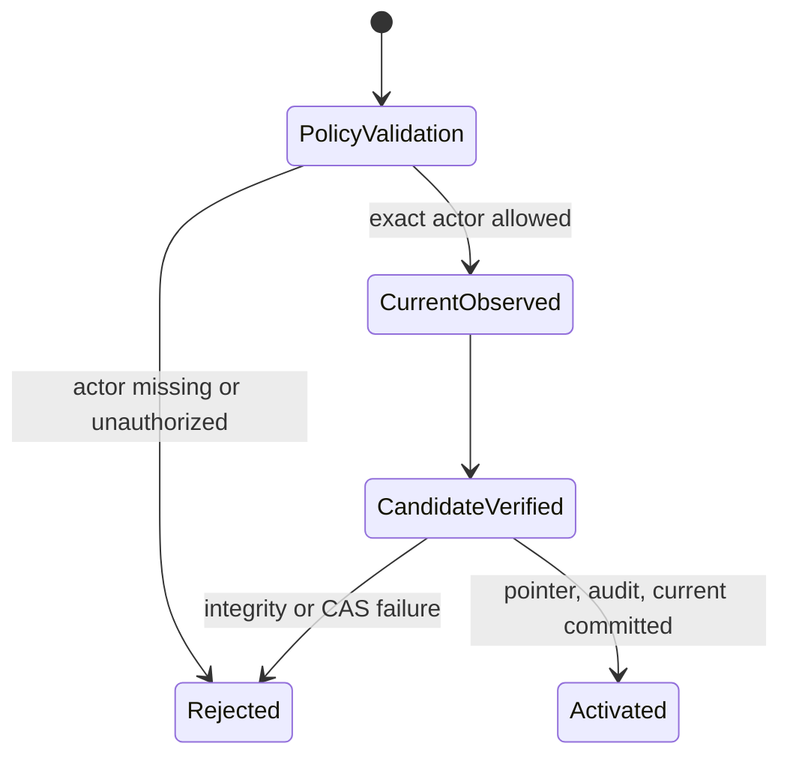

# Feature design: Airflow local promotion integrity v0.72.5

- Status: IMPLEMENTED
- Owner: dpone maintainers
- Approval: maintainer direction to continue the frozen self-service plan and
  remediate confirmed `v0.72.2` review findings as one goal
- Base commit: `64e0b3946281da9f4541f11894ff20c372fa210f`
- Target release: `0.72.5`
- Architecture: [ADR 0009](adr/0009-artifact-delivery-and-cache-materializer.md)
- Last verified: 2026-07-15

## Executive summary

The beginner `airflow preview` and safe-sample deployment facades promote a
local deployment by calling `cache_sync_result` without an actor allowlist or a
current-state compare-and-swap guard. The lower-level materializer treats an
empty allowlist as an intentionally disabled injected policy, so those facade
calls can mutate `current` without proving that their declared local actor is
the actor approved by the facade. They can also overwrite a concurrently
changed current deployment because no expected identity is supplied.

This bug fix makes the public mutation facade fail closed. Platform calls must
provide a non-empty exact-match allowlist. Beginner calls keep the same commands
and use one local promotion helper that supplies exactly one built-in actor and
an expected-current or expected-absent CAS guard. Filesystem permissions and
workload identity remain the authentication boundary; actor strings remain
policy assertions and are never presented as authentication proof.

## Personas and customer journey

| Persona | Goal | Current pain | Success signal |
|---|---|---|---|
| New data engineer | Preview a DAG with no platform ceremony | Preview mutates cache through an implicit disabled policy | The same command succeeds through an explicit local actor policy |
| Platform engineer | Promote only reviewed deployments | Empty allowlist silently disables actor policy | Empty and mismatched allowlists fail before cache mutation |
| Airflow operator | Avoid concurrent pointer loss | Beginner facade omits CAS | Concurrent/stale promotion receives a structured CAS error |

The public journey does not change:

```bash
dpone init project --airflow
dpone init pipeline orders_daily --recipe mssql-to-clickhouse-incremental --airflow
dpone check pipelines/orders_daily
dpone airflow preview orders_daily
dpone run pipelines/orders_daily --sample 1000 --target temporary
```

## Scope

### In scope

- Require a non-empty exact-match `allowed_promoters` policy in
  `cache_sync_result`.
- Return existing structured error codes before projection validation or cache
  mutation when the actor is absent or unauthorized.
- Add one local facade helper that reads the current physical identity, selects
  `expect_current_absent` or `expected_current_deployment_id`, and delegates to
  `cache_sync_result` with a one-actor allowlist.
- Route preview and safe-sample local promotion through that helper.
- Add regression tests for missing/mismatched allowlists, no mutation, explicit
  local actors, CAS selection, and the provider-loadable First DAG journey.
- Document the local-versus-platform policy boundary and recovery behavior.

### Non-goals

- New CLI flags or commands in the beginner journey.
- Treating `promoted_by` as authentication.
- Changing release/deployment fingerprints or cache layout.
- Replacing the materializer's injected policy mechanism.
- Remote artifact publication, live route certification, or a new ADR.

## Public contract and compatibility

`cache_sync_result(..., allowed_promoters=())` changes from an implicit
allow-policy bypass to a structured failure:

```yaml
schema: dpone.error.v1
code: DPONE_CURRENT_POINTER_PROMOTER_UNAUTHORIZED
stage: cache_sync
severity: error
```

An empty `promoted_by` continues to return
`DPONE_CURRENT_POINTER_PROMOTER_MISSING`. Valid platform CLI behavior is
unchanged because `--allowed-promoter` is already required. Direct callers of
the readiness facade must pass the exact trusted actor in `allowed_promoters`.
This is an intentional fail-closed security correction; no deprecation window
is appropriate.

The low-level `DeploymentCacheMaterializer` remains dependency-injectable for
internal validation and tests. The public mutation facade is responsible for
requiring policy configuration. External authentication remains outside both
objects and is enforced by cache filesystem permissions and CI/workload
identity.

## Detailed algorithm

### Platform mutation facade

```text
normalize non-empty actor and allowlist entries
if actor is empty:
    return DPONE_CURRENT_POINTER_PROMOTER_MISSING
if allowlist is empty or actor is not an exact member:
    return DPONE_CURRENT_POINTER_PROMOTER_UNAUTHORIZED
delegate to DeploymentCacheMaterializer with the same allowlist and CAS guard
return existing structured success/failure result
```

Authorization happens before deployment parsing, activation creation, pointer
write, audit append, or `current` replacement.

### Local beginner facade

```text
receive cache root, deployment directory, environment, fixed local actor
read current deployment identity through the public deployment-cache facade
if current state is absent:
    select expect_current_absent=true
else:
    select expected_current_deployment_id=current identity
call cache_sync_result with:
    promoted_by=fixed local actor
    allowed_promoters=(fixed local actor,)
    selected CAS guard
if another writer changed current after the read:
    return DPONE_CURRENT_POINTER_CAS_MISMATCH
```

The materializer rechecks CAS under the cache-root transaction lock. The helper
does not retry a mismatch because retrying would silently approve state the
caller did not observe. A subsequent user invocation rebuilds the plan against
the new current state.

### State and failure semantics



- Policy rejection performs zero cache mutation.
- Corrupt current state returns the existing recovery-required error; the local
  facade does not guess a CAS identity.
- Concurrent promotion has one winner. A stale caller fails with the existing
  CAS mismatch and does not overwrite the winner.
- Repeating the same promotion after observing it as current is idempotent.
- No secret, topology, row, or credential data is added to errors or evidence.

## Architecture and quality

| Component | Change | Responsibility |
|---|---|---|
| `cache_sync_result` | Existing | Enforce public mutation policy and adapt materializer errors |
| `local_cache_sync_result` | New small function | Supply fixed local actor policy and current CAS |
| Preview facade | Existing | Compile artifacts and request local promotion |
| Safe-sample deployment facade | Existing | Materialize runnable local projection and request local promotion |
| Deployment-cache facade | Existing | Re-export current-state reader through the canonical runtime boundary |
| Materializer | Unchanged | Verify, lock, snapshot, CAS, audit, and atomically activate |

Dependency direction remains readiness -> runtime. No vendor import or parse
path side effect is added. Production-code growth remains scoped and all
touched modules remain under the repository hard budget.

## Alternatives

| Alternative | Decision | Reason |
|---|---|---|
| Add actor flags to beginner commands | Reject | Exposes platform ceremony and lets the user choose both policy values |
| Make the low-level materializer always require a non-empty allowlist | Defer | Broad Python API/test migration is not needed to close the public facade bug |
| Continue with empty allowlist for local mode | Reject | Keeps a different mutation contract and hides future wiring mistakes |
| Retry CAS mismatch automatically | Reject | Could overwrite a deployment the caller never reviewed |

## Market comparison

N/A. This is an internal fail-closed correction to an already approved cache
promotion contract and introduces no competitive capability or product claim.

## Test and certification plan

| Layer | Scenario | Expected result |
|---|---|---|
| Unit | Empty/mismatched allowlist | Unauthorized error and no pointer/current/audit |
| Unit | Empty actor | Missing-actor error and no mutation |
| Unit | Local helper with no current | Exact local actor plus expected-absent guard |
| Unit | Local helper with current | Exact local actor plus expected-current guard |
| Concurrency | Current changes after local observation | CAS mismatch, winner preserved |
| E2E | First DAG preview then public provider load | One DAG, one workload, no errors |
| Regression | Safe sample local deployment | Runnable pinned deployment remains available |
| Broad | Non-live, docs, architecture, module size | All required gates pass |

Live MSSQL, ClickHouse, Vault, Kubernetes, remote materializer, and power-loss
checks are `N/A` for this local policy correction. They are not reported as
passes.

## Documentation and rollout

- Update the cache-sync runbook and self-service architecture with the explicit
  local facade policy and CAS behavior.
- Keep First DAG commands unchanged; add only an implementation note where it
  helps operators diagnose authorization/CAS errors.
- Record the fail-closed correction in `CHANGELOG.md`.
- Roll back by reverting the patch; rollback reopens the policy bypass and is
  not recommended.

## Agent execution plan

One integrator owns all writes because the change crosses one small shared
policy surface and parallel writer capacity is unavailable. Read-only review is
requested after implementation.

## Implementation evidence

- Validation report:
  `test_artifacts/airflow-local-promotion-integrity/validation-report.md`
- Full non-live result: `4302 passed, 472 skipped`.
- Fresh architecture/security and documentation/UX reviews found no blocking
  issues; the one actionable documentation note was incorporated.
- Live connector, Vault, Kubernetes, remote materializer, and power-loss checks
  remain `N/A` for this local facade correction and are not represented as
  passes.

## Approval checklist

- [x] User problem and journey are clear.
- [x] Algorithm, ordering, CAS, and failure semantics are explicit.
- [x] Public compatibility and migration are explicit.
- [x] No new architecture or ADR is required.
- [x] Market comparison is correctly N/A.
- [x] Tests, docs, rollout, and rollback are defined.
- [x] Path ownership is recorded in the task contract.
- [x] Maintainer direction authorizes remediation of confirmed review findings.
