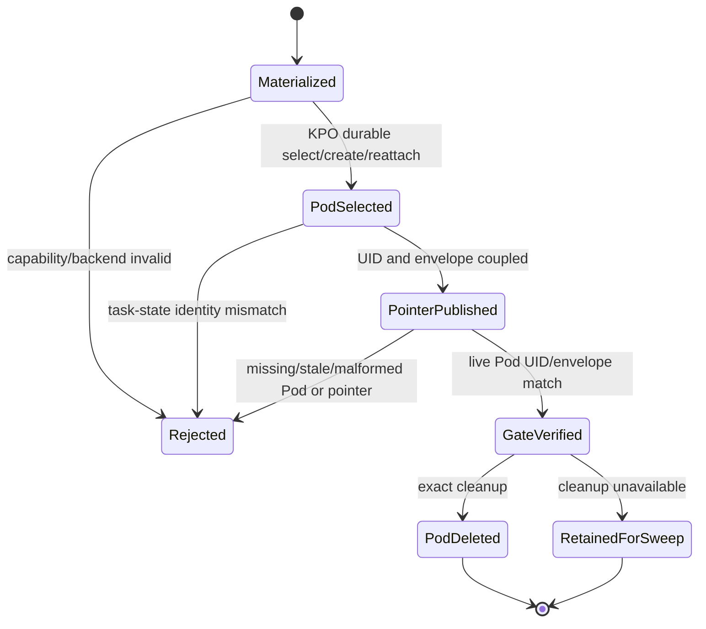
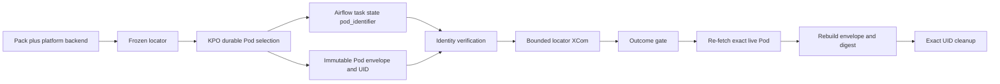

# Feature design: Airflow-native launch-pin backend

- Status: APPROVED
- Owner: Paul Kovalev
- Issue: production recovery for Kubernetes-restricted Airflow tenants
- Target release: 0.74.0
Last verified: 2026-08-15

## Executive summary

Exact-cache Airflow deployments require the separate `outcome_gate` to evaluate
the launch-time deployment identity, even when a newer deployment becomes the
parse tip while the runtime Pod is still running. The existing implementation
stores an occurrence pointer in Kubernetes ConfigMaps. That backend is correct,
but it requires `get`, `create`, `replace`, and `delete` permissions for
ConfigMaps in addition to the Pod permissions already required by
KubernetesPodOperator (KPO). Restricted tenants that can run Pods but cannot
create ConfigMaps fail before their workload starts.

dpone will add an explicit `airflow_task_state` launch-pin backend for Airflow
3.3 and CNCF Kubernetes provider 10.20 or newer. It composes with KPO's native
`durable=True` contract: KPO persists the selected Pod name and namespace in
Airflow task state before waiting, reconnects to that Pod after worker loss, and
falls back to its label-based reattach path only in the documented pre-persist
crash window. dpone keeps the immutable launch envelope on the Pod, records the
server-assigned Pod UID in the bounded upstream XCom, and makes the downstream
gate re-fetch and validate that exact live Pod. No Secret, ConfigMap,
DaemonSet, Lease, Variable, or direct Airflow metadata-database access is used.

The existing `kubernetes_configmap` backend remains the compatibility default.
There is no automatic fallback: a tenant explicitly selects the new backend and
unsupported Airflow/provider/context combinations fail closed before runtime
work is accepted. The measurable outcome is that exact-activation KPO DAGs run
with Pod-only Kubernetes RBAC while preserving launch-envelope, UID, retry,
deferral, tip-flip, and exact-delete evidence.

## Personas and customer journey

| Persona | Goal | Current pain | Success signal |
|---|---|---|---|
| Airflow platform owner | Run exact dpone DAGs with least privilege | ConfigMap mutation is forbidden by cluster policy | Required launch pins pass with Pod-only RBAC |
| Data engineer | Run or retry a DAG without understanding control-plane internals | Runtime task fails before starting with ConfigMap `403` | Same DAG UX and outcome evidence as the existing backend |
| Release engineer | Promote only the deployment exercised in DEV | Disabling launch-pin would make tip-flip evidence unsafe | DEV/PROD evidence names the same activation and exact Pod UID |
| Incident responder | Diagnose and recover a lost worker or stale Pod | Backend-specific failures are hard to distinguish | Typed capability/backend error and deterministic cleanup evidence |

Journey:

1. The platform upgrades Airflow to 3.3+ and the CNCF Kubernetes provider to
   10.20+.
2. The platform sets `DPONE_LAUNCH_PIN_STORE_BACKEND=airflow_task_state` on all
   DAG parsing and task-execution components.
3. dpone freezes the selected backend into runtime, gate, and cleanup task
   arguments during DAG construction.
4. At execution, dpone requires a task-state accessor and KPO durable execution,
   injects the exact launch envelope before Pod creation, and delegates Pod
   reattachment to KPO.
5. After KPO selects the concrete Pod, dpone hydrates its UID and verifies that
   KPO's persisted task-state Pod identity matches the selected Pod.
6. The runtime result and locator XCom carry a bounded occurrence reference.
7. The outcome gate re-fetches the exact namespace/name/UID, rebuilds the
   envelope digest, evaluates the runtime summary, and publishes an
   occurrence-bound cleanup handle.
8. Cleanup deletes only that exact Pod with a UID precondition. ConfigMap
   cleanup is not attempted for this backend.
9. On capability mismatch, missing state, stale/mismatched Pod, or malformed
   evidence, the task fails closed with an existing launch-pin error family.

## Scope

### In scope

- Explicit launch-pin backend selection and frozen backend identity.
- `airflow_task_state` support for Airflow 3.3+ and CNCF provider 10.20+.
- KPO `durable=True` enforcement and task-state Pod identity verification.
- Pod/XCom pointer resolution without ConfigMap I/O.
- Backend-aware cleanup that retains exact UID-precondition Pod deletion.
- Backward-compatible `kubernetes_configmap` behavior.
- Unit, contract, provider-version, retry/reentry, negative, and live DEV
  certification.

### Non-goals

- Granting or managing Kubernetes RBAC.
- Replacing KPO's native retry/reattach state machine.
- Using XCom as the launch-envelope authority; the live Pod remains authority C.
- Supporting `airflow_task_state` on Airflow below 3.3 or provider below 10.20.
- Silently falling back between backends at runtime.
- Changing credential projection or the unsafe connection bridge.

### Assumptions and constraints

- KPO can create, get/list/watch, patch, and exact-delete Pods as required by
  its own normal lifecycle.
- Airflow 3.3 task state is available in operator context.
- CNCF provider 10.20+ persists `pod_identifier` before waiting and reconnects
  through it on retry.
- Runtime Pods retained for a separate gate remain subject to the existing
  bounded retention sweeper if cleanup never runs.
- XCom remains bounded, redacted, and scoped to the current DAG run/task; it is
  a locator transport whose claims are verified against the live Pod.

## Public contract

### CLI

No new CLI command. Existing pack/check/render commands validate the backend
through the provider's pack contract.

### Python API

`LaunchPinStoreLocator` gains a backend discriminator. Public construction and
serialization helpers accept:

- `kubernetes_configmap` (default, existing behavior);
- `airflow_task_state` (new, capability-gated behavior).

Unknown values raise `DPONE_AIRFLOW_DEPLOYMENT_IDENTITY_PIN_INVALID`.

### Manifest/schema

The existing `launch_pin_store` object accepts optional `backend`. The process
environment `DPONE_LAUNCH_PIN_STORE_BACKEND` supplies the platform default.
Pack-local configuration wins over the environment and is frozen once during
materialization. Omitted backend preserves `kubernetes_configmap` behavior.

### Artifacts and evidence

Existing launch-pin and cleanup schemas remain readable. New evidence includes
the backend in frozen store coordinates and their authority digest. For
`airflow_task_state`, the existing v1 `pointer_resource_version` field carries
an opaque, deterministic task-state pointer receipt; it is not interpreted as
a Kubernetes resourceVersion. This preserves the published schema while the
backend discriminator defines its semantics.

### Compatibility and migration

- Existing packs and environments remain on `kubernetes_configmap`.
- New backend activation is platform-controlled and explicit.
- Parse compatibility remains for Airflow 2.10, but executing a required
  `airflow_task_state` pin there fails closed.
- Rollback removes the backend setting and returns to ConfigMap CAS after RBAC
  is restored; in-flight runs finish under their frozen backend.

## Detailed algorithm

1. Parse `launch_pin_store.backend`; reject unknown/empty explicit values.
2. Freeze backend, Kubernetes connection, namespace, and an authority digest
   once for runtime/gate/cleanup.
3. If backend is `kubernetes_configmap`, execute the existing CAS/barrier path
   unchanged.
4. If backend is `airflow_task_state`:
   1. require `durable=True` and a task-state accessor;
   2. inject the full launch envelope before Pod creation;
   3. do not attach the ConfigMap barrier;
   4. let KPO select/create/reattach and persist `pod_identifier`;
   5. hydrate the selected Pod UID;
   6. read KPO's stable state key and require exact namespace/name equality;
   7. build a full pointer from attempt coordinates, immutable Pod envelope,
      name/namespace/UID, and frozen backend authority;
   8. publish the full bounded locator plus compact summary reference in XCom.
5. Gate resolution couples compact summary reference to full locator, requires
   backend/digest agreement, and for `airflow_task_state` treats the coupled
   locator as an untrusted pointer claim.
6. Gate re-fetches exact namespace/name/UID, rebuilds the immutable envelope and
   pin digest, and rejects every mismatch before outcome evaluation.
7. Gate publishes a backend-aware cleanup handle.
8. Cleanup exact-deletes the Pod by UID. Only `kubernetes_configmap` transitions
   the subject head and deletes the per-try ConfigMap.

### Pseudocode

```text
locator = freeze(pack.launch_pin_store, platform_environment)

if locator.backend == kubernetes_configmap:
    use_existing_configmap_cas_barrier_commit_gate_cleanup()
else:
    require(airflow >= 3.3 and cncf_provider >= 10.20)
    require(kpo.durable is True)
    pod_request = inject_immutable_launch_envelope(pod_request)
    selected = kpo.get_or_create_pod(pod_request, context)
    selected = hydrate_uid(selected)
    persisted = context.task_state_store.get(KPO_POD_IDENTIFIER_KEY)
    require(persisted == selected.namespace_and_name)
    pointer = build_pin(selected.uid, selected.envelope, attempt, locator)
    xcom.push(full_pointer_and_compact_ref(pointer))

pointer_claim = pull_and_couple_runtime_xcom()
require(pointer_claim.backend == frozen_or_attempt_backend)
live_pod = get_exact_pod(pointer_claim.namespace, pointer_claim.name)
require(live_pod.uid == pointer_claim.uid)
rebuilt = rebuild_pin_from_live_pod(live_pod)
require(rebuilt.digest == pointer_claim.digest)
evaluate_runtime_summary_using(rebuilt.launch_envelope)
exact_delete(live_pod, uid_precondition=pointer_claim.uid)
```

### State machine



### Edge cases

- Missing task state or provider capability: fail before accepting a pin.
- Worker crash before KPO persists identity: KPO 10.20 performs its documented
  label-search reattach; dpone verifies the resulting persisted identity.
- Worker crash after persist: KPO reconnects directly to the exact name.
- Retry XCom: Airflow clears unsuccessful-attempt XCom; the new attempt must
  republish a coupled pointer.
- Deferrable reentry: compact ref remains in defer kwargs and locator XCom;
  rehydration must match the live Pod.
- Pod recreated under the same name: UID mismatch is `PIN_UNAVAILABLE`.
- Tip flip: the live Pod annotation/env envelope remains authoritative.
- Optional evidence env normalization: Kubernetes reconciliation may omit the
  empty-string representation only when the annotation authoritatively records
  null evidence. Missing or unequal env evidence remains invalid when the
  annotation contains a digest; identity and envelope-digest env keys are
  always mandatory.
- Gate never runs: the existing retained-Pod sweeper remains the backstop.
- Cleanup races with name reuse: UID delete precondition prevents wildcard
  deletion.

## Architecture

### Components and responsibilities

| Component | Existing/new | Responsibility | Dependencies |
|---|---|---|---|
| Backend locator | Extended | Validate/freeze backend and authority | Pure mapping/env parsing |
| KPO durable capability adapter | New | Enforce version/context and verify persisted Pod identity | Airflow public context, provider constant |
| ConfigMap backend | Existing | Head/per-try CAS and barrier | Kubernetes ConfigMap API |
| Airflow task-state backend | New | Compose KPO durable pointer with Pod authority | KPO, task state, Pod get |
| Pointer resolver | Extended | Dispatch by frozen backend and verify live Pod | Backend locator, Pod reader |
| Cleanup | Extended | Exact Pod delete plus backend-specific control cleanup | Pod reader, optional ConfigMap store |

### Ports, adapters, and composition root

Backend selection is a value contract, not a global service locator. Shared
policy validates/finalizes the locator. Backend-specific code supplies only the
pointer acquisition step; envelope reconstruction, digest checks, outcome
evaluation, and exact Pod cleanup stay common. Optional Airflow/provider imports
remain lazy so importing dpone core does not require Airflow.

### Data and control flow



### Alternatives and tradeoffs

| Alternative | Advantages | Disadvantages | Decision |
|---|---|---|---|
| Disable launch-pin | Small change | Reintroduces exact-cache tip-flip ambiguity | Rejected |
| Loader monkey-patch | Fast tenant recovery | Hidden policy, unversioned, inconsistent modules | Rejected |
| Kubernetes Lease | Native CAS | Requires new Lease RBAC, unavailable in target tenant | Rejected |
| Airflow Variable/direct metastore | Familiar storage | Cross-task global mutation, AF3 isolation/API incompatibility | Rejected |
| XCom-only authority | No extra permission | XCom does not prove the selected live Pod/envelope | Rejected |
| Dedicated authority Pod | Uses Pod RBAC | Extra scheduled objects and bespoke lifecycle | Rejected |
| KPO durable task state + live Pod authority | Uses upstream retry contract and existing Pod RBAC | Requires AF3.3/provider 10.20 | Adopted |

### ADR requirement

Required. This changes the production authority topology and the meaning of
launch-pin store selection. ADR 0050 records the backend strategy and safety
boundary.

### Quality-budget impact

One focused capability adapter and small dispatch extensions are expected. No
new dependency is added. Modules remain below the repository `max_sloc: 400`
budget; backend-specific behavior is not added to the existing Kubernetes CAS
modules.

## Market comparison

Primary sources verified 2026-08-15.

| System/version | Relevant capability | Observed design | Adopt/reject | Source/date |
|---|---|---|---|---|
| Apache Airflow 3.3 / CNCF provider 10.20 | Durable KPO retry | Persists Pod name/namespace in task state and reconnects on retry | Adopt as lifecycle authority | Airflow KPO docs and provider source, 2026-08-15 |
| Kubernetes | Object occurrence identity | Name is unique per kind/namespace while present; UID distinguishes recreated occurrences; delete supports UID preconditions | Adopt name/UID/exact-delete model | Kubernetes object/API docs, 2026-08-15 |
| Astronomer Cosmos 1.15 | Isolated dbt Kubernetes execution | Stable watcher-kubernetes and KPO-backed execution; no cross-task exact-deployment pin contract | Adopt isolation context; no pointer design to reuse | Cosmos execution-mode docs, 2026-08-15 |
| gusty | DAG authoring | N/A: no authoritative durable KPO occurrence protocol in the reviewed public contract | N/A | Project scope review, 2026-08-15 |
| dlt, Informatica, Airbyte, Fivetran, Pentaho, SSIS, Apache Beam | Data movement/runtime | N/A: not the Airflow KPO retry/pod occurrence control plane | N/A | Product scope, 2026-08-15 |

References:

- <https://airflow.apache.org/docs/apache-airflow-providers-cncf-kubernetes/stable/operators.html#durable-execution>
- <https://airflow.apache.org/docs/apache-airflow/3.3.0/administration-and-deployment/task-and-asset-state-store.html>
- <https://kubernetes.io/docs/concepts/overview/working-with-objects/names/>
- <https://kubernetes.io/docs/reference/kubernetes-api/definitions/preconditions-v1-meta/>
- <https://astronomer.github.io/astronomer-cosmos/getting_started/execution-modes.html>

## Measurable differentiation

```yaml
axis: additional Kubernetes mutable-resource permissions for exact KPO identity
scenario: exact-cache separate outcome gate on Airflow 3.3 / provider 10.20
baseline: ConfigMap backend requires Pod permissions plus ConfigMap get/create/replace/delete
metric: Kubernetes resource kinds requiring write permission
target: one (Pod), with zero Secret/ConfigMap/Lease/DaemonSet writes
procedure: deny all ConfigMap writes, run retry/reentry/tip-flip/live acceptance
artifact: test_artifacts/airflow-native-launch-pin/receipt.json
limitations: requires Airflow 3.3 and CNCF Kubernetes provider 10.20 or newer
```

## Security, privacy, and operations

- No credentials enter task state or launch-pin XCom.
- Pod specs remain redacted by existing operator policy.
- Backend selection is frozen and included in authority evidence.
- Unsupported capability and every pointer/UID/envelope contradiction fail
  closed.
- The new backend reduces Kubernetes privileges; it does not grant privileges.
- Operators monitor typed pin failures, retained Pod count, cleanup outcomes,
  provider version, and task-state availability.

## Test and certification plan

| Layer | Scenario | Environment | Expected artifact |
|---|---|---|---|
| Unit | backend parsing/default/unknown values | local | pytest |
| Unit | task-state identity match/missing/malformed/mismatch | local fakes | pytest |
| Contract | ConfigMap behavior unchanged | local | existing launch-pin suite |
| Contract | task-state path performs zero ConfigMap I/O | local spies | pytest |
| Compatibility | AF 2.10 parse, AF 3.3/provider 10.19 capability rejection, provider 10.20 pass | CI matrices | CI receipt |
| Retry/reentry | sync, deferrable, worker-loss reattach, XCom republish | provider tests | pytest |
| Live certification | ConfigMap writes denied; exact DAGs pass with current activation | DEV Airflow | JSON receipt + Airflow links |
| Rollout | all target DAGs then 17-table freshness | DEV then PROD | acceptance evidence |

## Documentation plan

- Update Airflow provider reference and launch-pin operations guide.
- Add migration and rollback instructions.
- Add 0.74.0 changelog entry.
- Record ADR 0050 and link it from the ADR index.
- Update tenant runbook with required Airflow/provider versions and evidence.

## Rollout and rollback

1. Merge/release dpone support with ConfigMap still default.
2. Upgrade DEV Airflow CNCF provider to 10.20 and deploy.
3. Verify provider version and task-state availability.
4. Set the explicit backend in DEV and deploy the dpone provider release.
5. Run targeted failed DAGs, full DAG acceptance, and data-plane checks.
6. Promote the same configuration and package set to PROD.
7. Run full PROD acceptance and table freshness checks.

Rollback removes the `airflow_task_state` setting and restores the previous
provider/image or ConfigMap backend only when ConfigMap RBAC is available.
In-flight DAGs retain their frozen backend; do not flip a running attempt.

## Agent execution plan

| Agent/role | Owned paths | Read-only paths | Forbidden paths | Dependency |
|---|---|---|---|---|
| Integrator | airflow-pack source/tests, docs, changelog | Airflow/Kubernetes official sources | connector/runtime data plane | approved design |

The primary agent is integrator and shared-file owner. No parallel writer is
used.

## Approval checklist

- [x] User problem and CJM are clear.
- [x] Algorithm and failure semantics are implementable without guessing.
- [x] Public contracts and compatibility are explicit.
- [x] Architecture and alternatives are justified.
- [x] Relevant market research uses current official sources.
- [x] Claimed differentiation is measurable.
- [x] Tests, evidence, docs, rollout, and rollback are complete.
- [x] Path ownership and integration plan are conflict-safe.
- [x] Maintainer changed status to `APPROVED`.
