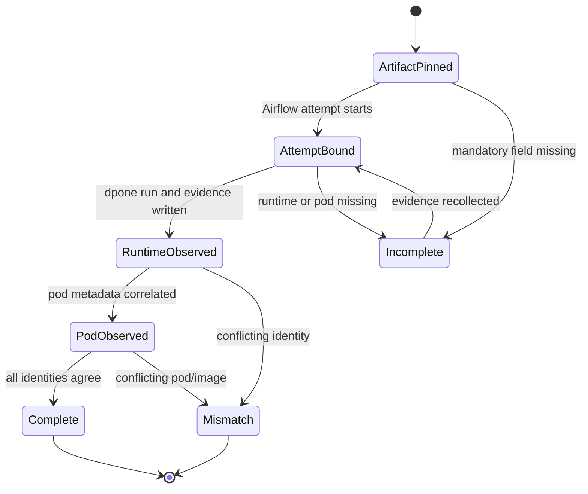
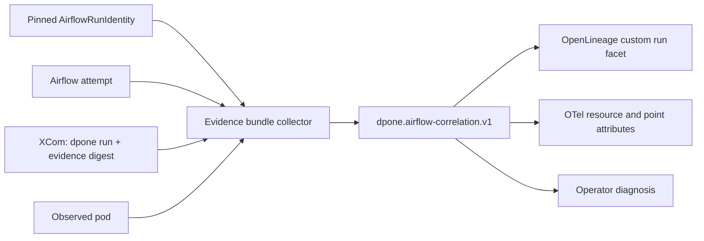

# Feature design: Airflow observability correlation v1

- Status: APPROVED
- Owner: dpone maintainers
- Approval: maintainer request to complete the frozen Industrial Self-Service
  Airflow roadmap as one goal
- Target release: 0.73.0
- Last verified: 2026-07-17

## Executive summary

dpone already records an immutable Airflow workload identity, Airflow task
attempt coordinates, runtime evidence checksums and observed Kubernetes pod
metadata. It also has dependency-light OpenLineage and OpenTelemetry-compatible
exporters. These records are currently adjacent rather than joined by one
validated contract, so an operator cannot reliably move from an Airflow task to
the exact dpone run, release, deployment, workload pack, runtime evidence and
pod without manually comparing several files.

This slice adds `dpone.airflow-correlation.v1`, a bounded, non-secret internal
identity assembled by the existing Airflow evidence-bundle collector. The
correlation has a stable attempt-level ID derived before workload execution and
late observations for the dpone run, runtime evidence and pod. The existing
OpenLineage and OpenTelemetry-compatible exporters optionally consume that
evidence bundle and emit the same correlation ID. No exporter performs network
I/O and no Airflow DAG parse path imports an observability SDK or reads runtime
state.

Success means one correlation ID joins Airflow, dpone, release/deployment,
workload pack, evidence and pod artifacts without secrets, mutable `current`
lookups, invented trace IDs or high-cardinality Prometheus labels.

## Personas and customer journey

| Persona | Goal | Current pain | Success signal |
| --- | --- | --- | --- |
| Data engineer | Find the dpone run behind a failed Airflow task | Run IDs and evidence digests live in separate outputs | One evidence bundle exposes a copy-safe correlation ID |
| Airflow operator | Move from task attempt to pod and evidence | Pod UID and release identity require manual comparison | Attempt, pod and artifact identities are validated together |
| Platform engineer | Feed lineage and telemetry backends | Every backend would otherwise invent its own join keys | OpenLineage and OTel artifacts use one canonical model |
| Security engineer | Prove telemetry contains no credentials | Arbitrary baggage or resource attributes can leak data | The schema accepts only bounded non-secret identity fields |

Journey:

1. A pipeline author uses the existing five-command golden path. There is no
   new beginner command or manifest field.
2. The provider continues to pin `dpone.airflow-run-identity.v1` in the KPO.
3. The runtime XCom summary extracts only the safe dpone `run_id` and process
   name from the standard JSON run report.
4. The evidence-bundle collector receives the Airflow attempt coordinates,
   verified XCom, runtime evidence and observed pod metadata.
5. It derives one stable `correlation_id`, validates all joins and writes the
   correlation into the existing evidence bundle.
6. A release-policy bundle fails closed when any mandatory identity is missing
   or contradictory. Advisory/PR policy reports the gap without claiming full
   correlation.
7. An operator can pass the evidence bundle to the existing lineage or metrics
   exporter. Both outputs carry the same correlation ID.
8. The platform uploads the generated files using its own transport. dpone
   never contacts an OpenLineage or OTel collector in this slice.
9. On retry, a new `try_number` creates a new attempt correlation. A pod
   replacement observed for the same attempt does not alter the correlation ID.

## Scope

### In scope

- Pure `dpone.airflow-correlation.v1` model and deterministic fingerprint.
- Safe extraction of `run_id` and process from standard dpone JSON run output.
- Additive correlation section in `gitops.airflow_xcom_summary` and
  `gitops.airflow_evidence_bundle`.
- Release-policy completeness and mismatch blockers.
- Optional `--airflow-evidence-bundle` input for existing OpenLineage and
  OpenTelemetry-compatible exporters.
- A dpone custom OpenLineage run facet with an immutable schema URL.
- Deterministic UUIDv5 OpenLineage `runId` when complete correlation exists.
- OTel resource/data-point attributes separated by stability and cardinality.
- Documentation, schemas, security tests and local compatibility tests.

### Non-goals

- A network OpenLineage transport, OTel SDK, collector client or background
  exporter.
- Generating synthetic W3C `traceparent`, `trace_id` or `span_id` values.
- Propagating correlation through arbitrary OTel baggage.
- Adding correlation IDs to Prometheus labels.
- Replacing Airflow's official OpenLineage provider or its task/DAG facets.
- Querying Airflow metadata, Kubernetes, Vault or a collector during DAG parse.
- Changing release/deployment/pack identity or reproducible rerun semantics.
- Row- or column-level lineage extraction beyond existing asset declarations.
- Making pod UID part of the logical task-attempt identity.
- A new beginner-facing CLI command.

### Assumptions and constraints

- `AirflowRunIdentity` remains the immutable artifact identity and is not
  expanded with mutable execution observations.
- Airflow task-attempt identity is the tuple `dag_id`, `task_id`, `run_id`,
  `try_number`, `map_index`.
- The runtime command emits the documented JSON run report with top-level
  `run_id` and `process`. Missing values are explicit correlation gaps.
- The existing runtime evidence SHA-256 is the canonical evidence reference;
  the evidence bundle cannot include its own checksum without self-reference.
- The latest OpenLineage Airflow provider supports Airflow 2.11+, while Airflow
  2.10 requires a compatible older provider. dpone therefore emits portable
  files and does not introduce a mandatory OpenLineage provider dependency.
- High-cardinality attempt/run fields belong to OTel metric data points, not
  process resource identity or Prometheus labels.

## Public contract

### CLI

The evidence-bundle command is unchanged. Its JSON result gains an additive
`correlation` section.

The existing exporters gain one optional input:

```bash
dpone ops lineage-export \
  --run-registry-entry .dpone/runs/orders/run_registry.json \
  --airflow-evidence-bundle .dpone/gitops/airflow/airflow-evidence-bundle.json \
  --namespace dpone.prod \
  --format json

dpone observability metrics-export \
  --run-report .dpone/runs/orders/run_report.json \
  --airflow-evidence-bundle .dpone/gitops/airflow/airflow-evidence-bundle.json \
  --output-dir .dpone/observability/orders \
  --format json
```

Rules:

- omitting the option preserves existing output behavior;
- providing a missing, invalid or incomplete bundle makes the export report
  fail with a structured blocker and never silently drops correlation;
- stdout remains the report selected by `--format`; artifacts remain local;
- exporters do not perform network, metadata DB, Airflow, Vault or Kubernetes
  I/O;
- existing exit-code behavior remains `0` for passed and `1` for blocked.

### Python API

```python
from dpone.contracts.airflow_correlation import (
    AirflowCorrelation,
    AirflowCorrelationError,
    build_airflow_correlation,
    parse_airflow_correlation,
)

correlation = build_airflow_correlation(
    run_identity=run_identity,
    attempt=attempt,
    dpone_run_id="orders-20260717T120000Z",
    dpone_process="orders",
    runtime_evidence_sha256="sha256:...",
    pod=pod,
)
```

The core contract imports no Airflow, Kubernetes, OpenLineage or OTel types.
Framework and exporter adapters translate the pure model at their composition
roots.

### Correlation schema

```yaml
schema: dpone.airflow-correlation.v1
correlation_id: sha256:...
attempt_ref: sha256:...
airflow:
  dag_id: orders_daily
  task_id: load_orders
  run_id: scheduled__2026-07-17T00:00:00+00:00
  try_number: 1
  map_index: -1
dpone:
  run_id: orders-20260717T000000Z
  process: orders
artifacts:
  release_id: sha256:...
  deployment_id: sha256:...
  workload_id: load_orders
  workload_pack_sha256: sha256:...
  runtime_evidence_sha256: sha256:...
pod:
  name: load-orders-x7f9
  uid: 6d6d...
  namespace: airflow-example
  image_digest: sha256:...
```

`correlation_id` and `attempt_ref` are equal in v1 and are computed from:

```text
sha256(canonical_json({
  schema,
  airflow: {dag_id, task_id, run_id, try_number, map_index},
  release_id,
  deployment_id,
  workload_id,
  workload_pack_sha256
}))
```

The digest excludes `dpone.run_id`, runtime evidence and pod observations so it
can be derived before runtime and stays stable if a pod is replaced during the
same Airflow attempt. These observations are still mandatory for a complete
release evidence bundle.

Limits:

- canonical serialized size at most 32 KiB;
- all text fields non-empty and at most 1024 characters;
- process and pod name at most 253 characters;
- digests use canonical lowercase `sha256:<64 hex>` form;
- no arbitrary labels, baggage, URLs, connection refs or user payloads;
- the model never stores secret values or hashes of secret values.

### XCom and evidence

The inline runtime evidence gains:

```yaml
dpone_run:
  run_id: orders-20260717T000000Z
  process: orders
```

The XCom summary may contain a partial `correlation` before pod observation. It
contains the attempt/artifact identity and safe dpone run identity when the
runtime has them. The final evidence bundle contains the complete correlation
and is authoritative for exports.

Release policy blockers:

- `DPONE_AIRFLOW_CORRELATION_MISSING`
- `DPONE_AIRFLOW_CORRELATION_INCOMPLETE`
- `DPONE_AIRFLOW_CORRELATION_INVALID`
- `DPONE_AIRFLOW_CORRELATION_MISMATCH`

Advisory and PR policies expose the same conditions as warnings. A mismatch is
always a blocker because joining unrelated runs is worse than missing telemetry.

### OpenLineage projection

With a complete correlation, `OpenLineageExportService`:

- derives `run.runId` as UUIDv5 from `correlation_id`;
- preserves the original dpone run ID in the dpone facet;
- adds custom run facet key `dpone_airflowCorrelation`;
- keeps existing input/output dataset handling;
- uses an immutable versioned schema URL;
- never duplicates Airflow's native task/DAG metadata facet.

The facet includes the correlation ID, Airflow attempt, release/deployment,
workload pack, runtime evidence digest and pod references. It contains no
registry body, Vault path, secret version value, signed URL or row data.

Without the optional Airflow evidence bundle, legacy OpenLineage output remains
unchanged for compatibility.

### OpenTelemetry projection

Stable deployment/resource attributes:

```text
service.name
service.namespace
service.version
deployment.environment (when supplied by the caller)
dpone.release.id
dpone.deployment.id
dpone.workload.id
dpone.workload.pack.sha256
k8s.namespace.name
k8s.pod.name
k8s.pod.uid
container.image.id
```

Attempt-level metric data-point attributes:

```text
dpone.correlation.id
dpone.run.id
dpone.process.name
dpone.evidence.sha256
airflow.dag.id
airflow.task.id
airflow.run.id
airflow.task.try_number
airflow.task.map_index
```

The renderer does not put high-cardinality fields into Prometheus output. It
does not emit trace/span IDs because no real OTel span context exists. A future
SDK integration may propagate a genuine W3C context without changing this
correlation model.

### Compatibility and migration

- Existing manifests, packs, provider imports and beginner commands are
  unchanged.
- XCom/evidence additions are additive under current schema majors.
- Existing exporter calls without `--airflow-evidence-bundle` are unchanged.
- Release evidence assembled after this feature must include complete
  correlation. Operators should ensure run JSON contains `run_id` and that pod
  launch evidence or explicit observed pod metadata is available.
- Rollback removes the optional exporter input and correlation enforcement;
  immutable run/artifact identity remains valid.

## Detailed algorithm

1. The provider validates and propagates the existing immutable run identity.
2. The runtime executes the run spec and writes runtime evidence before XCom.
3. The XCom builder scans bounded parsed JSON objects from runtime output.
4. It extracts only top-level `run_id` and `process` from a standard dpone run
   report; conflicting values fail closed.
5. The evidence collector validates every child artifact and computes its
   checksum as today.
6. It correlates all observed run identities and blocks mismatches.
7. It validates Airflow attempt fields, runtime evidence digest and pod fields.
8. It builds the canonical attempt payload and computes `correlation_id`.
9. It verifies any partial XCom correlation has the same ID and observations.
10. It emits complete correlation or policy-specific missing/incomplete issues.
11. The OpenLineage exporter reads the evidence bundle, validates the
    correlation, derives UUIDv5 and adds one custom run facet.
12. The OTel exporter reads the same bundle, adds stable resource and
    high-cardinality data-point attributes, then writes local files atomically
    with its existing artifact index.

### Pseudocode

```text
run_identity = correlate_verified_run_identity(child_artifacts)
attempt = validate_attempt(cli_attempt)
dpone_run = extract_safe_dpone_run(xcom.inline_runtime_evidence)
evidence_ref = xcom.runtime_evidence_sha256
pod = correlate_observed_pod(profile, pod_launch, cli_overrides)

base = canonical_attempt_payload(run_identity, attempt)
correlation_id = sha256(canonical_json(base))
correlation = validate(AirflowCorrelation(
    correlation_id,
    attempt,
    dpone_run,
    release/deployment/pack,
    evidence_ref,
    pod,
))

if conflicting observation:
    block DPONE_AIRFLOW_CORRELATION_MISMATCH
elif correlation incomplete and runner_policy == release:
    block DPONE_AIRFLOW_CORRELATION_INCOMPLETE
elif correlation incomplete:
    warn DPONE_AIRFLOW_CORRELATION_INCOMPLETE

if exporter correlation input provided:
    require complete valid correlation
    project to OpenLineage or OTel
```

### State machine



Correlation artifacts are immutable outputs, not mutable state. Recollection
from identical source artifacts is deterministic.

### Edge cases

- Empty input still has a dpone run and complete correlation.
- Failed runtime still exports a failed OpenLineage event and OTel metrics when
  identity/evidence are complete.
- A malformed runtime stdout object is ignored unless no valid run report can
  be found; arbitrary strings are never copied to correlation.
- Multiple different dpone run IDs in one workload are rejected in v1.
- A mapped task includes `map_index`; unmapped uses `-1`.
- Retry increments `try_number` and creates a distinct correlation ID.
- Deferrable KPO re-entry preserves the same Airflow attempt identity.
- Pod replacement may update observed pod fields but not correlation ID.
- Missing pod UID blocks release correlation even if pod name is present.
- Evidence checksum mismatch remains a child-artifact blocker before export.
- An invalid optional correlation file blocks the exporter; it never falls back
  to uncorrelated output while claiming success.

## Architecture

### Components and responsibilities

| Component | Existing/new | Responsibility | Dependencies |
| --- | --- | --- | --- |
| `AirflowRunIdentity` | Existing | Immutable release/deployment/pack identity | Pure contracts |
| `AirflowCorrelation` | New | Attempt identity plus validated runtime observations | `AirflowRunIdentity` values only |
| XCom inline extractor | Extended | Bounded safe dpone run projection | Runtime evidence models |
| Evidence bundle collector | Extended | Join and validate all correlation observations | Pure correlation builder |
| OpenLineage export service | Extended | Optional custom facet and UUIDv5 projection | Correlation parser |
| OTel JSON renderer/service | Extended | Optional correlation attributes | Correlation parser |
| Airflow provider | Unchanged in v1 | Pins artifacts and KPO execution | No OTel/OpenLineage import |

### Ports, adapters, and composition root

The domain contract accepts mappings/dataclasses and returns a pure immutable
model. File reads remain in CLI/application services. OpenLineage and OTel
renderers are outbound adapters. They depend on the correlation contract; the
contract never depends on exporter or framework packages. Clocks remain in the
exporters because event time is not identity.

### Data and control flow



### Alternatives and tradeoffs

| Alternative | Advantages | Disadvantages | Decision |
| --- | --- | --- | --- |
| Add attempt fields to `AirflowRunIdentity` | One object | Makes immutable artifact identity attempt-specific and breaks mapped reuse | Reject |
| Use dpone run ID as the only join key | Simple | Does not prove release, deployment, pack, task retry or pod | Reject |
| Put all identity in OTel baggage | Automatic propagation | Leakage and trust-boundary risks; exporter-specific authority | Reject |
| Generate deterministic trace/span IDs | Easy backend join | Claims traces that were never recorded and violates trace semantics | Reject |
| Make pod UID part of correlation digest | Strong physical identity | Pod replacement changes logical attempt identity | Reject |
| Let each exporter derive its own key | Small local changes | Drift and impossible cross-tool validation | Reject |
| Shared pure correlation contract | DRY, testable and backend-neutral | Requires explicit projection adapters | Adopt |

### ADR requirement

Required. The split between immutable artifact identity, attempt correlation and
late runtime observations is a long-lived cross-layer decision. See ADR 0020.

### Quality-budget impact

- one pure contract module below 300 SLOC;
- one small correlation reader/projector per exporter concern;
- existing evidence model/collector changes remain cohesive;
- no OpenLineage/OTel SDK import edge from provider or contracts;
- no production module may exceed the checked-in SLOC/graph budgets.

## Market comparison

Research used official primary documentation available on 2026-07-17.

| System/version | Relevant capability | Observed design | Adopt/reject |
| --- | --- | --- | --- |
| dlt 1.28.1 | Pipeline telemetry and load lineage | Tracks pipeline/load transactions and destination fingerprints; local traces expose step/load information | Adopt explicit run/load identity; reject anonymous product telemetry as operational evidence ([source](https://dlthub.com/docs/reference/telemetry)) |
| Informatica | N/A | Product lineage is relevant, but no public contract matching Airflow attempt to immutable external runtime artifacts was identified for this slice | N/A: managed platform architecture differs |
| Airbyte | Lineage concepts | Public guidance promotes event-driven hooks and OpenLineage, but no equivalent composite Airflow/runtime identity contract is documented | Adopt open standard projection; retain dpone authority ([source](https://airbyte.com/data-engineering-resources/track-data-lineage-etl-pipelines)) |
| Fivetran | Operational/lineage metadata | Platform Connector delivers account, logs and optional column lineage into destination tables | Adopt queryable operational metadata; reject vendor-specific identity as portable contract ([source](https://fivetran.com/docs/logs/troubleshooting/enable-lineage-metadata-tables)) |
| Pentaho | N/A | No directly relevant current official Airflow/OpenLineage/OTel correlation contract | N/A |
| Microsoft SSIS | Execution correlation | Logs use execution GUIDs and optional runtime lineage logging | Adopt explicit execution ID; reject package-local ID as sufficient cross-platform identity ([source](https://learn.microsoft.com/en-us/sql/integration-services/performance/integration-services-ssis-logging?view=sql-server-ver17)) |
| gusty | N/A | DAG generation is relevant to authoring but not runtime observability correlation | N/A |
| Astronomer Cosmos | Zero-code Airflow lineage | Uses the official Airflow OpenLineage provider without user DAG changes | Adopt zero-DAG-code integration and optional provider dependency ([source](https://astronomer.github.io/astronomer-cosmos/configuration/lineage.html)) |
| Apache Beam | N/A | Portable metrics are relevant, but no direct dpone/Airflow artifact correlation pattern is required here | N/A |

Standards research:

- Airflow emits basic OpenLineage events for all non-disabled tasks; supported
  operators add richer datasets/facets ([official provider docs](https://airflow.apache.org/docs/apache-airflow-providers-openlineage/stable/supported_classes.html)).
- Operator OpenLineage imports should be local and optional
  ([developer guide](https://airflow.apache.org/docs/apache-airflow-providers-openlineage/stable/guides/developer.html)).
- OpenLineage custom facets require project-prefixed names and immutable schema
  URLs ([facet specification](https://openlineage.io/docs/spec/facets/)).
- OTel resources identify the entity producing telemetry; correlation context
  should not contain secrets ([resource conventions](https://opentelemetry.io/docs/specs/semconv/resource/),
  [propagation security](https://opentelemetry.io/docs/concepts/context-propagation/)).

## Measurable differentiation

```yaml
axis: deterministic cross-plane diagnosis
scenario: one failed mapped Airflow KPO attempt with a replaced pod
baseline: manual comparison of Airflow task, dpone run, deployment, pack and pod artifacts
metric: time to locate the exact runtime evidence and immutable workload identity
target: median <= 2 minutes and 100% identity mismatch detection
procedure: five unfamiliar operators diagnose a prepared failure using only documented artifacts
artifact: test_artifacts/airflow-observability-correlation-v1/usability-report.json
limitations: local tests prove contract behavior; production backend navigation requires approved live evidence
```

## Security, privacy, and operations

- Correlation carries identifiers, never secret values, hashes of passwords,
  Vault paths, tokens, signed URLs, connection payloads or row data.
- Input fields are allowlisted, length-bounded and recursively reject unknown
  structure where applicable.
- OTel baggage is not used, avoiding accidental propagation outside the trust
  boundary.
- Registry paths and connection refs remain excluded from normal exporter
  output.
- `run_id`, DAG/task IDs and pod metadata may be operationally sensitive; files
  inherit evidence-bundle access controls and retention.
- Exporters write local files and checksums. Platform-owned uploaders handle
  authentication, retries and network policy.
- Alerts should use low-cardinality status metrics; correlation IDs belong in
  logs, events or exemplars, not alert grouping labels.
- Runbook recovery is re-collect evidence from immutable artifacts; never edit
  a correlation object by hand.

## Test and certification plan

| Layer | Scenario | Environment | Expected artifact |
| --- | --- | --- | --- |
| Unit | Canonical ID stability and validation | Python 3.11/3.12 | pytest result |
| Contract | XCom/evidence schema and redaction | Local | generated schema + fixture |
| Integration | Evidence -> OpenLineage/OTel same ID | Local | correlated JSON artifacts |
| Compatibility | Existing exporters without correlation | Local | unchanged legacy snapshots |
| Airflow matrix | Provider import/parse remains optional and side-effect free | Airflow 2.10/2.11/3.2/3.3 | CI matrix |
| Live certification | Airflow KPO -> pod -> Vault -> evidence -> exporters | Approved Kubernetes environment | signed certification bundle |
| Performance | 500 evidence bundles/export projections | Fixed CI runner | p95 and RSS report |

Required negative cases:

- malformed or oversized correlation;
- secret-like unknown fields;
- release/deployment/pack mismatch;
- Airflow DAG/attempt mismatch;
- conflicting dpone run IDs;
- missing runtime evidence digest;
- missing pod UID under release policy;
- image digest mismatch;
- path traversal/symlink escape in optional evidence input;
- OpenLineage exporter receives incomplete bundle;
- OTel exporter does not add correlation to Prometheus labels;
- no OpenLineage/OTel/Vault import during provider parse;
- no network call from either exporter.

Live certification remains `UNVERIFIED` until an approved Airflow/Kubernetes
environment and collector adapter are available. A skipped live run is not a
pass.

## Documentation plan

- Update `docs/airflow-self-service.md` with the diagnosis path.
- Update `docs/airflow-pack-provider.md` with correlation ownership.
- Update `docs/observability.md` with OTel resource/data-point taxonomy.
- Update `docs/lineage.md` with the optional evidence bundle and facet.
- Update `docs/compatibility.md` for Airflow/OpenLineage provider versions.
- Add schema reference and error/runbook entries.
- Update the Phase 3 backlog only after local and exact-matrix evidence exists.

## Rollout and rollback

1. Ship additive model/schema and XCom safe run extraction.
2. Add evidence-bundle correlation in advisory/PR mode.
3. Add optional exporter inputs and compatibility tests.
4. Enable release-policy completeness in the same release with migration docs.
5. Run exact Airflow matrix and local exporter certification.
6. Keep live backend/Kubernetes certification `UNVERIFIED` until approved.

Rollback removes exporter options and release completeness enforcement. Existing
run identities, XCom summaries and evidence artifacts remain readable because
new sections are additive.

## Agent execution plan

| Agent/role | Owned paths | Read-only paths | Forbidden paths | Dependency |
| --- | --- | --- | --- | --- |
| Integrator | Contract, evidence, exporters, tests, docs, ADR | Frozen architecture and existing run identity | `.cursor`, unrelated connectors, release metadata | Approved spec |
| Fresh reviewer | Final diff only | All changed files | Writes | Implementation complete |

One integrator owns all semantic files. Fresh subagent review is attempted; if
thread capacity prevents it, review remains explicitly `UNVERIFIED`.

## Approval checklist

- [x] User problem and CJM are clear.
- [x] Algorithm and failure semantics are implementable without guessing.
- [x] Public contracts and compatibility are explicit.
- [x] Architecture and alternatives are justified.
- [x] Relevant market research uses current official sources.
- [x] Claimed differentiation is measurable.
- [x] Tests, evidence, docs, rollout, and rollback are complete.
- [x] Path ownership and integration plan are conflict-safe.
- [x] Maintainer authorized completion of the frozen roadmap and status is `APPROVED`.
