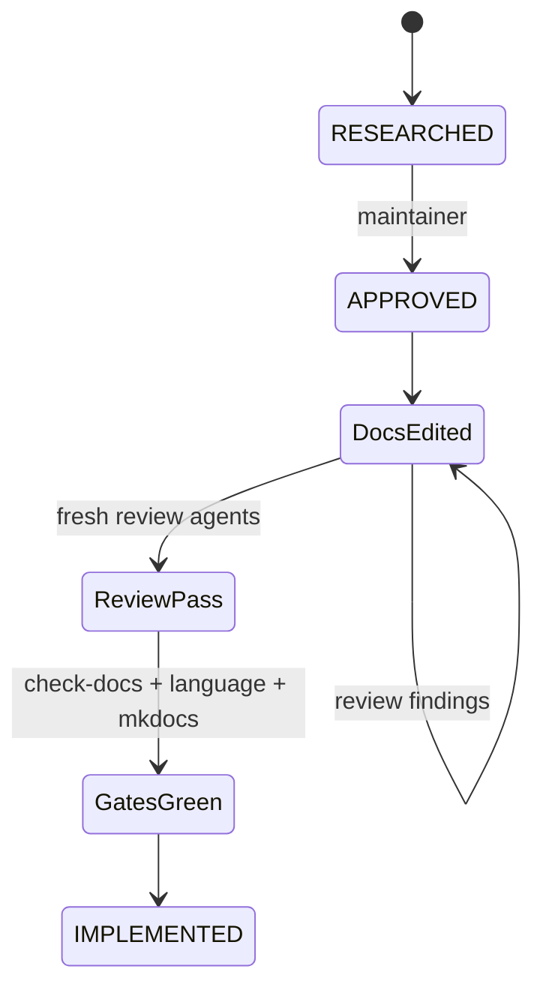

# Feature design: Airflow self-service pipeline-first UX (P0)

- Status: IMPLEMENTED
- Evidence: `tests/test_docs_language_contracts.py` (P0 asserts); docs MR on
  branch `docs/airflow-pipeline-first-ux-p0`
- Owner: data architecture / integrator
- Issue: follow-up to Airflow self-service industrial roadmap (post v0.73.0)
- Target release: TBD (docs-only patch or next minor docs train)
- Last verified: 2026-07-17

## Maintainer decisions (locked 2026-07-17)

1. Scaffolded `domains/<domain>.yaml` is **read-mostly / do not edit** for beginners.
2. P0 acceptance is **docs contract tests only** (no user study required for APPROVED/IMPLEMENTED).
3. Beginner CJM stays minimal; **advanced Data Engineer CJM** is a separate page; GitOps
   workload catalog and selectors are **removed from beginner-adjacent early nav**
   and reached only from the advanced CJM / hub “Advanced” section.

## Executive summary

Beginners already see mostly `pipeline` on the golden path, but still discover
advanced GitOps early (`GitOps workload catalog` in Core concepts nav, hub link
to selectors as day-1 multi-workload tooling, Analyst → `dpone workload init`,
and the YAML key `workloads:` inside scaffolded domain files). P0 improves
**progressive disclosure and a single user-facing noun** without changing runtime
contracts: documentation and navigation only.

Machine identity stays `workload_id` / `workload_packs` / `cached://workloads/...`.

**P0 success (contract):** glossary exists; First Airflow DAG keeps the five
commands and includes the authoritative What-to-commit table; advanced pages
carry a stable disclaimer marker; beginner nav no longer lists GitOps workload
catalog / selectors; freeze YAML and public-contract freeze tests are unchanged.

## Personas and customer journey

| Persona | Goal | Current pain | Success signal |
|---|---|---|---|
| New data engineer (beginner) | First Airflow-oriented pipeline | Advanced catalog/selectors appear early; domain YAML shows `workloads:` | Completes beginner CJM without opening advanced pages |
| Data engineer (advanced) | Governed multi-pipeline / GitOps ship | Advanced path mixed with beginner | Follows dedicated advanced CJM |
| DataOps | Operate packs/cache | Role matrix buried | Finds role → command table on hub |
| Maintainer | No contract churn | Fear of renaming schemas | Freeze surfaces untouched |

### Beginner CJM (P0 — keep very simple)

1. Discovery → First Airflow DAG (+ glossary link).
2. `dpone init project --airflow` / `dpone init pipeline … --airflow`.
3. Edit only `pipelines/<id>/pipeline.yaml` (+ SQL if the recipe adds it).
4. Commit per What-to-commit table (`domains/`: commit, do not edit; tests:
   commit as scaffold, edit only later if you harden hermetic tests).
5. `dpone check` → `dpone airflow preview` → optional sample.
6. Stop. No selectors, no GitOps catalog, no pilot.

### Advanced Data Engineer CJM (P0 — new page)

Separate how-to under Airflow / Core concepts advanced section:

1. Prerequisites: completed beginner First DAG once.
2. When to use advanced: multi-pipeline wiring, selectors, GitOps workload set,
   pilot layout, `dpone workload init`.
3. Links to gated pages: selectors, GitOps workload catalog, pilot, authoring
   migration, self-service evidence.
4. Explicit non-goals: not the first-day path; not required for preview.

## Scope

### In scope

- New glossary: `docs/getting-started/airflow-pipeline-glossary.md`.
- New advanced CJM: `docs/airflow-self-service-advanced-cjm.md`.
- What-to-commit table on First Airflow DAG (exact rows below).
- Classification pass for `workload*` on beginner pages (table below).
- Hub: role matrix; ungated selectors link removed/relocated to Advanced;
  Analyst row points to advanced CJM, not day-1.
- Required advanced disclaimer marker on listed pages.
- Nav: glossary under Getting started; demote GitOps workload catalog and
  Workload selectors out of early Core concepts / beginner sightlines into an
  Advanced Airflow cluster that also holds the new advanced CJM.
- Extend `tests/test_docs_language_contracts.py` for P0 asserts.
- `CHANGELOG.md` Unreleased docs note.
- Mark P0 UX checkbox in `docs/airflow-self-service-backlog.md` (integrator).

### Non-goals

- Renaming JSON/schema fields, URIs, CLI groups (`dpone workload`), error codes.
- Changing default CLI stdout of init/check/preview/sample (P1).
- Changing `--select` help strings or selection engine (P1).
- Removing the workload delivery layer or multi-workload DAGs.
- Cosmos-like Python DAG authoring.
- User study execution or live certification (release GO gates; post-P0).
- P1 quieter CLI / P2 Source→Sink product framing (separate specs).
- Editing golden bash/JSON fences on First Airflow DAG except additive tables
  and glossary links outside those fences.

### Assumptions and constraints

- `pipeline_id` equals catalog `workload_id` and default `dag_id` on beginner 1:1:1.
- English-only public docs remain normative.
- Forbidden to modify in P0:
  - `docs/airflow-self-service-public-contracts-v1.yaml`
  - `tests/test_airflow_v1_public_contract_freeze.py`
  - `docs/reference/airflow-public-contracts.md` (except if a nav-only cross-link
    is required; prefer no edit)
  - any `docs/schemas/**` field names
  - `src/**`, `packages/**`

## Public contract

### CLI

No command, option, exit code, or default stdout/stderr change in P0.

### Python API

No change.

### Manifest/schema

No change. Domain catalog keeps YAML key `workloads:`; glossary and What-to-commit
tell beginners this is scaffold registration of their pipeline — do not edit.

### Artifacts and evidence

No change.

### Compatibility and migration

Docs/nav only. Rollback = revert MR. Empty diff required on freeze YAML and
`tests/test_airflow_v1_public_contract_freeze.py`.

## Authoritative What-to-commit table (must appear on First Airflow DAG)

Sourced from `AirflowPipelineScaffolder` + First DAG `init project` expected files.

### After `dpone init project --airflow`

| Path | Beginner action | Notes |
|---|---|---|
| `dpone.yaml` | Commit; edit only if platform docs say so | Project policy |
| `dags/dpone.py` | Commit; **do not edit** | Shared loader |
| `environments/dev/binding-set.yaml` | Commit; logical aliases only | No secrets |
| `environments/dev/credential-runtime.yaml` | Commit; **platform-shaped** | Prefer leave defaults |
| `platform/connection-registries/dev.yaml` | Commit; **do not put secrets** | Platform-owned |
| `.dpone-cache/**` | **Do not commit** | Build/runtime cache |

### After `dpone init pipeline <id> --recipe … --airflow` (flow default)

| Path | Beginner action | Notes |
|---|---|---|
| `pipelines/<id>/pipeline.yaml` | **Edit + commit** | Only authoring source |
| `pipelines/<id>/steps/load.yaml` | Edit + commit **only if** `--authoring folder` | Not on default flow |
| Recipe SQL under `pipelines/…` or documented sql path | Edit + commit if present | Recipe-dependent |
| `domains/<domain>.yaml` | Commit; **do not edit** | Contains `workloads:` / `dags:` registration |
| `tests/<id>.test.yaml` | Commit; optional later edits for hermetic tests | Not required for preview |
| `tests/fixtures/<id>.input.jsonl` | Commit; optional later edits | Not required for preview |

## Workload wording classification (beginner pages)

| Location | Current term | Action |
|---|---|---|
| First DAG § deeper explainers “workload pack” | machine | **Keep** + one glossary link on first occurrence |
| First DAG “workload-scoped credential” | machine | **Keep** + glossary link |
| Credentials quickstart `resolution_scope: workload_start` | enum | **Keep** literal; glossary explains name |
| Provider / URI examples `cached://workloads/...` | contract | **Keep** unchanged |
| Hub Audience “governed workload” / `dpone workload init` | user-facing advanced | **Rewrite** → Data Engineer advanced CJM |
| Hub “multi-workload” selectors as day-1 | user-facing | **Remove/relocate** to Advanced section |
| Domain YAML key `workloads:` in What-to-commit | scaffold | **Footnote**: catalog key for your pipeline; do not edit |
| Selectors / GitOps catalog body | advanced | Keep workload vocabulary; require disclaimer |

Beginner success signal: happy-path sections of First DAG use **pipeline** for
user actions; machine terms only in deeper sections with glossary links.

## Stable advanced disclaimer marker

Exact English marker (must appear near the top of each advanced page, before
first instructional step):

```text
> **Advanced path (not the beginner journey).** If you are creating your first
> Airflow pipeline, start at [First Airflow DAG](getting-started/first-airflow-dag.md)
> instead.
```

For pages outside `docs/` (pilot README), equivalent wording with a relative link
to `docs/getting-started/first-airflow-dag.md` is required.

**Required on:**

- `docs/airflow-self-service-selectors.md`
- `docs/gitops-workload-catalog.md`
- `docs/airflow-self-service-advanced-cjm.md` (introduces itself as advanced)
- `examples/airflow-self-service-pilot/README.md`
- Hub section that lists advanced entry points (marker or explicit “Advanced”
  heading that language tests can assert)

Language-contract asserts (integrator):

1. Glossary file exists and defines pipeline, workload, DAG, pack.
2. First Airflow DAG still contains the five golden-path commands in order.
3. First Airflow DAG contains the What-to-commit path `pipelines/` and
   `do not edit` guidance for `domains/`.
4. Each required advanced page contains the substring
   `Advanced path (not the beginner journey)`.
5. `mkdocs.yml` Getting started includes the glossary; Core concepts early list
   does **not** include `gitops-workload-catalog.md` or
   `airflow-self-service-selectors.md` (they live under Advanced Airflow nav).
6. Freeze file `docs/airflow-self-service-public-contracts-v1.yaml` unchanged.

## Detailed algorithm

1. Inventory beginner vs advanced entry points and current nav.
2. Apply wording classification table.
3. Author glossary + advanced CJM.
4. Insert What-to-commit tables into First Airflow DAG (additive; do not alter
   golden bash fences).
5. Insert disclaimer marker on all required advanced pages.
6. Rewire `mkdocs.yml` nav (Getting started + Advanced cluster).
7. Relocate hub selectors / Analyst pointers.
8. Extend language contracts; run docs gates; prove freeze YAML empty diff.

### Pseudocode

```text
assert_forbidden_untouched(freeze_yaml, freeze_tests)
write_glossary()
write_advanced_cjm()
patch_first_dag(what_to_commit=AUTHORITATIVE_TABLE, classification=TABLE)
for page in REQUIRED_ADVANCED:
    ensure_marker(page, ADVANCED_MARKER)
rewire_mkdocs(beginner_nav, advanced_nav)
patch_hub(remove_day1_selector_link=True)
extend_language_contracts(asserts=LIST)
run(check_docs, language_tests, mkdocs_strict)
```

### State machine



### Edge cases

- `workload_start` / URI examples: keep literals; glossary only.
- Folder authoring SQL/fragment paths: mentioned only as conditional row.
- Russian pilot companions: optional; EN disclaimer on README required.
- Recovery/upgrade (beginner): if preview fails → `dpone airflow explain` only;
  upgrade = re-read First DAG after dpone version bump (one sentence each on
  First DAG or advanced CJM as appropriate).

## Architecture

### Components and responsibilities

| Component | Existing/new | Responsibility |
|---|---|---|
| Glossary | new | Noun map |
| Advanced CJM | new | Data Engineer journey |
| First Airflow DAG | existing | Beginner CJM + What-to-commit |
| Hub | existing | Roles + Advanced section |
| mkdocs nav | existing | Progressive disclosure |
| Language contracts | existing | P0 asserts |

### Alternatives and tradeoffs

| Alternative | Decision |
|---|---|
| Docs-only P0 | **Adopt** |
| P0+P1 CLI in one MR | Reject |
| Rename schema workload→pipeline | Reject |

### ADR requirement

Not required (ADR 0006/0008 unchanged).

### Quality-budget impact

Docs-only. Prefer glossary + advanced CJM each under ~150 lines.

## Market comparison

Primary sources checked 2026-07-17.

| System/version | Relevant capability | Observed design | Strength | Limitation | Adopt/reject | Source/date |
|---|---|---|---|---|---|---|
| dlt | N/A | — | — | — | N/A | not Airflow catalog UX |
| Informatica | N/A | — | — | — | N/A | enterprise GUI, not OSS CLI CJM |
| Airbyte | Connection UX / handbook | Progressive disclosure; one product noun | Clear day-1 object | SaaS UI | **Adopt** disclosure + one noun | [UX Handbook](https://docs.airbyte.com/platform/connector-development/ux-handbook), 2026-07-17 |
| Fivetran | N/A | — | — | — | N/A | closed SaaS; no primary OSS CJM contract to cite |
| Pentaho | N/A | — | — | — | N/A | not declarative Airflow self-service |
| Microsoft SSIS | N/A | — | — | — | N/A | desktop ETL |
| gusty | N/A | — | — | — | N/A | YAML→DAG generator; different trust model; no pack-pin UX docs used |
| Astronomer Cosmos | dbt→Airflow select | Thin Python; RenderConfig select | Simple for dbt | Python DAG; no pack pin | Reject as beginner path; advanced select stays advanced | [Selecting & Excluding](https://astronomer.github.io/astronomer-cosmos/configuration/selecting-excluding.html), 2026-07-17 |
| Apache Beam | N/A | — | — | — | N/A | not Airflow catalog UX |
| NN/g progressive disclosure | UX pattern | Core first; advanced on request | Learnability | Not data-specific | **Adopt** | [Progressive Disclosure (NN/g)](https://www.nngroup.com/articles/progressive-disclosure/), 2026-07-17 |

## Measurable differentiation

```yaml
axis: beginner docs progressive disclosure
scenario: CI language contracts after P0 docs land
baseline: GitOps workload catalog in early Core concepts; ungated selectors hub link
metric: boolean contract suite (glossary, five commands, disclaimer markers, nav demotion, domains do-not-edit, freeze untouched)
target: all asserts PASS
procedure: uv run pytest tests/test_docs_language_contracts.py -q && uv run dpone docs check-docs && uv run mkdocs build --strict && git diff --exit-code docs/airflow-self-service-public-contracts-v1.yaml
artifact: pytest + docs gate logs on the docs MR
limitations: does not measure human comprehension; optional post-P0 user study may reuse glossary quiz questions
```

## Security, privacy, and operations

No runtime/secrets changes. Docs must not claim industrial GO. Live certification
remains UNVERIFIED.

## Test and certification plan

| Layer | Scenario | Expected |
|---|---|---|
| Migration | Freeze YAML / freeze tests untouched | empty diff |
| Contract | Asserts 1–6 above | `test_docs_language_contracts.py` |
| Integration | check-docs + mkdocs strict | green |
| Live / perf | N/A | — |

## Documentation plan

| Doc | Change |
|---|---|
| `docs/getting-started/airflow-pipeline-glossary.md` | **New** |
| `docs/airflow-self-service-advanced-cjm.md` | **New** advanced Data Engineer CJM |
| `docs/getting-started/first-airflow-dag.md` | What-to-commit; classification; recovery one-liner |
| `docs/getting-started/credentials-quickstart.md` | Glossary link at `workload_start` |
| `docs/airflow-self-service.md` | Roles; Advanced section; remove day-1 selectors |
| `docs/airflow-self-service-selectors.md` | Disclaimer marker |
| `docs/gitops-workload-catalog.md` | Disclaimer marker |
| `examples/airflow-self-service-pilot/README.md` | Disclaimer marker (required) |
| `mkdocs.yml` | Glossary in Getting started; Advanced Airflow cluster |
| `CHANGELOG.md` | Unreleased docs |
| `docs/airflow-self-service-backlog.md` | P0 UX checkbox |

## Rollout and rollback

1. APPROVED → implement docs MR.
2. Fresh review agents per slice → integrator → CI docs green.
3. Rollback: revert MR.

## Agent execution plan

| Agent/role | Owned paths | Forbidden | Dependency |
|---|---|---|---|
| Beginner docs | glossary, first-airflow-dag, credentials-quickstart | `src/**`, freeze YAML | none |
| Advanced docs | advanced-cjm, selectors, gitops-workload-catalog, pilot README, hub Advanced section | freeze YAML, CLI | glossary outline |
| Integrator | `mkdocs.yml`, `CHANGELOG.md`, `test_docs_language_contracts.py`, backlog checkbox | runtime packages | after writers |
| Reviewer | read-only | all writes | after each slice and before merge |

## Approval checklist

- [x] User problem and CJM are clear (beginner vs advanced split locked).
- [x] Algorithm and failure semantics are implementable without guessing.
- [x] Public contracts and compatibility are explicit (no runtime change).
- [x] Architecture and alternatives are justified.
- [x] Relevant market research uses current official primary sources or N/A.
- [x] Differentiation metric is P0-honest (docs contracts, not future study).
- [x] Tests, evidence, docs, rollout, and rollback are complete.
- [x] Path ownership and integration plan are conflict-safe.
- [ ] Maintainer changed status to `APPROVED`.
