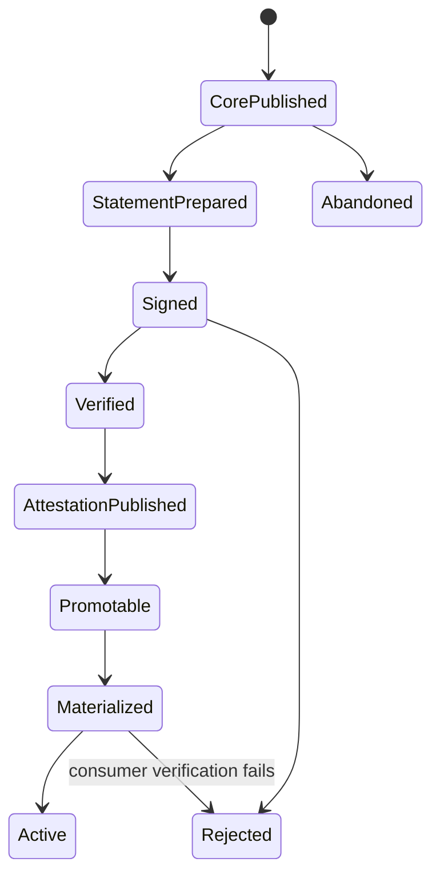
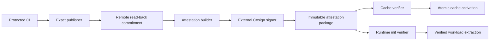

# Feature design: production Airflow artifact attestation

- Status: APPROVED
- Implementation maturity: FAIL-CLOSED PREVIEW; live dev/prod certification UNVERIFIED
- Owner: dpone maintainers
- Issue: production exact-deployment cutover
- Target release: 0.73.28
Last verified: 2026-07-29

## Executive summary

The exact Airflow artifact control plane already verifies immutable object
sizes, SHA-256 digests, release and deployment fingerprints, completion
markers, registry authority, desired-state CAS, and atomic local activation.
Production deployments still stop at a deliberate fail-closed boundary:
`trust_tier=production` requires an injected attestation verifier, while the
stock CLI composition roots do not provide one.

This feature implements and contract-tests the boundary with one signed,
deployment-scoped attestation package used by both consumers:

- the Airflow cache materializer verifies it before installing a deployment;
- the KPO init container verifies the same claims before extracting executable
  workload bytes.

The first implemented and contract-tested backend is Cosign blob signing with
a protected CI private key and a pinned read-only public key. dpone never reads
the private key and does not sign artifacts. Live certification is a separate
rollout gate and remains `UNVERIFIED` until the exact environment evidence is
retained. A future keyless Sigstore backend can implement the same verification
port after the self-managed GitLab issuer and trusted-root path are certified.

Success is binary: a production deployment is activated only when the
signature, trusted key, exact subject, registry authority, revocation policy,
and locally observed artifact bytes all agree.

## Personas and customer journey

| Persona | Goal | Current pain | Success signal |
|---|---|---|---|
| Platform CI | publish one approved immutable deployment | checksum evidence is not cryptographic producer identity | signed package and remote read-back receipt exist before promotion |
| Airflow operator | restart or roll back safely | production cache materialization has no stock verifier | exact desired deployment materializes without trust downgrade |
| DAG author | deploy without handling signing details | trust internals must not leak into workload authoring | normal merge and promotion journey remains unchanged |
| Security reviewer | constrain and rotate deployment authority | no deployment signer policy exists | key fingerprint, scope and revocations are explicit and auditable |

Journey:

1. The platform owner installs a Cosign public key and policy in a read-only
   ConfigMap. CI receives only the encrypted private key through a protected
   file variable.
2. Canonical CI builds and exactly publishes release/deployment artifacts.
3. dpone builds deterministic attestation bytes from the remotely read-back
   publication commitment.
4. External Cosign signs those exact bytes. dpone verifies and publishes the
   statement, bundle, and completion marker under a deployment-derived key.
5. Desired-state promotion is allowed only after attestation publication
   evidence is green.
6. Airflow reconciliation downloads and verifies the package before local
   cache installation. DAG parsing remains local and network-free.
7. A runtime KPO verifies the same package and its selected pack through the
   signed release-set before extraction.
8. On a failure, the operator reads a stable code, fixes policy/evidence, and
   retries. The last-known-good cache remains active.
9. Rollback selects an older exact deployment. Its attestation remains valid
   while its key remains trusted and its attestation ID is not revoked.

## Scope

### In scope

- stable deployment attestation, trust policy, verification receipt, and
  publication receipt schemas;
- deterministic, bounded object-store layout;
- key-backed Cosign signing boundary and public-key verification;
- one pure verification service reused by cache and runtime adapters;
- stock composition in cache materialization and KPO init-fetch;
- signing preparation and immutable publication CLI/API;
- canonical trust-policy rendering and exact-byte digest evidence;
- key rotation and attestation revocation;
- Airflow 2.10 and 3.x compatible provider/runtime behavior;
- documentation, runbook, negative tests, and live dev/prod certification.

### Non-goals

- storing a signing key in dpone, a manifest, a runtime image, or S3;
- S3/network access during DAG parse;
- accepting a checksum-only publication receipt as an attestation;
- public Sigstore keyless certification for the current self-managed GitLab
  instance before its OIDC/Fulcio/trusted-root path is verified;
- changing workload IDs, schedules, routes, data contracts, or target tables;
- replacing route certification attestations.

### Assumptions and constraints

- Cosign `>=3.0.4,<4.0.0` is pinned in publisher and verifier images.
- The signing private key is a protected GitLab file variable until Vault or
  KMS is available; it is absent from Airflow and runtime pods.
- The public key and trust policy are mounted read-only and their exact SHA-256
  digests are already bound by the deployment trust-policy reference.
- Existing release/deployment IDs deliberately exclude top-level attestation
  metadata, avoiding a self-referential fingerprint.
- Attestations do not expire automatically. Rollback validity is controlled by
  trusted key retention and explicit revocation.

## Public contract

### CLI

```bash
dpone airflow artifact-attestation prepare \
  --cache-root .dpone/cache \
  --release-id sha256:... \
  --deployment-id sha256:... \
  --environment prod \
  --artifact-registry-ref dpone_prod \
  --registry-scope-id "$DPONE_ARTIFACT_REGISTRY_SCOPE_ID" \
  --publication-evidence .ci/out/airflow-artifact-publish.json \
  --source-project platform/example-workloads \
  --source-ref refs/heads/master \
  --source-git-sha "$CI_COMMIT_SHA" \
  --issued-at "$CI_PIPELINE_CREATED_AT" \
  --output .ci/out/attestation/artifact-attestation.json \
  --format json

dpone airflow artifact-attestation policy-render \
  --input .ci/trust/policy.pretty.json \
  --output .ci/trust/policy.json \
  --format json

cosign sign-blob \
  --yes \
  --key "$DPONE_AIRFLOW_ATTESTATION_PRIVATE_KEY_FILE" \
  --bundle .ci/out/attestation/artifact-attestation.sigstore.json \
  .ci/out/attestation/artifact-attestation.json

dpone airflow artifact-attestation publish \
  --cache-root .dpone/cache \
  --publication-evidence .ci/out/airflow-artifact-publish.json \
  --statement .ci/out/attestation/artifact-attestation.json \
  --sigstore-bundle .ci/out/attestation/artifact-attestation.sigstore.json \
  --trust-policy-path .ci/trust/policy.json \
  --trust-key-root .ci/trust \
  --registry-uri s3://.../immutable \
  --connection-type env \
  --connection-id s3_dpone_artifacts_writer \
  --format json
```

`prepare` writes canonical statement bytes atomically and refuses overwrite
unless the existing bytes are identical. `publish` verifies locally first,
creates immutable remote objects, reads them back by size and SHA-256, and
writes `_SUCCESS` last. JSON output is the stable publication receipt. Expected
input/policy failures exit `2`, dependency failures `3`, and trust/integrity
failures `4`.

### Python API

```python
from dpone.contracts.airflow_artifact_attestation import (
    AirflowArtifactAttestation,
    AirflowArtifactObservedSubject,
)
from dpone.contracts.airflow_deployment_trust_policy import (
    AirflowDeploymentTrustPolicy,
)
from dpone.services.airflow_artifact_attestation import (
    AirflowArtifactAttestationBuilder,
    AirflowArtifactAttestationVerificationService,
)
```

Infrastructure adapters implement narrow ports:

- `AirflowDeploymentAttestationVerifier`;
- `AirflowArtifactSignatureVerifier`;
- `ArtifactRegistryReader` or `ArtifactRegistry`.

### Manifest/schema

No user manifest fields are added. The trusted platform policy is:

```json
{
  "schema": "dpone.airflow-deployment-trust-policy.v1",
  "trust_tier": "production",
  "attestations": "required_for_prod",
  "backend": "cosign_public_key_v1",
  "trusted_public_keys": {
    "airflow-artifacts-2026-07": {
      "file": "cosign-2026-07.pub",
      "sha256": "sha256:..."
    }
  },
  "cosign": {
    "minimum_version": "3.0.4",
    "maximum_version_exclusive": "4.0.0",
    "timeout_seconds": 10
  },
  "allowed_environments": ["prod"],
  "allowed_artifact_registry_refs": ["dpone_prod"],
  "allowed_registry_scope_ids": ["sha256:<endpoint-bound-registry-scope>"],
  "allowed_source_projects": ["platform/example-workloads"],
  "allowed_source_refs": ["refs/heads/master"],
  "revoked_attestation_ids": [],
  "revoked_public_key_ids": []
}
```

The historical `dpone.runtime-artifact-trust-policy.v1` continues to parse only
for non-production behavior. It cannot authorize a production deployment.

### Artifacts and evidence

Stable schemas:

- `dpone.airflow-artifact-attestation.v1`;
- `dpone.airflow-artifact-attestation-verification.v1`;
- `dpone.airflow-artifact-attestation-prepare.v1`;
- `dpone.airflow-artifact-attestation-marker.v1`;
- `dpone.airflow-artifact-attestation-publish.v1`;
- `dpone.airflow-artifact-attestation-error.v1`;
- `dpone.airflow-deployment-trust-policy.v1`;
- `dpone.airflow-deployment-trust-policy-render.v1`;
- `dpone.runtime-fetch-ready.v2`;
- `dpone.runtime-image-certification.v2`.

Remote layout:

```text
attestations/deployments/{environment}/sha256-{deployment}/
  artifact-attestation.json
  artifact-attestation.sigstore.json
  _SUCCESS
```

The signed subject binds:

- release and deployment IDs;
- exact SHA-256 of `release-set.json`, `deployment.json`, and
  `airflow-index.json`;
- environment, runtime image digest, and artifact registry logical authority;
- source project, protected ref, commit SHA, and exact publication evidence
  digest.

The verification receipt includes only safe identities, policy fingerprint,
public-key digest, verifier version, decision, code, and timestamp.

### Compatibility and migration

- Non-production `attestations=optional` behavior is unchanged.
- Production remains fail-closed until the deployment policy, public key,
  package, and verifier are all present.
- A deployment must select exactly one production authority before registry
  I/O: either the existing GitHub/SLSA release-set verifier from
  `dpone.runtime-artifact-trust-policy.v2` or the deployment-scoped Cosign
  verifier from `dpone.airflow-deployment-trust-policy.v1`.
- No silent fallback from either policy to checksum-only verification exists.
- Existing unsigned immutable deployments can be signed in place because the
  attestation overlay is outside release/deployment identity.
- Rollback removes desired-state selection, never immutable evidence.

## Detailed algorithm

### Build and publication

1. Parse exact v2 publication evidence and reject v1, failed, mismatched, or
   non-read-back receipts.
2. Revalidate local release/deployment/index bytes and recompute IDs.
3. Require evidence IDs, registry scope, and exact object digests to match.
4. Build canonical claims and derive `attestation_id` from claims only.
5. Write canonical UTF-8 JSON atomically.
6. External CI signs those bytes with Cosign.
7. Parse the trusted deployment policy and verify the bounded mounted
   public-key set.
8. Verify the Cosign bundle and exact statement bytes with exactly one
   non-revoked trusted key.
9. Re-evaluate every subject claim against local bytes and policy.
10. Create the immutable remote statement and bundle with create-if-absent.
11. On an existing object, require byte equality.
12. Read back both objects and verify size and SHA-256.
13. Create `_SUCCESS` last and emit publication evidence.
14. Desired-state promotion consumes that evidence digest only after success.

### Cache materialization

1. Download and validate the exact release/deployment projection as today.
2. Derive the attestation prefix from trusted environment and deployment ID.
3. Require `_SUCCESS`, then download bounded statement and bundle.
4. Snapshot the deployment trust policy and public key from the trusted
   read-only mount.
5. Verify key digest, Cosign signature, revocation, environment, registry,
   runtime image, IDs, and exact local root file digests.
6. Emit an in-memory verification receipt.
7. Install the staged projection only after `decision=verified`.
8. Preserve last-known-good cache on any failure.

### Runtime init-fetch

1. Decode and hash-validate the untrusted plan.
2. Snapshot the selected trusted authority before registry construction and
   reject multiple or missing production authorities.
3. Preflight requires a verifier for effective production trust.
4. Download exact plan artifacts and validate existing release/deployment/pack
   receipts.
5. Download the deterministic attestation package through the same pinned
   registry reader.
6. Derive the locally observed KPO subject from staged release and deployment
   bytes, plan environment, image digest, and registry authority. Verify those
   claims against the signed subject. `airflow_index_sha256` is explicitly
   recorded as unobserved because a KubernetesExecutor worker does not mount
   or fetch the scheduler cache index.
7. Publish `runtime-fetch-ready.json` only after trust succeeds.
8. Include the attestation decision digest in ready evidence; do not copy the
   signature bundle into the executable worktree.

### Pseudocode

```text
publish_core_exact()
commitment = remote_readback()
statement = build_attestation(commitment, protected_source_identity)
external_cosign_sign(statement)
receipt = verify_and_publish_attestation(statement, bundle, trusted_policy)
require receipt.verified
cas_promote_desired_state(publication_evidence_sha256=receipt.sha256)

consume_exact(deployment):
    projection = download_and_validate_checksums(deployment)
    package = fetch_deterministic_attestation(deployment.id)
    policy = snapshot_trusted_policy_and_public_key()
    decision = verify_signature_and_exact_subject(package, projection, policy)
    require decision == verified
    install_or_extract(projection)
```

### State machine



### Retries, replay, concurrency, and rollback

- Preparation is deterministic for identical inputs.
- Attestation publication is create-once and equality-idempotent.
- Concurrent equal publishers converge; different bytes at the same key fail
  with an immutability conflict.
- `_SUCCESS` is the package commit point.
- Consumer retries re-download and reverify; no failed candidate becomes
  `current` or `runtime-fetch-ready`.
- Replay into another environment, deployment, registry, or image fails subject
  policy.
- Rollback selects another previously verified deployment through existing
  desired-state CAS. Revoked deployments remain immutable but unusable.

### Failure classification and recovery

| Code | Meaning | Recovery |
|---|---|---|
| `DPONE_ARTIFACT_ATTESTATION_NOT_FOUND` | package or marker absent | rerun protected signing/publication job |
| `DPONE_ARTIFACT_ATTESTATION_INVALID` | schema, canonical bytes, or subject mismatch | rebuild from exact publication evidence |
| `DPONE_ARTIFACT_ATTESTATION_SIGNATURE_INVALID` | bundle does not verify | inspect signer/key selection and rebuild |
| `DPONE_ARTIFACT_ATTESTATION_POLICY_INVALID` | trusted deployment policy malformed | repair reviewed ConfigMap and redeploy |
| `DPONE_ARTIFACT_ATTESTATION_KEY_MISMATCH` | public key bytes differ from pinned digest | restore approved public key |
| `DPONE_ARTIFACT_ATTESTATION_REVOKED` | attestation or key is denied | promote a non-revoked deployment |
| `DPONE_ARTIFACT_ATTESTATION_VERIFIER_UNAVAILABLE` | Cosign absent/unsupported/timeout | repair pinned image; no trust downgrade |

Empty or partial input, duplicate JSON keys, non-canonical JSON, oversized
objects, symlinks, unknown fields, timeout, process crash, and unavailable
registry all fail before activation or extraction.

## Architecture

### Components and responsibilities

| Component | Existing/new | Responsibility | Dependencies |
|---|---|---|---|
| `AirflowArtifactAttestation` | new contract | canonical statement and identity | stdlib only |
| `AirflowDeploymentTrustPolicy` | new contract | deployment-scoped trusted expectations and revocation | stdlib only |
| `AirflowArtifactObservedSubject` | new contract | declares locally observed and intentionally unobserved claims | stdlib only |
| `AirflowArtifactAttestationBuilder` | new service | derive statement from exact evidence | contracts |
| `AirflowArtifactAttestationVerificationService` | new service | pure subject/policy decision | signature port |
| `CosignPublicKeyBlobSignatureVerifier` | new adapter | bounded external signature check | subprocess adapter |
| `ArtifactAttestationRegistry` | new adapter/service | deterministic bounded fetch/publish | artifact registry port |
| cache verifier adapter | new | adapt projection to shared verifier | shared service |
| runtime verifier adapter | new | adapt init plan/staged bytes | shared service |
| CLI composition | changed | construct policy, key, registry and adapters | readiness layer |

Core contracts do not import Airflow, Kubernetes, S3 SDKs, Cosign Python
packages, Vault, or connector drivers. Vendor process and object-store access
remain adapters.

### Data and control flow



### Alternatives and tradeoffs

| Alternative | Advantages | Disadvantages | Decision |
|---|---|---|---|
| checksum-only receipt | already exists | no producer identity; editable by same storage writer | reject for production |
| embed signature in deployment fingerprint | one object graph | circular identity and rebuild requirement | reject |
| deterministic sidecar overlay | no circular identity; signs existing deployments | extra immutable package | adopt |
| keyless public Sigstore | no private-key custody | internal GitLab issuer path not yet certified | future adapter |
| protected key-backed Cosign | works without Vault/KMS; offline consumer verification | key rotation/custody needed | adopt for first production |
| fetch signature during DAG parse | simple loader | network-dependent scheduler parse | reject |

### ADR requirement

Required. ADR 0035 records the deployment provenance authority, sidecar layout,
key-backed interim backend, and common cache/runtime verification boundary.

### Quality-budget impact

New modules are split by contract, policy service, registry I/O, and composition
adapter. Each changed Python file must remain at or below the repository
`max_sloc` and the layer graph must remain at or below `max_avg_clustering`.
No domain policy is added to CLI modules or legacy namespaces.

## Market comparison

Checked 2026-07-29 against official primary sources.

| System/version | Relevant capability | Observed design | Strength | Limitation | Adopt/reject | Source/date |
|---|---|---|---|---|---|---|
| Sigstore Cosign 3.x | detached blob signature | bundle stores signature and verification material; verifier binds exact identity/key | standard, auditable blob verification | external binary and trust policy required | adopt bundle and exact bytes | [Sigstore signing](https://docs.sigstore.dev/cosign/signing/signing_with_blobs/), [verification](https://docs.sigstore.dev/cosign/verifying/verify/), 2026-07-29 |
| SLSA 1.2 | artifact provenance verification | verify signature, subject digest, builder and expected parameters | clear producer/consumer trust model | not an Airflow activation protocol | adopt subject and expectation checks | [SLSA verification](https://slsa.dev/spec/v1.2/verifying-artifacts), 2026-07-29 |
| GitLab CI | CI artifact signing | protected CI ID/key signs build artifacts; verify immutable digest | integrates signing with pipeline identity | keyless example depends on compatible issuer/Fulcio | adopt protected signing job; defer keyless certification | [GitLab signing](https://docs.gitlab.com/ci/yaml/signing_examples/), 2026-07-29 |
| Apache Airflow 3.3 | versioned DAG bundles | bundle versions and serialized DAG metadata preserve runtime identity | native version visibility | does not verify dpone external pack provenance | align exact version activation | [DAG bundles](https://airflow.apache.org/docs/apache-airflow/stable/administration-and-deployment/index.html), 2026-07-29 |
| Astronomer Cosmos | compiled dbt manifest/cache | compiled artifacts avoid repeated scheduler work | parse performance and deterministic inputs | no equivalent dpone deployment signature contract | adopt local compiled cache; add trust layer | [Cosmos parsing modes](https://astronomer.github.io/astronomer-cosmos/configuration/parsing-methods.html), 2026-07-29 |
| dlt | N/A | data loading package, not Airflow deployment activation authority | N/A | no comparable scheduler artifact attestation | N/A |
| Informatica | N/A | managed repository/deployment product | managed governance | no open interoperable Airflow cache contract | N/A |
| Airbyte | N/A | connector/control-plane deployment | operational catalog | no comparable Airflow artifact activation contract | N/A |
| Fivetran | N/A | managed connector deployment | managed control plane | no customer-verifiable Airflow pack contract | N/A |
| Pentaho | N/A | repository/transformation deployment | mature job packaging | no comparable Airflow exact cache protocol | N/A |
| Microsoft SSIS | N/A | catalog/package deployment | signed deployment ecosystem differs | no Airflow parser/runtime split | N/A |
| gusty | N/A | DAG generation | relevant authoring, not artifact attestation | no production provenance verifier | N/A |
| Apache Beam | N/A | portable data execution artifacts | runner portability | not Airflow DAG artifact activation | N/A |

## Measurable differentiation

```yaml
axis: fail-closed deployment provenance across scheduler cache and KPO runtime
scenario: tamper with one published pack or replay a signed deployment into another environment
baseline: dpone 0.73.25 production verifier boundary
metric: unauthorized cache activations and runtime extractions
target: 0; both consumers return a stable trust blocker before mutation
procedure: integration matrix with fake registry plus live signed dev deployment
artifact: test_artifacts/airflow-production-artifact-attestation-v07327/
limitations: does not certify private-key custody beyond protected GitLab variable controls
```

## Security, privacy, and operations

- Private keys and passwords never enter dpone arguments, JSON evidence, S3, or
  Airflow.
- CI logs may show key IDs and SHA-256 digests, never key bytes.
- Public-key and policy files are bounded, regular, non-symlinked, and digest
  pinned.
- The cache consumer observes all signed deployment claims. The KPO consumer
  observes only bytes and identities available in its isolated pod; it never
  downloads the sibling scheduler index merely to manufacture evidence.
- Cosign runs with a sanitized environment, no stdin, bounded output and
  timeout.
- S3 reader permissions cover immutable artifacts and attestations only.
- Alerts fire on absent/invalid/revoked attestations, desired/current
  divergence, and repeated verifier-unavailable cycles.
- Key rotation keeps old public keys trusted until all rollback deployments
  leave retention. Emergency revocation is explicit and fail-closed.

## Test and certification plan

| Layer | Scenario | Environment | Expected artifact |
|---|---|---|---|
| Unit | canonical parsing, IDs, policy, revocation | local | focused pytest |
| Contract | CLI/API/schema and stable failures | local | schema tests |
| Integration | fake registry publish/fetch/cache/runtime parity | local | JSON receipts |
| Security | tamper/replay/wrong key/timeout/partial package/dual authority | local | negative matrix |
| Runtime image | Cosign binary and existing native/client tools | GitHub Actions | `dpone.runtime-image-certification.v2` |
| Compatibility | Airflow 2.10 and 3.x provider/runtime | CI matrix | DagBag/init-fetch evidence |
| Live certification | signed exact deployment and restart recovery | dev Airflow | desired/current, loader ACK, runtime XCom |
| Production | staged active-DC cutover and rollback proof | prod Airflow | immutable promotion and smoke evidence |

## Documentation plan

- update Airflow pack provider and cache-sync reference;
- add signing, key rotation, revocation, missing-attestation, and rollback
  runbooks;
- update schema catalog and architecture diagram;
- document GitLab protected-variable bootstrap without claiming Vault;
- keep Airflow DAG author CJM unchanged except for observable trust status.

## Rollout and rollback

1. Contract-tested: release the verifier and install pinned Cosign in
   CI/controller/runtime images.
2. Contract-tested: generate a protected CI key pair; commit only the public
   key digest and reviewed policy through infrastructure configuration.
3. **Pending live gate:** rehearse signed exact deployment in dev with
   production policy and restart recovery.
4. **Pending live gate:** publish and sign the unchanged prod DAG set.
5. **Pending live gate:** materialize beside legacy cache and verify expected
   DAG IDs.
6. **Pending live gate:** switch the staged prod loader to canonical `current`.
7. **Pending live gate:** run platform smoke and one light data workload.
8. **Pending live gate:** prove rollback by restoring the previous
   loader/cache desired state. Never downgrade `trust_tier`.

Rollback triggers: any missing expected DAG, signature inconsistency,
desired/current divergence, failed runtime smoke, or post-cutover data
acceptance blocker.

## Agent execution plan

| Agent/role | Owned paths | Read-only paths | Forbidden paths | Dependency |
|---|---|---|---|---|
| architect | none | contracts/runtime/docs | all writes | design review |
| test certifier | none | tests/runtime/docs | all writes | negative matrix |
| integrator | contracts/services/adapters/readiness/tests/docs | whole repository | unrelated generated outputs | all findings |

The integrator owns schemas, CLI registration, documentation navigation,
versioning, changelog, and final release reconciliation.

## Approval checklist

- [x] User problem and CJM are clear.
- [x] Algorithm and failure semantics are implementable without guessing.
- [x] Public contracts and compatibility are explicit.
- [x] Architecture and alternatives are justified.
- [x] Relevant market research uses current official sources.
- [x] Claimed differentiation is measurable.
- [ ] Contract tests and docs are complete; signed dev restart and staged
      production rollout/rollback evidence remain `UNVERIFIED`.
- [x] Path ownership and integration plan are conflict-safe.
- [x] Maintainer approved the design and fail-closed implementation.
- [ ] Maintainer production completion awaits exact-environment live evidence.
