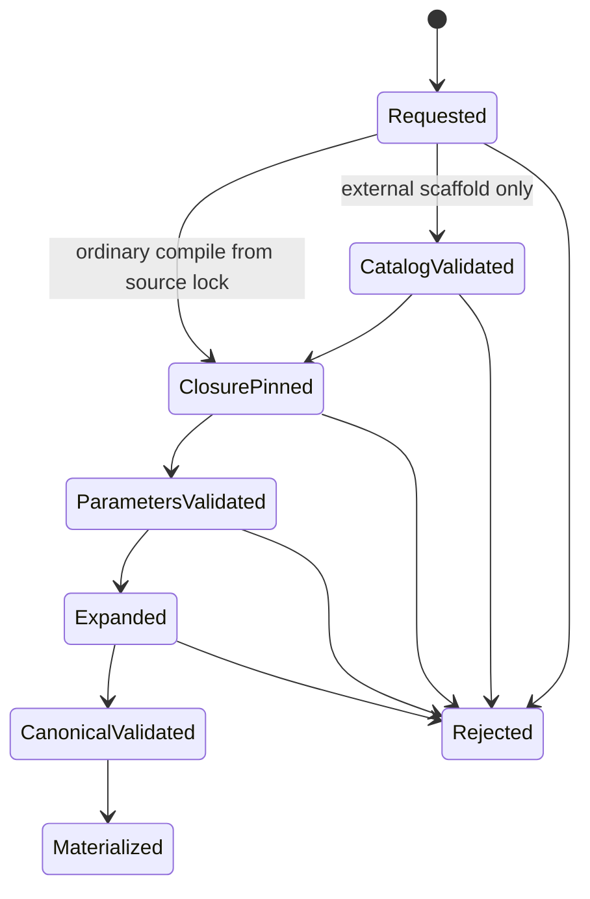
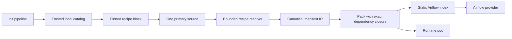

# Feature design: content-pinned declarative recipe catalog v1

- Status: IMPLEMENTED
- Owner: dpone maintainers
- Issue: Industrial Self-Service Airflow roadmap, Phase 2
- Target release: TBD
- Last verified: 2026-07-16
- Implementation evidence: `test_artifacts/airflow-recipe-catalog-v1/validation-report.md`

## Executive summary

The Phase 1 beginner path offers three immutable recipes bundled with dpone.
They prove the five-command journey, but every platform-specific route still
requires a dpone release. This feature lets a platform team publish versioned
declarative recipes, profiles, and reusable process components in its own
repository while preserving one pipeline source, deterministic builds, and a
static Airflow parse path.

The beginner command remains unchanged:

```bash
dpone init pipeline orders_daily \
  --recipe mssql-to-clickhouse-incremental \
  --airflow
```

An advanced platform recipe uses the same command with an exact version:

```bash
dpone init pipeline orders_daily \
  --recipe governed-mssql-clickhouse@1.2.0 \
  --airflow
```

`init` discovers that recipe through one configured, trusted, local catalog.
It writes an exact byte digest and project-confined artifact reference into the
primary authoring source. The recipe pins its selected profile and every
component in the same way. Compilation reads only that explicit closure,
validates a restricted JSON Schema parameter contract, expands declarative
placeholders, and delegates the resulting processes to the existing canonical
batch compiler.

There is no Jinja, Python import, shell execution, remote fetch, recursive
discovery, or scheduler-side recipe execution. Generated canonical IR and packs
remain derived artifacts. Existing built-in recipes and explicit
classic/flow/folder sources remain compatible.

## Personas and customer journey

| Persona | Goal | Current pain | Success signal |
|---|---|---|---|
| New data engineer | Create a governed pipeline without Airflow/Python knowledge | Built-in examples may not match the platform route | One exact recipe name creates a valid source and DAG preview |
| Data engineer | Change safe table/connection parameters | Copying a large manifest creates drift | One optional answers file is schema-validated and allowlisted |
| Platform engineer | Publish reusable patterns independently of dpone releases | Route defaults live in package Python | Local declarative artifacts have owner, version, lifecycle, and digest |
| Security engineer | Bound recipe supply-chain behavior | Templates can hide executable code or remote fetches | Only pinned YAML data below the project root is consumed |
| Airflow operator | Keep DAG parsing static | Template libraries often run discovery/code in the scheduler | Provider consumes only materialized index/spec/pack artifacts |

### Beginner journey

1. Run the existing `dpone init project --airflow` once.
2. Choose a documented built-in or platform recipe reference.
3. Run `dpone init pipeline ... --recipe ... --airflow`.
4. Run `dpone check` and `dpone airflow preview` as today.
5. Diagnose a recipe failure through one structured error and linked fix; the
   command performs no partial writes.

No catalog, digest, component, profile, pack, or Airflow Python knowledge is
required for the built-in path. Platform recipes can also provide all defaults,
so the command count stays five or fewer.

### Platform journey

1. Create bounded declarative component/profile/recipe YAML files.
2. Run `dpone recipe pin <artifact>` to validate it and obtain the exact
   content-addressed catalog entry.
3. Configure one catalog path and trusted catalog id in `dpone.yaml`.
4. Run `dpone recipe validate` and `dpone init pipeline` in a fixture
   repository.
5. Publish recipe documentation and lifecycle status.
6. Add a new recipe version for breaking or semantic changes; never mutate an
   already referenced artifact in place.

## Scope

### In scope

- One local repository catalog configured explicitly in `dpone.yaml`.
- Exact SemVer recipe/profile/component references and exact byte SHA-256 pins.
- `dpone.recipe-catalog.v1`, `dpone.recipe.v1`, `dpone.profile.v1`, and
  `dpone.component.v1` schemas.
- Flow authoring with a top-level pinned `recipe` block as an alternative to
  explicit `processes`.
- A restricted JSON Schema parameter contract and optional bounded
  `--answers <yaml>` input.
- Read-only `dpone recipe list/show/pin/validate` discovery and publishing
  helpers.
- One optional selected profile from the recipe allowlist.
- Ordered reusable components that expand to one or more process mappings.
- Explicit whole-value `$param` and `$context` placeholders only.
- Exact dependency closure in compilation, compact packs, source provenance,
  safe-sample pin verification, and release evidence.
- Built-in recipe compatibility and structured errors/fixes.

### Non-goals

- Remote catalog download, OCI resolution, object-storage refresh, or network
  retry. A separate materializer may place artifacts locally in a later slice.
- Signed public catalogs. Signature policy remains Phase 4; Phase 2 requires a
  trusted local catalog id plus exact content pins.
- Python recipe plugins, arbitrary template functions, Jinja, shell commands,
  dynamic imports, or code embedded in YAML.
- Recipe references in classic or folder source grammar in v1. Those modes stay
  explicit and continue to support built-in scaffold expansion.
- Multiple profile inheritance, wildcard overrides, conditional templates, or
  automatic upgrade to the newest recipe.
- Reverse generation from canonical IR to a recipe source.
- Recipe/catalog work in the Airflow provider or scheduler.

### Assumptions and constraints

- The repository root is trusted configuration; all catalog artifacts below it
  are untrusted input and opened through descriptor-confined reads.
- A recipe source uses `authoring.mode: flow` and contains exactly one of
  `processes` or `recipe`.
- The catalog is used only to discover and lock a recipe during scaffolding.
  Ordinary check/build compilation follows the pinned closure already in the
  primary source and does not depend on mutable catalog lookup. Recipe parsing,
  parameter merging, and component expansion are build-time-only. Runtime may
  verify pins for evidence, but executes only materialized canonical manifest
  IR and never parses recipe/profile/component YAML.
- One recipe selects at most one profile in v1.
- Components can contain several processes, but total expanded process count is
  at most 100.
- Live connector certification is not implied by recipe contract validation.

### Glossary

| Term | Meaning in this feature |
|---|---|
| Primary source | The sole editable `pipeline.yaml` selected by the authority contract |
| Domain catalog | The existing author-owned `domains/<domain>.yaml` that composes workloads into DAGs |
| Recipe catalog | A platform-owned index of exact recipe/profile/component pins; never a runtime service |
| Closure | The pinned recipe plus its selected profile and ordered component artifacts |
| Materialized output | Generated canonical manifest, pack, release, deployment, or preview; never edited by users |

## Public contract

### Project configuration

```yaml
schema: dpone.project.v1
authoring:
  primary_source_policy: one_per_pipeline
  recipe_catalog:
    path: platform/recipes/catalog.yaml
    trusted_catalog_ids: [data-platform]
```

The path is a project-relative POSIX YAML path. There is exactly one configured
catalog in v1. Missing configuration has no effect on built-in recipes.

### CLI

```bash
# Existing beginner path; unchanged.
dpone init pipeline orders_daily \
  --recipe mssql-to-clickhouse-incremental \
  --airflow

# Exact external recipe; no `latest` or version range.
dpone init pipeline orders_daily \
  --recipe governed-mssql-clickhouse@1.2.0 \
  --airflow

# Optional profile and safe parameters.
dpone init pipeline orders_daily \
  --recipe governed-mssql-clickhouse@1.2.0 \
  --profile large-table@2.0.0 \
  --answers pipelines/orders_daily.answers.yaml \
  --airflow

# Discover governed recipes without opening catalog YAML.
dpone recipe list
dpone recipe show governed-mssql-clickhouse@1.2.0

# Platform publishing helpers; both are read-only.
dpone recipe pin platform/recipes/recipes/governed-mssql-clickhouse-1.2.0.yaml
dpone recipe validate
```

New options:

| Option | Default | Contract |
|---|---|---|
| `--profile <id>@<semver>` | recipe default | Must match one exact pin in `profiles` |
| `--answers <path>` | no overrides | Project-confined bounded YAML mapping; credential values and undeclared keys are rejected |

The `dpone recipe` group is the platform/self-service discovery surface:

| Command | Contract |
|---|---|
| `list` | List built-ins plus configured external recipe refs in deterministic order; no artifact bodies or infrastructure paths |
| `show <ref>` | Show safe owner/status/description, allowed profiles, parameter names/types, and whether a default exists |
| `pin <artifact>` | Validate one project-confined recipe/profile/component and print its exact catalog entry with byte SHA-256; never edit files |
| `validate` | Validate the configured catalog and every pinned closure; report a plan of digest/schema fixes without applying them |

These commands perform no network or credential access. `list` and `show` are
recommended before `init` for a user who was not given a recipe ref. They do
not add a mandatory golden-path step. `pin` and `validate` give the platform
engineer canonical tooling without introducing mutable publishing behavior.

External references require exact `MAJOR.MINOR.PATCH`. `latest`, ranges, missing
versions, prerelease/build suffixes, URLs, and path-like recipe ids are rejected
in v1. Built-in unversioned names remain compatibility aliases.

The command resolves and validates the complete closure before
`ScaffoldApplier` plans any file. Repeated identical invocation is a no-op.
Conflicts remain plan-first and atomic. Text output shows logical refs and next
actions. JSON output adds a safe `recipe_resolution` object with ids, versions,
digests, lifecycle status, owner, and dependency kinds; it never contains
answer file contents or infrastructure secrets.

Canonical observable examples:

```text
CREATED pipelines/orders_daily/pipeline.yaml
Recipe: governed-mssql-clickhouse@1.2.0 (stable)
Next: dpone check pipelines/orders_daily
```

An identical repeat reports `NO_OP` for every planned file and exits `0`. A
failure writes the structured error to stderr, writes no scaffold files, and
uses the documented exit code. JSON success includes
`recipe_resolution.recipe_ref`, `recipe_sha256`, `profile_ref`,
`component_refs`, `status`, and `owner`; JSON failure includes `errors[]` and no
answer values.

Exit codes keep the Phase 1 contract: `0` success, `1` validation/check failure,
`2` CLI/config usage, `4` security/safety violation, and `5` internal failure.

### Catalog schema

```yaml
schema: dpone.recipe-catalog.v1
catalog_id: data-platform
artifacts:
  - kind: recipe
    ref: governed-mssql-clickhouse@1.2.0
    artifact_ref: platform/recipes/recipes/governed-mssql-clickhouse-1.2.0.yaml
    sha256: sha256:0123456789abcdef0123456789abcdef0123456789abcdef0123456789abcdef
```

Artifact kinds are `recipe`, `profile`, or `component`. A `(kind, ref)` pair is
unique. Catalog order is not semantic. Catalog entries do not contain artifact
bodies, credentials, URLs, Python entrypoints, or executable hooks.

### Recipe schema

```yaml
schema: dpone.recipe.v1
id: governed-mssql-clickhouse
version: 1.2.0
owner: data-platform
status: stable                 # experimental | stable | deprecated
description: Governed incremental table ingestion
domain: sales

parameter_schema:
  $schema: https://json-schema.org/draft/2020-12/schema
  type: object
  additionalProperties: false
  properties:
    source_connection_ref:
      type: string
      x-dpone-format: connection_ref
      default: mssql_dev
    sink_connection_ref:
      type: string
      x-dpone-format: connection_ref
      default: clickhouse_dev
    source_table:
      type: string
      x-dpone-format: identifier
      default: orders
    source_schema: {type: string, x-dpone-format: identifier, default: dbo}
    target_schema: {type: string, x-dpone-format: identifier, default: analytics}
    target_table: {type: string, x-dpone-format: identifier, default: orders}
    strategy: {type: string, enum: [incremental_merge], default: incremental_merge}
    unique_key: {type: string, x-dpone-format: identifier, default: id}
  required: [source_connection_ref, sink_connection_ref, source_table,
             source_schema, target_schema, target_table, strategy, unique_key]

override_allowlist:
  - source_connection_ref
  - sink_connection_ref
  - source_table

default_profile_ref: incremental-defaults@1.0.0
profiles:
  - ref: incremental-defaults@1.0.0
    artifact_ref: platform/recipes/profiles/incremental-defaults-1.0.0.yaml
    sha256: sha256:...
components:
  - ref: mssql-clickhouse-load@1.0.0
    artifact_ref: platform/recipes/components/mssql-clickhouse-load-1.0.0.yaml
    sha256: sha256:...
```

The supported JSON Schema subset is deliberately small: object root,
`additionalProperties: false`, at most 64 scalar properties, `required`, scalar
`type` (`string`, `integer`, `number`, `boolean`, or that type plus `null`),
`default`, `enum`, numeric bounds, string length, and
`x-dpone-format: identifier|connection_ref`. `$ref`, composition keywords,
objects, arrays, `pattern`, custom format code, and remote schemas are rejected.
`domain` is the sole recipe-declared orchestration owner. Scaffolding copies it
to `metadata.domain` and the generated domain-catalog key; ordinary compilation
requires these identities to be equal and fails on mismatch. It is also the
only value exposed as `$context: domain`; v1 never infers domain from tables.

### Profile schema

```yaml
schema: dpone.profile.v1
id: incremental-defaults
version: 1.0.0
owner: data-platform
status: stable
values:
  source_schema: dbo
  target_schema: analytics
  target_table: orders
  strategy: incremental_merge
  unique_key: id
locked_parameters: [strategy]
```

Profile values must exist in the recipe parameter schema and pass the same
type/format validation. Locked parameters cannot appear in answers or the
recipe override allowlist.

### Component schema

```yaml
schema: dpone.component.v1
id: mssql-clickhouse-load
version: 1.0.0
owner: data-platform
status: stable
processes:
  - name: {$context: pipeline_id}
    source:
      type: mssql
      connection_ref: {$param: source_connection_ref}
      table:
        schema: {$param: source_schema}
        name: {$param: source_table}
    sink:
      type: clickhouse
      connection_ref: {$param: sink_connection_ref}
      table:
        schema: {$param: target_schema}
        name: {$param: target_table}
      strategy:
        mode: {$param: strategy}
        unique_key: {$param: unique_key}
```

A placeholder is a mapping with exactly one key, either `$param` or `$context`.
`$context` supports only `pipeline_id` and `domain`. Placeholders replace a
whole value. They never interpolate strings and cannot select keys, paths,
files, artifact refs, digests, artifact schema/id/version fields, or code.
Within a component process, ordinary scalar fields such as
`source.table.schema` and `sink.table.schema` may use placeholders.

### Primary source recipe block

The scaffold writes the exact recipe lock into the one editable pipeline file:

```yaml
kind: dpone.flow.v1
authoring:
  mode: flow
  source: pipelines/orders_daily/pipeline.yaml
metadata:
  id: orders_daily
  domain: sales
  tags: [dpone, airflow]
recipe:
  catalog_id: data-platform
  ref: governed-mssql-clickhouse@1.2.0
  artifact_ref: platform/recipes/recipes/governed-mssql-clickhouse-1.2.0.yaml
  sha256: sha256:...
  profile_ref: incremental-defaults@1.0.0
  parameters:
    source_connection_ref: mssql_prod
    sink_connection_ref: clickhouse_prod
```

The primary source does not duplicate component refs; they are part of the
content-pinned recipe bytes. It contains exactly one of `recipe` or `processes`.
The selected exact `profile_ref` must match one pin in recipe `profiles[]`.
The recipe is the sole path/digest authority; the source never duplicates the
profile artifact pin. A recipe may define zero profiles and omit both
`default_profile_ref` and source `profile_ref`.

### Internal injected port

```python
class RecipeSourceResolver(Protocol):
    def resolve(
        self,
        recipe_block: Mapping[str, object],
        *,
        source_path: Path,
        project_root: Path | None,
        context: RecipeContext,
    ) -> ResolvedRecipe: ...

@dataclass(frozen=True, slots=True)
class ResolvedRecipe:
    processes: tuple[Mapping[str, object], ...]
    dependencies: tuple[AuthoringSourceDependency, ...]
    provenance: RecipeResolutionProvenance
```

This interface is internal in v1 and is not a separately versioned Python API.
`AuthoringCompiler` accepts the resolver through dependency injection. The
default composition uses only the bounded local resolver. There is no registry
service locator or import-time I/O.

### Artifacts and evidence

`AuthoringCompilation` adds optional `recipe_provenance` and dependency kinds:

```text
recipe
profile
component
```

Every dependency records project-relative path and exact byte SHA-256. Compact
pack parity compares exact `kind/path/sha256` for fragments, SQL files, recipes,
profiles, and components. Canonical ordering is `(kind, path, sha256)`. Runtime
bootstrap may retain source closure for audit, but its `dpone run` target is the
generated canonical manifest IR. Release provenance contains or immutably
references the complete ordered closure:

```yaml
recipe_resolution:
  catalog_id: data-platform
  recipe_ref: governed-mssql-clickhouse@1.2.0
  recipe_sha256: sha256:...
  domain: sales
  profile_ref: incremental-defaults@1.0.0
  component_refs: [mssql-clickhouse-load@1.0.0]
  status: stable
  owner: data-platform
  closure:
    - {kind: recipe, path: platform/recipes/recipes/governed-mssql-clickhouse-1.2.0.yaml, sha256: sha256:...}
    - {kind: profile, path: platform/recipes/profiles/incremental-defaults-1.0.0.yaml, sha256: sha256:...}
    - {kind: component, path: platform/recipes/components/mssql-clickhouse-load-1.0.0.yaml, sha256: sha256:...}
```

The source fingerprint includes the root source and exact resolved dependency
pins. The semantic fingerprint includes only canonical compiled process
semantics, so an explicit flow and an equivalent recipe source match.

### Structured errors

Required codes include:

```text
DPONE_RECIPE_CATALOG_NOT_CONFIGURED
DPONE_RECIPE_CATALOG_UNTRUSTED
DPONE_RECIPE_CATALOG_INVALID
DPONE_RECIPE_REF_INVALID
DPONE_RECIPE_NOT_FOUND
DPONE_RECIPE_DIGEST_MISMATCH
DPONE_RECIPE_ARTIFACT_INVALID
DPONE_RECIPE_PROFILE_NOT_ALLOWED
DPONE_RECIPE_PARAMETER_SCHEMA_INVALID
DPONE_RECIPE_PARAMETER_REQUIRED
DPONE_RECIPE_OVERRIDE_FORBIDDEN
DPONE_RECIPE_ANSWERS_UNSAFE
DPONE_RECIPE_COMPONENT_INVALID
DPONE_RECIPE_EXPANSION_LIMIT_EXCEEDED
DPONE_RECIPE_SOURCE_CHANGED_DURING_BUILD
```

All errors use `dpone.error.v1`, data-safe messages, docs links, and manual/safe
fix classification. Digest/trust/security failures never fall back to a
built-in recipe with the same id.

Minimum remediation contract:

| Code/family | Cause | User-facing recovery |
|---|---|---|
| `DPONE_RECIPE_CATALOG_NOT_CONFIGURED` | Exact external ref requested without project catalog | Add `authoring.recipe_catalog` to `dpone.yaml`, then run `dpone recipe validate` |
| `DPONE_RECIPE_CATALOG_UNTRUSTED` | Catalog id is outside the project allowlist | Ask the platform owner to approve the id; there is no bypass flag |
| `DPONE_RECIPE_REF_INVALID` / `NOT_FOUND` | Ref is not exact SemVer or is absent | Run `dpone recipe list`, choose an exact listed ref, rerun `init` |
| `DPONE_RECIPE_DIGEST_MISMATCH` | Artifact bytes differ from the pin | Do not overwrite the version; restore it or publish a new version using `dpone recipe pin` |
| `DPONE_RECIPE_PROFILE_NOT_ALLOWED` | Selected profile is not pinned by the recipe | Run `dpone recipe show <recipe-ref>` and select one listed exact profile |
| parameter/override/answers errors | Missing, malformed, locked, undeclared, or sensitive answer | Run `dpone recipe show <recipe-ref>`; edit only the named key, then rerun `init` |
| component/artifact/schema errors | Content violates its declarative contract | Platform owner runs `dpone recipe validate`; ordinary users do not bypass validation |
| `DPONE_RECIPE_SOURCE_CHANGED_DURING_BUILD` | A pinned file changed between compile and materialization | Restore pinned bytes or publish a new version, then rerun `check` and `preview` |

Error output never prints supplied values. Every actionable user-configuration
error links to its error-catalog page and provides exactly one next command.

### Compatibility and migration

- Existing unversioned built-in recipe names remain unchanged.
- Existing explicit classic, flow, folder, legacy `batch + processes`, and
  `pipeline.v1` sources remain readable.
- New external recipe sources are additive and flow-only in v1.
- `metadata.recipe` remains accepted as informational legacy provenance but is
  not an executable reference.
- No automatic upgrade or `latest` alias is introduced.
- A later `dpone migrate recipe` command may update refs through a plan/diff;
  it is not part of this slice.
- Removal requires at least two minor releases and twelve months after a
  deprecation announcement, whichever is later.

## Detailed algorithm

### Scaffold resolution

1. Validate pipeline id, authoring mode, recipe ref, optional profile ref, and
   answers path before reading catalog files.
2. If recipe is a built-in alias, execute the current immutable path. Reject
   external-only options for a built-in.
3. For an external ref, require `authoring.mode=flow`, read `dpone.yaml`, and
   locate one project-relative catalog path.
4. Read catalog through the descriptor-confined reader; enforce YAML and size
   budgets, exact schema, trusted catalog id, unique entries, and exact SemVer.
5. Find exactly one recipe entry. Read its artifact without following symlinks,
   verify byte SHA-256 before YAML parsing, and validate id/version/schema.
6. Select requested source `profile_ref` or recipe `default_profile_ref`.
   Resolve it through the sole pin authority in recipe `profiles[]`; read and
   verify that artifact ref/digest. Omit profile loading when both are absent.
7. Read every component in recipe order. Verify path, digest, kind, id/version,
   YAML limits, and uniqueness.
8. Read optional answers through the same bounded path and YAML rules. Reject
   sensitive names, undeclared keys, non-allowlisted keys, and locked values.
9. Build effective parameters: schema defaults, then profile values, then safe
   answers. Validate required values and supported JSON Schema constraints.
10. Expand component processes recursively. Resolve only whole-value `$param`
    and `$context`; enforce depth/node/process limits.
11. Run the existing batch compiler over the expanded process list. Validate
    unique process names/selectors and connector-neutral manifest contracts.
12. Build a pinned recipe block plus domain catalog/test files in memory.
13. Pass all files to the existing atomic `ScaffoldApplier`. Any preceding
    failure produces zero writes.

### Ordinary compilation

1. Validate the primary-source authority and flow/recipe exclusivity.
2. Re-read only artifact refs in the pinned recipe closure, not the catalog.
3. Verify every exact digest before parsing each artifact.
4. Validate recipe/profile/component ids, versions, lifecycle, parameters, and
   placeholders as in scaffolding.
5. Expand processes and normalize them through the existing canonical compiler.
6. Compute source and semantic fingerprints and return immutable provenance.
7. `check`, preview, ordinary manifest loading, and GitOps build use this same
   compiler result. Build materializes canonical IR for runtime execution.

### Pack and runtime pinning

1. The compact-pack dependency resolver independently re-resolves the pinned
   closure from the primary source.
2. Compiler-to-pack parity compares exact dependency kinds, paths, and digests.
3. A changed artifact fails release materialization before promotion.
4. Inline/bootstrap or content-addressed delivery includes a fingerprinted
   canonical runtime manifest. Runtime never reads the mutable catalog and
   never performs recipe parsing, merge, or expansion.
5. Safe sample verifies root, recipe, profile, component, fragment, and SQL pins
   before credential resolution or connector I/O.

### Pseudocode

```text
resolve_external_recipe(source, root):
    require source.mode == flow
    lock = validate_pinned_recipe_block(source.recipe)
    recipe = read_verify_parse(lock.artifact_ref, lock.sha256, recipe_schema)
    profile_lock = select_profile(lock.profile_ref,
                                  recipe.default_profile_ref,
                                  recipe.profiles)
    profile = read_verify_parse(profile_lock, profile_schema) if profile_lock else empty_profile

    components = []
    dependencies = [pin(recipe), pin(profile)]
    for component_lock in recipe.components in declared order:
        component = read_verify_parse(component_lock, component_schema)
        components.append(component)
        dependencies.append(pin(component))

    parameters = schema_defaults(recipe.parameter_schema)
    parameters.overlay(profile.values)
    validate_answers(lock.parameters, recipe.override_allowlist, profile.locked)
    parameters.overlay(lock.parameters)
    validate_parameter_schema(parameters)

    processes = expand(components, parameters, context(source.metadata))
    require len(processes) <= 100
    return ResolvedRecipe(processes, sort_by_kind_path_digest(dependencies), provenance)

AuthoringCompiler.resolve_and_compile(source):
    expanded = recipe_resolver.resolve(source.recipe)
    canonical = existing_batch_compiler(expanded.processes)
    return canonical with expanded.dependencies and expanded.provenance
```

### State machine



There is no persistent mutable recipe state. Retry means fixing input and
rerunning. Artifact writes occur only in the final atomic scaffold/build step.

### Limits and edge cases

| Case | Behavior |
|---|---|
| Empty catalog | External recipe is not found; built-ins remain available |
| Duplicate `(kind, ref)` | Entire catalog rejected |
| Missing exact version | Rejected; no newest-version selection |
| Digest mismatch | Security error before YAML parse |
| Artifact changed between compile and pack | Parity blocker; no release promotion |
| Missing required parameter | Structured error with answers-file guidance |
| Unknown/sensitive answer | Safety error; answer value is never echoed |
| Locked parameter override | Rejected before process expansion |
| Missing/default profile | Use the exact default when declared; no profile is valid when `profiles[]` is empty |
| Duplicate component ref | Rejected to avoid accidental duplicate processes |
| Duplicate expanded process identity | Existing canonical compiler rejects it |
| Null value | Allowed only when parameter schema includes `null` |
| Placeholder inside string | Treated as ordinary string; no interpolation |
| Placeholder for unknown parameter/context | Rejected with path-only diagnostic |
| Catalog/artifact symlink or traversal | Rejected by confined reader |
| Catalog >1 MiB / >1,000 entries | Rejected |
| Artifact >1 MiB / closure >8 MiB | Rejected |
| >32 components / >100 processes / >10,000 nodes | Rejected |
| Deprecated recipe/profile/component | Allowed with one structured warning; removed is not a valid status |
| Process crash | No separate recipe state; rerun from unchanged pinned source |
| Airflow parse | Recipe modules are not imported or invoked |

## Architecture

### Components and responsibilities

| Component | Existing/new | Responsibility | Dependencies |
|---|---|---|---|
| `AuthoringCompiler` | Existing, extended | Single recipe/flow/folder/classic normalization boundary | injected resolver, batch compiler |
| `RecipeSourceResolver` | New protocol | Resolve one pinned source closure | recipe contracts only |
| `BoundedLocalRecipeResolver` | New | Confined reads, digest/schema/parameter/placeholder validation | confined file and bounded YAML support |
| `LocalRecipeCatalog` | New | External recipe discovery for scaffold only | project config, bounded resolver |
| `AirflowPipelineScaffolder` | Existing, extended | Resolve before atomic file plan | catalog service, existing templates/applier |
| `WorkloadDependencyResolver` | Existing, extended | Independently pin recipe closure for pack | bounded recipe resolver |
| Safe-sample pin verifier | Existing, extended | Verify all authoring file kinds before secrets/I/O | pack and confined digester |
| Airflow provider | Existing, unchanged | Load static deployment index/spec/pack | no recipe dependency |

### Dependency injection and boundaries

The resolver protocol and immutable models stay next to the authoring contract.
The bounded local implementation is injected into compiler, scaffold, and pack
composition roots. There is no universal plugin registry, hidden global cache,
or vendor client. A future remote catalog materializer must write the same local
artifacts before compilation; it does not change the resolver contract.

### Data and control flow



### Alternatives and tradeoffs

| Alternative | Advantages | Disadvantages | Decision |
|---|---|---|---|
| Scaffold-time expansion only | Small runtime change | Recipe provenance cannot be reverified and components disappear as dependencies | Rejected |
| Mutable catalog lookup on every build/runtime | Small source block | Same source can resolve differently; runtime needs catalog config | Rejected |
| Separate generated lockfile | Familiar package-manager model | Adds another file and drift/commit ceremony for beginners | Rejected |
| Inline pinned closure in primary source | One source, explicit replay identity, no mutable lookup | Source block is longer | Adopted |
| General Jinja/Python templates | Maximum flexibility | Code injection, non-determinism, scheduler temptation | Rejected |
| Multi-registry plugin system | Broad ecosystem surface | Speculative abstraction and trust complexity | Rejected for v1 |
| Signed OCI recipe bundles | Strong supply-chain portability | Phase 4 scope and operational overhead | Deferred |

### ADR requirement

Required. ADR 0016 records the new external trust boundary, inline content pin,
declarative-only execution model, and Airflow parse exclusion.

### Quality-budget impact

- New production modules split immutable contracts, bounded resolution, and
  scaffold/catalog application service; each remains below 350 SLOC warning and
  400 SLOC hard limit.
- `AuthoringCompiler`, scaffolder, and dependency resolver receive one narrow
  injected interface instead of importing a registry implementation globally.
- Shared schema and CLI files remain integrator-owned.
- `avg_clustering <= 0.180`, existing layer baselines, and max fan-out are hard
  acceptance gates. New graph triangles must be removed, not allowlisted.

## Market comparison

Checked 2026-07-16 against current official primary documentation.

| System/version | Relevant capability | Observed design | Strength | Limitation for this goal | Adopt/reject | Source |
|---|---|---|---|---|---|---|
| Astronomer Blueprint, Preview | Platform-defined reusable templates with YAML/no-code inputs and generated JSON Schema | Blueprint classes can contain arbitrary Python; versioned YAML selects a class during DAG construction | Excellent end-user parameter UX and hidden operational defaults | Preview surface and Python template execution are coupled to Airflow DAG creation | Adopt version/schema/user-field UX; reject scheduler Python | [Overview](https://www.astronomer.io/docs/learn/blueprint-overview), [writer tutorial](https://www.astronomer.io/docs/learn/blueprint-writer-tutorial) |
| Airbyte current / PyAirbyte | Declarative YAML source manifests | A registered connector can execute from a YAML source manifest | Strong schema-driven low-code components | Connector contract, not workload/DAG/release authority | Adopt declarative component validation; keep connector and pipeline layers separate | [PyAirbyte sources API](https://airbytehq.github.io/PyAirbyte/airbyte/sources.html) |
| dlt current OSS | Reusable Python sources/resources with generated configuration specs | Decorated Python functions expose injectable configuration and credentials | Productive reusable source API and configuration separation | Python source code is the extension unit, not a static recipe artifact | Adopt typed defaults and secret separation; reject Python recipe execution | [Sources](https://dlthub.com/docs/general-usage/source), [configuration](https://dlthub.com/docs/general-usage/credentials) |
| Informatica Cloud Data Integration current | Reusable mappings, components, templates, and parameters | Mappings are reusable data-flow logic; tasks bind parameters and related assets | Mature governed reuse and parameterization | Platform-specific mutable asset model and heavier UI lifecycle | Adopt recipe/profile/component taxonomy and allowlisted parameters | [Mappings](https://docs.informatica.com/integration-cloud/cloud-data-integration/current-version/mappings/mappings.html), [mapping tasks](https://docs.informatica.com/integration-cloud/data-integration/current-version/tasks/mapping-tasks.html) |
| Microsoft SSIS current | Project/package parameters and reusable package assets | Design, server, and execution values have explicit precedence | Clear parameter precedence and environment binding | Package deployment model and designer coupling; no content-addressed YAML closure | Adopt explicit precedence; reject runtime mutation of recipe identity | [Package and project parameters](https://learn.microsoft.com/en-us/sql/integration-services/integration-services-ssis-package-and-project-parameters) |
| Apache Beam current | Reusable composite transforms | Composite `PTransform`s expand into lower-level transforms | Strong reusable subgraph concept | User code executes in runner SDKs; not a self-service catalog contract | Adopt component-as-subgraph semantics; reject code as recipe data | [Programming guide](https://beam.apache.org/documentation/programming-guide/) |
| Fivetran | N/A | Managed connector configuration is not a user-authored reusable recipe/component layer | Managed simplicity | No comparable open authoring contract for this scope | N/A |
| Pentaho | N/A for v1 evidence | Reusable transformations/jobs exist, but no current primary source was needed to choose the pinned declarative contract | Visual reuse | Does not determine dpone supply-chain identity | N/A |
| gusty | N/A | YAML-to-Airflow DAG generation is scheduler-oriented | Concise DAG authoring | Conflicts with static generated-artifact parse path | Reject scheduler generation |

## Measurable differentiation

```yaml
axis: deterministic governed recipe reuse without scheduler code execution
scenario: create 100 pipelines from one 3-component recipe, then mutate one component byte
baseline: current dpone built-in-only scaffold and Astronomer Blueprint conceptual pattern
metric: commands to first preview; deterministic fingerprints; false-success count; parse network/code calls
target: <=5 beginner commands; identical build inputs produce identical fingerprints; mutation blocks 100% of affected builds; 0 network/plugin calls during Airflow parse
procedure: scaffold fixtures twice, compare canonical/source/release fingerprints, mutate component, run check/preview/pack/safe-sample tests, run provider side-effect spy
artifact: test_artifacts/airflow-recipe-catalog-v1/validation-report.md
limitations: does not compare hosted UI quality, connector breadth, or live route throughput
```

The benchmark harness writes fixture count, command count, source/semantic/
release fingerprints, mutation-detection result per affected pipeline, parse
network/import counters, duration, and runner metadata. `false_success_count`
is the number of affected check/preview/pack/safe-sample operations that return
success after a pinned artifact byte changed; the acceptance threshold is
exactly `0`. A skipped stage is reported as `UNVERIFIED`, never as success.

## Security, privacy, and operations

- Catalog and artifact paths are relative POSIX paths; traversal, backslashes,
  symlinks, devices, FIFOs, and paths outside the root are rejected.
- Digest is verified before YAML parsing. Id/version/schema inside the artifact
  must match the pinned ref.
- Catalog, artifact, answer, YAML token/depth/node, closure, component, and
  process counts are bounded.
- YAML anchors/aliases and duplicate logical artifacts are rejected.
- No network is permitted in resolver tests or Airflow parse.
- No Jinja, Python entrypoint, module, callable, shell, command, URL, or dynamic
  import field exists in public schemas. Unknown fields fail closed.
- Answers can contain logical `connection_ref` values. Keys are rejected when
  their lowercase name contains `password`, `passwd`, `token`, `secret`,
  `private_key`, `credential`, or `vault_path`. String values are rejected when
  their trimmed lowercase form starts with `vault://`, `secret://`, `env://`,
  `${`, or `-----begin private key`. Values are scalar and at most 1,024 chars.
- Errors/evidence contain refs, paths, owners, versions, lifecycle, and digests;
  they never echo answer values.
- Immutable artifact status is publication-time metadata. A version published
  with status `deprecated` emits a warning and migration link. A previously
  stable immutable artifact is not mutated to propagate deprecation; catalog
  discovery/docs may advise a replacement, while ordinary pinned compilation
  remains deterministic. Missing, corrupt, untrusted, or digest-mismatched
  artifacts are errors.
- Retention tooling must treat recipe/profile/component dependencies referenced
  by active releases/evidence as marked objects.
- Internal correlation events are required; an external OTel exporter remains
  optional.

## Test and certification plan

| Layer | Scenario | Environment | Expected artifact |
|---|---|---|---|
| Unit | exact ref parsing, digest, schema subset, precedence, locks, placeholders, limits | local | pytest |
| Contract | four JSON Schemas and flow recipe block | local CI | schema report |
| Integration | init -> check -> preview -> pack -> ordinary loader | hermetic repo | validation report |
| Compatibility | all built-ins and explicit modes unchanged | local CI | regression suite |
| Security | traversal, symlink race, alias bomb, digest swap, sensitive answers, executable fields | local CI | negative report |
| Performance | 100 sources / 3 components each | fixed CI runner | benchmark JSON |
| Packaging | schemas and built-in assets in wheel; provider wheel excludes resolver/runtime | wheel smoke | twine/wheel report |
| Airflow parse | no recipe import, filesystem scan, network, secrets, Variables, Connections | Airflow matrix | compatibility CI |
| Live certification | N/A: pure build-plane authoring | N/A | explicit N/A rationale |

Required negatives include source with both recipe/processes, external recipe in
classic/folder, missing/duplicate catalog entries, version/digest/id mismatch,
unknown profile, profile digest mismatch, component mutation between compile and
pack, source mutation between plan/apply, missing required values, type/pattern
failure, locked/undeclared/sensitive answers, placeholder in a key, unknown
context, expansion cycle/depth/size, malformed catalog among valid entries, and
one bad recipe not corrupting built-in behavior.

Acceptance budgets:

| Check | Budget |
|---|---:|
| Catalog entries | <=1,000 |
| Catalog/artifact size | <=1 MiB each |
| Resolved closure size | <=8 MiB |
| Components per recipe | <=32 |
| Expanded processes | <=100 |
| Parameters/overrides | <=64 |
| Recipe source compile | p95 <=50 ms on fixed fixture runner |
| Network/secret calls in static check and Airflow parse | 0 |
| Identical independent build fingerprints | 100% equal |

## Documentation plan

- Keep First DAG on built-ins; add one optional platform-recipe link.
- Add `Recipes, profiles, and components` concept/how-to with beginner and
  platform tabs.
- Generate reference pages from all four schemas.
- Document `--profile`, `--answers`, exact ref syntax, safe answer examples,
  lifecycle/deprecation, and structured error catalog.
- Add a platform recipe publishing checklist and incident/runbook section for
  digest mismatch, missing retained artifact, and rollback to a prior ref.
- Add compatibility guidance for built-in aliases and flow-only recipe sources.
- Add a complete executable example catalog with MSSQL -> ClickHouse.
- Document `dpone recipe list/show` in the optional discovery step and
  `pin/validate` in one copy-paste platform publishing workflow.
- Show canonical text/JSON success, no-op, and digest-mismatch outputs.

## Rollout and rollback

1. Land ADR/contracts/resolver tests behind no new default behavior.
2. Land external scaffold path and exact source closure; built-ins remain the
   default and fallback only when explicitly named.
3. Land compiler, pack, runtime bootstrap, and safe-sample dependency parity.
4. Run usability tests with at least five new users and platform publishing
   tests with at least two maintainers.
5. Observe structured recipe error counts without parameter values.
6. Rollback disables external catalog selection while retaining read support
   for already-created pinned recipe sources.
7. Never roll back by silently expanding a recipe to stale built-in defaults.

## Agent execution plan

| Agent/role | Owned paths | Read-only paths | Forbidden paths | Dependency |
|---|---|---|---|---|
| Explorer | current scaffold/compiler/pack map | repository | all writes | none |
| Architect | ADR and contract review | repository | all writes | explorer |
| Test certifier | negative/performance/evidence review | implementation | production writes | approved spec |
| Docs/UX reviewer | journey/error/docs review | docs/CLI | production writes | implementation |
| Integrator | contracts, compiler, scaffold, shared schemas/docs | repository | `.cursor/**` | approved spec |

The current Codex task is the integrator and shared-file owner. Parallel writers
must use separate worktrees and disjoint task contracts.

## Approval checklist

- [x] User problem and CJM are clear.
- [x] Algorithm and failure semantics are implementable without guessing.
- [x] Public contracts and compatibility are explicit.
- [x] Architecture and alternatives are justified.
- [x] Relevant market research uses current official sources.
- [x] Claimed differentiation is measurable.
- [x] Tests, evidence, docs, rollout, and rollback are complete.
- [x] Path ownership and integration plan are conflict-safe.
- [x] Maintainer authorized this Phase 2 slice through the frozen-roadmap goal.
