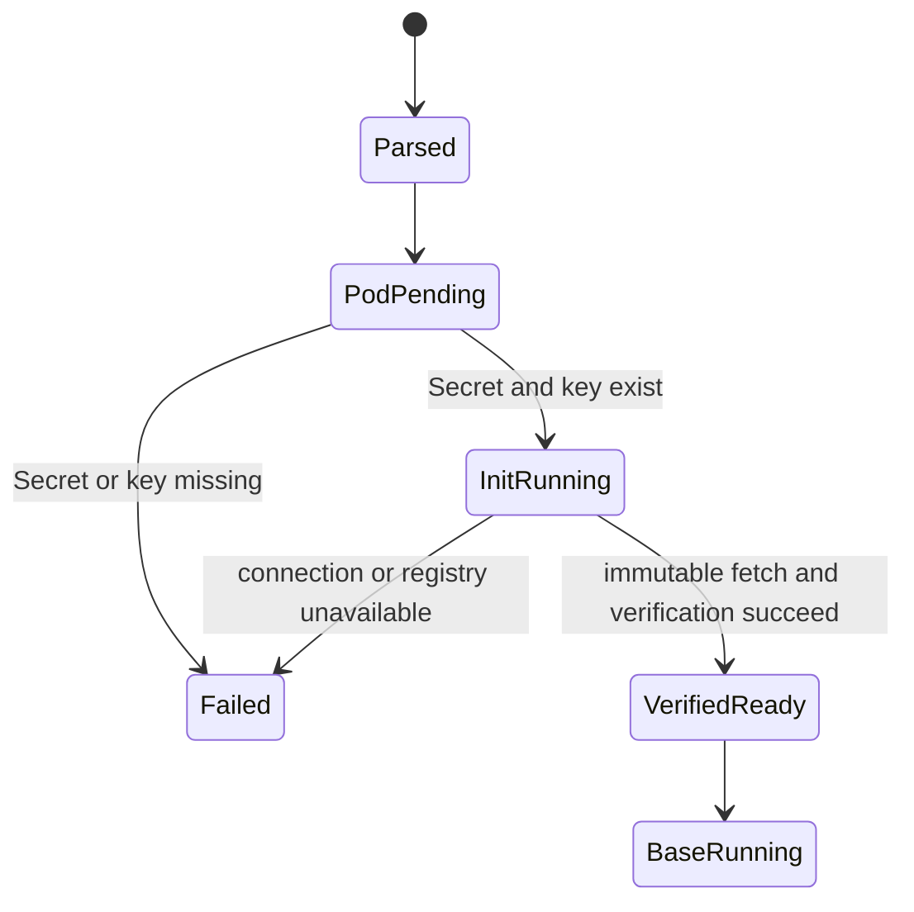
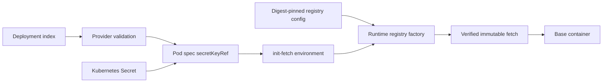

# Feature design: Kubernetes Secret bootstrap for Airflow artifact registries

- Status: APPROVED
- Owner: dpone maintainers
- Issue: maintainer-approved runtime portability request
- Target release: v0.83.6
- Last verified: 2026-09-22

## Executive summary

Strict Airflow init-fetch currently assumes that the object-storage SDK can
obtain credentials from workload identity. Some Kubernetes installations do
not provide an identity federation service, but already provision a
least-privilege object-storage reader as an Airflow Connection in a Kubernetes
Secret. dpone will support that deployment model without putting credential
values in deployment indexes, init-fetch plans, logs, XCom, or evidence.

The deployment contract gains an optional registry credential source. The
Airflow provider projects exactly one Secret key into the init container as
the canonical `AIRFLOW_CONN_*` environment variable. The verified registry
configuration selects the matching logical Airflow Connection. Existing
workload-identity deployments remain unchanged.

Success is a strict init-fetch Pod that downloads and verifies its immutable
artifacts while the base container cannot read the registry credential.

## Personas and customer journey

| Persona | Goal | Current pain | Success signal |
|---|---|---|---|
| Platform operator | Run strict init-fetch without cloud identity federation | Init-fetch cannot authenticate although a reader Secret exists | Pod reaches runtime execution without copying secret values into artifacts |
| Workload author | Use the normal declarative DAG path | Runtime infrastructure details leak into workload configuration | No workload manifest change is required |
| Security reviewer | Prove least-privilege secret exposure | Generic env injection can expose credentials to the base container | One named Secret key is visible only to init-fetch |

The operator creates or reconciles a namespaced Secret containing one
`AIRFLOW_CONN_*` key, declares its non-secret coordinate in the deployment,
and declares the same logical connection id in the digest-pinned registry
configuration. DAG parsing validates the coordinate. Kubernetes fails the Pod
before execution when the Secret or key is absent. init-fetch resolves the
Airflow Connection, fetches immutable artifacts, verifies them, and then exits.
The base container receives only verified files. Rotation updates the Secret;
new Pods consume the new value while already-running Pods keep their original
environment.

## Scope

### In scope

- An optional, closed `registry_credentials` block on strict init-fetch
  delivery with one Kubernetes Secret name, one key, and one logical Airflow
  Connection id.
- Exact `secretKeyRef` projection into the init container only.
- Registry runtime configuration access mode `airflow_connection`.
- Fail-closed validation, redacted runtime errors, compatibility tests,
  operator documentation, and release notes.

### Non-goals

- Creating, updating, reading, or printing Kubernetes Secret values.
- Replacing workload identity where federation is available.
- Passing arbitrary environment variables or mounting an entire Secret.
- Exposing registry credentials to the base container.
- Adding cloud-provider-specific configuration or customer-specific examples.

### Assumptions and constraints

- The Secret exists in the Pod namespace before the Pod is created.
- The Secret key name is exactly the canonical Airflow environment name for
  the declared connection id.
- The stored connection has read-only permission for the selected registry.
- Kubernetes Secret encryption at rest and namespace RBAC remain cluster
  responsibilities.

## Public contract

### CLI

No new command. Existing `dpone airflow build`, pack loading, and
`runtime-init-fetch` commands accept the additive contract through their normal
artifacts. Exit behavior remains fail-closed.

### Python API

The provider exposes an immutable registry credential-source DTO as part of
`InitFetchDeliveryContext`. No secret values are accepted by the API.

### Manifest/schema

The optional strict-delivery shape is:

```yaml
runtime_artifact_delivery:
  mode: init_fetch
  registry_credentials:
    method: airflow_connection_kubernetes_secret
    connection_id: artifact_registry_reader
    secret_ref:
      name: artifact-registry-reader
      key: AIRFLOW_CONN_ARTIFACT_REGISTRY_READER
```

The digest-pinned registry configuration selects the same logical id:

```json
{
  "access": {
    "mode": "airflow_connection",
    "connection_id": "artifact_registry_reader"
  }
}
```

`registry_credentials` is optional. Its absence preserves the existing
`workload_identity` registry access contract. Secret names and keys are
non-secret coordinates but are still bounded and validated.

### Artifacts and evidence

Deployment and Airflow-index artifacts contain only the Secret coordinate and
logical connection id. The init-fetch plan continues to contain no credential
source or value; it pins the deployment digest that owns the credential-source
contract. Runtime-ready evidence remains unchanged. Secret values never appear
in artifacts or evidence.

### Compatibility and migration

The change is additive. Existing strict init-fetch deployments continue to use
workload identity. Operators that opt in must update the registry ConfigMap and
deployment in one desired-state release. Rollback removes
`registry_credentials`, restores `access.mode=workload_identity`, and deploys a
new immutable release.

## Detailed algorithm

1. Parse the strict delivery block and reject unknown fields.
2. If `registry_credentials` is absent, retain the existing path.
3. If present, validate the method, DNS-label Secret name, bounded Secret key,
   safe connection id, and exact canonical `AIRFLOW_CONN_*` key derivation.
4. Preserve the validated non-secret coordinate in the immutable provider
   context and mirrored deployment/index identity.
5. Compose the Pod with one non-optional `secretKeyRef` environment entry on
   the init container. Reject collisions with pack-provided environment names.
6. Do not project the entry to the base container.
7. init-fetch verifies the registry ConfigMap digest and parses its access
   mode. `airflow_connection` constructs the existing logical credential
   resolver with the declared connection id.
8. The resolver parses the Airflow Connection from the injected environment,
   constructs the object-storage client, and performs the existing bounded,
   checksum-verified fetch.
9. Missing Secret/key is reported by Kubernetes before container start;
   missing/malformed connection or inaccessible storage maps to the existing
   redacted registry-unavailable error.
10. Successful init-fetch writes only the existing verified-ready artifacts.

### Pseudocode

```text
delivery = parse_strict_delivery(index)
credentials = parse_optional_registry_credentials(delivery)

pod = compose_strict_pod()
if credentials:
    assert credentials.secret_key == airflow_env(credentials.connection_id)
    assert credentials.secret_key not in user_env
    pod.init.env += secret_key_ref(credentials.secret_name, credentials.secret_key)

config = verify_and_parse_registry_config()
if config.access_mode == "workload_identity":
    registry = build_default_identity_registry(config.uri)
elif config.access_mode == "airflow_connection":
    registry = build_registry_from_connection(config.connection_id)
else:
    fail_config_invalid()

fetch_verify_extract(registry, pinned_plan)
```

### State machine



### Edge cases

- Missing Secret/key: Pod does not start; no fetch and no base execution.
- Empty/malformed connection: redacted unavailable error; no files activated.
- Secret/env collision: provider rejects the deployment at parse/materialize
  time.
- Secret rotation during a run: the current Pod retains its original env;
  replay creates a new Pod and consumes the current Secret value.
- Partial download, timeout, process crash, duplicate delivery, schema drift,
  and checksum mismatch retain existing init-fetch semantics.
- Unsupported storage credentials fail before executable artifact activation.

## Architecture

### Components and responsibilities

| Component | Existing/new | Responsibility | Dependencies |
|---|---|---|---|
| Strict delivery parser | Extended | Validate non-secret Secret coordinate | Provider validation primitives |
| Registry credential DTO | New | Immutable provider projection | None beyond provider DTOs |
| Pod composer | Extended | Project one Secret key to init only | Kubernetes Pod schema |
| Runtime registry config parser | Extended | Select identity or logical connection access | Runtime contracts |
| Runtime registry factory | Extended | Compose the existing credential resolver | Artifact registry options |

### Ports, adapters, and composition root

The provider owns Kubernetes projection. Core runtime owns logical credential
resolution and object-storage construction. No core contract imports Airflow
or Kubernetes. Construction remains in the init-fetch composition root.

### Data and control flow



### Alternatives and tradeoffs

| Alternative | Advantages | Disadvantages | Decision |
|---|---|---|---|
| Configure workload identity federation | Short-lived credentials; no static Secret | Not available in every cluster; external IAM setup | Retain as preferred existing mode, not required |
| Inject individual SDK environment variables | Simple SDK integration | Provider-specific contract and more secret keys | Reject |
| Mount an entire Secret into both containers | Minimal code | Excess exposure and weak least privilege | Reject |
| Project one Airflow Connection key to init only | Reuses logical resolver; narrow exposure; portable | Rotation requires a new Pod | Adopt |

### ADR requirement

No new ADR. The design extends the existing executable init-fetch boundary and
does not change artifact identity, trust, transaction, or evidence ordering.

### Quality-budget impact

The change extends existing parser, DTO, pod-composition, and runtime factory
modules. A small dedicated credential-source parser/DTO may be extracted if a
module approaches the repository SLOC budget. No new cross-layer dependency is
introduced.

## Market comparison

| System/version | Relevant capability | Observed design | Strength | Limitation | Adopt/reject | Source/date |
|---|---|---|---|---|---|---|
| dlt | N/A | Library credential configuration is not an Airflow KPO Secret projection contract | N/A | Different orchestration layer | N/A | checked 2026-09-22 |
| Informatica | N/A | Managed credential facilities are not a portable Kubernetes Pod contract | N/A | Different deployment model | N/A | checked 2026-09-22 |
| Airbyte | N/A | Platform secret management does not define this provider-owned init-container boundary | N/A | Different runtime ownership | N/A | checked 2026-09-22 |
| Fivetran | N/A | Managed service credentials are not user-composed Kubernetes Pods | N/A | Different deployment model | N/A | checked 2026-09-22 |
| Pentaho | N/A | No relevant Airflow KPO projection contract | N/A | Different orchestration layer | N/A | checked 2026-09-22 |
| Microsoft SSIS | N/A | No relevant Kubernetes init-container contract | N/A | Different runtime | N/A | checked 2026-09-22 |
| gusty | N/A | DAG generation does not own dpone artifact init-fetch | N/A | Different boundary | N/A | checked 2026-09-22 |
| Astronomer Cosmos | Operator args | Operator arguments are passed to the selected execution operator | Flexible operator composition | Does not define dpone registry trust or artifact verification | Keep dpone policy in its provider boundary | [official configuration](https://astronomer.github.io/astronomer-cosmos/configuration/operator-args.html), checked 2026-09-22 |
| Apache Beam | N/A | Pipeline SDK does not define Airflow KPO Secret projection | N/A | Different execution layer | N/A | checked 2026-09-22 |

The underlying platform pattern follows Kubernetes `secretKeyRef`, where a
missing non-optional Secret/key blocks Pod startup, and Airflow guidance to use
native Kubernetes Secrets for KPO rather than literal secret environment
values: [Kubernetes Secrets](https://kubernetes.io/docs/concepts/configuration/secret/),
[Airflow secret masking guidance](https://airflow.apache.org/docs/apache-airflow/stable/security/secrets/mask-sensitive-values.html),
and [KubernetesPodOperator guidance](https://airflow.apache.org/docs/apache-airflow-providers-cncf-kubernetes/stable/operators.html).

## Measurable differentiation

```yaml
axis: credential exposure in strict init-fetch pods
scenario: fetch immutable artifacts from an S3-compatible registry without workload identity
baseline: literal env injection or credentials exposed to both init and base containers
metric: containers receiving credential values and secret values present in serialized artifacts
target: exactly one credential-bearing container; zero secret values in artifacts and evidence
procedure: provider contract test plus rendered Pod inspection and approved-cluster canary
artifact: test_artifacts/airflow-registry-secret-bootstrap-v0836/validation-report.md
limitations: does not certify cluster Secret encryption, RBAC, or external storage permissions
```

## Security, privacy, and operations

Only a namespaced Secret coordinate is serialized. `secretKeyRef.optional` is
false. The base container does not receive the credential. Logs and exceptions
must not contain connection payloads. Operators must use a reader-only storage
principal, enable Kubernetes Secret encryption at rest, restrict namespace
RBAC, and rotate the Secret independently. Existing checksum, size, trust, and
attestation checks remain mandatory.

## Test and certification plan

| Layer | Scenario | Environment | Expected artifact |
|---|---|---|---|
| Unit | Parse valid/invalid credential source and registry config | local | pytest result |
| Contract | Render init-only secretKeyRef; reject collision; preserve legacy mode | local | pytest result |
| Integration | Resolve an Airflow Connection env against an S3-compatible test store | integration profile | integration evidence |
| Live certification | One approved-cluster strict init-fetch canary | operator environment | redacted Pod/run evidence |
| Security | Scan plan, Pod, logs, and evidence for injected fixture values | local/live | validation report |
| Compatibility | Existing workload-identity fixtures remain byte/behavior compatible | local | pytest result |

## Documentation plan

Update the Airflow provider reference, strict init-fetch operations guide,
runtime-image guide, generated schemas, CLI-adjacent examples, and changelog.
Document prerequisites, Secret rotation, failure diagnosis, rollback, and the
fact that the base container never receives the registry credential.

## Rollout and rollback

Release the additive capability, update the platform registry ConfigMap and
deployment together, run one non-production canary, then promote normally.
Rollback by publishing a new desired state that restores workload identity.
Never bypass checksum, attestation, or required CI gates.

## Agent execution plan

| Agent/role | Owned paths | Read-only paths | Forbidden paths | Dependency |
|---|---|---|---|---|
| Integrator | provider contract/composition, runtime config/factory, schemas, tests, docs, changelog | existing init-fetch architecture | customer-specific repositories and data | approved design |

The primary agent is integrator and shared-file owner. No parallel writer is
used.

## Approval checklist

- [x] User problem and CJM are clear.
- [x] Algorithm and failure semantics are implementable without guessing.
- [x] Public contracts and compatibility are explicit.
- [x] Architecture and alternatives are justified.
- [x] Relevant market research uses current official sources.
- [x] Claimed differentiation is measurable.
- [x] Tests, evidence, docs, rollout, and rollback are complete.
- [x] Path ownership and integration plan are conflict-safe.
- [x] Maintainer approved the Kubernetes Secret approach on 2026-09-22.
