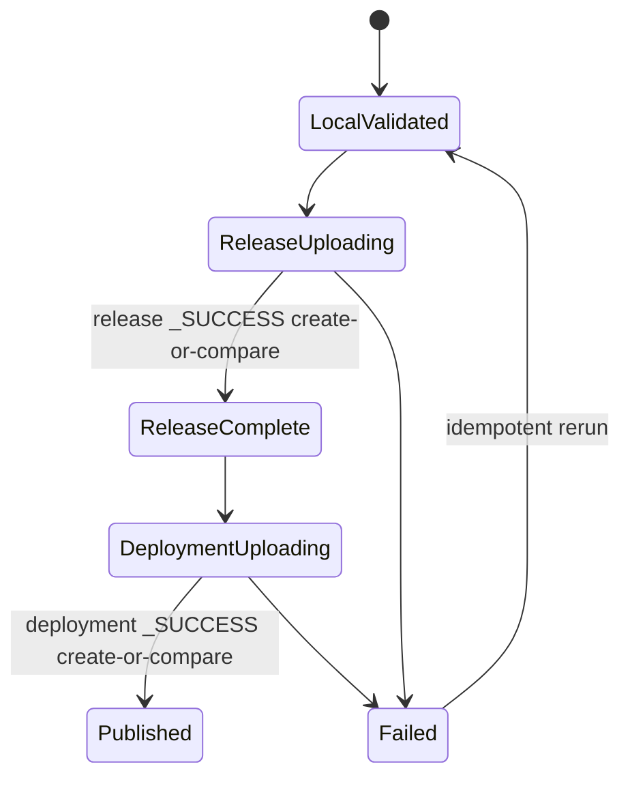
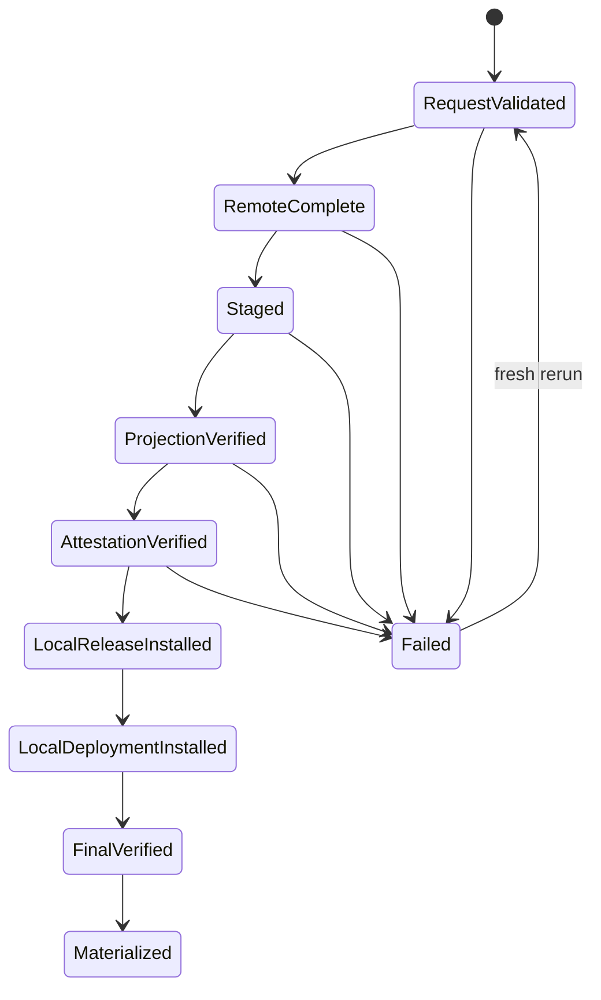
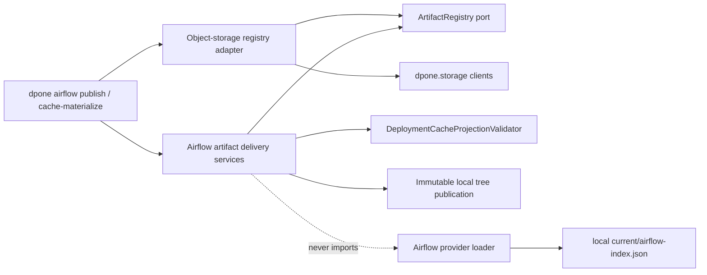

# Feature design: Airflow remote artifact publication and pinned materialization

- Status: IMPLEMENTED
- Owner: dpone maintainers
- Issue: Industrial Self-Service Airflow Phase 1B
- Target release: v0.72.10 implementation slice
- Architecture authority: `docs/adr/0009-artifact-delivery-and-cache-materializer.md`
- Approval authority: frozen Industrial Self-Service Airflow plan and maintainer instruction to continue implementation
Last verified: 2026-07-16

## Executive summary

dpone can already build content-addressed `release-set` and `deployment-set`
trees and can verify and promote a complete local deployment cache. The missing
production handoff is the networked delivery step between those two operations.
The only remote implementation in the repository is the legacy pack-only
provider synchronizer. It follows mutable `latest`/git-generation semantics,
imports Airflow storage hooks, and does not understand release/deployment
identity. It must not become the backend for the frozen self-service model.

This slice adds a parse-independent, connector-neutral artifact-registry port,
an object-storage adapter, an immutable create-or-compare publisher, and a
pinned materializer. Platform CI publishes an already verified local release
and deployment by digest. A separate process downloads the exact requested
release/deployment into an isolated staging cache, verifies the complete local
projection with the existing `DeploymentCacheProjectionValidator`, and only
then publishes immutable local cache trees. `dpone airflow cache-sync` remains
the sole local activation command and still switches `current` last.

The measurable outcome is an executable local object-storage proof of this
production topology:

```text
verified local build
  -> immutable remote release/deployment prefixes
  -> pinned remote materialization
  -> existing local cache verification/promotion
  -> parse-only Airflow loader
```

No beginner command changes. No artifact-store access occurs during Airflow DAG
parse. No secret value, signed URL, physical credential, or mutable `current`
reference is written into release/deployment artifacts or normal text output.
The base CLI import/help path also constructs no Airflow or Vault credential
provider; resolver construction remains deferred until a runtime credential
source is actually selected.

## Personas and customer journey

| Persona | Goal | Current pain | Success signal |
|---|---|---|---|
| Data engineer | Commit authoring sources and let CI deploy them | Must understand a missing external handoff | Golden path stays unchanged; CI owns delivery |
| Platform engineer | Publish and distribute one exact build | Existing remote command publishes only compact packs under mutable git generations | One release/deployment digest is published and materialized idempotently |
| Airflow operator | Make a verified deployment visible without parse-time I/O | Must pre-copy an undocumented tree | Materialize, inspect report, then run existing guarded `cache-sync` |
| Security engineer | Prove no overwrite, unpinned fetch, or credential leakage | Existing object clients overwrite by default | Conditional create, digest verification, bounded fetch, redacted evidence |

### End-to-end journey

1. Data engineer uses the existing five-command authoring journey. No remote
   storage option appears in beginner help.
2. CI runs `dpone airflow preview`/build-plane compilation and
   `dpone airflow build`, producing one verified local release/deployment.
3. Platform CI runs `dpone airflow publish` with explicit release,
   deployment, environment, logical registry ref, and a platform-provided
   storage binding. The command validates all local bytes before network I/O.
4. The publisher creates every remote object once. Repeating the same command
   compares existing bytes and returns a deterministic no-op. Different bytes
   at the same content-addressed key fail closed.
5. A deployment step, init container, or sidecar runs
   `dpone airflow cache-materialize` with the exact release and deployment IDs.
   It never resolves a remote or local `current` pointer.
6. The materializer downloads to a private temporary cache, enforces object,
   artifact, and total byte budgets, and runs the existing full projection
   validator against staged bytes.
7. Only a fully verified release/deployment is installed under the canonical
   local cache paths. Installation is create-or-compare and never overwrites a
   different immutable tree.
8. The operator runs the existing guarded `dpone airflow cache-sync` to create
   an activation and atomically switch local `current`.
9. On failure, structured output names the stable code and a safe next action.
   A retry recomputes remote/local state; it does not replay an old mutation
   plan.

## Scope

### In scope

- Immutable publication of one existing `release-set` and one existing
  environment `deployment-set` to a pinned object-storage prefix.
- Pinned materialization by exact `release_id`, `deployment_id`, environment,
  and logical `artifact_registry_ref`.
- Backend-neutral port plus local, S3, GCS, and Azure object-storage adapters.
- Conditional create support for object-storage clients.
- Existing-object byte comparison and conflict detection.
- Pre-download metadata size checks plus post-download size and SHA-256 checks.
- Isolated staging followed by the existing full deployment projection
  validator.
- Immutable local release and deployment installation without activation.
- Text and JSON CLI reports using `dpone.error.v1` and standard exit codes.
- Additive public schemas and generated references.
- Deprecation documentation for the legacy pack-only remote synchronizer.
- Deterministic local object-storage integration and provider-adapter unit
  tests. Cloud-live tests remain opt-in.

### Non-goals

- Resolving remote `latest`, tags, branch names, or `current`.
- Switching local `current`; the existing `cache-sync` command owns activation.
- Rebuilding release/deployment content while publishing or materializing.
- Deleting remote objects, remote retention, or remote rollback.
- Embedding object-storage credentials or connection-registry bodies.
- Fetching artifacts from Airflow DAG parse code.
- Replacing Airflow DAG Bundles or mapping a release one-to-one to a bundle.
- General-purpose package or dataset artifact registries.
- Completing signed artifact-attestation verification. The materializer preserves
  and reports the configured attestation policy and fails closed for a
  production policy that has no injected verifier. A dedicated follow-up owns
  signer/root policy and conformance evidence.
- Removing `dpone gitops airflow publish` or provider `cache-sync` in this
  release. They remain legacy pack-generation compatibility surfaces.

### Assumptions and constraints

- Release and deployment identities were built by the canonical fingerprint
  contract and already exist locally before publish.
- Registry roots are supplied by platform configuration/CI, not authoring
  manifests.
- Cloud SDK imports remain lazy and optional through existing extras.
- Registry writes use backend conditional-create primitives. A backend that
  cannot provide create-if-absent is unsupported for immutable publication.
- Registry reads may use workload identity or an injected credential resolver,
  but credentials never cross the domain port.
- `_SUCCESS` is a completion marker, not an identity source. Identity is still
  recomputed from canonical content and artifact bytes.

## Public contract

### CLI

#### Publish

```bash
dpone airflow publish \
  --cache-root .dpone-cache \
  --release-id sha256:<release> \
  --deployment-id sha256:<deployment> \
  --environment prod \
  --artifact-registry-ref dpone-prod-artifacts \
  --registry-uri s3://platform-artifacts/dpone/airflow \
  --connection-type vault \
  --connection-id artifact_registry_prod \
  --format json
```

For executable local proof:

```bash
dpone airflow publish \
  --cache-root .dpone-cache \
  --release-id sha256:<release> \
  --deployment-id sha256:<deployment> \
  --environment dev \
  --artifact-registry-ref local-test \
  --registry-uri s3://dpone-test/airflow \
  --local-registry-root .dpone-artifact-registry
```

Contract:

- all identity/environment/ref options are required;
- exactly one storage composition mode is selected: local registry root,
  workload identity, or logical credential reference;
- a logical credential reference is a bounded name matching
  `[A-Za-z0-9][A-Za-z0-9_.-]{0,127}`; JSON, URI, path, query, assignment, and
  secret-shaped values are rejected without being echoed;
- `--registry-uri` must be a provider URI root, never an object key containing
  `current` or `latest` path segments;
- `--artifact-registry-ref` must exactly match deployment and Airflow-index
  delivery configuration;
- publisher validates the local projection before opening a network client;
- text is topology-light and shows logical registry ref, IDs, counts, status,
  and next action; JSON may include the registry URI but never credentials;
- success and deterministic no-op exit `0`; validation/remote conflict exit
  `1`; bad CLI use exits `2`; unavailable storage exits `3`; security policy
  violation exits `4`; internal error exits `5`;
- stdout contains the report; argparse-only errors use stderr.

#### Materialize

```bash
dpone airflow cache-materialize \
  --cache-root /opt/airflow/dags/.dpone-cache \
  --release-id sha256:<release> \
  --deployment-id sha256:<deployment> \
  --environment prod \
  --artifact-registry-ref dpone-prod-artifacts \
  --registry-uri s3://platform-artifacts/dpone/airflow \
  --identity-mode workload_identity \
  --max-object-bytes 67108864 \
  --max-total-bytes 536870912
```

Contract:

- the command downloads only content-addressed keys derived from the supplied
  release/deployment IDs;
- no `--promote`, implicit activation, or unpinned fallback exists;
- default per-object limit is 64 MiB and default total limit is 512 MiB;
- local cache installation is create-or-compare and returns no-op for identical
  trees;
- successful output gives the exact existing `cache-sync` next action without
  inventing a CAS value;
- materialization does not read Airflow Variables/Connections, Vault, DBs, or
  local `current`;
- materialization accepts only workload identity or the deterministic local
  registry root. Airflow/Vault logical connection options are publish-only and
  are absent from the `cache-materialize` parser.
- Azure workload identity uses
  `azure://<storage-account>/<container>/<non-empty-root>` and the Azure
  `WorkloadIdentityCredential`; the accountless `az://` compatibility form is
  not accepted for this mode. Install the `azure` or `object_storage` extra.

### Python API

```python
from dpone.ports.artifact_registry import ArtifactRegistry
from dpone.runtime.airflow_artifact_delivery import (
    AirflowArtifactDeliveryError,
    AirflowArtifactMaterializer,
    AirflowArtifactPublisher,
    MaterializeRequest,
    PublishRequest,
)

publisher = AirflowArtifactPublisher(registry=registry)
publish_report = publisher.publish(PublishRequest(...))

materializer = AirflowArtifactMaterializer(registry=registry)
materialize_report = materializer.materialize(MaterializeRequest(...))
```

The application services depend only on `ArtifactRegistry`. Object-storage SDK
selection is a CLI/composition-root responsibility.

Port:

```python
class ArtifactRegistry(Protocol):
    def create_file(self, key: PurePosixPath, source: Path) -> CreateResult: ...
    def stat(self, key: PurePosixPath) -> ArtifactMetadata: ...
    def download_file(
        self,
        key: PurePosixPath,
        destination: Path,
        *,
        max_bytes: int,
    ) -> None: ...
```

Keys and registry roots are relative, canonical POSIX paths. The adapter owns
root URI joining and rejects absolute, empty, dot, parent, repeated separator,
backslash, query, fragment, `current`, and `latest` components. The local proof
adapter records the no-follow root descriptor identity on first use and
requires the same device/inode for every later operation by that client.
The root is opened component-by-component from the filesystem anchor, so a
symlink in any ancestor is rejected before a directory is created. Descendant
operations use `dir_fd`; replacing the root pathname during or between
operations cannot split content and completion markers across trees.

### Remote layout

```text
<registry-root>/
  releases/
    sha256-<release>/
      release-set.json
      dags/...
      packs/...
      schemas/...
      _SUCCESS
  deployments/
    <environment>/
      sha256-<deployment>/
        deployment.json
        airflow-index.json
        binding-set.json
        connection-registry.ref
        credential-runtime.ref
        _SUCCESS
```

Remote release `_SUCCESS` is delivery metadata and is not copied into the
local release tree or included in `release_id`. The deployment `_SUCCESS` is
the existing local deployment marker and is copied unchanged.

### Reports and evidence

Publish report:

```yaml
schema: dpone.airflow-artifact-publish.v1
status: published        # published | no_op | failed
release_id: sha256:...
deployment_id: sha256:...
environment: prod
artifact_registry_ref: dpone-prod-artifacts
created_objects: 8
existing_equal_objects: 0
published_release: true
published_deployment: true
errors: []
```

> Default contract: `dpone airflow publish --publication-mode compatible`
> preserves v1 for existing consumers. New exact promotion explicitly uses
> `--publication-mode exact` and requires `dpone.airflow-artifact-publish.v2`,
> including
> remote read-back, registry-scope binding, and a verified root commitment.
> See [trusted Airflow publication receipt](feature-design-airflow-publication-receipt-v07323.md).

Materialize report:

```yaml
schema: dpone.airflow-cache-materialize.v1
status: materialized     # materialized | no_op | failed
release_id: sha256:...
deployment_id: sha256:...
environment: prod
artifact_registry_ref: dpone-prod-artifacts
downloaded_objects: 8
downloaded_bytes: 12345
local_release_state: created
local_deployment_state: created
projection_verified: true
activated: false
errors: []
```

Reports never include credential values, signed URLs, request headers, SDK
responses, object bodies, registry connection payloads, Vault paths, or local
temporary paths in text mode.

### Error families

| Code | Meaning | Recovery |
|---|---|---|
| `DPONE_ARTIFACT_REGISTRY_REF_MISMATCH` | Requested logical registry differs from deployment/index | Use the deployment-owned ref or build a new deployment |
| `DPONE_ARTIFACT_REGISTRY_URI_UNPINNED` | URI contains mutable/unsafe components | Use a reviewed immutable registry root |
| `DPONE_ARTIFACT_REGISTRY_SDK_UNAVAILABLE` | Optional cloud SDK is missing | Install the matching `dpone` extra |
| `DPONE_ARTIFACT_REGISTRY_UNAVAILABLE` | Bounded storage operation failed | Repair storage/network/IAM and rerun |
| `DPONE_ARTIFACT_REGISTRY_METADATA_INVALID` | Backend returned a negative or malformed object size | Repair or replace the backend adapter; do not download |
| `DPONE_ARTIFACT_REGISTRY_OBJECT_TOO_LARGE` | Remote metadata exceeds per-object limit | Review policy or publish a smaller artifact |
| `DPONE_ARTIFACT_REGISTRY_TOTAL_LIMIT_EXCEEDED` | Planned/downloaded bytes exceed total limit | Review release size and platform budget |
| `DPONE_ARTIFACT_REGISTRY_IMMUTABILITY_CONFLICT` | Existing content-addressed key has different bytes | Quarantine prefix; never overwrite it |
| `DPONE_ARTIFACT_REGISTRY_INCOMPLETE` | Completion marker or declared object is absent | Rerun publisher; do not activate |
| `DPONE_ARTIFACT_REGISTRY_CHECKSUM_MISMATCH` | Download differs from declared digest | Quarantine remote object and republish a new release |
| `DPONE_ARTIFACT_ATTESTATION_REQUIRED` | Production policy requires an unavailable/unverified attestation | Supply the certified verifier/evidence; never bypass |
| existing `DPONE_RELEASE_*` / `DPONE_DEPLOYMENT_*` | Staged canonical projection is invalid | Rebuild/publish correct immutable content |

### Compatibility and migration

- `dpone gitops airflow publish` remains pack-only and unchanged for at least
  two minor releases and 12 months. Docs label it legacy and do not recommend
  it for release/deployment delivery.
- `dpone-airflow-pack` provider cache-sync remains available for legacy pack
  indexes. New code is not added there, and the canonical loader remains local
  index-only.
- Existing local `cache-sync`, recovery, retention, preview, and safe-sample
  commands remain behaviorally compatible.
- No old remote generation is silently imported into a release-set. Migration
  requires rebuilding canonical release/deployment artifacts once.
- Rollback means stop using the new publisher/materializer while retaining the
  previously activated local deployment. Never roll back by overwriting remote
  content-addressed keys.

## Detailed algorithm

### Publication

1. Validate canonical release/deployment IDs, environment, registry ref, URI,
   size budgets, and storage composition mode without network I/O.
2. Resolve the canonical local deployment path from environment/deployment ID.
3. Run `DeploymentCacheProjectionValidator.validate_details`; this recomputes
   deployment/release identities, compares index mirrors, confines paths, and
   verifies every declared artifact digest/size.
4. Require the deployment/index logical `artifact_registry_ref` to equal the
   request.
5. Build two deterministic inventories:
   - release-set plus exactly its declared DAG/pack/schema files;
   - exact deployment projection files.
6. Sort inventories by remote relative key. Reject duplicates and total bytes
   above the configured budget before client construction.
7. Copy all inventoried files through no-follow descriptors into a private
   mode-`0700` operating-system temporary snapshot outside the mutable cache
   pathname, and verify the copied size and SHA-256 before remote I/O.
8. Construct the registry adapter at the CLI composition root. The CLI performs
   the offline validation before this step; the service repeats validation and
   snapshots bytes before its first registry operation.
9. Publish release objects except `_SUCCESS` with create-if-absent.
10. If create reports conflict/existing, stat and bounded-download the object,
   compare size/SHA-256, then classify `existing_equal` or fail immutable
   conflict. Never overwrite or delete.
11. Publish remote release `_SUCCESS` last using create-or-compare.
12. Publish deployment files with deployment `_SUCCESS` last using the same
    algorithm.
13. Emit the report only after both markers are equal/present. A partial failure
    emits failure and leaves incomplete immutable prefixes for safe idempotent
    resume.

### Pinned materialization

1. Validate request syntax, budgets, logical registry ref, and URI before client
   construction.
2. Derive exact remote release/deployment prefixes from requested identities.
3. Stat both `_SUCCESS` markers and fixed manifest files. Reject missing,
   oversized, or non-regular objects before bulk download when backend metadata
   is available.
4. Open and pin the local cache-root directory identity, then create a unique
   mode-`0700` staging cache in the private operating-system temporary area,
   outside the cache root. The stage has canonical `releases/...` and
   `deployments/...` layout but is not visible as `current`; placing it outside
   the guarded root prevents a root-swap attack from redirecting cleanup.
5. Download `release-set.json`, `deployment.json`, and `airflow-index.json` with
   individual and cumulative limits.
6. Parse bounded JSON and validate requested IDs, environment, release link,
   registry ref, and completion policies.
7. Derive the remaining release inventory only from safe release-relative
   locators. Derive deployment inventory from a fixed allowlist, not remote
   listing.
8. Stat then stream every object into an exclusive staging file through a
   write-time byte limiter. Reject and remove the partial destination as soon
   as transferred bytes exceed the declared/request limit; do not rely on
   metadata or an after-the-fact size check. Verify bytes and all declared
   SHA-256 values. Unknown remote objects are ignored; they cannot influence
   local identity.
9. Run `DeploymentCacheProjectionValidator` against the isolated staging cache.
10. If attestation policy is `required_for_prod`, invoke an injected verifier.
    Missing, unverified, invalid, expired, or wrong-subject evidence fails before
    local installation. The default CLI has no unsafe override.
11. Revalidate the pinned cache-root directory identity and install the staged
    release tree with a descriptor-anchored, atomic no-replace rename. If the
    destination exists, compare the complete immutable tree; never replace even
    an empty directory.
12. Revalidate the cache root, install the deployment tree identically, then run
    the validator again against final paths and revalidate the root once more.
13. Delete staging and emit success/no-op. Do not inspect or switch `current`.

### Pseudocode

```text
publish(request):
    validate_offline(request)
    projection = local_validator.validate(request.deployment_path)
    require_registry_ref_match(projection, request.registry_ref)
    inventory = deterministic_release_inventory + deterministic_deployment_inventory
    require_budget(inventory)
    registry = injected_registry()
    for object in release_without_success + release_success_last:
        create_or_compare(registry, object)
    for object in deployment_without_success + deployment_success_last:
        create_or_compare(registry, object)
    return publish_report

materialize(request):
    validate_offline(request)
    registry = injected_registry()
    pinned_cache_root = open_nofollow_and_pin_identity(real_cache)
    staging = unique_private_os_temp_cache()
    require_remote_success_markers(registry, pinned_keys(request))
    fetch_bounded_fixed_manifests(registry, staging)
    inventory = derive_safe_inventory_from_manifests()
    fetch_bounded_inventory(registry, staging, inventory)
    staged = validator(staging).validate(request.environment)
    require_exact_requested_identity(staged)
    verify_attestation_when_required(staged)
    immutable_install_release_no_replace(staging, pinned_cache_root)
    immutable_install_deployment_no_replace(staging, pinned_cache_root)
    validator(real_cache).validate(request.environment)
    return materialize_report(activated=false)
```

### State machines





### Concurrency, retry, replay, and rollback

- Conditional create gives one winner per remote key. Concurrent publishers of
  identical bytes both finish successfully; different bytes produce one
  conflict and no overwrite.
- Completion markers are created last. Materializers treat a missing marker as
  incomplete even if all other objects happen to exist.
- A network timeout after a successful create is recovered by stat/download and
  byte comparison on rerun.
- A process crash leaves either an incomplete remote prefix or an isolated
  mode-`0700` operating-system temporary directory. Neither changes active
  `current`.
- Materializer staging names are unique and outside the guarded cache root.
  Stale staging is not automatically trusted or resumed; a new run creates a
  fresh stage and may remove only its own stage.
- Local installation is create-or-compare. The materializer passes the original
  pinned cache-root descriptor into both immutable-tree installs; it never
  reopens the root pathname between the final guard and a write. Concurrent
  identical materializations converge. Different content at the same digest
  fails closed.
- There is no rollback mutation. The prior local activation remains current
  until existing `cache-sync` succeeds.

### Edge cases

| Case | Behavior |
|---|---|
| Empty release | Reject unless canonical contract explicitly contains at least one DAG/pack artifact |
| Missing release/deployment marker | `DPONE_ARTIFACT_REGISTRY_INCOMPLETE` |
| Unknown extra remote object | Ignore; fixed/declared inventory only |
| Duplicate logical ID/path | Reject before network or installation |
| Path traversal/backslash/query | Reject normalized key/locator |
| Remote symlink | Object stores expose objects, not filesystem links; local adapter rejects symlink escape |
| Object too large | Reject from metadata before download where possible and again after download |
| Total grows during fetch | Abort once cumulative verified bytes exceed limit; remove own stage |
| Timeout/5xx | Exit `3`; rerun safely |
| Existing equal key | No-op for that key |
| Existing different key | Immutable conflict, never overwrite |
| Malformed JSON/schema | Existing structured release/deployment validation error |
| Requested ID differs from content | Fingerprint mismatch; no local install |
| Prod attestation unavailable | Fail closed before local install |
| Cancellation | Clean own stage; leave remote completed objects untouched |

## Architecture

### Components and responsibilities

| Component | Existing/new | Responsibility | Dependencies |
|---|---|---|---|
| `ArtifactRegistry` port | New | Minimal conditional create/stat/download contract | stdlib models only |
| object-storage registry adapter | New | URI joining, SDK errors, conditional create, metadata, download | `dpone.storage` clients |
| `ObjectStorageClient` conditional/stat operations | Additive | Backend-specific create-if-absent and metadata | lazy optional SDKs |
| `AirflowArtifactPublisher` | New | Local validation, deterministic inventory, create-or-compare, report | port + existing projection validator |
| `AirflowArtifactMaterializer` | New | Pinned bounded fetch, staging, existing validation, immutable install | port + existing validator/local publication |
| CLI composition facade | New | Parse options, build adapter, render `SelfServiceResult` | commands/readiness/adapters |
| `DeploymentCacheProjectionValidator` | Reused unchanged | Canonical final truth for local projection | contracts/runtime verifier |
| `DeploymentCacheMaterializer` | Reused unchanged | Guarded activation after materialization | local cache only |
| legacy provider cache sync | Existing compatibility | Old pack-generation users only | no new policy |

### Dependency direction



The provider package does not import the new adapter/service. The new service
does not import Airflow, Vault clients, Kubernetes, or vendor connectors.

### SOLID, DRY, KISS review

- SRP: registry transport, publish policy, materialization policy, local
  validation, and activation remain distinct.
- OCP/DIP: a new registry backend implements one small port; services do not
  branch on S3/GCS/Azure.
- ISP: the port exposes only create/stat/download needed by this use case, not
  delete/list/current mutation.
- DRY: canonical identity and local projection verification reuse existing
  contracts; no second release/deployment validator is introduced.
- KISS: fixed content-addressed layout, fixed deployment file allowlist,
  completion markers, and fresh retries replace a remote transaction manager.
- Clean architecture: SDKs live in adapters; domain/application policy depends
  inward on ports and contracts.

### Alternatives and tradeoffs

| Alternative | Advantages | Disadvantages | Decision |
|---|---|---|---|
| Extend provider `cache_sync.py` | Less new CLI | Mutable generation model, Airflow hook dependency, unsafe ownership | Reject; freeze as legacy |
| Fetch during DAG parse | Zero deployment step | Network/credential/latency blast radius, violates parse SLO | Reject |
| One tar/zip bundle | Fewer requests | Decompression limits, duplicate packaging identity, partial extraction risk | Defer; fixed files first |
| Mutable remote `current` pointer | Easy watcher UX | Unpinned race, separate CAS/attestation problem | Reject for v0.72.10 |
| Overwrite content-addressed objects | Simple SDK calls | Silent corruption and false reproducibility | Reject |
| Remote database transaction | Strong atomicity | Backend coupling and operational cost | Reject; marker protocol is sufficient |
| General registry plugin framework | Broad extension | Speculative abstraction | Reject; one small port and adapter |

### ADR requirement

No new ADR. ADR 0009 already requires separate publisher, cache materializer,
loader, and pinned `init_fetch`. This slice implements its missing remote handoff
without changing the decision. Update ADR consequences only if implementation
finds a contradiction.

### Quality-budget impact

- New modules are split by stable responsibility and each must stay below the
  repository `max_sloc` budget.
- Existing provider modules receive no new domain policy.
- Shared registry/schema/CLI files are integrator-owned.
- Import graph must preserve zero Airflow/Kubernetes/Vault/vendor-SDK imports on
  base CLI help and provider parse paths.
- Existing clustering and cross-layer flow budgets may not regress.

## Market comparison

Checked 2026-07-16 against current official primary sources.

| System/version | Relevant capability | Observed design | Strength | Limitation | Adopt/reject | Source/date |
|---|---|---|---|---|---|---|
| dlt | N/A | Pipeline deployment guidance, not an Airflow release/deployment cache protocol | Clear deployment tutorials | Different layer | N/A for this slice | Official dlt docs, checked 2026-07-16 |
| Informatica | N/A | Managed deployment/promotion features | Integrated managed operations | Not an embeddable OSS Airflow artifact protocol | N/A | Official product docs, checked 2026-07-16 |
| Airbyte | N/A | Connector/workload deployment rather than DAG parse artifact delivery | Managed control plane | Different artifact and orchestration model | N/A | Official Airbyte docs, checked 2026-07-16 |
| Fivetran | N/A | Managed connector deployment | Minimal operator work | No comparable self-hosted DAG cache contract | N/A | Official Fivetran docs, checked 2026-07-16 |
| Pentaho | N/A | Repository/job deployment | Mature job packaging | Different runtime/control plane | N/A | Official Pentaho docs, checked 2026-07-16 |
| Microsoft SSIS | N/A | Catalog/project deployment | Transactional managed catalog | Windows/SQL Server-specific and not Airflow parse delivery | N/A | Microsoft Learn, checked 2026-07-16 |
| gusty | N/A | Filesystem-oriented DAG generation | Simple authoring | No release/deployment artifact plane | N/A | Official gusty docs, checked 2026-07-16 |
| Astronomer Cosmos 1.x | Remote/prebuilt dbt manifest loading | Can parse a prebuilt local or remote manifest and may use Airflow object-storage connections | Good precompiled-artifact UX | Remote manifest can be accessed by parse-side integration and is not a dpone release/deployment identity | Adopt prebuilt-artifact UX; reject remote parse I/O | https://astronomer.github.io/astronomer-cosmos/configuration/parsing-methods.html, checked 2026-07-16 |
| Apache Beam | N/A | Portable pipeline artifacts/runners | Strong runner portability | Not an Airflow DAG cache materializer | N/A | Official Beam docs, checked 2026-07-16 |
| Apache Airflow 3.3 | DAG Bundles | Git bundle supports versioning; local/S3/GCS bundles do not; credentials should be referenced rather than inlined | Explicit code-version pinning | Bundle version is not workload pack identity | Preserve independent bundle/release evidence | https://airflow.apache.org/docs/apache-airflow/stable/administration-and-deployment/dag-bundles.html, checked 2026-07-16 |
| Kubernetes | Init containers | Init container can prepare data in a shared volume before app containers start | Natural KPO artifact handoff | Does not define registry integrity | Adopt init-fetch topology | https://kubernetes.io/docs/concepts/workloads/pods/init-containers/, checked 2026-07-16 |
| S3/GCS/Azure SDKs | Conditional object creation | S3 `IfNoneMatch=*`, GCS `if_generation_match=0`, Azure `overwrite=False` prevent blind overwrite | Backend-native concurrency boundary | Semantics/errors differ | Normalize behind adapter | AWS Boto3, Google Cloud Storage, Azure Blob official docs, checked 2026-07-16 |

## Measurable differentiation

```yaml
axis: deterministic safe retry after partial remote publication
scenario: publisher crashes after half of a release is written, then two publishers retry concurrently
baseline: current dpone legacy pack publisher with overwrite and mutable latest index
metric: overwritten conflicting objects; false successful publications; final byte equality
target: 0 overwrites; 0 false successes; exactly one immutable byte set; identical retries are no-op
procedure: deterministic local object-storage fault injection plus concurrent publisher test
artifact: test_artifacts/airflow-self-service-v07210-remote-delivery/validation-report.md
limitations: local proof does not certify cloud IAM, network, or provider service behavior
```

```yaml
axis: Airflow parse isolation
scenario: 100 DAG / 500 workload parse with remote registry configured and unavailable
baseline: frozen provider parse SLO
metric: remote/DB/secret calls and cold/warm parse duration
target: 0 remote/DB/secret calls; cold p95 <= 5s; warm p95 <= 2s
procedure: existing provider parse benchmark plus import/network spies
artifact: test_artifacts/airflow-self-service-v07210-remote-delivery/validation-report.md
limitations: benchmark runner characteristics must be recorded
```

## Security, privacy, and operations

- Use workload identity by default in production. Static keys are not CLI
  arguments and are not serialized into artifacts.
- Conditional create is mandatory for immutable publication. A plain overwrite
  API is never substituted silently.
- Every key is derived from canonical IDs and safe relative locators.
- Materializer never lists a broad prefix to discover executable content.
- Per-object and cumulative size budgets are enforced before and after download.
- SHA-256 is computed from local bytes after every download; ETag/MD5 is not
  accepted as content identity.
- Temporary files are private, unique, and cleaned on success/failure.
- Reports redact signed URLs, SDK responses, headers, physical credential refs,
  Vault paths, and local staging names.
- The remote registry IAM policy grants create/read under the configured prefix;
  deletion is not required by this feature.
- Production completion requires the attestation verifier follow-up. Until then,
  live production status remains `UNVERIFIED`, never `PASS`.
- Metrics: publish/materialize duration, bytes, object counts, no-op counts,
  conflict/incomplete/checksum/size failures by stable code. Labels contain only
  logical registry ref and truncated digest, never URI or connection ID.

## Test and certification plan

| Layer | Scenario | Environment | Expected artifact |
|---|---|---|---|
| Unit | key normalization, inventories, budgets, create-or-compare | pytest/fakes | focused test report |
| Contract | port, report schemas, CLI exit/output matrix | pytest | generated schemas/reference |
| Integration | local object registry publish -> materialize -> cache-sync -> loader | local filesystem | validation report fixture |
| Security | traversal, mutable names, conflict, oversized metadata/body, redaction | pytest | negative test matrix |
| Concurrency | identical and conflicting publishers/materializers | local threads/processes | deterministic convergence proof |
| Import | base CLI help/provider parse with cloud SDK imports blocked | pytest/subprocess | lazy-import proof |
| Performance | 100 DAG/500 workloads parse unchanged; 10k small objects planning bounded | local benchmark | timing/RSS evidence |
| Cloud live | S3/GCS/Azure conditional create and workload identity | approved opt-in accounts only | `UNVERIFIED` unless run |
| Airflow/Kubernetes live | materializer/init-fetch/cache-sync/loader/KPO | approved cluster only | `UNVERIFIED` unless run |

Required negative cases:

- release/deployment/ref mismatch before client creation;
- `current`, `latest`, path traversal, query, fragment, backslash, absolute key;
- empty or schema-only release and empty/repeated registry-root components;
- registry-root replacement during and between local object operations;
- secret-token-shaped logical connection IDs without echoing their input;
- Vault provider failures redact both the logical connection input and backend
  exception text;
- a symlink in any ancestor of the local registry root;
- accountless Azure URI with workload identity;
- missing/invalid `_SUCCESS`;
- remote metadata/body size disagreement;
- checksum mismatch and content-addressed key conflict;
- partial publication and process crash resume;
- network timeout after create;
- duplicate IDs/paths and unknown extra objects;
- local immutable-tree conflict and symlink escape;
- production attestation unavailable/invalid;
- SDK missing with executable installation fix;
- one malformed deployment does not mutate current or another cache;
- no remote, Airflow metadata, Variable, Connection, Vault, or Kubernetes call
  during provider parse.
- provider load through `<custom-cache-root>/current/airflow-index.json` after
  cache-sync resolves release artifacts from the custom root, not the
  activation directory.

## Documentation plan

- Update `docs/airflow-cache-sync.md` with publish/materialize/promote topology,
  commands, state boundaries, and recovery matrix.
- Update `docs/airflow-self-service-architecture.md`, `docs/architecture.md`,
  ADR 0009 links, provider API docs, compatibility docs, and backlog.
- Add generated CLI and schema references.
- Keep the 5-minute beginner guide unchanged except for a short statement that
  CI/platform owns remote delivery.
- Add platform runbook examples for local registry and S3/GCS/Azure workload
  identity, including the account-scoped Azure URI.
- Mark cloud/Kubernetes live certification separately as `UNVERIFIED`.

## Rollout and rollback

1. Ship additive port/adapter/service/report schemas and local proof.
2. Run one dev environment with local or non-production object storage.
3. Verify idempotent publication, materialization, local promotion, provider
   parse, and stale-cache recovery.
4. Add signed artifact verification before certifying production.
5. Enable one production environment through CI/workload identity and collect
   current cloud/Kubernetes evidence.
6. Keep legacy pack publisher for the deprecation window.

Rollback stops new remote materialization and keeps the previously active local
deployment. Remote content-addressed objects are retained. Never delete or
overwrite them as rollback.

## Agent execution plan

| Agent/role | Owned paths | Read-only paths | Forbidden paths | Dependency |
|---|---|---|---|---|
| Explorer/architect/test/docs reviewers | None | relevant code/docs/tests | all writes | specification analysis |
| Implementer: registry/storage | `src/dpone/ports/artifact_registry.py`, `src/dpone/adapters/object_storage_artifact_registry.py`, `src/dpone/storage/**`, focused tests | contracts/docs | shared registries/CLI/changelog | approved spec/task contract |
| Implementer: delivery services | new runtime delivery modules and focused tests | existing cache validator/publication | shared schemas/CLI/docs | registry port |
| Integrator | CLI, readiness facade, schemas, registry, docs, changelog, evidence | all relevant files | unrelated user work | all slices |

The parent Codex task is the sole integrator and shared-file owner. Parallel
writers require separate worktrees and validated disjoint task contracts.

## Approval checklist

- [x] User problem and CJM are clear.
- [x] Algorithm and failure semantics are implementable without guessing.
- [x] Public contracts and compatibility are explicit.
- [x] Architecture and alternatives are justified.
- [x] Relevant market research uses current official sources.
- [x] Claimed differentiation is measurable.
- [x] Tests, evidence, docs, rollout, and rollback are complete.
- [x] Path ownership and integration plan are conflict-safe.
- [x] Maintainer approval is inherited from the frozen plan and explicit instruction to continue the single goal.
