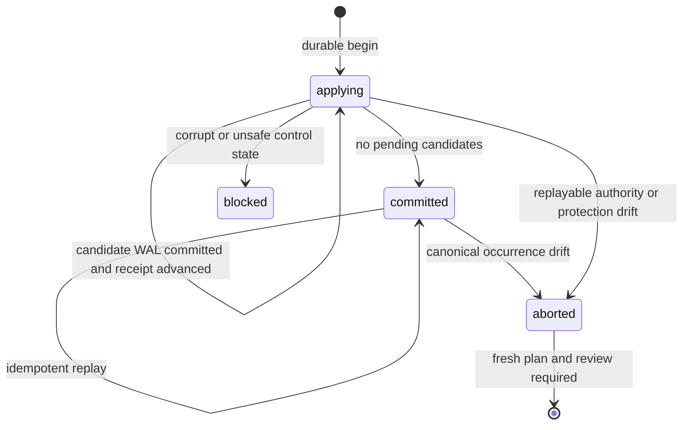

# Feature design: replayable Airflow cache-retention apply receipt

- Status: IMPLEMENTED
- Owner: dpone maintainers
- Target release: 0.73.32
- Last reviewed: 2026-08-04
- Approval source: user-approved canonical Airflow cache completion goal and
independent architecture-audit remediation

## Implementation evidence

- `tests/test_airflow_cache_retention_occurrence_hardening.py` certifies
  occurrence identity, rematerialization, fresh-review behavior, cumulative
  recovery acknowledgement, and v1 migration.
- `tests/test_airflow_cache_retention_receipt_hardening.py` certifies receipt
  closure, recovery ordering, authority drift, and fail-before-mutation review
  validation.
- `tests/test_deployment_cache_retention_state.py` and
  `tests/test_deployment_cache_retention_recovery_ack.py` certify the closed
  recovery v2 and acknowledgement v1/v2 contracts.
- `.github/workflows/airflow-pack-compat.yml` runs the retention contract suite
  against the exact installed candidate wheel on Python 3.11 and 3.12.

## Problem and outcome

Deployment-cache retention is destructive. The transaction WAL proves whether
one cache generation was deleted, but the public apply report used to be built
only after the deletion loop finished. A process death after the WAL reached
`committed` and before the report was returned made a retry look like a new
no-op operation. The deletion itself was safe, but its externally replayable
evidence was lost.

The control plane therefore needs one stable operation identity and one durable
receipt that is committed before public success is returned:

```text
reviewed retention plan
  -> stable operation_id
  -> applying receipt
  -> per-candidate WAL commit
  -> per-candidate receipt progress
  -> committed receipt
  -> public v3 report
```

Success means that a retry of the same reviewed destructive plan returns the
same committed outcome, including deleted deployment IDs, instead of
manufacturing a different result.

## Personas and journey

| Persona | Need | Product behavior |
| --- | --- | --- |
| Airflow operator | Retry safely after pod/process death | The same plan resumes or replays one durable operation |
| Release engineer | Prove what was deleted | v3 evidence carries operation and receipt revisions |
| Incident responder | Detect tampered local control state | Invalid receipt bytes, fields, permissions, ownership or inventory block retention |

The operator reviews a plan, creates one canonical UUIDv4 `review_id`, invokes
apply with both values, and receives a v3 report. If execution is interrupted,
the operator repeats the same command with the same plan digest and review id.
dpone validates current authority and either resumes pending candidates or
returns the already committed receipt. A durably aborted attempt requires a new
plan review and a new review id.

## Public contracts

The historical `dpone.deployment-cache-retention-apply.v1` and v2 JSON shapes
remain unchanged. Destructive v3 results additionally require:

```json
{
  "review_id": "<approved-attempt-uuidv4>",
  "operation_id": "sha256:<environment-plan-and-review-identity>",
  "receipt_revision": "sha256:<closed-receipt-body>",
  "transaction_status": "committed"
}
```

A v3 no-op remains schema-valid without receipt fields because no destructive
authority was exercised. Historical committed v1 receipts remain readable
through v1/v2 projections but cannot manufacture destructive v3 success.

The local durable receipt is a closed internal control contract:

```text
dpone.deployment-cache-retention-apply-receipt.v2
```

It contains the operation identity, reviewed plan digest, current deployment,
activation-history revision, promoter, bounded item outcomes and receipt
revision. Secrets and connection data are not accepted.

The filesystem recovery WAL is the closed public control contract
`dpone.deployment-cache-retention-recovery.v2`. Every transaction is keyed by
an immutable `transaction_id` occurrence digest and carries the exact
`operation_id` or `null` only for a migrated v1 record. A null operation id is
forensic state and cannot authorize receipt progress.

## Identity and state machine

`operation_id` is a canonical SHA-256 digest of:

```json
{
  "schema": "dpone.deployment-cache-retention-operation.v2",
  "environment": "<environment>",
  "reviewed_plan_sha256": "sha256:<plan>",
  "review_id": "<approved-attempt-uuidv4>"
}
```

The plan digest binds the complete candidate set, protection set, current
deployment and recovery revision. The review id distinguishes a fresh approved
attempt from a durably aborted attempt over the same plan. The promoter is
evidence, not part of operation identity, so an authorized replacement process
can replay the same approved attempt.



`blocked` is not persisted as a receipt status. It is reserved for corrupt,
unsafe, oversized, or ambiguous control state that cannot be normalized. A
valid receipt whose reviewed authority or protection set drifted is durably
closed as `aborted`; this preserves forensic item outcomes without permanently
blocking a newly reviewed operation.

## Detailed algorithm and ordering

1. Acquire reconcile and promotion locks.
2. Recover incomplete filesystem transactions. Migrate v1 WAL records as
   operation-unbound forensic evidence; never infer receipt ownership from a
   deployment id.
3. Validate the approved UUIDv4 `review_id`, then derive `operation_id` from
   environment, the exact reviewed plan digest, and that review id.
4. If a receipt exists:
   - validate its closed fields, revision, owner-only directory and bounded
     bytes;
   - validate the exact receipt/WAL/canonical occurrence before any replay
     decision; abort a committed receipt when its deleted occurrence was
     rematerialized or relocated;
   - return it when committed only after that occurrence validation passes;
   - otherwise revalidate current loader ACK, desired-state checkpoint and
     activation history before resuming.
5. For a new operation, rebuild the plan and require exact digest equality.
6. Validate every deletion candidate before deleting any candidate.
7. Derive the deterministic prospective activation-history revision without a
   write, durably create the `applying` receipt containing that revision, then
   persist exactly that revision. A crash between receipt and history writes is
   resumed from the receipt; no deployment, activation snapshot, or trash path
   changes before both records agree.
8. For each pending candidate:
   - if a WAL occurrence committed for this exact `operation_id` and its
     original path is absent, mark it deleted in the receipt;
   - if the path exists again, abort the old receipt and require a fresh review;
   - otherwise execute the inode-bound snapshot/detach/delete transaction;
   - only after WAL commit, atomically advance the receipt item to `deleted`.
9. When no pending item remains, atomically commit receipt status.
10. Build public evidence from the committed receipt.

All receipt replacements are temporary-file write, file fsync, atomic replace
and parent-directory fsync through the existing deployment-cache file adapter.

## Failure, retry and recovery semantics

| Failure point | Durable state | Retry behavior |
| --- | --- | --- |
| Before receipt begin | No mutation | Rebuild and revalidate plan |
| After receipt begin, before history persistence | `applying`, pending; history unchanged | Persist only the receipt-bound revision, revalidate authority and resume |
| After matching history persistence, before delete | `applying`, pending | Revalidate authority and resume |
| After WAL commit, before receipt progress | Operation-bound WAL committed, receipt pending | Reconcile WAL into the exact receipt; never delete twice |
| After receipt progress | `applying`, deleted item | Continue remaining pending items |
| After receipt commit, before report | `committed` receipt | Return the same receipt |
| Receipt corrupt, oversized or unsafe | Unknown local control state | Fail closed; no new deletion |
| Current/ACK/checkpoint/history/protection or occurrence drift | Receipt durably `aborted` | Preserve confirmed outcomes; require a new reviewed plan and review id |
| Legacy unbound WAL beside an incomplete receipt | Receipt durably `aborted` | Preserve WAL as forensic state; fresh review required |

Receipts are bounded to 8 MiB, 10,000 items and 10,000 operation files. The
dedicated root must be a non-symlink `0700` directory owned by the current UID;
every inventory entry must be a canonical regular receipt file. Capacity
exhaustion is an explicit blocker. Automatic receipt pruning is outside v1
because deleting audit evidence needs its own reviewed retention policy.

## Architecture and dependency direction

| Component | Responsibility |
| --- | --- |
| `dpone.contracts.deployment_cache_retention_receipt` | Closed identity and receipt codec |
| `DeploymentCacheRetentionReceiptStore` | Bounded durable local filesystem adapter composed at the app boundary |
| `DeploymentCacheRetentionReceipts` | Maps persistence outcomes to stable runtime reports/errors |
| `DeploymentCacheRetentionApplier` | Ordering, authority validation and replay state machine |
| `DeploymentCacheRetentionOccurrenceGuard` | Exact receipt/WAL/current-root occurrence comparison |
| Retention transaction coordinator | Inode-bound filesystem WAL and recovery |
| Readiness/CLI layer | v1/v2 compatibility projections and strict v3 projection |

The contracts import no Airflow, Kubernetes, cloud SDK or connector. The store
is injected into the receipt coordinator at the application composition root.
Candidate validation, transaction WAL, receipt persistence and public report
projection remain separate responsibilities.

## Compatibility and migration

- v1 schema and field set are unchanged.
- v2 remains shape-compatible with its pre-receipt contract: destructive
  reports require only the reviewed plan and activation-history revisions.
- v3 destructive reports require `review_id` and the committed receipt fields. Selecting v1 or
  v2 changes only the public projection; it never relaxes the destructive
  transaction, ACK, desired-state or receipt checks.
- Existing caches without the receipt directory continue to work; the directory
  is created only for a destructive apply.
- Recovery WAL v1 remains readable and is deterministically projected to
  occurrence-keyed v2 with `operation_id: null`. It cannot advance an
  incomplete receipt. New WAL writes are v2 and operation-bound. Recovery ACK
  v2 is cumulative by `transaction_id`, so unrelated WAL writes cannot reopen
  an acknowledged restoration.
- Apply receipt v1 is forensic compatibility state. An applying v1 receipt can
  reconcile only exact already-committed WAL occurrences and is then aborted;
  pending work requires a fresh reviewed v2 receipt. A committed v1 receipt
  cannot satisfy v3 evidence.
- A previously completed pre-receipt operation has no replay receipt and is
  reported according to the newly planned current state. No historical outcome
  is fabricated.
- A binary downgrade cannot consume v2 WAL safely. Stop cache mutation, archive
  the complete control-state set, and restore a snapshot written by the target
  older runtime before downgrade. Hand-editing v2 state is unsupported.

## Test and certification plan

- Contract: deterministic operation identity, closed fields and revision drift.
- Kill point: death after filesystem WAL commit and before receipt progress.
- Kill point: death after receipt begin and before activation-history write.
- Kill point: death after receipt commit and before public report.
- Relocation/rematerialization: applying and committed receipts abort when
  receipt, WAL and current canonical paths no longer identify one occurrence.
- Security: corrupt/oversized receipt, unknown inventory, symlink, ownership and
  world-writable directory blockers.
- Compatibility: exact historical v1/v2 key sets and strict v3 schema.
- Bounds: receipt, journal, activation snapshot and external evidence limits.
- Matrix: installed package and Airflow 2.10/2.11/3.2/3.3 compatibility gates.

Live Kubernetes execution is not needed to prove local receipt ordering. The
overall Airflow rollout remains `UNVERIFIED` until exact-package dev evidence is
collected.

## Product comparison

| System | Relevance | Decision | Source checked 2026-08-03 |
| --- | --- | --- | --- |
| Apache Airflow | Relevant as process/task retry environment | Adopt idempotent task retry expectations; keep destructive state outside XCom | [Task retries](https://airflow.apache.org/docs/apache-airflow/stable/core-concepts/tasks.html) |
| Astronomer Cosmos | N/A | It parses dbt artifacts but does not define local Airflow cache-retention transactions | [Caching](https://astronomer.github.io/astronomer-cosmos/optimize_performance/caching.html) |
| dlt, Airbyte, Fivetran | N/A | No equivalent Airflow deployment-cache filesystem apply contract | N/A for this capability |
| Informatica, Pentaho, SSIS | N/A | No public equivalent local immutable receipt contract was used as evidence | N/A for this capability |
| Apache Beam, gusty | N/A | They do not own Airflow exact-cache retention | N/A for this capability |

Measurable target: across injected process deaths at every apply commit boundary,
the same reviewed plan produces one stable operation ID, zero repeated deletions
and one replayable committed outcome.

## Approval checklist

- [x] Public v1/v2 compatibility and the v3 migration are explicit.
- [x] Identity, ordering, replay and kill points are specified.
- [x] Permissions, byte/item/file bounds and fail-closed behavior are explicit.
- [x] Components and dependency direction are separated.
- [x] Tests and live-certification limits are stated.
- [x] Relevant systems are compared and irrelevant systems are marked `N/A`.
