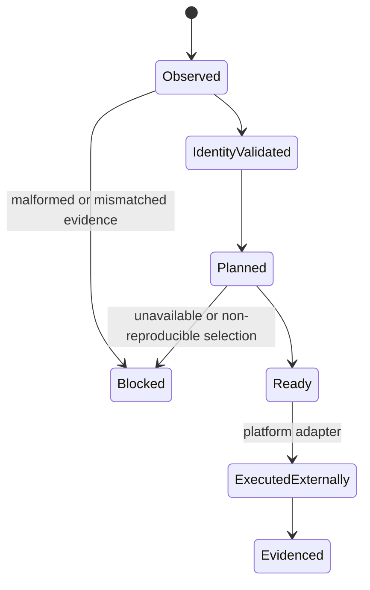
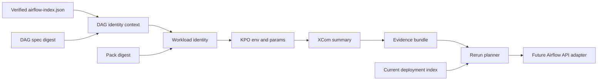

# Feature design: Airflow composite run identity and reproducible rerun v1

- Status: IMPLEMENTED
- Owner: dpone maintainers
- Approval: maintainer request to implement the frozen Industrial Self-Service
  Airflow plan as one goal
- Target release: 0.73.0
- Last verified: 2026-07-16
- Validation evidence:
  `test_artifacts/airflow-run-identity-rerun-v1/validation-report.md`

## Executive summary

dpone currently builds immutable releases and deployments, validates cached DAG
specs and workload packs, and diagnoses whether an Airflow DAG Bundle reference
is versioned. Those identities are not yet carried together through a real
Airflow task attempt. An operator can therefore see a successful task without
one machine-readable statement of which DAG spec, workload pack, deployment,
runtime image, environment bindings and Airflow delivery version produced it.

This slice introduces one bounded `dpone.airflow-run-identity.v1` contract. The
parse-safe provider derives it only from the verified deployment index and the
already-read DAG spec/pack, attaches it to the DAG and workload task, and passes
it to the runtime without secrets. XCom and the Airflow evidence bundle preserve
the same identity. A plan-first platform command then selects the original or
latest Airflow bundle independently from the original or latest dpone artifacts.

Success means a critical rerun can be proven reproducible before an Airflow API
call, while a beginner's five-command path remains unchanged.

## Personas and customer journey

| Persona | Goal | Current pain | Success signal |
| --- | --- | --- | --- |
| Data engineer | Diagnose one failed workload | Release, pack and Airflow run IDs live in separate outputs | One evidence identity explains the attempt |
| Data architect | Reproduce a historical result | DAG Bundle and pack version are easy to conflate | Two independent selectors are explicit |
| Airflow operator | Clear or rerun safely | Backend versioning and retained dpone artifacts may differ | Plan blocks unsafe combinations before execution |
| Platform engineer | Retain only required artifacts | Evidence does not enumerate the exact deployment/pack dependency | GC can mark evidence references |

Journey:

1. Normal authoring, check, preview, build and publish behavior is unchanged.
2. The deployment index lists one immutable release/deployment context and one
   Airflow bundle reference.
3. During parse, the provider verifies the DAG spec and packs, creates one DAG
   identity context and materializes workload-specific identities.
4. Each runtime KPO receives a canonical, bounded, non-secret identity value.
5. The XCom summary and evidence bundle record the exact attempt identity.
6. After failure, the operator runs `dpone airflow rerun-plan` with the evidence
   bundle and current deployment index.
7. The command defaults a critical rerun to original bundle plus original dpone
   artifacts, verifies availability/versioning, and emits a deterministic plan.
8. Platform automation may consume the plan to call Airflow. v1 does not hide a
   remote mutation behind the planning command.

## Scope

### In scope

- One additive, versioned composite identity for a workload task attempt.
- Release, deployment, DAG spec, workload pack, runtime image, binding-set,
  connection-registry and credential-runtime identities.
- Airflow bundle backend, declared reference, versioning capability and version.
- Parse-safe provider propagation into DAG metadata, task params and runtime env.
- XCom and evidence-bundle correlation with identity mismatch blockers.
- A deterministic `dpone.airflow-rerun-plan.v1` artifact.
- Independent `original|latest` selection for Airflow bundle and dpone artifacts.
- Fail-closed handling for non-versioned bundle backends and expired artifacts.
- Retention interoperability through explicit release/deployment evidence refs.

### Non-goals

- Calling the Airflow REST API or clearing task instances in v1.
- Treating an Airflow DAG Bundle as a dpone pack or mapping them one-to-one.
- Secret values, Vault paths, signed URLs or credential leases in identity.
- Reading Airflow metadata DB, Variables, Connections or DAG-run records at parse.
- Replacing Airflow's bundle selection precedence.
- Restoring an expired release automatically.
- A new beginner command or a required golden-path step.

### Assumptions and constraints

- The deployment index is the only provider parse input and all listed artifacts
  already passed checksum and size validation.
- One evidence bundle describes one Airflow task attempt and therefore one
  workload pack. A DAG-level object may contain several workload identities.
- A custom DAG using `DponeTaskGroup.from_pack` may have no dpone DAG spec;
  `dag_spec` is then null and the limitation is explicit.
- `airflow_bundle_ref` is deployment/delivery metadata, never release identity.
- A declared Git ref is a versioned bundle identity. Local, S3 and GCS bundle
  backends are non-versioned unless a separate content-addressed snapshot is
  explicitly provided.
- The command is plan-first and credential-free. Execution belongs to a later
  platform adapter consuming the immutable plan.

## Public contract

### Composite run identity

```yaml
schema: dpone.airflow-run-identity.v1
release_id: sha256:...
deployment_id: sha256:...
dag_spec:
  id: orders_daily
  sha256: sha256:...
workload_pack:
  id: load_orders
  sha256: sha256:...
runtime_image_digest: sha256:...
binding_set_ref: sha256:...
connection_registry_ref: sha256:...
credential_runtime_ref: sha256:...
airflow_bundle:
  backend: git
  ref: git:7ac31f2
  versioned: true
  version: 7ac31f2
  snapshot_ref: null
```

Canonical rules:

- SHA-256 values use the existing lowercase `sha256:<64 hex>` form.
- `dag_spec` may be null only for a hybrid custom DAG escape hatch.
- Environment references and runtime image may be null for non-runnable preview.
- `workload_pack` is required for a runtime task identity.
- Unknown or secret-like fields are rejected before runtime propagation.
- Serialized identity is canonical JSON with sorted keys and a 16 KiB hard cap.
- Identity is evidence, not a credential or authorization token.

### Deployment index

`AirflowDeploymentIndex` begins preserving the existing public
`airflow_bundle_ref` field. Older indexes without it remain valid and produce
`airflow_bundle: null`; a critical original-bundle rerun then fails closed.

### Provider behavior

No new top-level provider facade is introduced. Existing APIs retain their
signatures:

```python
load_dpone_dags(...) -> LoadReport
DponeDag.from_spec(...) -> airflow.sdk.DAG
DponeTaskGroup.from_pack(...) -> airflow.sdk.TaskGroup
```

For index-backed loading, a materialized DAG exposes bounded diagnostic
metadata through `_dpone_run_identity_context`. Every dpone runtime task exposes
its workload-specific identity through `params["dpone_run_identity"]` and
receives it through `DPONE_AIRFLOW_RUN_IDENTITY`.

These names are provider-owned. `operator_overrides` and pack `env_vars` cannot
replace them. The values contain no Jinja from authoring input and no remote
lookups.

### Runtime and XCom

`dpone gitops airflow xcom-from-evidence` reads
`DPONE_AIRFLOW_RUN_IDENTITY`, validates and redacts it, and writes the optional
`run_identity` object into `gitops.airflow_xcom_summary`.

- Missing identity remains compatible for legacy/non-index tasks.
- A present malformed/oversized identity makes the XCom summary failed with
  `DPONE_AIRFLOW_RUN_IDENTITY_INVALID`.
- The fallback XCom emitted when the builder itself fails never claims a valid
  identity.

### Evidence bundle

`gitops.airflow_evidence_bundle` adds optional `run_identity`. The collector
uses the XCom summary as the runtime observation and checks:

- evidence attempt DAG/task IDs are compatible with identity metadata;
- pod image digest equals `runtime_image_digest` when both are present;
- workload pack and DAG spec fingerprints are canonical;
- repeated identity observations across child artifacts are equal.

Mismatch is a blocker `DPONE_AIRFLOW_RUN_IDENTITY_MISMATCH`; missing identity is
a warning for advisory/PR policy and a blocker for release policy.

### CLI

```bash
dpone airflow rerun-plan \
  --evidence .dpone/evidence/orders-load-attempt.json \
  --current-index .dpone-cache/current/airflow-index.json \
  --bundle original \
  --artifacts original \
  --critical \
  --format json
```

Options:

| Option | Default | Meaning |
| --- | --- | --- |
| `--evidence` | required | Original `gitops.airflow_evidence_bundle` |
| `--current-index` | required | Current local deployment projection |
| `--bundle` | `original` | `original` or `latest` Airflow delivery |
| `--artifacts` | `original` | `original` or `latest` dpone release/deployment |
| `--critical` | false | Enforce reproducible, retained, fully identified inputs |
| `--cache-root` | inferred | Local-only availability check root |
| `--format` | `text` | `text` or `json` |
| `--output` | none | Optional create/replace plan file, written atomically |

The command performs no network calls and no mutation. It uses normal structured
exit codes: `0` plan is executable, `1` validation blocker, `2` CLI/config error,
`4` reproducibility/safety violation, `5` internal error.

### Rerun plan artifact

```yaml
schema: dpone.airflow-rerun-plan.v1
status: ready
critical: true
source_attempt:
  dag_id: orders_daily
  task_id: load_orders.dpone_runtime
  run_id: scheduled__2026-07-16T00:00:00Z
selection:
  bundle: original
  artifacts: original
resolved:
  release_id: sha256:...
  deployment_id: sha256:...
  airflow_bundle:
    backend: git
    ref: git:7ac31f2
    versioned: true
    version: 7ac31f2
airflow_request:
  run_on_latest_version: false
  execution_mode: clear_existing_run
retention_refs:
  release_ids: [sha256:...]
  deployment_ids: [sha256:...]
warnings: []
blockers: []
```

The plan fingerprint excludes volatile creation metadata. The command never
claims the Airflow API action occurred.

### Compatibility and migration

- Existing indexes, packs, DAG specs, XCom summaries and evidence bundles remain
  readable because new fields are additive and optional.
- New index-backed tasks emit identity automatically; users edit no manifests.
- Legacy `dpone_airflow_pack` exports continue under their existing window.
- Rollback stops injecting the optional identity and leaves older artifacts
  readable. Published releases/deployments are never edited.
- A new planner reading old evidence fails critical plans explicitly rather than
  inventing historical fingerprints.

## Detailed algorithm

### Provider identity construction

1. Load one deployment index and verify every listed artifact with existing
   local-only checksum and size checks.
2. Normalize `airflow_bundle_ref` into backend/ref/versioning metadata without
   importing Airflow or performing I/O.
3. For each DAG artifact, load the DAG spec and retain the index-provided DAG
   artifact ID and SHA-256.
4. Resolve every `cached://workloads/<id>` node against the same index. Preserve
   the resolution ID and SHA-256 alongside the local path.
5. Materialize the DAG and attach a pure DAG identity context containing release,
   deployment, DAG spec, environment references, image and bundle metadata.
6. Load each pack once, validate it, and combine its verified provenance with
   the DAG identity context into one workload identity.
7. Reject a pack ID/checksum mismatch before constructing KPO.
8. Serialize canonical JSON, enforce the 16 KiB limit, and inject it at highest
   precedence into KPO env and task params.
9. Attach only bounded identity metadata; never attach index paths, registry
   bodies, Vault paths or credentials.

### Runtime evidence propagation

1. Airflow renders and launches KPO with the static identity JSON.
2. The runtime resolves credentials independently at workload start; credential
   values do not modify static identity.
3. `dpone run` produces normal runtime evidence.
4. `xcom-from-evidence` parses the identity environment value through the shared
   pure validator and adds it to XCom.
5. The evidence collector reads child artifacts, extracts all identity
   observations and compares canonical fingerprints.
6. It records exactly one top-level identity only after comparisons pass.
7. Runtime/pod outcome is evaluated independently; matching identity does not
   turn failed execution into success.

### Rerun planning

```text
read and validate original evidence
read and validate current deployment index

original_artifacts = evidence.run_identity release/deployment/pack/dag spec
latest_artifacts = current index release/deployment and matching listed artifacts
original_bundle = evidence.run_identity.airflow_bundle
latest_bundle = classify(current index airflow_bundle_ref)

selected_artifacts = original_artifacts if artifacts=original else latest_artifacts
selected_bundle = original_bundle if bundle=original else latest_bundle

if selected identity is incomplete:
    block
if artifacts=original and release/deployment is unavailable in cache/retention:
    block with release/deployment not found or expired
if bundle=original and bundle is non-versioned and has no content snapshot:
    block DPONE_RERUN_NOT_REPRODUCIBLE
if critical and any selected input is not content-addressed/versioned:
    block safety violation

if bundle=original:
    run_on_latest_version = false
else:
    run_on_latest_version = true

if bundle=original and artifacts=original:
    execution_mode = clear_existing_run
else:
    execution_mode = create_pinned_rerun

emit deterministic plan and retention refs
do not call Airflow
```

`create_pinned_rerun` means the platform executor must create a new run carrying
the selected immutable dpone identity. v1 emits this requirement but does not
implement the remote executor. It never silently clears a run with a different
artifact pair.

### Selection matrix

| Bundle | Artifacts | Plan mode | Requirement |
| --- | --- | --- | --- |
| original | original | `clear_existing_run` | versioned/snapshotted bundle and retained deployment |
| latest | latest | `create_pinned_rerun` | current index complete |
| latest | original | `create_pinned_rerun` | retained original deployment plus latest bundle |
| original | latest | `create_pinned_rerun` | versioned original bundle plus current deployment |

### State machine



### Failure and recovery

- Missing current index: `DPONE_AIRFLOW_INDEX_NOT_FOUND`.
- Missing original release/deployment: `DPONE_RELEASE_NOT_FOUND` or
  `DPONE_DEPLOYMENT_NOT_FOUND`.
- Retention contract says removed: `DPONE_RELEASE_EXPIRED` or
  `DPONE_DEPLOYMENT_EXPIRED`.
- Incomplete deployment: `DPONE_DEPLOYMENT_INCOMPLETE`.
- Non-versioned original bundle without snapshot:
  `DPONE_RERUN_NOT_REPRODUCIBLE`.
- Identity mismatch: `DPONE_AIRFLOW_RUN_IDENTITY_MISMATCH`.
- Planner crash writes no output or replaces the output atomically only after a
  complete plan is serialized.
- Retrying the planning command with unchanged inputs yields the same semantic
  fingerprint.
- Cancellation has no external side effects because v1 performs no remote call.

### Edge cases

- Preview deployment: identity may contain null environment refs and cannot
  produce a ready critical runtime rerun.
- Empty workload DAG: DAG metadata exists, no workload attempt identity exists.
- Hybrid custom DAG: null DAG spec is allowed but blocks critical reproducibility
  unless a content-addressed custom DAG snapshot is supplied later.
- Two nodes reuse one pack: each task carries the same pack digest and distinct
  Airflow task context; identity remains bounded.
- Pack file changes after index validation: existing checksum validation fails
  before materialization.
- Secret-like key injected into identity: validator rejects the full identity.
- Non-versioned latest bundle is allowed only for non-critical latest execution
  and is reported as not reproducible.
- Airflow 2.x has no DAG Bundle versioning; original critical bundle selection
  requires a dpone content-addressed snapshot and otherwise blocks.

## Architecture

### Components and responsibilities

| Component | Existing/new | Responsibility | Dependencies |
| --- | --- | --- | --- |
| Provider run identity model | new | Pure validation, canonical serialization and env projection | stdlib only |
| Deployment index reader | existing, extended | Preserve bundle ref and listed artifact identities | local files only |
| DAG loader/materializer | existing, extended | Attach DAG context and resolved pack identity | provider internals |
| Pack task builder | existing, extended | Build workload identity and inject contract-owned metadata | provider internals |
| Runtime identity reader | new | Validate optional provider env in dpone runtime | contracts only |
| XCom builder | existing, extended | Preserve runtime-observed identity | gitops domain |
| Evidence collector | existing, extended | Correlate and block identity mismatches | gitops domain |
| Rerun planner | new | Pure independent selection and reproducibility policy | readiness/contracts |
| CLI adapter | new thin command | Parse args, local reads, render plan | planner service |

### Ports, adapters and dependency direction

The provider remains a standalone lightweight distribution and owns its pure
parse-side representation. The main dpone package owns the normative runtime,
evidence and rerun-plan schemas. Both implementations are validated against the
same generated JSON contract fixtures; neither imports vendor SDKs on base CLI
or provider import paths.

Filesystem access is injected into the planner service through existing project
ports. Airflow API execution is deliberately a future adapter behind a plan
consumer boundary. No service locator or import-time client is introduced.

### Data and control flow



### Alternatives and tradeoffs

| Alternative | Advantages | Disadvantages | Decision |
| --- | --- | --- | --- |
| Map release ID to DAG Bundle version | One identifier | Architecturally false and prevents independent selection | Reject |
| Read current again inside runtime | Simple operator args | Can execute a different pack than parsed | Reject |
| Put registry/binding bodies in identity | Self-contained | Leaks infrastructure and expands env | Reject |
| Store only one opaque fingerprint | Small | Operators cannot diagnose which component changed | Reject |
| Structured bounded identity plus semantic fingerprint | Explainable and deterministic | More schema work | Adopt |
| Execute Airflow API from `rerun-plan` | One command | Surprising mutation and credential coupling | Reject for v1 |

### ADR requirement

No new ADR. ADR-0013 already accepts composite evidence, independent Airflow
bundle semantics and evidence-aware retention. This feature implements that
decision without changing authority or dependency direction.

### Quality-budget impact

New pure identity and planner modules target less than 250 SLOC each. Provider
loader/materializer and existing evidence models receive delegation hooks only.
No module may exceed `docs/benchmarks/quality_budgets.yml`; schema/rendering code
is split by stable contract rather than appended to command modules.

## Market comparison

| System/version | Relevant capability | Observation and decision | Source/date |
| --- | --- | --- | --- |
| Apache Airflow 3.3 | DAG Bundle version and rerun selection | Adopt original/latest bundle semantics and `run_on_latest_version`; keep dpone artifact selection independent. Git is versioned, Local/S3/GCS are not | https://airflow.apache.org/docs/apache-airflow/stable/administration-and-deployment/dag-bundles.html, checked 2026-07-16 |
| Astronomer Cosmos current | Renders dbt projects to DAG/TaskGroup and supports multiple execution modes | Adopt clear DAG/TaskGroup escape hatches; Cosmos execution identity is dbt-specific and is not a substitute for dpone release/deployment evidence | https://astronomer.github.io/astronomer-cosmos/guides/run_dbt/index.html, checked 2026-07-16 |
| dlt | Pipeline Airflow helper | N/A: this slice specifies dpone artifact/DAG Bundle rerun identity, not pipeline task decomposition | checked 2026-07-16 |
| Informatica, Airbyte, Fivetran, Pentaho, SSIS | Managed ETL execution/versioning | N/A: no Airflow DAG Bundle adapter contract is being standardized here | checked 2026-07-16 |
| gusty | Airflow DAG authoring | N/A: authoring convenience does not define environment-neutral dpone artifacts | checked 2026-07-16 |
| Apache Beam | Runner-neutral data processing | N/A: Beam job update/replay is not Airflow DAG Bundle version selection | checked 2026-07-16 |

## Measurable differentiation

```yaml
axis: reproducible Airflow workload rerun preparation
scenario: failed critical MSSQL-to-ClickHouse workload after deployment promotion
baseline: manual comparison of Airflow bundle, image, DAG code and runtime config
metric: unresolved artifact identities and unsafe remote calls before validation
target: 0 unresolved required identities; 0 remote calls; deterministic plan in <=2s
procedure: generate evidence, promote a different current deployment, run all four selection combinations
artifact: test_artifacts/airflow-run-identity-rerun-v1/validation-report.md
limitations: v1 emits the plan but does not call the Airflow REST API
```

## Security, privacy and operations

- Identity allowlists fields and rejects secret-like keys recursively.
- Registry bodies, Vault paths, tokens, connection URIs, signed URLs and row data
  never enter the contract.
- Parse remains local-only and bounded by existing pack/index size budgets.
- Runtime env is static, canonical and capped at 16 KiB.
- Text rendering abbreviates digests but JSON preserves full values.
- Planner follows symlink/path containment rules and never resolves `current`
  after selecting a pinned deployment.
- Critical plans fail closed on unknown/non-versioned bundle backends.
- Logs use logical IDs/digests and never dump raw environment mappings.
- Evidence correlation emits stable metrics for missing/mismatched identity.

## Test and certification plan

| Layer | Scenario | Environment | Expected artifact |
| --- | --- | --- | --- |
| Unit | identity validation, canonical JSON, secret keys, size cap | normal pytest | focused report |
| Provider contract | index -> DAG -> KPO identity, checksum mismatch, hybrid DAG | provider fake Airflow | provider tests |
| Exact compatibility | task metadata/env on Airflow 2.10, 2.11, 3.2, 3.3 | isolated matrix | matrix logs |
| Runtime | optional/valid/invalid env -> XCom | normal pytest | XCom fixture |
| Evidence | identity match, image mismatch, conflicting children, release policy | normal pytest | evidence fixtures |
| Planner | all four selection pairs, non-versioned bundle, missing retention | normal pytest | rerun plans |
| Security | secret-like keys, traversal, symlink escape, oversized JSON | normal pytest | negative report |
| Performance | 100 DAG/500 workloads remains within parse budgets | benchmark CI | parse report |
| Live | clear original critical GitDagBundle run with retained deployment | approved Airflow/K8s | UNVERIFIED until environment exists |

## Documentation plan

- Add an operator-only reproducible rerun section to Airflow self-service docs.
- Extend provider reference with identity propagation and parse guarantees.
- Add CLI/reference and generated schema entries for both contracts.
- Extend compatibility docs with versioned/non-versioned bundle behavior.
- Add a runbook explaining original/latest combinations and retention failures.
- Do not add rerun planning to the beginner First DAG tutorial.

## Rollout and rollback

Identity emission is additive. Release/PR policy may initially warn on missing
legacy identity; critical rerun planning always blocks. After one release,
platform policy may require identity for all newly published deployments.

Rollback removes provider injection and the platform command while retaining
schema readers for emitted evidence. A mismatch, secret leak, parse I/O or
Airflow matrix regression is a rollback trigger. No published release or
deployment is mutated during rollout or rollback.

## Agent execution plan

One integrator owns shared provider loader/materializer, evidence schemas,
command registration, changelog and generated docs. Read-only architecture,
test and docs review run independently when agent capacity is available.
`.cursor/**` remains forbidden.

## Approval checklist

- [x] User problem and CJM are clear.
- [x] Algorithm and failure semantics are implementable without guessing.
- [x] Public contracts and compatibility are explicit.
- [x] Architecture and alternatives are justified.
- [x] Relevant market research uses current official sources.
- [x] Claimed differentiation is measurable.
- [x] Tests, evidence, docs, rollout and rollback are complete.
- [x] Path ownership and integration plan are conflict-safe.
- [x] Maintainer authorized implementation through the frozen roadmap request.
