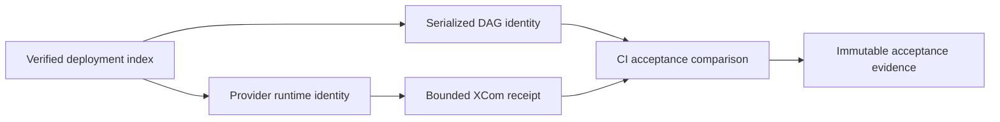

# Feature design: exact Airflow runtime activation evidence

- Status: IMPLEMENTED
- Owner: dpone maintainers
- Target release: 0.73.32
- Last verified: 2026-08-03
- Approval source: approved canonical Airflow pack recovery and deployment plan

## Executive summary

Serialized DAG tags prove which immutable deployment Airflow currently exposes,
but they do not prove which deployment executed a task when cache activation and
serialization overlap. dpone will carry the immutable activation occurrence into
the provider-owned runtime identity and the bounded XCom outcome. CI can then
compare runtime evidence with convergence evidence and reject a time-of-check to
time-of-use mismatch.

## Personas and customer journey

| Persona | Goal | Current pain | Success signal |
| --- | --- | --- | --- |
| Data engineer | Trust dev acceptance before promotion | A green run can be attributed only to current serialized tags | XCom contains the exact release, deployment and activation that executed |
| Platform engineer | Diagnose cache races | Parse-time and runtime identity are not joined | One blocker identifies the mismatched identity field |
| Release owner | Promote immutable evidence | Acceptance status is not bound to one activation | Promotion consumes matching convergence and runtime evidence |

The operator publishes an exact deployment, waits for convergence, triggers
acceptance, and receives a small runtime receipt. A mismatch fails acceptance;
the operator waits for cache convergence and reruns without mutating data based
on stale evidence.

## Scope

### In scope

- Keep `dpone.airflow-run-identity.v1` unchanged.
- Add `dpone.airflow-deployment-identity.v1` for release, deployment and
  activation occurrence.
- Preserve the separate identity through runtime environment parsing and XCom construction.
- Expose the same identity from terminal workflow outcome evidence.
- Expose it from exact-cache status and pack provenance.
- Version deployment-bound attempt/workflow envelopes as v2 while dual-reading
  their immutable v1 predecessors.
- Serialize cache status/provenance snapshots with the promotion lock.
- Add provider-owned runtime pod authority labels for bounded platform
  maintenance selectors.
- Keep all existing v1 run identities readable by strict historical readers.

### Non-goals

- The runtime does not trust or echo expected IDs from `dag_run.conf`.
- This change does not activate deployments or clean Kubernetes pods.
- XCom is bounded identity evidence, not a store for large runtime artifacts.

## Public contract

`dpone.airflow-run-identity.v1` does not change. Exact executions additionally
receive:

```json
{
  "schema": "dpone.airflow-deployment-identity.v1",
  "release_id": "sha256:<release>",
  "deployment_id": "sha256:<deployment>",
  "activation_id": "3f60628e-ef48-48b0-84c3-a9e27a82a7f2"
}
```

The activation must be a canonical UUID v4. Old run-identity payloads remain
unchanged. Terminal workflow outcomes include a
`deployment_identity` object with `release_id`, `deployment_id`, and
`activation_id`.

Exact provider evidence uses closed v2 envelopes:

```text
dpone.dbt-airflow-attempt-evidence.v2
dpone.dbt-workflow-evidence-outcome.v2
```

The v1 envelopes remain unchanged and readable as legacy evidence. They cannot
be promoted as exact activation proof because they do not contain
`deployment_identity`.

Strict `init_fetch` runtime pods also receive:

```yaml
dpone.dev/managed-by: airflow-provider
dpone.dev/runtime-contract: init-fetch-v2
```

Newly authored packs must not declare those keys. Existing v1 packs that already
contain them remain readable for compatibility, but the provider ignores their
values and overwrites both labels from its trusted runtime policy. Therefore a
pack can never override the effective cleanup authority. The existing
`dpone.dev/workload-id` label remains workload identity, not cleanup authority.

## Detailed algorithm

1. Validate the exact deployment index and atomically switched
   `current-pointer.json`; never infer activation occurrence from the index.
   Canonical desired-state reconciliation writes the signed promotion
   `source.occurrence_id` into every pod-local pointer for the rollout.
2. Build parse-time context from that trusted index.
3. Expose the validated occurrence in read-only cache status/provenance while
   holding one shared cache read lease across pointer, symlink, index and pack
   checksum reads. Promotion uses the exclusive lease.
4. Build a separate deployment-identity value from release, deployment and the
   exact activation occurrence.
5. Inject both bounded identities and provider-owned labels while composing the
   strict runtime pod.
6. Runtime evidence and XCom preserve the parsed identity without reading S3.
7. The outcome gate compares passed runtime XCom with its provider expectation,
   and provider attempt evidence binds the same identity in its envelope.
8. The workflow terminal task emits the same static parse-time identity and its
   validator binds embedded release/deployment fields.
9. Acceptance compares all three fields with convergence evidence.
10. Missing or mismatched runtime identity is a blocker; it never falls back to
   serialized tags as proof of execution.



Retries reuse the same immutable activation identity. A later activation has a
new UUID even if release and deployment digests are unchanged. Rollback is an
exact activation and is therefore distinguishable from the original occurrence.

## Architecture

| Component | Responsibility | Dependency direction |
| --- | --- | --- |
| `run_identity` contract | Validate immutable artifact identity without activation fields | Core contract, no Airflow import |
| `deployment_identity` contract | Validate one exact cache activation occurrence | Core contract, no Airflow import |
| Airflow pack run-identity builder | Derive identity from verified index | Adapter depends on contract semantics |
| XCom outcome builder | Preserve runtime identity | Existing runtime evidence path |
| Shared CI acceptance | Compare runtime and convergence evidence | External consumer of public evidence |

No connector or vendor SDK is imported. No network I/O is added to DAG parse or
task execution. The two contracts deliberately separate artifact and occurrence
identity as required by ADR 0020 and ADR 0039.

## Compatibility and failure semantics

- Existing v1 run identity: unchanged and valid for ordinary execution.
- Missing deployment identity: valid for legacy execution, but insufficient
  for exact deployment acceptance.
- Invalid UUID or unknown fields: fail closed before source I/O.
- Invalid exact-cache UUID: cache status is blocked.
- Missing or inconsistent v2 `current-pointer.json`: cache status is blocked;
  an activation field copied into the index is ignored.
- Legacy pack declares provider authority labels: keep the pack readable, ignore
  both values and overwrite them from trusted provider policy before task
  construction; new producers must omit the keys.
- Missing runtime XCom identity: acceptance blocker.
- Identity mismatch: acceptance blocker even when the DAG run is green.
- A remote revision read failure after snapshot materialization reports
  `state_may_have_changed=true`; operators must reconcile rather than assume no
  durable state was written.
- Passed outcome, attempt evidence, and terminal workflow evidence validate the
  same exact identity rather than accepting independently plausible values.
- Runtime evidence never accepts expected IDs supplied by the trigger request as
  authoritative.

## Market comparison

| System | Relevance | Adopted or rejected pattern | Source/date |
| --- | --- | --- | --- |
| Apache Airflow 3.3 | Relevant | Use serialized DAG metadata for scheduler state and small XCom for per-run task evidence | Official DAG serialization and XCom docs, 2026-08-01 |
| Astronomer Cosmos | Relevant at parse plane | Adopt compiled-artifact parsing; reject remote reads during task proof | Official Cosmos parsing/caching docs, 2026-08-01 |
| dlt, Airbyte, Fivetran | N/A | They do not define Airflow serialized-DAG activation identity | 2026-08-01 |
| Informatica, Pentaho, SSIS | N/A | They do not expose this Airflow runtime contract | 2026-08-01 |
| gusty, Apache Beam | N/A | They do not provide an equivalent exact cache-activation receipt | 2026-08-01 |

References:

- [Airflow DAG serialization](https://airflow.apache.org/docs/apache-airflow/stable/administration-and-deployment/dag-serialization.html)
- [Airflow XCom](https://airflow.apache.org/docs/apache-airflow/stable/core-concepts/xcoms.html)
- [Cosmos parsing modes](https://astronomer.github.io/astronomer-cosmos/configuration/parsing-methods.html)

## Measurable differentiation

```yaml
axis: false-green deployment attribution
scenario: cache activation changes between serialized-DAG preflight and runtime
baseline: green task plus current serialized tags
metric: mismatched activation runs accepted
target: 0
procedure: inject a TOCTOU identity mismatch in contract tests and dev acceptance
artifact: acceptance.json with the exact runtime identity blocker
limitations: requires dpone-generated bounded XCom evidence
```

## Test and rollout plan

- Unit: historical run identity remains byte-compatible; deployment identity
  round-trips; malformed activation fails.
- Provider: exact activation enters environment and task params.
- XCom: runtime evidence preserves activation and remains bounded/redacted.
- Workflow: outcome emits exact deployment identity.
- Compatibility: Airflow 2.10 and 3.x serialization suites.
- Live dev: compare runtime XCom with convergence evidence for smoke and one
  MSSQL-to-ClickHouse workload.
- Prod: promote only the exact dev-certified package and deployment.

Rollback pins the previous provider package. Old executions remain valid but are
reported as unverified by deployment-bound acceptance.

## Documentation plan

Update Airflow provider identity reference, canonical deployment runbook,
compatibility notes, generated schema references, changelog, and CI consumer
documentation. The first-user explanation distinguishes serialized identity
from runtime execution identity.

## Approval checklist

- [x] User problem and journey are explicit.
- [x] Runtime identity is derived from trusted parse-time evidence.
- [x] Backward compatibility is explicit.
- [x] ADR 0039 preserves strict v1 compatibility and identity boundaries.
- [x] Failure and rollback semantics are fail-closed.
- [x] Relevant official sources and N/A comparisons are recorded.
- [x] Tests, evidence and rollout are defined.
