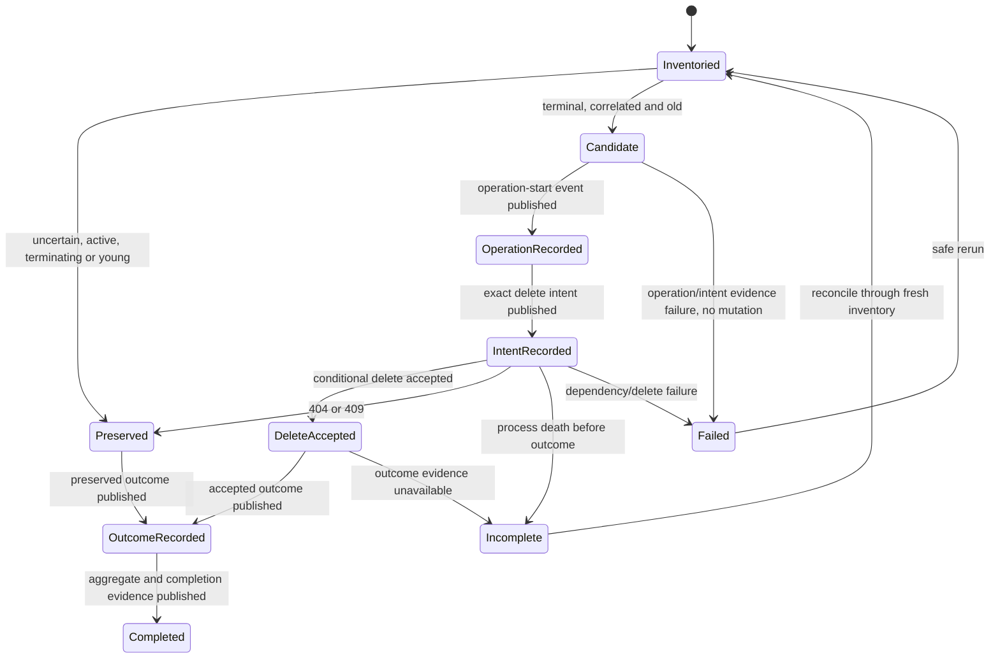

# Feature design: executable Airflow runtime pod retention control

- Status: IMPLEMENTED
- Owner: dpone maintainers
- Issue: PR #491 release-audit remediation
- Target release: 0.73.32
- Last verified: 2026-08-04

## Executive summary

`delete_succeeded_pod` is a best-effort first line of cleanup. Failed,
interrupted, terminating or provider-cleanup-error Pods may remain indefinitely
and grow Kubernetes API/etcd state. dpone currently documents a janitor
contract but does not ship an executable, schema-versioned implementation.

This feature adds a namespace-scoped metadata-only plan/apply service and a
deterministic CronJob/RBAC renderer. It selects only dpone-owned terminal
`init-fetch-v2` Pods, preserves uncertain objects, deletes with UID and
resourceVersion preconditions, bounds every cycle, and emits ordered evidence.
Infrastructure still owns deployment, schedule, credentials, log retention and
alerts; dpone owns the executable safety policy and manifests.

## Personas and customer journey

| Persona | Goal | Current pain | Success signal |
|---|---|---|---|
| Airflow platform engineer | Bound retained runtime Pods | Runbook requires a custom script | One reviewed plan/apply CLI and rendered CronJob |
| SRE | Protect API server and etcd | Unknown selectors and unbounded delete scripts | Namespace, selectors and batch are closed contracts |
| Incident responder | Keep forensic evidence long enough | Deletion can race or hide failures | TTL, correlation checks, conditional delete and reports |

The engineer renders a plan-mode manifest, deploys it in one namespace, reviews
at least two dry-run reports, validates durable runtime logs/evidence, then
renders apply mode with explicit actor/allowlist/confirmation. Alerts consume
CronJob failure and stale-success metrics. Rollback suspends the CronJob without
changing data-task state.

## Scope

### In scope

- `runtime-pod-retention-plan`, `-apply`, and offline `-render` commands.
- Exact metadata-only inventory for `Succeeded` and `Failed` Pods.
- Pure classification, bounded conditional deletion and JSON evidence.
- ServiceAccount, Role, RoleBinding, CronJob and optional PrometheusRule render.
- Airflow 2.10/3.x compatible runtime labels; no Airflow metadata DB access.

### Non-goals

- Using Pod presence as evidence of ETL success.
- Reading Pod logs, spec, status bodies, Secrets or all namespaces.
- Deleting Pending, Running, Unknown, terminating or malformed Pods.
- Exact terminal-transition TTL in v1.
- A CRD/controller, `deletecollection`, or generic garbage-collector framework.

### Assumptions and constraints

- KPO injects non-empty `dag_id`, `task_id` and `run_id` labels; missing
  correlation causes preservation.
- `PartialObjectMetadata` exposes creation/deletion timestamps but not terminal
  conditions. v1 reports `age_basis=creation_timestamp_fallback` and
  `terminal_age_exact=false`.
- Kubernetes supports metadata-only media types and Pod `status.phase` field
  selectors; live support remains `UNVERIFIED` until cluster certification.

## Public contract

### CLI

```bash
dpone airflow runtime-pod-retention-plan \
  --namespace airflow \
  --minimum-age-seconds 86400 \
  --page-size 500 \
  --kube-auth in-cluster \
  --format json

dpone airflow runtime-pod-retention-apply \
  --namespace airflow \
  --minimum-age-seconds 86400 \
  --max-delete-count 100 \
  --actor serviceaccount://airflow/dpone-runtime-pod-retention \
  --allowed-actor serviceaccount://airflow/dpone-runtime-pod-retention \
  --confirm-delete \
  --kube-auth in-cluster \
  --format json

dpone airflow runtime-pod-retention-render \
  --namespace airflow \
  --image ghcr.io/example/dpone@sha256:<digest> \
  --schedule '17 * * * *' \
  --mode plan \
  --format yaml
```

- Plan is read-only. Apply re-inventories immediately; it never consumes stale
  plan files.
- Plan exit: `0` clean/cleanup candidates, `1` preserved attention items,
  `2` invalid input, `3` dependency unavailable, `4` safety/access failure,
  `5` unexpected internal failure.
- Apply exit: `0` means every selected conditional delete request was accepted,
  not that Kubernetes has already observed every Pod absent; `1` is bounded
  partial/retry, `2` invalid input, `3` dependency/delete failure, `4`
  authorization/access failure, and `5` unexpected internal failure.
- Render is offline and defaults to `plan`. Apply render requires actor,
  matching allowlist and explicit confirmation.
- Apply rejects ambient credential discovery: use explicit `in-cluster`, or
  `kubeconfig` with an exact reviewed context recorded in evidence.

### Python API

- `AirflowRuntimePodRetentionService.plan(request)`.
- `AirflowRuntimePodRetentionService.apply(request)`.
- Inventory and deletion are injected capability ports.
- The Kubernetes SDK is lazy and confined to the adapter/composition root.

### Manifest/schema

No workload manifest change. Rendered Kubernetes resources are deployment
artifacts, not pipeline authoring input.

### Artifacts and evidence

- `dpone.airflow-runtime-pod-retention-plan.v1`.
- `dpone.airflow-runtime-pod-retention-apply.v1`.
- `dpone.airflow-runtime-pod-retention-event.v1`.
- `dpone.airflow-runtime-pod-retention-render.v1`.
- Apply reports expose `evidence_durability` as `process_ordered` or
  `durable_acknowledged`; the default JSONL CLI publisher never claims durable
  sink acknowledgement.
- Every item includes namespace-local Pod identity, phase, action/reason,
  creation-age basis and safe correlation labels; reports never include Pod
  bodies, logs, environment variables or credentials.

### Compatibility and migration

`delete_succeeded_pod` remains unchanged. Existing Secret GC public imports,
commands and schemas remain compatible. `KubernetesMetadataSnapshot` moves to a
neutral port and is re-exported from its old module. Rollback suspends/removes
the janitor CronJob; no data or Airflow state migration is required.

## Detailed algorithm

### Inventory and plan

1. Validate namespace/TTL/page bounds before constructing a client.
2. Query `PartialObjectMetadataList` twice with the exact fixed labels and field
   selectors `status.phase=Succeeded` and `status.phase=Failed`.
3. Preserve selector and continuation token through bounded pagination. Retry
   one phase from the beginning after HTTP 410; fail closed on 406 or repeats.
4. Attach phase from trusted query context; reject one UID appearing in both
   phase inventories as ambiguous.
5. Preserve terminating, future/missing timestamp, missing identity or missing
   correlation-label objects.
6. Compute age from creation timestamp. Preserve younger objects. Candidate
   ordering is deterministic: oldest first, then name, UID.
7. Emit counts, warnings, every decision and delete candidates.

### Apply

1. Validate confirmation, actor and exact allowlist before client construction.
2. Run a fresh plan; select at most `max_delete_count` candidates.
3. Persist a bounded operation-start event through the injected evidence port.
4. Before each Kubernetes mutation, persist the exact Pod/precondition delete
   intent. If intent publication fails, stop before deleting that Pod.
5. Delete each selected Pod individually with observed UID/resourceVersion.
6. Persist the safe outcome immediately after the API call. Missing terminal
   outcome after a durably acknowledged intent is an explicit recovery fact,
   never success. The default CLI stderr publisher proves ordering but not
   crash durability.
7. Treat 404 as `already_absent`, 409 as `changed_since_plan` and preserve.
8. On another delete or evidence failure, report it and stop subsequent attempts.
9. Emit `ok`, `partial` or `failed`; rerun is idempotent through fresh inventory
   and delete preconditions.

### Render

1. Require an immutable `@sha256:` image and Kubernetes DNS labels.
2. Build ServiceAccount, namespace Role/RoleBinding and CronJob with
   `concurrencyPolicy: Forbid`, argv command, no shell, no token mount outside
   the janitor Pod and bounded resources/history.
3. Plan mode grants only `list` on Pods. Apply mode adds only `delete`.
4. Default command is plan. Apply embeds only reviewed non-secret policy.
5. Optionally render PrometheusRule for failed jobs and stale last-success.
6. Canonicalize and digest the object list; JSON render evidence binds policy
   and manifest digest.

### State machine



### Edge cases

- Empty inventory is a green no-op.
- Duplicated UID across phase queries blocks that object.
- Long-running newly-terminal Pods may appear old because v1 uses creation
  time; this limitation is explicit in every report and requires dry-run review.
- Pagination token repetition, too many pages, full-object responses, missing
  metadata, special phases and future timestamps fail closed or preserve.
- Cancellation before delete mutates nothing. After operation start, every
  attempted delete has an intent published before mutation. Crash durability
  additionally requires a certified acknowledged publisher. Controlled
  interruption emits a failed outcome and partial aggregate; abrupt process
  death leaves an incomplete intent that the next inventory can reconcile.

## Architecture

| Component | Responsibility | Dependencies |
|---|---|---|
| neutral Kubernetes metadata port/adapter | DTO, metadata-only paging/parsing/auth | lazy Kubernetes SDK |
| runtime Pod retention ports | terminal inventory and conditional delete | neutral DTO |
| ownership contract | injected provider label keys/values | neutral models |
| policy module | pure deterministic classification | models + ownership contract |
| application service | plan/apply ordering and failure mapping | ports + policy |
| event evidence port | operation/intent/outcome durability boundary | injected publisher |
| Kubernetes Pod adapter | injected exact selector and precondition delete | metadata adapter |
| manifest renderer | deterministic least-privilege resources | pure mappings |
| readiness/CLI | composition, UX and exit codes | service/renderer |

We extract only transport mechanics from Secret GC. Secret and Pod lifecycle
policies remain separate because ownership, correlation and failure semantics
differ. Provider/KPO modules remain free of Kubernetes SDK imports and cleanup
policy. No module may exceed the repository 400-SLOC hard limit.

## Market comparison

| System/version | Relevant capability | Adopt/reject | Source/date |
|---|---|---|---|
| Kubernetes current docs | Pod phase field selectors, metadata-only responses, UID/resourceVersion delete preconditions | Adopt exact server-side filtering and conditional delete | [field selectors](https://kubernetes.io/docs/concepts/overview/working-with-objects/field-selectors/), [API concepts](https://kubernetes.io/docs/reference/using-api/api-concepts/#metadata-only-fetches), [preconditions](https://kubernetes.io/docs/reference/kubernetes-api/definitions/preconditions-v1-meta/), checked 2026-08-03 |
| Airflow Kubernetes provider | `delete_succeeded_pod` normal-completion cleanup | Keep as first line; add bounded stale cleanup | [KPO](https://airflow.apache.org/docs/apache-airflow-providers-cncf-kubernetes/stable/operators.html), checked 2026-08-03 |
| dlt, Informatica, Airbyte, Fivetran, Pentaho, SSIS, gusty, Cosmos, Beam | N/A | They do not own KPO Pod retention semantics; no parity claim | checked 2026-08-03 |

## Measurable differentiation

```yaml
axis: wrong-object deletion safety and API-state boundedness
scenario: retained terminal dpone runtime Pods mixed with active/unowned Pods
baseline: runbook-only or name-prefix cleanup script
metric: false deletes; max deletes/cycle; evidence completeness
target: 0 false deletes in fault matrix; <= configured bound; 100 percent item decisions
procedure: fake API plus approved-cluster dry-run/controlled-delete certification
artifact: plan/apply/render reports and live certification evidence
limitations: creation-time fallback is not exact completion TTL
```

## Security, privacy, and operations

The ServiceAccount is namespace scoped. Inventory requests metadata only. No
Secrets, ConfigMaps, Jobs, logs, Pod specs/status bodies or cluster-wide verbs
are permitted. Apply authorization precedes client creation. Report fields are
bounded and topology-minimal. CronJob starts in plan mode. Production apply
requires the structured JSONL event publisher plus a certified acknowledged durable
log/runtime evidence retention and alert certification. The publisher flushes
each operation, intent and outcome event; the infrastructure log sink provides
retention and immutability.

## Test and certification plan

| Layer | Scenario | Environment | Expected artifact |
|---|---|---|---|
| Unit | policy matrix, timestamps, ambiguity, batch/failure semantics | fakes | plan/apply reports |
| Adapter contract | paging, field/label selectors, 406/410, metadata-only, preconditions | fake transport | call/deletion evidence |
| Render | RBAC, image digest, argv, plan/apply guard, deterministic digest | local | render report/YAML |
| Compatibility | Secret GC and provider labels | local | regression tests |
| Live | two dry-runs, one controlled stale Pod, unlabelled control, denied delete | approved dev K8s | live evidence bundle |

Skipped live checks remain `UNVERIFIED`, never passed.

## Documentation plan

Replace the external-prerequisite warning with executable CLI/render guidance,
retain infrastructure ownership and durable-log prerequisites, add alert,
rollback and exact-age limitation sections, and update ADR 0024, compatibility,
provider docs, CLI reference, schema catalog and changelog.

## Rollout and rollback

1. Ship CLI/schemas/render with CronJob suspended or plan mode.
2. Observe two dry-run cycles and validate alerts/log retention.
3. Execute one controlled candidate; compare UID evidence.
4. Enable bounded apply. Rollback suspends CronJob immediately.
5. Production promotion uses the exact dev-certified image digest/manifests.

## Agent execution plan

One integrator owns all shared registry, schemas, docs and generated outputs.
Independent release, architecture and docs reviewers rerun after the candidate
SHA is frozen.

## Approval checklist

- [x] User problem and CJM are clear.
- [x] Algorithm and failure semantics are implementable without guessing.
- [x] Public contracts and compatibility are explicit.
- [x] Architecture and alternatives are justified.
- [x] Relevant market research uses current official sources.
- [x] Claimed differentiation is measurable.
- [x] Tests, evidence, docs, rollout, and rollback are complete.
- [x] Path ownership and integration plan are conflict-safe.
- [x] Maintainer changed status to `APPROVED`.
