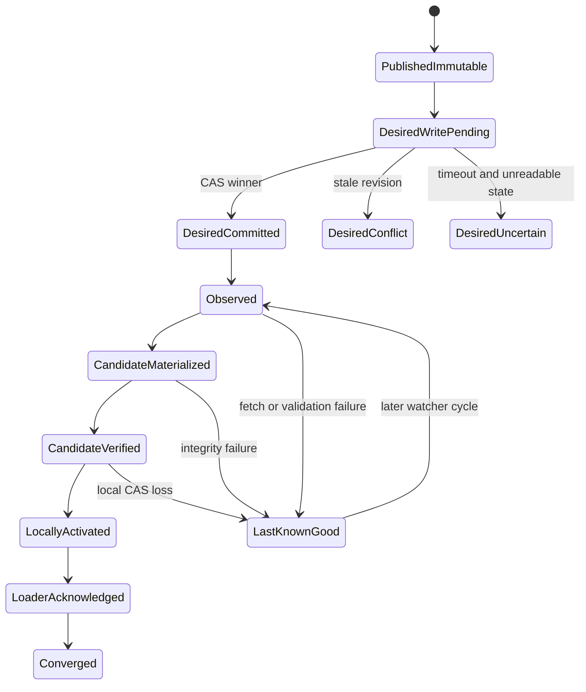
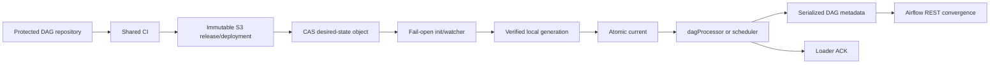

# Feature design: Airflow S3 desired-state pull control plane

- Status: APPROVED
- Owner: dpone maintainers
- Issue: Canonical Airflow Pack Recovery And Deployment
- Target release: 0.73.24
- Approval authority: maintainer-approved pull activation direction, 2026-07-28
Last verified: 2026-07-28

Retry-boundary hardening through the canonical cross-job preparation artifact
targets `0.73.25` and remains within this approved control-plane contract.

## Executive summary

Airflow must recover generated dpone DAGs after a pod restart and receive new
immutable deployments without a GitLab pipeline mutating Airflow
infrastructure on every release. The current deployment uses pod-local
`emptyDir` cache and two competing synchronization paths. A restart can remove
one cache while the DAG loader silently observes no generated DAGs.

This feature introduces a connector-neutral desired-state control plane:

```text
DAG repository protected branch
  -> build and exact immutable publication
  -> compare-and-swap desired-state object
  -> fail-open Airflow init/watcher
  -> verified local materialization
  -> atomic current activation
  -> network-free DAG parse
  -> loader acknowledgement and Airflow REST convergence
```

Infrastructure installs one generic watcher. It does not participate in each
release. The watcher is analogous to `git-sync`, but it synchronizes exact,
precompiled, content-addressed dpone deployments from object storage rather
than Git source code.

The measurable outcome is:

- an Airflow cache restart restores the exact desired deployment without a
  repository-specific infrastructure pipeline;
- DAG parsing performs no object-storage or credential I/O;
- a corrupt, partial, stale, or concurrently replaced desired state never
  becomes `current`;
- an object-storage outage preserves the last known good deployment;
- activation and rollback are bound to immutable IDs, checksums, a unique
  activation occurrence, loader acknowledgement, and REST convergence.

This belongs in dpone because desired-state identity, publication evidence,
cache materialization, loader acknowledgement, and Airflow deployment
convergence are framework contracts shared by every dpone Airflow consumer.

## Personas and customer journey

| Persona | Goal | Current pain | Success signal |
|---|---|---|---|
| Data engineer | Merge a dpone workload and see its DAG | Deployment depends on hidden cache state | MR merge produces one traceable deployment |
| Airflow operator | Survive restarts and S3 incidents | Empty cache can hide generated DAGs | Last known good remains active or a visible diagnostic explains an empty cache |
| Platform engineer | Operate dev and production consistently | Per-release infra pipelines and tokens couple repositories | Infra installs one environment-neutral watcher |
| Release manager | Promote and roll back exact content | Mutable `latest` does not identify runnable bytes | Promotion selects exact release and deployment IDs |
| Security engineer | Bound write and read authority | Cross-project tokens broaden mutation rights | CI writes one allowlisted control key; watcher is read-only |

### End-to-end journey

1. An engineer changes a workload in the DAG repository.
2. CI validates manifests, packs, DAG parsing, ownership, and policy.
3. The protected branch pipeline builds one immutable release and deployment.
4. Exact publication uploads content, reads it back, and verifies size and
   SHA-256 before emitting publication evidence.
5. The environment promotion job checks protected-branch freshness and writes
   one desired-state envelope with conditional object-storage semantics.
6. The Airflow watcher reads the envelope on its next bounded cycle.
7. If the desired deployment differs, the watcher stages and verifies the
   deployment, then delegates local activation to the existing cache
   materializer.
8. The DAG processor parses only the local `current/airflow-index.json`.
9. The provider writes a local loader acknowledgement.
10. CI or an operator verifies exact Airflow REST convergence.
11. Rollback writes a new desired-state occurrence that points to an older
    immutable deployment. It never mutates that deployment.

Common recovery:

- object storage unavailable with an active cache: continue with last known
  good and publish a warning;
- object storage unavailable with an empty cache: Airflow starts, ordinary
  DAGs remain available, and the dpone loader emits a deterministic import
  diagnostic;
- invalid desired state: reject it, retain current, and publish a blocker;
- stale writer: conditional write loses with no hidden overwrite;
- uncertain write timeout: read back and reconcile exact bytes before deciding
  success, conflict, or uncertain state.

## Scope

### In scope

- One versioned desired-state envelope for one Airflow environment.
- Connector-neutral read and conditional-write ports.
- First certified adapter for S3-compatible object storage.
- Conditional create and replace using opaque object-store revisions.
- Immutable release/deployment references and exact publication evidence.
- Bounded local fetch, validation, atomic projection, and activation.
- Fail-open init/watcher process behavior and fail-visible empty-cache loader.
- Airflow 2.10 and 3.2 component topology.
- Forward design for Airflow 3.3 custom versioned DAG bundles.
- Dev automatic promotion and production protected manual promotion.
- Loader acknowledgement and Airflow REST convergence.
- Cache and remote retention protection for active control state.

### Non-goals

- General Kubernetes operator or arbitrary filesystem synchronization.
- Mutable `latest` as a runnable deployment identity.
- Parsing or executing DAG source directly from S3.
- Installing a watcher in every KubernetesExecutor worker.
- Object-storage calls in DAG top-level code.
- Distributed consensus across multiple desired-state keys.
- Automatic production promotion without an explicit protected gate.
- Claiming live certification from fake S3, MinIO, rendered Helm, or mocked
  Airflow API evidence.

### Assumptions and constraints

- Release and deployment objects are immutable and content-addressed.
- The desired-state object is the only mutable control object.
- The writer can update only an allowlisted environment key.
- Airflow receives read-only access to the required artifact and control roots.
- Cache activation uses a local POSIX filesystem with an atomic relative
  symlink switch.
- Cache budget remains bounded; the default is 512 MiB and three generations.
- Scheduler and DAG processor topology differs between Airflow 2.10 and 3.2.
- Every unsupported object-store conditional-write capability fails before a
  desired-state mutation.

## Public contract

### CLI

The final command names may be reconciled with the existing `dpone airflow`
group during implementation. Required behavior is:

```bash
dpone airflow desired-state prepare \
  --promotion-evidence .ci/out/dpone_deployment_promotion.json \
  --expected-revision "${OBSERVED_REVISION:-absent}" \
  --output .ci/out/dpone_desired_state_publish_preparation.json \
  --status-output .ci/out/dpone_desired_state_prepare_error.json

dpone airflow desired-state publish \
  --connection-type airflow \
  --connection-id s3_dpone_artifacts_writer \
  --promotion-evidence .ci/out/dpone_deployment_promotion.json \
  --preparation .ci/out/dpone_desired_state_publish_preparation.json \
  --output .ci/out/dpone_desired_state_publish.json \
  --status-output .ci/out/dpone_desired_state_publish_error.json

dpone airflow desired-state fetch \
  --connection-type airflow \
  --connection-id s3_dpone_artifacts_reader \
  --output /var/lib/dpone/desired-state/snapshot.json \
  --status-output /var/lib/dpone/cache/status/desired-state.json

dpone airflow desired-state reconcile \
  --connection-type airflow \
  --connection-id s3_dpone_artifacts_reader \
  --artifact-connection-type airflow \
  --artifact-connection-id s3_dpone_artifacts_reader \
  --cache-root /opt/airflow/.dpone-cache
```

Environment, fixed desired-state key, certified S3 endpoint, registry root/ref,
watcher identity, source project, and protected ref come only from the
protected `DPONE_AIRFLOW_DESIRED_STATE_AUTHORITY_FILE`. They are deliberately
not CLI parameters.

`publish`:

- exit `0`: created, replaced, or byte-identical idempotent replay;
- exit `2`: usage or input-contract failure;
- exit `4`: conditional-write conflict, stale source, unsupported capability,
  integrity failure, or uncertain remote state;
- never performs an unconditional overwrite;
- writes evidence atomically and never emits credentials, signed URLs, or raw
  connection payloads.

`fetch`:

- performs one bounded read;
- validates UTF-8, duplicate JSON keys, schema, environment, identifiers,
  promotion digest, and size;
- writes one complete local snapshot atomically;
- never activates a cache directly;
- reports unchanged revisions as a no-op.

`reconcile` is the canonical single-cycle watcher command:

- obtains a single-writer cache-root lock;
- performs conditional fetch from the last committed checkpoint revision;
- delegates schema and canonical-byte validation to the same OSS contracts as
  `publish` and `fetch`;
- materializes the exact immutable deployment through the existing registry
  service;
- rechecks the remote revision inside the local cache promotion lock;
- activates only while both remote desired state and local current CAS guards
  still match;
- commits the revision checkpoint only after successful activation;
- emits bounded credential-free evidence;
- returns non-zero for the wrapper to classify, while the infra init wrapper
  still exits `0` and preserves last-known-good.

Infrastructure must not reimplement the desired-state schema, accept an
arbitrary reader command, or parse vendor SDK payloads.

### Python API

Canonical models and ports:

```python
from dpone.contracts.airflow_desired_state import (
    AirflowDesiredDeployment,
    DesiredStatePublishEvidence,
    DesiredStateRevision,
)
from dpone.ports.airflow_desired_state import (
    AirflowDesiredStateReader,
    AirflowDesiredStateWriter,
)
```

Application services receive ports, clocks, identity generators, size policy,
and retry policy through dependency injection. Vendor SDK clients are
constructed only in adapters/composition roots.

### Desired-state schema

Stable schema:

```text
dpone.airflow-desired-deployment.v1
```

The envelope contains:

```yaml
schema: dpone.airflow-desired-deployment.v1
environment: dev
source:
  project: group/repository
  pipeline_id: "123"
  job_id: "456" # job that durably created the promotion occurrence
  occurrence_id: "uuid"
  git_sha: "<40 or 64 lowercase hex>"
promotion:
  release_id: "sha256:..."
  deployment_id: "sha256:..."
  airflow_index_sha256: "sha256:..."
  runtime_image_digest: "sha256:..."
  expected_dag_ids: []
  publication_evidence_sha256: "sha256:..."
previous:
  revision: "<opaque revision or null>"
  deployment_id: "sha256:... or null"
promoted_at: "RFC3339 UTC"
```

The schema is strict and bounded to 72 KiB. Unknown, duplicate, missing, or
secret-like fields are rejected. As superseded by ADR-0032, the UUIDv4
occurrence ID identifies one trusted desired-state activation and is persisted
as `activation_id` by every pod-local switch for that occurrence. A standalone
local promotion still generates a local activation UUID because it has no
trusted desired-state occurrence.

### Revision and checksum semantics

- `DesiredStateRevision.value` is an opaque bounded token supplied by the
  object store.
- An S3 ETag is never interpreted as MD5 or SHA-256.
- SHA-256 identifies canonical desired-state bytes and immutable artifacts.
- Initial creation uses `If-None-Match: *`.
- Replacement uses `If-Match: <exact observed revision>`.
- No adapter may fall back to an unconditional write.

### Artifacts and evidence

New schemas:

```text
dpone.airflow-desired-deployment.v1
dpone.airflow-desired-state-publish-intent.v1
dpone.airflow-desired-state-publish-preparation.v1
dpone.airflow-desired-state-publish.v2
dpone.airflow-desired-state-fetch.v1
dpone.airflow-desired-state-reconcile.v1
```

Publish evidence v2 records both `preparation_job_id` and
`publisher_job_id`. The desired deployment remains byte-stable across GitLab
job retries: its `source.job_id` identifies the job that created the durable
occurrence, while publication evidence identifies the job that actually
performed or reconciled the conditional mutation. Publish evidence v1 remains
registered for consumers of the 0.73.24 contract.

Existing schemas remain distinct:

- publication evidence proves immutable remote bytes;
- desired-state evidence proves an ordered environment selection;
- cache activation evidence proves a local `current` switch;
- loader acknowledgement proves one parse occurrence;
- convergence evidence proves the Airflow control plane exposes the expected
  deployment.

No one artifact substitutes for another.

### Compatibility and migration

- Existing immutable release/deployment and provider contracts remain valid.
- Existing local `cache-materialize` and `cache-sync` remain the activation
  implementation.
- ConfigMap desired-state projection remains readable only during migration.
- The GitLab cross-project activation path becomes inactive after pull
  certification; it is not a fallback that can silently race the S3 writer.
- Local committed packs may remain a documented rollback during dev cutover,
  but provenance must identify `local_fallback`.
- Airflow 2.10 and 3.2 use the same desired-state schema.
- Airflow 3.3 may later implement the reader/materializer as a custom versioned
  DAG Bundle without changing release, desired state, checksums, or evidence.
- The desired deployment, authority, publish-intent, checkpoint, receipt, and
  reconcile v1 contracts were first released in 0.73.24. The preparation and
  publish-evidence v2 contracts are additive in 0.73.25; publish evidence v1
  remains registered for compatibility.

## Detailed algorithm

### Publish and promote

1. Validate the protected branch, exact source SHA, environment, promotion
   evidence schema, and immutable publication commitment.
2. Read the authoritative desired-state key with a bounded response.
3. If absent, require an expected-absent guard.
4. If present, validate it and preserve its opaque revision and deployment ID.
5. In a non-mutating preparation job, persist one bounded canonical preparation
   artifact containing the complete publish candidate, observed predecessor,
   occurrence ID, and timestamp. GitLab retains that artifact independently of
   the mutating job container. The candidate includes a credential-free SHA-256
   identity of the complete write authority: environment, desired-state key,
   certified endpoint, registry scope, watcher, repository, and protected ref.
6. Refuse a source pipeline whose SHA is no longer the protected branch head.
7. The mutating job consumes the exact preparation, revalidates it against the
   trusted authority and immutable promotion evidence, and never creates a new
   occurrence. Retrying only this job therefore reuses the same bytes.
8. If the same occurrence already exists:
   - equal canonical bytes: idempotent success;
   - different bytes: corruption blocker.
9. Create with `If-None-Match: *` or replace with exact `If-Match`.
10. On `412`, return a terminal non-mutating conflict.
11. On `409`, perform bounded read/reconcile and retry only while the observed
    predecessor has not changed.
12. On any unknown outcome after dispatch, including a missing revision in an
    otherwise successful response, read back:
    - equal bytes: idempotent success;
    - different valid bytes: another writer won;
    - absent, unavailable, or otherwise inconclusive read: blocked with
      `state_may_have_changed=true` and no second write dispatch.
13. Emit publish evidence only after the remote state is reconciled. Evidence
    records the preparation job and the actual publishing job separately.

The preparation schema is
`dpone.airflow-desired-state-publish-preparation.v1`. Its canonical bytes are
the retry boundary. Repeating preparation at the same artifact path with the
same candidate returns the existing bytes; a different candidate is blocked.
Retrying only the mutating job consumes that retained artifact. Re-running the
whole pipeline uses a new artifact path and is a new promotion attempt. The
legacy single-job `--intent` path remains compatible for local/operator use,
but it is not the canonical GitLab retry contract.

### Watcher fetch and activation

1. Sleep for configured interval plus bounded jitter.
2. Read desired state conditionally using the last observed revision.
3. On unchanged state, validate the complete active projection and only then
   validate its immutable activation receipt and update heartbeat/status
   without materialization.
4. On changed state, enforce response size before JSON decoding.
5. Validate canonical envelope, endpoint-bound registry authority, protected
   source ref/SHA, IDs, digest, and the full materialized projection.
6. Classify the local transition as `bootstrap`, `continuous`, `recovered`, or
   `skipped`. A missed intermediate occurrence does not block convergence to
   the latest CAS-protected authority; it is explicit durable evidence. When a
   verified active projection exists but its receipt/checkpoint is incomplete,
   validate and reuse its immutable activation receipt, or reconstruct the
   missing activation fact, then emit separate `status=recovered` cycle
   evidence without claiming a second activation.
7. Durably stage the exact desired bytes and observed opaque revision in the
   bounded pre-activation recovery record.
8. Write, fsync, and atomically switch the local desired-state snapshot.
9. Materialize the exact immutable release/deployment into a candidate cache.
10. Verify every declared file size and SHA-256.
11. Invoke local cache activation with:
    - current deployment CAS;
    - desired-state bytes digest as precommit guard;
    - environment and allowed actor policy.
12. Generate a new UUIDv4 `activation_id` only for a real activation.
13. Leave the previous `current` unchanged on any failure before the atomic
    switch.
14. Before mutation, replace the latest status with a bounded non-passing
    in-progress record.
15. If a previous activation switched D2 but receipt/checkpoint still name D1,
    recover D2 from the staged record before reading or applying newer D3.
16. Under the same promotion lock, commit an immutable activation receipt,
    checkpoint, and latest bounded status in that order.
17. Continue the sidecar loop regardless of one failed cycle.

### Init recovery

1. At pod startup, execute one bounded watcher cycle with a hard timeout.
2. Exit `0` regardless of object-storage availability or desired-state
   validity, so the Airflow main container can start.
3. If a last known good cache exists, leave it active.
4. If `emptyDir` is empty and the fetch succeeds, activate the exact desired
   deployment.
5. If `emptyDir` is empty and fetch fails, create no synthetic `current`.
6. The provider then emits an explicit bounded import error for generated dpone
   DAGs; ordinary DAGs continue to load.
7. The long-running watcher retries later and can recover without pod restart.

### Rollback and roll-forward

1. Operator selects a previously verified immutable deployment.
2. Promotion creates a new desired-state occurrence with the current revision
   as predecessor.
3. Conditional replacement serializes rollback against other promotions.
4. Watcher materializes and activates the selected deployment.
5. Loader acknowledgement and REST convergence must pass again.
6. Roll-forward repeats the same algorithm with another new occurrence and
   activation ID.

### Pseudocode

```text
function promote(candidate, expected_revision):
    current = store.read_bounded()
    validate_predecessor(current, expected_revision)
    validate_source_is_current_protected_head(candidate.source)
    body = canonical_json(build_envelope(candidate, current))

    if current.occurrence_id == candidate.occurrence_id:
        return identical(current.bytes, body) ? IDEMPOTENT : CORRUPTION

    result = current.absent
        ? store.create_if_absent(body)
        : store.replace_if_revision(current.revision, body)

    return reconcile_conditional_result(result, body, current.revision)

function watch_cycle(last_revision):
    remote = store.read_if_changed(last_revision)
    if remote.unchanged:
        write_heartbeat(NOOP)
        return

    desired = validate_bounded_envelope(remote.bytes)
    snapshot = atomic_local_snapshot(desired, remote.revision)
    candidate = materialize_exact(snapshot.promotion)
    verify_all_bytes(candidate)
    cache_sync(
        candidate,
        expected_current=current_deployment(),
        desired_guard_sha256=sha256(snapshot.bytes),
    )
    write_status(SUCCESS)
```

### State machine



### Concurrency and ordering

- CI uses an environment-specific resource lock to reduce avoidable races.
- Object-storage CAS remains authoritative even when CI serialization fails.
- Stale writers never retry against a newly observed predecessor without
  rebuilding and re-authorizing their desired state.
- Watcher cycles are single-writer per cache root.
- Multiple Airflow parse-authority pods may independently converge on the same
  immutable deployment; REST convergence and loader ACK prove the cluster view.
- Jitter prevents all pods polling at the same instant.

### Resource limits

- desired-state object: 72 KiB;
- desired snapshot: 72 KiB, matching the remote desired-state contract;
- pre-activation recovery record, checkpoint, immutable activation receipt,
  and latest reconcile status: 96 KiB each, enforced symmetrically on read and
  write;
- bounded status and log tails;
- default poll interval: 60 seconds, configurable;
- maximum conditional-write reconciliation attempts: four;
- cache: 512 MiB, current plus two previous verified generations;
- no download when the desired revision is unchanged;
- remote retention must protect the current desired state and all referenced
  active immutable objects.

### Failure classification

| Failure | Runtime action | User action |
|---|---|---|
| S3 read timeout with current | Preserve current, warning | Check S3/network if stale beyond SLO |
| S3 read timeout with empty cache | Airflow starts, dpone import diagnostic | Restore reader access; watcher retries |
| Desired schema/hash mismatch | Preserve current, blocker | Re-publish from protected CI |
| Conditional write `412` | No mutation, conflict | Re-run promotion from current head |
| Conditional write `409` | Bounded reconcile | Investigate only if retries exhausted |
| Ambiguous write timeout | Read-back reconcile | Manual recovery only when state remains unknown |
| Immutable artifact mismatch | Preserve current, blocker | Quarantine release and republish |
| Local cache CAS loss | Preserve winner, no forced retry | Observe next desired cycle |
| Loader ACK stale/missing | Not converged | Diagnose DAG processor parse |
| 7/8 expected DAGs visible | Not converged | Inspect load report and missing DAG |

## Architecture

### Components and responsibilities

| Component | Existing/new | Responsibility | Dependencies |
|---|---|---|---|
| `AirflowDesiredDeployment` | New | Strict immutable value model | Standard library/contracts only |
| `DesiredStateRevision` | New | Opaque conditional-write revision | Contracts only |
| `AirflowDesiredStateReader` | New port | Bounded read and conditional read | No vendor types |
| `AirflowDesiredStateWriter` | New port | Conditional create/replace | No vendor types |
| Desired-state publisher | New service | Validate, order, CAS, reconcile, evidence | Ports, clock, ID provider |
| Desired-state fetcher | New service | Bounded validation and atomic local snapshot | Reader port, filesystem policy |
| S3 desired-state adapter | New adapter | Map port to S3 conditional APIs | Lazy SDK import |
| Cache materializer/sync | Existing | Verify immutable bytes and switch local current | Local filesystem |
| Airflow loader/ACK | Existing | Network-free parse and local evidence | Lightweight package |
| Desired-state reconciler | New service | One locked fetch/materialize/remote-recheck/local-CAS cycle | Ports and existing cache services |
| Infra init/watcher | New composition | Schedule bounded reconcile cycles and classify exit evidence | CLI only |

### Ports, adapters, and composition root

Contracts and ports never import Airflow, GitLab, Kubernetes, boto3, or cloud
SDKs. The S3 adapter translates `If-None-Match`, `If-Match`, `304`, `409`,
`412`, timeouts, and opaque ETags. CLI composition resolves the object-storage
connection and injects the adapter. The watcher is deployment composition, not
domain policy.

### Data and control flow



### Airflow component matrix

| Version | Parse authority | Watcher placement | API/UI | Worker behavior |
|---|---|---|---|---|
| Airflow 2.10 | Scheduler-managed parser or standalone DAG processor | Beside the configured parse authority | Webserver reads serialized DAGs | Exact runtime `init_fetch`; no scheduler cache mount |
| Airflow 3.2 | Dedicated `dagProcessor` | `dagProcessor` pod only | `apiServer` reads serialized DAGs | Exact runtime `init_fetch`; no scheduler cache mount |
| Airflow 3.3+ | DAG Bundle capable processor | Initial implementation remains watcher; future custom versioned bundle | Serialized DAGs | Version-specific bundle/runtime retrieval |

Airflow 3.3 includes official S3 and GCS DAG bundles, but the official S3/GCS
bundles currently do not support bundle versioning. A future custom versioned
dpone bundle may absorb watcher behavior only after it preserves exact release,
desired-state CAS, checksums, last-known-good, activation occurrence, ACK, and
convergence contracts.

### Alternatives and tradeoffs

| Alternative | Advantages | Disadvantages | Decision |
|---|---|---|---|
| Cosmos-style direct remote manifest read | Simple configuration | Network and object-store availability enter every parse | Reject for scheduler packs |
| Airflow Variable cache | Fast metadata read | Metadata DB bloat and cache lifecycle coupling | Reject as artifact store |
| Shared PVC mounted everywhere | One visible cache | RWX dependency, stale mounts, cross-pod mutation risk | Reject as default |
| Per-release infra pipeline | Explicit infra mutation | Cross-project tokens and tight repository coupling | Replace |
| Mutable `latest` object | Simple lookup | No exact identity or stale-writer protection | Reject |
| S3 desired state plus local watcher | Parse-safe, recoverable, exact | Additional sidecar lifecycle | Adopt |
| Airflow 3.3 S3DagBundle | Native refresh integration | No bundle versioning; no Airflow 2.10/3.2 parity | Revisit |

### ADR requirement

ADR 0009 is amended by this implementation because external desired state
changes from projected ConfigMap input to a connector-neutral conditional
object-store control plane. ADR 0033 owns the detailed remote state machine;
local cache activation ordering remains unchanged.

### Quality-budget impact

New production modules are split by stable responsibility:

- contracts;
- reader/writer ports;
- publish application service;
- fetch application service;
- S3 adapter;
- CLI composition and rendering.

Every changed Python module must remain within
`docs/benchmarks/quality_budgets.yml`; no module may exceed the global SLOC or
clustering budgets. Vendor imports remain lazy and outside base/help paths.

## Market comparison

Facts were checked against official primary documentation on 2026-07-28.

| System/version | Relevant capability | Observed design | Strength | Limitation | Adopt/reject | Source |
|---|---|---|---|---|---|---|
| Apache Airflow 3.3 | DAG Bundles | Processor periodically refreshes external bundles; Git bundle is versioned; S3/GCS bundles are not | Native lifecycle and serialized version context | Current object-store bundles do not provide exact versioned deployment | Adopt bundle concepts; retain exact dpone contract | [DAG Bundles](https://airflow.apache.org/docs/apache-airflow/stable/administration-and-deployment/dag-bundles.html) |
| Astronomer Cosmos (docs reviewed 2026-07-28) | Remote dbt manifest and cache | Remote manifest is read through Airflow Object Storage during DAG construction; remote cache trades portability for parse-time network latency | Simple compiled-manifest UX and hash invalidation | Remote cache can add roughly 2-4 seconds per parse; no exact deployment activation protocol | Adopt compiled artifacts, cache cleanup and hash invalidation; reject parse-time remote I/O | [Parsing](https://astronomer.github.io/astronomer-cosmos/configuration/parsing-methods.html), [Caching](https://astronomer.github.io/astronomer-cosmos/optimize_performance/caching.html) |
| gusty | DAG authoring | N/A for remote scheduler artifact activation | N/A | No equivalent exact S3 activation contract | N/A | Capability not provided |
| dlt | Data loading runtime | N/A for Airflow scheduler artifact activation | N/A | Different control plane | N/A | Capability not provided |
| Airbyte | Managed connector runtime | N/A for Airflow scheduler artifact activation | N/A | Different control plane | N/A | Capability not provided |
| Fivetran | Managed ELT service | N/A for Airflow scheduler artifact activation | N/A | Different control plane | N/A | Capability not provided |
| Informatica | Enterprise integration runtime | N/A for Airflow scheduler artifact activation | N/A | Different control plane | N/A | Capability not provided |
| Pentaho | ETL runtime/repository | N/A for Airflow scheduler artifact activation | N/A | Different control plane | N/A | Capability not provided |
| Microsoft SSIS | Package execution/deployment | N/A for Airflow scheduler artifact activation | N/A | Different control plane | N/A | Capability not provided |
| Apache Beam | Data processing SDK | N/A for Airflow scheduler artifact activation | N/A | Different control plane | N/A | Capability not provided |

The design also follows Airflow's requirement to avoid networking and database
access in top-level DAG code:
[Airflow best practices](https://airflow.apache.org/docs/apache-airflow/stable/best-practices.html).
S3 conditional-write behavior must be certified against the actual provider:
[Yandex Object Storage PutObject](https://yandex.cloud/en/docs/storage/s3/api-ref/object/upload).

## Measurable differentiation

```yaml
axis: scheduler parse independence from remote object storage
scenario: object storage is unavailable for 30 minutes after one valid deployment
baseline: Cosmos remote manifest path requires remote access during repeated parsing
metric: successful parses of the last accepted deployment and remote calls per parse
target: 100% last-known-good dpone parses; 0 object-storage calls in DAG parse
procedure: block object-storage endpoint after activation and run repeated DagBag parses
artifact: test_artifacts/airflow-s3-desired-state/live-fault-report.json
limitations: compares scheduler artifact delivery, not dbt execution features
```

```yaml
axis: concurrent promotion safety
scenario: two protected pipelines promote different deployments from one predecessor
baseline: unconditional mutable-object replacement is last-writer-wins
metric: committed winners and hidden overwrites
target: exactly one winner; zero unconditional writes; loser reports a CAS conflict
procedure: barrier-started conditional writes against Yandex Object Storage
artifact: test_artifacts/airflow-s3-desired-state/live-s3-cas-report.json
limitations: object-store CAS is not distributed multi-key consensus
```

## Security, privacy, and operations

- CI writer and Airflow reader credentials are distinct.
- Environment determines a fixed control key; callers cannot choose arbitrary
  buckets or paths.
- Production writer access is protected and manual.
- Signed URLs, authorization headers, access keys, secret keys, connection
  payloads, Vault paths, and raw SDK exceptions are redacted from all evidence.
- The watcher filesystem and container run with least privilege and a read-only
  root filesystem where supported.
- Status exposes desired/current divergence, cache age, last success, error
  code, and next retry without credentials.
- Alerts fire after two missed cycles, stale cache beyond SLO, fatal load
  report, hash mismatch, recovery latch, or expected DAG mismatch.
- Retention never deletes the desired-state key, active deployment, current
  release, or retained rollback generations.

## Test and certification plan

| Layer | Scenario | Environment | Expected artifact |
|---|---|---|---|
| Unit | Strict deterministic envelope, duplicate keys, limits, redaction | Local | pytest report |
| Unit | Conditional create/replace, opaque revision, 409/412/timeout reconciliation | Fake port | pytest report |
| Contract | No unconditional write and no parse-time network I/O | Local | architecture checks |
| Integration | Concurrent writers produce one winner | Fake S3/MinIO | desired-state evidence |
| Integration | Atomic local snapshot and last-known-good preservation | POSIX temp cache | cache status evidence |
| Compatibility | Airflow 2.10 and 3.2 DagBag/serialization | Exact CI images | parse reports |
| Live certification | Yandex conditional create/replace/race/timeout | Approved scratch key | `live-s3-cas-report.json` |
| Live certification | Empty-cache restart and S3 outage recovery | Dev Airflow 3.2 | `live-fault-report.json` |
| Live certification | D1 -> D2 -> D1 -> D2 | Dev Airflow 3.2 | rollback/roll-forward report |
| Live acceptance | Exact expected DAG set and loader ACK | Dev Airflow REST | convergence evidence |
| Future compatibility | Airflow 2.10 disposable environment | Approved namespace | Airflow 2 report |

Live checks are `UNVERIFIED` until executed against the exact released commit,
image, object store, and Airflow environment. A mock or skipped check is never
reported as a pass.

## Documentation plan

OSS documentation:

- this normative feature specification;
- ADR 0009 amendment;
- architecture overview with desired-state and cache boundaries;
- `airflow-cache-sync.md` operator runbook;
- `airflow-pack-provider.md` parse and component matrix;
- configuration and CLI references;
- troubleshooting for stale desired state, CAS conflict, empty cache,
  checksum mismatch, S3 outage, and rollback;
- Cosmos comparison with adopted and rejected patterns;
- Airflow 2.10/3.2/3.3 migration roadmap.

Deployment repositories:

- one-page overview linked from README;
- dev promotion and production approval CJM;
- watcher status and recovery runbook;
- restart, rollback, and roll-forward procedures;
- evidence locations and API-only diagnosis without Kubernetes access.

Every document separates:

- what the watcher is;
- where it runs;
- what it reads and writes;
- what happens on failure;
- what is never deleted;
- what proves production readiness.

## Rollout and rollback

1. Release desired-state contracts and CLI without activating the new transport.
2. Release shared CI support and produce dry-run desired-state evidence.
3. Deploy watcher beside the existing dev cache path.
4. Materialize and validate the canonical cache without switching the loader.
5. Promote one exact dev deployment and prove expected DAG convergence.
6. Switch the loader to canonical `current`.
7. Run restart, outage, corruption, rollback, and roll-forward certification.
8. Observe seven days of stable dev operation.
9. Remove the competing `smoke-v2` path and cross-project activation variables.
10. Enable production only through a protected manual environment gate.

Rollback changes the desired state to the previous exact deployment. If the
new watcher binary itself is defective, infra rolls back the image/Helm release
while the existing `current` remains available. The old per-release infra
pipeline is not re-enabled automatically because two mutation authorities
would violate the single-writer contract.

## Agent execution plan

| Agent/role | Owned paths | Read-only paths | Forbidden paths | Dependency |
|---|---|---|---|---|
| Integrator | contracts, schemas, shared registries, CLI, ADR, changelog | whole repository | unrelated user changes | approved spec |
| Desired-state service writer | dedicated contracts/ports/services/tests | existing publication/cache code | shared CLI/registries | task contract |
| Adapter writer | dedicated object-store adapter/tests | storage adapters and ports | domain policy/CLI | port contract |
| Docs/UX reviewer | docs and examples assigned by contract | implementation and tests | shared navigation unless delegated | stable behavior |
| Fresh-context reviewer | read-only whole diff | whole repository | all writes | integrated candidate |

The integrator owns all shared semantic files and resolves cross-repository
contracts.

## Approval checklist

- [x] User problem and CJM are clear.
- [x] Algorithm and failure semantics are implementable without guessing.
- [x] Public contracts and compatibility are explicit.
- [x] Architecture and alternatives are justified.
- [x] Relevant market research uses current official sources.
- [x] Claimed differentiation is measurable.
- [x] Tests, evidence, docs, rollout, and rollback are complete.
- [x] Path ownership and integration plan are conflict-safe.
- [x] Maintainer approved the pull-based desired-state direction.
