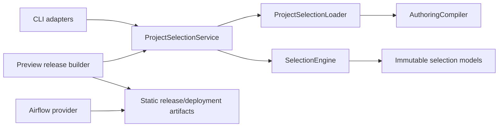

# Feature design: explainable project selectors v1

- Status: IMPLEMENTED
- Owner: dpone maintainers
- Issue: Industrial Self-Service Airflow roadmap, Phase 2
- Target release: TBD
- Last verified: 2026-07-16
- Approval basis: maintainer instruction to continue the frozen roadmap as one goal

## Executive summary

dpone currently validates, previews, and safely samples one pipeline path at a
time. A project with tens or hundreds of workloads therefore requires shell
loops, bespoke Git logic, or direct catalog editing to answer simple questions:

- Which finance workloads changed?
- Which downstream workloads depend on this source?
- Which workloads owned by a team will appear in the Airflow preview?
- Why was a workload selected or excluded?

This feature adds one deterministic selector engine over a bounded, compiled
project graph. The engine is shared by `check`, `airflow preview`, and safe
sample planning. It supports exact selectors for workload id, tag, domain,
owner, source connector, sink connector, and workflow group; upstream and
downstream `+` expansion; named selectors; semantic state comparison; and a
machine-readable explanation for every included or excluded workload.

Selection runs only on the CLI/build plane. The resulting release and Airflow
deployment index are already filtered and static. The Airflow provider does not
parse selectors, scan repositories, compile YAML, read state baselines, or make
network calls.

Beginner examples:

```bash
# Check every workload in the current project.
dpone check .

# Check finance workloads and everything downstream of them.
dpone check . --select 'domain:finance+'

# Preview changed workloads and their downstream dependants.
dpone airflow preview . \
  --select 'state:modified+' \
  --state .dpone-cache/current/selection-state.json

# Safely sample a bounded selected set. Production execution is not added here.
dpone run . \
  --select 'selector:sales_changed' \
  --sample 1000 \
  --target temporary
```

## Personas and customer journey

| Persona | Goal | Current pain | Success signal |
|---|---|---|---|
| New data engineer | Work on one domain without learning catalog internals | Must know every pipeline path | One quoted selector returns a small explained set |
| Data engineer | Validate changed workloads before a PR | Ad hoc Git scripts disagree with build semantics | `state:modified+` compares canonical semantic fingerprints |
| Platform engineer | Define reusable governed scopes | Shell aliases are not reviewable contracts | Named selectors are bounded, schema-validated project data |
| Airflow operator | Know exactly which DAGs will be materialized | Runtime filtering can disagree with parsed topology | Selection is resolved before release materialization |
| Security engineer | Prevent path, state, or expression abuse | Free-form query languages expand attack surface | Exact grammar, confined files, budgets, no eval/Jinja/regex |

### Beginner journey

1. Run `dpone init project --airflow` and create pipelines as before.
2. Add normal metadata (`domain`, `owner`, `tags`) or use scaffold defaults.
3. Run `dpone check . --select 'domain:sales'`.
4. Read a compact list of selected workloads and one reason per workload.
5. Run `dpone airflow preview .` with the same selection.
6. Run a temporary sample only after preview/check succeeds.
7. On an empty or malformed selection, receive one structured error and a
   command that previews the available selector dimensions.

The user does not need to understand packs, DAG specs, release ids, Airflow
TaskGroups, Vault paths, or graph implementation.

### Platform journey

1. Add optional `selectors.yaml` with named selections.
2. Validate it in CI through ordinary static `dpone check`.
3. Supply an explicit prior `selection-state.json` for change-based selection.
4. Inspect JSON explanation and selection fingerprint in CI evidence.
5. Promote the already-selected release by digest. Production Airflow never
   reevaluates selector syntax.

## Scope

### In scope

- One canonical workload-level selector engine.
- Bounded project discovery from explicit top-level `domains/*.yaml` files.
- Pipeline targets and project targets through the same catalog model.
- Methods: `id`, `tag`, `domain`, `owner`, `source`, `sink`, `group`, `state`,
  and `selector`.
- Prefix `+` for all ancestors and suffix `+` for all descendants.
- Repeated `--select` expressions as set union.
- Repeated `--exclude` expressions as union, subtracted after expansion.
- Named selectors in one optional `dpone.selectors.v1` file.
- `state:modified`, `state:new`, and `state:unmodified` against one explicit,
  content-fingerprinted baseline.
- Deterministic direct, graph, state, named-selector, and exclusion reasons.
- Static project checks and combined non-runnable Airflow preview releases.
- Safe selected sample orchestration with a hard selected-workload budget and
  the existing temporary-target safety contract.
- Text and JSON output with stable structured errors.
- A `dpone.selection-report.v1` and `dpone.selection-state.v1` contract.

### Non-goals

- A clone of the complete dbt selection language.
- Comma intersections, wildcard/glob matching, regex, `@`, quantified `N+`, or
  arbitrary Boolean expressions in v1.
- Runtime selection inside Airflow operators or the provider.
- Selecting individual physical chunks, rows, columns, or inline steps.
- Production multi-workload execution from `dpone run --select` in Phase 2.
- Remote state download, Git invocation, or implicit network access.
- Asset-inferred cross-DAG edges; those remain Phase 3.
- Reverse generation or mutation of pipeline/domain sources.

### Assumptions and constraints

- Workload is the minimum independently runnable selector node.
- A domain catalog workload points to exactly one primary authoring source.
- Project discovery reads `dpone.yaml`, optional `selectors.yaml`, and bounded
  direct children of `domains/`; it never recursively scans the repository.
- Pipeline authoring compilation remains the authority for semantic identity
  and source/sink metadata.
- Graph edges come from explicit workload dependencies and DAG wiring in v1.
- Unknown edge endpoints, duplicate workload ids, ambiguous authoring sources,
  cycles, or drift during a selection operation fail closed.
- Selector values are exact, case-sensitive strings after whitespace trimming.
- A state selector requires a local confined baseline. No missing baseline is
  interpreted as "everything changed".

## Public contract

### CLI

Existing single-pipeline invocations remain valid:

```bash
dpone check pipelines/orders_daily
dpone airflow preview orders_daily
dpone run pipelines/orders_daily --sample 1000 --target temporary
```

Project selection is additive:

```bash
dpone check . \
  --select 'tag:finance+' \
  --exclude 'tag:deprecated'

dpone airflow preview . \
  --select 'state:modified+' \
  --state .dpone-cache/current/selection-state.json

dpone run . \
  --select 'domain:sales' \
  --exclude 'tag:deprecated' \
  --sample 1000 \
  --target temporary
```

Options shared by the three surfaces:

| Option | Default | Contract |
|---|---|---|
| `--select EXPR` | all workloads in target | Repeatable union of exact selector expressions |
| `--exclude EXPR` | none | Repeatable union evaluated then subtracted |
| `--state PATH` | current local selection state when required | Confined local `dpone.selection-state.v1` baseline |
| `--selectors PATH` | `selectors.yaml` | Confined named-selector file; loaded only when referenced or present |
| `--max-selected N` | command policy | Hard bound applied before check/build/run |

Command defaults:

- `check`: maximum 1000 workloads.
- `airflow preview`: maximum 500 workloads.
- selected safe sample: maximum 10 workloads and sequential execution in v1.
- A single pipeline target still behaves as a one-node project.
- `run --select` requires `--sample` and `--target temporary`; otherwise exit 4.
- Existing `run --selector` continues to select a process inside one manifest
  and is not an alias for project `--select`.

Text output is concise:

```text
dpone check: OK
- selected: 3 of 12 workloads
- orders_daily: direct domain:sales
- orders_quality: downstream of orders_daily
- sales_snapshot: direct domain:sales
- selection fingerprint: sha256:...
```

JSON includes the complete `selection` report. Paths are project-relative and
no connector credentials, registry bodies, Vault paths, SQL text, or row values
are included.

### Selector grammar

```text
expression  = ["+"] method ":" value ["+"]
method      = "id" | "tag" | "domain" | "owner" | "source" |
              "sink" | "group" | "state" | "selector"
value       = 1*128(selector-safe character)
```

Allowed value characters are ASCII letters, digits, `_`, `-`, `.`, `/`, and
`@`. Values cannot contain whitespace, control characters, `:`, shell syntax,
path traversal segments, URLs, Jinja delimiters, or backslashes.

Graph semantics:

- `domain:sales`: direct matches only.
- `+domain:sales`: direct matches plus all ancestors.
- `domain:sales+`: direct matches plus all descendants.
- `+domain:sales+`: direct matches, ancestors, and descendants.
- Expansion is transitive, cycle-safe, deterministic, and bounded by node/edge
  budgets. Graph reasons record the direct root and shortest path.

Set semantics:

1. No `--select` means all target nodes.
2. Every `--select` is independently evaluated and unioned.
3. Every `--exclude` is independently evaluated and unioned.
4. Exclusions are subtracted after their graph expansion.
5. A workload matched by both sets is excluded and records both reason sets.
6. Empty final selection fails by default with
   `DPONE_SELECTION_EMPTY`; it is never treated as success.

### Named selectors

```yaml
schema: dpone.selectors.v1

selectors:
  sales_changed:
    description: Changed sales workloads and their downstream dependants.
    select:
      - domain:sales
      - state:modified+
    exclude:
      - tag:deprecated
```

Rules:

- Names are exact and unique.
- Named selectors use the same union/subtract semantics.
- A named selector may reference another named selector with
  `selector:<name>` to a maximum depth of 8.
- Cycles, unknown names, more than 100 named selectors, more than 100
  expressions per selector, or duplicate definitions fail closed.
- CLI exclusions are applied after named-selector exclusions.
- Named definitions are source data, not executable templates.

### Project catalog inputs

The loader consumes only:

```text
dpone.yaml
selectors.yaml                 # optional
domains/*.yaml                 # direct children, sorted
pipelines/<id>/pipeline.yaml   # only explicit authoring_source references
explicit folder/recipe/sql dependencies from canonical compilation
```

Domain workload metadata may contain:

```yaml
schema: dpone.domain-catalog.v1
domain: sales

workflow_groups:
  daily:
    workloads: [orders_daily, orders_quality]

workloads:
  orders_daily:
    authoring_source: pipelines/orders_daily/pipeline.yaml
    owner: sales-platform
    tags: [finance, daily]
    depends_on: []

dags:
  sales_daily:
    workloads: [orders_daily, orders_quality]
    wiring:
      mode: explicit
      dependencies:
        orders_quality: [orders_daily]
```

Authoring metadata remains authoritative for pipeline id/domain/owner/tags.
Domain catalog metadata may add tags and groups but cannot contradict a
non-empty authoring domain or owner. Contradictions fail with a structured
catalog error instead of choosing precedence silently.

Source and sink selector values are connector types from the compiled canonical
processes. A workload with several source/sink types matches any exact type and
records which endpoint matched.

### State contract

```yaml
schema: dpone.selection-state.v1
state_fingerprint: sha256:...
nodes:
  - id: orders_daily
    semantic_fingerprint: sha256:...
    graph_fingerprint: sha256:...
```

The state fingerprint excludes itself and volatile provenance. Node order is by
id. `semantic_fingerprint` comes from the canonical authoring compiler.
`graph_fingerprint` covers normalized direct dependency ids. Therefore:

- `state:modified` matches a node present in both states whose semantic or
  graph fingerprint changed.
- `state:new` matches a current node absent from the baseline.
- `state:unmodified` matches a node present with both fingerprints equal.
- Removed baseline-only nodes are reported under `removed`, but cannot be
  selected for current execution.

The current preview writes `selection-state.json` beside
`airflow-index.json`. It is not read by the Airflow loader. An explicit
`--state` path always wins. The state file is loaded and fingerprinted before
selection, then revalidated before materialization to block TOCTOU drift.

### Selection report

```yaml
schema: dpone.selection-report.v1
selection_fingerprint: sha256:...
catalog_fingerprint: sha256:...
state_fingerprint: sha256:...  # null when unused
expressions:
  select: [state:modified+]
  exclude: [tag:deprecated]
selected:
  - id: orders_quality
    source: pipelines/orders_quality/pipeline.yaml
    semantic_fingerprint: sha256:...
    reasons:
      - kind: descendant
        expression: state:modified+
        root: orders_daily
        path: [orders_daily, orders_quality]
excluded: []
unmatched: []
removed: []
```

`selection_fingerprint` covers catalog identity, state identity, normalized
expressions, selected ids, excluded ids, and ordered reasons. It is included in
check JSON, preview release provenance, safe sample summary, and validation
evidence. It is not a credential or deployment identity.

### Python API

The domain API is Airflow-independent:

```python
from dpone.manifest.selection import (
    SelectionEngine,
    SelectionGraph,
    SelectionRequest,
    SelectionReport,
)

report = SelectionEngine().select(graph, request)
```

Application composition uses:

```python
ProjectSelectionService(root=Path(".")).select(...)
```

The engine accepts immutable normalized models and has no filesystem, YAML,
Git, network, Airflow, Vault, or connector SDK dependencies. The project
service injects authoring compiler and confined readers.

### Errors and exit codes

New stable codes:

| Code | Exit | Meaning |
|---|---:|---|
| `DPONE_SELECTION_EXPRESSION_INVALID` | 2 | Grammar/method/value invalid |
| `DPONE_SELECTION_CATALOG_INVALID` | 1 | Project catalog cannot form one graph |
| `DPONE_SELECTION_DUPLICATE_WORKLOAD` | 1 | Workload id has more than one authority |
| `DPONE_SELECTION_EDGE_UNKNOWN` | 1 | Dependency endpoint is absent |
| `DPONE_SELECTION_GRAPH_CYCLE` | 1 | Current graph is cyclic |
| `DPONE_SELECTION_NAMED_NOT_FOUND` | 2 | Named selector does not exist |
| `DPONE_SELECTION_NAMED_CYCLE` | 2 | Named-selector expansion is recursive |
| `DPONE_SELECTION_STATE_REQUIRED` | 2 | State method has no usable baseline |
| `DPONE_SELECTION_STATE_INVALID` | 2 | Baseline schema/digest/content invalid |
| `DPONE_SELECTION_STATE_CHANGED` | 1 | Baseline changed between plan/build |
| `DPONE_SELECTION_EMPTY` | 1 | Final selected set is empty |
| `DPONE_SELECTION_LIMIT_EXCEEDED` | 4 | Node/edge/result budget exceeded |
| `DPONE_SELECTION_RUN_REQUIRES_SAFE_SAMPLE` | 4 | Project run is not temporary bounded sample |
| `DPONE_PIPELINE_PROCESS_AMBIGUOUS` | 2 | A selected workload contains several processes without `--selector` |
| `DPONE_PIPELINE_PROCESS_NOT_FOUND` | 2 | `--selector` does not identify exactly one process |

Errors conform to `dpone.error.v1`. Fixes may suggest quoting the expression,
running a JSON check, choosing an available value, or supplying `--state`.
Autofix never changes catalogs, pipelines, credentials, releases, or state.

## Detailed algorithm

### Project loading and normalization

1. Resolve the target beneath project root. A pipeline target becomes one
   explicit source; a project target uses direct `domains/*.yaml` discovery.
2. Enforce file count, per-file, total-byte, YAML depth, alias, and scalar
   budgets through the existing bounded YAML policies.
3. Parse every domain document in sorted project-relative order.
4. Resolve each workload `authoring_source` with descriptor-confined reads.
5. Compile each source with the existing `AuthoringCompiler` and capture
   `semantic_fingerprint`, metadata, process connector types, and dependencies.
6. Merge non-conflicting catalog tags/groups. Reject duplicate ids, unknown
   groups, metadata conflicts, or multiple primary sources.
7. Normalize explicit workload and DAG wiring edges.
8. Reject unknown endpoints and cycles; calculate sorted adjacency,
   reverse-adjacency, and each node graph fingerprint.
9. Calculate a catalog fingerprint over normalized nodes, edges, and source
   dependency digests.
10. Re-stat/re-digest every consumed source before returning the graph. Drift
    fails closed.

### Expression evaluation

```text
parse request expressions
expand named selectors depth-first with cycle/depth budgets
load and validate baseline only if a state method is present

include_reasons = {}
if no select expressions:
    add every target node with reason all_by_default
else:
    for expression in select expressions in normalized order:
        roots = exact_method_matches(expression)
        add direct reason for each root
        if prefix_plus:
            add ancestors by deterministic breadth-first search
        if suffix_plus:
            add descendants by deterministic breadth-first search

exclude_reasons = evaluate all exclude expressions identically
selected = include_ids - exclude_ids
if selected is empty:
    fail DPONE_SELECTION_EMPTY
if selected exceeds command budget:
    fail DPONE_SELECTION_LIMIT_EXCEEDED

sort nodes by id
sort/dedupe reasons by kind, expression, root, path
compute selection_fingerprint
return immutable report
```

Breadth-first expansion records a shortest path. Equal-length path ties are
resolved lexicographically. Each node is visited at most once per root and
direction. The engine operates in `O(V + E)` after direct indexes are built.

### Check flow

1. Build and select the project graph.
2. Check only selected authoring sources with the existing static/connections/
   live mode.
3. Preserve per-pipeline errors; do not stop after the first invalid workload.
4. A live selected check remains bounded by the existing probe policy and the
   selection result budget.
5. Return `passed=true` only when selection and every selected check pass.
6. Revalidate graph source digests after checks to prevent a mixed-state report.

### Airflow preview flow

1. Build/select/check the graph with static mode.
2. Materialize one verified pack per selected workload.
3. Materialize only DAGs whose selected workload members are non-empty.
4. Preserve edges only when both endpoints are selected. Record pruned boundary
   edges in preview provenance; never create a dangling Airflow edge.
5. Build one environment-neutral release containing all selected specs/packs.
6. Include selection fingerprint and source dependency closure in provenance.
7. Build the standard non-runnable preview deployment and composite index.
8. Write `selection-state.json` beside the index before `_SUCCESS`.
9. Verify every input digest, release artifact checksum, and state digest.
10. Atomically promote the complete preview deployment to local `current`.

No selector syntax or state body is serialized into DAG Python. The Airflow
index contains only the selected static artifacts.

### Safe selected sample flow

1. Require `--sample > 0` and `--target temporary`.
2. Build the selection report with a default maximum of 10 workloads.
3. Run selected workloads sequentially in deterministic id order through the
   existing safe sample command service.
4. Allocate a unique temporary target/run id per workload.
5. Stop scheduling new workloads after the first safety/runtime failure by
   default; already completed results remain evidence, not rollback candidates.
6. Never advance production checkpoint/state and never reuse a production
   target credential.
7. Return a summary with each workload status and the selection fingerprint.

Selected multi-run concurrency is intentionally one in v1. Parallel safe
sampling needs a separate resource/cost contract.

### Failure, retry, and transaction semantics

- Selection planning has no external transaction and no mutation.
- Preview materialization uses immutable release/deployment directories and an
  atomic current-pointer promotion. Partial directories never become current.
- A retry against unchanged source/state produces the same selection, catalog,
  release, and preview deployment identities.
- Changed source or state between plan and materialization fails and requires a
  fresh command; no automatic merge is attempted.
- Process cancellation removes only temporary unpublished preview directories
  and active sample resources governed by existing TTL policy.
- A failed selected sample does not erase previous workload evidence and does
  not run later workloads.

### Edge cases

- Empty project: `DPONE_SELECTION_EMPTY` with scaffold guidance.
- No direct match: expression is listed under `unmatched`; final empty fails.
- One pipeline target plus graph expansion: selection remains that one node.
- Duplicate id across domains: fail before any check/build/run.
- Missing authoring source: catalog invalid; never silently skip.
- Removed baseline node: report only, never execute.
- New node: matches `state:new`, not `state:modified`.
- Metadata-only change: semantic state changes only when canonical semantic
  metadata changes; source formatting alone does not.
- Edge-only change: graph fingerprint marks the workload modified.
- Cycle: fail with a bounded cycle path, no topological partial success.
- State path outside project/cache root or symlink escape: security exit 4.
- Malformed named selector not referenced: static project check still reports it
  because project configuration must be trustworthy.

## Architecture

### Components and responsibilities

| Component | Existing/new | Responsibility | Dependencies |
|---|---|---|---|
| `AuthoringCompiler` | existing | Canonical semantics and source dependencies | manifest compiler |
| `SelectionNode/Graph/Request/Report` | new | Immutable domain contracts | stdlib only |
| `SelectorParser` | new | Exact bounded grammar | selection models |
| `SelectionEngine` | new | Pure indexed match/set/graph evaluation | selection models |
| `SelectionStateComparator` | new | Pure current/baseline status | fingerprints |
| `ProjectSelectionLoader` | new | Confined domain/source/state adaptation | compiler, bounded YAML |
| `ProjectSelectionService` | new | Compose load, select, drift verification | injected loader/engine |
| check/preview/run commands | existing thin adapters | Parse options and render service results | application services |
| Airflow provider | unchanged | Read selected static deployment index | no selector dependency |

### Dependency direction



The pure engine is under `dpone.manifest.selection*`; filesystem and CLI
adaptation are under `dpone.readiness`. There is no dependency from the engine
to commands, Airflow, GitOps adapters, connectors, or runtime.

### Alternatives and tradeoffs

| Alternative | Advantages | Disadvantages | Decision |
|---|---|---|---|
| Copy full dbt selector grammar | Familiar and expressive | Large parser, ambiguous shell semantics, methods irrelevant to workloads | Rejected for v1 |
| Resolve selectors in Airflow provider | Direct DAG filtering | Parse I/O, topology drift, non-reproducible runs | Rejected |
| Reuse process-level DAG graph directly | Existing traversal | Wrong entity boundary; workload may contain inline steps | Rejected |
| Shell/Git-only affected list | Small implementation | No semantic identity, graph reasons, or command parity | Rejected |
| Pure workload graph with build-plane adapter | One entity model, testable, orchestrator-neutral | Requires bounded project loader | Accepted |

### ADR requirement

Required. Selector algebra, workload entity boundary, state identity, and build-
plane-only evaluation are cross-command public contracts. ADR 0017 records the
decision and prevents a future second selector implementation in Airflow or
GitOps compatibility code.

### Quality-budget impact

- Pure model/parser/engine/state modules target less than 250 SLOC each.
- Project loader and orchestration services are split by I/O, graph adaptation,
  and command workflow; no module may exceed the configured hard budget.
- Existing commands gain argument parsing and one service call only.
- No new runtime, provider, connector, or credential imports.
- Architecture metrics must remain within
  `docs/benchmarks/quality_budgets.yml`; existing debt may not grow.

## Market comparison

Checked 2026-07-16 against current official primary documentation.

| System/version | Relevant capability | Observed design | Adopt/reject | Source/date |
|---|---|---|---|---|
| dbt Developer Hub v2.0 | Node methods, graph `+`, state, YAML selectors | Selection methods run before graph and set operators; prefix/suffix `+` expand ancestors/descendants; `ls` previews selection | Adopt method/value and `+` direction. Reject full grammar, wildcard, comma intersection, and `@` in v1 | [Syntax](https://docs.getdbt.com/reference/node-selection/syntax), [graph operators](https://docs.getdbt.com/reference/node-selection/graph-operators), [state](https://docs.getdbt.com/reference/node-selection/state-selection), checked 2026-07-16 |
| Astronomer Cosmos current | Airflow DAG/TaskGroup filtering | `RenderConfig.select/exclude` filters nodes before DAG construction; behavior depends on parser mode and selector parsing can occur during DAG parse | Adopt pre-topology filtering. Improve dpone boundary by materializing the filtered static release before scheduler parse | [Selecting and excluding](https://astronomer.github.io/astronomer-cosmos/guides/translate_dbt_to_airflow/selecting-excluding.html), [FAQ](https://astronomer.github.io/astronomer-cosmos/faq.html), checked 2026-07-16 |
| Apache Airflow 3.3 | DAG/task dependency topology | Airflow recommends stable topology; DAG loading executes Python and discovers top-level DAGs | Keep selection out of scheduler parsing and preserve static selected topology | [DAGs](https://airflow.apache.org/docs/apache-airflow/stable/core-concepts/dags.html), checked 2026-07-16 |
| dlt | Pipeline/resource selection is not the project workload/DAG selection layer specified here | N/A for cross-workload Airflow release selection | N/A | Official product scope reviewed 2026-07-16 |
| Informatica | Managed taskflow object selection is not an open build-plane selector contract comparable to this slice | N/A | N/A | Product layer mismatch |
| Airbyte | Connection/job operations do not provide this workload graph authoring grammar | N/A | N/A | Product layer mismatch |
| Fivetran | Managed connector selection does not expose this build-plane DAG graph contract | N/A | N/A | Product layer mismatch |
| Pentaho | Job entry execution is not the selected immutable Airflow release layer | N/A | N/A | Product layer mismatch |
| Microsoft SSIS | Package/task execution selection is not the repository workload release layer | N/A | N/A | Product layer mismatch |
| gusty | DAG factory configuration is relevant to generation but lacks the content-pinned project state contract required here | Reject scheduler-side project discovery | N/A | No pattern needed beyond existing static provider decision |
| Apache Beam | Transform graph construction is a runtime SDK concern rather than repository workload selection | N/A | N/A | Product layer mismatch |

Facts above are limited to the cited capability. The dpone design comparison is
an architectural inference, not a general product ranking.

## Measurable differentiation

```yaml
axis: deterministic explainable selection without scheduler-side project parsing
scenario: 500 workloads, 1000 explicit edges, state:modified+ selects 50 roots
baseline: current dpone requires per-path commands; Cosmos may resolve selectors while constructing the DAG
metric:
  - selected id parity across check/preview/run planning
  - p95 selection latency
  - scheduler network/filesystem/source parsing calls
  - percentage of selected/excluded nodes with reasons
target:
  parity: 100%
  p95_selection: <=100ms after project graph load
  parse_side_effect_calls: 0
  explained_nodes: 100%
procedure: generate a deterministic project/state fixture, run all three facades 100 times, validate report and provider import trace
artifact: test_artifacts/airflow-selectors-v1/benchmark.json
limitations: does not compare connector runtime throughput or the full dbt grammar
```

## Security, privacy, and operations

- No eval, regex supplied by users, Jinja, shell, dynamic import, URL, or network
  access in selection.
- All files use descriptor-confined project/cache reads with symlink and
  traversal rejection.
- Limits: 1000 workloads, 5000 edges, 100 selectors, 100 expressions per named
  selector, depth 8, path length 1024, expression length 256, total input 16 MiB.
- State and reports contain logical ids, relative paths, connector types, and
  fingerprints only.
- Connection refs, Vault paths, registry bodies, SQL, secret metadata, and
  actual credentials are excluded.
- Logs use selection fingerprint as correlation metadata and never serialize
  the full state body at info level.
- Invalid catalog/state is fail-closed for publish/preview; no partial Airflow
  release is promoted.

## Test and certification plan

| Layer | Scenario | Environment | Expected artifact |
|---|---|---|---|
| Unit | grammar, exact methods, `+`, union/subtract, reasons | local | focused pytest |
| Unit | state new/modified/unmodified/removed | local | focused pytest |
| Contract | named selectors, schema, cycles, limits | local | JSON Schema tests |
| Integration | project loader plus canonical compiler | local fixture | selection report |
| Integration | check/preview/run plan parity | local fixture | identical selected ids/fingerprint |
| Provider | selected static index has no selector parse imports/I/O | Airflow matrix | compatibility smoke |
| Performance | 500 nodes/1000 edges, 100 repetitions | pinned CI runner | benchmark JSON |
| Security | traversal, symlink, YAML bomb, Jinja/shell syntax, state drift | local | negative pytest |
| Live certification | not required; feature is build-plane selection | N/A | explicitly N/A |

Required focused cases:

- every selector method with zero, one, and several matches;
- `+x`, `x+`, `+x+`, diamond graph shortest-path tie, deep graph;
- repeated select union and exclude-after-expansion;
- named recursion, depth, missing reference, malformed unused definition;
- duplicate ids, unknown edges, self edge, cycle, missing source;
- state missing, malformed, digest mismatch, TOCTOU drift, removed nodes;
- exact semantic equivalence across classic/flow/folder;
- source formatting change does not mark modified; semantic/edge change does;
- selected preview release/index contains only selected artifacts and no
  dangling edges;
- safe selected sample budget, sequential stop-on-failure, temporary targets;
- no Airflow/Vault/connector imports or network calls in pure engine/provider;
- schema and generated reference consistency;
- existing single-pipeline CLI behavior remains unchanged.

## Documentation plan

- Beginner tutorial section: select a domain, understand reasons, preview it.
- How-to: changed-only PR preview with explicit state.
- Reference: exact grammar, methods, set order, graph direction, limits.
- Named selector configuration reference.
- Architecture diagram showing build-plane selection and static provider.
- Error catalog pages for all new stable codes.
- Compatibility note distinguishing `--select` from legacy `run --selector`.
- Operator runbook for stale/missing state and selection drift.
- Executable docs tests for every displayed command.

## Rollout and rollback

- Additive options; no existing command needs a selector.
- Existing single-pipeline behavior remains the compatibility baseline.
- Project selection is build-plane only and can be removed without changing
  packs/runtime/provider contracts already published.
- Rollback removes selector options and named/state artifacts; existing release
  and deployment ids remain valid because selected artifacts are ordinary
  release contents.
- Promotion blocks if selected preview and current state fingerprints disagree.
- Phase 3 may add asset-inferred graph edges only through the same normalized
  graph adapter and must preserve reason provenance.

## Agent execution plan

| Agent/role | Owned paths | Read-only paths | Forbidden paths | Dependency |
|---|---|---|---|---|
| Integrator | selection models/engine, shared schemas, commands, docs, changelog | whole repository | `.cursor/**` | approved spec |
| Explorer | none | catalog/compiler/DAG/check/run paths | all writes | mapping only |
| Architect | none | spec/ADR/architecture | all writes | design review |
| Test certifier | tests/benchmark only in isolated worktree | implementation/spec | shared files | approved algorithm |
| Docs/UX reviewer | docs-only in isolated worktree | CLI/spec | code/shared nav | stable CLI |
| Fresh reviewer | none | final diff/evidence | all writes | completed validation |

The current integrator owns all shared semantic files. Parallel writers, when
available, require separate worktrees and disjoint task contracts.

## Approval checklist

- [x] User problem and CJM are clear.
- [x] Algorithm and failure semantics are implementable without guessing.
- [x] Public contracts and compatibility are explicit.
- [x] Architecture and alternatives are justified.
- [x] Relevant market research uses current official sources.
- [x] Claimed differentiation is measurable.
- [x] Tests, evidence, docs, rollout, and rollback are complete.
- [x] Path ownership and integration plan are conflict-safe.
- [x] Maintainer authorized continuation of the frozen roadmap.

## Implementation evidence

- Implementation commit: recorded by the integrating pull request.
- Validation report: `test_artifacts/airflow-selectors-v1/validation.md`.
- Performance and parse-safety evidence:
  `test_artifacts/airflow-selectors-v1/benchmark.json`.
- Focused selector, CLI, safe-sample, schema, architecture, and compatibility
  contracts pass on 2026-07-16.
- Full non-live regression: 4745 passed, 473 skipped. Skipped live profiles are
  not treated as certification.
- Live certification: N/A. Selection is a deterministic build-plane capability
  and does not introduce a connector or source-to-sink route.
