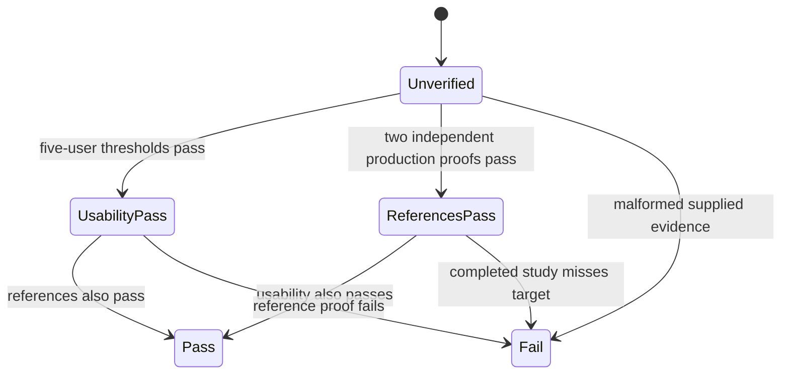

# Feature design: Airflow self-service evidence kit v1

- Status: IMPLEMENTED
- Owner: dpone maintainers
- Issue: Airflow self-service roadmap Phase 4
- Target release: v1.0 standardization
- Last verified: 2026-07-16

## Executive summary

The frozen roadmap defines two external acceptance gates that local unit tests
cannot honestly satisfy: two independent production reference deployments and a
five-person first-time-user study. Today those gates are prose. Evidence can be
collected in incompatible spreadsheets, terminal transcripts, and deployment
folders, making it easy to overstate an incomplete result.

This feature adds one platform-facing command:

```bash
dpone certify self-service \
  --commit-sha "$(git rev-parse HEAD)" \
  --usability-study evidence/usability-study.json \
  --reference-deployment evidence/prod-a \
  --reference-deployment evidence/prod-b \
  --output-dir test_artifacts/airflow-self-service-certification
```

The command is a bounded, local-only evidence projection. It does not run a
pipeline, contact participants, call Airflow, Kubernetes, Vault, databases, or
signature services, and never manufactures `PASS`. Missing evidence is
`UNVERIFIED`; malformed or contradictory supplied evidence is `FAIL`.

## Personas and journey

| Persona | Goal | Current pain | Success signal |
|---|---|---|---|
| Product owner | Prove the 10/15-minute beginner targets | CI quickstarts can be mistaken for human usability | One privacy-safe study report derives every metric from timestamps |
| Research facilitator | Run five consistent sessions | Instructions and fields drift between sessions | One schema names consent, first-time status, commands, help, and artifact digests |
| Platform engineer | Submit a production reference deployment | Run, route, and deployment evidence live in different artifacts | One bounded directory is checked without reimplementing their trust policies |
| Release auditor | Decide whether Phase 4 is complete | “Works in prod” is not reproducible | One JSON/Markdown report separates `PASS`, `FAIL`, and `UNVERIFIED` |

Journey:

1. Run the command with no evidence to see exact missing gates.
2. Conduct at least five consented first-time sessions using the frozen five
   commands and record only pseudonymous metadata and transcript digests.
3. Materialize each production proof directory from existing immutable dpone
   artifacts.
4. Publish a report for the exact source commit.
5. Repair the authoritative input on failure; never edit the generated report.
6. Attach the report to the exact-SHA release audit.

## Scope

### In scope

- `dpone.self-service-usability-study.v1` input schema;
- `dpone.self-service-certification.v1` JSON/Markdown output;
- deterministic derivation of first-DAG, safe-sample, command-count,
  no-Airflow-Python, and unassisted-completion metrics;
- bounded validation of existing release-set, deployment-set, route bundle,
  route attestation verification, Airflow evidence bundle, run identity, and
  correlation artifacts;
- independence policy over deployment IDs and signer identities;
- create-only publication, structured errors, docs, tests, and an honest local
  `UNVERIFIED` artifact.

### Non-goals

- recruiting participants, collecting consent, recording terminals, or signing
  external evidence;
- accepting names, email addresses, raw transcripts, credentials, row data, or
  Vault paths;
- executing a live route or validating a signature over the network;
- replacing route certification, deployment identity, Airflow evidence, or
  exact-SHA release audit services;
- treating CI, mocked sessions, maintainers, or repeat dpone users as first-time
  participants.

## Public contracts

### CLI

```bash
dpone certify self-service \
  --commit-sha <full-lowercase-40-or-64-hex-sha> \
  [--usability-study <study.json>] \
  [--reference-deployment <proof-dir>]... \
  --output-dir <new-directory> \
  [--max-age-hours 168] \
  [--format md|json]
```

Exit codes:

| Code | Meaning |
|---:|---|
| `0` | Report is valid; overall status may still be `UNVERIFIED` |
| `1` | Supplied evidence is invalid or a complete study misses acceptance targets |
| `2` | Unsafe path, invalid CLI input, or immutable output conflict |

`--reference-deployment` is repeatable and non-recursive. The command reads only
well-known files. A no-evidence invocation is the recommended readiness check;
it returns `0` with actionable `UNVERIFIED` blockers.

### Usability study input

```yaml
schema: dpone.self-service-usability-study.v1
protocol: airflow_first_dag_and_safe_sample_v1
target_commit: 0123456789abcdef0123456789abcdef01234567
facilitator_ref: research-team-1
started_at: 2026-07-16T09:00:00Z
completed_at: 2026-07-16T12:00:00Z
sessions:
  - session_id: session-01
    participant_ref: sha256:...
    first_time_dpone_user: true
    consent_recorded: true
    started_at: 2026-07-16T09:00:00Z
    dag_preview_at: 2026-07-16T09:07:30Z
    safe_sample_at: 2026-07-16T09:12:10Z
    finished_at: 2026-07-16T09:12:10Z
    outcome: passed
    commands_used: 5
    assistance_events: 0
    authored_airflow_python: false
    transcript_sha256: sha256:...
    blocker_codes: []
```

Rules:

- participant refs and transcript digests are canonical lowercase SHA-256;
- raw transcripts remain in research-controlled storage and are not read;
- every counted participant is consented and a first-time dpone user;
- timestamps are offset-aware, ordered, and bounded to 24 hours per session;
- sessions and participants are unique;
- study target commit equals the CLI commit;
- unknown fields and secret-looking free-form notes are not supported.

Derived per-session success requires all of:

- `outcome=passed`;
- DAG preview within 600 seconds;
- safe sample within 900 seconds;
- at most five commands;
- zero assistance events;
- no authored Airflow Python.

Study status is:

- `UNVERIFIED` for fewer than five valid sessions;
- `PASS` for at least five sessions when at least 80% satisfy the complete
  success predicate, at least 80% meet each time target, and 100% authored no
  Airflow Python;
- `FAIL` when at least five valid sessions exist but a target is missed;
- input-level `FAIL` when consent, identity, timestamp, commit, or privacy
  contracts are invalid.

### Reference deployment proof directory

```text
reference-prod-a/
  release-set.json
  deployment-set.json
  route_certification_bundle.json
  route-attestation.json
  route-attestation-verification.json
  airflow-evidence-bundle.json
```

The reader never scans the directory. It reuses existing pure parsers and
policies and requires:

- content-valid exact-commit release-set;
- content-valid runnable `environment` deployment with `environment=production`;
- deployment references that match release, runtime image, binding, registry,
  and credential-runtime identities in the Airflow run identity;
- `init_fetch` with checksum verification and production attestation policy;
- a passed production route proof from the existing route evidence reader;
- release-policy Airflow evidence with all required artifacts passed;
- complete Airflow run identity and complete correlation;
- observed pod UID, namespace, service account, image digest, dpone run ID, and
  runtime evidence digest;
- route proof deployment/release IDs equal Airflow and deployment-set IDs.

Reference-deployment status is `PASS` only with at least two valid proof sets,
two distinct deployment IDs, and two distinct verified signer identities.
Fewer valid proof sets are `UNVERIFIED`. Any malformed supplied proof set is
`FAIL` and cannot be masked by a valid set.

### Output

`dpone.self-service-certification.v1` contains:

- expected commit, overall status, and input-failure flag;
- usability counts, derived rates, p50 durations, thresholds, source digest,
  and blockers;
- safe reference proof identities/digests and independence counts;
- no participant transcript, name, email, secret, Vault path, registry body,
  signed URL, source row, or credential value.

Overall status is `PASS` only when both axes pass, `FAIL` if either supplied axis
fails, and otherwise `UNVERIFIED`.

## Algorithm

```text
validate commit, bounds, output path

if usability study supplied:
    read one bounded strict JSON object
    validate schema, commit, privacy fields, unique identities, timestamps
    derive durations from timestamps
    derive per-session success and aggregate rates/p50
    PASS only when sample >= 5 and every threshold is satisfied
else:
    usability = UNVERIFIED

for each explicit reference directory:
    read only six well-known files through no-follow bounded I/O
    validate release/deployment content identities and exact commit
    reuse RouteCertificationEvidenceReader for production route proof
    parse AirflowRunIdentity and AirflowCorrelation
    validate required Airflow evidence, pod observation, and cross-identities
    normalize safe proof or emit failure

FAIL dominates supplied proof sets
PASS references only when two deployment and signer identities are independent
overall = PASS iff usability PASS and references PASS
publish deterministic JSON/Markdown to a create-only staged directory
```

### State model



The report is a fresh projection, not mutable certification state. Expired
attestations or stale route claims downgrade on a new output publication.

### Retries, concurrency, and failure recovery

- no internal retries or network calls;
- duplicate input directories are de-duplicated lexically;
- one malformed reference does not hide diagnostics for other references, but
  makes publication exit `1`;
- output is staged and renamed once; exact republish is a no-op and different
  bytes are a conflict;
- process failure before rename leaves no published report;
- recovery is to regenerate the source study or upstream immutable evidence and
  publish to a new directory.

## Architecture

| Component | Responsibility | Reuse/dependency |
|---|---|---|
| `SelfServiceUsabilityReader` | Strict privacy-safe study parsing and metric derivation | bounded JSON, pure datetime policy |
| `ReferenceDeploymentEvidenceReader` | Cross-check deployment, route, Airflow run and pod evidence | deployment identity, route reader, run identity, correlation |
| `SelfServiceCertificationPolicy` | Combine two independent axes | normalized values only |
| `SelfServiceCertificationService` | Orchestrate and publish JSON/Markdown | injected readers, policy, clock |
| `dpone certify self-service` | Thin CLI adapter and structured errors | service facade |

Dependency direction remains contracts/readiness -> ops policy -> service -> CLI.
There is no Airflow, Vault, Kubernetes, connector, or vendor SDK import. Existing
route and Airflow evidence remain authoritative; this feature only projects them.

No ADR is required because dependency direction, evidence authority, and
release/deployment identity are unchanged.

## Alternatives

| Alternative | Decision |
|---|---|
| Mark CI quickstart as usability PASS | Rejected: automation is not a first-time human |
| Maintain a spreadsheet manually | Rejected: no schema, reproducibility, privacy boundary, or exact commit |
| Add a second production verifier | Rejected: violates DRY and can disagree with route/Airflow trust contracts |
| Upload transcripts into dpone | Rejected: unnecessary privacy and secret-leakage risk |
| One bounded projection over existing proof | Adopted |

## Market research

Official primary sources were checked on 2026-07-16.

| System | Observed design | Adopt / reject | Source |
|---|---|---|---|
| dlt/dltHub 1.28.1 | Local smoke run precedes remote run; code deployment and configuration are versioned separately | Adopt local-first proof and separate environment evidence; reject requiring authored Python in dpone beginner path | [deployment overview](https://dlthub.com/docs/hub/pipeline-operations/deployments) |
| Fivetran | Guided source/destination forms use Save & Test before initial sync | Adopt explicit staged success points; retain CLI/GitOps portability instead of managed-UI-only evidence | [quickstart](https://fivetran.com/docs/getting-started/quickstart) |
| Astronomer Cosmos | Preconfigured quickstarts are separated from bring-your-own-project guides | Adopt a fixed newcomer protocol plus a separate platform reference path | [getting started](https://astronomer.github.io/astronomer-cosmos/getting_started/) |
| Airbyte | Connector setup guides provide stepwise source configuration; incorrect resources may be warned/skipped for some connectors | Adopt guided setup; reject silent/skipped resource behavior as success | [official connector guide](https://github.com/airbytehq/airbyte/blob/master/docs/integrations/sources/github.md) |
| Microsoft SSIS | Projects/packages can be validated before execution; SSISDB retains operational events and environment references | Adopt validate-before-run and deployment evidence; reject GUI-heavy workflow as the dpone default | [deployment model](https://learn.microsoft.com/en-us/sql/integration-services/packages/deploy-integration-services-ssis-projects-and-packages?view=sql-server-ver17) |
| Informatica | Wizard-driven task authoring can save progress | N/A for machine-readable external evidence; no comparable open artifact contract identified | [task guide](https://docs.informatica.com/content/dam/source/GUID-0/GUID-0E9D5DC7-01A2-4D15-816E-3F3515FF9D2D/48/en/CDI_October2023_Tasks_en.pdf) |
| Pentaho | N/A | No directly relevant current self-service evidence contract | N/A |
| gusty | N/A | DAG generation, not human/deployment evidence | N/A |
| Apache Beam | N/A | Portable execution, not this acceptance layer | N/A |

## Measurable differentiation

```yaml
axis: evidence-backed beginner and production readiness
scenario: first-time engineer creates a dpone DAG and safe sample; same release runs in two production KPO deployments
baseline: prose claims plus executable CI quickstart
metric: first DAG seconds, safe sample seconds, complete unassisted success rate, independent deployment proof count
target: p80 first DAG <=600s; p80 safe sample <=900s; >=80% complete without help; 0 Airflow Python; 2 independent production proofs
procedure: five consented first-time sessions plus two existing deployment-bound proof directories
artifact: test_artifacts/airflow-self-service-certification/self-service-certification.json
limitations: local tests validate the collector; only real people and approved production environments can make external axes PASS
```

## Test and security plan

- study: 0/1/4/5/6 sessions, exact thresholds, timestamp ordering, duplicate
  participant/session, consent false, repeat user, Python authored, help event,
  malformed digest, commit mismatch, oversized/duplicate-key JSON;
- reference: valid one/two proofs, same deployment, same signer, wrong release,
  tampered deployment ID, preview/non-production deployment, unpinned identity,
  failed required Airflow artifact, incomplete correlation, pod mismatch, stale
  route proof, symlink and partial directory;
- publication: exact no-op, changed bytes conflict, parent symlink, concurrent
  destination, interruption cleanup;
- privacy: reject unexpected free-form fields and assert outputs contain no
  participant details, raw transcript, secret-looking values, Vault paths, or
  absolute source paths;
- broad repository lint, type, import, module/layer, non-live, docs, schema,
  package, and Airflow public-contract gates.

Live production and human study checks are `UNVERIFIED` unless actual approved
inputs are supplied. Synthetic passing fixtures prove policy logic only.

## Documentation and rollout

- add a facilitator protocol and a reference-deployment operator checklist;
- link from First Airflow DAG, self-service overview, architecture, backlog, and
  release audit docs without adding a sixth beginner command;
- generate schema and CLI references from producers;
- ship catalog-only `UNVERIFIED` evidence first;
- collect human and production evidence after exact-SHA CI;
- rollback by removing the additive command and schemas; no manifest, runtime,
  pack, deployment, or provider migration is required.

## Approval basis

The maintainer explicitly instructed Codex to continue the frozen roadmap as one
goal and implement all internally feasible work. External evidence remains a
separate non-fabrication gate.

## Implementation evidence

- CLI: `dpone certify self-service` with JSON/Markdown output and stable exit
  semantics;
- schemas: `dpone.self-service-usability-study.v1` and
  `dpone.self-service-certification.v1` in the public GitOps catalog and frozen
  Airflow v1 baseline;
- tests: privacy, thresholds, independent references, tampering, cross-identity,
  immutable publication, CLI and schema contracts;
- local projection:
  `test_artifacts/airflow-self-service-evidence-v1/publication/` is
  `UNVERIFIED` because no real participants or approved production references
  were supplied;
- validation report:
  `test_artifacts/airflow-self-service-evidence-v1/validation-report.md`.
