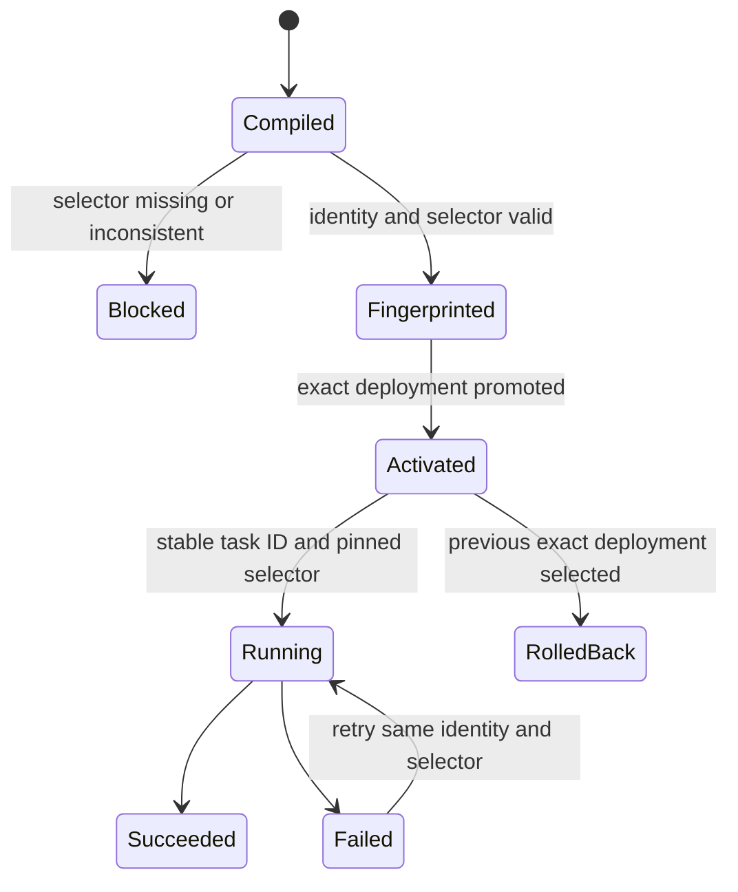
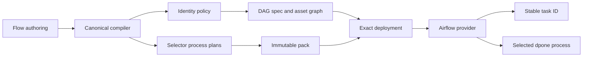

# Feature design: Airflow single-process workload identity v1

- Status: APPROVED
- Owner: dpone maintainers
- Issue: Canonical Airflow pack recovery and self-service migration
- Target release: 0.73.32
- Last verified: 2026-08-01

## Executive summary

Moving an existing one-process self-service pipeline between `classic`, `flow`,
and `folder` authoring modes must not create a new Airflow task identity.
Airflow persists task-instance history under the DAG and task identity, so an
unnecessary `workload__process` rename fragments operational history and makes a
semantics-preserving authoring migration look like a new task.

The runtime safety contract is independent: every newly compiled self-service process
must retain its non-empty selector in the DAG spec, compact process plan, hook
commands, and `dpone run --selector` command. This design therefore preserves the
existing workload-level `node_id` when a self-service authoring source contains
exactly one process, while keeping execution selector-bound and fail-closed.

Measurable outcome: a single-process pipeline can change self-service authoring
syntax with the same generated Airflow task ID, while release artifacts prove
that exactly one selected process is executable.

## Personas and customer journey

| Persona | Goal | Current pain | Success signal |
|---|---|---|---|
| Data engineer | Move a workload to self-service authoring | Migration unexpectedly renames the Airflow task | DAG preview shows the previous task identity |
| Airflow operator | Retain task history and alert continuity | A structural authoring change creates a second task history | Existing task ID remains addressable after promotion |
| Platform engineer | Prevent accidental whole-workload execution | Preserving identity previously removed the selector | DAG spec, pack and runtime argv carry the same selector |
| Reviewer | Prove that migration is semantic, not behavioral | Identity and execution scope were coupled in one boolean | Reconcile evidence reports stable IDs and selector parity |

Journey: author or migrate a one-process pipeline, run `dpone check`, preview the
DAG, inspect the stable node ID and explicit selector, reconcile immutable packs,
promote the exact deployment, and roll back by activating the previous exact
deployment if live acceptance fails.

## Scope

### In scope

- Stable workload-level DAG node identity for an explicit self-service
  `classic`, `flow`, or `folder` source with exactly one process.
- Mandatory selector-preserving compact plans and DAG-spec nodes for that flow.
- One shared pure Airflow identity policy used by DAG-spec and asset-graph
  builders.
- Compatibility tests for task IDs, commands, hooks, process plans, asset edges,
  preview and Airflow 2.10/3.x materialization.
- Migration documentation and immutable reconcile evidence.

### Non-goals

- Hiding multiple logical processes behind one Airflow task.
- Changing legacy selector-less manifest task identity.
- Reinterpreting an explicit `dpone.batch.v1` without self-service authoring
  metadata as a single-workload node.
- Changing runtime state, retries, checkpoints, DQ, lineage or connector routes.
- Parsing authoring sources in the Airflow scheduler.
- Automatically renaming an explicitly multi-process or batch node.

### Assumptions and constraints

- The canonical compiler emits a stable selector for every self-service process.
- A single-process self-service source has one independently retryable logical operation, so
  keeping the workload node identity does not contract multiple retry units.
- DAG parsing remains local, deterministic and free of network or credential I/O.
- The standing maintainer instruction to complete the self-service migration
  without semantic loss is approval for this compatibility refinement.

## Public contract

### CLI

No command or option changes. `dpone airflow preview`, `dpone airflow build` and
`dpone gitops reconcile` emit a single-process self-service node shaped as follows:

```yaml
node_id: marketing_sample_web_sync
workload_id: marketing_sample_web_sync
selector: marketing_datamarts.sample_web_sync
```

The runtime command remains selector-bound:

```text
dpone run <runtime-manifest> --selector marketing_datamarts.sample_web_sync
```

Missing or inconsistent selectors block build/materialization with an existing
structured Airflow selector error and a non-zero exit code.
An explicit `wiring.dependencies` reference to an unknown node is a publication
blocker; it is never downgraded to a warning that silently drops the edge.

### Python API

No new supported public import is introduced. The identity policy is an internal
pure build-plane service under `dpone.gitops`; provider APIs and schemas remain
additive and source compatible.

### Manifest/schema

No manifest schema change. The policy applies when the canonical compilation
contains exactly one process and the source declares self-service
`authoring.mode: classic|flow|folder` (or retains the equivalent compiled
`source_kind=dpone.flow.v1`). Multi-process self-service sources and explicit
batches without that authoring metadata retain `workload_id__process_name` node
IDs. Legacy selector-less manifests retain their existing workload node.

### Artifacts and evidence

The DAG-spec fingerprint covers both the stable `node_id` and non-empty
`selector`. Newly generated compact plans also carry `dag_node.node_id`; it is
additive in the schema so existing packs remain readable, while a new provider
validates it when present. The pack fingerprint covers that identity, the
selector-keyed process plan, hook argv and runtime argv. Reconcile evidence must
record the exact pack/DAG counts, digests and blocker inventory; generated
artifacts are never hand-edited.

### Compatibility and migration

- Legacy selector-less single manifests: unchanged.
- One-process self-service classic/flow/folder: workload-level node/task
  identity, explicit selector.
- Explicit batch without self-service authoring metadata: process-level node
  identity, even when it contains one process.
- Multi-process self-service or batch: process-level node/task identity and selector.
- A selected node referencing a selector-less or incompatible pack fails closed.
- Rollback activates the previous immutable release/deployment; no artifact is
  patched in place.

## Detailed algorithm

1. Load the canonical manifest metadata once through `ManifestLoaderRouter`.
2. Determine execution scope independently from presentation identity:
   every flow/batch process with a selector remains selector-scoped.
3. Resolve node identity through one pure policy:
   one-process self-service source uses `workload_id`; otherwise a
   selector-scoped process uses `workload_id__process_name`; legacy unselected
   workloads use `workload_id`.
4. Build every compact process plan without clearing or synthesizing selectors.
5. Require a selector for every compiled flow/batch plan and include it in hook
   and runtime argv.
6. Build DAG-spec and asset-graph nodes with the same identity policy.
7. Fingerprint packs and DAG specs; publish only a blocker-free immutable set.
8. Provider resolves `process_plans[selector]`, materializes the stable task ID,
   and rejects missing, duplicate or inconsistent selection.
9. Retry/replay use the same DAG ID, task ID, release, deployment and selector.
10. Rollback changes only the desired exact deployment ID.

### Pseudocode

```text
manifest = load_metadata(workload.manifest)
for process in manifest.processes:
    selector = require_selector_if_compiled_flow_or_batch(process)
    node_id = workload_id if is_single_process_self_service_source(manifest)
              else workload_id + "__" + process.name if selector
              else workload_id
    emit_dag_node(node_id, selector)
    emit_process_plan(node_id, selector, selector_bound_commands)

provider:
    plan = require(pack.process_plans[node.selector])
    require(plan.dag_node.node_id == node.node_id)
    task_id = stable_task_id(node.node_id)
    execute(plan.runtime_command)
```

### State machine



No new runtime state is introduced. The transaction and evidence ordering of the
selected dpone process remain unchanged.

### Edge cases

- Empty process list remains an authoring blocker.
- A one-process self-service source with a missing selector is blocked; it never
  falls back to whole-manifest execution.
- Duplicate selectors, node IDs or final Airflow task IDs are blocked.
- Adding a second process is an intentional graph-shape change and creates
  process-scoped IDs; migration evidence must expose that change.
- Removing a process never aliases its history to another process.
- Invalid explicit dependency references remain blockers.
- Null/empty source data, schema drift and connector failures retain current
  runtime semantics and cannot change task identity.

## Architecture

### Components and responsibilities

| Component | Existing/new | Responsibility | Dependencies |
|---|---|---|---|
| `AirflowProcessIdentity` resolver | new | Pure node-ID and selector requirement decisions | Manifest value objects only |
| Compact process-plan builder | changed | Preserve selector plans and commands | Canonical manifest loader |
| DAG-spec builder | changed | Apply identity policy and publish selector | Identity policy |
| Asset-graph builder | changed | Use the same node IDs for inferred edges | Identity policy |
| Provider materializer | changed | Resolve selector plan and validate pack/spec node identity | Static spec and pack |

### Ports, adapters, and composition root

The policy is pure build-plane code and imports neither Airflow nor connectors.
Manifest models remain connector/orchestrator neutral. Builders receive the
loaded manifest and call the policy; the provider remains the parse-plane
composition root and consumes only immutable artifacts.

### Data and control flow



### Alternatives and tradeoffs

| Alternative | Advantages | Disadvantages | Decision |
|---|---|---|---|
| Always `workload__process` | Uniform generated names | Breaks task history for semantics-preserving self-service migrations | Rejected |
| Remove selector for one process | Preserves old task shape | Can execute a broader manifest and contradicts selector-safe contracts | Rejected |
| Stable node ID plus explicit selector | Preserves history and execution isolation | Requires separate identity and scope policies | Adopted |
| Add an author-controlled task-ID override | Flexible | Creates collision/migration governance burden | Rejected for v1 |

### ADR requirement

No new ADR is required. This refines the implemented Airflow step-visibility
contract by separating identity from execution scope; it does not add a new
runtime architecture or dependency direction. This specification is the
normative compatibility record.

### Quality-budget impact

One cohesive pure policy module and focused builder changes are expected. Every
changed Python module remains below the repository `400` SLOC hard limit and the
global average clustering gate remains `<=0.180`; no connector or Airflow import
edge is added.

## Market comparison

Primary sources were checked on 2026-08-01.

| System/version | Relevant capability | Observed design | Strength | Limitation | Adopt/reject | Source/date |
|---|---|---|---|---|---|---|
| Apache Airflow 3.3 | Task-instance identity and serialized DAGs | Task state is associated with a DAG/task run; scheduler uses serialized DAGs | Stable orchestration identity and parse/runtime separation | Does not define dpone authoring migration rules | Adopt stable task identity and static artifact boundary; [tasks](https://airflow.apache.org/docs/apache-airflow/stable/core-concepts/tasks.html), [serialization](https://airflow.apache.org/docs/apache-airflow/stable/administration-and-deployment/dag-serialization.html) |
| Astronomer Cosmos 1.x | Compiled graph to per-node Airflow tasks | Common modes create one task per dbt node; newer watcher modes trade task granularity for speed | Explicit graph/execution-mode choice | Does not preserve a pre-Cosmos workload task identity for dpone | Adopt explicit node-to-task projection; reject runtime reparsing; [execution modes](https://astronomer.github.io/astronomer-cosmos/getting_started/execution-modes.html) |
| dlt | N/A | Pipeline/load execution, not an Airflow compiled task-identity contract | N/A | No comparable DAG node migration surface | N/A |
| Informatica | N/A | Managed workflow repository | N/A | No open Airflow task-identity contract | N/A |
| Airbyte | N/A | Connection/sync job model | N/A | No Airflow DAG-spec identity projection | N/A |
| Fivetran | N/A | Managed connector syncs | N/A | No user-controlled Airflow task identity | N/A |
| Pentaho | N/A | Transformation/job steps | N/A | No Airflow serialized-DAG contract | N/A |
| Microsoft SSIS | N/A | Package/task execution | N/A | No Airflow task-instance compatibility surface | N/A |
| gusty | N/A | YAML DAG generation | Potentially relevant graph authoring | No selected-process pack contract used by dpone | No pattern needed for this refinement |
| Apache Beam | N/A | Distributed data-processing graph | Stable transform graph is a different runtime abstraction | No Airflow task-history migration contract | N/A |

## Measurable differentiation

```yaml
axis: semantics-preserving self-service migration
scenario: one-process self-service pipeline migrated between classic, flow, and folder modes
baseline: previous exact DAG spec and provider task inventory
metric: changed task IDs; selector-less newly compiled process plans
target: 0 changed task IDs; 0 selector-less flow plans
procedure: reconcile both sources, compare normalized DAG/task identity, inspect pack argv, run Airflow 2.10/3.x materialization tests
artifact: immutable reconcile report plus compatibility test evidence
limitations: explicit batches without self-service authoring metadata and multi-process graph changes remain process-scoped
```

## Security, privacy, and operations

Selectors are identifiers, not credentials. They are validated and emitted as
argv by the build plane; the provider never concatenates remote input into shell
text. No network, Vault, database or object-storage access occurs during parse.
Hash mismatch, missing selector or incompatible pack is fail-closed. Rollback and
forensics use exact release/deployment IDs and bounded retained generations.

## Test and certification plan

| Layer | Scenario | Environment | Expected artifact |
|---|---|---|---|
| Unit | Identity policy across legacy, self-service modes, and explicit batches | Local | Focused pytest result |
| Contract | DAG node and compact plan retain selector with stable node ID | Local | JSON assertions and golden diff |
| Integration | Provider materializes same task ID and selected runtime argv | Airflow 2.10/3.x CI | Matrix report |
| Migration | Old and new authoring produce the same curated edges/task IDs | example-workloads reconcile | Semantic parity evidence |
| Live certification | Exact deployment loads expected DAG IDs and runtime smoke | Dev Airflow | Airflow run/XCom and cache status |
| Performance | No extra task or parse-time I/O for one-process self-service sources | Local/CI | Task count and parse contract |
